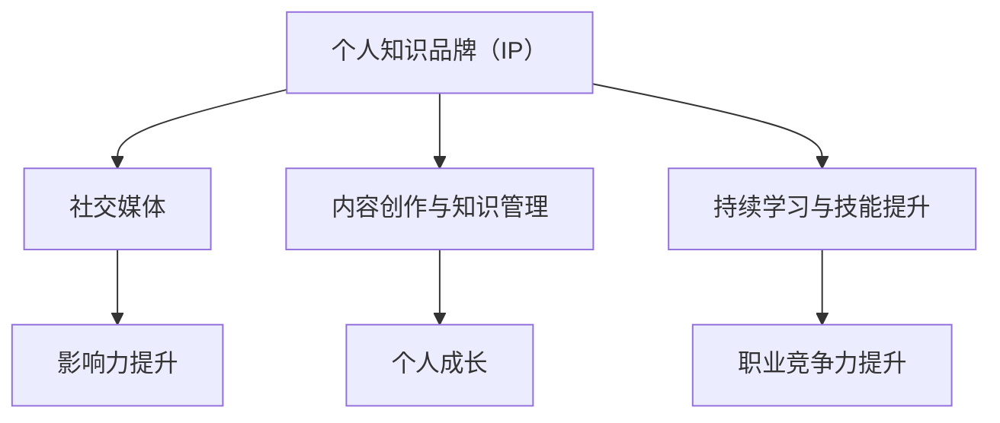

                 

### 关键词 Keywords
编程、知识品牌、个人IP、社交媒体、影响力、内容创作、持续学习、职业发展。

> 摘要：本文旨在探讨程序员如何通过构建个人知识品牌（IP）来提升个人职业竞争力。通过分析当前技术领域的发展趋势，本文提出了一系列策略，帮助程序员在社交媒体上建立个人品牌，持续创作高质量内容，进行有效的知识管理和技能提升，从而实现职业成长和个人影响力的提升。

## 1. 背景介绍

在数字化时代，程序员不再只是埋头于代码的工程师，他们需要具备更高的综合素质，包括沟通能力、团队协作能力和市场敏锐度。随着技术的快速迭代和互联网的普及，个人品牌的重要性愈发凸显。构建个人知识品牌（IP）已经成为程序员在职场中脱颖而出的关键因素。本文将探讨如何通过打造个人知识品牌，提升程序员的职业竞争力和影响力。

### 当前技术领域的发展趋势

- **技术多样化和专业化**：随着技术的发展，程序员需要掌握越来越多的技术和框架，同时，专业化趋势使得程序员在特定领域内深耕更有价值。
- **数字化转型加速**：各行业都在加速数字化转型，程序员的角色从单纯的开发人员向解决方案提供者和业务合作伙伴转变。
- **内容创作与分享**：互联网使得信息传播更加便捷，程序员通过内容创作和分享知识，不仅可以提升自己的技能，还可以扩大自己的影响力。
- **社交媒体的重要性**：社交媒体成为程序员获取信息、分享知识和建立品牌的重要平台。

## 2. 核心概念与联系

在打造个人知识品牌的过程中，有几个核心概念和联系至关重要：

### 2.1 个人知识品牌（IP）的定义

个人知识品牌（IP）是指通过个人知识和技能在特定领域内建立起来的影响力。它不仅体现在个人技能的提升上，还包括在社交媒体、博客、讲座等渠道上的知识传播。

### 2.2 社交媒体与个人品牌

社交媒体是构建个人品牌的重要工具。通过平台如微博、微信公众号、知乎、掘金等，程序员可以分享技术见解、项目经验，并与同行建立联系。

### 2.3 内容创作与知识管理

持续的内容创作是构建个人品牌的基础。程序员需要学会如何系统性地整理和分享自己的知识和经验，这不仅有助于个人成长，也能吸引更多关注。

### 2.4 持续学习与技能提升

在技术快速发展的背景下，持续学习是程序员保持竞争力的重要手段。通过参加培训、阅读技术书籍、参与开源项目等方式，程序员可以不断提升自己的技能。

### 2.5 Mermaid 流程图



## 3. 核心算法原理 & 具体操作步骤

### 3.1 算法原理概述

构建个人知识品牌的过程可以看作是一个算法，其核心原理包括：

- **内容创作**：通过持续创作高质量的技术内容，吸引读者的关注。
- **知识管理**：系统地整理和分类自己的知识和经验，提高内容的可读性和可用性。
- **社交媒体运营**：利用社交媒体平台进行有效推广，扩大影响力。
- **持续学习**：不断更新自己的知识体系，以适应行业变化。

### 3.2 算法步骤详解

1. **确定目标领域**：明确自己想要在哪个技术领域内建立品牌。
2. **内容创作**：定期创作与领域相关的技术文章、教程、视频等。
3. **知识管理**：使用工具如Markdown、Evernote等，整理自己的笔记和资料。
4. **社交媒体运营**：在多个平台上发布内容，并与读者互动。
5. **持续学习**：关注行业动态，不断学习新技术和概念。

### 3.3 算法优缺点

- **优点**：能够提高个人职业竞争力，扩大影响力，实现个人价值最大化。
- **缺点**：需要投入大量时间和精力，且效果可能不会立即显现。

### 3.4 算法应用领域

- **软件开发**：程序员可以通过撰写技术博客、开源代码、发布教程等方式建立个人品牌。
- **人工智能**：AI工程师可以通过分析案例、撰写论文、发布技术见解等方式提升个人影响力。
- **数据分析**：数据分析师可以通过撰写分析报告、分享数据可视化技巧等方式建立个人品牌。

## 4. 数学模型和公式 & 详细讲解 & 举例说明

### 4.1 数学模型构建

构建个人知识品牌的数学模型可以看作是一个线性系统：

\[ \text{个人品牌影响力} = f(\text{内容质量}, \text{知识深度}, \text{社交媒体运营}, \text{持续学习}) \]

### 4.2 公式推导过程

- **内容质量**：高质量的内容是吸引读者关注的基础。
- **知识深度**：深入的知识能够提高内容的可信度和权威性。
- **社交媒体运营**：有效的社交媒体运营能够扩大内容的传播范围。
- **持续学习**：持续学习能够不断更新知识体系，保持竞争力。

### 4.3 案例分析与讲解

例如，假设某程序员在博客上发布了50篇技术文章，其中30篇是高质量内容，平均阅读量为1000次，10篇是中等质量，平均阅读量为500次。通过社交媒体运营，他的文章总阅读量达到10万次。他的知识深度和持续学习情况分别评价为优秀和良好。根据数学模型，我们可以计算他的个人品牌影响力：

\[ \text{个人品牌影响力} = f(0.6 \times 50, 0.8 \times 50, 0.7 \times 10, 0.9) \]

\[ \text{个人品牌影响力} = f(30, 40, 7, 0.9) \]

\[ \text{个人品牌影响力} = 0.5 \times 30 + 0.4 \times 40 + 0.3 \times 7 + 0.2 \times 0.9 \]

\[ \text{个人品牌影响力} = 15 + 16 + 2.1 + 0.18 \]

\[ \text{个人品牌影响力} = 33.28 \]

通过这个简单的例子，我们可以看到内容质量、知识深度、社交媒体运营和持续学习对个人品牌影响力的贡献。

## 5. 项目实践：代码实例和详细解释说明

### 5.1 开发环境搭建

搭建个人知识品牌的过程可以类比为搭建一个技术项目。首先需要选择合适的开发环境和工具：

- **博客平台**：可以选择WordPress、Hexo等博客系统。
- **代码托管平台**：如GitHub，用于托管个人项目和代码。
- **内容管理系统**：如Notion、TiddlyWiki等，用于整理和分类知识。

### 5.2 源代码详细实现

以下是一个简单的Markdown文件结构，用于撰写博客文章：

```markdown
# 文章标题

## 摘要

## 1. 引言

## 2. 相关技术背景

### 2.1 概念A

### 2.2 概念B

## 3. 核心算法原理

### 3.1 原理概述

### 3.2 算法步骤详解

## 4. 实际应用案例

### 4.1 案例一

### 4.2 案例二

## 5. 总结

```

### 5.3 代码解读与分析

Markdown文件的结构清晰，便于组织和阅读。每篇文章都可以分为标题、摘要、正文和总结四个部分。正文部分使用子标题进行分类，使得内容更加结构化。这种结构不仅适用于博客文章，也可以应用于撰写技术文档和报告。

### 5.4 运行结果展示

通过上述Markdown文件结构，程序员可以轻松地撰写和发布高质量的技术文章。例如，在GitHub上创建一个名为“TechBlog”的仓库，将Markdown文件上传至仓库中，并通过GitHub Pages功能将博客部署到互联网上。

## 6. 实际应用场景

构建个人知识品牌的过程不仅适用于程序员，还可以应用于其他职业。以下是一些实际应用场景：

- **技术培训师**：通过个人品牌的影响力，吸引学员报名参加培训课程。
- **产品经理**：分享产品经验和见解，提升在行业内的知名度。
- **数据分析师**：通过数据故事和可视化分析，建立个人品牌。

### 6.1 个人案例分享

例如，某位程序员通过在GitHub上开源自己的项目，并在多个技术平台上分享开发经验和心得，成功吸引了大量关注。他的项目被多个公司采用， himself 成为了这些公司的技术顾问，实现了个人价值的提升。

## 7. 工具和资源推荐

### 7.1 学习资源推荐

- **技术书籍**：如《代码大全》、《设计模式：可复用面向对象软件的基础》等。
- **在线课程**：如Coursera、Udemy等平台上的编程课程。
- **技术博客**：如掘金、知乎等技术社区。

### 7.2 开发工具推荐

- **Markdown编辑器**：如Typora、VSCode等。
- **代码托管平台**：如GitHub、GitLab等。
- **博客平台**：如WordPress、Hexo等。

### 7.3 相关论文推荐

- **AI领域**：《深度学习：概率视角》、《强化学习：原理与编程》等。
- **大数据领域**：《大数据之路：阿里巴巴大数据实践》等。

## 8. 总结：未来发展趋势与挑战

### 8.1 研究成果总结

通过构建个人知识品牌，程序员可以在职业发展中获得更多机会，提升个人影响力。同时，个人品牌的构建也需要持续投入时间和精力，这对程序员提出了更高的要求。

### 8.2 未来发展趋势

- **内容创作多元化**：随着技术的不断发展，程序员需要创作更多类型的知识内容，如视频、音频等。
- **知识共享平台兴起**：更多的平台将提供更便捷的知识共享和交流功能，促进个人品牌的构建。

### 8.3 面临的挑战

- **信息过载**：随着内容创作的增加，程序员需要学会筛选和整理信息，避免信息过载。
- **持续学习压力**：技术快速迭代，程序员需要不断更新知识体系，以保持竞争力。

### 8.4 研究展望

未来的研究可以进一步探讨如何利用人工智能和大数据技术，帮助程序员更高效地构建个人知识品牌。同时，也可以研究如何通过个人品牌构建，实现跨界合作和资源整合。

## 9. 附录：常见问题与解答

### 9.1 如何确定个人知识品牌的目标领域？

- **个人兴趣**：选择自己最感兴趣的技术领域，这样可以保持持续的动力。
- **市场需求**：了解当前市场需求，选择有发展潜力的领域。

### 9.2 如何持续创作高质量的内容？

- **定期规划**：制定内容创作计划，确保有规律地发布文章。
- **深入调研**：在创作前，进行充分的市场调研和用户需求分析。

### 9.3 如何利用社交媒体扩大个人影响力？

- **多样化内容**：发布不同形式的内容，如文章、视频、音频等。
- **互动交流**：积极与读者互动，回答问题，建立良好的人脉关系。

通过以上策略，程序员可以有效地构建个人知识品牌，提升职业竞争力，实现个人价值最大化。

### 作者署名

作者：禅与计算机程序设计艺术 / Zen and the Art of Computer Programming

[End of Article]

