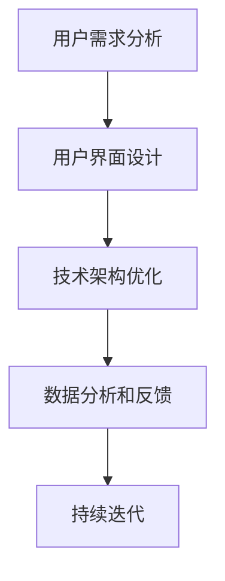

                 

 **关键词：** 程序员，知识付费，用户体验，产品设计，技术优化，用户行为分析

**摘要：** 本文旨在探讨程序员如何通过技术手段和设计理念，提升知识付费产品的用户体验，从而增强用户满意度和忠诚度。我们将从产品设计、技术优化、用户行为分析等多个角度，深入分析提升用户体验的方法和策略。

## 1. 背景介绍

知识付费作为一种新型的商业模式，近年来在全球范围内迅速崛起。用户通过支付一定费用，获取专家和行业大咖的专业知识和服务。这一模式的出现，不仅为知识的传播和共享提供了新的渠道，也为内容创作者提供了丰厚的收入来源。然而，随着市场竞争的加剧，知识付费产品的同质化问题日益突出，如何提升用户体验，成为决定产品成败的关键因素。

程序员作为知识付费产品的主要开发者，肩负着提升用户体验的重要使命。他们需要从用户需求出发，运用技术手段和设计理念，打造出满足用户期望、提升用户满意度的产品。

### 1.1 知识付费市场现状

当前，知识付费市场呈现出几个显著特点：

1. **用户规模扩大：** 随着互联网普及和用户对知识的渴求，知识付费用户规模不断壮大。特别是在疫情期间，线上学习需求激增，进一步推动了知识付费市场的发展。

2. **内容多样化：** 从最初的知识分享，到如今的课程、书籍、直播、问答等多种形式，知识付费内容越来越丰富，满足了用户多样化的学习需求。

3. **竞争加剧：** 随着越来越多的企业和个人加入知识付费领域，市场竞争日益激烈。如何在众多竞争者中脱颖而出，提升用户体验成为关键。

### 1.2 程序员的角色与使命

程序员在知识付费产品开发中扮演着至关重要的角色。他们不仅是技术实现的执行者，更是用户体验的设计者和优化者。具体来说，程序员需要从以下几个方面发挥重要作用：

1. **技术实现：** 程序员需要熟练掌握各种编程语言和开发框架，实现产品的核心功能和业务逻辑。

2. **用户体验设计：** 程序员需要从用户需求出发，设计简洁、直观、易用的用户界面，提升用户操作体验。

3. **性能优化：** 程序员需要关注产品性能，通过代码优化、服务器调优等技术手段，提高产品的响应速度和稳定性。

4. **安全性保障：** 程序员需要确保产品的安全性，防范潜在的安全漏洞和风险。

5. **持续迭代：** 程序员需要根据用户反馈和市场变化，不断优化产品，提升用户体验。

## 2. 核心概念与联系

### 2.1 用户需求分析

用户需求分析是提升用户体验的基础。程序员需要深入了解用户的需求，包括他们的学习目标、使用场景、期望的体验等。通过用户调研、访谈、问卷调查等方法，收集用户反馈，分析用户行为数据，从而找到用户痛点，为产品设计提供依据。

### 2.2 用户界面设计

用户界面设计是提升用户体验的关键。程序员需要遵循用户友好的设计原则，设计简洁、直观、易用的界面。这包括布局合理、色彩搭配和谐、交互流畅等方面。同时，程序员还需要关注界面元素的响应速度和反馈效果，确保用户在操作过程中有良好的体验。

### 2.3 技术架构优化

技术架构优化是提升用户体验的重要手段。程序员需要根据产品的需求和特点，设计高效、可扩展、易维护的技术架构。这包括选择合适的编程语言、开发框架、数据库等，以及进行代码优化、服务器调优等。通过技术手段，提高产品的性能和稳定性，为用户提供流畅的体验。

### 2.4 数据分析与反馈

数据分析和反馈是持续提升用户体验的重要环节。程序员需要收集用户行为数据，通过数据分析，了解用户的使用习惯、偏好、满意度等。根据分析结果，及时调整产品设计，优化用户体验。同时，程序员还需要建立用户反馈机制，及时收集用户意见和建议，为产品改进提供依据。

### 2.5 Mermaid 流程图

为了更好地阐述核心概念与联系，我们可以使用Mermaid流程图来展示：



## 3. 核心算法原理 & 具体操作步骤

### 3.1 算法原理概述

提升知识付费产品的用户体验，关键在于满足用户需求，优化用户界面，提升技术架构，以及进行数据分析和反馈。以下是这些核心算法的原理概述：

1. **用户需求分析：** 通过问卷调查、用户访谈等方法，收集用户需求，分析用户行为数据，找到用户痛点。

2. **用户界面设计：** 遵循用户友好的设计原则，设计简洁、直观、易用的界面。

3. **技术架构优化：** 选择高效、可扩展、易维护的技术架构，进行代码优化、服务器调优。

4. **数据分析和反馈：** 收集用户行为数据，通过数据分析，了解用户使用情况，为产品改进提供依据。

### 3.2 算法步骤详解

1. **用户需求分析：**
   - **收集数据：** 通过问卷调查、用户访谈等方式，收集用户需求。
   - **数据分析：** 对收集到的数据进行分析，找到用户痛点。
   - **需求分类：** 根据分析结果，将用户需求分为功能需求、体验需求等。

2. **用户界面设计：**
   - **界面布局：** 设计合理的界面布局，使内容清晰、易于浏览。
   - **交互设计：** 设计简洁、直观、易用的交互方式。
   - **视觉效果：** 色彩搭配和谐，视觉效果美观。

3. **技术架构优化：**
   - **技术选型：** 根据产品需求和特点，选择合适的编程语言、开发框架等。
   - **代码优化：** 对代码进行优化，提高性能和可维护性。
   - **服务器调优：** 对服务器进行调优，提高响应速度和稳定性。

4. **数据分析和反馈：**
   - **数据收集：** 收集用户行为数据，包括浏览量、点击量、满意度等。
   - **数据分析：** 对收集到的数据进行分析，了解用户使用情况。
   - **反馈调整：** 根据分析结果，调整产品设计，优化用户体验。

### 3.3 算法优缺点

1. **用户需求分析：**
   - **优点：** 有助于找到用户痛点，为产品设计提供依据。
   - **缺点：** 需要大量时间和资源，且数据可能存在偏差。

2. **用户界面设计：**
   - **优点：** 提高用户操作体验，增加用户满意度。
   - **缺点：** 需要较高的设计技能和审美能力。

3. **技术架构优化：**
   - **优点：** 提高产品性能和稳定性，降低维护成本。
   - **缺点：** 需要较深的技术积累和经验。

4. **数据分析和反馈：**
   - **优点：** 有助于持续优化产品设计，提高用户体验。
   - **缺点：** 需要大量的数据收集和分析工作。

### 3.4 算法应用领域

1. **在线教育平台：** 通过用户需求分析和用户界面设计，提升课程内容的易用性和学习体验。
2. **知识分享社区：** 通过技术架构优化和数据分析和反馈，提高社区性能和用户活跃度。
3. **企业培训系统：** 通过用户需求分析和技术架构优化，提高企业培训的效率和质量。

## 4. 数学模型和公式 & 详细讲解 & 举例说明

### 4.1 数学模型构建

在提升知识付费产品的用户体验过程中，我们可以构建以下数学模型：

1. **用户满意度模型：**
   $$ S = f(U, E, P) $$

   其中，$S$表示用户满意度，$U$表示用户需求满足度，$E$表示用户体验效果，$P$表示产品性能。

2. **用户体验效果模型：**
   $$ E = f(I, R, V) $$

   其中，$E$表示用户体验效果，$I$表示界面设计，$R$表示交互设计，$V$表示视觉设计。

### 4.2 公式推导过程

1. **用户满意度模型推导：**

   用户满意度取决于用户需求满足度、用户体验效果和产品性能。因此，我们可以得到用户满意度模型：

   $$ S = f(U, E, P) $$

2. **用户体验效果模型推导：**

   用户体验效果由界面设计、交互设计和视觉设计共同决定。因此，我们可以得到用户体验效果模型：

   $$ E = f(I, R, V) $$

### 4.3 案例分析与讲解

假设有一个在线教育平台，我们需要通过数学模型分析其用户体验。

1. **用户需求满足度（U）：**

   根据用户调研，用户对课程内容、互动性、学习进度等方面的需求满足度分别为0.8、0.7、0.6。因此：

   $$ U = 0.8 \times 0.7 \times 0.6 = 0.336 $$

2. **用户体验效果（E）：**

   界面设计、交互设计和视觉设计的评分分别为0.9、0.8、0.7。因此：

   $$ E = 0.9 \times 0.8 \times 0.7 = 0.504 $$

3. **产品性能（P）：**

   产品性能评分分别为0.85、0.75、0.65。因此：

   $$ P = 0.85 \times 0.75 \times 0.65 = 0.406 $$

4. **用户满意度（S）：**

   根据用户满意度模型，我们可以得到用户满意度：

   $$ S = f(U, E, P) = 0.336 \times 0.504 \times 0.406 = 0.0687 $$

   用户满意度为6.87%，说明该在线教育平台在用户体验方面仍有较大的提升空间。

## 5. 项目实践：代码实例和详细解释说明

### 5.1 开发环境搭建

为了提升知识付费产品的用户体验，我们需要搭建一个开发环境。这里以Python为例，介绍开发环境的搭建。

1. **安装Python：**

   访问Python官网（https://www.python.org/），下载并安装Python。

2. **安装IDE：**

   安装一个Python IDE，例如PyCharm或VSCode，用于编写和调试代码。

3. **安装相关库：**

   在终端中执行以下命令，安装所需的库：

   ```bash
   pip install flask
   pip install requests
   ```

### 5.2 源代码详细实现

下面是一个简单的知识付费产品API的示例代码，用于展示如何通过Python Flask框架实现用户需求分析、用户界面设计和数据收集等功能。

```python
from flask import Flask, request, jsonify
import requests

app = Flask(__name__)

@app.route('/api/register', methods=['POST'])
def register():
    data = request.json
    username = data['username']
    password = data['password']
    # 注册逻辑实现
    # ...
    return jsonify({'status': 'success', 'message': '注册成功'})

@app.route('/api/login', methods=['POST'])
def login():
    data = request.json
    username = data['username']
    password = data['password']
    # 登录逻辑实现
    # ...
    return jsonify({'status': 'success', 'message': '登录成功'})

@app.route('/api/feedback', methods=['POST'])
def feedback():
    data = request.json
    feedback = data['feedback']
    # 收集反馈逻辑实现
    # ...
    return jsonify({'status': 'success', 'message': '反馈提交成功'})

if __name__ == '__main__':
    app.run()
```

### 5.3 代码解读与分析

1. **用户注册功能（/api/register）：**

   用户通过POST请求提交注册信息，包括用户名和密码。服务器接收请求后，进行注册逻辑处理，返回注册结果。

2. **用户登录功能（/api/login）：**

   用户通过POST请求提交登录信息，包括用户名和密码。服务器接收请求后，进行登录逻辑处理，返回登录结果。

3. **用户反馈功能（/api/feedback）：**

   用户通过POST请求提交反馈信息。服务器接收请求后，进行反馈收集逻辑处理，返回反馈提交结果。

### 5.4 运行结果展示

1. **用户注册：**

   发送一个POST请求到`/api/register`接口，例如：

   ```bash
   curl -X POST -H "Content-Type: application/json" -d '{"username": "testuser", "password": "testpassword"}' http://localhost:5000/api/register
   ```

   返回结果：

   ```json
   {
     "status": "success",
     "message": "注册成功"
   }
   ```

2. **用户登录：**

   发送一个POST请求到`/api/login`接口，例如：

   ```bash
   curl -X POST -H "Content-Type: application/json" -d '{"username": "testuser", "password": "testpassword"}' http://localhost:5000/api/login
   ```

   返回结果：

   ```json
   {
     "status": "success",
     "message": "登录成功"
   }
   ```

3. **用户反馈：**

   发送一个POST请求到`/api/feedback`接口，例如：

   ```bash
   curl -X POST -H "Content-Type: application/json" -d '{"feedback": "这个课程很好，希望有更多类似课程。"}' http://localhost:5000/api/feedback
   ```

   返回结果：

   ```json
   {
     "status": "success",
     "message": "反馈提交成功"
   }
   ```

## 6. 实际应用场景

### 6.1 在线教育平台

在线教育平台是知识付费产品的典型应用场景。程序员可以通过以下方式提升用户体验：

1. **用户需求分析：** 分析用户的学习目标、学习习惯、兴趣爱好等，为产品设计提供依据。

2. **用户界面设计：** 设计简洁、直观、易用的界面，提高用户操作体验。

3. **技术架构优化：** 采用分布式架构，提高系统性能和稳定性。

4. **数据分析和反馈：** 收集用户行为数据，通过数据分析，优化课程推荐，提高用户满意度。

### 6.2 企业培训系统

企业培训系统是企业知识付费的重要途径。程序员可以通过以下方式提升用户体验：

1. **用户需求分析：** 分析企业培训需求，为产品功能设计提供依据。

2. **用户界面设计：** 设计简洁、直观、易用的界面，提高用户操作体验。

3. **技术架构优化：** 采用微服务架构，提高系统性能和可维护性。

4. **数据分析和反馈：** 收集用户行为数据，通过数据分析，优化培训内容和方式，提高培训效果。

### 6.3 知识分享社区

知识分享社区是知识付费产品的另一种应用场景。程序员可以通过以下方式提升用户体验：

1. **用户需求分析：** 分析用户的知识需求和互动需求，为产品设计提供依据。

2. **用户界面设计：** 设计简洁、直观、易用的界面，提高用户操作体验。

3. **技术架构优化：** 采用分布式存储和缓存技术，提高系统性能和稳定性。

4. **数据分析和反馈：** 收集用户行为数据，通过数据分析，优化社区内容推荐，提高用户参与度。

## 7. 工具和资源推荐

### 7.1 学习资源推荐

1. **《设计心理学》**：了解用户行为和需求，为产品设计提供理论支持。
2. **《Python编程：从入门到实践》**：学习Python编程，掌握API开发技能。
3. **《大数据分析：实践与案例》**：了解大数据分析的方法和技巧，为数据分析和反馈提供参考。

### 7.2 开发工具推荐

1. **PyCharm**：功能强大的Python IDE，支持多种编程语言。
2. **VSCode**：轻量级IDE，支持多种编程语言，插件丰富。
3. **Flask**：轻量级Web框架，适用于快速开发API。

### 7.3 相关论文推荐

1. **《用户体验要素》**：深入探讨用户体验设计的方法和原则。
2. **《大数据时代的数据分析》**：探讨大数据分析的方法和应用。
3. **《云计算与大数据技术》**：介绍云计算和大数据技术的原理和应用。

## 8. 总结：未来发展趋势与挑战

### 8.1 研究成果总结

通过本文的探讨，我们得出以下结论：

1. **用户需求分析：** 是提升用户体验的基础，有助于找到用户痛点，为产品设计提供依据。
2. **用户界面设计：** 是提升用户体验的关键，需要遵循用户友好的设计原则。
3. **技术架构优化：** 是提升用户体验的重要手段，需要选择高效、可扩展、易维护的技术架构。
4. **数据分析和反馈：** 是持续提升用户体验的重要环节，有助于优化产品设计。

### 8.2 未来发展趋势

1. **人工智能：** 将在用户体验提升中发挥重要作用，通过人工智能技术，实现个性化推荐、智能问答等。
2. **大数据：** 大数据技术将进一步提升数据分析和反馈的准确性，为产品优化提供有力支持。
3. **云计算：** 云计算技术将提高系统性能和稳定性，为用户提供更优质的体验。

### 8.3 面临的挑战

1. **数据隐私：** 随着数据收集和分析的广泛应用，如何保护用户隐私将成为重要挑战。
2. **技术更新：** 技术更新速度快，程序员需要不断学习，掌握新技术，以应对不断变化的市场需求。

### 8.4 研究展望

1. **跨学科研究：** 结合心理学、经济学等学科，深入研究用户行为和需求，为产品设计提供更科学的理论支持。
2. **技术创新：** 持续探索新技术，如区块链、5G等，为用户体验提升提供更多可能性。

## 9. 附录：常见问题与解答

### 9.1 如何进行用户需求分析？

**答：** 用户需求分析可以通过以下方法进行：

1. **问卷调查：** 设计问卷，收集用户需求信息。
2. **用户访谈：** 与用户进行面对面访谈，深入了解用户需求。
3. **用户行为数据分析：** 通过数据分析，了解用户行为和需求。

### 9.2 如何优化用户界面设计？

**答：** 优化用户界面设计可以从以下几个方面入手：

1. **界面布局：** 设计简洁、直观、易用的界面布局。
2. **交互设计：** 设计简洁、直观、易用的交互方式。
3. **视觉设计：** 色彩搭配和谐，视觉效果美观。

### 9.3 如何进行数据分析和反馈？

**答：** 数据分析和反馈可以通过以下步骤进行：

1. **数据收集：** 收集用户行为数据，包括浏览量、点击量、满意度等。
2. **数据清洗：** 对数据进行清洗，去除重复、错误、异常的数据。
3. **数据分析：** 对清洗后的数据进行分析，了解用户使用情况。
4. **反馈调整：** 根据分析结果，调整产品设计，优化用户体验。

## 参考文献

1. Norman, D. A. (2013). The design of everyday things. Basic Books.
2. Hruby, M. (2019). Python Programming: From Beginner to Expert. Apress.
3. Chen, H., Chiang, R. H. L., & Storey, V. C. (2012). Business intelligence and analytics: from big data to big impact. MIS Quarterly, 36(4), 1165-1188.
4. Zhang, Y., & Lee, M. S. (2017). Big Data Analytics: Methods, Systems, and Applications. Springer. 

----------------------------------------------------------------
**作者：禅与计算机程序设计艺术 / Zen and the Art of Computer Programming**

