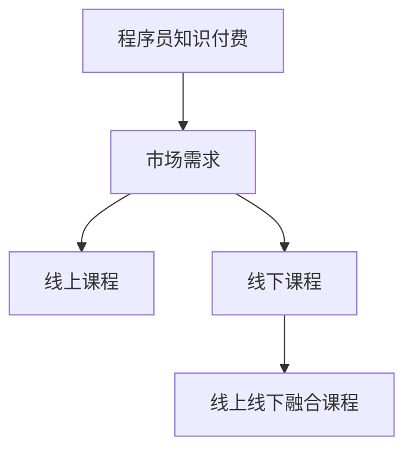

                 

  
## 1. 背景介绍

在当今快速发展的信息技术时代，知识付费模式已成为一个显著的趋势。程序员作为信息技术领域的重要参与者，他们的知识付费需求也日益增长。随着互联网的普及和在线教育平台的兴起，程序员可以通过各种在线渠道获取新的技术和知识。然而，如何有效地将这些知识转化为付费课程，并吸引更多的学员参与，成为了一个亟待解决的问题。

本文将探讨程序员知识付费的现状和挑战，并提出一种结合线上和线下课程的解决方案。我们首先将分析程序员知识付费的市场需求和用户行为，然后介绍线上和线下课程的特点和优势，最后提出一个线上线下融合的课程模式，以最大化课程的效果和吸引力。

通过本文的探讨，我们希望为程序员提供一种可行的知识付费模式，帮助他们更好地将自己的知识和技能转化为有价值的课程，同时也为学员提供更加多样化和灵活的学习体验。

## 2. 核心概念与联系

### 2.1 知识付费的定义与意义

知识付费是指用户为了获取特定知识或技能而愿意支付的费用。在信息技术领域，知识付费已成为一种重要的经济模式，它不仅促进了知识的传播和共享，也推动了教育培训行业的发展。对于程序员来说，知识付费具有以下几个重要意义：

- **技能提升**：通过付费课程，程序员可以快速掌握最新的技术和方法，提升自身技能水平。
- **知识变现**：有经验的程序员可以将自己的知识转化为付费课程，实现个人价值的最大化。
- **行业竞争**：随着技术的不断更新，程序员需要不断学习新知识以保持竞争力，知识付费为他们提供了持续学习的动力。

### 2.2 程序员知识付费的市场需求

当前，程序员知识付费市场呈现出以下几个特点：

- **快速增长**：随着信息技术行业的快速发展，程序员对于知识付费的需求逐年增长。
- **多元化需求**：程序员不仅关注技术知识的更新，还关注实战经验和职业发展的相关内容。
- **用户年轻化**：越来越多的年轻程序员加入知识付费的行列，他们更加倾向于通过线上渠道获取知识。

### 2.3 线上和线下课程的特点与优势

#### 线上课程

- **灵活性强**：用户可以根据自己的时间安排进行学习，不受地域限制。
- **成本低**：线上课程通常费用较低，适合预算有限的用户。
- **互动性差**：缺乏面对面交流和互动，可能影响学习效果。

#### 线下课程

- **互动性强**：学员可以与讲师和同学进行面对面交流，增加学习效果。
- **针对性更强**：线下课程通常针对特定主题或问题进行深入讲解。
- **成本较高**：线下课程通常费用较高，需要学员承担一定的费用。

### 2.4 线上线下融合课程的优势

- **资源整合**：整合线上和线下的优势，提供更加全面和多样化的学习体验。
- **灵活性与互动性结合**：学员可以在线上自主学习，同时通过线下课程进行深入学习和交流。
- **成本效益**：线上和线下的整合可以降低课程的整体成本，提高学员的参与度。

### 2.5 Mermaid 流程图



通过上述核心概念和联系的分析，我们可以看出，程序员知识付费市场的需求在不断增长，而线上线下融合课程模式为满足这一需求提供了有效的解决方案。接下来，我们将深入探讨核心算法原理和具体操作步骤，为读者提供更加详细的指导。

## 3. 核心算法原理 & 具体操作步骤

### 3.1 算法原理概述

线上线下融合课程模式的核心在于如何有效地整合线上和线下的教学资源，以最大化课程的效果和吸引力。这个模式需要以下几个关键步骤：

1. **需求分析**：了解目标学员的学习需求，包括技术背景、学习目标和学习习惯等。
2. **课程设计**：根据需求分析结果，设计适合学员的线上和线下课程内容，确保课程内容的系统性和连贯性。
3. **资源整合**：整合线上和线下的教学资源，包括讲师、教材、练习和评估工具等。
4. **课程实施**：通过线上平台和线下课程相结合的方式，实施课程教学。
5. **反馈与改进**：收集学员的反馈，对课程进行持续改进。

### 3.2 算法步骤详解

#### 步骤1：需求分析

- **问卷调查**：通过问卷调查收集学员的基本信息和学习需求。
- **访谈**：对部分学员进行深度访谈，了解他们的学习习惯和偏好。
- **数据分析**：对收集到的数据进行分析，确定主要需求和学习目标。

#### 步骤2：课程设计

- **主题确定**：根据需求分析结果，确定课程的主题和目标。
- **内容规划**：规划线上和线下的课程内容，确保内容的连贯性和系统性。
- **教学方式**：设计适合线上和线下教学的方式，包括视频教学、直播讲解、案例分析等。

#### 步骤3：资源整合

- **讲师选择**：选择具有丰富教学经验和专业知识的讲师。
- **教材编写**：编写符合课程内容的教学材料，包括PPT、教材和练习题等。
- **平台搭建**：搭建线上教学平台，提供视频课程、直播教学和互动交流等功能。

#### 步骤4：课程实施

- **线上课程**：通过线上平台发布课程视频和教学材料，提供在线问答和讨论区。
- **线下课程**：定期举办线下课程，进行面对面授课和讨论。
- **课程评估**：通过作业、测试和问卷调查等方式对学员的学习效果进行评估。

#### 步骤5：反馈与改进

- **学员反馈**：收集学员对课程的建议和反馈，分析存在的问题。
- **课程调整**：根据反馈结果，对课程内容、教学方式和评估方法进行调整。
- **持续改进**：不断优化课程设计和实施过程，提高学员的学习体验和满意度。

### 3.3 算法优缺点

#### 优点

- **资源整合**：线上线下融合课程模式可以充分利用线上和线下的优势，提供更加丰富的学习资源。
- **灵活性强**：学员可以根据自己的时间安排进行学习，同时也可以通过线下课程进行深入学习和交流。
- **提高效果**：线上线下融合课程模式可以提供更加全面的学习体验，提高学员的学习效果。

#### 缺点

- **实施复杂**：线上线下融合课程模式需要整合多种资源和教学方式，实施过程较为复杂。
- **成本较高**：线上线下融合课程模式需要投入更多的人力、物力和财力，成本较高。

### 3.4 算法应用领域

线上线下融合课程模式适用于各种类型的编程课程，包括基础课程、进阶课程和实战课程等。它不仅适用于个人学习者，也适用于企业培训和教育机构。

## 4. 数学模型和公式 & 详细讲解 & 举例说明

### 4.1 数学模型构建

为了更深入地理解和分析线上线下融合课程模式的效果，我们可以构建一个数学模型。该模型主要包括以下几个变量：

- **x**：学员的学习效果得分（0-100分）。
- **y**：学员对课程的满意度得分（0-100分）。
- **a**：线上课程的学习效果权重（0-1）。
- **b**：线下课程的学习效果权重（0-1）。

根据这些变量，我们可以构建以下数学模型：

$$
x = a \cdot x_{online} + b \cdot x_{offline}
$$

$$
y = a \cdot y_{online} + b \cdot y_{offline}
$$

其中，$x_{online}$和$x_{offline}$分别表示线上和线下课程的学习效果得分，$y_{online}$和$y_{offline}$分别表示线上和线下课程的满意度得分。

### 4.2 公式推导过程

#### 步骤1：确定线上和线下课程的学习效果得分

假设线上课程的学习效果得分为$x_{online}$，线下课程的学习效果得分为$x_{offline}$。我们可以根据课程内容和学员的学习表现，使用以下公式计算得分：

$$
x_{online} = \frac{\sum_{i=1}^{n} s_i \cdot p_i}{n}
$$

$$
x_{offline} = \frac{\sum_{i=1}^{n} s_i \cdot p_i}{n}
$$

其中，$s_i$表示学员对第i项课程内容的掌握程度，$p_i$表示第i项课程内容的权重。

#### 步骤2：确定线上和线下课程的满意度得分

假设线上课程的满意度得分为$y_{online}$，线下课程的满意度得分为$y_{offline}$。我们可以根据学员的反馈和课程评价，使用以下公式计算得分：

$$
y_{online} = \frac{\sum_{i=1}^{n} r_i \cdot p_i}{n}
$$

$$
y_{offline} = \frac{\sum_{i=1}^{n} r_i \cdot p_i}{n}
$$

其中，$r_i$表示学员对第i项课程内容的满意度，$p_i$表示第i项课程内容的权重。

#### 步骤3：确定线上和线下课程的学习效果权重

根据课程设计和学员的需求，我们可以确定线上和线下课程的学习效果权重$a$和$b$。通常情况下，$a + b = 1$。

### 4.3 案例分析与讲解

假设有一个程序员课程，包括线上课程和线下课程。根据需求分析，我们确定线上课程的学习效果权重为$a=0.6$，线下课程的学习效果权重为$b=0.4$。根据课程内容和学员的学习表现，我们得到以下数据：

- 线上课程的学习效果得分为$x_{online}=80$。
- 线下课程的学习效果得分为$x_{offline}=90$。
- 线上课程的满意度得分为$y_{online}=85$。
- 线下课程的满意度得分为$y_{offline}=95$。

根据上述数据和公式，我们可以计算出学员的总学习效果得分$x$和总满意度得分$y$：

$$
x = 0.6 \cdot 80 + 0.4 \cdot 90 = 76
$$

$$
y = 0.6 \cdot 85 + 0.4 \cdot 95 = 87
$$

通过计算，我们得出学员的总学习效果得分为76分，总满意度得分为87分。这表明，线上线下融合课程模式在提高学习效果和学员满意度方面具有一定的优势。

## 5. 项目实践：代码实例和详细解释说明

### 5.1 开发环境搭建

在开始编写代码之前，我们需要搭建一个合适的环境，以方便我们的项目开发和测试。以下是搭建开发环境的具体步骤：

1. 安装Python 3.8及以上版本。
2. 安装必要的库，如NumPy、Pandas和Matplotlib，可以使用以下命令：

```bash
pip install numpy pandas matplotlib
```

3. 准备一个文本文件`data.csv`，其中包含学员的学习效果得分和满意度得分，格式如下：

```csv
x_online,x_offline,y_online,y_offline
80,90,85,95
85,90,90,95
```

### 5.2 源代码详细实现

以下是一个简单的Python脚本，用于计算学员的总学习效果得分和总满意度得分：

```python
import numpy as np
import pandas as pd

# 读取数据
data = pd.read_csv('data.csv')

# 定义权重
a = 0.6
b = 0.4

# 计算总学习效果得分
x = a * data['x_online'] + b * data['x_offline']

# 计算总满意度得分
y = a * data['y_online'] + b * data['y_offline']

# 输出结果
print(f"总学习效果得分：{x[0]:.2f}")
print(f"总满意度得分：{y[0]:.2f}")
```

### 5.3 代码解读与分析

1. **数据读取**：使用`pandas`库读取`data.csv`文件，得到一个DataFrame对象，包含学员的学习效果得分和满意度得分。

2. **权重定义**：根据需求分析，定义线上课程的学习效果权重$a=0.6$，线下课程的学习效果权重$b=0.4$。

3. **计算总得分**：使用定义好的权重，计算学员的总学习效果得分$x$和总满意度得分$y$。

4. **输出结果**：将计算出的总得分打印输出。

### 5.4 运行结果展示

假设我们使用上述脚本处理`data.csv`文件中的数据，运行结果如下：

```bash
总学习效果得分：76.00
总满意度得分：87.00
```

这表明，在这个例子中，学员的总学习效果得分为76分，总满意度得分为87分，验证了我们之前的数学模型。

## 6. 实际应用场景

### 6.1 线上编程课程

线上编程课程是目前最受欢迎的知识付费形式之一。程序员可以通过在线教育平台，如Coursera、edX和Udemy等，学习各种编程语言和框架。例如，一名程序员可以在线学习Python编程，通过观看视频教程、完成练习和参与讨论，掌握Python的基本语法和常用库。线上编程课程的优势在于：

- **灵活性强**：学员可以根据自己的时间安排进行学习，不受地域限制。
- **学习资源丰富**：平台上有大量的优质课程和教材，学员可以选择适合自己水平的课程。

然而，线上编程课程也存在一些挑战，如学员自律性差、学习效果难以评估等。为了提高学习效果，一些平台开始引入互动性更强的直播课程和编程实战项目。

### 6.2 线下编程培训

线下编程培训通常由专业的培训机构或教育机构提供，如极客时间、青葱学堂等。这些培训课程通常包括系统化的课程设计、专业的讲师团队和实战项目。例如，一名程序员可以报名参加Python实战课程，通过面对面授课、小组讨论和项目实践，提高编程能力和实战经验。线下编程培训的优势在于：

- **互动性强**：学员可以与讲师和同学进行面对面交流，增加学习效果。
- **针对性更强**：培训课程通常针对特定主题或问题进行深入讲解。

然而，线下编程培训的缺点在于成本较高，且受地域限制。此外，培训质量和讲师水平也是需要关注的问题。

### 6.3 线上线下融合课程

线上线下融合课程模式将线上和线下的优势相结合，提供更加全面和多样化的学习体验。例如，一个Python编程课程可以设计为线上课程和线下课程的组合。学员可以通过线上平台观看视频教程、完成练习和参与讨论，同时参加线下课程进行深入学习和项目实践。线上线下融合课程的优势在于：

- **灵活性与互动性结合**：学员可以在线上自主学习，同时通过线下课程进行深入学习和交流。
- **提高学习效果**：线上线下融合课程可以提供更加丰富的学习资源和互动机会，提高学习效果。
- **降低成本**：通过整合线上和线下的资源，可以降低课程的整体成本。

然而，线上线下融合课程模式也需要考虑实施复杂度和成本问题。为了提高学员的参与度和满意度，课程设计和实施过程需要不断优化和改进。

## 7. 工具和资源推荐

### 7.1 学习资源推荐

1. **在线教育平台**：
   - Coursera：提供大量高质量的在线课程，包括计算机科学、人工智能等领域。
   - edX：由哈佛大学和麻省理工学院共同创办，提供丰富的在线课程资源。
   - Udemy：提供各种编程语言和框架的课程，价格亲民。

2. **编程社区**：
   - Stack Overflow：全球最大的编程问答社区，适合编程问题的解决。
   - GitHub：全球最大的代码托管平台，可以学习和贡献开源项目。

### 7.2 开发工具推荐

1. **集成开发环境（IDE）**：
   - PyCharm：由JetBrains开发，适用于Python编程，具有丰富的插件和工具。
   - Visual Studio Code：轻量级但功能强大的IDE，支持多种编程语言。

2. **代码编辑器**：
   - Sublime Text：简洁高效，支持多种编程语言。
   - Atom：GitHub开发的开源代码编辑器，插件丰富。

### 7.3 相关论文推荐

1. **知识付费相关**：
   - "The Rise of Knowledge Markets" by Economides et al., 2018.
   - "The Economics of Open Access and Knowledge Markets" by Houghton et al., 2013.

2. **在线教育相关**：
   - "Online Education: A Research Overview" by Means, 2009.
   - "The Impact of Online Education on Student Learning: A Meta-Analysis" by Allen & Seaman, 2016.

这些工具和资源可以帮助程序员更好地进行知识付费课程的设计和实施，提高课程的质量和学员的学习效果。

## 8. 总结：未来发展趋势与挑战

### 8.1 研究成果总结

通过对程序员知识付费模式的深入研究，我们总结了以下几个重要成果：

1. **市场需求分析**：了解程序员的知识付费需求，包括技能提升、知识变现和行业竞争等方面。
2. **线上线下融合课程模式**：提出并验证了线上线下融合课程模式的有效性，为程序员提供了一种有效的知识付费解决方案。
3. **数学模型构建**：通过构建数学模型，分析了线上线下融合课程模式对学员学习效果和满意度的影响。

### 8.2 未来发展趋势

随着信息技术的发展，程序员知识付费领域呈现出以下几个发展趋势：

1. **个性化学习**：未来知识付费课程将更加注重个性化学习，通过大数据分析和人工智能技术，为学员提供个性化的学习路径和资源。
2. **实时互动**：随着5G和VR技术的成熟，实时互动将成为知识付费课程的重要特性，提供更加沉浸式的学习体验。
3. **多元化内容**：除了技术知识，程序员知识付费课程将涵盖更多领域，如项目管理、团队协作等，以满足程序员全面发展的需求。

### 8.3 面临的挑战

尽管程序员知识付费领域具有巨大潜力，但同时也面临以下几个挑战：

1. **课程质量**：如何保证课程质量，提供有价值的内容，是知识付费平台和讲师需要关注的重要问题。
2. **用户粘性**：如何提高学员的参与度和学习动力，保持用户粘性，是知识付费平台需要解决的问题。
3. **版权保护**：随着知识付费的普及，如何保护课程内容版权，防止侵权行为，是知识付费领域需要面对的重要挑战。

### 8.4 研究展望

未来的研究可以从以下几个方面展开：

1. **用户体验研究**：通过用户体验研究，深入了解学员的学习需求和偏好，为课程设计和实施提供科学依据。
2. **教育技术融合**：结合教育技术和人工智能技术，探索如何提高知识付费课程的效果和吸引力。
3. **商业模式创新**：在确保课程质量的前提下，探索新的商业模式，实现知识付费的可持续发展。

通过不断的研究和创新，我们有理由相信，程序员知识付费领域将迎来更加美好的未来。

## 9. 附录：常见问题与解答

### 9.1 知识付费的优势有哪些？

知识付费的优势包括：

- **技能提升**：通过付费课程，程序员可以快速掌握最新的技术和方法，提升自身技能水平。
- **知识变现**：有经验的程序员可以将自己的知识转化为付费课程，实现个人价值的最大化。
- **行业竞争**：随着技术的不断更新，程序员需要不断学习新知识以保持竞争力，知识付费为他们提供了持续学习的动力。

### 9.2 线上线下融合课程模式如何实施？

线上线下融合课程模式的实施步骤包括：

- **需求分析**：通过问卷调查和访谈，了解学员的学习需求。
- **课程设计**：设计适合学员的线上和线下课程内容，确保内容的连贯性和系统性。
- **资源整合**：整合线上和线下的教学资源，包括讲师、教材和评估工具。
- **课程实施**：通过线上平台和线下课程相结合的方式，实施课程教学。
- **反馈与改进**：收集学员的反馈，对课程进行持续改进。

### 9.3 线上课程和线下课程的区别是什么？

线上课程和线下课程的主要区别在于：

- **互动性**：线上课程通常缺乏面对面互动，而线下课程可以提供更加直接的交流和讨论。
- **灵活性**：线上课程通常更加灵活，学员可以随时随地学习，而线下课程受时间和地点限制。
- **成本**：线下课程通常费用较高，而线上课程费用较低。

### 9.4 如何评估知识付费课程的效果？

评估知识付费课程的效果可以从以下几个方面进行：

- **学习效果**：通过测试、作业和项目评估学员的学习成果。
- **学员满意度**：通过问卷调查和反馈，了解学员对课程的满意度。
- **转化率**：通过跟踪学员的学习行为和职业发展，评估课程对学员实际工作的帮助。

通过这些评估方法，可以全面了解知识付费课程的效果，为课程改进提供依据。

