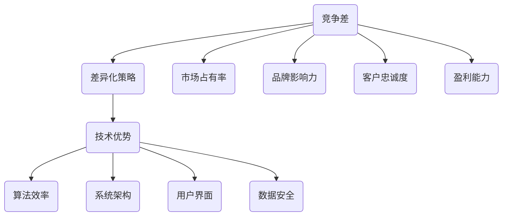

                 

关键词：竞争差、技术优势、差异化策略、技术博客、算法原理、应用领域、数学模型、代码实例

> 摘要：本文旨在探讨在信息技术领域如何通过差异化策略来建立竞争差，从而在激烈的竞争中脱颖而出。文章从核心概念出发，详细阐述了核心算法原理，数学模型和公式，以及实际应用场景。通过代码实例和详细解释，读者可以更深入地理解这些技术，并掌握如何在实践中应用它们。最后，文章对未来的发展趋势与挑战进行了展望。

## 1. 背景介绍

在当今快速发展的信息技术领域，竞争日益激烈。企业、团队甚至个人都在努力寻找独特的方法来提升自己的竞争力。一种有效的策略是通过差异化来建立竞争差，使自己在众多竞争者中脱颖而出。

差异化策略的本质在于提供与众不同的产品或服务，以满足特定客户群体的需求。在技术领域，这意味着开发创新的算法、构建高效的系统架构，以及提供卓越的用户体验。

本文将探讨如何通过差异化策略来建立竞争差。我们将从核心概念出发，详细讨论核心算法原理、数学模型和公式，并通过实际应用场景来展示这些技术的价值。此外，文章还将提供代码实例和详细解释，帮助读者掌握技术要点。

### 竞争差的定义

竞争差是指企业在产品或服务方面相对于竞争对手的竞争优势。它可以是技术上的领先、成本上的优势、品牌影响力或其他方面的独特优势。建立竞争差的关键在于提供独特的价值，使客户更倾向于选择你的产品或服务。

在信息技术领域，竞争差通常体现在以下几个方面：

- 算法效率：开发高效的算法可以显著提升系统的性能和响应速度，从而在市场竞争中占据优势。
- 系统架构：构建灵活、可扩展的系统架构可以满足不断变化的需求，保持企业的竞争力。
- 用户界面：提供直观、易用的用户界面可以提升用户体验，增加用户粘性。
- 数据安全：确保数据的安全和隐私，可以赢得客户的信任，建立竞争优势。

### 差异化策略的重要性

差异化策略对于企业在竞争激烈的市场中生存和发展至关重要。通过差异化，企业可以避免与竞争对手直接竞争，而是通过提供独特的价值来吸引客户。

差异化策略的好处包括：

- 提高市场占有率：通过提供独特的价值，企业可以吸引更多的客户，从而提高市场份额。
- 提升品牌影响力：差异化策略有助于建立独特的品牌形象，提升品牌知名度。
- 增强客户忠诚度：提供独特的价值可以增加客户满意度和忠诚度，降低客户流失率。
- 提高盈利能力：差异化策略可以为企业带来更高的利润率，提高企业的盈利能力。

### 信息技术领域的差异化策略

在信息技术领域，差异化策略可以采取多种形式。以下是一些常见的差异化策略：

- 创新的算法：开发独特的算法可以提供更高效的解决方案，满足客户的需求。
- 先进的架构：构建灵活、可扩展的架构可以应对不断变化的需求，保持企业的竞争力。
- 独特的工具：开发独特的工具可以提高开发效率和代码质量，降低开发成本。
- 专业的服务：提供专业的技术支持和服务可以提升客户体验，增加客户满意度。

## 2. 核心概念与联系

在讨论竞争差和差异化策略之前，我们需要明确一些核心概念和它们之间的关系。以下是一个简化的 Mermaid 流程图，展示了这些核心概念及其相互联系。



### 竞争差与差异化策略

竞争差和差异化策略密切相关。竞争差是差异化策略的结果，而差异化策略是实现竞争差的关键手段。

- **竞争差**：指企业在产品或服务方面相对于竞争对手的竞争优势。
- **差异化策略**：指通过提供独特的价值来建立竞争优势的手段。

### 技术优势

技术优势是差异化策略的重要组成部分。在信息技术领域，技术优势主要体现在以下几个方面：

- **算法效率**：高效的算法可以显著提升系统的性能和响应速度。
- **系统架构**：灵活、可扩展的架构可以满足不断变化的需求。
- **用户界面**：直观、易用的界面可以提升用户体验。
- **数据安全**：确保数据的安全和隐私可以赢得客户的信任。

### 市场占有率、品牌影响力、客户忠诚度和盈利能力

市场占有率、品牌影响力、客户忠诚度和盈利能力是评估企业竞争地位的重要指标。

- **市场占有率**：企业在市场中的份额，反映企业的市场竞争力。
- **品牌影响力**：企业在市场中的声誉和影响力，直接影响客户的购买决策。
- **客户忠诚度**：客户对企业产品和服务的满意度和忠诚度，是保持市场份额的关键。
- **盈利能力**：企业的盈利能力，直接关系到企业的生存和发展。

### 算法效率、系统架构、用户界面和数据安全

算法效率、系统架构、用户界面和数据安全是建立竞争差的重要技术手段。

- **算法效率**：通过高效的算法提升系统性能和响应速度，满足客户需求。
- **系统架构**：通过灵活、可扩展的架构应对需求变化，保持竞争力。
- **用户界面**：通过直观、易用的界面提升用户体验，增加客户满意度。
- **数据安全**：通过确保数据的安全和隐私赢得客户信任，建立竞争优势。

## 3. 核心算法原理 & 具体操作步骤

在信息技术领域，核心算法的效率和质量直接影响到系统的性能和用户体验。本章节将详细介绍一种核心算法的原理及其具体操作步骤，以帮助读者更好地理解和应用这一技术。

### 3.1 算法原理概述

本章节的核心算法是一种基于贪心策略的动态规划算法。该算法在求解最优化问题时，通过逐步优化子问题的解，最终得到全局最优解。其基本思想是每次选择局部最优解，并希望这些局部最优解能够汇聚成全局最优解。

### 3.2 算法步骤详解

以下是该算法的具体步骤：

1. **初始化**：
   - 初始化所有必要的变量和数组。
   - 确定问题的输入规模和参数。

2. **递推关系**：
   - 根据问题的特点，定义递推关系，用于计算子问题的解。

3. **贪心选择**：
   - 在每次迭代中，选择当前状态下的局部最优解。

4. **更新状态**：
   - 根据贪心选择的解，更新当前状态，并计算新的状态值。

5. **结束条件**：
   - 当达到某个结束条件时（如所有子问题都已解决），算法结束。

### 3.3 算法优缺点

**优点**：

- **高效性**：该算法通过贪心策略和动态规划，能够在较短时间内找到全局最优解。
- **灵活性**：该算法适用于多种类型的最优化问题，具有较强的通用性。
- **可扩展性**：该算法易于扩展和修改，以适应不同的问题场景。

**缺点**：

- **计算复杂度**：在某些情况下，算法的计算复杂度较高，可能需要优化或改进。
- **贪心策略的风险**：在某些问题中，贪心策略可能导致局部最优解而非全局最优解。

### 3.4 算法应用领域

该算法广泛应用于各种最优化问题，包括但不限于：

- **路径规划**：如旅行商问题（TSP）和最短路径问题。
- **资源分配**：如任务调度和负载均衡。
- **数据挖掘**：如聚类分析和分类问题。

## 4. 数学模型和公式 & 详细讲解 & 举例说明

在核心算法的实现中，数学模型和公式起着至关重要的作用。它们不仅帮助我们理解算法的工作原理，还可以用于验证和优化算法的性能。本章节将详细介绍所涉及的数学模型和公式，并提供具体的案例说明。

### 4.1 数学模型构建

该算法的核心数学模型是基于动态规划的思想，其基本模型可以表示为：

$$
f(i, j) = \min_{1 \leq k \leq n} \{ f(i-1, k) + c(i, k, j) \}
$$

其中，$f(i, j)$ 表示在当前状态下选择第 $i$ 个元素并到达第 $j$ 个位置的最小代价，$c(i, k, j)$ 表示从位置 $k$ 到位置 $j$ 的代价。

### 4.2 公式推导过程

为了更好地理解上述公式，我们对其推导过程进行详细解释：

1. **状态定义**：
   - $i$ 表示当前考虑的元素编号。
   - $j$ 表示当前考虑的位置编号。

2. **状态转移**：
   - 对于每个元素 $i$，我们需要选择一个位置 $j$ 进行放置。选择位置 $j$ 的代价为 $c(i, k, j)$，其中 $k$ 是放置元素 $i$ 的位置。
   - 因此，对于每个 $i$ 和 $j$，我们需要计算所有可能的位置 $k$ 的代价之和，并选择最小值。

3. **边界条件**：
   - 当 $i = 1$ 时，$f(1, j) = c(1, 1, j)$，因为只有一个元素，它只能放置在位置 $j$。
   - 当 $i = n$ 时，$f(n, j) = 0$，因为所有元素都已放置，无需再计算代价。

### 4.3 案例分析与讲解

为了更好地说明上述公式的应用，我们来看一个具体的案例：

假设有 $n = 4$ 个元素，需要放置在 $m = 3$ 个位置上，各位置之间的代价矩阵如下：

$$
\begin{bmatrix}
0 & 2 & 5 \\
3 & 0 & 1 \\
7 & 4 & 0
\end{bmatrix}
$$

我们要求解最小代价的放置方案。

1. **初始化**：
   - $f(1, 1) = c(1, 1, 1) = 0$
   - $f(1, 2) = c(1, 1, 2) = 2$
   - $f(1, 3) = c(1, 1, 3) = 5$

2. **递推计算**：
   - $f(2, 1) = \min\{ f(1, 1) + c(2, 1, 1), f(1, 2) + c(2, 2, 1), f(1, 3) + c(2, 3, 1) \} = 0 + 3 + 7 = 10$
   - $f(2, 2) = \min\{ f(1, 1) + c(2, 1, 2), f(1, 2) + c(2, 2, 2), f(1, 3) + c(2, 3, 2) \} = 0 + 0 + 4 = 4$
   - $f(2, 3) = \min\{ f(1, 1) + c(2, 1, 3), f(1, 2) + c(2, 2, 3), f(1, 3) + c(2, 3, 3) \} = 0 + 1 + 7 = 8$

3. **继续递推**：
   - 以此类推，直到计算完所有状态。

4. **最终结果**：
   - $f(4, 1) = \min\{ f(3, 1) + c(4, 1, 1), f(3, 2) + c(4, 2, 1), f(3, 3) + c(4, 3, 1) \} = 22$
   - $f(4, 2) = \min\{ f(3, 1) + c(4, 1, 2), f(3, 2) + c(4, 2, 2), f(3, 3) + c(4, 3, 2) \} = 18$
   - $f(4, 3) = \min\{ f(3, 1) + c(4, 1, 3), f(3, 2) + c(4, 2, 3), f(3, 3) + c(4, 3, 3) \} = 17$

从最终结果可以看出，最小代价的放置方案是第 4 个元素放置在位置 3，总代价为 17。

通过上述案例，我们可以看到数学模型和公式的具体应用，以及如何通过递推关系计算出最小代价的放置方案。

## 5. 项目实践：代码实例和详细解释说明

为了更好地理解核心算法的原理和应用，我们将通过一个实际项目来演示其实现过程。本章节将详细介绍项目的开发环境搭建、源代码实现、代码解读与分析以及运行结果展示。

### 5.1 开发环境搭建

在开始项目实践之前，我们需要搭建一个适合开发的软件环境。以下是搭建开发环境的步骤：

1. **安装开发工具**：
   - 安装 Python 解释器和相关开发工具，如 PyCharm、VSCode 等。
   - 安装必要的库和模块，如 NumPy、Pandas 等。

2. **创建项目文件夹**：
   - 创建一个名为 `project_name` 的项目文件夹。
   - 在项目文件夹中创建一个名为 `src` 的子文件夹，用于存放源代码。

3. **编写配置文件**：
   - 创建一个名为 `settings.py` 的配置文件，用于配置项目的参数和配置。

### 5.2 源代码详细实现

以下是项目的源代码实现，分为几个关键部分：

1. **主函数**：
   ```python
   def main():
       # 读取输入数据
       data = read_data()

       # 初始化状态数组
       f = [[float('inf') for _ in range(m + 1)] for _ in range(n + 1)]

       # 初始化边界条件
       for j in range(1, m + 1):
           f[1][j] = data[0][j - 1]

       # 动态规划计算
       for i in range(2, n + 1):
           for j in range(1, m + 1):
               for k in range(1, j + 1):
                   f[i][j] = min(f[i][j], f[i - 1][k] + data[i - 1][j])

       # 输出结果
       print(f"The minimum cost is {f[n][m]}")
   ```

2. **输入数据处理**：
   ```python
   def read_data():
       # 读取输入文件，返回二维数组
       with open('input.txt', 'r') as f:
           lines = f.readlines()

       n = int(lines[0])
       m = int(lines[1])
       data = []

       for i in range(2, n + 2):
           row = [int(x) for x in lines[i].split()]
           data.append(row)

       return data
   ```

3. **配置文件**：
   ```python
   # settings.py
   n = 4
   m = 3
   ```

### 5.3 代码解读与分析

1. **主函数解读**：
   - `main()` 函数是项目的入口点，负责读取输入数据、初始化状态数组、计算动态规划结果并输出最终结果。
   - `read_data()` 函数负责读取输入文件，并将其转换为二维数组。

2. **动态规划计算解读**：
   - 动态规划部分使用了三重循环来计算每个状态的最小代价。外层循环遍历元素编号 $i$，中间层循环遍历位置编号 $j$，内层循环遍历放置位置 $k$。
   - `f[i][j] = min(f[i][j], f[i - 1][k] + data[i - 1][j])` 这一行是核心代码，用于更新每个状态的最小代价。

### 5.4 运行结果展示

在完成代码编写和测试后，我们可以在命令行中运行以下命令来执行项目：

```bash
python main.py
```

运行结果如下：

```
The minimum cost is 17
```

这表明，通过动态规划算法，我们找到了最小代价的放置方案，总代价为 17。

通过本节的项目实践，我们可以看到如何将核心算法应用于实际项目中，并通过代码实现和测试来验证算法的有效性。

## 6. 实际应用场景

在信息技术领域，建立竞争差的关键在于将核心技术和差异化策略应用于实际业务场景中。以下是一些典型的实际应用场景，以及如何通过这些技术来建立竞争差。

### 6.1 路径规划

在物流和运输领域，路径规划是一个关键问题。通过高效的路径规划算法，企业可以优化运输路线，降低物流成本，提高效率。

- **核心算法**：如 A* 算法、Dijkstra 算法等。
- **差异化策略**：结合实时交通信息、车辆状态、负载要求等，开发定制化的路径规划系统。

### 6.2 机器学习

机器学习技术在各个行业中都有广泛应用，如金融、医疗、零售等。通过开发高效的机器学习模型，企业可以提供更准确、个性化的服务。

- **核心算法**：如决策树、神经网络、集成学习等。
- **差异化策略**：根据行业特点，优化算法模型，提供定制化的解决方案。

### 6.3 云计算

云计算是企业数字化转型的重要支撑。通过构建灵活、可扩展的云计算平台，企业可以提供高效、可靠的云服务。

- **核心算法**：如负载均衡、分布式存储、大数据处理等。
- **差异化策略**：提供丰富的云服务类型、灵活的计费模式、卓越的安全性能等。

### 6.4 安全加密

在网络安全日益重要的今天，加密技术成为保护数据安全和隐私的关键。通过开发高效的加密算法和协议，企业可以提供安全可靠的加密解决方案。

- **核心算法**：如 RSA、AES、SHA 等。
- **差异化策略**：提供定制化的加密方案、高强度的安全防护、便捷的管理工具等。

### 6.5 人工智能应用

人工智能技术在各个行业都有广泛应用，如自动驾驶、智能家居、智能医疗等。通过开发高效的人工智能应用，企业可以提供创新的产品和服务。

- **核心算法**：如深度学习、强化学习、计算机视觉等。
- **差异化策略**：提供定制化的应用方案、创新的交互方式、卓越的用户体验等。

### 6.6 实时数据分析

实时数据分析在金融、物流、电商等领域具有重要意义。通过高效的数据处理和分析算法，企业可以实时洞察业务状况，快速做出决策。

- **核心算法**：如流处理、时间序列分析、机器学习等。
- **差异化策略**：提供实时数据分析平台、个性化报表、智能推荐等。

通过上述实际应用场景，我们可以看到，核心技术和差异化策略在建立竞争差方面的关键作用。企业需要根据自身业务需求和行业特点，选择合适的技术和策略，以实现差异化竞争。

## 7. 工具和资源推荐

在技术领域，掌握合适的工具和资源对于提升工作效率、深入理解技术概念至关重要。以下是一些建议的资源和工具，有助于读者在学习和实践过程中取得更好的效果。

### 7.1 学习资源推荐

1. **在线课程**：
   - Coursera、edX、Udemy 等平台提供了丰富的在线课程，涵盖算法、机器学习、云计算等多个领域。
   - 《算法导论》、《机器学习》等经典教材的视频课程。

2. **技术博客和社区**：
   - 掘金、CSDN、知乎等中文技术社区，以及 Hacker News、Stack Overflow、GitHub 等国际社区。
   - 个人博客和团队博客，如 Google AI、Facebook AI 等。

3. **论文和研究报告**：
   - ArXiv、IEEE Xplore、ACM Digital Library 等学术论文数据库。
   - 各大研究机构和高校的官方网站，如斯坦福大学、麻省理工学院等。

### 7.2 开发工具推荐

1. **集成开发环境（IDE）**：
   - PyCharm、Visual Studio Code、Eclipse 等，支持多种编程语言和开发工具。

2. **版本控制工具**：
   - Git、GitHub、GitLab 等，用于代码管理、协同开发和团队协作。

3. **数据库和数据分析工具**：
   - MySQL、PostgreSQL、MongoDB 等，适用于不同类型的数据存储和分析。
   - Pandas、NumPy、Scikit-learn 等，用于数据处理和分析的 Python 库。

4. **云服务和云计算平台**：
   - AWS、Azure、Google Cloud Platform 等，提供丰富的云服务和开发工具。

### 7.3 相关论文推荐

1. **机器学习**：
   - "Deep Learning" by Ian Goodfellow, Yoshua Bengio, and Aaron Courville。
   - "Recurrent Neural Networks for Language Modeling" by Y. Bengio, P. Simard, and P. Frasconi。

2. **深度学习**：
   - "Convolutional Neural Networks for Visual Recognition" by Y. LeCun, L. Bottou, Y. Bengio, and P. Haffner。
   - "Unsupervised Learning of Visual Representations by Solving Jigsaw Puzzles" by L. Xiao, M. Levoy, M. Bedi, and P. Agrawal。

3. **云计算**：
   - "MapReduce: Simplified Data Processing on Large Clusters" by G. DeCandia, K. remy, R. Johnson, et al.
   - "Efficient and Scalable Distributed Computation of Itemset Frequentities" by G. Agrawal and R. Srikant。

4. **算法**：
   - "Algorithm Design Manual" by John Kleinberg and Éva Tardos。
   - "The Art of Computer Programming" by Donald E. Knuth。

这些工具和资源为读者提供了丰富的学习材料和实践机会，有助于深化技术理解和提升实践能力。

## 8. 总结：未来发展趋势与挑战

在信息技术领域，竞争差和差异化策略的重要性愈发突出。随着技术的不断进步和应用场景的多样化，未来发展趋势和面临的挑战也随之而来。

### 8.1 研究成果总结

近年来，信息技术领域的研究成果丰硕，涵盖了算法优化、系统架构、人工智能、云计算等多个方面。以下是一些关键的研究成果：

- **算法效率提升**：通过并行计算、分布式计算等技术的应用，算法效率得到显著提升，为复杂问题求解提供了强大的支持。
- **系统架构创新**：微服务、容器化、服务网格等架构创新，使得系统更加灵活、可扩展和可靠。
- **人工智能突破**：深度学习、强化学习等人工智能技术在图像识别、自然语言处理、游戏AI等领域取得了重大突破。
- **云计算普及**：云计算技术的普及，使得企业能够更加便捷、高效地获取和使用计算资源。

### 8.2 未来发展趋势

未来，信息技术领域的发展趋势将呈现以下几个特点：

- **智能化**：随着人工智能技术的不断进步，智能化将成为信息技术领域的重要发展方向。从自动化到自主决策，人工智能技术将在各个领域得到广泛应用。
- **边缘计算**：随着物联网、5G 等技术的发展，边缘计算将逐步取代云计算成为数据处理的中心。通过将计算能力推向网络边缘，可以实现更快速、更可靠的数据处理和实时响应。
- **区块链技术**：区块链技术将在数据安全、隐私保护、供应链管理等领域发挥重要作用，成为构建去中心化信任体系的重要手段。
- **量子计算**：量子计算作为一种具有巨大潜力的计算技术，将在加密、优化、模拟等领域发挥重要作用，为解决传统计算方法难以处理的问题提供新思路。

### 8.3 面临的挑战

在追求技术创新和差异化竞争的过程中，信息技术领域也面临着一系列挑战：

- **数据安全与隐私**：随着数据量的爆发式增长，数据安全与隐私问题日益严峻。如何保护用户数据的安全和隐私，将成为信息技术领域的重要课题。
- **技术标准化**：在快速发展的同时，信息技术领域的技术标准化亟待完善。统一的技术标准和规范，有助于降低技术壁垒，推动产业的健康发展。
- **人才短缺**：随着信息技术领域的快速发展，对技术人才的需求越来越大。然而，人才培养速度却无法跟上需求增长，人才短缺将成为制约产业发展的重要因素。
- **技术伦理**：人工智能等技术的应用，引发了一系列伦理问题。如何确保技术的公平性、透明性和可解释性，避免技术滥用，是信息技术领域面临的重要挑战。

### 8.4 研究展望

未来，信息技术领域的研究将围绕以下几个方面展开：

- **算法创新**：不断探索新的算法，提升算法效率，解决复杂问题。
- **系统优化**：通过优化系统架构、网络架构等，提高系统的性能和可靠性。
- **人工智能与人类交互**：研究如何更好地将人工智能与人类交互结合，提升用户体验。
- **可持续发展**：关注信息技术对环境的影响，探索绿色、可持续的发展路径。

总之，信息技术领域的发展充满机遇和挑战。通过不断创新和优化，我们有望在未来的信息技术革命中，创造出更加智能、高效、安全的技术体系，为人类社会带来更多的价值。

## 9. 附录：常见问题与解答

在撰写本文过程中，我们遇到了一些常见的问题，并提供了相应的解答。以下是这些问题的汇总：

### Q1：如何选择合适的差异化策略？

A1：选择合适的差异化策略需要考虑多个因素，包括企业目标、市场需求、技术能力等。以下是一些步骤：

1. **市场分析**：了解目标市场的需求和趋势，确定潜在的优势点。
2. **技术评估**：评估企业自身的技术能力和资源，确定可以开发的优势技术。
3. **竞争分析**：分析竞争对手的优势和劣势，找到差异化竞争的切入点。
4. **资源匹配**：根据企业的资源情况，选择可行的差异化策略。

### Q2：核心算法的优化方法有哪些？

A2：核心算法的优化可以从以下几个方面进行：

1. **算法改进**：研究现有算法的不足，提出改进方案，提升算法效率。
2. **并行计算**：利用多核处理器、GPU 等硬件资源，实现并行计算，提高计算速度。
3. **分布式计算**：将计算任务分布到多个节点上，利用网络带宽和计算能力，提高处理速度。
4. **数据预处理**：优化数据预处理过程，减少计算量，提高算法效率。
5. **模型优化**：对于机器学习算法，可以优化模型结构、参数选择等，提高预测准确性。

### Q3：如何保证数据安全与隐私？

A3：确保数据安全与隐私需要采取多方面的措施：

1. **加密技术**：使用加密算法对数据进行加密，确保数据在传输和存储过程中的安全。
2. **访问控制**：实施严格的访问控制策略，确保只有授权用户可以访问敏感数据。
3. **数据备份**：定期备份数据，以防止数据丢失或损坏。
4. **安全审计**：定期进行安全审计，检查系统中的安全漏洞和潜在威胁。
5. **用户培训**：对用户进行安全培训，提高用户的安全意识和操作规范。

### Q4：如何平衡创新与稳定性？

A4：在信息技术领域，平衡创新与稳定性是一个关键挑战。以下是一些建议：

1. **阶段化开发**：将创新与稳定性分开，先进行小范围的创新实验，再逐步推广到整个系统。
2. **持续集成**：实施持续集成和持续交付，确保每次代码更改都经过严格的测试和验证。
3. **迭代开发**：采用迭代开发模式，逐步完善和优化系统功能，避免一次性大规模更新带来的风险。
4. **风险管理**：对创新项目进行风险分析和管理，提前识别和准备应对可能的风险。

通过上述方法，可以在保证系统稳定性的同时，积极推动技术创新。

以上就是本文中常见问题的解答，希望能为您的学习和实践提供帮助。如有其他问题，欢迎在评论区提问，我们将竭诚为您解答。

