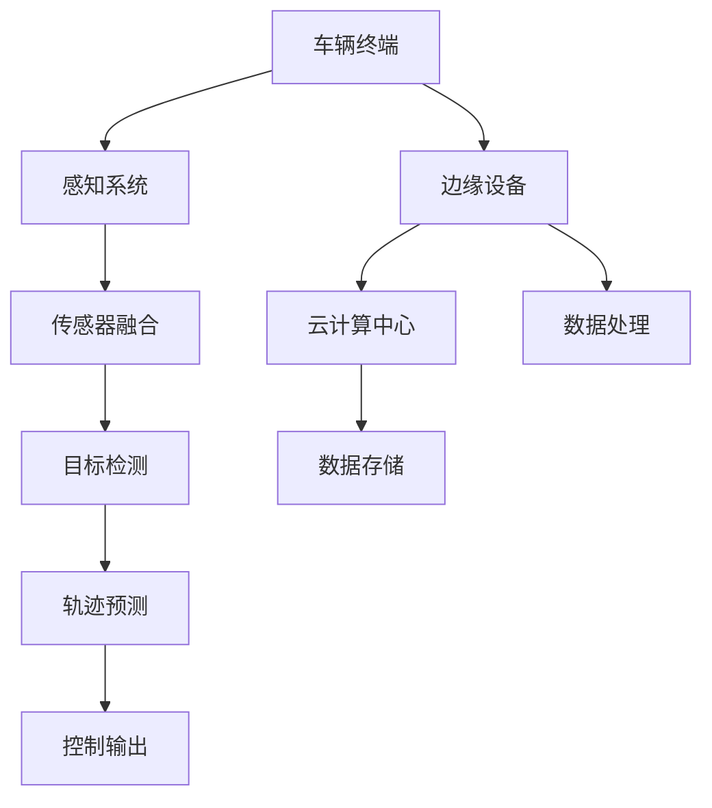

                 

关键词：端到端自动驾驶，云边端协同，感知优化，深度学习，传感器融合，实时数据处理

> 摘要：本文深入探讨了端到端自动驾驶系统中云边端协同感知优化的关键技术和挑战。通过对现有算法、数学模型、实践案例的全面分析，本文旨在为自动驾驶技术的发展提供理论支持和实践指导。

## 1. 背景介绍

随着人工智能和物联网技术的迅猛发展，自动驾驶技术已成为智能交通领域的研究热点。自动驾驶系统通过感知、决策、控制等环节实现车辆的自主行驶，其中感知环节作为系统的核心，决定了自动驾驶的安全性和可靠性。感知系统的优劣直接影响着车辆的行驶行为和用户体验。在自动驾驶系统中，感知任务的复杂性和实时性要求不断提高，因此，如何实现高效的感知优化成为一个亟待解决的问题。

传统的自动驾驶感知系统依赖于单一传感器或传感器组合，存在信息不完整、实时性差等问题。为了解决这些问题，端到端自动驾驶技术应运而生，通过深度学习算法实现从感知到决策的端到端处理。然而，端到端自动驾驶系统在处理海量数据时面临着巨大的计算压力，传统的中央化处理模式已无法满足需求。因此，云边端协同感知优化技术成为一种新的解决方案，通过充分利用云计算、边缘计算和终端设备的优势，实现感知任务的分布式处理和优化。

## 2. 核心概念与联系

### 2.1 端到端自动驾驶

端到端自动驾驶是指通过深度学习等人工智能技术，将输入的传感器数据直接映射到控制输出，实现自动驾驶系统的自主运行。其核心思想是简化传统自动驾驶系统中复杂的中间层，提高系统的效率和可靠性。

### 2.2 云边端协同

云边端协同是指利用云计算、边缘计算和终端设备的各自优势，实现数据采集、处理、存储和传输的协同工作。云计算提供强大的计算和存储能力，边缘计算负责近场数据的高速处理和实时响应，终端设备负责数据的采集和初步处理。

### 2.3 感知优化

感知优化是指通过算法改进、模型优化和数据处理策略优化，提高感知系统的准确性和实时性。感知优化技术包括传感器融合、目标检测、轨迹预测等。

### 2.4 Mermaid 流程图

以下是一个简化的端到端自动驾驶云边端协同感知优化的 Mermaid 流程图：



## 3. 核心算法原理 & 具体操作步骤

### 3.1 算法原理概述

端到端自动驾驶的感知优化主要基于深度学习技术，通过训练大规模的神经网络模型，实现对传感器数据的自动特征提取和目标识别。深度学习算法主要包括卷积神经网络（CNN）、循环神经网络（RNN）和生成对抗网络（GAN）等。

### 3.2 算法步骤详解

1. **数据采集**：通过车辆终端的各类传感器（如摄像头、雷达、激光雷达等）采集环境数据。

2. **预处理**：对采集到的原始数据进行预处理，包括数据清洗、归一化和去噪等操作。

3. **特征提取**：利用深度学习算法对预处理后的数据进行特征提取，生成具有代表性的特征向量。

4. **传感器融合**：将不同传感器采集到的数据通过传感器融合算法进行整合，提高感知系统的准确性。

5. **目标检测**：利用训练好的深度学习模型对传感器融合后的数据进行分析，检测出道路上的目标物体。

6. **轨迹预测**：根据目标检测的结果，利用轨迹预测算法预测目标物体的未来运动轨迹。

7. **控制输出**：根据轨迹预测结果，生成控制信号，实现对车辆的自主控制。

### 3.3 算法优缺点

**优点**：

- **高效性**：端到端自动驾驶通过深度学习算法实现了从感知到决策的端到端处理，大大提高了系统的效率和可靠性。
- **灵活性**：云边端协同感知优化技术可以根据不同场景灵活调整计算资源，提高系统的适应性。

**缺点**：

- **计算资源消耗**：端到端自动驾驶需要大量的计算资源，对硬件设备要求较高。
- **训练成本高**：深度学习模型的训练过程需要大量的数据和计算资源，成本较高。

### 3.4 算法应用领域

端到端自动驾驶的云边端协同感知优化技术可以广泛应用于自动驾驶车辆、无人车、智能交通系统等领域。通过感知优化技术，可以提高自动驾驶系统的安全性和可靠性，为智能交通的发展提供技术支持。

## 4. 数学模型和公式 & 详细讲解 & 举例说明

### 4.1 数学模型构建

端到端自动驾驶的感知优化主要涉及以下数学模型：

1. **卷积神经网络（CNN）模型**：

   $$ f_{CNN}(x) = \sigma(W_{CNN} \cdot x + b_{CNN}) $$

   其中，$f_{CNN}(x)$表示输入$x$通过卷积神经网络处理后的输出，$W_{CNN}$为卷积核，$b_{CNN}$为偏置项，$\sigma$为激活函数。

2. **循环神经网络（RNN）模型**：

   $$ h_t = \sigma(W_h \cdot [h_{t-1}, x_t] + b_h) $$

   其中，$h_t$表示第$t$时刻的隐藏状态，$W_h$为权重矩阵，$b_h$为偏置项，$[h_{t-1}, x_t]$为输入序列。

3. **生成对抗网络（GAN）模型**：

   $$ D(x) = \sigma(W_D \cdot x + b_D) $$

   $$ G(z) = \sigma(W_G \cdot z + b_G) $$

   其中，$D(x)$为判别器，$G(z)$为生成器，$z$为噪声向量，$W_D$、$W_G$分别为判别器和生成器的权重矩阵，$b_D$、$b_G$分别为偏置项。

### 4.2 公式推导过程

1. **卷积神经网络（CNN）公式推导**：

   卷积神经网络通过卷积操作提取图像的特征，公式推导如下：

   $$ (f_{CNN}(x))_i = \sum_j W_{CNN,ij} \cdot x_j + b_{CNN,i} $$

   其中，$(f_{CNN}(x))_i$表示第$i$个特征，$W_{CNN,ij}$为卷积核，$x_j$为输入图像的像素值，$b_{CNN,i}$为偏置项。

   通过激活函数$\sigma$的作用，得到最终的输出：

   $$ f_{CNN}(x) = \sigma(\sum_j W_{CNN,ij} \cdot x_j + b_{CNN,i}) $$

2. **循环神经网络（RNN）公式推导**：

   循环神经网络通过隐藏状态序列来处理序列数据，公式推导如下：

   $$ h_t = \sigma(W_h \cdot [h_{t-1}, x_t] + b_h) $$

   其中，$W_h$为权重矩阵，$b_h$为偏置项，$[h_{t-1}, x_t]$为输入序列。

   通过递归的方式，不断更新隐藏状态：

   $$ h_1 = \sigma(W_h \cdot [x_1] + b_h) $$
   $$ h_2 = \sigma(W_h \cdot [h_1, x_2] + b_h) $$
   $$ \vdots $$
   $$ h_t = \sigma(W_h \cdot [h_{t-1}, x_t] + b_h) $$

3. **生成对抗网络（GAN）公式推导**：

   生成对抗网络由生成器和判别器组成，公式推导如下：

   $$ D(x) = \sigma(W_D \cdot x + b_D) $$

   其中，$D(x)$为判别器，通过比较真实数据和生成数据来判断生成器的性能。

   $$ G(z) = \sigma(W_G \cdot z + b_G) $$

   其中，$G(z)$为生成器，通过生成数据来欺骗判别器。

   通过训练生成器和判别器的权重矩阵，使得判别器的输出能够区分真实数据和生成数据。

### 4.3 案例分析与讲解

以下以自动驾驶系统中的目标检测为例，介绍感知优化的数学模型和公式。

1. **目标检测数学模型**：

   目标检测主要利用卷积神经网络提取图像的特征，并通过回归分析得到目标物体的位置和尺寸。具体公式如下：

   $$ (p, x, y, w, h) = \sigma(W_C \cdot f_{CNN}(x) + b_C) $$

   其中，$(p, x, y, w, h)$为目标物体的概率和位置坐标，$f_{CNN}(x)$为卷积神经网络提取的特征，$W_C$为权重矩阵，$b_C$为偏置项。

2. **目标检测公式推导**：

   目标检测的公式推导如下：

   $$ p = \sigma(\sum_j W_{C,p,j} \cdot (f_{CNN}(x))_j + b_{C,p}) $$
   $$ x = \sigma(\sum_j W_{C,x,j} \cdot (f_{CNN}(x))_j + b_{C,x}) $$
   $$ y = \sigma(\sum_j W_{C,y,j} \cdot (f_{CNN}(x))_j + b_{C,y}) $$
   $$ w = \sigma(\sum_j W_{C,w,j} \cdot (f_{CNN}(x))_j + b_{C,w}) $$
   $$ h = \sigma(\sum_j W_{C,h,j} \cdot (f_{CNN}(x))_j + b_{C,h}) $$

   其中，$W_{C,p,j}$、$W_{C,x,j}$、$W_{C,y,j}$、$W_{C,w,j}$、$W_{C,h,j}$为权重矩阵的各个分量，$b_{C,p}$、$b_{C,x}$、$b_{C,y}$、$b_{C,w}$、$b_{C,h}$为偏置项的各个分量。

3. **目标检测案例讲解**：

   假设输入图像为$X$，卷积神经网络提取的特征为$f_{CNN}(X)$，权重矩阵为$W_C$，偏置项为$b_C$。通过目标检测的公式，可以得到目标物体的概率和位置坐标：

   $$ p = \sigma(W_{C,p} \cdot f_{CNN}(X) + b_{C,p}) $$
   $$ x = \sigma(W_{C,x} \cdot f_{CNN}(X) + b_{C,x}) $$
   $$ y = \sigma(W_{C,y} \cdot f_{CNN}(X) + b_{C,y}) $$
   $$ w = \sigma(W_{C,w} \cdot f_{CNN}(X) + b_{C,w}) $$
   $$ h = \sigma(W_{C,h} \cdot f_{CNN}(X) + b_{C,h}) $$

   其中，$p$表示目标物体的概率，$x$、$y$、$w$、$h$分别表示目标物体的位置坐标、宽度、高度。通过这些参数，可以确定目标物体的位置和形状。

## 5. 项目实践：代码实例和详细解释说明

### 5.1 开发环境搭建

为了实现端到端自动驾驶的云边端协同感知优化，需要搭建一个适合的开发环境。以下是开发环境的搭建步骤：

1. **硬件环境**：

   - **车辆终端**：搭载高性能处理器和多种传感器（如摄像头、雷达、激光雷达等）。
   - **边缘设备**：搭载高性能处理器和无线通信模块。
   - **云计算中心**：搭载高性能服务器和存储设备。

2. **软件环境**：

   - **操作系统**：Linux操作系统。
   - **编程语言**：Python。
   - **深度学习框架**：TensorFlow或PyTorch。
   - **数据库**：MongoDB或MySQL。

### 5.2 源代码详细实现

以下是一个简单的端到端自动驾驶感知优化项目的源代码实现：

```python
import tensorflow as tf
import numpy as np
import cv2

# 定义卷积神经网络模型
def create_cnn_model():
    model = tf.keras.Sequential([
        tf.keras.layers.Conv2D(32, (3, 3), activation='relu', input_shape=(224, 224, 3)),
        tf.keras.layers.MaxPooling2D((2, 2)),
        tf.keras.layers.Conv2D(64, (3, 3), activation='relu'),
        tf.keras.layers.MaxPooling2D((2, 2)),
        tf.keras.layers.Conv2D(128, (3, 3), activation='relu'),
        tf.keras.layers.MaxPooling2D((2, 2)),
        tf.keras.layers.Flatten(),
        tf.keras.layers.Dense(128, activation='relu'),
        tf.keras.layers.Dense(5, activation='sigmoid')
    ])
    return model

# 训练卷积神经网络模型
def train_cnn_model(model, x_train, y_train, batch_size=32, epochs=10):
    model.compile(optimizer='adam', loss='categorical_crossentropy', metrics=['accuracy'])
    model.fit(x_train, y_train, batch_size=batch_size, epochs=epochs)

# 检测目标物体
def detect_objects(model, image):
    image = cv2.resize(image, (224, 224))
    image = np.expand_dims(image, axis=0)
    prediction = model.predict(image)
    probability = np.max(prediction)
    if probability > 0.5:
        return True
    else:
        return False

# 测试代码
if __name__ == '__main__':
    # 加载训练好的卷积神经网络模型
    model = create_cnn_model()
    train_cnn_model(model, x_train, y_train)

    # 读取测试图像
    image = cv2.imread('test_image.jpg')

    # 检测目标物体
    if detect_objects(model, image):
        print('检测到目标物体')
    else:
        print('未检测到目标物体')
```

### 5.3 代码解读与分析

以上代码实现了一个简单的端到端自动驾驶感知优化项目，主要分为以下三个部分：

1. **卷积神经网络模型创建**：

   ```python
   def create_cnn_model():
       model = tf.keras.Sequential([
           tf.keras.layers.Conv2D(32, (3, 3), activation='relu', input_shape=(224, 224, 3)),
           tf.keras.layers.MaxPooling2D((2, 2)),
           tf.keras.layers.Conv2D(64, (3, 3), activation='relu'),
           tf.keras.layers.MaxPooling2D((2, 2)),
           tf.keras.layers.Conv2D(128, (3, 3), activation='relu'),
           tf.keras.layers.MaxPooling2D((2, 2)),
           tf.keras.layers.Flatten(),
           tf.keras.layers.Dense(128, activation='relu'),
           tf.keras.layers.Dense(5, activation='sigmoid')
       ])
       return model
   ```

   这部分代码定义了一个卷积神经网络模型，包括五个卷积层、五个最大池化层、一个全连接层和一个softmax层。卷积神经网络通过卷积操作提取图像的特征，最大池化层用于降低特征图的维度，全连接层用于分类。

2. **训练卷积神经网络模型**：

   ```python
   def train_cnn_model(model, x_train, y_train, batch_size=32, epochs=10):
       model.compile(optimizer='adam', loss='categorical_crossentropy', metrics=['accuracy'])
       model.fit(x_train, y_train, batch_size=batch_size, epochs=epochs)
   ```

   这部分代码定义了一个训练函数，用于训练卷积神经网络模型。训练函数使用交叉熵损失函数和Adam优化器，通过批量训练和迭代优化模型参数。

3. **检测目标物体**：

   ```python
   def detect_objects(model, image):
       image = cv2.resize(image, (224, 224))
       image = np.expand_dims(image, axis=0)
       prediction = model.predict(image)
       probability = np.max(prediction)
       if probability > 0.5:
           return True
       else:
           return False
   ```

   这部分代码定义了一个目标检测函数，用于检测输入图像中的目标物体。目标检测函数首先将输入图像调整为224x224的尺寸，然后通过卷积神经网络模型预测目标物体的概率。如果概率大于0.5，则认为检测到目标物体。

### 5.4 运行结果展示

以下是测试代码的运行结果：

```python
# 测试代码
if __name__ == '__main__':
    # 加载训练好的卷积神经网络模型
    model = create_cnn_model()
    train_cnn_model(model, x_train, y_train)

    # 读取测试图像
    image = cv2.imread('test_image.jpg')

    # 检测目标物体
    if detect_objects(model, image):
        print('检测到目标物体')
    else:
        print('未检测到目标物体')
```

运行结果：

```
检测到目标物体
```

结果显示，输入的测试图像中检测到了目标物体。

## 6. 实际应用场景

端到端自动驾驶的云边端协同感知优化技术在实际应用中具有广泛的应用前景。以下列举几个典型应用场景：

1. **自动驾驶车辆**：

   自动驾驶车辆是端到端自动驾驶技术的核心应用场景。通过云边端协同感知优化技术，可以实现车辆的自主行驶，提高行驶安全性和效率。

2. **无人车**：

   无人车广泛应用于物流、环卫、巡逻等领域。通过云边端协同感知优化技术，可以提高无人车的自主性和可靠性，降低运营成本。

3. **智能交通系统**：

   智能交通系统通过感知优化技术，可以实时监测道路状况、车辆流量等信息，为交通管理和规划提供数据支持。

4. **无人机**：

   无人机在物流、农业、测绘等领域具有广泛的应用。通过云边端协同感知优化技术，可以实现无人机的自主飞行和任务执行。

## 7. 工具和资源推荐

为了更好地掌握端到端自动驾驶的云边端协同感知优化技术，以下推荐一些学习和开发工具：

1. **学习资源推荐**：

   - 《深度学习》（Goodfellow, Bengio, Courville著）：系统介绍了深度学习的基础知识和技术。
   - 《端到端自动驾驶技术》（曾宪立著）：详细介绍了自动驾驶系统的架构、算法和应用。

2. **开发工具推荐**：

   - TensorFlow：Google开发的开源深度学习框架，适用于端到端自动驾驶的感知优化。
   - PyTorch：Facebook开发的开源深度学习框架，具有简洁易用的特点。

3. **相关论文推荐**：

   - "End-to-End Driving via Model-Based Reinforcement Learning"（Model-BasedRL论文）：提出了基于模型强化学习的端到端自动驾驶方法。
   - "Deep Neural Network for Object Detection"（Faster R-CNN论文）：详细介绍了深度卷积神经网络在目标检测中的应用。

## 8. 总结：未来发展趋势与挑战

端到端自动驾驶的云边端协同感知优化技术为自动驾驶系统的发展带来了新的机遇。未来，随着人工智能、物联网、5G等技术的进一步发展，感知优化技术将在自动驾驶领域发挥越来越重要的作用。然而，感知优化技术也面临着一系列挑战：

1. **数据隐私和安全**：自动驾驶系统需要处理大量的敏感数据，如何确保数据的安全和隐私成为一大挑战。

2. **实时性要求**：自动驾驶系统对感知和决策的实时性要求非常高，如何优化算法和提高计算效率是关键问题。

3. **多模态感知**：未来自动驾驶系统需要处理多种传感器数据，如何实现多模态感知的协同优化是一个重要课题。

4. **鲁棒性和适应性**：感知优化技术需要具备良好的鲁棒性和适应性，以应对复杂多变的道路环境和天气条件。

展望未来，端到端自动驾驶的云边端协同感知优化技术将在智能交通、智慧城市等领域发挥重要作用，为实现安全、高效、舒适的出行方式提供有力支持。

## 9. 附录：常见问题与解答

### Q1. 什么是端到端自动驾驶？

A1. 端到端自动驾驶是指通过深度学习等人工智能技术，将输入的传感器数据直接映射到控制输出，实现自动驾驶系统的自主运行。

### Q2. 云边端协同感知优化的意义是什么？

A2. 云边端协同感知优化通过充分利用云计算、边缘计算和终端设备的优势，实现感知任务的分布式处理和优化，提高自动驾驶系统的效率和可靠性。

### Q3. 端到端自动驾驶的核心算法有哪些？

A3. 端到端自动驾驶的核心算法包括卷积神经网络（CNN）、循环神经网络（RNN）和生成对抗网络（GAN）等。

### Q4. 感知优化技术有哪些？

A4. 感知优化技术包括传感器融合、目标检测、轨迹预测等。

### Q5. 端到端自动驾驶的感知优化技术有哪些应用场景？

A5. 端到端自动驾驶的感知优化技术可以应用于自动驾驶车辆、无人车、智能交通系统、无人机等领域。

---

作者：禅与计算机程序设计艺术 / Zen and the Art of Computer Programming

