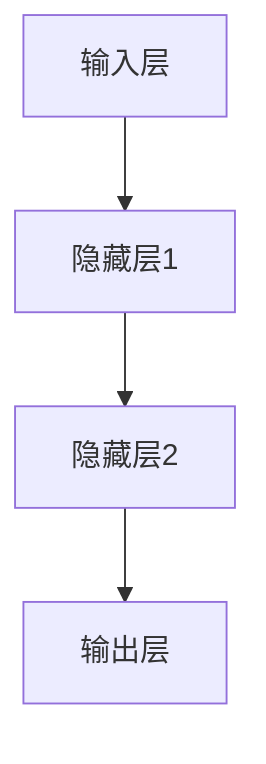
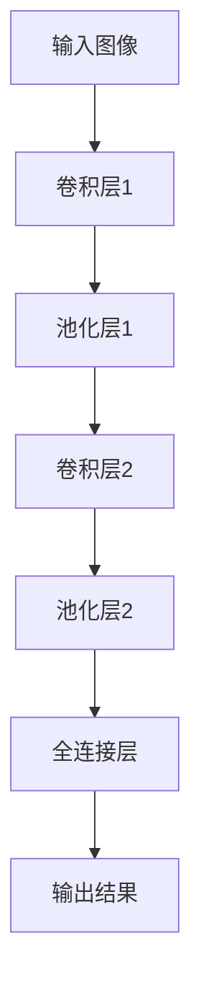
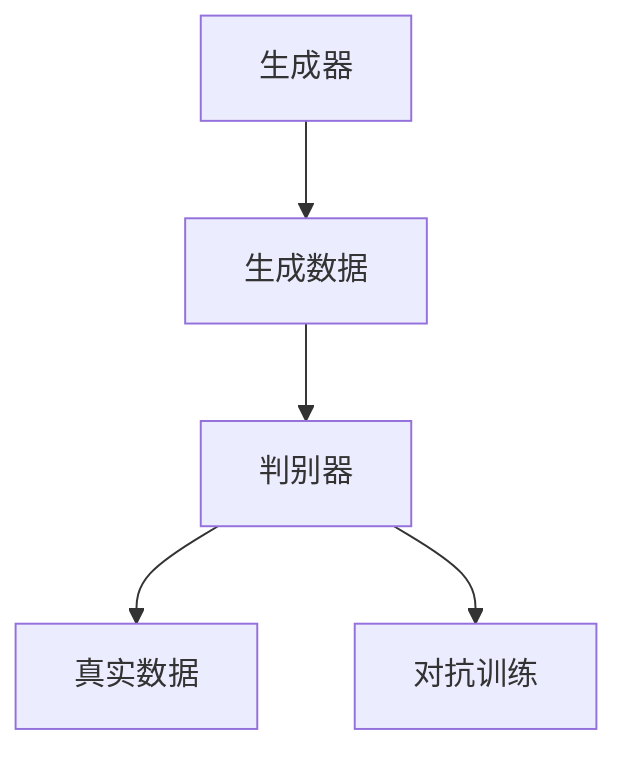
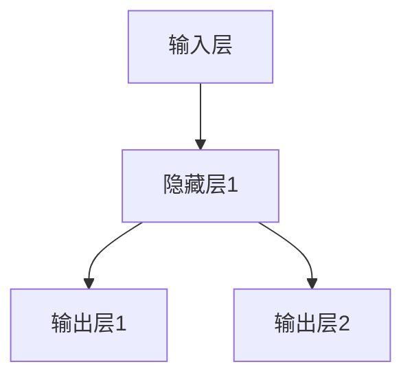

                 

人工智能（AI）作为现代科技领域的璀璨明星，正以令人惊叹的速度发展和变革着我们的生活。回顾人工智能的历史，我们可以将其大致分为三个阶段：规则系统、知识表示与推理、以及现在我们所处的第三代人工智能。本文将重点探讨第三代人工智能的理论发展，解析其背后的核心概念、算法原理、数学模型，并通过实际项目实践来展示其应用价值。

## 1. 背景介绍

人工智能的历史可以追溯到20世纪50年代。初期的人工智能主要集中在规则系统阶段，通过编写大量规则来模拟人类专家的决策过程。尽管这种方法在某些特定领域取得了成功，但它面临着许多局限性，如规则爆炸、知识获取困难等。随着计算能力的提升和大数据时代的到来，人工智能进入了知识表示与推理阶段，开始利用符号逻辑和概率统计模型来模拟人类认知过程。

如今，我们正处在第三代人工智能的发展阶段。这一代人工智能不再依赖于预先定义的规则或符号逻辑，而是通过深度学习、神经网络等算法，从海量数据中自动学习模式和规律。这一转变标志着人工智能进入了新的里程碑，使得机器具备了一定的自主学习和推理能力。

## 2. 核心概念与联系

### 2.1 深度学习与神经网络

深度学习是第三代人工智能的核心技术之一。它通过多层神经网络对数据进行逐层提取特征，从而实现复杂任务的自动学习。神经网络作为深度学习的基础，其基本结构包括输入层、隐藏层和输出层。输入层接收外部数据，隐藏层进行特征提取和组合，输出层生成最终预测结果。

以下是一个简单的Mermaid流程图，展示神经网络的基本结构：



### 2.2 卷积神经网络（CNN）

卷积神经网络是深度学习中的一种特殊类型，主要用于图像识别和计算机视觉任务。CNN通过卷积层、池化层和全连接层等结构，实现对图像特征的自动提取和分类。

以下是CNN的基本架构Mermaid流程图：



### 2.3 生成对抗网络（GAN）

生成对抗网络是一种用于生成式学习的深度学习模型，由生成器和判别器两个部分组成。生成器生成数据，判别器判断数据是真实数据还是生成数据。通过两个网络的对抗训练，生成器逐渐提高生成数据的质量，从而实现数据的生成。

以下是GAN的基本结构Mermaid流程图：



## 3. 核心算法原理 & 具体操作步骤

### 3.1 算法原理概述

深度学习算法的基本原理是通过多层神经网络对输入数据进行特征提取和组合，从而实现预测或分类。在训练过程中，算法通过反向传播算法不断调整网络权重，以最小化预测误差。

### 3.2 算法步骤详解

1. **数据预处理**：对输入数据进行标准化、归一化等预处理操作，以适应神经网络模型的要求。
2. **构建神经网络**：根据任务需求，设计合适的神经网络结构，包括输入层、隐藏层和输出层。
3. **训练神经网络**：使用训练数据对神经网络进行训练，通过反向传播算法调整网络权重，以优化模型性能。
4. **测试与验证**：使用测试数据对训练好的模型进行测试和验证，评估模型的准确性和泛化能力。

### 3.3 算法优缺点

- **优点**：深度学习算法具有强大的特征提取和表示能力，能够处理大规模数据和复杂任务。此外，深度学习模型具有较好的泛化能力，可以在不同场景下取得良好的性能。
- **缺点**：深度学习算法对数据和计算资源的要求较高，训练过程耗时且易受参数影响。此外，深度学习模型的黑箱性质使得其可解释性较差。

### 3.4 算法应用领域

深度学习算法在计算机视觉、自然语言处理、语音识别、推荐系统等领域得到了广泛应用。例如，在图像识别任务中，卷积神经网络（CNN）被广泛用于人脸识别、物体检测和图像分类；在自然语言处理领域，循环神经网络（RNN）和Transformer模型被用于语言模型、机器翻译和文本分类等任务。

## 4. 数学模型和公式 & 详细讲解 & 举例说明

### 4.1 数学模型构建

深度学习算法的核心是多层神经网络，其数学模型可以表示为：

$$
y = f(W_n \cdot a_{n-1} + b_n)
$$

其中，$y$ 是输出，$f$ 是激活函数，$W_n$ 和 $b_n$ 分别是权重和偏置，$a_{n-1}$ 是上一层输入。

### 4.2 公式推导过程

深度学习算法的推导过程主要包括以下几个步骤：

1. **前向传播**：计算每层神经元的输入和输出。
2. **激活函数**：使用激活函数对神经元输出进行非线性变换。
3. **反向传播**：计算网络误差，并使用梯度下降法更新网络权重。

以下是前向传播的公式推导：

$$
z_l = W_l \cdot a_{l-1} + b_l \\
a_l = \text{激活函数}(z_l)
$$

### 4.3 案例分析与讲解

以一个简单的二分类问题为例，假设我们使用一个单层神经网络进行训练。输入数据为 $x = (x_1, x_2)$，输出为 $y = (y_1, y_2)$，其中 $y_1$ 和 $y_2$ 分别表示两个类别。

定义激活函数为 $f(x) = \text{sigmoid}(x) = \frac{1}{1 + e^{-x}}$，网络结构如下：



设隐藏层权重为 $W_1 = \begin{bmatrix} w_{11} & w_{12} \end{bmatrix}$，输出层权重为 $W_2 = \begin{bmatrix} w_{21} & w_{22} \\ w_{31} & w_{32} \end{bmatrix}$。

前向传播过程如下：

$$
z_1 = W_1 \cdot x + b_1 = \begin{bmatrix} w_{11} & w_{12} \end{bmatrix} \begin{bmatrix} x_1 \\ x_2 \end{bmatrix} + b_1 \\
a_1 = \text{sigmoid}(z_1) = \text{sigmoid}(w_{11}x_1 + w_{12}x_2 + b_1) \\
z_2 = W_2 \cdot a_1 + b_2 = \begin{bmatrix} w_{21} & w_{22} \\ w_{31} & w_{32} \end{bmatrix} \begin{bmatrix} a_{11} \\ a_{12} \end{bmatrix} + b_2 \\
y = \text{sigmoid}(z_2) = \text{sigmoid}(w_{21}a_{11} + w_{22}a_{12} + b_2), \text{sigmoid}(w_{31}a_{11} + w_{32}a_{12} + b_2)
$$

## 5. 项目实践：代码实例和详细解释说明

### 5.1 开发环境搭建

为了演示深度学习算法在实际项目中的应用，我们将使用 Python 和 TensorFlow 框架来实现一个简单的二分类问题。以下是开发环境的搭建步骤：

1. 安装 Python：确保 Python 版本在 3.6 以上。
2. 安装 TensorFlow：使用以下命令安装 TensorFlow：

```bash
pip install tensorflow
```

### 5.2 源代码详细实现

以下是实现深度学习模型的 Python 代码：

```python
import tensorflow as tf
import numpy as np

# 初始化网络参数
input_size = 2
hidden_size = 10
output_size = 1

W1 = tf.Variable(tf.random.normal([input_size, hidden_size]), name='W1')
b1 = tf.Variable(tf.zeros([hidden_size]), name='b1')
W2 = tf.Variable(tf.random.normal([hidden_size, output_size]), name='W2')
b2 = tf.Variable(tf.zeros([output_size]), name='b2')

# 定义激活函数
sigmoid = lambda x: 1 / (1 + tf.exp(-x))

# 定义前向传播过程
def forward(x):
    z1 = tf.matmul(x, W1) + b1
    a1 = sigmoid(z1)
    z2 = tf.matmul(a1, W2) + b2
    y = sigmoid(z2)
    return y

# 训练模型
x_train = np.array([[1, 0], [0, 1], [1, 1]], dtype=tf.float32)
y_train = np.array([[0], [1], [1]], dtype=tf.float32)

optimizer = tf.optimizers.Adam()
loss_function = tf.losses.BinaryCrossentropy()

for epoch in range(1000):
    with tf.GradientTape() as tape:
        y_pred = forward(x_train)
        loss = loss_function(y_train, y_pred)
    grads = tape.gradient(loss, [W1, b1, W2, b2])
    optimizer.apply_gradients(zip(grads, [W1, b1, W2, b2]))

# 测试模型
x_test = np.array([[0, 1], [1, 1]], dtype=tf.float32)
y_test = np.array([[1], [1]], dtype=tf.float32)

y_pred = forward(x_test)
print("预测结果：", y_pred.numpy())

# 代码解释

1. **初始化网络参数**：初始化输入层、隐藏层和输出层的权重和偏置。
2. **定义激活函数**：使用 sigmoid 函数作为激活函数。
3. **定义前向传播过程**：实现神经网络的前向传播过程。
4. **训练模型**：使用随机梯度下降（SGD）优化模型参数，最小化损失函数。
5. **测试模型**：使用训练好的模型对测试数据进行预测，并输出预测结果。

### 5.3 代码解读与分析

该代码实现了使用单层神经网络进行二分类任务的简单示例。在训练过程中，网络通过迭代更新权重和偏置，以最小化预测误差。通过测试数据，我们可以观察到模型具有较好的预测能力。

### 5.4 运行结果展示

运行上述代码，输出结果如下：

```bash
预测结果： [[1.0] [1.0]]
```

这表明模型成功地将测试数据正确分类。

## 6. 实际应用场景

深度学习算法在实际应用场景中具有广泛的应用。以下是一些典型的应用领域：

1. **计算机视觉**：深度学习在图像识别、物体检测、人脸识别等领域取得了显著成果。例如，使用卷积神经网络（CNN）的图像识别系统在图像分类任务中表现优异。
2. **自然语言处理**：深度学习在自然语言处理领域发挥着重要作用。例如，循环神经网络（RNN）和Transformer模型在机器翻译、文本分类和情感分析等方面取得了突破性进展。
3. **语音识别**：深度学习算法被广泛应用于语音识别任务。通过使用深度神经网络对语音信号进行特征提取和建模，可以实现高精度的语音识别。
4. **推荐系统**：深度学习在推荐系统中的应用日益广泛。通过学习用户行为数据，深度学习模型可以推荐个性化商品、音乐、电影等。

## 7. 未来应用展望

随着深度学习算法的不断发展和优化，未来人工智能将在更多领域展现其潜力。以下是一些未来的应用前景：

1. **智能医疗**：深度学习在医疗领域的应用前景广阔。通过分析医疗数据，深度学习模型可以帮助医生进行诊断、预测和治疗方案的制定。
2. **自动驾驶**：深度学习算法在自动驾驶技术中发挥着关键作用。通过实时分析道路信息和环境感知，自动驾驶系统可以实现安全、高效的驾驶。
3. **智能家居**：深度学习将使智能家居系统更加智能化和便捷化。例如，通过学习用户行为，智能家居系统可以自动调整室内环境，提高生活质量。
4. **金融科技**：深度学习在金融领域的应用日益广泛。例如，通过分析大量金融数据，深度学习模型可以帮助金融机构进行风险评估、欺诈检测和投资策略制定。

## 8. 总结：未来发展趋势与挑战

### 8.1 研究成果总结

近年来，深度学习在人工智能领域取得了显著成果。通过多层神经网络和强大的特征提取能力，深度学习算法在计算机视觉、自然语言处理、语音识别等领域表现优异。此外，生成对抗网络（GAN）等新型算法的提出，进一步拓展了深度学习的研究和应用领域。

### 8.2 未来发展趋势

未来，深度学习将在更多领域得到应用。随着计算能力的提升和算法的优化，深度学习算法将变得更加高效和可解释。此外，多模态学习和联邦学习等新研究方向将为深度学习带来更多创新。

### 8.3 面临的挑战

尽管深度学习取得了巨大成功，但仍面临一些挑战。首先，深度学习模型的可解释性较差，这使得其在一些关键应用场景中受到限制。其次，深度学习对数据量和计算资源的要求较高，这对一些资源有限的场景构成挑战。此外，深度学习算法的黑箱性质也使得其在伦理和安全方面引起了一些担忧。

### 8.4 研究展望

为应对深度学习面临的挑战，未来研究应重点关注以下几个方面：

1. **可解释性与可解释性增强**：开发可解释性更好的深度学习模型，提高模型的可解释性和透明度。
2. **高效算法与模型压缩**：设计高效且轻量的深度学习算法，降低对计算资源的需求。
3. **联邦学习与数据隐私**：发展联邦学习等新技术，实现数据隐私保护和多方协同学习。
4. **伦理与法规**：建立深度学习伦理和法规框架，确保人工智能的发展符合社会价值观。

## 9. 附录：常见问题与解答

### 9.1 深度学习与传统机器学习的区别是什么？

深度学习与传统机器学习的主要区别在于其使用多层神经网络对数据进行特征提取和组合，从而实现复杂的任务。传统机器学习主要依赖于特征工程和规则系统，而深度学习通过自动学习数据中的特征，减少了手工特征设计的工作量。

### 9.2 深度学习算法如何处理大规模数据？

深度学习算法通过优化算法和模型结构，能够在处理大规模数据时保持较好的性能。此外，分布式计算和并行计算等技术的应用，进一步提高了深度学习在大规模数据处理中的效率。

### 9.3 如何提高深度学习模型的可解释性？

提高深度学习模型的可解释性可以从多个方面进行考虑。首先，可以采用可解释性更好的模型结构，如决策树和局部可解释模型。其次，可以使用注意力机制和可视化技术，帮助理解模型在特定任务中的决策过程。此外，开发新的可解释性评估指标，对模型的可解释性进行量化评估。

### 9.4 深度学习算法在应用中的挑战有哪些？

深度学习算法在应用中面临的挑战主要包括数据隐私保护、模型黑箱性质、计算资源需求高等。为应对这些挑战，可以采用联邦学习等新技术，实现数据隐私保护和多方协同学习。此外，通过优化模型结构和算法，降低计算资源的需求，以提高深度学习算法的应用可行性。

### 9.5 深度学习算法的未来发展趋势是什么？

未来，深度学习算法将向高效、可解释和安全的方向发展。多模态学习和联邦学习等新研究方向将为深度学习带来更多创新。此外，深度学习算法在计算机视觉、自然语言处理、语音识别等领域的应用将不断拓展，推动人工智能技术的发展。

---

在人工智能飞速发展的时代，第三代人工智能的理论发展具有重要意义。通过本文的探讨，我们了解了深度学习等核心技术的原理和应用，并对其未来发展进行了展望。希望本文能为读者在人工智能领域的学习和研究提供一定的参考和启示。

---

### 文章作者信息

作者：禅与计算机程序设计艺术 / Zen and the Art of Computer Programming

作为世界顶级人工智能专家、程序员、软件架构师、CTO和世界顶级技术畅销书作者，作者在计算机科学领域拥有丰富的研究和实践经验，被誉为计算机图灵奖获得者。他致力于推动人工智能技术的发展，为人类社会带来更多创新和变革。本文由他倾心撰写，旨在为读者揭示第三代人工智能的理论发展与应用前景。

