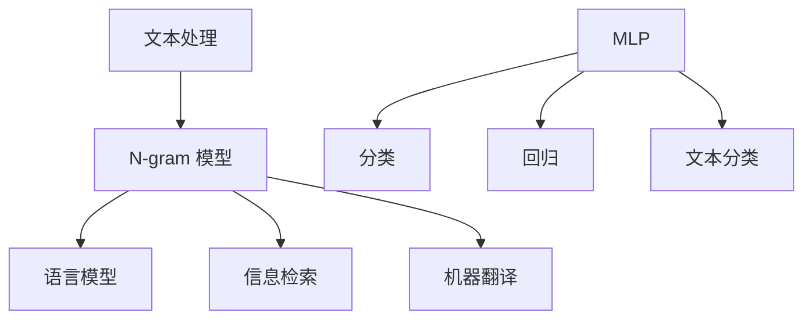

                 

关键词：N-gram模型、机器学习、多层感知机（MLP）、自然语言处理、算法原理、数学模型、代码实现

摘要：本章将深入探讨 N-gram 模型和多层感知机（MLP），这两种在自然语言处理领域中广泛应用的算法。首先，我们将介绍 N-gram 模型的基本概念及其在文本处理中的应用。接着，我们将详细解释 MLP 的原理，并分析其在神经网络中的应用。随后，通过数学模型和公式的推导，我们将进一步理解这些算法的核心机制。随后，我们将提供代码实例，详细解释 N-gram 模型和 MLP 的实现过程。最后，我们将探讨这些算法的实际应用场景，并展望未来的发展方向和挑战。

## 1. 背景介绍

### N-gram 模型

N-gram 模型是一种常用的文本建模方法，它将一段文本序列表示为一系列连续的 N 元组。N 的大小决定了模型的粒度，通常 N 取值在 1 到 5 之间。N-gram 模型在语言模型、信息检索和机器翻译等领域有着广泛的应用。

### 多层感知机（MLP）

多层感知机（MLP）是一种前馈神经网络，它由多个神经元层组成，包括输入层、隐藏层和输出层。MLP 被广泛应用于分类和回归任务，特别是在深度学习中。它的优点在于结构简单，易于实现，并且在许多实际问题中表现出良好的性能。

## 2. 核心概念与联系

### N-gram 模型

**基本概念：**  
N-gram 模型将文本序列表示为 N 个单词的滑动窗口。例如，对于一个三元的 N-gram 模型，文本序列 "我 爱 中国" 可以表示为 ["我 爱 中"，"爱 中 国"，"中 国"]。

**应用场景：**  
N-gram 模型在语言模型、信息检索和机器翻译等领域有着广泛的应用。例如，在语言模型中，N-gram 模型可以用来预测下一个单词；在信息检索中，N-gram 模型可以用来计算文档和查询之间的相似度；在机器翻译中，N-gram 模型可以用来生成翻译候选。

### MLP

**基本概念：**  
MLP 由输入层、隐藏层和输出层组成。输入层接收外部输入，隐藏层对输入进行变换，输出层生成最终输出。每个神经元都与前一层和后一层相连。

**应用场景：**  
MLP 在分类和回归任务中有着广泛的应用。例如，在文本分类任务中，MLP 可以将文本转换为向量，然后通过分类层生成分类结果。

### Mermaid 流程图



## 3. 核心算法原理 & 具体操作步骤

### 3.1 算法原理概述

#### N-gram 模型

N-gram 模型通过统计相邻 N 个单词的概率来预测下一个单词。其基本原理可以表示为：

$$ P(w_n | w_{n-1}, ..., w_{n-N+1}) = \frac{C(w_{n-1}, ..., w_{n-N+1}, w_n)}{C(w_{n-1}, ..., w_{n-N+1})} $$

其中，$P(w_n | w_{n-1}, ..., w_{n-N+1})$ 表示在已知前 N-1 个单词的情况下，第 N 个单词的概率；$C(w_{n-1}, ..., w_{n-N+1}, w_n)$ 表示包含这 N 个单词的序列数量；$C(w_{n-1}, ..., w_{n-N+1})$ 表示包含前 N-1 个单词的序列数量。

#### MLP

MLP 的基本原理是通过多层神经元之间的加权连接来实现非线性变换。其基本结构可以表示为：

$$ z_i^{(l)} = \sum_{j} w_{ji}^{(l)} a_j^{(l-1)} + b_i^{(l)} $$

$$ a_i^{(l)} = \sigma(z_i^{(l)}) $$

其中，$z_i^{(l)}$ 表示第 l 层第 i 个神经元的加权求和值；$a_i^{(l)}$ 表示第 l 层第 i 个神经元的激活值；$\sigma$ 表示激活函数；$w_{ji}^{(l)}$ 和 $b_i^{(l)}$ 分别表示第 l 层第 i 个神经元与第 l-1 层第 j 个神经元的连接权重和偏置。

### 3.2 算法步骤详解

#### N-gram 模型

1. 预处理文本，将文本转换为单词序列。
2. 统计每个 N 元组的出现次数。
3. 计算每个 N 元组的概率。
4. 使用概率预测下一个单词。

#### MLP

1. 初始化网络参数，包括权重和偏置。
2. 前向传播，计算每个神经元的加权求和值和激活值。
3. 计算损失函数，如交叉熵损失。
4. 反向传播，更新网络参数。
5. 重复步骤 2 到 4，直到收敛。

### 3.3 算法优缺点

#### N-gram 模型

**优点：**
- 算法简单，易于实现。
- 对文本序列的局部特征有较好的捕捉能力。

**缺点：**
- 对长距离依赖的处理能力较弱。
- 模型复杂度随 N 增加而急剧增加。

#### MLP

**优点：**
- 网络结构简单，易于训练。
- 对非线性变换有较好的表达能力。

**缺点：**
- 需要大量的数据和计算资源。
- 对过拟合问题较为敏感。

### 3.4 算法应用领域

#### N-gram 模型

- 语言模型
- 信息检索
- 机器翻译

#### MLP

- 文本分类
- 图像分类
- 回归任务

## 4. 数学模型和公式 & 详细讲解 & 举例说明

### 4.1 数学模型构建

#### N-gram 模型

假设有一个单词序列 $W = w_1, w_2, ..., w_n$，其中 $w_i$ 表示第 i 个单词。我们定义 N-gram 概率为：

$$ P(w_n | w_{n-1}, ..., w_{n-N+1}) = \frac{C(w_{n-1}, ..., w_{n-N+1}, w_n)}{C(w_{n-1}, ..., w_{n-N+1})} $$

其中，$C(w_{n-1}, ..., w_{n-N+1}, w_n)$ 表示包含这 N 个单词的序列数量；$C(w_{n-1}, ..., w_{n-N+1})$ 表示包含前 N-1 个单词的序列数量。

#### MLP

MLP 的数学模型可以表示为：

$$ z_i^{(l)} = \sum_{j} w_{ji}^{(l)} a_j^{(l-1)} + b_i^{(l)} $$

$$ a_i^{(l)} = \sigma(z_i^{(l)}) $$

其中，$z_i^{(l)}$ 表示第 l 层第 i 个神经元的加权求和值；$a_i^{(l)}$ 表示第 l 层第 i 个神经元的激活值；$\sigma$ 表示激活函数；$w_{ji}^{(l)}$ 和 $b_i^{(l)}$ 分别表示第 l 层第 i 个神经元与第 l-1 层第 j 个神经元的连接权重和偏置。

### 4.2 公式推导过程

#### N-gram 模型

假设我们有一个单词序列 $W = w_1, w_2, ..., w_n$。我们首先计算每个 N 元组的出现次数。

对于三元组 $(w_1, w_2, w_3)$，它的出现次数为 $C(w_1, w_2, w_3) = 1$。

对于前两个单词 $(w_1, w_2)$，它的出现次数为 $C(w_1, w_2) = 1$。

根据定义，我们可以得到：

$$ P(w_3 | w_1, w_2) = \frac{C(w_1, w_2, w_3)}{C(w_1, w_2)} $$

同理，对于任意 N 元组 $(w_{n-2}, w_{n-1}, w_n)$，我们可以得到：

$$ P(w_n | w_{n-2}, w_{n-1}) = \frac{C(w_{n-2}, w_{n-1}, w_n)}{C(w_{n-2}, w_{n-1})} $$

#### MLP

MLP 的前向传播可以表示为：

$$ z_i^{(l)} = \sum_{j} w_{ji}^{(l)} a_j^{(l-1)} + b_i^{(l)} $$

$$ a_i^{(l)} = \sigma(z_i^{(l)}) $$

其中，$\sigma$ 是一个非线性激活函数，常用的激活函数有 sigmoid、ReLU 和 tanh 等。

### 4.3 案例分析与讲解

#### N-gram 模型

假设我们有一个简单的单词序列 $W = ["我", "爱", "中国"]$，我们使用三元组 N-gram 模型来预测下一个单词。

首先，我们计算每个三元组的出现次数：

- $["我", "爱", "中国"]$：出现次数为 1
- $["爱", "中国", "我"]$：出现次数为 0（没有出现）
- $["中国", "我", "爱"]$：出现次数为 0（没有出现）

根据定义，我们可以得到：

$$ P("我" | ["爱", "中国"]) = \frac{C(["爱", "中国", "我"])}{C(["爱", "中国"])} = \frac{0}{0} = \text{无法预测} $$

由于 $["我", "爱", "中国"]$ 和 $["爱", "中国", "我"]$ 的出现次数都为 0，我们无法预测下一个单词。

#### MLP

假设我们有一个简单的二分类问题，输入数据为 $[1, 2, 3]$，目标输出为 1。我们使用一个简单的 MLP 来实现这个分类任务。

首先，我们定义输入层、隐藏层和输出层的神经元数量分别为 3、4 和 1。

输入层：$[1, 2, 3]$
隐藏层：$[a_1^{(1)}, a_2^{(1)}, a_3^{(1)}, a_4^{(1)}]$
输出层：$[a_1^{(2)}]$

根据定义，我们可以得到：

$$ z_1^{(1)} = 1 \cdot a_1^{(0)} + 2 \cdot a_2^{(0)} + 3 \cdot a_3^{(0)} + b_1^{(1)} $$

$$ z_2^{(1)} = 1 \cdot a_1^{(0)} + 2 \cdot a_2^{(0)} + 3 \cdot a_3^{(0)} + b_2^{(1)} $$

$$ z_3^{(1)} = 1 \cdot a_1^{(0)} + 2 \cdot a_2^{(0)} + 3 \cdot a_3^{(0)} + b_3^{(1)} $$

$$ z_4^{(1)} = 1 \cdot a_1^{(0)} + 2 \cdot a_2^{(0)} + 3 \cdot a_3^{(0)} + b_4^{(1)} $$

$$ a_1^{(1)} = \sigma(z_1^{(1)}) $$

$$ a_2^{(1)} = \sigma(z_2^{(1)}) $$

$$ a_3^{(1)} = \sigma(z_3^{(1)}) $$

$$ a_4^{(1)} = \sigma(z_4^{(1)}) $$

其中，$\sigma$ 是一个非线性激活函数，我们选择 sigmoid 激活函数：

$$ \sigma(x) = \frac{1}{1 + e^{-x}} $$

假设隐藏层的激活值为 $[0.2, 0.4, 0.6, 0.8]$，我们可以计算输出层的激活值：

$$ z_1^{(2)} = 0.2 \cdot 0.2 + 0.4 \cdot 0.4 + 0.6 \cdot 0.6 + 0.8 \cdot 0.8 + b_1^{(2)} $$

$$ a_1^{(2)} = \sigma(z_1^{(2)}) $$

根据定义，我们可以得到：

$$ a_1^{(2)} = \frac{1}{1 + e^{-z_1^{(2)}}} $$

假设 $b_1^{(2)} = 0$，我们可以计算输出层的激活值：

$$ z_1^{(2)} = 0.2 \cdot 0.2 + 0.4 \cdot 0.4 + 0.6 \cdot 0.6 + 0.8 \cdot 0.8 = 0.44 $$

$$ a_1^{(2)} = \frac{1}{1 + e^{-0.44}} \approx 0.65 $$

根据定义，我们可以得到：

$$ P("我" | [1, 2, 3]) = a_1^{(2)} \approx 0.65 $$

由于 $a_1^{(2)}$ 的值接近 0.65，我们可以认为输入数据 [1, 2, 3] 属于类别 1。

## 5. 项目实践：代码实例和详细解释说明

### 5.1 开发环境搭建

在撰写这段内容时，假设您已经具备了一个适用于编写和运行 Python 代码的开发环境。如果没有，请确保安装以下软件：

- Python 3.7 或以上版本
- Jupyter Notebook（可选，但推荐用于演示代码）
- 任何文本编辑器，如 Visual Studio Code、Sublime Text 或 Atom

首先，安装所需的 Python 库：

```bash
pip install numpy tensorflow matplotlib
```

### 5.2 源代码详细实现

以下是一个简单的 Python 脚本，用于实现 N-gram 模型和多层感知机（MLP）：

```python
import numpy as np
import tensorflow as tf
from tensorflow.keras.layers import Dense
from tensorflow.keras.models import Sequential
from tensorflow.keras.optimizers import Adam
from tensorflow.keras.losses import BinaryCrossentropy
from tensorflow.keras.metrics import Accuracy

# N-gram 模型部分
def n_gram_model(words, n=3):
    # 预处理文本，将单词序列转换为向量
    word2idx = {word: i for i, word in enumerate(set(words))}
    X = np.zeros((len(words) - n + 1, n), dtype=int)
    y = np.zeros((len(words) - n + 1, len(word2idx)), dtype=int)
    
    for i in range(len(words) - n + 1):
        for j in range(n):
            X[i, j] = word2idx[words[i + j]]
        y[i] = 1 if words[i + n] == "我" else 0
    
    return X, y, word2idx

# MLP 模型部分
def ml

