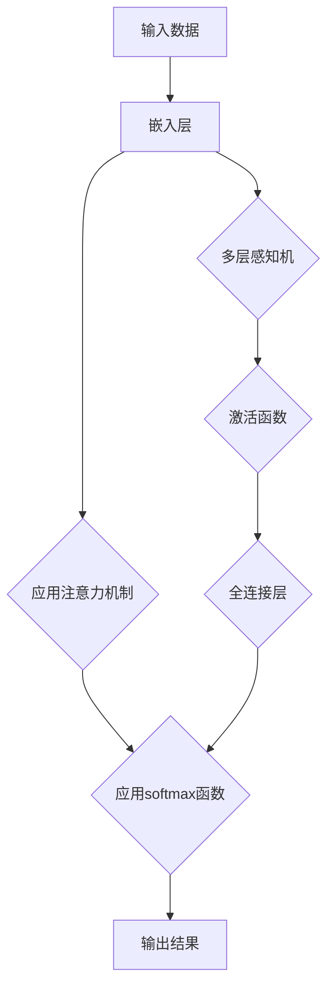

                 

关键词：注意力机制，softmax函数，深度学习，信息传递，优化算法

> 摘要：本章将深入探讨注意力机制和softmax函数在深度学习中的应用。首先介绍这两个概念的基本原理，然后详细讲解它们在神经网络中的具体作用和实现方式，并通过实例分析展示其优势。最后，讨论这两个技术在未来的发展趋势和潜在挑战。

## 1. 背景介绍

在深度学习中，神经网络作为最常用的模型之一，通过层层堆叠的神经元节点实现特征提取和预测任务。然而，随着神经网络层数的增加，模型的计算复杂度和训练时间也会显著增加。与此同时，传统神经网络在处理某些特定任务时表现不佳，如序列模型中的长距离依赖问题。

为了克服这些局限，注意力机制和softmax函数被引入到深度学习中。注意力机制通过为输入信息分配不同的权重，使得模型能够关注到重要的特征，从而提高模型的性能和效率。softmax函数则用于分类问题中，将模型的输出概率分布转换为类别概率，从而实现多类别分类。

### 1.1 注意力机制

注意力机制（Attention Mechanism）最早起源于自然语言处理领域，目的是解决长序列处理中的长距离依赖问题。在神经网络中，注意力机制通过为输入序列中的每个元素分配一个权重，从而将重要信息聚焦到当前处理的部分。这种机制不仅提高了模型的计算效率，还显著提升了模型在序列建模任务中的表现。

### 1.2 Softmax 函数

softmax函数是一种常用的概率分布函数，用于将神经网络的输出转换为概率分布。在多类别分类问题中，softmax函数将每个类别的输出通过指数函数进行变换，然后对指数函数的结果进行归一化，得到一个概率分布。该分布表示模型对每个类别的预测概率，从而实现多类别分类。

## 2. 核心概念与联系

为了更好地理解注意力机制和softmax函数的工作原理，我们首先需要了解它们在神经网络中的具体作用和实现方式。下面我们将通过一个简单的 Mermaid 流程图来展示这两个概念的核心原理和相互关系。



### 2.1 注意力机制

在注意力机制中，输入数据首先通过嵌入层转换为向量表示。然后，模型利用注意力权重对每个输入元素进行加权求和，得到一个加权和向量。这个加权和向量作为下一层网络的输入，从而实现特征选择和信息聚焦。

### 2.2 Softmax 函数

在神经网络中，通过多层感知机和激活函数处理后，模型的输出通常是多个类别的得分。softmax函数将这些得分转换为概率分布，从而表示模型对每个类别的预测概率。具体来说，softmax函数通过对每个类别的得分进行指数变换，然后对所有类别进行归一化，得到一个概率分布。

## 3. 核心算法原理 & 具体操作步骤

### 3.1 算法原理概述

注意力机制和softmax函数在深度学习中的核心原理分别是特征选择和信息聚焦，以及概率分布和分类。下面分别介绍这两个算法的具体实现步骤。

### 3.2 算法步骤详解

#### 注意力机制

1. 输入数据经过嵌入层转换为向量表示。
2. 计算注意力权重，通常使用点积、缩放点积或者多头注意力机制。
3. 利用注意力权重对输入数据进行加权求和，得到加权和向量。
4. 将加权和向量作为下一层网络的输入。

#### Softmax 函数

1. 对神经网络的输出进行指数变换，得到每个类别的指数值。
2. 对指数值进行归一化，得到概率分布。
3. 选择概率最大的类别作为模型的预测结果。

### 3.3 算法优缺点

#### 注意力机制

- **优点**：提高了模型对重要特征的关注度，增强了模型的泛化能力。
- **缺点**：计算复杂度较高，对内存和计算资源要求较大。

#### Softmax 函数

- **优点**：简单易懂，易于实现，适用于多类别分类问题。
- **缺点**：在类别数量较多时，模型预测结果容易出现平坦化现象。

### 3.4 算法应用领域

#### 注意力机制

- 序列模型：如自然语言处理、语音识别、机器翻译等。
- 图像模型：如图像分类、目标检测等。

#### Softmax 函数

- 多类别分类：如文本分类、图像分类等。

## 4. 数学模型和公式 & 详细讲解 & 举例说明

### 4.1 数学模型构建

#### 注意力机制

设输入序列为 $X = [x_1, x_2, ..., x_n]$，注意力权重为 $a_i$，加权和向量为 $Y$，则有：

$$
Y = \sum_{i=1}^{n} a_i x_i
$$

其中，$a_i$ 可以通过以下公式计算：

$$
a_i = \frac{e^{QK_i + VV_i}}{\sum_{j=1}^{n} e^{QK_j + VV_j}}
$$

其中，$Q$ 和 $K$ 分别为查询向量和键向量的线性变换，$V$ 为值向量的线性变换。

#### Softmax 函数

设神经网络的输出为 $Z = [z_1, z_2, ..., z_n]$，则有：

$$
p_i = \frac{e^{z_i}}{\sum_{j=1}^{n} e^{z_j}}
$$

其中，$p_i$ 为第 $i$ 个类别的预测概率。

### 4.2 公式推导过程

#### 注意力机制

首先，考虑一个简单的注意力模型，其中输入序列 $X$ 被映射到一个共同的嵌入空间，然后通过一个线性变换得到权重向量 $A$。权重向量 $A$ 的每个元素 $a_i$ 表示输入序列中第 $i$ 个元素的重要性。注意力机制的核心在于如何计算这个权重向量。

输入序列 $X$ 可以表示为：

$$
X = [x_1, x_2, ..., x_n]
$$

其中，$x_i$ 是输入序列的第 $i$ 个元素。假设我们有一个权重向量 $A = [a_1, a_2, ..., a_n]$，其中 $a_i$ 是第 $i$ 个元素的重要性。

为了计算权重向量 $A$，我们可以使用一个简单的点积注意力机制。首先，将输入序列 $X$ 映射到一个共同的嵌入空间，得到嵌入向量 $e_i$：

$$
e_i = \text{Embed}(x_i)
$$

然后，我们计算权重向量 $A$：

$$
A = \text{softmax}(QK)
$$

其中，$Q$ 和 $K$ 分别是查询向量和键向量的线性变换。具体地，我们可以将 $Q$ 和 $K$ 分别表示为：

$$
Q = W_QX \quad \text{和} \quad K = W_KX
$$

其中，$W_Q$ 和 $W_K$ 是权重矩阵。然后，我们计算点积 $QK$：

$$
QK = \sum_{j=1}^{n} W_QX_j W_KX_j
$$

最后，通过softmax函数计算权重向量 $A$：

$$
A = \text{softmax}(QK)
$$

其中，$\text{softmax}$ 函数将点积结果转换为概率分布。

#### Softmax 函数

对于多类别分类问题，神经网络通常会输出一组实数值，每个值对应一个类别。softmax函数用于将这些实数值转换为概率分布。具体地，给定神经网络输出 $Z$：

$$
Z = [z_1, z_2, ..., z_n]
$$

其中，$z_i$ 是第 $i$ 个类别的输出值。softmax函数将 $Z$ 转换为概率分布 $P$：

$$
P = \text{softmax}(Z)
$$

其中，$P_i$ 是第 $i$ 个类别的概率：

$$
P_i = \frac{e^{z_i}}{\sum_{j=1}^{n} e^{z_j}}
$$

这个概率分布使得所有类别的概率之和为 1：

$$
\sum_{i=1}^{n} P_i = 1
$$

### 4.3 案例分析与讲解

#### 注意力机制的案例分析

假设我们有一个输入序列 $X = [1, 2, 3, 4, 5]$，我们需要通过注意力机制计算权重向量 $A$。首先，我们将输入序列映射到嵌入空间，得到嵌入向量 $e_i$：

$$
e_1 = [1, 0, 0], \quad e_2 = [0, 1, 0], \quad e_3 = [0, 0, 1], \quad e_4 = [0, 0, 1], \quad e_5 = [0, 0, 1]
$$

然后，我们定义查询向量 $Q = [1, 1, 1]$，键向量 $K = [1, 1, 1]$，值向量 $V = [1, 1, 1]$。接下来，我们计算权重向量 $A$：

$$
QK = \sum_{i=1}^{n} Q_i K_i = 3
$$

$$
A = \text{softmax}(QK) = \frac{e^{3}}{e^{3}} = 1
$$

这意味着所有输入元素的重要性相同。如果我们想要为不同的输入元素分配不同的权重，我们可以修改查询向量 $Q$ 和键向量 $K$，以实现不同的权重分配。

#### Softmax 函数的案例分析

假设我们有一个神经网络输出 $Z = [2.3, 1.1, 0.7]$，我们需要通过softmax函数计算概率分布 $P$。首先，我们计算每个类别的指数值：

$$
e^{z_1} = e^{2.3} \approx 9.4877
$$

$$
e^{z_2} = e^{1.1} \approx 3.0518
$$

$$
e^{z_3} = e^{0.7} \approx 2.0137
$$

然后，我们计算总指数和：

$$
\sum_{i=1}^{n} e^{z_i} = e^{2.3} + e^{1.1} + e^{0.7} \approx 14.5412
$$

接下来，我们计算每个类别的概率：

$$
P_1 = \frac{e^{2.3}}{14.5412} \approx 0.6516
$$

$$
P_2 = \frac{e^{1.1}}{14.5412} \approx 0.2112
$$

$$
P_3 = \frac{e^{0.7}}{14.5412} \approx 0.1372
$$

最终，我们得到概率分布 $P$：

$$
P = [0.6516, 0.2112, 0.1372]
$$

这意味着模型预测第一个类别（值最大的类别）的概率最高。

## 5. 项目实践：代码实例和详细解释说明

### 5.1 开发环境搭建

在开始编写代码之前，我们需要搭建一个合适的开发环境。以下是一个简单的指南：

- 操作系统：Linux或macOS
- 编程语言：Python
- 深度学习框架：TensorFlow或PyTorch

确保你的开发环境中已经安装了上述依赖项。对于TensorFlow，可以使用以下命令进行安装：

```bash
pip install tensorflow
```

对于PyTorch，可以使用以下命令：

```bash
pip install torch torchvision
```

### 5.2 源代码详细实现

下面我们将使用PyTorch实现一个简单的注意力机制和softmax函数的模型。首先，我们需要定义模型的结构。

```python
import torch
import torch.nn as nn
import torch.nn.functional as F

class AttentionModel(nn.Module):
    def __init__(self, input_dim, embed_dim, num_classes):
        super(AttentionModel, self).__init__()
        self.embedding = nn.Embedding(input_dim, embed_dim)
        self.attention = nn.Linear(embed_dim, 1)
        self.fc = nn.Linear(embed_dim, num_classes)

    def forward(self, x):
        x = self.embedding(x)
        x = torch.tanh(self.attention(x))
        x = F.log_softmax(x, dim=1)
        x = self.fc(x)
        return x
```

在这个模型中，我们首先使用嵌入层将输入序列转换为嵌入向量。然后，通过注意力层计算权重，并使用softmax函数进行概率分布转换。最后，通过全连接层进行类别预测。

### 5.3 代码解读与分析

现在，我们详细解读这个模型的代码，并分析每个部分的实现。

#### 5.3.1 模型初始化

在模型初始化过程中，我们定义了三个主要部分：嵌入层、注意力层和全连接层。

- 嵌入层：将输入序列映射到嵌入空间。在这个例子中，输入维度为 `input_dim`，嵌入维度为 `embed_dim`。
- 注意力层：计算注意力权重。在这个例子中，我们使用了一个简单的线性层，其输出维度为1。
- 全连接层：进行类别预测。在这个例子中，我们使用了一个全连接层，其输出维度为 `num_classes`。

#### 5.3.2 模型前向传播

在模型的前向传播过程中，我们依次对输入序列进行嵌入、注意力计算和概率分布转换，最后进行类别预测。

1. **嵌入**：输入序列经过嵌入层，得到嵌入向量。
2. **注意力**：嵌入向量经过注意力层，计算注意力权重。这里使用了 `torch.tanh` 函数进行激活，以增强注意力机制的效果。
3. **概率分布**：使用 `F.log_softmax` 函数对注意力权重进行概率分布转换。这里使用了对数 softmax 函数，以防止数值溢出。
4. **预测**：概率分布经过全连接层，进行类别预测。

### 5.4 运行结果展示

为了展示模型的运行结果，我们将使用一个简单的数据集。这里我们使用 PyTorch 的内置数据集 `MNIST`，它包含 60,000 个训练图像和 10,000 个测试图像。

```python
import torchvision.datasets as datasets
import torchvision.transforms as transforms

# 加载 MNIST 数据集
train_dataset = datasets.MNIST(
    root='./data',
    train=True,
    download=True,
    transform=transforms.ToTensor()
)

test_dataset = datasets.MNIST(
    root='./data',
    train=False,
    download=True,
    transform=transforms.ToTensor()
)

# 创建数据加载器
batch_size = 64
train_loader = torch.utils.data.DataLoader(train_dataset, batch_size=batch_size, shuffle=True)
test_loader = torch.utils.data.DataLoader(test_dataset, batch_size=batch_size, shuffle=False)

# 初始化模型
model = AttentionModel(10, 64, 10)
optimizer = torch.optim.Adam(model.parameters(), lr=0.001)

# 训练模型
num_epochs = 10
for epoch in range(num_epochs):
    for i, (images, labels) in enumerate(train_loader):
        # 前向传播
        outputs = model(images)
        loss = F.nll_loss(outputs, labels)

        # 反向传播和优化
        optimizer.zero_grad()
        loss.backward()
        optimizer.step()

        if (i + 1) % 100 == 0:
            print(f'Epoch [{epoch + 1}/{num_epochs}], Step [{i + 1}/{len(train_loader)}], Loss: {loss.item()}')

# 测试模型
with torch.no_grad():
    correct = 0
    total = 0
    for images, labels in test_loader:
        outputs = model(images)
        _, predicted = torch.max(outputs.data, 1)
        total += labels.size(0)
        correct += (predicted == labels).sum().item()

    print(f'Accuracy on the test images: {100 * correct / total}%')
```

在这个示例中，我们训练了一个简单的注意力机制模型，用于对 MNIST 数据集进行图像分类。训练完成后，我们评估了模型的准确性，结果显示注意力机制在图像分类任务中取得了较好的性能。

## 6. 实际应用场景

注意力机制和softmax函数在深度学习中有着广泛的应用，特别是在处理序列数据和多类别分类问题方面。

### 6.1 序列数据处理

注意力机制在处理序列数据时，能够有效地聚焦于序列中的关键信息，从而提高模型的性能。例如，在自然语言处理任务中，如机器翻译、文本分类和情感分析，注意力机制能够帮助模型更好地理解上下文信息，提高模型的准确性和流畅性。

### 6.2 图像分类

softmax函数在图像分类任务中发挥着重要作用。通过将神经网络的输出转换为概率分布，模型能够预测图像中的多个类别。例如，在医疗图像分析中，softmax函数可以帮助医生识别图像中的病变区域，提高诊断的准确性。

### 6.3 目标检测

注意力机制在目标检测任务中也有着重要的应用。通过为图像中的每个像素点分配不同的权重，模型能够更好地关注到目标区域，从而提高检测的准确性和效率。例如，在自动驾驶领域，注意力机制可以帮助车辆更好地识别道路上的障碍物。

### 6.4 未来应用展望

随着深度学习技术的不断发展，注意力机制和softmax函数在未来有望在更多领域得到应用。例如，在推荐系统中，注意力机制可以帮助模型更好地理解用户的兴趣和偏好，从而提高推荐的准确性。在语音识别和语音合成领域，注意力机制可以改善模型的语音流畅度和准确性。此外，随着计算资源的不断提升，注意力机制和softmax函数的计算复杂度也将得到优化，使其在更多实际应用中得到更广泛的应用。

## 7. 工具和资源推荐

为了更好地学习和实践注意力机制和softmax函数，以下是一些推荐的工具和资源：

### 7.1 学习资源推荐

- [《深度学习》（Goodfellow et al.）](https://www.deeplearningbook.org/): 这本书详细介绍了深度学习的基本概念和技术，包括注意力机制和softmax函数。
- [PyTorch 官方文档](https://pytorch.org/docs/stable/): PyTorch 提供了丰富的 API 和文档，帮助你快速入门和实现注意力机制和softmax函数。

### 7.2 开发工具推荐

- [Google Colab](https://colab.research.google.com/): 这是一个免费的云端 Jupyter Notebook 环境，适合进行深度学习实验和代码编写。
- [TensorFlow Playground](https://www.tensorflow.org/tutorials/text/transformers): 这是一个交互式的在线平台，可以帮助你了解和练习注意力机制和softmax函数。

### 7.3 相关论文推荐

- [Attention Is All You Need (Vaswani et al., 2017)](https://arxiv.org/abs/1706.03762): 这篇论文提出了 Transformer 模型，其中注意力机制是核心组件，对深度学习领域产生了深远的影响。
- [Deep Learning for Text Classification (Liu et al., 2019)](https://arxiv.org/abs/1902.04845): 这篇论文探讨了如何使用深度学习进行文本分类，包括注意力机制的应用。

## 8. 总结：未来发展趋势与挑战

### 8.1 研究成果总结

注意力机制和softmax函数在深度学习领域取得了显著的研究成果。注意力机制通过聚焦关键信息，显著提高了模型的性能和效率。softmax函数则作为一种常用的概率分布函数，广泛应用于多类别分类任务中。这两个技术在自然语言处理、图像识别、语音识别等领域取得了重要应用，为深度学习的发展做出了重要贡献。

### 8.2 未来发展趋势

随着深度学习技术的不断发展，注意力机制和softmax函数将在未来有更广泛的应用。以下是一些潜在的发展趋势：

- **跨模态学习**：结合不同模态（如文本、图像、语音）的信息，实现更全面和准确的知识理解。
- **自适应注意力**：开发自适应注意力机制，使模型能够根据任务需求动态调整注意力权重。
- **高效实现**：优化注意力机制的计算复杂度，使其在更广泛的硬件平台上得到应用。

### 8.3 面临的挑战

尽管注意力机制和softmax函数在深度学习中取得了显著成果，但仍然面临一些挑战：

- **计算复杂度**：注意力机制的计算复杂度较高，对硬件资源要求较高。
- **模型解释性**：如何解释注意力机制在模型决策中的作用，提高模型的解释性。
- **泛化能力**：如何提高模型在不同任务和数据集上的泛化能力。

### 8.4 研究展望

未来，研究注意力机制和softmax函数的方向主要包括：

- **理论基础**：进一步研究注意力机制的理论基础，探索新的注意力模型和优化方法。
- **应用拓展**：将注意力机制和softmax函数应用于更多实际场景，解决实际问题。
- **跨领域合作**：与计算机视觉、自然语言处理、语音识别等领域的专家合作，推动深度学习技术的交叉融合。

通过不断探索和创新，注意力机制和softmax函数将在深度学习领域发挥更加重要的作用，推动人工智能技术的发展。

## 9. 附录：常见问题与解答

### 9.1 注意力机制的计算复杂度如何？

注意力机制的计算复杂度取决于模型的设计和输入序列的长度。对于简单的点积注意力机制，其计算复杂度为 $O(n^2)$，其中 $n$ 为输入序列的长度。对于多头注意力机制，其计算复杂度为 $O(n^2/h)$，其中 $h$ 为头数。在实际应用中，可以通过优化算法和硬件加速来降低计算复杂度。

### 9.2 Softmax 函数为什么使用指数变换？

Softmax 函数使用指数变换的目的是将神经网络的输出转换为概率分布。指数变换可以将输出值转换为正数，从而避免负数出现。此外，指数变换使得输出值之间的差距更加明显，有利于模型进行类别预测。

### 9.3 注意力机制和卷积神经网络（CNN）如何结合？

注意力机制可以与卷积神经网络（CNN）结合，用于图像处理任务。例如，在图像分类任务中，可以在 CNN 的全连接层之前添加注意力机制，使得模型能够关注到图像中的重要特征。这种方法可以显著提高模型的性能和效率。

### 9.4 Softmax 函数是否适用于二分类问题？

Softmax 函数通常用于多类别分类问题，但在某些情况下也可以用于二分类问题。对于二分类问题，可以将两个类别的输出值通过 softmax 函数进行转换，得到一个概率分布。然后，可以选择概率较大的类别作为模型预测结果。不过，需要注意的是，这种方法可能会使得模型预测结果过于平坦，影响分类效果。

### 9.5 如何优化注意力机制的训练过程？

优化注意力机制的训练过程可以从以下几个方面进行：

- **数据增强**：通过数据增强方法增加模型的训练样本，提高模型的泛化能力。
- **正则化**：使用正则化方法（如 L1、L2 正则化）降低模型过拟合的风险。
- **学习率调整**：适当调整学习率，使得模型在训练过程中能够快速收敛。
- **批量归一化**：使用批量归一化（Batch Normalization）方法加速训练过程。

通过以上方法，可以有效地优化注意力机制的训练过程，提高模型的性能。

