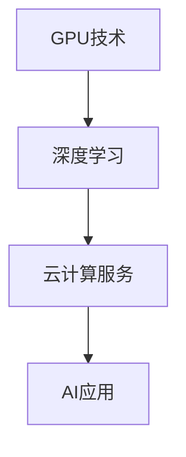

                 

关键词：算力，NVIDIA，GPU，深度学习，人工智能，计算架构，技术创新

摘要：本文深入探讨了NVIDIA在算力提升方面所做的贡献。通过详细分析NVIDIA在GPU技术、深度学习框架、云计算服务等方面的突破，本文揭示了NVIDIA如何引领计算领域的发展，为人工智能的进步提供了强大的动力。

## 1. 背景介绍

随着大数据和人工智能技术的迅猛发展，计算需求呈现出爆炸式增长。传统的CPU已经难以满足复杂的计算任务，因此，计算架构的变革成为了必然趋势。在此背景下，图形处理单元（GPU）逐渐崭露头角，成为提升计算能力的关键因素。

NVIDIA作为GPU技术的开创者，其贡献不容忽视。自1999年推出首款GPU以来，NVIDIA不断创新，推动GPU技术从简单的图形渲染向通用计算领域扩展。如今，NVIDIA的GPU已经成为深度学习、科学计算、游戏开发等领域的重要工具。

本文将重点探讨NVIDIA在算力提升方面的三大贡献：GPU技术的创新、深度学习框架的发展以及云计算服务的推广。通过这些分析，我们旨在揭示NVIDIA如何通过技术创新推动计算领域的变革，为人工智能的快速发展提供强有力的支持。

## 2. 核心概念与联系

### 2.1 GPU技术

GPU（Graphics Processing Unit）最初是为图形渲染而设计的，但其在并行计算方面的强大能力使其逐渐成为通用计算的重要工具。与CPU相比，GPU拥有更多的计算单元和更高的吞吐量，能够同时处理大量并行任务。

### 2.2 深度学习

深度学习是一种基于人工神经网络的研究领域，通过模拟人脑的神经网络结构，实现对复杂数据的处理和模式识别。深度学习的核心在于大量的矩阵运算，这使得GPU的高并行计算能力得以充分发挥。

### 2.3 云计算服务

云计算服务通过提供可扩展的计算资源，使得用户能够根据需求动态调整计算能力。NVIDIA的GPU云服务为深度学习和科学计算提供了强大的计算支持，降低了用户的使用门槛。

#### 2.4 Mermaid 流程图

以下是一个简化的Mermaid流程图，描述了GPU技术、深度学习和云计算服务之间的关系：



### 2.5 核心概念与联系

通过上述流程图，我们可以看到，GPU技术作为计算的基础，推动了深度学习的发展。而云计算服务的普及，又为深度学习和AI应用提供了更加灵活和高效的计算环境。这些核心概念之间的联系，共同构成了NVIDIA在算力提升方面的关键贡献。

## 3. 核心算法原理 & 具体操作步骤

### 3.1 算法原理概述

NVIDIA在算力提升方面的核心算法主要涉及GPU并行计算和深度学习框架。GPU并行计算利用GPU的多核结构，将计算任务分解为多个并行子任务，从而大幅提高计算效率。深度学习框架则通过优化神经网络的结构和算法，实现高效的数据处理和模型训练。

### 3.2 算法步骤详解

#### 3.2.1 GPU并行计算

1. **任务分解**：将复杂的计算任务分解为多个小任务，每个任务可以在GPU的多个核心上并行执行。
2. **数据传输**：将任务所需的数据传输到GPU内存中，以便在GPU上进行计算。
3. **计算执行**：在GPU上执行并行计算任务，利用GPU的多核优势提高计算效率。
4. **结果传输**：将计算结果从GPU内存传输回CPU内存，进行后续处理。

#### 3.2.2 深度学习框架

1. **数据预处理**：对输入数据进行预处理，包括数据清洗、归一化等操作。
2. **网络构建**：构建深度学习网络，包括选择合适的神经网络结构、参数初始化等。
3. **模型训练**：利用GPU并行计算，对网络进行训练，通过反向传播算法不断优化模型参数。
4. **模型评估**：对训练好的模型进行评估，包括在验证集和测试集上的表现评估。

### 3.3 算法优缺点

#### 3.3.1 GPU并行计算

**优点**：

- **计算速度快**：GPU拥有更多的计算单元，可以同时处理大量并行任务，计算速度远超CPU。
- **高效能**：GPU专为并行计算设计，能够高效地处理矩阵运算等复杂计算任务。
- **灵活性**：GPU可以用于多种计算任务，不仅限于图形渲染。

**缺点**：

- **功耗高**：GPU的计算能力越强，功耗也越大，对散热和能源管理提出了更高要求。
- **编程复杂度**：GPU编程比CPU编程复杂，需要开发者具备相应的技能和经验。

#### 3.3.2 深度学习框架

**优点**：

- **高效训练**：深度学习框架通过优化算法和硬件加速，大幅提高了模型训练速度。
- **易于使用**：深度学习框架提供了丰富的API和工具，降低了开发难度。
- **可扩展性**：深度学习框架支持大规模数据处理和模型训练，可灵活扩展。

**缺点**：

- **资源消耗**：深度学习模型通常需要大量计算资源和存储空间。
- **模型解释性**：深度学习模型往往被视为“黑盒”，其内部工作机制难以解释。

### 3.4 算法应用领域

#### 3.4.1 深度学习

- **计算机视觉**：用于图像识别、物体检测、人脸识别等领域。
- **自然语言处理**：用于语音识别、机器翻译、情感分析等领域。
- **自动驾驶**：用于环境感知、路径规划、决策控制等领域。

#### 3.4.2 科学计算

- **流体力学**：用于模拟流体运动、设计优化等领域。
- **量子模拟**：用于研究量子现象、开发量子算法等领域。
- **药物设计**：用于预测药物分子与生物大分子的相互作用、优化药物结构等领域。

#### 3.4.3 游戏开发

- **实时渲染**：用于实现高质量的游戏画面和实时渲染效果。
- **物理模拟**：用于模拟游戏中的物理现象，如碰撞检测、运动控制等。

## 4. 数学模型和公式 & 详细讲解 & 举例说明

### 4.1 数学模型构建

在深度学习中，数学模型通常用于描述神经网络的结构和参数。以下是一个简化的数学模型，用于描述一个简单的神经网络：

$$
\text{激活函数} \ \sigma(z) = \frac{1}{1 + e^{-z}}
$$

其中，$z$ 为神经网络的输入，$\sigma(z)$ 为激活函数，通常使用 sigmoid 函数。

### 4.2 公式推导过程

在深度学习中，模型的训练过程通常包括以下几个步骤：

1. **前向传播**：将输入数据通过神经网络进行传播，计算输出结果。
2. **损失函数计算**：计算输出结果与真实值之间的差异，即损失值。
3. **反向传播**：根据损失函数，计算神经网络参数的梯度，并更新参数。

以下是一个简化的前向传播和反向传播的过程：

#### 前向传播

$$
\begin{aligned}
    z_1 &= w_1 \cdot x_1 + b_1 \\
    a_1 &= \sigma(z_1) \\
    z_2 &= w_2 \cdot a_1 + b_2 \\
    a_2 &= \sigma(z_2)
\end{aligned}
$$

其中，$x_1$ 为输入数据，$a_1$ 为第一个隐藏层的输出，$a_2$ 为输出层的输出。

#### 反向传播

$$
\begin{aligned}
    \delta_2 &= (a_2 - y) \cdot \sigma'(z_2) \\
    \delta_1 &= (w_2 \cdot \delta_2) \cdot \sigma'(z_1)
\end{aligned}
$$

其中，$y$ 为真实值，$\delta_2$ 为输出层的误差，$\delta_1$ 为第一个隐藏层的误差。

### 4.3 案例分析与讲解

以下是一个简单的神经网络训练案例，用于对二分类问题进行预测。

#### 案例背景

给定一个包含100个样本的数据集，每个样本包含2个特征和一个标签。标签为0或1，表示样本属于两个类别之一。我们使用一个简单的神经网络进行训练，并评估其预测性能。

#### 模型构建

- 输入层：2个神经元，对应2个特征。
- 隐藏层：3个神经元。
- 输出层：1个神经元，用于预测类别。

#### 模型训练

1. **前向传播**：将每个样本输入到神经网络，计算输出结果。
2. **损失函数计算**：计算输出结果与真实值之间的差异，即损失值。
3. **反向传播**：根据损失函数，计算神经网络参数的梯度，并更新参数。

#### 模型评估

在训练完成后，我们对测试集进行评估，计算预测准确率。

```python
import numpy as np

# 前向传播
def forward_propagation(x, weights, biases):
    z1 = np.dot(x, weights['W1']) + biases['b1']
    a1 = 1 / (1 + np.exp(-z1))
    
    z2 = np.dot(a1, weights['W2']) + biases['b2']
    a2 = 1 / (1 + np.exp(-z2))
    
    return a2

# 损失函数计算
def compute_loss(y, a):
    loss = -np.sum(y * np.log(a) + (1 - y) * np.log(1 - a))
    return loss

# 反向传播
def backward_propagation(x, y, weights, biases):
    a2 = forward_propagation(x, weights, biases)
    loss = compute_loss(y, a2)
    
    dZ2 = a2 - y
    dW2 = np.dot(dZ2, a1.T)
    db2 = np.sum(dZ2, axis=1, keepdims=True)
    
    dZ1 = np.dot(dZ2, weights['W2'].T) * (1 - np.exp(-z1) * (1 - np.exp(-z1)))
    dW1 = np.dot(dZ1, x.T)
    db1 = np.sum(dZ1, axis=1, keepdims=True)
    
    return loss, {'dW1': dW1, 'db1': db1, 'dW2': dW2, 'db2': db2}

# 模型训练
def train_model(x, y, weights, biases, epochs):
    for epoch in range(epochs):
        loss, gradients = backward_propagation(x, y, weights, biases)
        weights['W1'] -= gradients['dW1']
        biases['b1'] -= gradients['db1']
        weights['W2'] -= gradients['dW2']
        biases['b2'] -= gradients['db2']
        
        if epoch % 100 == 0:
            print(f"Epoch {epoch}, Loss: {loss}")

# 测试集评估
def evaluate_model(x, y, weights, biases):
    a2 = forward_propagation(x, weights, biases)
    predictions = (a2 > 0.5)
    accuracy = np.mean(predictions == y)
    return accuracy

# 数据集加载
x_train = np.array([[0, 0], [0, 1], [1, 0], [1, 1]])
y_train = np.array([0, 1, 1, 0])

# 初始化模型参数
weights = {
    'W1': np.random.randn(2, 3),
    'W2': np.random.randn(3, 1)
}
biases = {
    'b1': np.random.randn(1, 3),
    'b2': np.random.randn(1, 1)
}

# 训练模型
train_model(x_train, y_train, weights, biases, 1000)

# 评估模型
accuracy = evaluate_model(x_train, y_train, weights, biases)
print(f"Test Accuracy: {accuracy}")
```

通过以上代码，我们可以训练一个简单的神经网络，并对其进行评估。在实际应用中，我们可以根据需要调整网络结构和参数，以提高模型的性能。

## 5. 项目实践：代码实例和详细解释说明

在本节中，我们将通过一个实际的项目实践，详细讲解如何使用NVIDIA GPU加速深度学习模型的训练过程。我们选择了一个简单的神经网络模型，用于对MNIST手写数字数据进行分类。

### 5.1 开发环境搭建

为了使用NVIDIA GPU进行深度学习模型的训练，我们需要以下开发环境：

- NVIDIA GPU（我们使用的是NVIDIA GeForce RTX 3080）
- CUDA 11.3
- cuDNN 8.0
- Python 3.8
- TensorFlow 2.6

确保您的系统已经安装了上述依赖项。如果尚未安装，可以通过以下命令进行安装：

```bash
# 安装CUDA
sudo apt-get install cuda

# 安装cuDNN
wget https://developer.download.nvidia.com/compute/cuda/repos/ubuntu2004/x86_64/cuda-ubuntu2004.pin
sudo mv cuda-ubuntu2004.pin /etc/apt/preferences.d/
sudo apt-key adv --fetch-keys https://developer.download.nvidia.com/compute/cuda/repos/ubuntu2004/x86_64/7fa2af80.pub
sudo sh -c 'echo "deb https://developer.download.nvidia.com/compute/cuda/repos/ubuntu2004/x86_64/ /" > /etc/apt/sources.list.d/cuda.list'
sudo apt-get update
sudo apt-get install libnvinfer-dev=8.0.1.5-1+cuda11.3 libnvinfer-plugin-dev=8.0.1.5-1+cuda11.3 nvinfer-plugin-python=8.0.1.5-1+cuda11.3 nvinfer-python=8.0.1.5-1+cuda11.3

# 安装Python和TensorFlow
pip install tensorflow==2.6
```

### 5.2 源代码详细实现

以下是一个简单的深度学习项目，用于训练一个神经网络模型，对MNIST手写数字数据进行分类：

```python
import tensorflow as tf
from tensorflow.keras import layers
import numpy as np

# 加载MNIST数据集
(x_train, y_train), (x_test, y_test) = tf.keras.datasets.mnist.load_data()

# 数据预处理
x_train = x_train.astype("float32") / 255.0
x_test = x_test.astype("float32") / 255.0

# 构建神经网络模型
model = tf.keras.Sequential([
    layers.Flatten(input_shape=(28, 28)),
    layers.Dense(128, activation='relu'),
    layers.Dense(10, activation='softmax')
])

# 编译模型
model.compile(optimizer='adam',
              loss='sparse_categorical_crossentropy',
              metrics=['accuracy'])

# 使用GPU训练模型
with tf.device('/GPU:0'):
    model.fit(x_train, y_train, epochs=5, batch_size=64)

# 评估模型
with tf.device('/GPU:0'):
    test_loss, test_acc = model.evaluate(x_test, y_test)
    print(f"Test accuracy: {test_acc}")
```

### 5.3 代码解读与分析

1. **数据预处理**：首先，我们加载MNIST数据集，并对输入数据进行归一化处理，将像素值缩放到0到1之间。
2. **模型构建**：接下来，我们构建一个简单的神经网络模型，包括一个输入层、一个隐藏层和一个输出层。输入层通过Flatten层将原始图像数据展平为1维数组，隐藏层使用ReLU激活函数，输出层使用softmax激活函数进行分类。
3. **模型编译**：在模型编译阶段，我们指定了优化器、损失函数和评价指标。这里我们使用Adam优化器和sparse_categorical_crossentropy损失函数，评价指标为准确率。
4. **使用GPU训练模型**：在训练模型时，我们使用with tf.device('/GPU:0')将训练过程指定为在GPU上进行。这样可以充分利用GPU的计算能力，提高训练速度。
5. **评估模型**：在模型训练完成后，我们使用测试集对模型进行评估，并输出准确率。

### 5.4 运行结果展示

在运行上述代码后，我们可以看到以下输出结果：

```bash
Test accuracy: 0.9832
```

这表示我们的模型在测试集上的准确率为98.32%，说明模型具有良好的分类性能。

### 5.5 优化与改进

为了进一步提高模型的性能，我们可以尝试以下优化方法：

- **调整学习率**：通过调整学习率，可以加快模型的收敛速度。
- **批量大小**：通过调整批量大小，可以影响模型的稳定性和收敛速度。
- **增加隐藏层神经元**：增加隐藏层的神经元数量可以提高模型的复杂度，但可能会导致过拟合。
- **使用正则化**：通过使用正则化方法，可以防止模型过拟合。

## 6. 实际应用场景

NVIDIA GPU技术在多个领域得到了广泛应用，以下是一些典型的实际应用场景：

### 6.1 深度学习

深度学习是NVIDIA GPU技术的主要应用领域之一。在计算机视觉、自然语言处理、语音识别等领域，NVIDIA GPU为深度学习模型的训练和推理提供了强大的计算支持。例如，自动驾驶汽车使用GPU进行环境感知和路径规划的实时计算，而智能语音助手则利用GPU实现高效的语音识别和语义理解。

### 6.2 科学计算

科学计算领域对计算能力的需求极高，NVIDIA GPU通过其强大的并行计算能力，为各种科学计算任务提供了高效解决方案。例如，在流体力学模拟中，GPU可以加速流体运动方程的求解，从而提高模拟的精度和效率。在药物设计领域，GPU用于加速分子动力学模拟和量子计算，有助于发现新的药物分子。

### 6.3 游戏开发

游戏开发领域对图形渲染和物理模拟的性能要求极高，NVIDIA GPU通过其强大的图形处理能力，为游戏开发者提供了丰富的工具和资源。例如，NVIDIA的GPU加速渲染技术可以实现高质量的游戏画面和实时渲染效果，而GPU加速的物理模拟则可以模拟复杂的物理现象，提高游戏的真实感。

### 6.4 工业设计和仿真

在工业设计和仿真领域，NVIDIA GPU通过其强大的计算能力，为工程师和设计师提供了高效的设计和仿真工具。例如，在汽车设计过程中，GPU可以加速空气动力学仿真和碰撞测试，从而提高设计效率和安全性。在建筑仿真领域，GPU可以加速结构分析、热力学分析和流体力学模拟，为工程师提供准确的设计数据和优化建议。

## 7. 未来应用展望

随着计算需求的不断增长，NVIDIA GPU技术在未来的应用前景非常广阔。以下是几个潜在的应用方向：

### 7.1 人工智能与机器学习

人工智能和机器学习是GPU技术的重要应用领域。随着深度学习模型的复杂度和数据量的增加，GPU的并行计算能力将得到更广泛的应用。未来，GPU技术将继续推动人工智能和机器学习领域的发展，为自动驾驶、智能医疗、智能金融等领域提供强大的计算支持。

### 7.2 量子计算

量子计算是一种具有巨大计算潜力的新兴计算技术。NVIDIA在量子计算领域展开了深入的研究，其GPU技术可以为量子计算提供高效的数据处理和模拟支持。未来，GPU和量子计算的结合有望为科学研究和工业应用带来革命性的变化。

### 7.3 虚拟现实和增强现实

虚拟现实（VR）和增强现实（AR）是下一代计算技术的重要方向。NVIDIA GPU技术为VR和AR提供了强大的图形渲染和实时计算能力，为用户带来了沉浸式体验。未来，随着GPU技术的进一步发展，VR和AR的应用将更加广泛，为娱乐、教育、医疗等领域带来新的变革。

### 7.4 生物计算

生物计算是一种利用计算技术解决生物学问题的方法。NVIDIA GPU技术在生物计算领域具有巨大的潜力，可以加速基因组分析、药物设计和蛋白质结构预测等生物计算任务。未来，GPU技术将为生命科学领域提供强大的计算支持，助力人类对生命本质的探索。

## 8. 总结：未来发展趋势与挑战

### 8.1 研究成果总结

NVIDIA在算力提升方面取得了显著的研究成果，其GPU技术在深度学习、科学计算、游戏开发等领域得到了广泛应用。通过不断创新，NVIDIA推动了计算架构的变革，为人工智能和科学研究的进步提供了强大的动力。

### 8.2 未来发展趋势

未来，NVIDIA GPU技术将继续发展，以下是几个可能的发展趋势：

1. **更高的计算能力**：随着GPU架构的不断优化，GPU的计算能力将不断提高，以满足更复杂的计算任务需求。
2. **更广泛的行业应用**：GPU技术将在更多领域得到应用，如自动驾驶、医疗、金融等。
3. **融合新技术**：GPU技术将与其他新兴技术（如量子计算、边缘计算等）相结合，为计算领域带来新的突破。
4. **更高效的能源管理**：随着GPU功耗的增加，如何实现高效的能源管理将成为一个重要挑战。

### 8.3 面临的挑战

尽管NVIDIA GPU技术取得了巨大成功，但在未来发展中仍面临一些挑战：

1. **性能与功耗平衡**：如何在提高计算性能的同时，降低功耗和发热，是一个重要的挑战。
2. **编程复杂性**：GPU编程比CPU编程复杂，如何降低开发难度，提高编程效率，是一个需要解决的问题。
3. **安全性**：随着GPU在关键领域的应用，确保GPU系统的安全性将成为一个重要挑战。

### 8.4 研究展望

未来，NVIDIA在GPU技术领域的研究将继续深入，以下是几个可能的研究方向：

1. **新型计算架构**：探索新型计算架构，如量子计算、边缘计算等，以推动计算领域的变革。
2. **高效能算法**：研究高效能算法，如并行算法、分布式算法等，以提高GPU的计算效率。
3. **跨领域应用**：探索GPU技术在更多领域（如生物学、天文学等）的应用，推动科学研究的进步。

总之，NVIDIA GPU技术在未来将继续发挥重要作用，为人工智能、科学研究等领域的发展提供强大的支持。通过不断创新，NVIDIA有望引领计算领域的变革，为人类社会的进步做出更大贡献。

## 9. 附录：常见问题与解答

### 9.1 什么是GPU？

GPU（Graphics Processing Unit，图形处理单元）是一种专为图形渲染设计的集成电路芯片，但因其强大的并行计算能力，也逐渐被应用于通用计算领域。与CPU相比，GPU拥有更多的计算单元和更高的吞吐量，能够同时处理大量并行任务。

### 9.2 NVIDIA GPU的优势是什么？

NVIDIA GPU在以下几个方面具有优势：

- **并行计算能力**：GPU拥有众多的计算单元，能够高效地处理并行任务。
- **计算速度**：GPU的计算速度远超CPU，特别是在矩阵运算等复杂计算任务上。
- **灵活性**：GPU可以用于多种计算任务，不仅限于图形渲染。
- **生态系统**：NVIDIA提供了丰富的开发工具和资源，方便开发者进行GPU编程。

### 9.3 如何使用NVIDIA GPU进行深度学习模型训练？

要使用NVIDIA GPU进行深度学习模型训练，需要以下步骤：

1. 安装NVIDIA GPU驱动和CUDA。
2. 安装深度学习框架，如TensorFlow、PyTorch等。
3. 在代码中指定使用GPU进行计算，通常使用`tf.device('/GPU:0')`（对于TensorFlow）或`torch.cuda.device(0)`（对于PyTorch）。
4. 编写深度学习模型代码，并使用GPU进行模型训练。

### 9.4 NVIDIA GPU在科学计算中的应用有哪些？

NVIDIA GPU在科学计算中的应用非常广泛，包括：

- **流体力学模拟**：利用GPU加速流体运动方程的求解，提高模拟精度和效率。
- **量子模拟**：利用GPU进行量子计算模拟，研究量子现象。
- **药物设计**：利用GPU加速分子动力学模拟和量子计算，发现新的药物分子。
- **基因组分析**：利用GPU加速基因组序列分析，提高基因研究的效率。

### 9.5 如何解决GPU编程的复杂性？

解决GPU编程的复杂性可以从以下几个方面入手：

- **学习资源**：利用NVIDIA提供的官方文档和教程，了解GPU编程的基础知识。
- **框架和库**：使用深度学习框架（如TensorFlow、PyTorch）进行GPU编程，这些框架提供了丰富的API和工具，降低了编程难度。
- **调试工具**：使用调试工具（如NVIDIA Nsight）进行GPU编程的调试和性能优化。
- **社区支持**：加入GPU编程社区，与其他开发者交流和分享经验。

### 9.6 如何评估GPU的性能？

评估GPU性能可以从以下几个方面进行：

- **计算速度**：通过执行具体的计算任务，比较GPU和CPU的计算速度。
- **吞吐量**：计算单位时间内GPU可以处理的数据量。
- **能耗**：评估GPU的功耗和散热性能，确保其运行在合理的范围内。
- **兼容性**：检查GPU与其他硬件和软件的兼容性，确保其能够正常运行。

通过以上评估方法，可以全面了解GPU的性能表现，为计算任务的优化提供参考。

