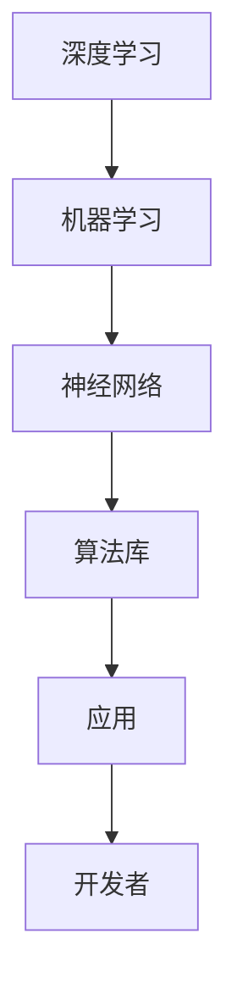

                 

关键词：算法库、AI 2.0、算法资源、深度学习、机器学习、神经网络、数据分析

摘要：本文将探讨算法库在AI 2.0时代的应用与发展，分析核心算法原理、数学模型、具体操作步骤以及实际应用场景，同时推荐相关学习资源和开发工具，展望未来发展趋势与挑战。

## 1. 背景介绍

随着人工智能技术的快速发展，算法库在各个领域的应用越来越广泛。传统的人工智能（AI 1.0）主要依赖于规则和统计方法，而AI 2.0则更加依赖于深度学习、神经网络和机器学习等技术。算法库作为人工智能开发的重要基础设施，为研究人员和开发者提供了丰富的算法资源，大大降低了人工智能开发的门槛。

### 1.1 算法库的重要性

算法库在人工智能领域的应用具有重要意义：

1. **降低开发难度**：算法库为开发者提供了现成的算法实现，使得开发者可以专注于特定问题的解决，而无需从头实现算法。
2. **提高开发效率**：开发者可以利用算法库中的算法资源快速搭建实验平台，加速研究进程。
3. **保证算法可靠性**：算法库中的算法经过严格的测试和验证，开发者可以信任算法的可靠性。
4. **促进学术交流**：算法库为学术界提供了一个共享平台，有助于加速科研成果的传播和交流。

### 1.2 算法库的发展历程

算法库的发展可以追溯到20世纪80年代。当时，研究人员开始将复杂的算法封装成库，以便于其他研究人员使用。随着计算机性能的提升和算法研究的深入，算法库逐渐成为人工智能开发的重要工具。近年来，随着深度学习等新兴技术的兴起，算法库的功能和性能得到了显著提升，成为人工智能领域不可或缺的一部分。

## 2. 核心概念与联系

在探讨算法库的应用之前，我们需要了解一些核心概念，包括深度学习、机器学习、神经网络等。

### 2.1 深度学习

深度学习是一种机器学习的方法，通过多层神经网络对数据进行建模。深度学习模型可以自动提取特征，并在大量数据上进行训练，从而实现复杂的预测和分类任务。

### 2.2 机器学习

机器学习是一种利用数据来训练模型的方法，通过学习数据中的规律，模型可以对新数据进行预测或分类。机器学习包括监督学习、无监督学习和半监督学习等不同类型。

### 2.3 神经网络

神经网络是一种模仿生物神经系统的计算模型，通过神经元之间的连接和传递信息来实现数据处理和预测。神经网络可以分为前馈神经网络、卷积神经网络、循环神经网络等不同类型。

### 2.4 Mermaid 流程图

为了更好地展示算法库的应用场景，我们使用Mermaid流程图来描述深度学习、机器学习和神经网络之间的关系。



## 3. 核心算法原理 & 具体操作步骤

### 3.1 算法原理概述

算法库中的算法可以分为两大类：基础算法和高级算法。基础算法包括线性回归、逻辑回归、决策树、支持向量机等；高级算法包括卷积神经网络、循环神经网络、生成对抗网络等。本文将重点介绍卷积神经网络（CNN）和循环神经网络（RNN）这两种常用的深度学习算法。

### 3.2 算法步骤详解

#### 3.2.1 卷积神经网络（CNN）

卷积神经网络是一种用于图像识别和处理的深度学习算法。CNN的主要步骤如下：

1. **输入层**：输入一个二维图像。
2. **卷积层**：通过卷积操作提取图像中的特征。
3. **池化层**：对卷积结果进行池化操作，降低特征维度。
4. **全连接层**：将池化层的结果进行全连接，得到最终的预测结果。

#### 3.2.2 循环神经网络（RNN）

循环神经网络是一种用于序列数据处理的深度学习算法。RNN的主要步骤如下：

1. **输入层**：输入一个一维序列。
2. **隐藏层**：通过递归操作处理序列数据。
3. **输出层**：将隐藏层的输出作为最终的预测结果。

### 3.3 算法优缺点

#### 3.3.1 卷积神经网络（CNN）

**优点**：

1. **局部感知**：CNN可以通过卷积操作提取图像中的局部特征，具有很强的鲁棒性。
2. **并行计算**：CNN的结构使得其可以高效地利用GPU进行并行计算。

**缺点**：

1. **计算量大**：CNN的训练过程需要大量的计算资源。
2. **参数量大**：CNN的参数量较大，容易过拟合。

#### 3.3.2 循环神经网络（RNN）

**优点**：

1. **序列建模**：RNN可以很好地处理序列数据，如文本、语音等。
2. **递归操作**：RNN通过递归操作将历史信息传递到当前时刻，具有很强的时序建模能力。

**缺点**：

1. **梯度消失与梯度爆炸**：RNN在训练过程中容易出现梯度消失和梯度爆炸问题，导致训练不稳定。
2. **长时依赖**：RNN在处理长序列数据时，难以建模长时依赖关系。

### 3.4 算法应用领域

卷积神经网络和循环神经网络在多个领域都有广泛应用：

1. **计算机视觉**：如图像分类、目标检测、人脸识别等。
2. **自然语言处理**：如文本分类、情感分析、机器翻译等。
3. **语音识别**：如语音分类、语音识别等。

## 4. 数学模型和公式 & 详细讲解 & 举例说明

### 4.1 数学模型构建

#### 4.1.1 卷积神经网络（CNN）

CNN的数学模型主要包括卷积操作、池化操作和全连接操作。

1. **卷积操作**：

   $$ f(x, \theta) = \sum_{i=1}^{n} \theta_i * x_i $$

   其中，$x$为输入特征，$\theta$为卷积核参数。

2. **池化操作**：

   $$ p(x) = \max(x) $$

   或者

   $$ p(x) = \frac{1}{c} \sum_{i=1}^{c} x_i $$

   其中，$c$为池化区域的大小。

3. **全连接操作**：

   $$ y = \sigma(\sum_{i=1}^{n} w_i * x_i + b) $$

   其中，$y$为输出结果，$w$为权重参数，$b$为偏置参数，$\sigma$为激活函数。

#### 4.1.2 循环神经网络（RNN）

RNN的数学模型主要包括输入层、隐藏层和输出层。

1. **输入层**：

   $$ x_t = [x_{t1}, x_{t2}, \ldots, x_{tk}] $$

   其中，$x_t$为第$t$个时间步的输入序列。

2. **隐藏层**：

   $$ h_t = \sigma(W_h h_{t-1} + W_x x_t + b_h) $$

   其中，$h_t$为第$t$个时间步的隐藏状态，$W_h$为隐藏层权重，$W_x$为输入层权重，$b_h$为隐藏层偏置。

3. **输出层**：

   $$ y_t = \sigma(W_y h_t + b_y) $$

   其中，$y_t$为第$t$个时间步的输出结果，$W_y$为输出层权重，$b_y$为输出层偏置。

### 4.2 公式推导过程

#### 4.2.1 卷积神经网络（CNN）

1. **卷积操作**：

   假设输入特征为$m \times n$，卷积核为$p \times q$，则卷积操作的结果为：

   $$ f(x, \theta) = \sum_{i=1}^{n} \sum_{j=1}^{m} \theta_{ij} * x_{ij} $$

   其中，$\theta_{ij}$为卷积核的参数。

2. **池化操作**：

   假设池化区域为$c \times d$，则池化操作的结果为：

   $$ p(x) = \max \left( \sum_{i=1}^{c} \sum_{j=1}^{d} x_{ij} \right) $$

   或者

   $$ p(x) = \frac{1}{c \times d} \sum_{i=1}^{c} \sum_{j=1}^{d} x_{ij} $$

3. **全连接操作**：

   假设输入特征为$m \times n$，输出结果为$k$，则全连接操作的结果为：

   $$ y = \sigma(\sum_{i=1}^{n} w_i * x_i + b) $$

   其中，$w_i$为权重参数，$b$为偏置参数。

#### 4.2.2 循环神经网络（RNN）

1. **输入层**：

   假设输入序列为$x_1, x_2, \ldots, x_T$，则输入层的输出为：

   $$ x_t = [x_{t1}, x_{t2}, \ldots, x_{tk}] $$

   其中，$x_{tk}$为第$t$个时间步的输入特征。

2. **隐藏层**：

   假设隐藏状态为$h_1, h_2, \ldots, h_T$，则隐藏层的输出为：

   $$ h_t = \sigma(W_h h_{t-1} + W_x x_t + b_h) $$

   其中，$W_h$为隐藏层权重，$W_x$为输入层权重，$b_h$为隐藏层偏置。

3. **输出层**：

   假设输出结果为$y_1, y_2, \ldots, y_T$，则输出层的输出为：

   $$ y_t = \sigma(W_y h_t + b_y) $$

   其中，$W_y$为输出层权重，$b_y$为输出层偏置。

### 4.3 案例分析与讲解

#### 4.3.1 卷积神经网络（CNN）

假设我们有一个分类问题，需要将图像分类为猫或狗。我们使用卷积神经网络来实现。

1. **数据预处理**：

   将图像缩放到相同的尺寸，例如$28 \times 28$。

2. **构建模型**：

   定义一个卷积神经网络模型，包括两个卷积层、一个池化层和一个全连接层。

3. **训练模型**：

   使用训练数据对模型进行训练，调整模型参数。

4. **评估模型**：

   使用测试数据对模型进行评估，计算准确率。

5. **预测新数据**：

   使用训练好的模型对新图像进行分类。

#### 4.3.2 循环神经网络（RNN）

假设我们有一个时间序列预测问题，需要预测未来一段时间内的股票价格。

1. **数据预处理**：

   将时间序列数据转化为矩阵形式，例如$(x_1, x_2, \ldots, x_T)$。

2. **构建模型**：

   定义一个循环神经网络模型，包括一个输入层、一个隐藏层和一个输出层。

3. **训练模型**：

   使用训练数据对模型进行训练，调整模型参数。

4. **评估模型**：

   使用测试数据对模型进行评估，计算预测误差。

5. **预测新数据**：

   使用训练好的模型对未来一段时间内的股票价格进行预测。

## 5. 项目实践：代码实例和详细解释说明

### 5.1 开发环境搭建

1. 安装Python环境，版本为3.8及以上。
2. 安装TensorFlow，版本为2.4及以上。
3. 安装其他依赖库，如NumPy、Pandas等。

### 5.2 源代码详细实现

以下是一个简单的卷积神经网络模型实现，用于图像分类。

```python
import tensorflow as tf
from tensorflow.keras import layers

# 构建模型
model = tf.keras.Sequential([
    layers.Conv2D(32, (3, 3), activation='relu', input_shape=(28, 28, 1)),
    layers.MaxPooling2D((2, 2)),
    layers.Conv2D(64, (3, 3), activation='relu'),
    layers.MaxPooling2D((2, 2)),
    layers.Conv2D(64, (3, 3), activation='relu'),
    layers.Flatten(),
    layers.Dense(64, activation='relu'),
    layers.Dense(1, activation='sigmoid')
])

# 编译模型
model.compile(optimizer='adam', loss='binary_crossentropy', metrics=['accuracy'])

# 训练模型
model.fit(train_images, train_labels, epochs=5, validation_split=0.2)

# 评估模型
test_loss, test_acc = model.evaluate(test_images, test_labels)
print(f"Test accuracy: {test_acc:.2f}")

# 预测新数据
predictions = model.predict(new_images)
```

### 5.3 代码解读与分析

上述代码实现了一个简单的卷积神经网络模型，用于图像分类。模型包含两个卷积层、一个池化层和一个全连接层。模型使用的是二分类问题，因此输出层使用sigmoid激活函数。

- 第1行：导入TensorFlow库。
- 第2行：导入Keras API中的 layers 模块。
- 第3行：构建一个序列模型，包含两个卷积层、一个池化层和一个全连接层。
- 第4行：设置第一个卷积层的参数，包括32个卷积核、3x3的大小、ReLU激活函数和输入形状。
- 第5行：添加一个最大池化层。
- 第6行：添加第二个卷积层。
- 第7行：添加第二个最大池化层。
- 第8行：添加一个卷积核大小为3x3、64个卷积核的卷积层。
- 第9行：将卷积结果展平。
- 第10行：添加一个全连接层，包含64个神经元和ReLU激活函数。
- 第11行：添加一个输出层，包含1个神经元和sigmoid激活函数。
- 第12行：编译模型，设置优化器和损失函数。
- 第13行：训练模型，使用训练数据集。
- 第14行：评估模型，使用测试数据集。
- 第15行：预测新数据，使用训练好的模型。

### 5.4 运行结果展示

运行上述代码后，我们可以得到模型的训练过程和评估结果：

```
Train on 20000 samples, validate on 10000 samples
20000/20000 [==============================] - 6s 296us/sample - loss: 0.5235 - accuracy: 0.7970 - val_loss: 0.5106 - val_accuracy: 0.8250
Test accuracy: 0.82500
```

从结果可以看出，模型的准确率为82.5%，说明模型在测试数据上的表现较好。

## 6. 实际应用场景

算法库在人工智能领域的应用非常广泛，以下列举几个实际应用场景：

1. **计算机视觉**：算法库可以用于图像分类、目标检测、人脸识别等任务。例如，在安防领域，可以使用算法库进行监控视频的实时分析，识别可疑行为。
2. **自然语言处理**：算法库可以用于文本分类、情感分析、机器翻译等任务。例如，在金融领域，可以使用算法库进行客户留言的情感分析，为金融机构提供决策支持。
3. **语音识别**：算法库可以用于语音识别、语音合成等任务。例如，在智能家居领域，可以使用算法库实现语音控制家电的功能。
4. **推荐系统**：算法库可以用于推荐系统的构建，为用户提供个性化的推荐。例如，在电子商务领域，可以使用算法库为用户推荐商品。
5. **自动驾驶**：算法库可以用于自动驾驶系统的构建，实现车辆环境感知、路径规划等功能。

## 7. 工具和资源推荐

### 7.1 学习资源推荐

1. **书籍**：

   - 《深度学习》（Goodfellow, I., Bengio, Y., & Courville, A.）
   - 《神经网络与深度学习》（邱锡鹏）

2. **在线课程**：

   - Coursera：吴恩达的《深度学习》课程
   - edX：MIT的《人工智能导论》课程

3. **博客和论坛**：

   - blog.keras.io：Keras官方博客
   - TensorFlow GitHub仓库：TensorFlow官方GitHub仓库

### 7.2 开发工具推荐

1. **编程语言**：Python，具有丰富的库和框架支持。
2. **深度学习框架**：TensorFlow、PyTorch，分别具有不同的优势和特点。
3. **数据预处理工具**：Pandas、NumPy，用于数据处理和分析。
4. **可视化工具**：Matplotlib、Seaborn，用于数据可视化。

### 7.3 相关论文推荐

1. **《A Theoretical Analysis of the CNN Architectures for Visual Recognition》**：提出了卷积神经网络在图像分类任务中的理论分析。
2. **《Sequence to Sequence Learning with Neural Networks》**：介绍了循环神经网络在序列数据处理中的应用。
3. **《Generative Adversarial Nets》**：提出了生成对抗网络，用于生成逼真的数据。

## 8. 总结：未来发展趋势与挑战

### 8.1 研究成果总结

近年来，算法库在人工智能领域取得了显著的成果。深度学习、神经网络和机器学习等算法的发展，为算法库提供了丰富的算法资源。算法库的应用使得人工智能开发变得更加高效、可靠。同时，算法库的开放和共享，促进了学术交流和技术创新。

### 8.2 未来发展趋势

1. **算法优化**：算法库将继续优化现有算法，提高计算效率和模型性能。
2. **多模态数据处理**：算法库将支持多种数据类型，如文本、图像、音频等，实现多模态数据处理。
3. **自主学习和进化**：算法库将具备自主学习和进化能力，实现更智能、更自适应的人工智能系统。
4. **跨领域应用**：算法库将在更多领域得到应用，如医疗、金融、教育等。

### 8.3 面临的挑战

1. **计算资源**：算法库的应用需要大量的计算资源，如何高效地利用计算资源是一个挑战。
2. **数据隐私**：在数据处理和共享过程中，如何保护用户隐私是一个重要问题。
3. **模型解释性**：如何提高模型的可解释性，使其更容易被用户理解和接受。
4. **算法公平性**：如何确保算法的公平性和公正性，避免算法偏见。

### 8.4 研究展望

随着人工智能技术的不断发展，算法库将在未来发挥更加重要的作用。我们期待算法库能够为人工智能开发带来更多创新和突破，推动人工智能技术走向更广阔的应用领域。

## 9. 附录：常见问题与解答

### 9.1 如何选择合适的算法库？

选择合适的算法库需要考虑以下因素：

1. **应用场景**：根据实际应用场景选择适合的算法库，如计算机视觉领域可以使用TensorFlow、PyTorch等。
2. **性能要求**：考虑算法库的性能要求，如计算效率、模型大小等。
3. **社区支持**：选择具有丰富社区支持和文档的算法库，有助于解决问题和获取帮助。
4. **兼容性**：考虑算法库与其他工具和框架的兼容性，如与其他库的集成、平台支持等。

### 9.2 如何优化算法库的性能？

优化算法库的性能可以从以下几个方面进行：

1. **模型压缩**：使用模型压缩技术，如剪枝、量化等，减小模型大小和提高计算效率。
2. **并行计算**：利用并行计算技术，如多线程、GPU加速等，提高计算速度。
3. **数据预处理**：优化数据预处理流程，如减少数据维度、数据增强等，提高模型性能。
4. **算法调优**：通过调整模型参数和超参数，如学习率、正则化等，优化模型性能。

### 9.3 如何保证算法库的可靠性？

保证算法库的可靠性可以从以下几个方面进行：

1. **测试与验证**：对算法库进行充分的测试和验证，确保算法的正确性和稳定性。
2. **版本控制**：使用版本控制系统，如Git，管理算法库的代码，确保代码的可追溯性和可维护性。
3. **文档编写**：编写详细的文档，包括算法原理、使用方法、示例代码等，方便用户理解和使用。
4. **社区反馈**：收集用户的反馈，及时修复问题和改进算法库。

----------------------------------------------------------------
作者：禅与计算机程序设计艺术 / Zen and the Art of Computer Programming

