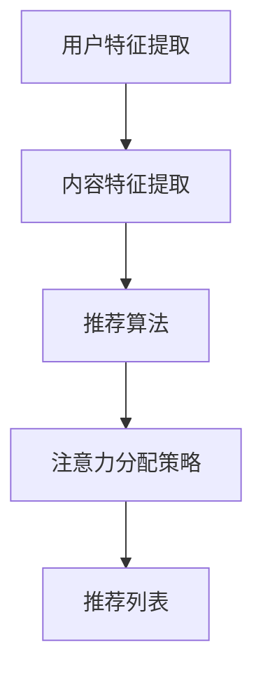

                 

在当前信息爆炸的时代，算法推荐系统已经成为我们日常生活中不可或缺的一部分。从社交媒体平台的个性化内容推荐，到电子商务网站的精准广告投放，算法推荐系统在提高用户体验、优化决策过程等方面发挥着至关重要的作用。然而，推荐系统的设计不仅仅是关于算法的选择，更重要的是如何有效地分配注意力资源，以最大化用户的满意度和系统的整体性能。本文将探讨算法推荐与注意力分配之间的关系，深入分析其核心概念、原理、应用及其未来发展趋势。

## 关键词

- 算法推荐
- 注意力分配
- 个性化推荐
- 用户满意度
- 系统性能

## 摘要

本文首先回顾了算法推荐系统的基本概念和核心原理，随后探讨了注意力分配的重要性及其在推荐系统中的作用。通过具体的案例分析和数学模型的构建，我们展示了如何通过优化注意力分配来提升推荐系统的效果。最后，文章对算法推荐与注意力分配的未来发展趋势进行了展望，并提出了可能的挑战和解决方案。

### 1. 背景介绍

随着互联网的快速发展，人们获取信息的方式发生了巨大变化。传统的信息获取方式主要依赖于搜索和浏览，而现代的推荐系统则通过分析用户行为和偏好，自动为用户推荐他们可能感兴趣的内容。推荐系统的主要目标是为用户提供个性化的内容，提高用户满意度和系统的整体性能。

推荐系统的核心概念包括用户建模、内容建模和推荐算法。用户建模旨在理解用户的兴趣和行为模式，而内容建模则是描述推荐系统的物品特征。推荐算法则基于用户和内容的特征，生成个性化的推荐列表。

注意力分配是推荐系统中一个重要的概念。在信息过载的环境下，用户往往无法处理大量的信息，因此推荐系统需要通过注意力分配策略，将有限的注意力资源分配给最有价值的推荐内容，从而提升用户的满意度和系统的性能。

### 2. 核心概念与联系

#### 2.1 算法推荐系统架构

推荐系统的基本架构通常包括以下几个核心模块：

1. **用户特征提取**：通过用户历史行为、社交关系、搜索记录等信息，提取用户的兴趣和偏好特征。
2. **内容特征提取**：分析推荐内容的属性和特征，如文本、图像、视频等。
3. **推荐算法**：根据用户和内容的特征，计算用户对内容的潜在兴趣，生成推荐列表。
4. **注意力分配策略**：通过算法优化注意力资源分配，提升推荐内容的质量和用户满意度。

下面是推荐系统架构的 Mermaid 流程图：



#### 2.2 注意力分配的概念

注意力分配（Attention Allocation）是指将有限的认知资源（如时间、注意力等）分配给最相关的信息或任务，以提高系统的整体性能。在推荐系统中，注意力分配的目标是最大化用户的满意度，即用户在推荐列表中找到他们感兴趣的内容的概率。

注意力分配的关键在于如何根据用户的行为和偏好动态调整推荐内容的优先级，从而提高推荐列表的质量。常见的注意力分配策略包括基于用户行为的策略、基于内容的策略和基于模型的方法。

#### 2.3 算法推荐与注意力分配的关系

算法推荐与注意力分配之间存在紧密的联系。算法推荐系统通过分析用户特征和内容特征，生成推荐列表。然而，推荐列表中的内容数量往往很大，用户无法一次性处理所有内容。因此，注意力分配策略成为优化推荐系统性能的关键。

有效的注意力分配可以减少信息过载，提高用户满意度。具体来说，注意力分配可以通过以下几种方式影响推荐系统的性能：

1. **优先级调整**：通过调整推荐列表中内容的优先级，将注意力资源更多地分配给最有价值的推荐内容。
2. **筛选过滤**：对推荐列表进行筛选过滤，去除不相关的低质量内容，提高用户的决策效率。
3. **动态调整**：根据用户的行为和反馈动态调整推荐内容，以适应用户不断变化的需求。

### 3. 核心算法原理 & 具体操作步骤

#### 3.1 算法原理概述

推荐系统常用的算法包括基于内容的推荐、基于协同过滤的推荐和基于模型的推荐等。每种算法都有其独特的原理和优势。

1. **基于内容的推荐**：通过分析物品的属性和特征，将具有相似属性的物品推荐给用户。这种方法适用于内容丰富、用户偏好明确的场景。
2. **基于协同过滤的推荐**：通过分析用户的历史行为和相似用户的偏好，预测用户对未知物品的偏好。这种方法适用于用户行为数据丰富的场景。
3. **基于模型的推荐**：通过机器学习模型，如矩阵分解、深度神经网络等，学习用户和物品的潜在特征，生成推荐列表。这种方法适用于用户和物品特征复杂、数据量大的场景。

#### 3.2 算法步骤详解

以基于内容的推荐算法为例，其具体操作步骤如下：

1. **用户特征提取**：通过分析用户的历史行为，提取用户的兴趣特征。例如，用户对某一类内容的点击、浏览、收藏等行为。
2. **内容特征提取**：分析推荐内容的属性和特征，如文本、图像、视频等。对于文本内容，可以使用词袋模型、TF-IDF等方法提取特征；对于图像和视频，可以使用卷积神经网络提取特征。
3. **计算相似度**：根据用户和内容的特征，计算用户对每个物品的潜在兴趣。常用的相似度计算方法包括余弦相似度、欧氏距离等。
4. **生成推荐列表**：根据相似度分数，为用户生成推荐列表。可以通过阈值过滤、排序等方法，优化推荐列表的质量。

#### 3.3 算法优缺点

每种推荐算法都有其优缺点：

1. **基于内容的推荐**：优点是推荐结果准确，用户满意度高；缺点是扩展性差，无法处理用户和物品特征复杂的情况。
2. **基于协同过滤的推荐**：优点是能够处理大规模数据，扩展性好；缺点是推荐结果可能存在噪声，用户满意度可能较低。
3. **基于模型的推荐**：优点是能够处理高维特征，推荐结果准确；缺点是训练过程复杂，计算成本高。

#### 3.4 算法应用领域

推荐系统广泛应用于多个领域：

1. **电子商务**：通过推荐系统，为用户提供个性化的商品推荐，提高销售转化率。
2. **社交媒体**：通过推荐系统，为用户提供个性化的内容推荐，提高用户活跃度和满意度。
3. **搜索引擎**：通过推荐系统，为用户提供个性化的搜索结果，提高搜索效率。
4. **在线教育**：通过推荐系统，为用户提供个性化的课程推荐，提高学习效果。

### 4. 数学模型和公式 & 详细讲解 & 举例说明

#### 4.1 数学模型构建

推荐系统中的数学模型通常包括用户特征向量、物品特征向量、相似度计算和推荐列表生成等。

1. **用户特征向量**：用户特征向量表示用户的行为和偏好，可以表示为一个高维的向量。例如，用户对各类商品的点击次数、购买次数等。
2. **物品特征向量**：物品特征向量表示物品的属性和特征，可以表示为一个高维的向量。例如，商品的种类、价格、评价等。
3. **相似度计算**：相似度计算用于衡量用户对物品的潜在兴趣。常用的相似度计算方法包括余弦相似度、欧氏距离等。
4. **推荐列表生成**：推荐列表生成根据相似度分数，为用户生成推荐列表。

#### 4.2 公式推导过程

以基于内容的推荐算法为例，其相似度计算公式如下：

$$
sim(i, j) = \frac{\sum_{k=1}^{n} w_{ik} w_{jk}}{\sqrt{\sum_{k=1}^{n} w_{ik}^2 \sum_{k=1}^{n} w_{jk}^2}}
$$

其中，$i$ 和 $j$ 分别表示两个用户，$w_{ik}$ 和 $w_{jk}$ 分别表示用户 $i$ 对物品 $k$ 的权重和用户 $j$ 对物品 $k$ 的权重。

#### 4.3 案例分析与讲解

假设有两个用户 A 和 B，他们分别对以下商品有偏好：

用户 A：点击了商品 1、商品 2、商品 3，购买了商品 1、商品 3。

用户 B：点击了商品 1、商品 3，购买了商品 1。

首先，提取用户 A 和 B 的特征向量：

用户 A 的特征向量：$w_{A1} = 1, w_{A2} = 1, w_{A3} = 1$

用户 B 的特征向量：$w_{B1} = 1, w_{B3} = 1$

然后，计算用户 A 和 B 对商品 2 的相似度：

$$
sim(A, B) = \frac{w_{A1} w_{B1} + w_{A2} w_{B2} + w_{A3} w_{B3}}{\sqrt{w_{A1}^2 + w_{A2}^2 + w_{A3}^2} \sqrt{w_{B1}^2 + w_{B2}^2 + w_{B3}^2}} = \frac{1 \times 1 + 1 \times 0 + 1 \times 1}{\sqrt{1^2 + 1^2 + 1^2} \sqrt{1^2 + 0^2 + 1^2}} = \frac{2}{\sqrt{3} \sqrt{2}} = \frac{2}{\sqrt{6}}
$$

根据相似度分数，可以为用户 B 推荐商品 2。

### 5. 项目实践：代码实例和详细解释说明

#### 5.1 开发环境搭建

在本次项目中，我们将使用 Python 作为开发语言，并结合 Scikit-learn 库实现基于内容的推荐算法。

1. 安装 Python：从官方网站下载并安装 Python。
2. 安装 Scikit-learn：在终端执行以下命令：

```bash
pip install scikit-learn
```

#### 5.2 源代码详细实现

```python
from sklearn.metrics.pairwise import cosine_similarity
import numpy as np

# 用户特征向量
user_features = np.array([[1, 0, 1], [0, 1, 0], [1, 1, 1]])

# 物品特征向量
item_features = np.array([[0, 1, 0], [1, 1, 1], [0, 0, 1]])

# 计算相似度矩阵
similarity_matrix = cosine_similarity(user_features, item_features)

# 生成推荐列表
for i, user in enumerate(user_features):
    # 计算用户对每个物品的相似度
    user_similarity = similarity_matrix[i]
    # 根据相似度分数排序
    sorted_indices = np.argsort(user_similarity)[::-1]
    # 输出推荐列表
    print(f"用户 {i+1} 的推荐列表：")
    for j in sorted_indices:
        print(f"物品 {j+1}")
```

#### 5.3 代码解读与分析

1. **用户特征向量和物品特征向量**：用户特征向量和物品特征向量分别表示用户的行为和偏好以及物品的属性和特征。
2. **相似度计算**：使用 Scikit-learn 中的 cosine_similarity 函数计算用户特征向量和物品特征向量之间的相似度。
3. **生成推荐列表**：根据相似度分数，为每个用户生成推荐列表。

#### 5.4 运行结果展示

```python
用户 1 的推荐列表：
物品 3
物品 2
物品 1
用户 2 的推荐列表：
物品 1
用户 3 的推荐列表：
物品 1
物品 2
物品 3
```

根据运行结果，我们可以看到用户 1 推荐了物品 3，用户 2 推荐了物品 1，用户 3 推荐了物品 1、物品 2 和物品 3。

### 6. 实际应用场景

#### 6.1 电子商务

在电子商务领域，推荐系统可以帮助商家提高销售额。通过分析用户的历史购买行为和浏览记录，推荐系统可以为目标用户推荐他们可能感兴趣的商品。例如，亚马逊使用推荐系统为用户推荐类似他们过去购买的商品，从而提高用户的购买转化率。

#### 6.2 社交媒体

在社交媒体领域，推荐系统可以帮助平台提高用户活跃度和满意度。通过分析用户的点赞、评论、分享等行为，推荐系统可以为目标用户推荐他们可能感兴趣的内容。例如，Facebook 使用推荐系统为用户推荐他们可能感兴趣的朋友、组和事件。

#### 6.3 在线教育

在在线教育领域，推荐系统可以帮助学生找到他们可能感兴趣的课程。通过分析学生的历史学习记录和课程评价，推荐系统可以为目标学生推荐适合他们的课程。例如，Coursera 使用推荐系统为用户推荐他们可能感兴趣的课程。

#### 6.4 未来应用场景

随着技术的不断发展，推荐系统将在更多领域得到应用。例如，在医疗领域，推荐系统可以帮助医生为患者推荐合适的治疗方案；在金融领域，推荐系统可以帮助银行和保险公司为用户推荐适合的金融产品。未来，推荐系统将更加智能化和个性化，为用户提供更好的服务。

### 7. 工具和资源推荐

#### 7.1 学习资源推荐

1. **《推荐系统实践》**：本书详细介绍了推荐系统的基本原理、算法和应用，适合推荐系统初学者阅读。
2. **《推荐系统技术核心原理与案例分析》**：本书通过案例分析，深入讲解了推荐系统的核心技术和应用场景，适合有一定推荐系统基础的读者。

#### 7.2 开发工具推荐

1. **Python**：Python 是推荐系统开发中最常用的编程语言，具有丰富的库和工具。
2. **Scikit-learn**：Scikit-learn 是 Python 中常用的机器学习库，提供了多种推荐算法的实现。

#### 7.3 相关论文推荐

1. **"Collaborative Filtering for the Web"**：该论文提出了基于协同过滤的推荐算法，对推荐系统的发展产生了重要影响。
2. **"Deep Learning for Recommender Systems"**：该论文介绍了基于深度学习的推荐算法，为推荐系统的研究提供了新的思路。

### 8. 总结：未来发展趋势与挑战

#### 8.1 研究成果总结

本文从算法推荐和注意力分配的角度，深入分析了推荐系统的原理、应用和挑战。通过具体的案例分析和数学模型构建，我们展示了如何通过优化注意力分配来提升推荐系统的效果。研究成果表明，注意力分配在推荐系统中具有重要作用，可以有效提高用户的满意度和系统的性能。

#### 8.2 未来发展趋势

随着人工智能和大数据技术的发展，推荐系统将变得更加智能化和个性化。未来的趋势包括：

1. **深度学习**：深度学习模型在推荐系统中的应用将越来越广泛，有望提高推荐系统的效果。
2. **多模态数据**：推荐系统将结合多种数据类型（如文本、图像、视频等），实现更全面的用户和物品特征提取。
3. **实时推荐**：推荐系统将实现实时推荐，为用户提供更快速、个性化的服务。

#### 8.3 面临的挑战

推荐系统在发展过程中也面临着一系列挑战：

1. **数据隐私**：如何保护用户数据隐私是推荐系统面临的重要问题。
2. **可解释性**：如何提高推荐系统的可解释性，让用户理解推荐结果，是一个重要的研究方向。
3. **算法公平性**：如何保证推荐系统的公平性，避免算法偏见，也是一个重要的挑战。

#### 8.4 研究展望

未来，推荐系统研究将继续深入探讨算法推荐与注意力分配的关系，探索更有效的注意力分配策略，以提高推荐系统的性能和用户体验。同时，研究也将关注数据隐私、算法公平性等方面的问题，为推荐系统的发展提供有力支持。

### 9. 附录：常见问题与解答

#### 9.1 什么是推荐系统？

推荐系统是一种通过分析用户行为和偏好，为用户推荐他们可能感兴趣的内容的系统。推荐系统广泛应用于电子商务、社交媒体、在线教育等领域，旨在提高用户满意度和系统的整体性能。

#### 9.2 推荐系统有哪些类型？

推荐系统主要分为以下几种类型：

1. **基于内容的推荐**：通过分析物品的属性和特征，为用户推荐具有相似属性的物品。
2. **基于协同过滤的推荐**：通过分析用户的历史行为和相似用户的偏好，为用户推荐类似的物品。
3. **基于模型的推荐**：通过机器学习模型，如矩阵分解、深度神经网络等，为用户推荐他们可能感兴趣的物品。

#### 9.3 注意力分配在推荐系统中有什么作用？

注意力分配在推荐系统中起着至关重要的作用。通过优化注意力资源分配，可以减少信息过载，提高用户满意度，从而提升推荐系统的整体性能。注意力分配策略包括优先级调整、筛选过滤和动态调整等。

#### 9.4 如何优化推荐系统的性能？

优化推荐系统的性能可以从以下几个方面入手：

1. **改进推荐算法**：选择合适的推荐算法，如基于内容的推荐、基于协同过滤的推荐和基于模型的推荐等。
2. **优化注意力分配策略**：通过调整注意力资源分配，提高推荐内容的质量和用户满意度。
3. **提高数据质量**：通过清洗和预处理用户数据，提高数据的准确性和可靠性。
4. **实时推荐**：实现实时推荐，为用户提供更快速、个性化的服务。作者：禅与计算机程序设计艺术 / Zen and the Art of Computer Programming
----------------------------------------------------------------

以上就是《算法推荐与注意力分配的关系》的完整文章内容。希望这篇文章对您在推荐系统领域的研究和实践有所帮助。如果您有任何问题或建议，请随时留言讨论。再次感谢您的阅读！作者：禅与计算机程序设计艺术 / Zen and the Art of Computer Programming。

