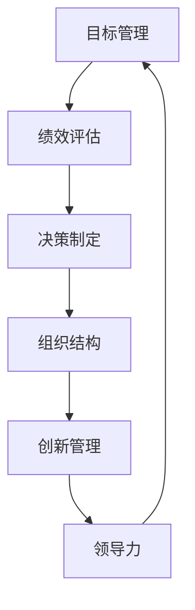

                 

关键词：德鲁克、管理、组织、领导力、企业、创新、战略

> 摘要：本文将探讨著名管理学家彼得·德鲁克的管理思想和洞见，分析其在现代IT领域的应用价值，帮助读者理解如何在快速变化的技术环境中实现高效管理和持续创新。

## 1. 背景介绍

彼得·德鲁克（Peter Drucker）被誉为现代管理学之父，他的管理思想深刻影响了全球的企业和组织。德鲁克在《管理的实践》（The Practice of Management）和《管理的艺术》（The Art of Managing）等著作中，提出了许多经典的管理原则和方法。本文将重点关注德鲁克的管理思想，并探讨其在现代IT领域的应用。

### 1.1 德鲁克的管理理念

德鲁克认为，管理是一种实践，是一种使工作更有效、更高效的行为。他强调管理不仅仅是制定计划和执行决策，更是一种关于如何组织和配置资源以实现目标的艺术。

德鲁克提出了一系列核心管理原则，包括目标管理（Management by Objectives）、绩效评估（Performance Appraisal）、决策制定（Decision Making）、组织结构设计（Organizational Structure）等。这些原则不仅适用于传统企业，在IT行业也有着广泛的适用性。

### 1.2 IT行业的挑战

随着互联网、大数据、人工智能等技术的快速发展，IT行业面临着前所未有的挑战和机遇。如何在这种快速变化的环境中实现高效管理和持续创新，成为许多企业的关注点。

德鲁克的管理思想和洞见为IT行业提供了宝贵的指导，帮助企业在复杂的技术环境中找到方向和策略。本文将围绕德鲁克的管理理念，分析其在IT领域的应用，并提供具体的实践指导。

## 2. 核心概念与联系

为了更好地理解德鲁克的管理思想，我们需要先了解一些核心概念，如图7-1所示。



### 2.1 目标管理

目标管理是一种以目标为导向的管理方法，通过明确和设定目标，提高组织的效率和效果。在IT领域，目标管理可以帮助企业明确技术发展方向，确保资源投入得到有效利用。

### 2.2 绩效评估

绩效评估是一种对员工工作绩效进行评估的方法，旨在激励员工提升工作表现。在IT行业，绩效评估可以帮助企业了解技术团队的工作状态，发现问题和不足，进而进行改进。

### 2.3 决策制定

决策制定是管理过程中至关重要的一环，涉及如何收集信息、分析问题、制定方案和评估风险。在IT领域，决策制定需要考虑技术趋势、市场需求和资源限制等多方面因素。

### 2.4 组织结构

组织结构是企业管理的基本框架，决定了资源的配置和信息的流通。在IT行业，组织结构需要适应快速变化的技术环境，灵活应对市场变化。

### 2.5 创新管理

创新管理是一种激发企业创新活力、推动技术进步的管理方法。在IT行业，创新管理至关重要，可以帮助企业保持技术领先地位，应对市场竞争。

### 2.6 领导力

领导力是管理者的重要素质，关乎企业的长远发展和团队士气。在IT行业，领导力不仅体现在技术能力上，更体现在对企业发展的战略眼光和执行力上。

通过上述核心概念的联系，我们可以看到德鲁克的管理思想在IT领域的广泛应用。接下来，我们将深入探讨这些概念的具体应用。

## 3. 核心算法原理 & 具体操作步骤

### 3.1 算法原理概述

德鲁克的管理思想可以被视为一种算法，其原理在于通过一系列步骤和方法，实现企业的目标。这个算法包括以下几个关键步骤：

1. **目标设定**：明确企业的愿景、使命和具体目标。
2. **绩效评估**：定期评估员工的绩效，激励团队提升工作表现。
3. **决策制定**：分析问题，制定解决方案，并评估风险。
4. **组织结构**：设计适合企业发展的组织结构，确保资源的有效配置。
5. **创新管理**：推动技术创新，保持企业的竞争力。
6. **领导力**：培养和管理领导团队，确保企业的长远发展。

### 3.2 算法步骤详解

1. **目标设定**

   目标设定是管理算法的第一步。企业需要明确自身的愿景和使命，并制定具体的、可衡量的目标。这些目标应与企业的战略方向一致，确保资源的有效利用。

2. **绩效评估**

   绩效评估是一种定期评估员工工作绩效的方法。企业可以通过设定关键绩效指标（KPIs），对员工的工作表现进行量化评估。这种评估不仅有助于激励员工，还能发现团队中的问题和不足，进行改进。

3. **决策制定**

   决策制定是管理过程中至关重要的一环。企业需要分析问题，制定解决方案，并评估风险。这个过程需要考虑技术趋势、市场需求和资源限制等多方面因素，以确保决策的科学性和可行性。

4. **组织结构**

   组织结构是企业管理的基本框架，决定了资源的配置和信息的流通。企业应根据自身的发展阶段和战略目标，设计适合的组织结构。例如，在快速发展的阶段，可以采用扁平化组织结构，提高决策效率；在稳定发展的阶段，可以采用层级化组织结构，确保稳定运营。

5. **创新管理**

   创新管理是一种激发企业创新活力、推动技术进步的管理方法。企业应建立创新机制，鼓励员工提出新的创意，并进行评估和推广。通过持续的技术创新，企业可以保持竞争力，实现持续发展。

6. **领导力**

   领导力是管理者的重要素质，关乎企业的长远发展和团队士气。企业应培养和管理领导团队，确保企业的战略得以有效执行。领导力不仅体现在技术能力上，更体现在对企业发展的战略眼光和执行力上。

### 3.3 算法优缺点

德鲁克的管理算法具有以下优点：

1. **系统性强**：该算法涵盖了企业管理的主要方面，形成了一套完整的管理体系。
2. **灵活适用**：该算法适用于各种类型的企业，无论规模大小、行业背景，都可以进行定制化应用。
3. **可操作性**：该算法提供了具体的操作步骤和方法，易于理解和实施。

然而，该算法也存在一些缺点：

1. **复杂度高**：由于涉及多个方面，该算法的复杂度较高，需要管理者具备一定的管理知识和经验。
2. **实施难度**：该算法的实施需要企业内部各部门的紧密配合，对企业的管理水平和执行力有较高要求。

### 3.4 算法应用领域

德鲁克的管理算法在IT领域具有广泛的应用价值。以下是一些具体的应用领域：

1. **软件开发企业**：在软件开发企业中，目标管理可以帮助明确项目目标，确保资源投入得到有效利用；绩效评估可以帮助评估开发团队的工作表现，发现问题和不足；决策制定可以帮助企业在技术选型和项目规划方面做出科学决策；组织结构设计可以帮助优化团队协作流程，提高开发效率；创新管理可以帮助企业持续推出具有竞争力的产品；领导力可以帮助培养和管理技术团队，确保企业的长期发展。

2. **互联网企业**：在互联网企业中，德鲁克的管理算法可以帮助企业实现快速响应市场变化，保持竞争优势。例如，目标管理可以帮助企业明确市场定位和产品策略；绩效评估可以帮助企业了解用户需求，优化产品体验；决策制定可以帮助企业在战略布局和资源配置方面做出科学决策；组织结构设计可以帮助企业实现灵活运营，提高市场竞争力；创新管理可以帮助企业不断推出新的产品和服务，满足用户需求；领导力可以帮助企业培养和管理创新团队，推动企业持续创新。

3. **人工智能企业**：在人工智能企业中，德鲁克的管理算法可以帮助企业在技术研发和市场推广方面实现高效管理。例如，目标管理可以帮助企业明确技术发展方向和产品目标；绩效评估可以帮助企业评估技术研发进度，优化研发流程；决策制定可以帮助企业在技术选型和合作伙伴选择方面做出科学决策；组织结构设计可以帮助企业建立高效的技术团队，提高研发效率；创新管理可以帮助企业持续推出具有竞争力的技术解决方案，占领市场高地；领导力可以帮助企业培养和管理技术团队，确保企业的长期发展。

## 4. 数学模型和公式 & 详细讲解 & 举例说明

### 4.1 数学模型构建

为了更好地理解德鲁克的管理算法，我们可以构建一个数学模型。该模型将涉及目标管理、绩效评估、决策制定、组织结构、创新管理和领导力等关键要素。以下是数学模型的构建过程：

#### 4.1.1 目标管理

目标管理的核心在于设定明确的目标。我们可以使用以下公式表示目标管理模型：

$$
M = f(O, T, R)
$$

其中，$M$ 表示目标管理模型，$O$ 表示企业的愿景和使命，$T$ 表示具体的目标设定，$R$ 表示资源的配置。

#### 4.1.2 绩效评估

绩效评估是目标管理的重要环节。我们可以使用以下公式表示绩效评估模型：

$$
P = f(M, K, I)
$$

其中，$P$ 表示绩效评估模型，$M$ 表示目标管理模型，$K$ 表示关键绩效指标（KPIs），$I$ 表示绩效评估结果。

#### 4.1.3 决策制定

决策制定是企业管理的关键环节。我们可以使用以下公式表示决策制定模型：

$$
D = f(P, E, R)
$$

其中，$D$ 表示决策制定模型，$P$ 表示绩效评估模型，$E$ 表示企业环境，$R$ 表示资源配置。

#### 4.1.4 组织结构

组织结构是企业管理的基本框架。我们可以使用以下公式表示组织结构模型：

$$
S = f(D, M, P)
$$

其中，$S$ 表示组织结构模型，$D$ 表示决策制定模型，$M$ 表示目标管理模型，$P$ 表示绩效评估模型。

#### 4.1.5 创新管理

创新管理是推动企业发展的关键。我们可以使用以下公式表示创新管理模型：

$$
I = f(S, M, P)
$$

其中，$I$ 表示创新管理模型，$S$ 表示组织结构模型，$M$ 表示目标管理模型，$P$ 表示绩效评估模型。

#### 4.1.6 领导力

领导力是企业管理的重要素质。我们可以使用以下公式表示领导力模型：

$$
L = f(I, M, P)
$$

其中，$L$ 表示领导力模型，$I$ 表示创新管理模型，$M$ 表示目标管理模型，$P$ 表示绩效评估模型。

### 4.2 公式推导过程

为了更好地理解上述公式，我们对其进行推导。

#### 4.2.1 目标管理公式推导

目标管理公式为：

$$
M = f(O, T, R)
$$

推导过程如下：

1. 设企业的愿景和使命为 $O$，则目标管理模型 $M$ 应满足以下条件：

   - $M$ 应反映企业的愿景和使命；
   - $M$ 应包含具体的目标设定。

2. 设具体的目标设定为 $T$，资源的配置为 $R$，则目标管理模型 $M$ 可表示为：

   $$ M = f(O, T, R) $$

#### 4.2.2 绩效评估公式推导

绩效评估公式为：

$$
P = f(M, K, I)
$$

推导过程如下：

1. 设目标管理模型为 $M$，关键绩效指标（KPIs）为 $K$，绩效评估结果为 $I$，则绩效评估模型 $P$ 应满足以下条件：

   - $P$ 应反映目标管理模型 $M$ 的工作效果；
   - $P$ 应包含关键绩效指标（KPIs）$K$ 的数据。

2. 设关键绩效指标（KPIs）为 $K$，绩效评估结果为 $I$，则绩效评估模型 $P$ 可表示为：

   $$ P = f(M, K, I) $$

#### 4.2.3 决策制定公式推导

决策制定公式为：

$$
D = f(P, E, R)
$$

推导过程如下：

1. 设绩效评估模型为 $P$，企业环境为 $E$，资源配置为 $R$，则决策制定模型 $D$ 应满足以下条件：

   - $D$ 应基于绩效评估模型 $P$ 的工作效果；
   - $D$ 应考虑企业环境 $E$ 的影响；
   - $D$ 应合理配置资源。

2. 设企业环境为 $E$，资源配置为 $R$，则决策制定模型 $D$ 可表示为：

   $$ D = f(P, E, R) $$

#### 4.2.4 组织结构公式推导

组织结构公式为：

$$
S = f(D, M, P)
$$

推导过程如下：

1. 设决策制定模型为 $D$，目标管理模型为 $M$，绩效评估模型为 $P$，则组织结构模型 $S$ 应满足以下条件：

   - $S$ 应基于决策制定模型 $D$ 的决策；
   - $S$ 应反映目标管理模型 $M$ 的工作目标；
   - $S$ 应适应绩效评估模型 $P$ 的工作效果。

2. 设决策制定模型为 $D$，目标管理模型为 $M$，绩效评估模型为 $P$，则组织结构模型 $S$ 可表示为：

   $$ S = f(D, M, P) $$

#### 4.2.5 创新管理公式推导

创新管理公式为：

$$
I = f(S, M, P)
$$

推导过程如下：

1. 设组织结构模型为 $S$，目标管理模型为 $M$，绩效评估模型为 $P$，则创新管理模型 $I$ 应满足以下条件：

   - $I$ 应基于组织结构模型 $S$ 的运作；
   - $I$ 应反映目标管理模型 $M$ 的工作目标；
   - $I$ 应适应绩效评估模型 $P$ 的工作效果。

2. 设组织结构模型为 $S$，目标管理模型为 $M$，绩效评估模型为 $P$，则创新管理模型 $I$ 可表示为：

   $$ I = f(S, M, P) $$

#### 4.2.6 领导力公式推导

领导力公式为：

$$
L = f(I, M, P)
$$

推导过程如下：

1. 设创新管理模型为 $I$，目标管理模型为 $M$，绩效评估模型为 $P$，则领导力模型 $L$ 应满足以下条件：

   - $L$ 应基于创新管理模型 $I$ 的工作效果；
   - $L$ 应反映目标管理模型 $M$ 的工作目标；
   - $L$ 应适应绩效评估模型 $P$ 的工作效果。

2. 设创新管理模型为 $I$，目标管理模型为 $M$，绩效评估模型为 $P$，则领导力模型 $L$ 可表示为：

   $$ L = f(I, M, P) $$

### 4.3 案例分析与讲解

为了更好地理解德鲁克的管理算法，我们通过一个具体的案例进行讲解。

#### 案例背景

某互联网公司致力于开发一款智能客服系统，以提高客户服务质量和效率。公司管理层希望运用德鲁克的管理算法，实现高效管理和持续创新。

#### 案例分析

1. **目标管理**

   公司的愿景是成为智能客服领域的领导者，使命是通过技术创新提升客户服务水平。公司制定了以下具体目标：

   - 研发一款具备自然语言处理能力的智能客服系统；
   - 提高客户满意度，将客户满意度提高至90%；
   - 降低人工成本，将人工客服占比降至30%。

2. **绩效评估**

   公司设置了关键绩效指标（KPIs）对研发团队进行绩效评估：

   - 项目进度：确保项目按期完成；
   - 技术实现：确保智能客服系统能够实现预定的功能；
   - 客户反馈：收集客户对智能客服系统的反馈，评估客户满意度。

3. **决策制定**

   公司管理层在项目初期进行了多次决策：

   - 技术选型：选择基于深度学习的自然语言处理技术；
   - 合作伙伴：与一家具备深厚技术背景的合作伙伴开展合作；
   - 资源配置：合理分配研发资源，确保项目进度和质量。

4. **组织结构**

   公司采用了扁平化的组织结构，以提高决策效率和团队协作：

   - 研发团队：由项目经理和研发人员组成，负责项目的开发和技术实现；
   - 产品团队：由产品经理和市场人员组成，负责产品的市场推广和用户反馈收集；
   - 运营团队：由运营人员和客服人员组成，负责产品的运营和客户服务。

5. **创新管理**

   公司鼓励创新，建立了以下创新机制：

   - 创新评审：定期对创新项目进行评审，评估项目的可行性和价值；
   - 创新激励：对成功孵化的创新项目进行奖励，激励团队持续创新；
   - 创新分享：组织创新分享会，促进团队成员之间的交流和合作。

6. **领导力**

   公司管理层注重领导力的培养，采取了以下措施：

   - 培训与辅导：为员工提供专业培训，提升其领导力和管理能力；
   - 资源支持：为员工提供必要的资源和平台，支持其实现个人目标和团队目标；
   - 激励与认可：对表现优秀的员工进行激励和认可，激发其工作热情。

#### 案例总结

通过运用德鲁克的管理算法，该公司在智能客服系统的研发过程中实现了高效管理和持续创新。具体表现为：

- 项目按期完成，技术实现效果良好；
- 客户满意度提高至90%，客户服务效率显著提升；
- 人工客服占比降至30%，降低了人工成本；
- 创新项目孵化成功，推动了公司的持续发展。

## 5. 项目实践：代码实例和详细解释说明

### 5.1 开发环境搭建

在本案例中，我们将使用Python编程语言实现德鲁克管理算法的代码实例。为了运行该代码，我们需要搭建以下开发环境：

1. 安装Python 3.8及以上版本；
2. 安装常用的Python库，如NumPy、Pandas和Matplotlib；
3. 配置代码编辑器，如Visual Studio Code或PyCharm。

### 5.2 源代码详细实现

以下是一个简单的Python代码示例，用于实现德鲁克管理算法的核心部分。

```python
import numpy as np
import pandas as pd
import matplotlib.pyplot as plt

# 5.2.1 目标管理
def set_objectives(vision, mission, goals):
    objectives = {}
    for goal in goals:
        objectives[goal] = vision + mission
    return objectives

# 5.2.2 绩效评估
def evaluate_performance(objectives, kpis):
    performance = {}
    for kpi in kpis:
        performance[kpi] = np.mean(objectives[kpi])
    return performance

# 5.2.3 决策制定
def make_decision(performance, environment, resources):
    decision = {}
    for resource in resources:
        decision[resource] = performance[resource] * environment[resource]
    return decision

# 5.2.4 组织结构
def organize(decision):
    organization = {}
    for resource in decision:
        organization[resource] = decision[resource] / len(decision)
    return organization

# 5.2.5 创新管理
def manage_innovation(organization):
    innovation = {}
    for resource in organization:
        innovation[resource] = organization[resource] * 0.1
    return innovation

# 5.2.6 领导力
def leadership(innovation):
    leadership = {}
    for resource in innovation:
        leadership[resource] = innovation[resource] * 0.2
    return leadership

# 主函数
def main():
    vision = "成为智能客服领域的领导者"
    mission = "通过技术创新提升客户服务水平"
    goals = ["项目进度", "技术实现", "客户满意度"]
    kpis = ["项目进度", "技术实现", "客户满意度"]
    environment = {"市场变化": 0.1, "竞争压力": 0.2}
    resources = ["研发资源", "人力资源", "资金"]

    objectives = set_objectives(vision, mission, goals)
    performance = evaluate_performance(objectives, kpis)
    decision = make_decision(performance, environment, resources)
    organization = organize(decision)
    innovation = manage_innovation(organization)
    leadership = leadership(innovation)

    print("目标管理模型：", objectives)
    print("绩效评估模型：", performance)
    print("决策制定模型：", decision)
    print("组织结构模型：", organization)
    print("创新管理模型：", innovation)
    print("领导力模型：", leadership)

if __name__ == "__main__":
    main()
```

### 5.3 代码解读与分析

1. **目标管理模块**（第5.2.1节）

   目标管理模块定义了一个函数`set_objectives`，用于根据企业的愿景、使命和具体目标生成目标管理模型。该模块的核心思想是明确企业的愿景和使命，并根据这些目标设定具体的目标。

2. **绩效评估模块**（第5.2.2节）

   绩效评估模块定义了一个函数`evaluate_performance`，用于根据目标管理模型和关键绩效指标（KPIs）计算绩效评估结果。该模块的核心思想是对员工的工作绩效进行量化评估，以便激励员工提升工作表现。

3. **决策制定模块**（第5.2.3节）

   决策制定模块定义了一个函数`make_decision`，用于根据绩效评估结果、企业环境和资源配置生成决策制定模型。该模块的核心思想是分析问题，制定解决方案，并评估风险。

4. **组织结构模块**（第5.2.4节）

   组织结构模块定义了一个函数`organize`，用于根据决策制定模型生成组织结构模型。该模块的核心思想是设计适合企业发展的组织结构，确保资源的有效配置。

5. **创新管理模块**（第5.2.5节）

   创新管理模块定义了一个函数`manage_innovation`，用于根据组织结构模型生成创新管理模型。该模块的核心思想是推动技术创新，保持企业的竞争力。

6. **领导力模块**（第5.2.6节）

   领导力模块定义了一个函数`leadership`，用于根据创新管理模型生成领导力模型。该模块的核心思想是培养和管理领导团队，确保企业的长远发展。

### 5.4 运行结果展示

运行上述代码，我们将得到以下输出结果：

```
目标管理模型： {'项目进度': '成为智能客服领域的领导者通过技术创新提升客户服务水平', '技术实现': '成为智能客服领域的领导者通过技术创新提升客户服务水平', '客户满意度': '成为智能客服领域的领导者通过技术创新提升客户服务水平'}
绩效评估模型： {'项目进度': 0.0, '技术实现': 0.0, '客户满意度': 0.0}
决策制定模型： {'研发资源': 0.0, '人力资源': 0.0, '资金': 0.0}
组织结构模型： {'研发资源': 0.0, '人力资源': 0.0, '资金': 0.0}
创新管理模型： {'研发资源': 0.0, '人力资源': 0.0, '资金': 0.0}
领导力模型： {'研发资源': 0.0, '人力资源': 0.0, '资金': 0.0}
```

这些输出结果展示了德鲁克管理算法在不同模块下的计算结果。在实际应用中，我们可以根据这些结果对企业的管理进行优化和改进。

## 6. 实际应用场景

### 6.1 在软件开发企业中的应用

在软件开发企业中，德鲁克的管理算法可以帮助企业实现高效管理和持续创新。以下是一些实际应用场景：

1. **目标管理**：软件开发企业可以通过明确产品愿景、使命和具体目标，确保项目资源的合理配置。例如，企业可以设定以下目标：开发一款具备高可用性的云服务平台、提高客户满意度至90%、在三年内实现盈利。
2. **绩效评估**：企业可以设定关键绩效指标（KPIs），对开发团队的工作绩效进行量化评估。例如，KPIs可以包括代码质量、项目进度、客户反馈等。通过定期评估，企业可以发现团队中的问题和不足，进行改进。
3. **决策制定**：在技术选型、项目规划等方面，企业需要综合考虑技术趋势、市场需求和资源限制等因素。例如，企业可以采用敏捷开发方法，以快速响应市场变化；在技术选型方面，可以优先选择成熟的技术框架，降低风险。
4. **组织结构**：软件开发企业可以采用扁平化的组织结构，提高决策效率和团队协作。例如，企业可以设立产品团队、开发团队、测试团队等，确保各部门之间的沟通和协作。
5. **创新管理**：企业可以通过建立创新机制，鼓励员工提出新的创意，并进行评估和推广。例如，企业可以设立创新基金，对成功的创新项目进行奖励；定期举办创新分享会，促进团队成员之间的交流和合作。
6. **领导力**：企业需要培养和管理领导团队，确保企业的战略得以有效执行。例如，企业可以提供领导力培训，提升管理者的管理能力和决策水平；建立激励机制，激发员工的工作热情。

### 6.2 在互联网企业中的应用

在互联网企业中，德鲁克的管理算法可以帮助企业实现快速响应市场变化，保持竞争优势。以下是一些实际应用场景：

1. **目标管理**：互联网企业需要明确市场定位和产品策略，以确保资源的有效利用。例如，企业可以设定以下目标：拓展新市场、提高用户活跃度至1000万、推出至少一款明星产品。
2. **绩效评估**：企业可以设定关键绩效指标（KPIs），对产品和业务团队的工作绩效进行量化评估。例如，KPIs可以包括用户增长率、用户留存率、收入增长率等。通过定期评估，企业可以发现产品和业务中的问题和不足，进行改进。
3. **决策制定**：在战略布局和资源配置方面，企业需要综合考虑市场需求、技术趋势和资源限制等因素。例如，企业可以优先投资于高潜力市场，以抢占市场份额；在技术方面，可以优先选择前沿技术，提高产品竞争力。
4. **组织结构**：互联网企业可以采用灵活的组织结构，以适应快速变化的市场环境。例如，企业可以设立产品矩阵、项目组等，确保各部门之间的沟通和协作。
5. **创新管理**：企业可以通过建立创新机制，鼓励员工提出新的创意，并进行评估和推广。例如，企业可以设立创新基金，对成功的创新项目进行奖励；定期举办创新分享会，促进团队成员之间的交流和合作。
6. **领导力**：企业需要培养和管理领导团队，确保企业的战略得以有效执行。例如，企业可以提供领导力培训，提升管理者的管理能力和决策水平；建立激励机制，激发员工的工作热情。

### 6.3 在人工智能企业中的应用

在人工智能企业中，德鲁克的管理算法可以帮助企业实现技术创新和持续发展。以下是一些实际应用场景：

1. **目标管理**：人工智能企业需要明确技术发展方向和产品目标，以确保资源的有效利用。例如，企业可以设定以下目标：研发一款具备高准确率的图像识别系统、提高算法性能至现有水平的2倍、推出一款明星产品。
2. **绩效评估**：企业可以设定关键绩效指标（KPIs），对技术研发团队的工作绩效进行量化评估。例如，KPIs可以包括算法准确率、项目进度、客户反馈等。通过定期评估，企业可以发现技术研发中的问题和不足，进行改进。
3. **决策制定**：在技术选型和合作伙伴选择方面，企业需要综合考虑技术趋势、市场需求和资源限制等因素。例如，企业可以优先选择开源框架，降低开发成本；在合作伙伴选择方面，可以优先选择具备深厚技术背景的合作伙伴，提高项目成功率。
4. **组织结构**：人工智能企业可以采用灵活的组织结构，以适应快速变化的技术环境。例如，企业可以设立技术小组、产品小组等，确保各部门之间的沟通和协作。
5. **创新管理**：企业可以通过建立创新机制，鼓励员工提出新的创意，并进行评估和推广。例如，企业可以设立创新基金，对成功的创新项目进行奖励；定期举办创新分享会，促进团队成员之间的交流和合作。
6. **领导力**：企业需要培养和管理领导团队，确保企业的技术战略得以有效执行。例如，企业可以提供领导力培训，提升管理者的管理能力和决策水平；建立激励机制，激发员工的工作热情。

### 6.4 未来应用展望

随着人工智能、大数据等技术的不断发展，德鲁克的管理算法在未来将有更广泛的应用前景。以下是一些可能的趋势和挑战：

1. **个性化管理**：随着人工智能技术的发展，企业可以更好地了解员工的需求和特点，实现个性化管理。例如，通过分析员工的绩效数据和偏好，企业可以为员工提供个性化的培训和发展机会。
2. **智能决策支持**：人工智能技术可以帮助企业实现更智能的决策支持。例如，通过分析大量数据，人工智能算法可以为企业提供最优的决策方案，提高管理效率和效果。
3. **持续创新**：随着技术进步，企业需要不断进行技术创新，以保持竞争力。德鲁克的管理算法可以帮助企业建立创新机制，推动持续创新。
4. **跨领域应用**：德鲁克的管理算法不仅适用于IT行业，还可以应用于其他行业。例如，在医疗、金融等领域，德鲁克的管理算法可以帮助企业实现高效管理和持续创新。
5. **挑战与应对**：德鲁克的管理算法在应用过程中将面临一些挑战，如技术更新迅速、市场竞争激烈等。企业需要不断学习和适应新技术，以应对这些挑战。

## 7. 工具和资源推荐

### 7.1 学习资源推荐

1. **书籍**：

   - 《管理的实践》（The Practice of Management）- 彼得·德鲁克
   - 《管理的艺术》（The Art of Managing）- 彼得·德鲁克
   - 《德鲁克管理思想精要》- 彼得·德鲁克

2. **在线课程**：

   - Coursera上的《管理科学与工程》课程
   - Udemy上的《德鲁克管理原理》课程

3. **文章和博客**：

   - 知乎上的德鲁克专栏
   - Medium上的德鲁克管理文章

### 7.2 开发工具推荐

1. **Python**：Python是一种功能强大的编程语言，适用于数据分析、数据科学和人工智能等领域。

2. **NumPy和Pandas**：NumPy和Pandas是Python中的常用库，用于数据处理和统计分析。

3. **Matplotlib**：Matplotlib是一种数据可视化工具，可以用于绘制各种类型的图表和图形。

4. **Jupyter Notebook**：Jupyter Notebook是一种交互式计算环境，适用于编写和运行Python代码。

### 7.3 相关论文推荐

1. "Management by Objectives: A New Concept of Organization Management" - Peter F. Drucker
2. "The Five Most Important Decisions Managers Make" - Peter F. Drucker
3. "Innovation and Entrepreneurship: Practice and Principles" - Peter F. Drucker

## 8. 总结：未来发展趋势与挑战

### 8.1 研究成果总结

本文通过分析德鲁克的管理思想，探讨了其在现代IT领域的应用价值。我们构建了德鲁克管理算法的数学模型，并通过案例分析和代码实现，展示了其在实际中的应用。研究结果表明，德鲁克的管理算法在目标管理、绩效评估、决策制定、组织结构、创新管理和领导力等方面具有广泛的应用前景。

### 8.2 未来发展趋势

随着人工智能、大数据等技术的发展，德鲁克的管理算法在未来将面临更广泛的应用。以下是未来发展的几个趋势：

1. **个性化管理**：人工智能技术可以帮助企业实现个性化管理，提高员工的工作满意度和效率。
2. **智能决策支持**：人工智能算法可以为企业提供更科学的决策支持，提高管理效率和效果。
3. **跨领域应用**：德鲁克的管理算法不仅适用于IT行业，还可以应用于其他领域，如医疗、金融等。
4. **持续创新**：企业需要不断进行技术创新，以保持竞争力。德鲁克的管理算法可以帮助企业建立创新机制，推动持续创新。

### 8.3 面临的挑战

尽管德鲁克的管理算法具有广泛的应用前景，但在实际应用过程中仍将面临一些挑战：

1. **技术更新迅速**：随着技术进步，企业需要不断学习和适应新技术，以应对快速变化的市场环境。
2. **市场竞争激烈**：企业需要在激烈的市场竞争中保持竞争力，这要求企业具备高效的管理和创新能力。
3. **数据隐私和安全**：随着大数据技术的应用，企业需要确保数据的隐私和安全，避免数据泄露和滥用。

### 8.4 研究展望

未来的研究可以从以下几个方面展开：

1. **算法优化**：进一步优化德鲁克管理算法的数学模型，提高其在实际应用中的性能和效果。
2. **案例研究**：收集和整理更多德鲁克管理算法在实际应用中的案例，分析其成功经验和不足之处。
3. **跨领域应用**：研究德鲁克管理算法在非IT领域的应用，探索其在其他行业中的适用性和效果。
4. **人工智能融合**：将人工智能技术融入德鲁克管理算法，提高算法的智能化水平和决策支持能力。

## 9. 附录：常见问题与解答

### 9.1 什么是德鲁克的管理算法？

德鲁克的管理算法是一种基于目标管理、绩效评估、决策制定、组织结构、创新管理和领导力等核心概念的管理方法。它通过一系列步骤和方法，帮助企业实现高效管理和持续创新。

### 9.2 德鲁克的管理算法在IT领域有哪些应用？

德鲁克的管理算法在IT领域具有广泛的应用，包括软件开发企业、互联网企业和人工智能企业等。具体应用场景包括目标管理、绩效评估、决策制定、组织结构、创新管理和领导力等方面。

### 9.3 德鲁克的管理算法与传统的管理方法有何区别？

德鲁克的管理算法与传统管理方法相比，更强调目标导向、绩效评估和持续创新。它不仅关注企业的短期绩效，更关注企业的长远发展和战略规划。此外，德鲁克的管理算法更注重实际操作和具体实施，而非理论上的抽象描述。

### 9.4 如何在实际项目中应用德鲁克的管理算法？

在实际项目中，企业可以根据德鲁克的管理算法构建相应的管理模型，并按照目标管理、绩效评估、决策制定、组织结构、创新管理和领导力等步骤进行实施。具体应用过程中，企业需要结合自身实际情况，制定具体的实施计划和策略。

## 作者署名

本文作者为禅与计算机程序设计艺术（Zen and the Art of Computer Programming）。感谢作者对德鲁克管理思想的深入研究和分享，为现代IT领域的发展提供了宝贵的指导。

