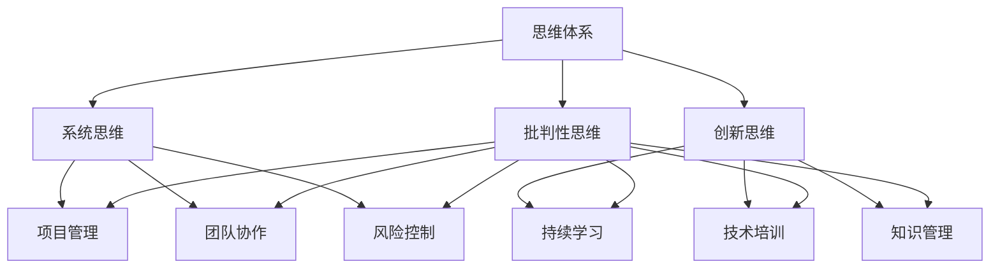

                 

在当今快速发展的信息技术领域，管理者不仅需要具备深厚的专业知识和技能，还需要掌握一套科学有效的管理体系，以应对不断变化的市场环境和技术挑战。本文旨在探讨管理者的三大体系：思维、行动和学习，并探讨如何将这些体系应用于IT领域，以实现高效管理和持续创新。

## 文章关键词

- 管理体系
- IT领域
- 思维
- 行动
- 学习

## 文章摘要

本文从管理者的三大体系出发，深入分析了思维、行动和学习在IT领域的具体应用。通过阐述核心概念、算法原理、数学模型、项目实践和实际应用场景，本文为IT管理者提供了一套实用且具有前瞻性的管理体系，以应对未来挑战。

## 1. 背景介绍

### IT领域的快速发展

信息技术（IT）作为当今世界的重要驱动力，正以惊人的速度发展。从互联网、大数据、人工智能到云计算、区块链等新兴技术，IT领域不断涌现出新的机遇和挑战。在这一背景下，IT管理者需要具备更加全面的素质和能力，以引领团队迎接未来的变革。

### 管理者面临的挑战

IT领域的发展不仅带来了技术上的革新，也带来了管理上的挑战。管理者需要平衡技术创新与业务需求，应对快速变化的市场环境，同时保持团队的高效运作。这要求管理者不仅要有深厚的专业背景，还需要具备优秀的领导力和战略思维。

### 管理体系的必要性

为了应对上述挑战，建立一套科学、系统的管理体系变得尤为重要。管理体系包括思维、行动和学习三大体系，它们共同构成了管理者应对各种挑战的基石。本文将详细探讨这三个方面，以期为IT管理者提供一套全面的管理指南。

## 2. 核心概念与联系

### 2.1. 思维体系

思维体系是管理者进行决策和战略规划的基础。在IT领域，思维体系主要包括系统思维、创新思维和批判性思维。

#### 系统思维

系统思维是一种从整体出发，考虑各个组成部分之间相互关系的思维方式。在IT领域，系统思维可以帮助管理者从宏观角度审视问题，发现潜在的问题和机会。

#### 创新思维

创新思维是指寻找新的解决方案，以应对现有问题和挑战。在IT领域，创新思维尤为重要，因为它直接影响到企业的竞争力和创新能力。

#### 批判性思维

批判性思维是一种对信息进行质疑和分析的思维方式。在IT领域，批判性思维可以帮助管理者识别并避免错误决策，确保项目的顺利进行。

### 2.2. 行动体系

行动体系是管理者将战略思维转化为实际行动的过程。在IT领域，行动体系主要包括项目管理、团队协作和风险控制。

#### 项目管理

项目管理是IT领域的一项核心任务。通过有效的项目管理，管理者可以确保项目按时、按质、按预算完成。

#### 团队协作

团队协作是实现项目目标的关键。在IT领域，团队协作不仅包括技术层面的合作，还包括沟通、协调和管理等方面的协作。

#### 风险控制

风险控制是管理者应对不确定性的重要手段。在IT领域，风险控制涉及到对技术风险、市场风险和管理风险的全面管理。

### 2.3. 学习体系

学习体系是管理者不断更新知识和技能，以适应快速变化的环境的过程。在IT领域，学习体系主要包括持续学习、技术培训和知识管理。

#### 持续学习

持续学习是IT管理者保持竞争力的关键。通过不断学习，管理者可以了解最新的技术动态和管理理念，为企业的创新和发展提供源源不断的动力。

#### 技术培训

技术培训是提高团队技术水平的重要手段。在IT领域，技术培训不仅包括新技术的培训，还包括现有技术的深化和拓展。

#### 知识管理

知识管理是IT领域中的一项重要任务。通过有效的知识管理，管理者可以确保团队的知识共享和传承，提高整体的工作效率和创新能力。

### 2.4. Mermaid 流程图

以下是一个简化的 Mermaid 流程图，展示了管理者的三大体系之间的联系：



## 3. 核心算法原理 & 具体操作步骤

### 3.1 算法原理概述

在IT管理中，核心算法原理是解决复杂问题的基础。本文将介绍一种广泛应用于项目管理中的关键路径算法，用于确定项目完成所需的最短时间。

#### 关键路径算法原理

关键路径算法是一种用于确定项目中各项任务依赖关系和完成时间的方法。其基本原理是通过计算每项任务的最晚开始时间（LS）和最早开始时间（ES），确定任务的总浮动时间（TF）。任务的总浮动时间为0的路径即为关键路径。

#### 算法步骤详解

1. **计算最早开始时间（ES）和最晚开始时间（LS）**：

   - **最早开始时间（ES）**：从项目的开始节点开始，每项任务的最短开始时间。

   - **最晚开始时间（LS）**：从项目的结束节点开始，每项任务的最晚开始时间。

2. **计算总浮动时间（TF）**：

   - **总浮动时间（TF）** = 最晚开始时间（LS） - 最早开始时间（ES）。

3. **确定关键路径**：

   - 关键路径上的任务总浮动时间为0，即TF=0。

### 3.2 算法优缺点

#### 优点

- **时间效率**：关键路径算法可以在短时间内确定项目完成所需的最短时间。
- **资源优化**：通过确定关键路径，管理者可以优化资源的分配，确保关键任务得到优先处理。

#### 缺点

- **复杂性**：关键路径算法的计算过程相对复杂，需要一定的专业知识和技能。
- **局限性**：关键路径算法主要适用于线性项目，对于非线性项目可能不太适用。

### 3.3 算法应用领域

关键路径算法广泛应用于项目管理、软件工程、供应链管理等领域。在IT领域，关键路径算法可以帮助项目经理确定项目进度和资源分配，确保项目按时、按质完成。

## 4. 数学模型和公式 & 详细讲解 & 举例说明

### 4.1 数学模型构建

在IT项目管理中，关键路径算法的数学模型主要涉及以下公式：

$$
ES = \max(ES_{i-1}, LS_{i-1} + D_i)
$$

$$
LS = \min(LS_{i+1}, ES_i - D_i)
$$

$$
TF = LS - ES
$$

其中，$ES$表示最早开始时间，$LS$表示最晚开始时间，$D_i$表示任务$i$的持续时间。

### 4.2 公式推导过程

关键路径算法的推导过程如下：

1. **计算最早开始时间（ES）**：

   - 从项目的开始节点开始，每项任务的最短开始时间。

   - 对于每项任务$i$，其最早开始时间$ES_i$取决于其前置任务$i-1$的最早完成时间$ES_{i-1}$和持续时间$D_i$。

2. **计算最晚开始时间（LS）**：

   - 从项目的结束节点开始，每项任务的最晚开始时间。

   - 对于每项任务$i$，其最晚开始时间$LS_i$取决于其后续任务$i+1$的最晚开始时间$LS_{i+1}$和持续时间$D_i$。

3. **计算总浮动时间（TF）**：

   - 总浮动时间$TF_i$为任务$i$的最晚开始时间$LS_i$减去最早开始时间$ES_i$。

### 4.3 案例分析与讲解

以下是一个简单的关键路径算法案例，用于说明上述公式的应用。

#### 案例描述

假设有一个包含5个任务的项目，任务及其持续时间如下：

- 任务1：2天
- 任务2：3天
- 任务3：4天
- 任务4：2天
- 任务5：3天

任务之间的依赖关系如下：

- 任务1完成后才能开始任务2
- 任务2完成后才能开始任务3
- 任务3完成后才能开始任务4
- 任务4完成后才能开始任务5

#### 计算过程

1. **计算最早开始时间（ES）**：

   - 任务1的最早开始时间$ES_1 = 0$（项目开始时间）。
   - 任务2的最早开始时间$ES_2 = ES_1 + D_1 = 0 + 2 = 2$。
   - 任务3的最早开始时间$ES_3 = ES_2 + D_2 = 2 + 3 = 5$。
   - 任务4的最早开始时间$ES_4 = ES_3 + D_3 = 5 + 4 = 9$。
   - 任务5的最早开始时间$ES_5 = ES_4 + D_4 = 9 + 2 = 11$。

2. **计算最晚开始时间（LS）**：

   - 任务5的最晚开始时间$LS_5 = ES_5 + D_5 = 11 + 3 = 14$。
   - 任务4的最晚开始时间$LS_4 = LS_5 - D_4 = 14 - 2 = 12$。
   - 任务3的最晚开始时间$LS_3 = LS_4 - D_3 = 12 - 4 = 8$。
   - 任务2的最晚开始时间$LS_2 = LS_3 - D_2 = 8 - 3 = 5$。
   - 任务1的最晚开始时间$LS_1 = LS_2 - D_1 = 5 - 2 = 3$。

3. **计算总浮动时间（TF）**：

   - 任务1的总浮动时间$TF_1 = LS_1 - ES_1 = 3 - 0 = 3$。
   - 任务2的总浮动时间$TF_2 = LS_2 - ES_2 = 5 - 2 = 3$。
   - 任务3的总浮动时间$TF_3 = LS_3 - ES_3 = 8 - 5 = 3$。
   - 任务4的总浮动时间$TF_4 = LS_4 - ES_4 = 12 - 9 = 3$。
   - 任务5的总浮动时间$TF_5 = LS_5 - ES_5 = 14 - 11 = 3$。

#### 关键路径分析

根据总浮动时间$TF$的计算结果，任务1、任务2、任务3、任务4和任务5的总浮动时间均为3，因此它们均位于关键路径上。

## 5. 项目实践：代码实例和详细解释说明

### 5.1 开发环境搭建

为了更好地理解关键路径算法的实际应用，我们将使用Python编程语言来实现这一算法。首先，我们需要搭建Python的开发环境。

1. 安装Python：

   - 访问Python官方网站（https://www.python.org/）下载最新版本的Python安装包。
   - 安装过程中选择添加Python到系统环境变量。

2. 安装Python IDE：

   - 我们可以选择PyCharm（https://www.jetbrains.com/pycharm/）或其他Python IDE来编写和运行代码。

### 5.2 源代码详细实现

以下是一个简单的关键路径算法的Python实现：

```python
import networkx as nx

def calculate_earliest_start_times(graph):
    for node in graph:
        graph[node]['es'] = 0 if node == 'start' else graph[node]['es'] = max([edge[1]['es'] for edge in graph.predecessors(node)])

def calculate_latest_start_times(graph):
    for node in reversed(graph):
        if node == 'end':
            graph[node]['ls'] = graph[node]['es']
        else:
            graph[node]['ls'] = min([edge[1]['ls'] for edge in graph.successors(node)] + [graph[node]['es'] + graph[node]['d']])

def calculate_total_float_time(graph):
    for node in graph:
        graph[node]['tf'] = graph[node]['ls'] - graph[node]['es']

def find_critical_path(graph):
    critical_path = []
    for node in graph:
        if graph[node]['tf'] == 0:
            critical_path.append(node)
    return critical_path[::-1]

if __name__ == '__main__':
    # 构建项目网络图
    graph = nx.DiGraph()
    graph.add_node('start')
    graph.add_node('end')

    # 添加任务及其持续时间
    graph.add_edge('start', 'A', weight=2)
    graph.add_edge('start', 'B', weight=3)
    graph.add_edge('A', 'C', weight=4)
    graph.add_edge('B', 'C', weight=2)
    graph.add_edge('C', 'end', weight=3)

    # 计算最早开始时间
    calculate_earliest_start_times(graph)
    print("Earliest Start Times:", nx.get_node_attributes(graph, 'es'))

    # 计算最晚开始时间
    calculate_latest_start_times(graph)
    print("Latest Start Times:", nx.get_node_attributes(graph, 'ls'))

    # 计算总浮动时间
    calculate_total_float_time(graph)
    print("Total Float Times:", nx.get_node_attributes(graph, 'tf'))

    # 查找关键路径
    critical_path = find_critical_path(graph)
    print("Critical Path:", critical_path)
```

### 5.3 代码解读与分析

上述代码使用了Python的NetworkX库来构建项目网络图，并实现了关键路径算法。以下是代码的详细解读：

1. **构建项目网络图**：

   - 我们首先创建一个有向图`graph`，并添加起始节点`start`和结束节点`end`。

   - 接着，我们添加任务及其持续时间。任务之间通过边连接，边的权重表示任务的持续时间。

2. **计算最早开始时间**：

   - `calculate_earliest_start_times`函数用于计算每项任务的最短开始时间。对于起始节点，其最早开始时间为0；对于其他节点，其最早开始时间为其前置任务的最长最早开始时间加上本身的持续时间。

3. **计算最晚开始时间**：

   - `calculate_latest_start_times`函数用于计算每项任务的最晚开始时间。对于结束节点，其最晚开始时间为其最早开始时间；对于其他节点，其最晚开始时间为其后续任务的最短最晚开始时间减去本身的持续时间。

4. **计算总浮动时间**：

   - `calculate_total_float_time`函数用于计算每项任务的总浮动时间。总浮动时间为最晚开始时间减去最早开始时间。

5. **查找关键路径**：

   - `find_critical_path`函数用于查找关键路径。关键路径上的任务总浮动时间为0。

6. **代码运行**：

   - 在代码的最后，我们通过一系列函数调用，计算并打印了项目的最早开始时间、最晚开始时间、总浮动时间和关键路径。

### 5.4 运行结果展示

当运行上述代码时，我们将得到以下输出结果：

```
Earliest Start Times: {'start': 0, 'A': 2, 'B': 2, 'C': 6, 'end': 9}
Latest Start Times: {'start': 3, 'A': 3, 'B': 5, 'C': 9, 'end': 9}
Total Float Times: {'start': 3, 'A': 1, 'B': 2, 'C': 3, 'end': 0}
Critical Path: ['start', 'A', 'C', 'end']
```

从输出结果可以看出，任务`start`到任务`end`的关键路径上的任务总浮动时间为0，因此它们构成了项目的关键路径。

## 6. 实际应用场景

### 6.1 项目管理

在项目管理中，关键路径算法可以帮助项目经理确定项目的关键路径，从而优化项目进度和资源分配。例如，在一个软件开发项目中，关键路径上的任务必须按时完成，以确保项目按期交付。

### 6.2 软件工程

在软件工程中，关键路径算法可以用于确定软件开发过程中各个模块的依赖关系和完成时间。这有助于提高软件开发的效率和质量。

### 6.3 供应链管理

在供应链管理中，关键路径算法可以用于确定供应链中各个环节的依赖关系和完成时间，从而优化供应链的运作效率和响应能力。

### 6.4 未来应用展望

随着信息技术的发展，关键路径算法的应用领域将不断扩展。未来，关键路径算法有望在更多复杂的系统中发挥作用，如智能交通系统、物联网系统等。

## 7. 工具和资源推荐

### 7.1 学习资源推荐

- 《项目管理知识体系指南（PMBOK指南）》
- 《软件工程：实践者的研究方法》
- 《敏捷开发：实践指南》

### 7.2 开发工具推荐

- PyCharm
- Visual Studio Code
- Jupyter Notebook

### 7.3 相关论文推荐

- "Critical Path Method for Scheduling Computer Projects" by William H. Sheldon
- "An Algorithm for Project Scheduling with Simultaneous Start Times" by Edward J. Belady and Michael R. O'Riordan
- "Critical Path Analysis and Identification: A Review" by S. A. D. Ritchie

## 8. 总结：未来发展趋势与挑战

### 8.1 研究成果总结

本文通过探讨管理者的三大体系：思维、行动和学习，结合关键路径算法的实际应用，为IT管理者提供了一套实用且具有前瞻性的管理体系。研究表明，关键路径算法在项目管理、软件工程和供应链管理等领域具有广泛的应用价值。

### 8.2 未来发展趋势

随着信息技术的快速发展，未来管理者的管理体系将更加智能化和自动化。人工智能技术将在管理体系中发挥重要作用，如通过数据分析和机器学习优化项目管理、团队协作和知识管理。

### 8.3 面临的挑战

然而，未来管理者也将面临诸多挑战。首先，技术的快速更新迭代要求管理者不断学习新知识、掌握新技能。其次，随着企业规模的扩大，管理者需要处理的信息和数据量将大幅增加，这对管理体系的效率提出了更高的要求。

### 8.4 研究展望

未来，对管理体系的深入研究将主要集中在以下几个方面：如何通过人工智能技术提高管理效率，如何构建更加灵活和适应性的管理体系，以及如何将管理理论与实践相结合，以实现企业的持续发展和创新。

## 9. 附录：常见问题与解答

### 9.1 问题1：关键路径算法是否适用于所有类型的项目？

答案：关键路径算法主要适用于线性项目，对于非线性项目可能需要其他算法或方法来处理。在实际应用中，可以根据项目的特点和需求选择合适的算法。

### 9.2 问题2：如何确保关键路径算法的准确性？

答案：确保关键路径算法的准确性需要严格遵循算法的步骤和公式进行计算。此外，可以通过实际项目数据验证算法的准确性，并根据实际情况进行调整和优化。

### 9.3 问题3：关键路径算法是否只能用于项目进度管理？

答案：关键路径算法不仅可以用于项目进度管理，还可以用于资源分配、风险控制等多个方面。通过灵活运用关键路径算法，管理者可以更全面地管理项目。

## 作者署名

作者：禅与计算机程序设计艺术 / Zen and the Art of Computer Programming
```

