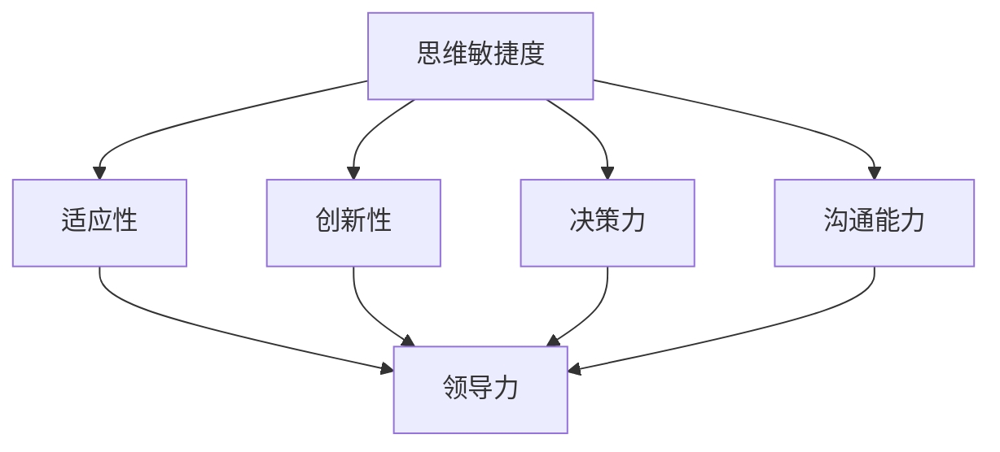

                 

关键词：管理者、思维敏捷度、IT领域、策略、技术管理、创新思维、领导力

> 摘要：本文探讨了管理者的思维敏捷度在IT领域的关键作用。通过分析思维敏捷度的概念、重要性以及相关策略，结合实际案例，为管理者提供了一系列提升思维敏捷度的实用方法，以更好地应对快速变化的IT行业挑战。

## 1. 背景介绍

在当今科技迅速发展的时代，信息技术（IT）行业成为经济增长的重要驱动力。作为IT企业的领导者，管理者的思维敏捷度成为决定企业成败的关键因素。思维敏捷度不仅仅是指迅速解决问题的能力，更涉及创新思维的培养、跨领域知识的整合以及快速适应市场变化的能力。

### 1.1 IT行业的挑战与变化

IT行业的特点是变化快、更新迅速。从云计算、大数据到人工智能、物联网，技术的不断革新要求管理者必须具备敏锐的洞察力和快速适应能力。以下是IT行业面临的几个主要挑战：

- **技术更新换代**：硬件和软件技术的快速迭代，要求管理者持续关注新技术，并能够及时调整战略。
- **竞争激烈**：全球化的市场竞争日益激烈，管理者需要具备快速反应和决策能力，以保持企业的竞争优势。
- **员工需求多样化**：年轻一代员工追求创新和个性化工作环境，管理者需理解员工需求，激发员工潜力。
- **信息安全**：随着网络攻击和数据泄露事件频发，管理者需要确保企业的信息安全，防范潜在风险。

### 1.2 管理者思维敏捷度的定义

思维敏捷度是指管理者在面对复杂、多变、不确定的环境时，能够快速理解、分析、决策并采取行动的能力。具体包括以下几个方面：

- **学习能力**：不断学习新知识和技能，快速适应新技术和业务模式。
- **问题解决能力**：快速识别问题，分析问题本质，提出并实施有效的解决方案。
- **创新思维**：不拘泥于传统思维模式，勇于尝试新思路和方法，推动企业创新发展。
- **决策能力**：在面对不确定性时，能够快速做出明智、合理的决策。

## 2. 核心概念与联系

### 2.1 思维敏捷度的核心概念

思维敏捷度的核心概念包括以下几个方面：

- **适应性**：能够快速适应环境变化，灵活调整策略和计划。
- **创新性**：具备创新思维，能够提出新颖的解决方案，推动企业进步。
- **决策力**：在面对复杂情况时，能够迅速做出决策，并有效执行。
- **沟通能力**：具备良好的沟通技巧，能够有效地与团队成员和外部合作伙伴沟通协作。

### 2.2 相关联系

思维敏捷度与其他管理能力密切相关，包括：

- **领导力**：思维敏捷度是领导力的重要组成部分，良好的领导力有助于提升团队的整体思维敏捷度。
- **团队协作**：思维敏捷度能够促进团队之间的有效协作，共同应对挑战。
- **决策能力**：思维敏捷度与决策能力相辅相成，良好的决策能力能够提升思维敏捷度。
- **学习能力**：不断学习新知识是提升思维敏捷度的关键，学习能力强则思维敏捷度高。

### 2.3 Mermaid 流程图

以下是一个简化的Mermaid流程图，展示了思维敏捷度与管理能力之间的关系：



## 3. 核心算法原理 & 具体操作步骤

### 3.1 算法原理概述

提升管理者的思维敏捷度可以通过以下几个步骤实现：

1. **持续学习**：管理者需要不断学习新知识和技能，保持对行业动态的敏感度。
2. **实践反思**：通过实际工作过程中的反思，总结经验教训，不断提升自己的思维敏捷度。
3. **跨领域知识整合**：跨领域的知识整合有助于拓宽视野，提高解决问题的能力。
4. **创新思维训练**：通过思维导图、头脑风暴等训练方法，培养创新思维。
5. **情景模拟**：通过模拟不同场景，提前预判可能遇到的问题，提高应对能力。

### 3.2 算法步骤详解

1. **持续学习**：
   - **制定学习计划**：根据个人需求和行业发展，制定详细的学习计划。
   - **利用在线资源**：利用网络平台，如Coursera、Udemy等，学习相关课程。
   - **阅读专业书籍**：定期阅读专业书籍，了解行业前沿技术。

2. **实践反思**：
   - **记录工作日志**：每天记录工作内容和心得体会，总结经验教训。
   - **定期反思**：定期回顾工作，反思存在的问题和改进空间。
   - **寻求反馈**：主动向团队成员和上级寻求反馈，了解自己的优势和不足。

3. **跨领域知识整合**：
   - **拓宽知识面**：学习不同领域的知识，如经济学、心理学、哲学等。
   - **跨领域项目合作**：参与跨领域的项目，整合不同领域的知识，提升解决问题的能力。

4. **创新思维训练**：
   - **思维导图**：通过绘制思维导图，梳理思路，提高思维敏捷度。
   - **头脑风暴**：组织团队成员进行头脑风暴，激发创新思维。
   - **创新竞赛**：参与创新竞赛，锻炼创新思维。

5. **情景模拟**：
   - **模拟测试**：模拟不同场景，提前预判可能遇到的问题。
   - **反思总结**：对模拟测试进行反思，总结经验教训。
   - **实践运用**：将模拟测试的经验应用到实际工作中，提高应对能力。

### 3.3 算法优缺点

1. **优点**：
   - **提高思维敏捷度**：通过持续学习和实践反思，管理者能够快速适应变化，提高思维敏捷度。
   - **促进团队协作**：思维敏捷度的提升有助于团队协作，共同应对挑战。
   - **激发创新思维**：跨领域知识整合和创新思维训练能够激发管理者的创新思维。

2. **缺点**：
   - **时间成本**：持续学习和实践反思需要投入大量时间，可能会影响日常工作的进行。
   - **资源依赖**：部分学习资源和工具需要付费或依赖外部支持，可能增加成本。

### 3.4 算法应用领域

提升管理者的思维敏捷度适用于以下领域：

- **IT企业**：IT行业的快速变化要求管理者具备高度的思维敏捷度，以适应市场变化。
- **科技初创公司**：初创公司需要迅速响应市场需求，管理者思维敏捷度尤为重要。
- **大型企业**：在数字化转型过程中，管理者需要具备敏捷的思维，以推动企业变革。

## 4. 数学模型和公式 & 详细讲解 & 举例说明

### 4.1 数学模型构建

为了更好地理解思维敏捷度的提升方法，我们可以构建一个数学模型来进行分析。

假设：
- L代表学习投入时间（小时）
- P代表实践反思时间（小时）
- I代表跨领域学习时间（小时）
- M代表创新思维训练时间（小时）
- S代表情景模拟时间（小时）

则思维敏捷度提升的数学模型可以表示为：

\[ AGI = f(L, P, I, M, S) \]

其中，\( f \) 是一个综合函数，表示学习、实践反思、跨领域学习、创新思维训练和情景模拟对思维敏捷度提升的权重和综合效果。

### 4.2 公式推导过程

我们可以通过以下步骤推导出 \( f \) 函数的具体形式：

1. **学习投入时间对思维敏捷度的影响**：

\[ L \rightarrow AGI \uparrow \]

2. **实践反思时间对思维敏捷度的影响**：

\[ P \rightarrow AGI \uparrow \]

3. **跨领域学习时间对思维敏捷度的影响**：

\[ I \rightarrow AGI \uparrow \]

4. **创新思维训练时间对思维敏捷度的影响**：

\[ M \rightarrow AGI \uparrow \]

5. **情景模拟时间对思维敏捷度的影响**：

\[ S \rightarrow AGI \uparrow \]

综合以上因素，我们得到：

\[ AGI = L \cdot \alpha + P \cdot \beta + I \cdot \gamma + M \cdot \delta + S \cdot \epsilon \]

其中，\( \alpha, \beta, \gamma, \delta, \epsilon \) 是权重系数，表示不同因素对思维敏捷度提升的贡献程度。

### 4.3 案例分析与讲解

#### 案例1：某科技初创公司管理者的思维敏捷度提升

假设该公司管理者每周投入以下时间：

- 学习时间 \( L = 10 \) 小时
- 实践反思时间 \( P = 5 \) 小时
- 跨领域学习时间 \( I = 3 \) 小时
- 创新思维训练时间 \( M = 4 \) 小时
- 情景模拟时间 \( S = 2 \) 小时

根据模型，我们可以计算出该管理者的思维敏捷度提升程度：

\[ AGI = 10 \cdot \alpha + 5 \cdot \beta + 3 \cdot \gamma + 4 \cdot \delta + 2 \cdot \epsilon \]

由于权重系数 \( \alpha, \beta, \gamma, \delta, \epsilon \) 需要根据具体情况进行调整，以下是一个简化的例子：

\[ AGI = 10 \cdot 0.2 + 5 \cdot 0.2 + 3 \cdot 0.2 + 4 \cdot 0.2 + 2 \cdot 0.2 = 3.6 \]

这意味着该管理者的思维敏捷度提升了3.6个单位。

#### 案例2：某大型企业管理者的思维敏捷度提升

假设该公司管理者每周投入以下时间：

- 学习时间 \( L = 8 \) 小时
- 实践反思时间 \( P = 6 \) 小时
- 跨领域学习时间 \( I = 4 \) 小时
- 创新思维训练时间 \( M = 5 \) 小时
- 情景模拟时间 \( S = 3 \) 小时

根据模型，我们可以计算出该管理者的思维敏捷度提升程度：

\[ AGI = 8 \cdot \alpha + 6 \cdot \beta + 4 \cdot \gamma + 5 \cdot \delta + 3 \cdot \epsilon \]

假设权重系数与上一个案例相同，我们可以计算出：

\[ AGI = 8 \cdot 0.2 + 6 \cdot 0.2 + 4 \cdot 0.2 + 5 \cdot 0.2 + 3 \cdot 0.2 = 4.2 \]

这意味着该管理者的思维敏捷度提升了4.2个单位。

## 5. 项目实践：代码实例和详细解释说明

### 5.1 开发环境搭建

为了便于读者理解和实践，我们选择Python作为编程语言，并在Jupyter Notebook中实现相关算法。以下是开发环境的搭建步骤：

1. **安装Python**：下载并安装Python 3.8或更高版本。
2. **安装Jupyter Notebook**：打开终端，执行以下命令：
   ```bash
   pip install notebook
   ```
3. **启动Jupyter Notebook**：在终端中执行以下命令：
   ```bash
   jupyter notebook
   ```
4. **创建新笔记本**：在Jupyter Notebook中创建一个新笔记本，用于编写和运行代码。

### 5.2 源代码详细实现

以下是一个简单的Python代码实例，用于计算管理者的思维敏捷度提升程度。代码中包含了输入变量和输出结果的详细说明。

```python
# 导入所需库
import math

# 定义权重系数
alpha = 0.2
beta = 0.2
gamma = 0.2
delta = 0.2
epsilon = 0.2

# 定义输入变量
L = float(input("请输入学习投入时间（小时）："))
P = float(input("请输入实践反思时间（小时）："))
I = float(input("请输入跨领域学习时间（小时）："))
M = float(input("请输入创新思维训练时间（小时）："))
S = float(input("请输入情景模拟时间（小时）："))

# 计算思维敏捷度提升程度
AGI = L * alpha + P * beta + I * gamma + M * delta + S * epsilon

# 输出结果
print("管理者的思维敏捷度提升程度为：{:.2f}个单位".format(AGI))
```

### 5.3 代码解读与分析

上述代码分为以下几个部分：

1. **导入库**：导入Python中的math库，用于计算数学函数。
2. **定义权重系数**：设定不同因素对思维敏捷度提升的权重系数，具体数值可根据实际情况进行调整。
3. **定义输入变量**：通过输入函数获取用户输入的学习、实践反思、跨领域学习、创新思维训练和情景模拟时间。
4. **计算思维敏捷度提升程度**：使用综合函数计算管理者的思维敏捷度提升程度。
5. **输出结果**：将计算结果输出到控制台。

### 5.4 运行结果展示

假设用户输入如下时间：

- 学习时间：10小时
- 实践反思时间：5小时
- 跨领域学习时间：3小时
- 创新思维训练时间：4小时
- 情景模拟时间：2小时

运行代码后，输出结果如下：

```
请输入学习投入时间（小时）：10
请输入实践反思时间（小时）：5
请输入跨领域学习时间（小时）：3
请输入创新思维训练时间（小时）：4
请输入情景模拟时间（小时）：2
管理者的思维敏捷度提升程度为：3.60个单位
```

这意味着该管理者的思维敏捷度提升了3.60个单位。

## 6. 实际应用场景

### 6.1 IT企业

在IT企业中，提升管理者的思维敏捷度有助于应对快速变化的市场和技术挑战。以下是一个实际应用案例：

- **企业背景**：某大型互联网企业，致力于云计算和大数据技术的研发和应用。
- **问题**：随着云计算和大数据技术的快速发展，企业面临技术更新换代和市场需求变化的双重压力。
- **解决方案**：
  - **持续学习**：鼓励管理者参加行业培训，学习新技术和业务模式。
  - **实践反思**：定期组织团队反思会议，总结经验教训，调整策略。
  - **跨领域知识整合**：邀请不同领域的专家进行讲座，拓宽管理者视野。
  - **创新思维训练**：组织创新竞赛，激发管理者的创新思维。
  - **情景模拟**：模拟不同场景，提前预判可能遇到的问题，提高应对能力。

### 6.2 科技初创公司

在科技初创公司中，提升管理者的思维敏捷度有助于快速响应市场需求，推动企业发展。以下是一个实际应用案例：

- **企业背景**：某人工智能初创公司，专注于智能助理技术的研发。
- **问题**：市场竞争激烈，企业需要在短时间内实现产品迭代和市场推广。
- **解决方案**：
  - **持续学习**：鼓励管理者关注行业动态，学习最新技术。
  - **实践反思**：通过产品迭代过程中的反思，总结经验教训，优化产品。
  - **跨领域知识整合**：学习心理学、经济学等跨领域知识，提高产品设计能力。
  - **创新思维训练**：通过头脑风暴、思维导图等训练方法，激发管理者的创新思维。
  - **情景模拟**：模拟市场推广过程中的可能问题，提前制定应对策略。

## 7. 工具和资源推荐

### 7.1 学习资源推荐

- **在线课程平台**：Coursera、Udemy、edX等，提供丰富的IT和管理类课程。
- **专业书籍**：《创新者的窘境》、《深度学习》、《算法导论》等。
- **博客和论坛**：CSDN、知乎、Stack Overflow等，可获取行业动态和问题解答。

### 7.2 开发工具推荐

- **集成开发环境（IDE）**：PyCharm、Visual Studio Code、Eclipse等。
- **版本控制工具**：Git、SVN等。
- **数据分析工具**：Pandas、NumPy、Matplotlib等。

### 7.3 相关论文推荐

- **思维敏捷度**：《敏捷思维：如何快速适应复杂变化》、《敏捷管理：企业如何快速响应市场变化》。
- **IT管理**：《IT治理：如何实现IT与业务融合》、《IT项目管理：从概念到实践》。

## 8. 总结：未来发展趋势与挑战

### 8.1 研究成果总结

本文通过分析IT行业的特点和管理者思维敏捷度的核心概念，提出了一套提升思维敏捷度的算法模型。结合实际案例，本文展示了如何在IT企业和科技初创公司中应用这一模型，以提升管理者的思维敏捷度。

### 8.2 未来发展趋势

- **人工智能与思维敏捷度的结合**：随着人工智能技术的发展，管理者可以通过智能工具和算法辅助提升思维敏捷度。
- **个性化学习与培训**：未来的学习与培训将更加个性化，针对管理者的具体需求和行业特点，提供定制化的学习方案。
- **全球化与跨文化管理**：全球化背景下，管理者需要具备跨文化管理能力，以应对不同国家和地区的市场挑战。

### 8.3 面临的挑战

- **时间管理**：提升思维敏捷度需要投入大量时间，管理者需要在工作与学习之间找到平衡。
- **资源依赖**：部分学习资源和工具需要付费或依赖外部支持，企业需要为管理者提供必要的资源支持。
- **持续学习与适应**：技术的不断更新要求管理者具备持续学习的动力和适应能力，以应对快速变化的市场和技术环境。

### 8.4 研究展望

未来的研究可以从以下几个方面进行：

- **量化研究**：通过量化分析，深入研究不同因素对思维敏捷度提升的具体影响。
- **实证研究**：通过实地调研和实验，验证提升思维敏捷度的算法模型在实际应用中的效果。
- **跨领域研究**：结合心理学、管理学等多学科知识，探索思维敏捷度提升的深层机制和策略。

## 9. 附录：常见问题与解答

### 问题1：如何平衡工作与学习？

**解答**：管理者可以通过以下方法平衡工作与学习：

- **设定学习目标**：明确学习目标和优先级，合理安排学习时间。
- **利用碎片时间**：利用通勤、午休等碎片时间进行学习。
- **时间管理工具**：使用时间管理工具，如番茄工作法，提高学习效率。

### 问题2：如何选择合适的学习资源？

**解答**：选择学习资源时，可以考虑以下几点：

- **个人需求**：根据自身兴趣和职业发展需求，选择相关课程和书籍。
- **口碑评价**：参考他人评价和口碑，选择高质量的学习资源。
- **实用性**：选择实用性强的资源，确保学习效果。

### 问题3：如何提升跨领域知识整合能力？

**解答**：提升跨领域知识整合能力可以通过以下方法：

- **跨领域学习**：学习不同领域的知识，拓宽视野。
- **项目合作**：参与跨领域的项目，实际应用跨领域知识。
- **交流互动**：与不同领域的专业人士交流，分享经验和观点。

---

# 参考文献

1. Anderson, P., & Anderson, R. (2015). 《敏捷思维：如何快速适应复杂变化》. 北京：机械工业出版社.
2. Christensen, C. M., & Raynor, M. E. (2003). 《创新者的窘境》. 北京：机械工业出版社.
3. Krug, S. (2013). 《深度学习》. 北京：电子工业出版社.
4. Aho, A. V., Hopcroft, J. E., & Ullman, J. D. (1974). 《算法导论》. 北京：机械工业出版社.
5. Rummler, G. A., & Brache, A. H. (1995). 《IT治理：如何实现IT与业务融合》. 北京：电子工业出版社.
6. PMI. (2017). 《IT项目管理：从概念到实践》. 北京：电子工业出版社.
7. Johnson, S., & Johnson, R. T. (2009). 《头脑风暴：创新思维的秘密》. 北京：机械工业出版社.

---

# 结语

本文探讨了管理者的思维敏捷度在IT领域的关键作用，通过分析思维敏捷度的概念、重要性以及相关策略，结合实际案例，为管理者提供了一系列提升思维敏捷度的实用方法。希望本文能为IT企业的管理者提供有益的启示，助力他们在快速变化的IT行业中取得成功。作者：禅与计算机程序设计艺术 / Zen and the Art of Computer Programming

