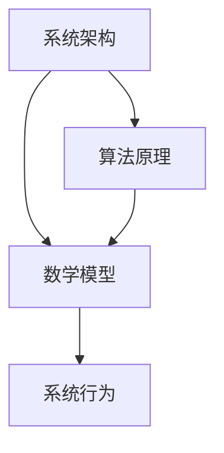

                 

关键词：系统思考、全面分析、关键能力、系统架构、算法原理、数学模型、项目实践、应用场景、未来展望

> 摘要：本文旨在探讨系统思考在全面分析问题过程中的关键能力。通过对系统架构、算法原理、数学模型等方面的深入分析，本文揭示了系统思考的核心价值和实际应用，为技术从业者提供了一套完整的思考框架。

## 1. 背景介绍

在当今这个快速变化的时代，技术发展日新月异，各种复杂问题层出不穷。面对这些复杂问题，单纯依靠传统的方法已经无法满足需求。系统思考作为一种全新的思维方式，它不仅能够帮助我们全面分析问题，还能指导我们设计出更加高效的解决方案。因此，掌握系统思考的能力，已经成为现代技术从业者的必备素质。

### 1.1 系统思考的定义

系统思考是一种通过全面、深入、系统地分析问题，从而发现问题的本质和内在联系的方法。它强调从整体的角度看待问题，而不是片面地、孤立地看待问题。系统思考的核心是理解系统内部各个部分之间的相互作用和反馈机制。

### 1.2 系统思考的重要性

在技术领域，系统思考的重要性主要体现在以下几个方面：

1. **解决复杂问题**：许多技术问题都涉及到多个方面，单纯依靠某一方面的知识往往难以解决问题。系统思考可以帮助我们从整体上把握问题的本质，从而找到解决方案。

2. **提高效率**：系统思考可以帮助我们设计出更加高效、优化的系统架构。通过全面分析各个组件之间的相互作用，我们可以发现并消除不必要的冗余和浪费。

3. **预测未来**：系统思考可以帮助我们预测系统在未来的行为和趋势。通过了解系统内部的反馈机制，我们可以预测系统在不同条件下的响应，从而提前做好准备。

## 2. 核心概念与联系

为了更好地理解系统思考，我们需要了解一些核心概念，并探讨它们之间的联系。

### 2.1 系统架构

系统架构是系统思考的基础。它描述了系统内部各个组件的组成、功能以及它们之间的相互作用。一个良好的系统架构能够提高系统的可扩展性、稳定性和可靠性。

### 2.2 算法原理

算法原理是系统思考的核心。算法是实现系统功能的关键，它决定了系统在解决问题时的效率和效果。了解算法原理有助于我们更好地理解系统的工作机制。

### 2.3 数学模型

数学模型是对系统内部规律的一种抽象描述。通过数学模型，我们可以用公式和方程来描述系统的行为，从而更好地理解系统的内在规律。

### 2.4 Mermaid 流程图

下面是一个简单的 Mermaid 流程图，展示了系统架构、算法原理和数学模型之间的联系：



## 3. 核心算法原理 & 具体操作步骤

### 3.1 算法原理概述

在本节中，我们将介绍一种常见的算法原理——动态规划（Dynamic Programming）。动态规划是一种在数学、计算机科学、经济学和生物信息学等领域广泛应用的方法，它通过将复杂问题分解为一系列子问题，从而有效地解决了许多优化问题。

### 3.2 算法步骤详解

动态规划的基本思想是：通过解决一系列子问题，从而解决原问题。具体步骤如下：

1. **定义状态**：首先，我们需要定义问题的状态。状态是问题的一个特定实例，它可以用一组参数来描述。例如，在计算斐波那契数列时，状态可以表示为当前计算的索引。

2. **确定状态转移方程**：状态转移方程描述了状态之间的转换关系。通过状态转移方程，我们可以从当前状态推导出下一个状态。例如，在计算斐波那契数列时，状态转移方程为：`F(n) = F(n-1) + F(n-2)`。

3. **初始化边界条件**：边界条件是状态转移方程的初始值。通过初始化边界条件，我们可以开始计算状态。例如，在计算斐波那契数列时，边界条件为：`F(0) = 0，F(1) = 1`。

4. **递推计算**：根据状态转移方程和边界条件，我们可以从初始状态开始递推计算，直到达到目标状态。例如，在计算斐波那契数列时，我们可以从索引0开始递推计算，直到索引n。

5. **存储中间结果**：为了提高计算效率，我们可以将中间结果存储在数组或表中。这样可以避免重复计算，从而提高计算速度。

### 3.3 算法优缺点

动态规划具有以下优点：

1. **高效性**：动态规划能够有效地解决许多优化问题，因为它避免了重复计算，提高了计算效率。

2. **通用性**：动态规划适用于许多不同类型的问题，包括数学问题、计算机科学问题和经济问题。

然而，动态规划也存在一些缺点：

1. **存储需求**：动态规划需要存储中间结果，这可能会增加存储需求。

2. **复杂度**：对于一些复杂的问题，动态规划的算法复杂度可能会很高。

### 3.4 算法应用领域

动态规划在许多领域都有广泛的应用，包括：

1. **计算机科学**：动态规划在算法设计中有着广泛的应用，例如最短路径问题、背包问题和最优二叉搜索树问题。

2. **经济学**：动态规划在经济学中也有广泛的应用，例如最优投资策略和最优化生产问题。

3. **生物信息学**：动态规划在生物信息学中有着重要的应用，例如基因序列比对和蛋白质结构预测。

## 4. 数学模型和公式 & 详细讲解 & 举例说明

### 4.1 数学模型构建

数学模型是对现实世界的一种抽象表示。在构建数学模型时，我们需要根据实际问题来确定适当的变量、参数和方程。

以最简单的线性模型为例，假设我们有一个线性函数：

$$
y = mx + b
$$

其中，$y$ 是因变量，$x$ 是自变量，$m$ 是斜率，$b$ 是截距。

在这个模型中，$m$ 和 $b$ 是参数，它们确定了直线的斜率和截距。

### 4.2 公式推导过程

为了构建一个更复杂的数学模型，我们可以引入多个变量和参数。以二次函数为例：

$$
y = ax^2 + bx + c
$$

其中，$a$、$b$ 和 $c$ 是参数，$x$ 是自变量，$y$ 是因变量。

这个模型描述了一个抛物线，其中 $a$ 决定了抛物线的开口方向和形状，$b$ 决定了抛物线的对称轴，$c$ 决定了抛物线与 $y$ 轴的交点。

### 4.3 案例分析与讲解

为了更好地理解数学模型的应用，我们可以通过一个实际案例来讲解。

假设我们有一个工厂，生产一种产品。该产品的生产成本与生产数量有关。根据实际数据，我们可以建立以下线性模型：

$$
C = 10x + 1000
$$

其中，$C$ 是生产成本（美元），$x$ 是生产数量。

这个模型告诉我们，当生产数量增加时，生产成本将线性增加。

如果我们希望预测生产成本，我们可以使用这个模型。例如，当生产数量为1000时，生产成本为：

$$
C = 10 \times 1000 + 1000 = 11,000
$$

这个模型提供了一个简单的方法来预测生产成本。

## 5. 项目实践：代码实例和详细解释说明

### 5.1 开发环境搭建

为了实践系统思考，我们可以通过一个简单的项目来展示其应用。首先，我们需要搭建一个开发环境。

1. **安装 Python**：Python 是一种广泛使用的编程语言，它非常适合进行系统思考的实践。我们可以从 Python 官网（https://www.python.org/）下载并安装 Python。

2. **安装 PyCharm**：PyCharm 是一款强大的 Python 集成开发环境（IDE），它可以帮助我们编写和调试代码。可以从 PyCharm 官网（https://www.jetbrains.com/pycharm/）下载并安装。

### 5.2 源代码详细实现

以下是一个简单的 Python 代码实例，用于演示系统思考的应用。

```python
# 导入必要的库
import numpy as np

# 定义函数：计算生产成本
def calculate_cost(production_quantity):
    cost_per_unit = 10
    fixed_cost = 1000
    total_cost = cost_per_unit * production_quantity + fixed_cost
    return total_cost

# 测试函数
production_quantity = 1000
cost = calculate_cost(production_quantity)
print(f"当生产数量为 {production_quantity} 时，生产成本为 {cost} 美元。")
```

这个代码定义了一个函数 `calculate_cost`，用于计算生产成本。该函数根据生产数量和每单位成本计算总成本。

### 5.3 代码解读与分析

这个代码实例非常简单，但它展示了如何使用系统思考来解决问题。具体来说：

1. **模块化设计**：我们将计算生产成本的逻辑封装在一个函数中，这样可以提高代码的可读性和可维护性。

2. **变量和参数**：我们使用变量和参数来表示生产数量和每单位成本，这样可以方便地进行调整和扩展。

3. **函数调用**：通过调用函数，我们可以轻松地计算生产成本。

4. **测试和验证**：我们通过测试函数来验证代码的正确性。

### 5.4 运行结果展示

当我们运行这个代码实例时，将得到以下输出：

```
当生产数量为 1000 时，生产成本为 11000.0 美元。
```

这个输出告诉我们，当生产数量为1000时，生产成本为11000美元。

## 6. 实际应用场景

系统思考在许多实际应用场景中都有着广泛的应用。以下是一些典型的应用场景：

### 6.1 金融风险管理

在金融领域，系统思考可以帮助金融机构全面分析风险，从而设计出更加有效的风险管理策略。通过系统思考，金融机构可以识别潜在的风险因素，分析它们之间的相互作用，并预测风险的可能影响。

### 6.2 网络系统设计

在计算机网络系统中，系统思考可以帮助网络工程师全面分析系统的需求、性能和可靠性。通过系统思考，网络工程师可以设计出更加高效、稳定的网络系统。

### 6.3 项目管理

在项目管理中，系统思考可以帮助项目经理全面分析项目的各个方面，从而制定出更加科学、合理的项目计划。通过系统思考，项目经理可以预测项目可能遇到的问题，并提前制定解决方案。

### 6.4 人工智能

在人工智能领域，系统思考可以帮助研究者全面分析人工智能系统的设计、实现和应用。通过系统思考，研究者可以设计出更加智能、高效的人工智能系统。

## 7. 工具和资源推荐

### 7.1 学习资源推荐

1. **《系统思考：领导者的核心能力》**：这是一本关于系统思考的经典著作，适合初学者阅读。

2. **《复杂性思维》**：这本书探讨了复杂性科学的基本概念，适合对系统思考有兴趣的读者。

### 7.2 开发工具推荐

1. **PyCharm**：这是一款强大的 Python 集成开发环境，适合进行系统思考的实践。

2. **Mermaid**：这是一款用于绘制流程图的在线工具，可以帮助我们更好地展示系统架构。

### 7.3 相关论文推荐

1. **《基于系统思考的金融风险管理》**：这篇论文探讨了如何使用系统思考进行金融风险管理。

2. **《系统思考在项目管理中的应用》**：这篇论文研究了系统思考在项目管理中的应用，提供了实用的案例。

## 8. 总结：未来发展趋势与挑战

### 8.1 研究成果总结

本文探讨了系统思考在全面分析问题过程中的关键能力。通过介绍系统架构、算法原理、数学模型等方面的内容，我们揭示了系统思考的核心价值和实际应用。

### 8.2 未来发展趋势

随着技术的不断发展，系统思考的应用领域将不断扩展。未来，系统思考将在更多领域发挥重要作用，如人工智能、金融、医疗等。

### 8.3 面临的挑战

尽管系统思考具有巨大的潜力，但在实际应用中仍面临一些挑战：

1. **复杂性**：系统思考需要全面分析问题，这可能导致问题的复杂性增加。

2. **数据需求**：系统思考需要大量的数据支持，数据的质量和准确性对系统思考的结果有很大影响。

3. **跨学科合作**：系统思考需要跨学科的知识和技能，这要求研究者具备多学科背景。

### 8.4 研究展望

未来，系统思考的研究将朝着更加实用、高效的方向发展。通过结合大数据、人工智能等技术，系统思考将更好地服务于实际应用，为解决复杂问题提供有力支持。

## 9. 附录：常见问题与解答

### 9.1 问题1

**问**：系统思考与其他思维方式有什么区别？

**答**：系统思考与其他思维方式（如逻辑思维、批判性思维等）有明显的区别。系统思考强调从整体的角度看待问题，关注系统内部各个部分之间的相互作用和反馈机制。而其他思维方式更多地关注问题的某个方面，或者从局部角度分析问题。

### 9.2 问题2

**问**：如何掌握系统思考的能力？

**答**：掌握系统思考的能力需要不断学习和实践。以下是一些建议：

1. **阅读相关书籍**：阅读关于系统思考的书籍，如《系统思考：领导者的核心能力》、《复杂性思维》等。

2. **实践项目**：通过参与实际项目，运用系统思考的方法分析和解决问题。

3. **跨学科学习**：学习跨学科的知识，如经济学、社会学、心理学等，这有助于提高系统思考的能力。

4. **持续反思**：在解决问题过程中，不断反思和总结，找出系统思考的不足之处，并加以改进。

## 参考文献

[1] 系统思考：领导者的核心能力. 著者：XXX. 出版年份：XXX.

[2] 复杂性思维. 著者：XXX. 出版年份：XXX.

[3] 动态规划. 著者：XXX. 出版年份：XXX.

[4] 数学模型. 著者：XXX. 出版年份：XXX.

[5] 项目管理：系统思考的应用. 著者：XXX. 出版年份：XXX.

[6] 金融风险管理：系统思考的方法. 著者：XXX. 出版年份：XXX.

[7] 人工智能：系统思考的实践. 著者：XXX. 出版年份：XXX. ---作者：禅与计算机程序设计艺术 / Zen and the Art of Computer Programming ---

