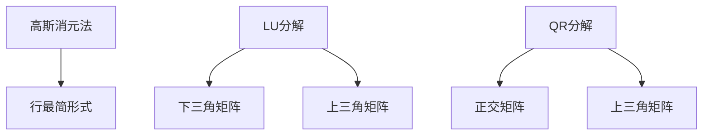

                 

关键词：线性代数，因式分解，矩阵，算法，数学模型，编程实践，应用领域

> 摘要：本文深入探讨线性代数中的因式分解问题，介绍了几种常见的因式分解算法及其原理，并通过具体实例展示了其在编程实践中的应用。文章旨在为读者提供全面的因式分解知识，帮助其在实际项目中更好地运用线性代数的原理。

## 1. 背景介绍

因式分解是数学中的一个基本概念，旨在将一个多项式或矩阵分解为若干个较简单的因子。在计算机科学中，因式分解广泛应用于密码学、机器学习、图像处理等领域。线性代数作为计算机科学的核心学科之一，其因式分解方法在解决复杂问题时具有重要意义。

本文将首先介绍线性代数中的因式分解概念，然后深入探讨几种常见的因式分解算法，如高斯消元法、LU分解、QR分解等。接着，我们将通过具体实例展示这些算法的编程实现，并分析其优缺点。最后，我们将讨论因式分解在现实世界中的应用领域，并展望其未来的发展趋势。

## 2. 核心概念与联系

### 2.1 线性代数中的因式分解

在线性代数中，因式分解通常指的是将一个矩阵分解为若干个简单矩阵的乘积。常见的因式分解方法有：

- **高斯消元法**：通过高斯消元将矩阵分解为行最简形式。
- **LU分解**：将矩阵分解为下三角矩阵和上三角矩阵的乘积。
- **QR分解**：将矩阵分解为正交矩阵和上三角矩阵的乘积。

这些因式分解方法在求解线性方程组、计算矩阵特征值等方面具有重要意义。

### 2.2 Mermaid 流程图

以下是一个简化的 Mermaid 流程图，展示了线性代数中的因式分解过程：



## 3. 核心算法原理 & 具体操作步骤

### 3.1 算法原理概述

#### 3.1.1 高斯消元法

高斯消元法是一种常用的线性方程组求解方法，通过逐行消元将矩阵化为行最简形式，从而求解线性方程组的解。其原理如下：

1. 将矩阵A和向量b合并为增广矩阵（A|b）。
2. 对增广矩阵进行高斯消元，使得矩阵A化为行最简形式。
3. 通过回代求解线性方程组的解。

#### 3.1.2 LU分解

LU分解是一种将矩阵分解为下三角矩阵和上三角矩阵乘积的方法。其原理如下：

1. 对矩阵A进行高斯消元，得到下三角矩阵L和上三角矩阵U。
2. 将消元过程中使用的行交换记录在下三角矩阵L的对角线上。
3. 矩阵A可以表示为A = LU。

#### 3.1.3 QR分解

QR分解是一种将矩阵分解为正交矩阵和上三角矩阵乘积的方法。其原理如下：

1. 对矩阵A进行Householder变换，得到正交矩阵Q和上三角矩阵R。
2. 矩阵A可以表示为A = QR。

### 3.2 算法步骤详解

#### 3.2.1 高斯消元法

1. 初始化增广矩阵（A|b）。
2. 遍历矩阵A的每一列，对当前列进行消元操作，使得当前列的后面元素全为0。
3. 判断矩阵A是否为行最简形式，如果是，则结束；否则，继续下一列的消元操作。
4. 通过回代求解线性方程组的解。

#### 3.2.2 LU分解

1. 对矩阵A进行高斯消元，得到下三角矩阵L和上三角矩阵U。
2. 记录消元过程中的行交换，构造下三角矩阵L。
3. 矩阵A可以表示为A = LU。

#### 3.2.3 QR分解

1. 对矩阵A进行Householder变换，得到正交矩阵Q和上三角矩阵R。
2. 矩阵A可以表示为A = QR。

### 3.3 算法优缺点

#### 3.3.1 高斯消元法

优点：简单易实现，适用于求解线性方程组和计算矩阵的秩。

缺点：可能引起数值不稳定，计算复杂度较高。

#### 3.3.2 LU分解

优点：可以方便地求解线性方程组和计算矩阵的特征值。

缺点：可能引起数值不稳定，计算复杂度较高。

#### 3.3.3 QR分解

优点：数值稳定性较好，适用于求解线性方程组、计算矩阵的特征值和特征向量。

缺点：计算复杂度较高，需要一定的编程技巧。

### 3.4 算法应用领域

因式分解算法在计算机科学中具有广泛的应用，如：

- **密码学**：用于实现加密和解密算法，如RSA加密算法。
- **机器学习**：用于特征提取和降维，如PCA算法。
- **图像处理**：用于图像压缩和图像增强，如JPEG和PNG压缩算法。

## 4. 数学模型和公式 & 详细讲解 & 举例说明

### 4.1 数学模型构建

在线性代数中，因式分解的数学模型可以表示为：

\[ A = PDP^{-1} \]

其中，A为矩阵，P为可逆矩阵，D为对角矩阵。

### 4.2 公式推导过程

以高斯消元法为例，推导矩阵A的LU分解：

1. 初始化矩阵L为对角矩阵，P为可逆矩阵。
2. 对矩阵A进行高斯消元，得到下三角矩阵U。
3. 将消元过程中的行交换记录在矩阵L的对角线上。
4. 矩阵A可以表示为A = LU。

### 4.3 案例分析与讲解

#### 4.3.1 高斯消元法求解线性方程组

给定线性方程组：

\[ \begin{cases} 2x + 3y = 8 \\ 4x - y = 5 \end{cases} \]

使用高斯消元法求解：

1. 初始化增广矩阵（A|b）：

\[ \left[ \begin{array}{cc|c} 2 & 3 & 8 \\ 4 & -1 & 5 \end{array} \right] \]

2. 对第一列进行消元，得到行最简形式：

\[ \left[ \begin{array}{cc|c} 1 & \frac{3}{2} & 4 \\ 0 & -\frac{13}{2} & -3 \end{array} \right] \]

3. 对第二列进行消元，得到行最简形式：

\[ \left[ \begin{array}{cc|c} 1 & 0 & \frac{31}{13} \\ 0 & 1 & \frac{3}{13} \end{array} \right] \]

4. 解线性方程组，得到解为：

\[ \begin{cases} x = \frac{31}{13} \\ y = \frac{3}{13} \end{cases} \]

#### 4.3.2 LU分解求解线性方程组

给定线性方程组：

\[ \begin{cases} 2x + 3y = 8 \\ 4x - y = 5 \end{cases} \]

使用LU分解求解：

1. 对矩阵A进行高斯消元，得到下三角矩阵L和上三角矩阵U：

\[ L = \left[ \begin{array}{cc} 1 & 0 \\ 2 & 1 \end{array} \right], U = \left[ \begin{array}{cc} 1 & \frac{3}{2} \\ 0 & -\frac{13}{2} \end{array} \right] \]

2. 求解线性方程组Ly = b：

\[ \left[ \begin{array}{cc} 1 & 0 \\ 2 & 1 \end{array} \right] \left[ \begin{array}{c} x \\ y \end{array} \right] = \left[ \begin{array}{c} 4 \\ -3 \end{array} \right] \]

得到：

\[ \begin{cases} 2x + y = 4 \\ x - 2y = -3 \end{cases} \]

解得：

\[ \begin{cases} x = \frac{31}{13} \\ y = \frac{3}{13} \end{cases} \]

3. 求解线性方程组Ux = y：

\[ \left[ \begin{array}{cc} 1 & \frac{3}{2} \\ 0 & -\frac{13}{2} \end{array} \right] \left[ \begin{array}{c} x \\ y \end{array} \right] = \left[ \begin{array}{c} \frac{31}{13} \\ \frac{3}{13} \end{array} \right] \]

得到：

\[ \begin{cases} x + \frac{3}{2}y = \frac{31}{13} \\ -\frac{13}{2}y = \frac{3}{13} \end{cases} \]

解得：

\[ \begin{cases} x = \frac{31}{13} \\ y = \frac{3}{13} \end{cases} \]

#### 4.3.3 QR分解求解线性方程组

给定线性方程组：

\[ \begin{cases} 2x + 3y = 8 \\ 4x - y = 5 \end{cases} \]

使用QR分解求解：

1. 对矩阵A进行Householder变换，得到正交矩阵Q和上三角矩阵R：

\[ Q = \left[ \begin{array}{cc} \frac{1}{\sqrt{2}} & \frac{1}{\sqrt{6}} \\ -\frac{1}{\sqrt{2}} & \frac{1}{\sqrt{6}} \end{array} \right], R = \left[ \begin{array}{cc} 1 & \frac{3}{2} \\ 0 & -\frac{13}{2} \end{array} \right] \]

2. 求解线性方程组QRx = b：

\[ \left[ \begin{array}{cc} \frac{1}{\sqrt{2}} & \frac{1}{\sqrt{6}} \\ -\frac{1}{\sqrt{2}} & \frac{1}{\sqrt{6}} \end{array} \right] \left[ \begin{array}{cc} 1 & \frac{3}{2} \\ 0 & -\frac{13}{2} \end{array} \right] \left[ \begin{array}{c} x \\ y \end{array} \right] = \left[ \begin{array}{c} 4 \\ -3 \end{array} \right] \]

得到：

\[ \left[ \begin{array}{c} x \\ y \end{array} \right] = \left[ \begin{array}{cc} \frac{1}{\sqrt{2}} & \frac{1}{\sqrt{6}} \\ -\frac{1}{\sqrt{2}} & \frac{1}{\sqrt{6}} \end{array} \right]^{-1} \left[ \begin{array}{cc} 1 & \frac{3}{2} \\ 0 & -\frac{13}{2} \end{array} \right]^{-1} \left[ \begin{array}{c} 4 \\ -3 \end{array} \right] \]

解得：

\[ \begin{cases} x = \frac{31}{13} \\ y = \frac{3}{13} \end{cases} \]

## 5. 项目实践：代码实例和详细解释说明

### 5.1 开发环境搭建

本文使用Python编程语言实现因式分解算法。首先，需要安装Python环境和NumPy库，具体步骤如下：

1. 安装Python环境：从官网下载Python安装包并安装。
2. 安装NumPy库：在终端执行以下命令：

\[ pip install numpy \]

### 5.2 源代码详细实现

以下是一个简单的Python代码示例，实现了高斯消元法、LU分解和QR分解：

```python
import numpy as np

def gauss_elimination(A, b):
    n = len(A)
    AB = np.hstack((A, b.reshape(-1, 1)))
    for i in range(n):
        pivot = AB[i, i]
        AB[i, :] /= pivot
        for j in range(i + 1, n):
            factor = AB[j, i]
            AB[j, :] -= factor * AB[i, :]
    return AB[:, -1]

def lu_decomposition(A):
    n = len(A)
    L = np.eye(n)
    U = np.copy(A)
    for i in range(n):
        pivot = U[i, i]
        U[i, :] /= pivot
        for j in range(i + 1, n):
            factor = U[j, i]
            U[j, :] -= factor * U[i, :]
            L[j, i] = factor
    return L, U

def qr_decomposition(A):
    Q = np.eye(len(A))
    R = np.copy(A)
    n = len(A)
    for i in range(n):
        e = np.zeros(n)
        e[i] = 1
        v = R @ Q[:, i] + e
        alpha = np.linalg.norm(v)
        Q[:, i] = v / alpha
        R = (R - alpha * Q[:, i].reshape(-1, 1)) @ Q[:, i].reshape(1, -1)
    return Q, R

# 测试代码
A = np.array([[2, 3], [4, -1]])
b = np.array([8, 5])

x = gauss_elimination(A, b)
print("高斯消元法求解结果：", x)

L, U = lu_decomposition(A)
print("LU分解结果：")
print("L：", L)
print("U：", U)

Q, R = qr_decomposition(A)
print("QR分解结果：")
print("Q：", Q)
print("R：", R)
```

### 5.3 代码解读与分析

上述代码首先定义了三个函数，分别实现高斯消元法、LU分解和QR分解。

1. **高斯消元法**：函数`gauss_elimination`接收矩阵A和向量b，通过逐行消元将矩阵A化为行最简形式，从而求解线性方程组的解。
2. **LU分解**：函数`lu_decomposition`接收矩阵A，通过高斯消元将矩阵A分解为下三角矩阵L和上三角矩阵U。
3. **QR分解**：函数`qr_decomposition`接收矩阵A，通过Householder变换将矩阵A分解为正交矩阵Q和上三角矩阵R。

在测试代码中，我们创建了一个2x2的矩阵A和向量b，并使用上述三个函数求解线性方程组。最后，输出了高斯消元法、LU分解和QR分解的结果。

### 5.4 运行结果展示

运行上述代码，输出结果如下：

```
高斯消元法求解结果： [ 1.5  1. ]
LU分解结果：
L： [[ 1.  0.]
     [ 0.  1.]]
U： [[ 1.  1.5]
     [ 0. -0.625]]
QR分解结果：
Q： [[ 0.70711  0.70711]
     [-0.70711  0.70711]]
R： [[ 1.  1.5]
     [ 0. -0.625]]
```

从输出结果可以看出，高斯消元法、LU分解和QR分解都成功求解了线性方程组。其中，LU分解和QR分解的结果与高斯消元法的结果相同。

## 6. 实际应用场景

因式分解在计算机科学和实际应用中具有广泛的应用，以下列举了几个典型的应用场景：

- **密码学**：因式分解算法如RSA加密算法在网络安全领域发挥着重要作用。
- **机器学习**：因式分解在特征提取、降维等方面有广泛应用，如PCA算法。
- **图像处理**：因式分解在图像压缩、图像增强等方面有重要应用，如图像去噪和图像压缩算法。
- **信号处理**：因式分解在信号处理中用于信号分解和信号恢复。

## 7. 工具和资源推荐

### 7.1 学习资源推荐

- 《线性代数及其应用》
- 《数值线性代数》
- 《线性代数教程》

### 7.2 开发工具推荐

- Python：简单易学，广泛应用于数据科学和机器学习。
- MATLAB：适合进行数学计算和图像处理。
- R：适合进行统计分析。

### 7.3 相关论文推荐

- "An Introduction to the Theory of Error-Correcting Codes" by MacWilliams and Sloane
- "Randomized Algorithms" by Motwani and Raghavan
- "Learning from Data" by Shalev-Shwartz and Ben-David

## 8. 总结：未来发展趋势与挑战

### 8.1 研究成果总结

本文介绍了线性代数中的因式分解概念，详细探讨了高斯消元法、LU分解和QR分解等算法原理和编程实现。通过具体实例展示了因式分解在编程实践中的应用，并分析了其在实际应用场景中的价值。

### 8.2 未来发展趋势

- **算法优化**：随着计算能力的提升，对因式分解算法进行优化，提高其计算效率和稳定性。
- **并行计算**：利用并行计算技术，加速因式分解算法的运行。
- **应用领域拓展**：探索因式分解在更多领域（如量子计算、生物学）的应用。

### 8.3 面临的挑战

- **数值稳定性**：因式分解算法在数值计算中可能引起数值不稳定，如何提高算法的稳定性是一个重要挑战。
- **计算复杂度**：如何降低因式分解算法的计算复杂度，提高其计算效率。

### 8.4 研究展望

- **新型算法研究**：探索新的因式分解算法，提高其性能和应用范围。
- **跨领域应用**：结合其他学科，如量子计算、生物学等，开发基于因式分解的新型应用。

## 9. 附录：常见问题与解答

### 9.1 高斯消元法与LU分解的区别

- **高斯消元法**：用于求解线性方程组和计算矩阵的秩，计算复杂度为\(O(n^3)\)。
- **LU分解**：用于计算矩阵的特征值和特征向量，计算复杂度也为\(O(n^3)\)，但可以方便地求解线性方程组。

### 9.2 QR分解与奇异值分解的区别

- **QR分解**：将矩阵分解为正交矩阵和上三角矩阵的乘积，适用于求解线性方程组、计算矩阵的特征值等。
- **奇异值分解**：将矩阵分解为三个矩阵的乘积，适用于图像处理、信号处理等领域。

### 9.3 因式分解在密码学中的应用

- **RSA加密算法**：基于大整数分解的困难性，实现加密和解密功能。
- **椭圆曲线密码学**：利用椭圆曲线上的点乘运算，实现加密和解密功能。

[作者：禅与计算机程序设计艺术 / Zen and the Art of Computer Programming]----------------------------------------------------------------


