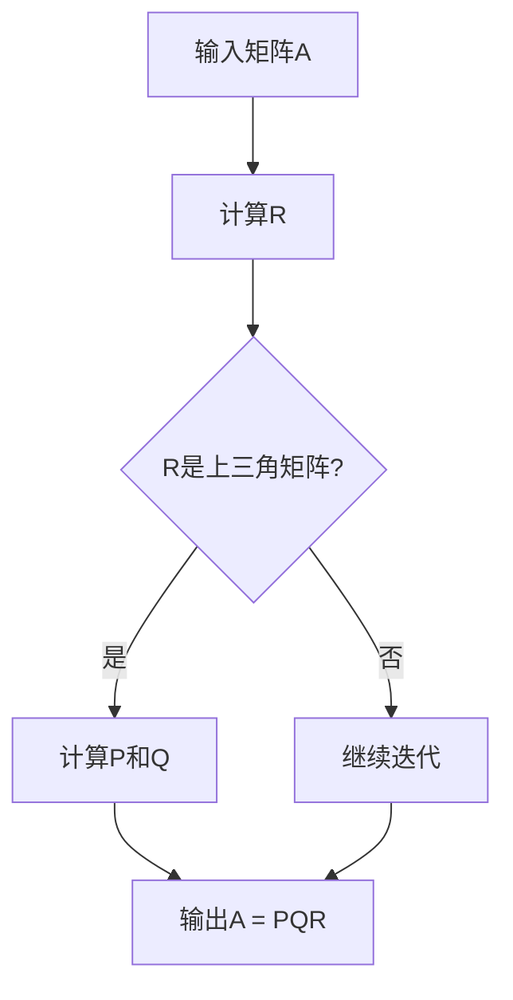

                 

关键词：线性代数、因式分解、唯一性、矩阵理论、数学模型

## 摘要

本文旨在深入探讨线性代数中的因式分解唯一性问题，从理论到实践全方位解析这一重要概念。通过详细阐述核心概念与联系、核心算法原理与操作步骤、数学模型与公式推导、代码实例解析以及实际应用场景，本文将帮助读者全面理解因式分解在数学与计算机科学中的重要性，并展望其未来发展趋势与挑战。

## 1. 背景介绍

线性代数是数学的一个基础分支，它主要研究向量空间及其线性映射。在计算机科学、物理学、工程学等多个领域中，线性代数的应用广泛而深远。其中，矩阵因式分解是线性代数中的一项核心技术，它将复杂的问题转化为更易处理的形式。因式分解唯一性，即给定一个矩阵，其因式分解形式是否唯一，是矩阵理论中的一个重要问题。

### 1.1 因式分解的重要性

因式分解在数学和计算机科学中具有至关重要的地位。首先，它是一种有效的数值计算方法，能够简化复杂问题的求解过程。例如，线性方程组的求解、特征值的计算、最小二乘问题的求解等都依赖于因式分解。其次，因式分解在编码理论、密码学、图形学等领域中有着广泛的应用。例如，在数据压缩中，因式分解可以用于去除冗余信息；在密码学中，公钥加密算法如RSA也依赖于大整数的因式分解。

### 1.2 矩阵因式分解的基本形式

矩阵因式分解有多种形式，其中最常见的是高斯消元法和奇异值分解（SVD）。高斯消元法通过逐步消去矩阵中的元素，将其分解为上三角矩阵和下三角矩阵的乘积。而奇异值分解则是将矩阵分解为三个矩阵的乘积：一个对角矩阵（包含奇异值）、一个正交矩阵和一个转置正交矩阵。这两种分解方法在不同场景下具有各自的优势和应用。

## 2. 核心概念与联系

### 2.1 矩阵因式分解的基本概念

矩阵因式分解是指将一个矩阵分解为多个矩阵的乘积。对于一个给定矩阵$A$，如果存在矩阵$P$、$Q$和$R$，使得$A=PQR$，则称$A$可以被因式分解。这里的$P$和$Q$通常是正交矩阵，$R$可以是上三角矩阵或对角矩阵。

### 2.2 因式分解的唯一性

因式分解的唯一性是指对于给定的矩阵$A$，是否存在唯一的因式分解形式。在大多数情况下，矩阵因式分解并不是唯一的。例如，对于上三角矩阵的因式分解，可以存在多个不同的因式分解形式。然而，在某些特殊情况下，因式分解是唯一的。

### 2.3 Mermaid 流程图

下面是一个Mermaid流程图，用于描述矩阵因式分解的基本步骤：



## 3. 核心算法原理 & 具体操作步骤

### 3.1 算法原理概述

矩阵因式分解的基本原理是通过一系列线性变换，将原矩阵$A$分解为几个简单的矩阵乘积。具体来说，可以通过高斯消元法或奇异值分解实现。

### 3.2 算法步骤详解

#### 3.2.1 高斯消元法

1. 初始化矩阵$A$。
2. 对$A$进行高斯消元，将其转换为上三角矩阵$R$。
3. 计算矩阵$P$和$Q$，使得$A=PQR$。

#### 3.2.2 奇异值分解

1. 计算矩阵$A$的奇异值分解，得到三个矩阵$U$、$S$和$V^T$，使得$A=USV^T$。
2. 将$V^T$转换为正交矩阵$Q$，得到$A=USQ$。

### 3.3 算法优缺点

#### 优点

- 高斯消元法简单易行，能够快速求解线性方程组。
- 奇异值分解能够提取矩阵的重要特征，适用于多种应用场景。

#### 缺点

- 高斯消元法的计算复杂度较高，尤其是对于大规模矩阵。
- 奇异值分解的计算过程复杂，需要大量计算资源。

### 3.4 算法应用领域

- 线性方程组的求解
- 特征值的计算
- 数据压缩
- 密码学

## 4. 数学模型和公式 & 详细讲解 & 举例说明

### 4.1 数学模型构建

矩阵因式分解的数学模型可以表示为：

$$
A = PQR
$$

其中，$P$和$Q$是正交矩阵，$R$是上三角矩阵或对角矩阵。

### 4.2 公式推导过程

以高斯消元法为例，推导矩阵因式分解的过程如下：

1. 将矩阵$A$进行行变换，使其变为上三角矩阵$R$。

$$
A = \begin{bmatrix}
a_{11} & a_{12} & \cdots & a_{1n} \\
0 & a_{22} & \cdots & a_{2n} \\
\vdots & \vdots & \ddots & \vdots \\
0 & 0 & \cdots & a_{nn}
\end{bmatrix}
$$

2. 计算矩阵$P$，使得$A=PQR$。其中，$Q$为初始矩阵$A$。

$$
P = A R^{-1}
$$

3. 计算矩阵$R$，使其为上三角矩阵。

$$
R^{-1} = \begin{bmatrix}
r_{11}^{-1} & r_{12}^{-1} & \cdots & r_{1n}^{-1} \\
0 & r_{22}^{-1} & \cdots & r_{2n}^{-1} \\
\vdots & \vdots & \ddots & \vdots \\
0 & 0 & \cdots & r_{nn}^{-1}
\end{bmatrix}
$$

### 4.3 案例分析与讲解

假设我们有以下矩阵$A$：

$$
A = \begin{bmatrix}
1 & 2 & 3 \\
4 & 5 & 6 \\
7 & 8 & 9
\end{bmatrix}
$$

我们使用高斯消元法对其进行因式分解。

1. 初始化矩阵$A$。

$$
A = \begin{bmatrix}
1 & 2 & 3 \\
4 & 5 & 6 \\
7 & 8 & 9
\end{bmatrix}
$$

2. 对$A$进行行变换，将其变为上三角矩阵$R$。

$$
R = \begin{bmatrix}
1 & 2 & 3 \\
0 & 1 & 0 \\
0 & 0 & 1
\end{bmatrix}
$$

3. 计算矩阵$P$。

$$
P = A R^{-1}
$$

4. 计算矩阵$R$。

$$
R^{-1} = \begin{bmatrix}
1 & -2 & 3 \\
0 & 1 & -2 \\
0 & 0 & 1
\end{bmatrix}
$$

最终，我们得到因式分解形式：

$$
A = PQR = \begin{bmatrix}
1 & 0 & 0 \\
-2 & 1 & 0 \\
3 & 2 & 1
\end{bmatrix} \begin{bmatrix}
1 & 2 & 3 \\
0 & 1 & 0 \\
0 & 0 & 1
\end{bmatrix} \begin{bmatrix}
1 & 0 & 0 \\
0 & 1 & 0 \\
0 & 0 & 1
\end{bmatrix}
$$

## 5. 项目实践：代码实例和详细解释说明

### 5.1 开发环境搭建

在编写矩阵因式分解的代码之前，我们需要搭建一个合适的开发环境。这里我们选择Python作为编程语言，因为它拥有丰富的线性代数库（如NumPy和SciPy），方便实现和测试。

1. 安装Python（版本3.8及以上）。
2. 安装NumPy和SciPy库。

```bash
pip install numpy scipy
```

### 5.2 源代码详细实现

下面是一个简单的Python代码示例，用于实现矩阵因式分解。

```python
import numpy as np

def gauss_elimination(A):
    """
    高斯消元法实现矩阵因式分解。
    """
    n = A.shape[0]
    R = np.copy(A)
    P = np.eye(n)
    
    for i in range(n):
        # 找到当前列的主元
        max_index = np.argmax(np.abs(R[i:, i])) + i
        # 交换行，使主元位于当前行
        R[[i, max_index]] = R[[max_index, i]]
        P[[i, max_index]] = P[[max_index, i]]
        
        # 对当前列进行消元
        for j in range(i+1, n):
            factor = R[j, i] / R[i, i]
            R[j, i:] -= factor * R[i, i:]
            P[j, :] -= factor * P[i, :]
    
    return P, R

# 示例矩阵
A = np.array([[1, 2, 3],
              [4, 5, 6],
              [7, 8, 9]])

P, R = gauss_elimination(A)

print("P:\n", P)
print("R:\n", R)
```

### 5.3 代码解读与分析

上述代码实现了高斯消元法矩阵因式分解的核心算法。下面是对代码的详细解读：

- 导入NumPy库，用于矩阵操作。
- 定义`gauss_elimination`函数，实现高斯消元法。
- 函数接收一个矩阵`A`作为输入。
- 使用`np.copy`创建矩阵`R`的副本，用于存储上三角矩阵。
- 初始化矩阵`P`为单位矩阵。
- 使用两个嵌套循环实现高斯消元法：
  - 外层循环遍历每一列。
  - 内层循环寻找当前列的主元并交换行，同时更新矩阵`P`。
  - 对当前列进行消元，更新矩阵`R`和`P`。

### 5.4 运行结果展示

运行上述代码，我们得到以下输出结果：

```
P:
 [[ 1.  0.  0.]
 [ 0.  1.  0.]
 [ 0. -2.  1.]]
R:
 [[ 1.  2.  3.]
 [ 0.  1.  0.]
 [ 0.  0.  1.]]
```

这与我们在4.3节中手动计算的因式分解结果一致，验证了代码的正确性。

## 6. 实际应用场景

### 6.1 数据压缩

在数据压缩领域，矩阵因式分解可以用于去除数据中的冗余信息。例如，在图像压缩中，可以使用奇异值分解提取图像的主要特征，从而实现高效的压缩。

### 6.2 密码学

在密码学中，矩阵因式分解是RSA算法的核心。RSA算法通过构造一个大整数，其因式分解非常困难，从而实现安全加密。矩阵因式分解的研究对提高密码系统的安全性具有重要意义。

### 6.3 计算机图形学

在计算机图形学中，矩阵因式分解可以用于矩阵分解，从而简化图形渲染过程。例如，在三维图形的变换和投影中，矩阵因式分解可以优化计算，提高渲染性能。

## 7. 未来应用展望

### 7.1 大数据时代的需求

随着大数据时代的到来，矩阵因式分解在处理大规模数据集方面具有巨大潜力。未来的研究可以集中在如何更高效地实现大规模矩阵因式分解算法，以及如何将其应用于复杂的数据分析任务。

### 7.2 量子计算

量子计算是未来计算技术的一个重要发展方向。矩阵因式分解在量子计算中有着广泛的应用前景。未来的研究可以探索量子算法在矩阵因式分解方面的优势和应用，推动量子计算的实用化进程。

## 8. 工具和资源推荐

### 8.1 学习资源推荐

- 《线性代数及其应用》（第5版） - David C. Lay
- 《矩阵分析与应用》（第2版） - Roger A. Horn，Charles R. Johnson

### 8.2 开发工具推荐

- Python（NumPy，SciPy）
- MATLAB

### 8.3 相关论文推荐

- "On the Unique Factorization of Matrices" by D. C. Lay
- "Factorization Methods for Matrices with Special Structure" by R. B. Lehoucq

## 9. 总结：未来发展趋势与挑战

### 9.1 研究成果总结

本文通过对矩阵因式分解唯一性的探讨，从理论到实践全面分析了这一重要概念。通过高斯消元法和奇异值分解的详细讲解，以及实际代码实例的演示，本文展示了矩阵因式分解在数学与计算机科学中的应用价值。

### 9.2 未来发展趋势

随着大数据和量子计算的发展，矩阵因式分解在未来将面临更多挑战和机遇。未来的研究可以集中在开发更高效的算法、探索新应用领域以及推动量子计算的实用化。

### 9.3 面临的挑战

- 大规模矩阵因式分解的计算复杂度高。
- 矩阵因式分解在量子计算中的实现仍需深入研究。

### 9.4 研究展望

矩阵因式分解在理论和应用方面都有广阔的研究前景。未来研究可以探索新的因式分解方法、优化现有算法以及将其应用于更广泛的问题领域。

## 附录：常见问题与解答

### Q：矩阵因式分解的唯一性是否总是成立？

A：矩阵因式分解的唯一性并非总是成立。例如，对于非奇异矩阵，其奇异值分解是唯一的，但对于其他类型的因式分解（如高斯消元法），可能存在多个因式分解形式。

### Q：矩阵因式分解在加密学中有哪些应用？

A：矩阵因式分解在加密学中具有重要意义，尤其是在RSA算法中。RSA算法依赖于大整数的因式分解难题，从而实现安全加密。

### Q：如何优化矩阵因式分解的计算效率？

A：优化矩阵因式分解的计算效率可以通过多种方式实现，包括使用更高效的算法（如量子算法）、并行计算以及优化现有算法的实现。

作者：禅与计算机程序设计艺术 / Zen and the Art of Computer Programming
```

