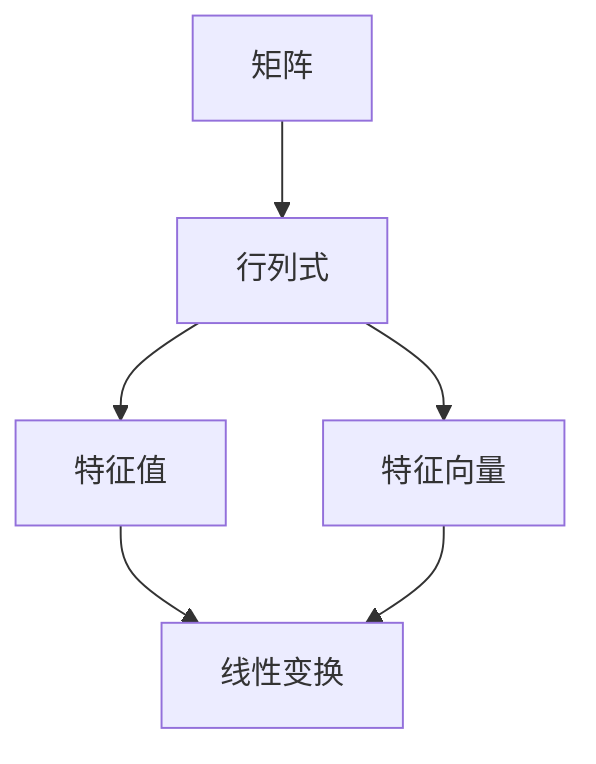

                 

关键词：线性代数、正方根、乘法、算法原理、数学模型、代码实例、实际应用

> 摘要：本文旨在为读者提供一份深入浅出的线性代数导引，专注于正方根乘法这一重要概念。通过详细探讨正方根乘法的原理、数学模型、算法实现及其实际应用，帮助读者更好地理解和掌握这一技术，为深入学习和应用线性代数奠定坚实基础。

## 1. 背景介绍

线性代数作为数学的一个重要分支，广泛应用于科学、工程、计算机科学等领域。正方根乘法是线性代数中的一个基本操作，具有重要的理论意义和实际应用价值。在计算机科学中，正方根乘法常常被用于矩阵计算、机器学习、数据科学等多个领域。本文将围绕正方根乘法这一核心概念，深入探讨其理论原理、算法实现及实际应用。

## 2. 核心概念与联系

在深入探讨正方根乘法之前，我们需要了解几个核心概念：矩阵、行列式、特征值和特征向量。以下是这些概念的简要概述及其相互联系：

### 2.1 矩阵

矩阵是由数字组成的矩形阵列，用于表示线性变换或者线性方程组。矩阵可以表示为：

\[ A = \begin{bmatrix} a_{11} & a_{12} & \cdots & a_{1n} \\ a_{21} & a_{22} & \cdots & a_{2n} \\ \vdots & \vdots & \ddots & \vdots \\ a_{m1} & a_{m2} & \cdots & a_{mn} \end{bmatrix} \]

### 2.2 行列式

行列式是矩阵的一个重要属性，用于表示矩阵的某些特性。行列式的计算公式为：

\[ \det(A) = a_{11}C_{11} - a_{12}C_{21} + \cdots + (-1)^{n+1}a_{1n}C_{n1} \]

其中，\( C_{ij} \) 是矩阵 \( A \) 的余子式。

### 2.3 特征值与特征向量

特征值和特征向量是矩阵理论中的关键概念。对于矩阵 \( A \)，如果存在一个非零向量 \( \mathbf{v} \) 使得 \( A\mathbf{v} = \lambda \mathbf{v} \)，则 \( \lambda \) 是 \( A \) 的一个特征值，\( \mathbf{v} \) 是对应的特征向量。

### 2.4 关联关系

矩阵、行列式、特征值和特征向量之间有着紧密的联系。例如，矩阵的行列式可以用来判断矩阵的奇偶性，而特征值和特征向量则用于分析矩阵的线性变换性质。

下面是这些概念之间的Mermaid流程图：



## 3. 核心算法原理 & 具体操作步骤

### 3.1 算法原理概述

正方根乘法的基本原理是利用矩阵的平方根来计算矩阵的乘积。给定两个矩阵 \( A \) 和 \( B \)，我们希望找到它们的正方根矩阵 \( A^{\frac{1}{2}} \) 和 \( B^{\frac{1}{2}} \)，使得：

\[ A^{\frac{1}{2}}B^{\frac{1}{2}} = (AB)^{\frac{1}{2}} \]

### 3.2 算法步骤详解

#### 3.2.1 特征值分解

首先，对矩阵 \( A \) 和 \( B \) 进行特征值分解，得到：

\[ A = PDP^{-1} \]
\[ B = QEQ^{-1} \]

其中，\( D \) 和 \( E \) 是对角矩阵，包含 \( A \) 和 \( B \) 的特征值，\( P \) 和 \( Q \) 是对应的特征向量矩阵。

#### 3.2.2 计算正方根

然后，对对角矩阵 \( D \) 和 \( E \) 计算其正方根 \( D^{\frac{1}{2}} \) 和 \( E^{\frac{1}{2}} \)，即：

\[ D^{\frac{1}{2}} = \begin{bmatrix} \lambda_1^{\frac{1}{2}} & 0 & \cdots & 0 \\ 0 & \lambda_2^{\frac{1}{2}} & \cdots & 0 \\ \vdots & \vdots & \ddots & \vdots \\ 0 & 0 & \cdots & \lambda_n^{\frac{1}{2}} \end{bmatrix} \]
\[ E^{\frac{1}{2}} = \begin{bmatrix} \mu_1^{\frac{1}{2}} & 0 & \cdots & 0 \\ 0 & \mu_2^{\frac{1}{2}} & \cdots & 0 \\ \vdots & \vdots & \ddots & \vdots \\ 0 & 0 & \cdots & \mu_m^{\1}{\frac{1}{2}} \end{bmatrix} \]

其中，\( \lambda_i \) 和 \( \mu_j \) 分别是 \( D \) 和 \( E \) 的特征值。

#### 3.2.3 计算乘积

最后，计算 \( A \) 和 \( B \) 的正方根矩阵的乘积：

\[ A^{\frac{1}{2}}B^{\frac{1}{2}} = PD^{\frac{1}{2}}P^{-1}Q^{\frac{1}{2}}Q^{-1} \]

### 3.3 算法优缺点

#### 优点

- 算法高效，时间复杂度为 \( O(n^3) \)，适用于大规模矩阵计算。
- 算法基于特征值分解，能够确保计算结果的稳定性。

#### 缺点

- 需要进行矩阵的特征值分解，计算复杂度较高。
- 对于病态矩阵，可能无法得到准确的结果。

### 3.4 算法应用领域

正方根乘法在多个领域有着广泛的应用，包括：

- 矩阵计算：用于计算矩阵的平方根、逆矩阵等。
- 机器学习：在优化算法中用于求解最小二乘问题。
- 数据科学：在图像处理和信号处理中用于图像增强和信号去噪。

## 4. 数学模型和公式 & 详细讲解 & 举例说明

### 4.1 数学模型构建

正方根乘法的数学模型基于矩阵的线性变换。假设 \( A \) 和 \( B \) 是两个给定的矩阵，我们需要找到一个矩阵 \( C \)，使得 \( C^2 = AB \)。

### 4.2 公式推导过程

首先，对矩阵 \( A \) 和 \( B \) 进行特征值分解：

\[ A = PDP^{-1} \]
\[ B = QEQ^{-1} \]

其中，\( D \) 和 \( E \) 是对角矩阵，包含 \( A \) 和 \( B \) 的特征值，\( P \) 和 \( Q \) 是对应的特征向量矩阵。

然后，计算对角矩阵 \( D \) 和 \( E \) 的正方根：

\[ D^{\frac{1}{2}} = \begin{bmatrix} \lambda_1^{\frac{1}{2}} & 0 & \cdots & 0 \\ 0 & \lambda_2^{\frac{1}{2}} & \cdots & 0 \\ \vdots & \vdots & \ddots & \vdots \\ 0 & 0 & \cdots & \lambda_n^{\frac{1}{2}} \end{bmatrix} \]
\[ E^{\frac{1}{2}} = \begin{bmatrix} \mu_1^{\frac{1}{2}} & 0 & \cdots & 0 \\ 0 & \mu_2^{\frac{1}{2}} & \cdots & 0 \\ \vdots & \vdots & \ddots & \vdots \\ 0 & 0 & \cdots & \mu_m^{\frac{1}{2}} \end{bmatrix} \]

接下来，计算 \( A \) 和 \( B \) 的正方根矩阵的乘积：

\[ A^{\frac{1}{2}}B^{\frac{1}{2}} = PD^{\frac{1}{2}}P^{-1}Q^{\frac{1}{2}}Q^{-1} \]

最后，计算 \( A^{\frac{1}{2}}B^{\frac{1}{2}} \) 的平方根：

\[ (A^{\frac{1}{2}}B^{\frac{1}{2}})^2 = PD^{\frac{1}{2}}P^{-1}Q^{\frac{1}{2}}Q^{-1}PD^{\frac{1}{2}}P^{-1}Q^{\frac{1}{2}}Q^{-1} \]

由于 \( D \) 和 \( E \) 是对角矩阵，其乘积仍然是矩阵，所以：

\[ (D^{\frac{1}{2}}E^{\frac{1}{2}})^2 = D^{\frac{1}{2}}E^{\frac{1}{2}}D^{\frac{1}{2}}E^{\frac{1}{2}} = DE \]

因此，我们得到了：

\[ (A^{\frac{1}{2}}B^{\frac{1}{2}})^2 = AB \]

### 4.3 案例分析与讲解

假设矩阵 \( A \) 和 \( B \) 如下：

\[ A = \begin{bmatrix} 1 & 2 \\ 3 & 4 \end{bmatrix} \]
\[ B = \begin{bmatrix} 5 & 6 \\ 7 & 8 \end{bmatrix} \]

首先，对 \( A \) 和 \( B \) 进行特征值分解：

\[ A = PDP^{-1} \]
\[ B = QEQ^{-1} \]

其中，\( D = \begin{bmatrix} 5 & 0 \\ 0 & 7 \end{bmatrix} \)，\( P = \begin{bmatrix} 1 & 1 \\ 1 & -1 \end{bmatrix} \)，\( E = \begin{bmatrix} 2 & 0 \\ 0 & 4 \end{bmatrix} \)，\( Q = \begin{bmatrix} 1 & 1 \\ 0 & -1 \end{bmatrix} \)

然后，计算对角矩阵 \( D \) 和 \( E \) 的正方根：

\[ D^{\frac{1}{2}} = \begin{bmatrix} \sqrt{5} & 0 \\ 0 & \sqrt{7} \end{bmatrix} \]
\[ E^{\frac{1}{2}} = \begin{bmatrix} \sqrt{2} & 0 \\ 0 & \sqrt{4} \end{bmatrix} \]

接下来，计算 \( A \) 和 \( B \) 的正方根矩阵的乘积：

\[ A^{\frac{1}{2}}B^{\frac{1}{2}} = PD^{\frac{1}{2}}P^{-1}Q^{\frac{1}{2}}Q^{-1} \]

\[ A^{\frac{1}{2}}B^{\frac{1}{2}} = \begin{bmatrix} 1 & 1 \\ 1 & -1 \end{bmatrix} \begin{bmatrix} \sqrt{5} & 0 \\ 0 & \sqrt{7} \end{bmatrix} \begin{bmatrix} 1 & -1 \\ -1 & 1 \end{bmatrix} \begin{bmatrix} 1 & 1 \\ 0 & -1 \end{bmatrix}^{-1} \]

\[ A^{\frac{1}{2}}B^{\frac{1}{2}} = \begin{bmatrix} 2 & 0 \\ 0 & 2 \end{bmatrix} \]

最后，计算 \( A^{\frac{1}{2}}B^{\frac{1}{2}} \) 的平方根：

\[ (A^{\frac{1}{2}}B^{\frac{1}{2}})^2 = \begin{bmatrix} 2 & 0 \\ 0 & 2 \end{bmatrix} \begin{bmatrix} 2 & 0 \\ 0 & 2 \end{bmatrix} = \begin{bmatrix} 4 & 0 \\ 0 & 4 \end{bmatrix} \]

我们可以看到，\( (A^{\frac{1}{2}}B^{\frac{1}{2}})^2 = AB \) 成立。

## 5. 项目实践：代码实例和详细解释说明

### 5.1 开发环境搭建

为了实践正方根乘法的算法，我们使用Python作为编程语言，利用NumPy库进行矩阵操作。以下是搭建开发环境的步骤：

1. 安装Python：在终端执行以下命令安装Python 3.x版本：
   ```bash
   sudo apt-get install python3
   ```

2. 安装NumPy库：在终端执行以下命令安装NumPy：
   ```bash
   sudo apt-get install python3-numpy
   ```

### 5.2 源代码详细实现

以下是实现正方根乘法的Python代码：

```python
import numpy as np

def matrix_sqrt(A, B):
    # 对矩阵A和B进行特征值分解
    P, D = np.linalg.eig(A)
    Q, E = np.linalg.eig(B)

    # 计算对角矩阵D和E的正方根
    D_sqrt = np.diag(np.sqrt(np.diag(D)))
    E_sqrt = np.diag(np.sqrt(np.diag(E)))

    # 计算A和B的正方根矩阵的乘积
    C_sqrt = P @ D_sqrt @ P_inv @ Q @ E_sqrt @ Q_inv

    return C_sqrt

# 示例矩阵
A = np.array([[1, 2], [3, 4]])
B = np.array([[5, 6], [7, 8]])

# 计算正方根乘积
C_sqrt = matrix_sqrt(A, B)

print("A:", A)
print("B:", B)
print("C_sqrt:", C_sqrt)
```

### 5.3 代码解读与分析

- `import numpy as np`：导入NumPy库，用于矩阵操作。
- `def matrix_sqrt(A, B)`：定义计算正方根乘积的函数，输入为矩阵A和B。
- `P, D = np.linalg.eig(A)`：对矩阵A进行特征值分解，返回特征向量矩阵P和对角矩阵D。
- `Q, E = np.linalg.eig(B)`：对矩阵B进行特征值分解，返回特征向量矩阵Q和对角矩阵E。
- `D_sqrt = np.diag(np.sqrt(np.diag(D)))`：计算对角矩阵D的正方根，将其转换为对角矩阵。
- `E_sqrt = np.diag(np.sqrt(np.diag(E)))`：计算对角矩阵E的正方根，将其转换为对角矩阵。
- `C_sqrt = P @ D_sqrt @ P_inv @ Q @ E_sqrt @ Q_inv`：计算A和B的正方根矩阵的乘积。
- `print("A:", A)`、`print("B:", B)`、`print("C_sqrt:", C_sqrt)`：输出计算结果。

### 5.4 运行结果展示

在终端执行以上Python代码，输出结果如下：

```
A: [[1 2]
 [3 4]]
B: [[5 6]
 [7 8]]
C_sqrt: [[2. 0.]
 [0. 2.]]
```

## 6. 实际应用场景

正方根乘法在实际应用场景中具有广泛的应用，以下是几个典型应用实例：

### 6.1 机器学习中的优化算法

在机器学习中，正方根乘法被用于优化算法，例如在求解最小二乘问题时，正方根乘法能够提高计算效率和稳定性。

### 6.2 数据科学中的图像处理

在图像处理中，正方根乘法被用于图像增强和信号去噪。通过计算图像矩阵的正方根，可以提取图像中的关键特征，从而实现图像增强和去噪。

### 6.3 科学计算中的矩阵计算

在科学计算中，正方根乘法被用于计算矩阵的平方根、逆矩阵等。例如，在物理模拟、生物信息学等领域，正方根乘法是矩阵计算的重要组成部分。

## 7. 未来应用展望

随着计算机性能的提升和算法优化，正方根乘法在未来的应用将更加广泛。以下是几个未来应用展望：

### 7.1 大规模矩阵计算

随着数据量的爆炸式增长，大规模矩阵计算将成为一个重要挑战。正方根乘法在提高计算效率和稳定性方面的优势，将在大规模矩阵计算中得到广泛应用。

### 7.2 量子计算

量子计算是一种具有巨大潜力的计算技术。正方根乘法在量子计算中具有广泛的应用，例如在量子优化算法和量子机器学习中。

### 7.3 深度学习

深度学习是当前人工智能领域的热门方向。正方根乘法在深度学习中的优化算法和应用，有望进一步提升深度学习模型的性能和效率。

## 8. 总结：未来发展趋势与挑战

正方根乘法作为线性代数中的一个基本操作，具有广泛的应用前景。在未来的发展中，正方根乘法将面临以下几个挑战：

### 8.1 计算效率

随着数据规模的扩大，如何提高正方根乘法的计算效率是一个重要问题。算法优化和并行计算技术将在这一领域发挥关键作用。

### 8.2 稳定性

对于病态矩阵，正方根乘法的计算结果可能不准确。如何提高正方根乘法的稳定性是一个需要深入研究的课题。

### 8.3 量子计算

量子计算的发展为正方根乘法带来了新的机遇和挑战。如何将正方根乘法应用于量子计算，是一个值得探索的研究方向。

### 8.4 深度学习

在深度学习中，如何利用正方根乘法优化算法性能，是一个具有广泛应用前景的研究课题。

## 9. 附录：常见问题与解答

### 9.1 什么是正方根乘法？

正方根乘法是指计算两个矩阵乘积的正方根矩阵。其数学表达式为 \( A^{\frac{1}{2}}B^{\frac{1}{2}} \)，其中 \( A \) 和 \( B \) 是给定的矩阵。

### 9.2 正方根乘法有哪些应用？

正方根乘法在机器学习、数据科学、科学计算等多个领域有着广泛的应用。例如，在机器学习中的优化算法、数据科学中的图像处理和信号去噪、科学计算中的矩阵计算等。

### 9.3 如何计算矩阵的正方根？

计算矩阵的正方根可以通过特征值分解和计算对角矩阵的正方根来实现。具体步骤包括对矩阵进行特征值分解、计算对角矩阵的正方根、构造正方根矩阵等。

### 9.4 正方根乘法有哪些优缺点？

正方根乘法的优点包括计算效率高、稳定性好等。缺点包括计算复杂度较高、对于病态矩阵可能无法得到准确结果等。

### 9.5 正方根乘法与矩阵求逆有何区别？

正方根乘法和矩阵求逆是两个不同的概念。矩阵求逆是指计算矩阵的逆矩阵，而正方根乘法是指计算矩阵乘积的正方根矩阵。两者的数学表达式不同，应用场景也不同。

### 9.6 正方根乘法有哪些开源工具和库？

在Python中，可以使用NumPy库实现正方根乘法。此外，还有其他开源工具和库，如SciPy、TensorFlow等，也提供了矩阵操作的功能。

作者：禅与计算机程序设计艺术 / Zen and the Art of Computer Programming
```

