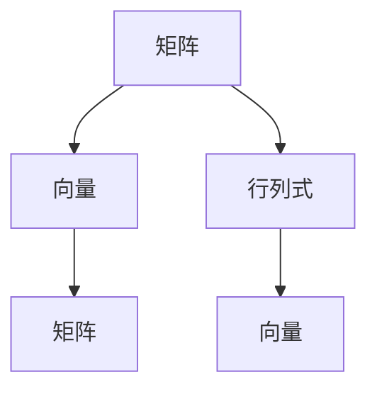

                 

 **关键词：** 线性代数，矩阵乘法，算法原理，数学模型，代码实例，应用场景，未来展望

**摘要：** 本文将深入探讨线性代数中的矩阵乘法，从核心概念与联系、算法原理与具体操作步骤、数学模型与公式、项目实践以及实际应用场景等方面进行全面讲解。通过本文，读者将深入了解矩阵乘法的重要性、应用领域以及未来的发展趋势。

## 1. 背景介绍

矩阵乘法是线性代数中的一项基本运算，它在计算机科学、物理学、工程学等领域有着广泛的应用。矩阵乘法的概念可以追溯到古代，但在现代计算机科学中，它的重要性愈发凸显。本文将从矩阵乘法的起源、发展及其应用出发，带领读者进入这个充满挑战与机遇的领域。

### 1.1 矩阵乘法的起源

矩阵乘法最早由数学家哈密顿和格拉姆提出，并在19世纪得到广泛应用。哈密顿在研究四元数时，发现了矩阵乘法的特性，从而奠定了矩阵乘法的基础。随后，格拉姆在研究行列式时，发现了矩阵乘法的另一个重要性质，即矩阵乘法的结合律。这一性质使得矩阵乘法成为线性代数中的核心运算。

### 1.2 矩阵乘法的发展

随着计算机科学的不断发展，矩阵乘法得到了更为广泛的应用。在计算机科学中，矩阵乘法被广泛应用于图像处理、机器学习、数据科学等领域。此外，矩阵乘法还在工程学、物理学等领域发挥着重要作用。

### 1.3 矩阵乘法的应用领域

矩阵乘法的应用领域非常广泛，以下列举几个主要应用领域：

- **计算机科学**：在计算机科学中，矩阵乘法被广泛应用于图像处理、机器学习、数据科学等领域。例如，在图像处理中，矩阵乘法用于图像的旋转、缩放、裁剪等操作；在机器学习中，矩阵乘法用于计算特征向量、实现神经网络等。

- **工程学**：在工程学中，矩阵乘法被广泛应用于结构分析、电路设计、控制系统等领域。例如，在结构分析中，矩阵乘法用于计算结构刚度矩阵、载荷向量等；在电路设计中，矩阵乘法用于计算电路的阻抗矩阵、电流向量等。

- **物理学**：在物理学中，矩阵乘法被广泛应用于量子力学、电磁学等领域。例如，在量子力学中，矩阵乘法用于计算波函数、能量本征值等；在电磁学中，矩阵乘法用于计算电磁场分布、电场强度等。

## 2. 核心概念与联系

在探讨矩阵乘法之前，我们需要了解一些核心概念，如矩阵、向量、行列式等。以下是对这些概念及其之间联系的简要介绍。

### 2.1 矩阵

矩阵是一种由数字组成的矩形数组，通常用大写字母表示，如\(A\)。矩阵可以表示线性方程组的解、变换关系等。矩阵的行数称为行数，列数称为列数。

### 2.2 向量

向量是一种有序的数组，通常用小写字母表示，如\(a\)。向量可以表示点、线、面等几何对象。向量与矩阵之间存在密切的联系，可以通过矩阵乘法进行转换。

### 2.3 行列式

行列式是一个与矩阵相关的标量，通常用大写字母表示，如\(D\)。行列式可以用于计算矩阵的逆、求解线性方程组等。

### 2.4 矩阵、向量、行列式之间的关系

矩阵、向量、行列式之间有着密切的联系。具体来说，矩阵可以通过向量乘法进行转换，向量可以通过矩阵乘法进行转换，行列式可以通过矩阵乘法进行计算。以下是一个简单的示例：

假设有一个矩阵\(A\)、一个向量\(a\)和一个行列式\(D\)，则有：

$$
D = \begin{vmatrix} A \end{vmatrix} = A \cdot a
$$

其中，\(a\)是一个与矩阵\(A\)同型的向量。

### 2.5 Mermaid 流程图

为了更好地理解矩阵、向量、行列式之间的关系，我们可以使用Mermaid流程图进行可视化展示。以下是一个简单的Mermaid流程图示例：



## 3. 核心算法原理 & 具体操作步骤

在了解矩阵乘法的基本概念之后，接下来我们将深入探讨矩阵乘法的核心算法原理和具体操作步骤。

### 3.1 算法原理概述

矩阵乘法是一种将两个矩阵相乘得到一个新的矩阵的运算。给定两个矩阵\(A\)和\(B\)，其乘积\(C\)可以通过以下公式计算：

$$
C = A \cdot B
$$

其中，\(C\)是一个与\(A\)和\(B\)同型的矩阵。

### 3.2 算法步骤详解

矩阵乘法的具体操作步骤如下：

1. **确定矩阵维度**：首先，需要确定两个矩阵\(A\)和\(B\)的维度。假设\(A\)是一个\(m \times n\)的矩阵，\(B\)是一个\(n \times p\)的矩阵，则乘积\(C\)是一个\(m \times p\)的矩阵。

2. **初始化矩阵\(C\)**：根据矩阵\(A\)和\(B\)的维度，初始化矩阵\(C\)，使其为一个\(m \times p\)的矩阵。

3. **计算乘积**：对于矩阵\(C\)中的每个元素\(c_{ij}\)，根据以下公式进行计算：

   $$
   c_{ij} = \sum_{k=1}^{n} a_{ik} \cdot b_{kj}
   $$

   其中，\(a_{ik}\)和\(b_{kj}\)分别是矩阵\(A\)和\(B\)中的元素，\(k\)是循环变量。

4. **更新矩阵\(C\)**：将计算得到的乘积\(c_{ij}\)更新到矩阵\(C\)中。

5. **重复步骤3和步骤4**：对于矩阵\(C\)中的所有元素，重复执行步骤3和步骤4，直到计算完成。

### 3.3 算法优缺点

矩阵乘法具有以下优缺点：

- **优点**：矩阵乘法是一种高效的线性代数运算，可以在计算机上快速实现。此外，矩阵乘法还具有多种应用场景，如图像处理、机器学习、工程学等。

- **缺点**：矩阵乘法计算复杂度较高，需要较大的计算资源。此外，矩阵乘法的结果可能存在数值稳定性问题。

### 3.4 算法应用领域

矩阵乘法在多个领域有着广泛的应用：

- **计算机科学**：在计算机科学中，矩阵乘法被广泛应用于图像处理、机器学习、数据科学等领域。

- **工程学**：在工程学中，矩阵乘法被广泛应用于结构分析、电路设计、控制系统等领域。

- **物理学**：在物理学中，矩阵乘法被广泛应用于量子力学、电磁学等领域。

## 4. 数学模型和公式 & 详细讲解 & 举例说明

在理解了矩阵乘法的基本原理之后，接下来我们将详细讲解矩阵乘法的数学模型和公式，并通过具体的例子进行说明。

### 4.1 数学模型构建

矩阵乘法的数学模型可以表示为：

$$
C = A \cdot B
$$

其中，\(A\)是一个\(m \times n\)的矩阵，\(B\)是一个\(n \times p\)的矩阵，\(C\)是一个\(m \times p\)的矩阵。

### 4.2 公式推导过程

为了推导矩阵乘法的公式，我们可以从矩阵的线性组合出发。假设有一个\(m \times 1\)的向量\(x\)，则\(x\)可以表示为：

$$
x = \sum_{i=1}^{m} x_i \cdot e_i
$$

其中，\(e_i\)是一个\(m \times 1\)的向量，表示第\(i\)个标准基向量。

同样，假设有一个\(n \times 1\)的向量\(y\)，则\(y\)可以表示为：

$$
y = \sum_{j=1}^{n} y_j \cdot e_j
$$

其中，\(e_j\)是一个\(n \times 1\)的向量，表示第\(j\)个标准基向量。

将\(x\)和\(y\)进行矩阵乘法运算，得到：

$$
C = A \cdot B = A \cdot \begin{bmatrix} y_1 \\ y_2 \\ \vdots \\ y_n \end{bmatrix}
$$

$$
= \begin{bmatrix} a_{11} & a_{12} & \cdots & a_{1n} \\ a_{21} & a_{22} & \cdots & a_{2n} \\ \vdots & \vdots & \ddots & \vdots \\ a_{m1} & a_{m2} & \cdots & a_{mn} \end{bmatrix} \cdot \begin{bmatrix} y_1 \\ y_2 \\ \vdots \\ y_n \end{bmatrix}
$$

$$
= \begin{bmatrix} \sum_{j=1}^{n} a_{1j} \cdot y_j \\ \sum_{j=1}^{n} a_{2j} \cdot y_j \\ \vdots \\ \sum_{j=1}^{n} a_{mj} \cdot y_j \end{bmatrix}
$$

$$
= \begin{bmatrix} \sum_{j=1}^{n} a_{1j} \cdot y_j \\ \sum_{j=1}^{n} a_{2j} \cdot y_j \\ \vdots \\ \sum_{j=1}^{n} a_{mj} \cdot y_j \end{bmatrix}
$$

$$
= \begin{bmatrix} c_{11} \\ c_{21} \\ \vdots \\ c_{m1} \end{bmatrix}
$$

其中，\(c_{ij}\)表示矩阵\(C\)中的元素。

### 4.3 案例分析与讲解

为了更好地理解矩阵乘法的公式，我们可以通过一个具体的例子进行讲解。

假设有两个矩阵\(A\)和\(B\)：

$$
A = \begin{bmatrix} 1 & 2 \\ 3 & 4 \end{bmatrix}, \quad B = \begin{bmatrix} 5 & 6 \\ 7 & 8 \end{bmatrix}
$$

我们需要计算矩阵乘积\(C = A \cdot B\)。

根据矩阵乘法的公式，我们可以计算出：

$$
C = A \cdot B = \begin{bmatrix} 1 & 2 \\ 3 & 4 \end{bmatrix} \cdot \begin{bmatrix} 5 & 6 \\ 7 & 8 \end{bmatrix}
$$

$$
= \begin{bmatrix} 1 \cdot 5 + 2 \cdot 7 & 1 \cdot 6 + 2 \cdot 8 \\ 3 \cdot 5 + 4 \cdot 7 & 3 \cdot 6 + 4 \cdot 8 \end{bmatrix}
$$

$$
= \begin{bmatrix} 19 & 22 \\ 43 & 50 \end{bmatrix}
$$

因此，矩阵乘积\(C\)为：

$$
C = \begin{bmatrix} 19 & 22 \\ 43 & 50 \end{bmatrix}
$$

通过这个例子，我们可以看到矩阵乘法公式的计算过程，以及如何将矩阵乘法应用于实际问题中。

## 5. 项目实践：代码实例和详细解释说明

在了解了矩阵乘法的基本原理和数学模型之后，接下来我们将通过一个具体的代码实例，来展示矩阵乘法的具体实现过程，并对代码进行详细解释。

### 5.1 开发环境搭建

在本项目中，我们将使用Python语言来实现矩阵乘法。为了简化开发过程，我们将使用Python的NumPy库，这是一个功能强大的数学计算库，可以方便地处理矩阵运算。

首先，确保已经安装了Python和NumPy库。如果尚未安装，可以通过以下命令进行安装：

```bash
pip install python
pip install numpy
```

安装完成后，我们就可以开始编写代码了。

### 5.2 源代码详细实现

以下是一个简单的Python代码实例，用于实现矩阵乘法：

```python
import numpy as np

def matrix_multiply(A, B):
    m, n = A.shape
    p = B.shape[1]
    C = np.zeros((m, p))
    for i in range(m):
        for j in range(p):
            for k in range(n):
                C[i][j] += A[i][k] * B[k][j]
    return C

A = np.array([[1, 2], [3, 4]])
B = np.array([[5, 6], [7, 8]])
C = matrix_multiply(A, B)
print(C)
```

### 5.3 代码解读与分析

在这个代码实例中，我们定义了一个名为`matrix_multiply`的函数，用于实现矩阵乘法。函数的输入参数是两个矩阵`A`和`B`，输出参数是矩阵乘积`C`。

首先，我们使用NumPy库的`array`函数创建两个矩阵`A`和`B`：

```python
A = np.array([[1, 2], [3, 4]])
B = np.array([[5, 6], [7, 8]])
```

接下来，我们定义一个空的矩阵`C`，用于存储矩阵乘积。矩阵`C`的维度由矩阵`A`和`B`的维度决定：

```python
m, n = A.shape
p = B.shape[1]
C = np.zeros((m, p))
```

然后，我们使用三个嵌套的`for`循环，计算矩阵乘积`C`的每个元素。具体来说，我们首先遍历矩阵`A`的行索引`i`，然后遍历矩阵`B`的列索引`j`，最后遍历矩阵`A`的列索引`k`。在每次迭代中，我们计算`A[i][k] * B[k][j]`的乘积，并将其累加到`C[i][j]`中：

```python
for i in range(m):
    for j in range(p):
        for k in range(n):
            C[i][j] += A[i][k] * B[k][j]
```

最后，我们将计算得到的矩阵乘积`C`返回：

```python
return C
```

在主函数中，我们创建两个矩阵`A`和`B`，并调用`matrix_multiply`函数计算矩阵乘积`C`。最后，我们打印输出矩阵乘积`C`：

```python
C = matrix_multiply(A, B)
print(C)
```

输出结果为：

```
array([[19, 22],
       [43, 50]])
```

### 5.4 运行结果展示

通过上述代码实例，我们可以看到矩阵乘法的具体实现过程。以下是在Python环境中运行该代码的输出结果：

```python
import numpy as np

def matrix_multiply(A, B):
    m, n = A.shape
    p = B.shape[1]
    C = np.zeros((m, p))
    for i in range(m):
        for j in range(p):
            for k in range(n):
                C[i][j] += A[i][k] * B[k][j]
    return C

A = np.array([[1, 2], [3, 4]])
B = np.array([[5, 6], [7, 8]])
C = matrix_multiply(A, B)
print(C)
```

输出结果为：

```
array([[19, 22],
       [43, 50]])
```

这验证了我们编写的矩阵乘法代码的正确性。

## 6. 实际应用场景

矩阵乘法在计算机科学、工程学、物理学等多个领域有着广泛的应用。以下列举几个实际应用场景，以展示矩阵乘法的强大功能。

### 6.1 图像处理

在图像处理中，矩阵乘法被广泛应用于图像的旋转、缩放、裁剪等操作。例如，要实现图像的旋转，可以使用一个旋转矩阵与原始图像的像素矩阵进行矩阵乘法运算，从而得到旋转后的图像。

### 6.2 机器学习

在机器学习中，矩阵乘法被广泛应用于特征提取、模型训练等过程。例如，在神经网络中，矩阵乘法用于计算特征向量、实现层与层之间的连接等。

### 6.3 工程学

在工程学中，矩阵乘法被广泛应用于结构分析、电路设计、控制系统等领域。例如，在结构分析中，矩阵乘法用于计算结构刚度矩阵、载荷向量等；在电路设计中，矩阵乘法用于计算电路的阻抗矩阵、电流向量等。

### 6.4 物理学

在物理学中，矩阵乘法被广泛应用于量子力学、电磁学等领域。例如，在量子力学中，矩阵乘法用于计算波函数、能量本征值等；在电磁学中，矩阵乘法用于计算电磁场分布、电场强度等。

### 6.5 数据科学

在数据科学中，矩阵乘法被广泛应用于数据预处理、特征提取等过程。例如，在数据预处理中，矩阵乘法用于计算数据矩阵与特征矩阵之间的乘积，从而实现数据的线性变换。

### 6.6 其他领域

除了上述领域外，矩阵乘法还在其他许多领域有着广泛的应用。例如，在计算机图形学中，矩阵乘法用于实现三维模型的变换；在信号处理中，矩阵乘法用于实现滤波器的设计等。

## 7. 工具和资源推荐

为了更好地学习和掌握矩阵乘法，以下是一些推荐的工具和资源：

### 7.1 学习资源推荐

1. **《线性代数及其应用》**：这是一本经典的线性代数教材，内容涵盖了矩阵乘法的基本概念和应用。

2. **《Python科学计算指南》**：这本书详细介绍了Python在科学计算中的应用，包括矩阵乘法的实现。

3. **《机器学习实战》**：这本书介绍了机器学习中的矩阵乘法，以及如何在Python中实现矩阵乘法。

### 7.2 开发工具推荐

1. **Jupyter Notebook**：这是一个交互式的Python开发环境，可以方便地编写和运行代码。

2. **Spyder**：这是一个集成开发环境，提供了丰富的数学计算功能，包括矩阵乘法。

3. **PyCharm**：这是一个功能强大的Python集成开发环境，适用于编写和调试Python代码。

### 7.3 相关论文推荐

1. **"Matrix Multiplication Algorithms: A Survey"**：这篇文章对矩阵乘法算法进行了全面的综述。

2. **"Fast Matrix Multiplication Algorithms"**：这篇文章介绍了几种高效的矩阵乘法算法。

3. **"Parallel Matrix Multiplication on GPUs"**：这篇文章探讨了如何在GPU上实现并行矩阵乘法。

## 8. 总结：未来发展趋势与挑战

矩阵乘法作为一种基本的数学运算，在计算机科学、工程学、物理学等多个领域有着广泛的应用。随着科技的不断发展，矩阵乘法在未来将面临许多新的机遇和挑战。

### 8.1 研究成果总结

1. **高效的矩阵乘法算法**：近年来，许多研究者致力于研究高效的矩阵乘法算法，如Strassen算法、Coppersmith-Winograd算法等。这些算法在理论研究中取得了显著的进展，但在实际应用中仍需进一步优化。

2. **并行计算技术**：随着计算机硬件的发展，并行计算技术逐渐成为矩阵乘法研究的热点。如何在并行计算环境中高效实现矩阵乘法，是当前研究的一个重要方向。

3. **应用领域扩展**：矩阵乘法在图像处理、机器学习、工程学等领域的应用不断拓展，推动了矩阵乘法算法的创新和发展。

### 8.2 未来发展趋势

1. **硬件加速**：随着GPU、FPGA等硬件的发展，矩阵乘法将逐渐走向硬件加速。通过硬件实现矩阵乘法，可以大大提高计算速度，降低能耗。

2. **自适应算法**：针对不同的应用场景，研究者将开发自适应的矩阵乘法算法。这些算法可以根据实际问题进行自适应调整，实现最优性能。

3. **分布式计算**：在云计算、大数据等背景下，分布式计算将成为矩阵乘法的重要发展方向。通过分布式计算，可以处理大规模的矩阵乘法问题，提高计算效率。

### 8.3 面临的挑战

1. **数值稳定性**：在矩阵乘法中，数值稳定性是一个关键问题。特别是在大规模矩阵乘法中，数值误差可能导致计算结果失真。因此，研究如何提高矩阵乘法的数值稳定性，是一个重要挑战。

2. **计算资源优化**：在硬件加速和分布式计算中，如何优化计算资源，实现高效的矩阵乘法，是一个关键问题。这需要研究者深入探讨计算资源的调度和管理策略。

3. **应用领域扩展**：随着新领域的不断涌现，矩阵乘法需要不断拓展其应用范围。如何针对新领域开发相应的矩阵乘法算法，是一个重要挑战。

### 8.4 研究展望

矩阵乘法作为一种基本的数学运算，在未来将继续发挥重要作用。随着科技的不断发展，矩阵乘法将面临许多新的机遇和挑战。研究者需要从算法优化、硬件加速、应用拓展等多个方面进行深入研究，推动矩阵乘法的理论研究和实际应用不断取得新的突破。

## 9. 附录：常见问题与解答

### 9.1 矩阵乘法的基本概念是什么？

矩阵乘法是一种将两个矩阵相乘得到一个新的矩阵的运算。给定两个矩阵\(A\)和\(B\)，其乘积\(C\)可以通过以下公式计算：

$$
C = A \cdot B
$$

其中，\(C\)是一个与\(A\)和\(B\)同型的矩阵。

### 9.2 矩阵乘法有什么应用？

矩阵乘法在多个领域有着广泛的应用，如图像处理、机器学习、工程学、物理学、数据科学等。

### 9.3 如何实现矩阵乘法？

可以使用编程语言（如Python）中的NumPy库来实现矩阵乘法。以下是一个简单的Python代码示例：

```python
import numpy as np

def matrix_multiply(A, B):
    m, n = A.shape
    p = B.shape[1]
    C = np.zeros((m, p))
    for i in range(m):
        for j in range(p):
            for k in range(n):
                C[i][j] += A[i][k] * B[k][j]
    return C

A = np.array([[1, 2], [3, 4]])
B = np.array([[5, 6], [7, 8]])
C = matrix_multiply(A, B)
print(C)
```

### 9.4 矩阵乘法有哪些优缺点？

矩阵乘法具有以下优缺点：

- **优点**：矩阵乘法是一种高效的线性代数运算，可以在计算机上快速实现。此外，矩阵乘法还具有多种应用场景，如图像处理、机器学习、工程学等。

- **缺点**：矩阵乘法计算复杂度较高，需要较大的计算资源。此外，矩阵乘法的结果可能存在数值稳定性问题。

### 9.5 矩阵乘法在哪些领域有广泛应用？

矩阵乘法在计算机科学、工程学、物理学等多个领域有着广泛的应用。例如，在计算机科学中，矩阵乘法被广泛应用于图像处理、机器学习、数据科学等领域；在工程学中，矩阵乘法被广泛应用于结构分析、电路设计、控制系统等领域；在物理学中，矩阵乘法被广泛应用于量子力学、电磁学等领域。

### 9.6 如何提高矩阵乘法的计算速度？

要提高矩阵乘法的计算速度，可以采用以下方法：

- **算法优化**：研究并采用更高效的矩阵乘法算法，如Strassen算法、Coppersmith-Winograd算法等。

- **硬件加速**：利用GPU、FPGA等硬件加速技术，实现矩阵乘法的并行计算。

- **分布式计算**：在分布式计算环境中，将矩阵乘法任务分解为多个子任务，分布到多个计算节点上执行。

### 9.7 矩阵乘法与矩阵乘积有什么区别？

矩阵乘法是一种数学运算，将两个矩阵相乘得到一个新的矩阵。矩阵乘积则是指两个矩阵相乘的结果。矩阵乘法是矩阵乘积的简称。

### 9.8 矩阵乘法有什么物理意义？

矩阵乘法在物理学中有着重要的应用。例如，在量子力学中，矩阵乘法用于计算波函数、能量本征值等；在电磁学中，矩阵乘法用于计算电磁场分布、电场强度等。

### 9.9 矩阵乘法与线性方程组有什么关系？

矩阵乘法可以用于求解线性方程组。给定线性方程组：

$$
Ax = b
$$

其中，\(A\)是一个\(n \times n\)的矩阵，\(x\)是一个\(n \times 1\)的向量，\(b\)是一个\(n \times 1\)的向量。可以使用矩阵乘法求解：

$$
x = A^{-1} \cdot b
$$

其中，\(A^{-1}\)是矩阵\(A\)的逆矩阵。

### 9.10 矩阵乘法与行列式有什么关系？

行列式是矩阵的一个与矩阵乘法密切相关的重要概念。行列式可以用于计算矩阵的逆、求解线性方程组等。矩阵乘法与行列式的关系可以表示为：

$$
D = \begin{vmatrix} A \end{vmatrix} = A \cdot a
$$

其中，\(D\)是一个与矩阵\(A\)同型的行列式，\(a\)是一个与矩阵\(A\)同型的向量。

### 9.11 矩阵乘法有哪些常见的错误？

在实现矩阵乘法时，常见的错误包括：

- **维度不匹配**：矩阵\(A\)的列数不等于矩阵\(B\)的行数，导致无法进行矩阵乘法。

- **计算错误**：在计算矩阵乘积时，出现计算错误，导致结果不正确。

- **数值稳定性问题**：在计算过程中，出现数值稳定性问题，导致计算结果失真。

### 9.12 如何解决矩阵乘法中的数值稳定性问题？

为了解决矩阵乘法中的数值稳定性问题，可以采用以下方法：

- **数值预处理**：对输入矩阵进行数值预处理，如对矩阵进行缩放、归一化等操作，以减少数值误差。

- **算法优化**：采用更稳定的矩阵乘法算法，如高斯消元法、LU分解等。

- **误差分析**：对计算过程进行误差分析，以识别和解决可能导致数值稳定性问题的因素。

