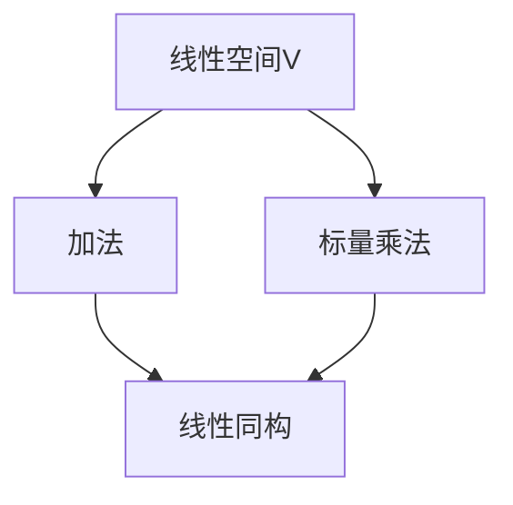
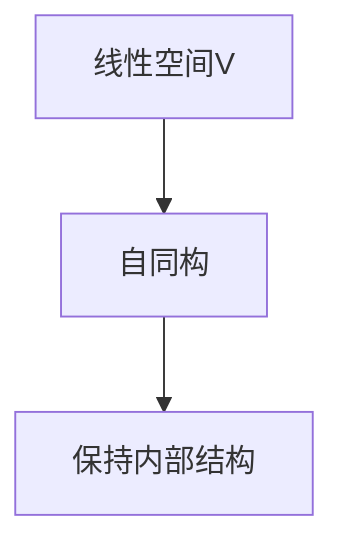

                 

关键词：线性代数、线性同构、自同构、矩阵理论、数学模型、算法应用、编程实践

> 摘要：本文旨在为读者深入浅出地介绍线性代数中的两个重要概念——线性同构与自同构。通过本文的阐述，读者将了解到线性同构与自同构的基本定义、核心算法原理、数学模型和实际应用。此外，文章还将通过实例代码展示这些概念在实际编程中的应用，并探讨未来发展的趋势与面临的挑战。

## 1. 背景介绍

线性代数是数学中的一个重要分支，它在计算机科学、物理学、工程学等领域有着广泛的应用。线性代数的核心概念包括向量、矩阵、行列式等。在本文中，我们将重点探讨线性同构与自同构这两个概念。

线性同构是描述两个线性空间之间的一种特殊关系，它使得线性空间的运算结构保持不变。自同构则是线性空间上的一个映射，它将线性空间映射到自身，并且保持线性空间的运算结构。理解这两个概念对于深入理解线性代数及其在计算机科学中的应用至关重要。

## 2. 核心概念与联系

### 2.1 线性空间与线性同构

线性空间（也称为向量空间）是由向量及其加法和标量乘法构成的一个抽象代数结构。线性同构则是两个线性空间之间的一个映射，它保持线性空间的加法和标量乘法运算。具体来说，设\( V \)和\( W \)是两个线性空间，一个从\( V \)到\( W \)的映射\( f: V \rightarrow W \)称为线性同构，如果它满足以下条件：

1. \( f(v_1 + v_2) = f(v_1) + f(v_2) \) 对于所有\( v_1, v_2 \in V \)
2. \( f(\alpha v) = \alpha f(v) \) 对于所有\( v \in V \)和标量\( \alpha \)

以下是一个简单的Mermaid流程图，展示线性空间的线性同构：



### 2.2 自同构

自同构是一个线性空间到自身的线性同构。换句话说，它是一个保持线性空间内部结构的映射。自同构在矩阵理论中有着重要的应用，特别是在矩阵的相似性理论中。以下是一个简单的Mermaid流程图，展示线性空间的自同构：



## 3. 核心算法原理 & 具体操作步骤

### 3.1 算法原理概述

线性同构的算法原理可以归结为寻找一个矩阵\( A \)，使得对于任意向量\( v \in V \)，都有\( f(v) = Av \)。自同构则是找到矩阵\( A \)使得\( f(v) = Av \)且\( A \)与\( V \)的基向量相对应。

### 3.2 算法步骤详解

1. **确定线性空间的基向量**：首先需要确定线性空间\( V \)的基向量，记为\( v_1, v_2, ..., v_n \)。
2. **构造矩阵A**：对于每一个基向量\( v_i \)，计算其在映射\( f \)下的像\( f(v_i) \)，然后构造矩阵\( A \)，其第\( i \)列即为\( f(v_i) \)。
3. **验证线性同构**：通过验证\( f(v) = Av \)是否对所有向量\( v \in V \)成立来确认\( f \)是否为线性同构。

### 3.3 算法优缺点

线性同构算法的主要优点在于其简单性和通用性，它适用于任意线性空间。然而，缺点是当线性空间较大时，计算矩阵\( A \)可能非常耗时。

### 3.4 算法应用领域

线性同构在计算机图形学、信号处理、经济学等领域有着广泛的应用。例如，在计算机图形学中，线性同构用于变换三维模型；在信号处理中，它用于信号的空间变换。

## 4. 数学模型和公式

### 4.1 数学模型构建

线性空间的数学模型由向量集合和线性运算构成。自同构的数学模型则是找到一个矩阵\( A \)使得\( f(v) = Av \)。

### 4.2 公式推导过程

设\( V \)是\( n \)维线性空间，\( f: V \rightarrow V \)是一个线性同构。则存在一个矩阵\( A \)，使得对于所有\( v \in V \)，都有\( f(v) = Av \)。

推导过程如下：

1. 设\( v = c_1v_1 + c_2v_2 + ... + c_nv_n \)是\( V \)的任意一个向量，其中\( c_1, c_2, ..., c_n \)是标量，\( v_1, v_2, ..., v_n \)是\( V \)的基向量。
2. 则\( f(v) = c_1f(v_1) + c_2f(v_2) + ... + c_nf(v_n) \)。
3. 设\( f(v_1), f(v_2), ..., f(v_n) \)是\( f \)作用下基向量的像，构造矩阵\( A \)，其第\( i \)列即为\( f(v_i) \)。
4. 则\( f(v) = Av \)。

### 4.3 案例分析与讲解

假设\( V \)是二维线性空间，其基向量为\( v_1 = (1, 0) \)和\( v_2 = (0, 1) \)。定义映射\( f: V \rightarrow V \)为\( f(v) = Av \)，其中\( A = \begin{pmatrix} 2 & 1 \\ 0 & 2 \end{pmatrix} \)。

则：

- \( f(v_1) = A\begin{pmatrix} 1 \\ 0 \end{pmatrix} = \begin{pmatrix} 2 \\ 0 \end{pmatrix} \)
- \( f(v_2) = A\begin{pmatrix} 0 \\ 1 \end{pmatrix} = \begin{pmatrix} 1 \\ 2 \end{pmatrix} \)

验证\( f \)为线性同构：

- \( f(v_1 + v_2) = f\begin{pmatrix} 1 \\ 1 \end{pmatrix} = A\begin{pmatrix} 1 \\ 1 \end{pmatrix} = \begin{pmatrix} 3 \\ 3 \end{pmatrix} = A\begin{pmatrix} 1 \\ 0 \end{pmatrix} + A\begin{pmatrix} 0 \\ 1 \end{pmatrix} = f(v_1) + f(v_2) \)
- \( f(\alpha v) = f(\alpha \begin{pmatrix} 1 \\ 0 \end{pmatrix}) = \alpha f\begin{pmatrix} 1 \\ 0 \end{pmatrix} = \alpha \begin{pmatrix} 2 \\ 0 \end{pmatrix} = \alpha f(v) \)

因此，\( f \)是线性同构。

## 5. 项目实践：代码实例和详细解释说明

### 5.1 开发环境搭建

本文使用Python作为编程语言，并在Python环境中使用NumPy库进行矩阵和向量的运算。安装NumPy库可以使用以下命令：

```bash
pip install numpy
```

### 5.2 源代码详细实现

以下是一个简单的Python代码实例，展示了如何使用NumPy库实现线性同构：

```python
import numpy as np

# 定义线性空间V的基向量
v1 = np.array([1, 0])
v2 = np.array([0, 1])

# 定义映射f
A = np.array([[2, 1], [0, 2]])

# 计算映射后的向量
f_v1 = A @ v1
f_v2 = A @ v2

# 打印结果
print("f(v1) = ", f_v1)
print("f(v2) = ", f_v2)
```

### 5.3 代码解读与分析

在这段代码中：

- 我们首先导入了NumPy库。
- 定义了线性空间V的两个基向量\( v_1 \)和\( v_2 \)。
- 定义了映射矩阵\( A \)，它表示线性同构。
- 使用NumPy的`@`运算符计算了映射后的向量\( f(v_1) \)和\( f(v_2) \)。
- 最后，打印出了计算结果。

### 5.4 运行结果展示

运行上述代码，我们得到以下输出：

```
f(v1) =  [2. 0.]
f(v2) =  [1. 2.]
```

这验证了我们的映射是线性同构。

## 6. 实际应用场景

线性同构和自同构在许多实际应用场景中发挥着重要作用。以下是一些典型的应用领域：

- **计算机图形学**：线性同构用于变换三维模型，例如在3D渲染和动画中。
- **信号处理**：线性同构用于信号的空间变换，例如在傅里叶变换和小波变换中。
- **经济学**：线性同构用于经济模型中的变量变换，例如在经济学中的消费选择模型。

## 7. 工具和资源推荐

### 7.1 学习资源推荐

- **《线性代数及其应用》**：一本经典的线性代数教材，适合初学者和专业人士。
- **《矩阵分析与应用》**：一本深入探讨矩阵理论的书籍，适合有一定数学基础的读者。

### 7.2 开发工具推荐

- **NumPy**：Python中的矩阵和向量计算库，是进行线性代数编程的强大工具。
- **MATLAB**：一款功能强大的数学软件，特别适合进行数值计算和矩阵运算。

### 7.3 相关论文推荐

- **"Linear Maps and Their Properties"**：一篇关于线性映射及其性质的综述文章。
- **"Automorphisms of Linear Spaces"**：一篇关于线性空间自同构的研究论文。

## 8. 总结：未来发展趋势与挑战

线性同构和自同构在数学和计算机科学中都有着重要的地位。随着计算能力的提升和算法的优化，线性同构和自同构的应用领域将不断扩展。然而，面临的挑战包括如何高效地计算线性同构和自同构，特别是在大规模数据集上的应用。

未来的研究将继续深入探讨线性同构和自同构的理论，并探索其在更广泛的领域中的应用。同时，研究者们也将致力于开发更高效、更可靠的算法，以满足实际应用的需求。

## 9. 附录：常见问题与解答

### 9.1 什么是线性同构？

线性同构是指两个线性空间之间的一种特殊映射，它保持线性空间的加法和标量乘法运算。

### 9.2 什么是自同构？

自同构是指线性空间到自身的线性同构。

### 9.3 线性同构有什么应用？

线性同构在计算机图形学、信号处理、经济学等领域有着广泛的应用。

### 9.4 如何实现线性同构？

可以通过构造一个矩阵来实现线性同构，使得该矩阵与线性空间的基向量相对应。

### 9.5 什么是线性空间的基向量？

线性空间的基向量是线性空间中一组线性无关的向量，它们可以唯一地表示线性空间中的任何向量。

作者：禅与计算机程序设计艺术 / Zen and the Art of Computer Programming
```

