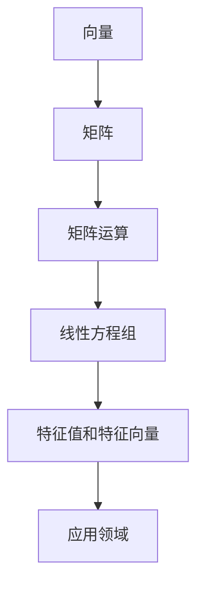

                 

关键词：线性代数，数学表达式，语义解释，算法原理，数学模型，应用领域，未来展望。

> 摘要：本文旨在探讨线性代数中的表达式及其语义解释，通过对核心概念和算法的深入分析，结合数学模型的构建与公式推导，以及项目实践中的代码实例，旨在为读者提供全面的线性代数理解和应用指导。文章还对未来发展趋势和挑战进行了展望。

## 1. 背景介绍

线性代数作为数学的一个分支，是现代科学和工程领域的基础。它研究线性方程组、向量空间、矩阵以及它们的运算和性质。线性代数的应用非常广泛，从物理学、工程学、计算机科学到经济学、统计学等多个领域都有其身影。

在计算机科学中，线性代数的应用尤为突出。它不仅在算法设计、数据结构分析中扮演重要角色，还在图形学、机器学习、信号处理等领域中发挥着核心作用。线性代数为计算机科学家提供了一种强大的工具，用于解决复杂问题、优化算法性能和提升系统效率。

本文将围绕线性代数中的几个核心概念和算法展开讨论，力求为读者提供深入理解线性代数的基本原理和应用技巧。通过本文的学习，读者将能够掌握线性代数中的关键概念，理解数学模型的构建和公式推导，并在实际项目中应用所学知识。

## 2. 核心概念与联系

### 2.1 向量和矩阵

向量是线性代数中最基本的概念之一，它通常表示为列向量或行向量。向量在空间中可以表示位移、速度或力等物理量。矩阵则是由一系列数字（或更一般的元素）排列成的矩形数组。矩阵在许多领域都有广泛应用，例如表示线性变换、解决线性方程组、进行特征值和特征向量分析等。

### 2.2 矩阵运算

矩阵运算包括矩阵的加法、减法、乘法、转置等。这些运算是线性代数中不可或缺的部分，它们为解决实际问题提供了强有力的工具。例如，矩阵乘法可以用于计算线性变换，而矩阵转置在图像处理和信号处理中有着广泛的应用。

### 2.3 线性方程组

线性方程组是由多个线性方程构成的系统，它们可以用来求解未知数的值。线性代数为解决线性方程组提供了多种算法，如高斯消元法、LU分解等。这些算法的效率对于解决实际问题至关重要。

### 2.4 特征值和特征向量

特征值和特征向量是矩阵理论中的关键概念。特征值表示矩阵的一个线性变换作用后，向量的缩放因子，而特征向量则是在这个变换下保持不变的向量。特征值和特征向量在量子物理、数据分析、图像处理等领域中有着广泛的应用。

### 2.5 向量和矩阵的Mermaid流程图

下面是线性代数核心概念和算法的Mermaid流程图：



## 3. 核心算法原理 & 具体操作步骤

### 3.1 算法原理概述

本文将重点介绍几个线性代数中的核心算法，包括矩阵的乘法、线性方程组的求解以及特征值和特征向量的计算。这些算法在理论和实际应用中都有着重要的地位。

### 3.2 算法步骤详解

#### 3.2.1 矩阵乘法

矩阵乘法是线性代数中最基本的运算之一。给定两个矩阵 \( A \) 和 \( B \)，其乘积 \( C = AB \) 的计算步骤如下：

1. 确保矩阵 \( A \) 的列数等于矩阵 \( B \) 的行数。
2. 对于 \( C \) 的每个元素 \( c_{ij} \)，计算公式为 \( c_{ij} = \sum_{k=1}^{m} a_{ik}b_{kj} \)，其中 \( i \) 和 \( j \) 分别表示 \( C \) 的行和列索引，\( k \) 表示 \( A \) 的列索引。

#### 3.2.2 线性方程组的求解

线性方程组的求解是线性代数中一个经典问题。高斯消元法是其中一种常用的算法，其步骤如下：

1. 将线性方程组写成增广矩阵的形式。
2. 通过高斯消元法将增广矩阵化为行阶梯形式。
3. 利用回代法求解方程组的解。

#### 3.2.3 特征值和特征向量的计算

特征值和特征向量的计算是矩阵理论中的重要问题。具体步骤如下：

1. 计算矩阵 \( A \) 的特征多项式 \( p(\lambda) = \det(A - \lambda I) \)。
2. 求解特征多项式得到特征值 \( \lambda \)。
3. 对于每个特征值 \( \lambda \)，求解线性方程组 \( (A - \lambda I)v = 0 \) 得到对应的特征向量 \( v \)。

### 3.3 算法优缺点

#### 矩阵乘法的优缺点

- 优点：矩阵乘法在许多应用中是不可或缺的，例如在图像处理、信号处理和机器学习等领域。
- 缺点：矩阵乘法的计算复杂度为 \( O(n^3) \)，对于大型矩阵可能效率较低。

#### 线性方程组的求解优缺点

- 优点：高斯消元法是一种有效且通用的线性方程组求解方法，适用于各种类型的线性方程组。
- 缺点：在高阶线性方程组中，高斯消元法可能面临数值稳定性问题。

#### 特征值和特征向量的计算优缺点

- 优点：特征值和特征向量在许多领域有着广泛的应用，如数据分析、图像处理和量子物理等。
- 缺点：计算特征值和特征向量可能需要较高的计算资源，特别是在大型矩阵的情况下。

### 3.4 算法应用领域

线性代数的核心算法在多个领域都有广泛应用：

- **计算机图形学**：矩阵乘法用于图形的变换，如旋转、缩放和平移。
- **机器学习**：特征值和特征向量用于降维和特征提取，如主成分分析（PCA）。
- **信号处理**：矩阵运算用于信号滤波和图像增强。
- **物理学**：线性方程组用于求解物理系统的动态行为。

## 4. 数学模型和公式 & 详细讲解 & 举例说明

### 4.1 数学模型构建

线性代数中的数学模型主要涉及矩阵和向量的运算，以及线性方程组的求解。以下是几个常见的数学模型：

#### 矩阵乘法

$$ C = AB $$

其中，\( A \) 是 \( m \times n \) 矩阵，\( B \) 是 \( n \times p \) 矩阵，\( C \) 是 \( m \times p \) 矩阵。

#### 线性方程组

$$ Ax = b $$

其中，\( A \) 是 \( m \times n \) 矩阵，\( x \) 是 \( n \) 维列向量，\( b \) 是 \( m \) 维列向量。

#### 特征值和特征向量

$$ (A - \lambda I)v = 0 $$

其中，\( A \) 是 \( n \times n \) 矩阵，\( \lambda \) 是特征值，\( v \) 是特征向量。

### 4.2 公式推导过程

#### 矩阵乘法公式推导

设 \( A = [a_{ij}] \) 是 \( m \times n \) 矩阵，\( B = [b_{ij}] \) 是 \( n \times p \) 矩阵。矩阵乘法 \( C = AB \) 的每个元素 \( c_{ij} \) 可以通过以下公式计算：

$$ c_{ij} = \sum_{k=1}^{n} a_{ik}b_{kj} $$

#### 线性方程组公式推导

线性方程组 \( Ax = b \) 的解可以通过高斯消元法得到。以下是高斯消元法的步骤：

1. 将线性方程组写成增广矩阵形式：

   $$ \left[ \begin{array}{ccc|c} 
   a_{11} & a_{12} & \ldots & b_1 \\
   a_{21} & a_{22} & \ldots & b_2 \\
   \vdots & \vdots & \ddots & \vdots \\
   a_{m1} & a_{m2} & \ldots & b_m 
   \end{array} \right] $$

2. 通过行变换将增广矩阵化为行阶梯形式。

3. 从最后一行开始，利用回代法求解方程组的解。

#### 特征值和特征向量公式推导

特征值和特征向量的计算涉及到矩阵 \( A \) 的特征多项式和线性方程组。以下是特征值和特征向量的推导过程：

1. 计算矩阵 \( A \) 的特征多项式：

   $$ p(\lambda) = \det(A - \lambda I) $$

2. 求解特征多项式得到特征值 \( \lambda \)。

3. 对于每个特征值 \( \lambda \)，求解线性方程组 \( (A - \lambda I)v = 0 \) 得到对应的特征向量 \( v \)。

### 4.3 案例分析与讲解

#### 案例一：矩阵乘法

给定矩阵 \( A = \begin{bmatrix} 1 & 2 \\ 3 & 4 \end{bmatrix} \) 和 \( B = \begin{bmatrix} 5 & 6 \\ 7 & 8 \end{bmatrix} \)，计算矩阵乘法 \( C = AB \)。

$$ C = \begin{bmatrix} 1 & 2 \\ 3 & 4 \end{bmatrix} \begin{bmatrix} 5 & 6 \\ 7 & 8 \end{bmatrix} = \begin{bmatrix} 1 \cdot 5 + 2 \cdot 7 & 1 \cdot 6 + 2 \cdot 8 \\ 3 \cdot 5 + 4 \cdot 7 & 3 \cdot 6 + 4 \cdot 8 \end{bmatrix} = \begin{bmatrix} 19 & 22 \\ 43 & 50 \end{bmatrix} $$

#### 案例二：线性方程组

给定线性方程组：

$$ \begin{cases} 
x + 2y = 1 \\
3x + 4y = 7 
\end{cases} $$

通过高斯消元法求解。

1. 将线性方程组写成增广矩阵形式：

   $$ \left[ \begin{array}{cc|c} 
   1 & 2 & 1 \\
   3 & 4 & 7 
   \end{array} \right] $$

2. 通过行变换将增广矩阵化为行阶梯形式：

   $$ \left[ \begin{array}{cc|c} 
   1 & 2 & 1 \\
   0 & -2 & 4 
   \end{array} \right] $$

3. 从最后一行开始，利用回代法求解方程组的解：

   $$ y = -2, \quad x = 1 - 2y = 1 + 4 = 5 $$

#### 案例三：特征值和特征向量

给定矩阵 \( A = \begin{bmatrix} 4 & 2 \\ 1 & 3 \end{bmatrix} \)，计算其特征值和特征向量。

1. 计算特征多项式：

   $$ p(\lambda) = \det(A - \lambda I) = \det\left(\begin{bmatrix} 4 - \lambda & 2 \\ 1 & 3 - \lambda \end{bmatrix}\right) = (4 - \lambda)(3 - \lambda) - 2 \cdot 1 = \lambda^2 - 7\lambda + 10 $$

2. 求解特征多项式得到特征值：

   $$ p(\lambda) = 0 \Rightarrow \lambda_1 = 2, \quad \lambda_2 = 5 $$

3. 对于每个特征值计算特征向量：

   对于 \( \lambda_1 = 2 \)：

   $$ (A - \lambda_1 I)v = \begin{bmatrix} 2 & 2 \\ 1 & 1 \end{bmatrix}v = 0 $$

   解得特征向量 \( v_1 = \begin{bmatrix} -1 \\ 1 \end{bmatrix} \)。

   对于 \( \lambda_2 = 5 \)：

   $$ (A - \lambda_2 I)v = \begin{bmatrix} -1 & 2 \\ 1 & -2 \end{bmatrix}v = 0 $$

   解得特征向量 \( v_2 = \begin{bmatrix} 1 \\ 1 \end{bmatrix} \)。

## 5. 项目实践：代码实例和详细解释说明

### 5.1 开发环境搭建

本文代码实例将在Python环境中实现，读者需要安装Python和相应的线性代数库，如NumPy和SciPy。

1. 安装Python：在官方网站下载并安装Python。
2. 安装NumPy：使用pip命令安装NumPy库。
   ```bash
   pip install numpy
   ```

### 5.2 源代码详细实现

以下是实现线性代数核心算法的Python代码：

```python
import numpy as np

# 矩阵乘法
def matrix_multiplication(A, B):
    return np.dot(A, B)

# 线性方程组求解
def solve_linear_equations(A, b):
    return np.linalg.solve(A, b)

# 特征值和特征向量计算
def compute_eigenvalues_eigenvectors(A):
    eigenvalues, eigenvectors = np.linalg.eig(A)
    return eigenvalues, eigenvectors

# 主函数
if __name__ == "__main__":
    # 创建矩阵A
    A = np.array([[4, 2], [1, 3]])
    
    # 矩阵乘法
    B = np.array([[5, 6], [7, 8]])
    C = matrix_multiplication(A, B)
    print("矩阵乘法结果：", C)
    
    # 线性方程组求解
    b = np.array([1, 7])
    x = solve_linear_equations(A, b)
    print("线性方程组解：", x)
    
    # 特征值和特征向量计算
    eigenvalues, eigenvectors = compute_eigenvalues_eigenvectors(A)
    print("特征值：", eigenvalues)
    print("特征向量：", eigenvectors)
```

### 5.3 代码解读与分析

上述代码实现了线性代数中的三个核心算法：矩阵乘法、线性方程组求解和特征值特征向量计算。以下是代码的详细解读：

1. **矩阵乘法**：使用NumPy库的`dot`函数实现矩阵乘法，该函数接受两个矩阵作为输入并返回它们的乘积。
2. **线性方程组求解**：使用NumPy库的`linalg.solve`函数求解线性方程组，该函数接受线性方程组的系数矩阵和常数向量作为输入，并返回解向量。
3. **特征值和特征向量计算**：使用NumPy库的`linalg.eig`函数计算矩阵的特征值和特征向量，该函数返回特征值数组和对

