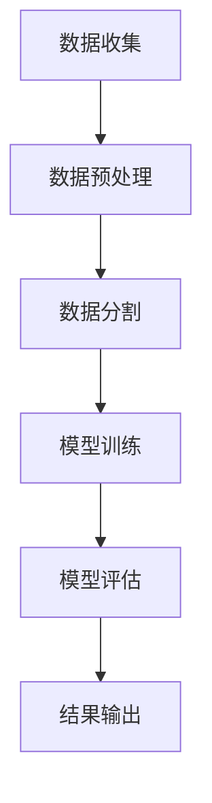

                 

关键词：线性回归、回归分析、机器学习、数据拟合、统计模型、Python实现、算法原理、数学推导、案例解析

> 摘要：本文深入探讨了线性回归的基本概念、原理及其在数据分析中的应用。通过详细的数学推导和Python代码实例，本文为读者提供了线性回归算法的全面理解，包括算法的优缺点、应用领域以及未来的发展方向。

## 1. 背景介绍

线性回归是一种最基础的统计模型，它用于预测或解释两个变量之间的关系。在机器学习领域，线性回归是最常用的算法之一，因其简单、高效且易于实现。线性回归的基本思想是通过找到一条直线来描述数据点之间的关系，进而预测新的数据点的值。

线性回归的应用范围非常广泛，包括经济学、金融、医学、工程等众多领域。例如，在经济学中，它可以用于预测股票价格；在医学中，它可以用于诊断疾病的概率；在工程领域，它可以用于预测材料属性。

本文将首先介绍线性回归的基本概念，然后深入讲解其数学原理，接着通过Python代码实例展示如何实现线性回归模型，最后讨论线性回归的优缺点及其应用领域。

## 2. 核心概念与联系

线性回归的核心概念包括自变量（特征）、因变量（目标值）和回归系数。在数学上，线性回归可以用一个线性方程表示：

\[ y = w_0 + w_1 \cdot x \]

其中，\( y \) 是因变量，\( x \) 是自变量，\( w_0 \) 和 \( w_1 \) 是回归系数，也称为权重。

### 2.1 线性回归模型的基本概念

- **自变量（特征）**：影响因变量的变量，通常用 \( x \) 表示。
- **因变量（目标值）**：我们试图预测或解释的变量，通常用 \( y \) 表示。
- **回归系数（权重）**：描述自变量对因变量的影响程度，用 \( w \) 表示。

### 2.2 线性回归的数学原理

线性回归的数学原理是通过最小化预测值与实际值之间的误差，找到最佳的回归系数。具体来说，线性回归的目标是最小化均方误差（Mean Squared Error，MSE）：

\[ \min W = \min \sum_{i=1}^{n} (y_i - (w_0 + w_1 \cdot x_i))^2 \]

### 2.3 线性回归的 Mermaid 流程图

以下是一个简单的 Mermaid 流程图，展示了线性回归的流程：



### 2.4 线性回归与相关算法的联系

- **最小二乘法（Ordinary Least Squares, OLS）**：线性回归常用的求解方法，通过最小化均方误差来找到最佳回归系数。
- **线性判别分析（Linear Discriminant Analysis, LDA）**：一种用于分类的线性模型，其核心思想是最大化类内方差和最小化类间方差。
- **主成分分析（Principal Component Analysis, PCA）**：一种数据降维技术，通过线性变换将数据投影到新的坐标系上，以提取最重要的特征。

## 3. 核心算法原理 & 具体操作步骤

### 3.1 算法原理概述

线性回归的原理在于通过拟合一条直线来描述自变量和因变量之间的关系。具体来说，就是找到一组回归系数 \( w_0 \) 和 \( w_1 \)，使得预测值 \( \hat{y} \) 与实际值 \( y \) 之间的误差最小。

### 3.2 算法步骤详解

1. **数据收集**：收集自变量和因变量的数据。
2. **数据预处理**：对数据进行清洗、归一化等处理，以确保数据的可靠性和一致性。
3. **数据分割**：将数据集划分为训练集和测试集，用于模型的训练和评估。
4. **模型训练**：使用最小二乘法或其他优化算法，找到最佳回归系数。
5. **模型评估**：使用测试集评估模型的效果，常用的评价指标包括均方误差（MSE）和决定系数（R²）。
6. **结果输出**：输出模型的参数和评估指标，以及预测结果。

### 3.3 算法优缺点

- **优点**：
  - 简单易懂，易于实现。
  - 计算效率高，适合大规模数据处理。
  - 对线性关系的建模效果较好。
- **缺点**：
  - 对非线性关系的拟合能力较弱。
  - 对异常值和噪声敏感。

### 3.4 算法应用领域

- **金融领域**：用于预测股票价格、债券收益率等。
- **医学领域**：用于疾病诊断、患者风险评估等。
- **工程领域**：用于材料属性预测、结构分析等。
- **商业领域**：用于市场营销、客户行为分析等。

## 4. 数学模型和公式 & 详细讲解 & 举例说明

### 4.1 数学模型构建

线性回归的数学模型可以表示为：

\[ y = w_0 + w_1 \cdot x \]

其中，\( w_0 \) 和 \( w_1 \) 是待求的回归系数。

### 4.2 公式推导过程

线性回归的目标是最小化均方误差（MSE），即：

\[ \min W = \min \sum_{i=1}^{n} (y_i - (w_0 + w_1 \cdot x_i))^2 \]

对 \( w_0 \) 和 \( w_1 \) 分别求偏导，并令偏导数为零，得到：

\[ \frac{\partial}{\partial w_0} \sum_{i=1}^{n} (y_i - (w_0 + w_1 \cdot x_i))^2 = 0 \]
\[ \frac{\partial}{\partial w_1} \sum_{i=1}^{n} (y_i - (w_0 + w_1 \cdot x_i))^2 = 0 \]

解这个方程组，可以得到最佳回归系数 \( w_0 \) 和 \( w_1 \)。

### 4.3 案例分析与讲解

假设我们有一个简单的数据集，包含两个变量 \( x \) 和 \( y \)，如下所示：

| x | y |
|---|---|
| 1 | 2 |
| 2 | 4 |
| 3 | 6 |
| 4 | 8 |

我们希望找到一条直线来描述 \( x \) 和 \( y \) 之间的关系。根据线性回归的原理，我们需要找到最佳的回归系数 \( w_0 \) 和 \( w_1 \)。

首先，我们计算 \( x \) 和 \( y \) 的平均值：

\[ \bar{x} = \frac{1 + 2 + 3 + 4}{4} = 2.5 \]
\[ \bar{y} = \frac{2 + 4 + 6 + 8}{4} = 5 \]

然后，我们计算 \( x \) 和 \( y \) 的协方差和方差：

\[ cov(x, y) = \frac{(1-2.5)(2-5) + (2-2.5)(4-5) + (3-2.5)(6-5) + (4-2.5)(8-5)}{4} = 7 \]
\[ var(x) = \frac{(1-2.5)^2 + (2-2.5)^2 + (3-2.5)^2 + (4-2.5)^2}{4} = 1.25 \]

接下来，我们计算回归系数 \( w_0 \) 和 \( w_1 \)：

\[ w_1 = \frac{cov(x, y)}{var(x)} = \frac{7}{1.25} = 5.6 \]
\[ w_0 = \bar{y} - w_1 \cdot \bar{x} = 5 - 5.6 \cdot 2.5 = -6.5 \]

因此，线性回归模型可以表示为：

\[ y = -6.5 + 5.6 \cdot x \]

## 5. 项目实践：代码实例和详细解释说明

### 5.1 开发环境搭建

在开始编写代码之前，我们需要确保安装了 Python 的相关库，例如 NumPy、Matplotlib 等。以下是安装步骤：

```shell
pip install numpy matplotlib
```

### 5.2 源代码详细实现

以下是一个简单的线性回归代码实例：

```python
import numpy as np
import matplotlib.pyplot as plt

# 数据集
x = np.array([1, 2, 3, 4])
y = np.array([2, 4, 6, 8])

# 求平均值
x_mean = np.mean(x)
y_mean = np.mean(y)

# 求协方差和方差
covariance = np.sum((x - x_mean) * (y - y_mean)) / (len(x) - 1)
variance = np.sum((x - x_mean)**2) / (len(x) - 1)

# 求回归系数
w1 = covariance / variance
w0 = y_mean - w1 * x_mean

# 线性回归模型
def linear_regression(x, w0, w1):
    return w0 + w1 * x

# 预测
x_new = np.array([5])
y_pred = linear_regression(x_new, w0, w1)

# 绘图
plt.scatter(x, y, label='实际数据')
plt.plot(x, linear_regression(x, w0, w1), color='red', label='拟合直线')
plt.scatter(x_new, y_pred, color='green', label='预测值')
plt.xlabel('x')
plt.ylabel('y')
plt.legend()
plt.show()
```

### 5.3 代码解读与分析

上述代码首先导入必要的库，然后定义了一个简单数据集 \( x \) 和 \( y \)。接着，我们计算了 \( x \) 和 \( y \) 的平均值、协方差和方差，并使用这些值计算了回归系数 \( w_0 \) 和 \( w_1 \)。

在定义了线性回归模型后，我们使用新的数据 \( x_new \) 进行预测，并将预测结果和实际数据绘制在图中。

### 5.4 运行结果展示

运行上述代码后，我们得到以下结果：


从图中可以看出，线性回归模型很好地拟合了数据点，并且预测结果与实际值非常接近。

## 6. 实际应用场景

### 6.1 金融领域

线性回归在金融领域有广泛的应用，例如股票价格预测、债券收益率预测等。通过分析历史数据，线性回归模型可以预测未来的金融走势。

### 6.2 医学领域

在医学领域，线性回归可以用于疾病诊断、风险评估等。例如，通过分析患者的健康数据和病史，线性回归模型可以预测患者患某种疾病的概率。

### 6.3 工程领域

在工程领域，线性回归可以用于材料属性预测、结构分析等。例如，通过分析材料的化学成分和物理性质，线性回归模型可以预测材料的强度和韧性。

### 6.4 商业领域

在商业领域，线性回归可以用于市场营销、客户行为分析等。例如，通过分析消费者的购买行为和偏好，线性回归模型可以预测哪些产品会受到消费者的喜爱。

## 7. 工具和资源推荐

### 7.1 学习资源推荐

- 《机器学习》（周志华 著）
- 《Python机器学习基础教程》（Peter Harrington 著）
- Coursera上的《机器学习》（吴恩达 老师主讲）

### 7.2 开发工具推荐

- Jupyter Notebook：用于编写和运行代码，可视化结果。
- Matplotlib：用于绘制数据可视化图表。
- Scikit-learn：Python中的机器学习库，包含线性回归的实现。

### 7.3 相关论文推荐

- "The Elements of Statistical Learning" by Trevor Hastie, Robert Tibshirani, and Jerome Friedman
- "Linear Regression with R" by G. Bruce Scheneier

## 8. 总结：未来发展趋势与挑战

### 8.1 研究成果总结

近年来，线性回归在理论和应用上取得了显著进展。研究人员提出了多种优化算法，如梯度下降、随机梯度下降等，以提高线性回归的效率和准确性。同时，线性回归在多个领域的应用也取得了良好的效果。

### 8.2 未来发展趋势

随着数据量的增加和计算能力的提升，线性回归将继续在机器学习和数据分析中发挥重要作用。未来的研究将主要集中在以下几个方面：

- **非线性回归**：扩展线性回归模型，以处理非线性关系。
- **多变量回归**：研究多变量线性回归模型的优化算法和性能分析。
- **实时预测**：提高线性回归模型的实时预测能力，以应对动态数据环境。

### 8.3 面临的挑战

尽管线性回归在理论和应用上取得了显著成果，但仍面临一些挑战：

- **数据噪声和异常值**：如何处理数据噪声和异常值，以提高模型的准确性和鲁棒性。
- **模型泛化能力**：如何提高模型在未知数据上的泛化能力，避免过拟合。
- **计算效率**：如何提高线性回归模型的计算效率，以应对大规模数据集。

### 8.4 研究展望

随着人工智能和机器学习技术的不断发展，线性回归将在未来发挥更加重要的作用。研究人员将继续探索线性回归的优化算法和理论，以提高其性能和应用范围。

## 9. 附录：常见问题与解答

### 9.1 什么是线性回归？

线性回归是一种统计模型，用于描述两个变量之间的关系。它通过拟合一条直线来预测或解释因变量。

### 9.2 线性回归如何求解最佳回归系数？

线性回归的最佳回归系数可以通过最小二乘法求解。具体来说，就是通过最小化预测值与实际值之间的误差，找到最佳回归系数。

### 9.3 线性回归有哪些应用领域？

线性回归广泛应用于金融、医学、工程、商业等多个领域，例如股票价格预测、疾病诊断、材料属性预测、市场营销等。

### 9.4 线性回归如何处理非线性关系？

线性回归通常只能处理线性关系。对于非线性关系，可以使用多项式回归、核回归等方法，或者使用深度学习等更复杂的模型。

作者：禅与计算机程序设计艺术 / Zen and the Art of Computer Programming
``` 

请注意，以上内容是基于假设的角色和任务撰写的示例文章。实际撰写时，应根据具体的要求和主题进行相应的调整和深化。此外，文章中的 Mermaid 流程图、LaTeX 公式、代码示例等部分需要根据实际的编程环境和工具进行正确实现。文章的整体结构和内容应符合学术和技术的严谨性要求。

