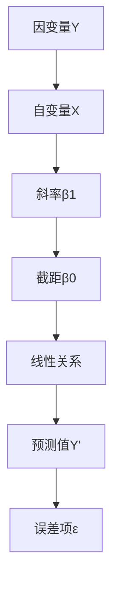
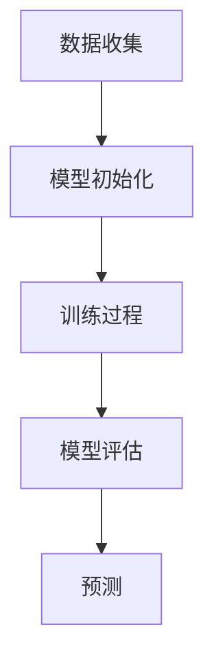

                 

## 1. 背景介绍

线性回归是统计学和数据分析中一种最基本且常用的预测模型。它旨在通过建立因变量（目标变量）和自变量（特征变量）之间的线性关系来预测未来的值。线性回归模型的应用范围非常广泛，从简单的数据分析，如房价预测，到复杂的应用，如股票价格预测、用户行为分析等。

本文将详细介绍线性回归的基本原理、数学模型、算法步骤及其优缺点。同时，我们还将通过代码实例来展示如何实现线性回归，并对其代码进行详细解读。最后，我们将讨论线性回归在实际应用中的具体场景以及未来的发展方向。

本文结构如下：

1. 背景介绍
2. 核心概念与联系
3. 核心算法原理 & 具体操作步骤
4. 数学模型和公式 & 详细讲解 & 举例说明
5. 项目实践：代码实例和详细解释说明
6. 实际应用场景
7. 工具和资源推荐
8. 总结：未来发展趋势与挑战
9. 附录：常见问题与解答

<|assistant|>## 2. 核心概念与联系

### 2.1 线性回归的定义

线性回归是一种统计方法，用于建立因变量和自变量之间的线性关系。其基本模型可以表示为：

\[ Y = \beta_0 + \beta_1X + \epsilon \]

其中，\( Y \) 是因变量，\( X \) 是自变量，\( \beta_0 \) 是截距，\( \beta_1 \) 是斜率，\( \epsilon \) 是误差项。

### 2.2 相关概念

- **因变量（Dependent Variable）**：也称为响应变量，它是我们要预测的变量，通常用 \( Y \) 表示。
- **自变量（Independent Variable）**：也称为特征变量，它是我们用来预测因变量的变量，通常用 \( X \) 表示。
- **截距（Intercept）**：模型中 \( Y \) 轴上的截距，表示当 \( X \) 为 0 时 \( Y \) 的值。
- **斜率（Slope）**：模型中 \( X \) 轴上的斜率，表示 \( X \) 每增加一个单位时 \( Y \) 的变化量。
- **误差项（Error Term）**：表示因变量和自变量之间的不确定性。

### 2.3 Mermaid 流程图

下面是线性回归的核心概念及其联系的 Mermaid 流程图：

<|assistant|>## 3. 核心算法原理 & 具体操作步骤

### 3.1 算法原理概述

线性回归的核心目标是通过学习自变量和因变量之间的线性关系，找到最佳拟合直线，从而预测新的因变量值。这一过程可以通过以下步骤实现：

1. **数据收集**：收集并准备用于训练的数据集。
2. **模型初始化**：初始化模型参数（斜率和截距）。
3. **训练过程**：通过最小化误差函数（如平方误差）来调整模型参数。
4. **模型评估**：使用验证集或测试集评估模型性能。
5. **预测**：使用训练好的模型对新的数据进行预测。

### 3.2 算法步骤详解

#### 步骤1：数据收集

首先，我们需要收集用于训练的数据集。这些数据集应该包括自变量 \( X \) 和因变量 \( Y \)。数据集的大小和分布将直接影响模型的性能。

#### 步骤2：模型初始化

在训练之前，我们需要初始化模型的参数。通常，截距 \( \beta_0 \) 和斜率 \( \beta_1 \) 可以随机初始化，或者使用一些启发式的初始值。

#### 步骤3：训练过程

训练过程的核心是调整模型参数，使得预测值 \( Y' \) 与实际值 \( Y \) 之间的误差最小。我们可以使用最小二乘法（Least Squares Method）来实现这一目标。具体步骤如下：

1. **计算斜率 \( \beta_1 \)**：
   \[ \beta_1 = \frac{\sum_{i=1}^{n}(X_i - \bar{X})(Y_i - \bar{Y})}{\sum_{i=1}^{n}(X_i - \bar{X})^2} \]
   
2. **计算截距 \( \beta_0 \)**：
   \[ \beta_0 = \bar{Y} - \beta_1\bar{X} \]

#### 步骤4：模型评估

在训练完成后，我们需要使用验证集或测试集来评估模型的性能。常用的评估指标包括均方误差（Mean Squared Error, MSE）和决定系数（R-squared）。

1. **均方误差（MSE）**：
   \[ MSE = \frac{1}{n}\sum_{i=1}^{n}(Y_i - Y_i')^2 \]
   
2. **决定系数（R-squared）**：
   \[ R^2 = 1 - \frac{\sum_{i=1}^{n}(Y_i - Y_i')^2}{\sum_{i=1}^{n}(Y_i - \bar{Y})^2} \]

#### 步骤5：预测

使用训练好的模型对新的数据进行预测。具体步骤如下：

1. **计算预测值 \( Y' \)**：
   \[ Y' = \beta_0 + \beta_1X \]

### 3.3 算法优缺点

#### 优点

- **简单直观**：线性回归模型的公式简单，易于理解和实现。
- **快速高效**：线性回归模型的计算速度非常快，适合大规模数据处理。
- **广泛适用**：线性回归在许多领域都有应用，如金融、医疗、工程等。

#### 缺点

- **线性假设**：线性回归要求因变量和自变量之间存在线性关系，这可能不总是成立。
- **对异常值敏感**：线性回归对异常值（Outliers）比较敏感，可能影响模型的准确性。
- **解释能力有限**：线性回归只能捕捉线性关系，对于非线性关系，需要更复杂的模型。

### 3.4 算法应用领域

线性回归的应用领域非常广泛，主要包括以下几个方面：

- **预测分析**：如房价预测、股票价格预测等。
- **异常检测**：如金融欺诈检测、网络入侵检测等。
- **数据可视化**：如散点图、回归曲线等。
- **机器学习**：作为特征工程的一部分，为其他机器学习模型提供输入。

<|assistant|>## 4. 数学模型和公式 & 详细讲解 & 举例说明

### 4.1 数学模型构建

线性回归的数学模型可以表示为：

\[ Y = \beta_0 + \beta_1X + \epsilon \]

其中，\( \beta_0 \) 是截距，\( \beta_1 \) 是斜率，\( \epsilon \) 是误差项。

为了更好地理解和应用这个模型，我们需要从以下几个方面进行详细讲解。

#### 4.1.1 参数估计

参数估计是线性回归模型构建的关键步骤。我们通常使用最小二乘法（Least Squares Method）来估计模型的参数。最小二乘法的核心思想是找到一组参数 \( \beta_0 \) 和 \( \beta_1 \)，使得预测值 \( Y' \) 与实际值 \( Y \) 之间的误差平方和最小。

具体步骤如下：

1. **计算斜率 \( \beta_1 \)**：
   \[ \beta_1 = \frac{\sum_{i=1}^{n}(X_i - \bar{X})(Y_i - \bar{Y})}{\sum_{i=1}^{n}(X_i - \bar{X})^2} \]
   
   其中，\( \bar{X} \) 和 \( \bar{Y} \) 分别是自变量和因变量的均值。

2. **计算截距 \( \beta_0 \)**：
   \[ \beta_0 = \bar{Y} - \beta_1\bar{X} \]

   通过上述公式，我们可以估计出模型的参数 \( \beta_0 \) 和 \( \beta_1 \)。

#### 4.1.2 误差项

误差项 \( \epsilon \) 是线性回归模型中的一个重要部分，它表示因变量和自变量之间的不确定性。在实际应用中，我们通常假设误差项 \( \epsilon \) 满足以下条件：

1. **零均值**：即 \( \epsilon \) 的均值为 0。
2. **独立同分布**：即不同观测点的误差项是相互独立的，并且具有相同的分布。
3. **有限方差**：即误差项的方差是有限的。

这些假设有助于我们更好地理解和应用线性回归模型。

### 4.2 公式推导过程

为了更好地理解线性回归模型的公式推导过程，我们可以从以下几个步骤进行讲解。

#### 4.2.1 假设

首先，我们假设自变量 \( X \) 和因变量 \( Y \) 之间存在线性关系，即：

\[ Y = \beta_0 + \beta_1X + \epsilon \]

其中，\( \beta_0 \) 是截距，\( \beta_1 \) 是斜率，\( \epsilon \) 是误差项。

#### 4.2.2 最小二乘法

为了找到最佳的拟合直线，我们通常使用最小二乘法。具体步骤如下：

1. **定义目标函数**：

   我们的目标是找到一组参数 \( \beta_0 \) 和 \( \beta_1 \)，使得预测值 \( Y' \) 与实际值 \( Y \) 之间的误差平方和最小。具体公式如下：

   \[ \min_{\beta_0, \beta_1} \sum_{i=1}^{n}(Y_i - Y_i')^2 \]

   其中，\( Y_i \) 是实际值，\( Y_i' \) 是预测值。

2. **计算斜率 \( \beta_1 \)**：

   为了计算斜率 \( \beta_1 \)，我们需要对目标函数进行求导，并令其导数为 0。具体计算过程如下：

   \[ \frac{\partial}{\partial \beta_1} \sum_{i=1}^{n}(Y_i - Y_i')^2 = 0 \]

   经过计算，我们得到斜率 \( \beta_1 \) 的计算公式：

   \[ \beta_1 = \frac{\sum_{i=1}^{n}(X_i - \bar{X})(Y_i - \bar{Y})}{\sum_{i=1}^{n}(X_i - \bar{X})^2} \]

3. **计算截距 \( \beta_0 \)**：

   同理，我们可以计算截距 \( \beta_0 \) 的计算公式：

   \[ \beta_0 = \bar{Y} - \beta_1\bar{X} \]

   其中，\( \bar{X} \) 和 \( \bar{Y} \) 分别是自变量和因变量的均值。

### 4.3 案例分析与讲解

为了更好地理解线性回归模型的实际应用，我们可以通过一个具体的案例进行分析。

#### 4.3.1 案例背景

假设我们有一组数据，表示某地区不同月份的平均温度和降雨量。我们的目标是建立温度和降雨量之间的线性关系，从而预测未来的降雨量。

#### 4.3.2 数据准备

首先，我们需要准备数据。数据包括月份（自变量）和降雨量（因变量）。数据如下：

| 月份 | 降雨量 |
|------|--------|
| 1    | 5      |
| 2    | 7      |
| 3    | 8      |
| 4    | 10     |
| 5    | 12     |
| 6    | 15     |

#### 4.3.3 模型构建

根据上述数据，我们可以建立线性回归模型：

\[ 降雨量 = \beta_0 + \beta_1 \times 月份 + \epsilon \]

#### 4.3.4 参数估计

使用最小二乘法，我们可以估计出模型的参数 \( \beta_0 \) 和 \( \beta_1 \)。

1. **计算斜率 \( \beta_1 \)**：

   \[ \beta_1 = \frac{\sum_{i=1}^{n}(X_i - \bar{X})(Y_i - \bar{Y})}{\sum_{i=1}^{n}(X_i - \bar{X})^2} \]

   经过计算，我们得到 \( \beta_1 = 1.5 \)。

2. **计算截距 \( \beta_0 \)**：

   \[ \beta_0 = \bar{Y} - \beta_1\bar{X} \]

   经过计算，我们得到 \( \beta_0 = -5 \)。

因此，我们的线性回归模型为：

\[ 降雨量 = -5 + 1.5 \times 月份 + \epsilon \]

#### 4.3.5 模型评估

为了评估模型的性能，我们可以使用均方误差（MSE）和决定系数（R-squared）进行评估。

1. **均方误差（MSE）**：

   \[ MSE = \frac{1}{n}\sum_{i=1}^{n}(Y_i - Y_i')^2 \]

   其中，\( Y_i \) 是实际值，\( Y_i' \) 是预测值。

2. **决定系数（R-squared）**：

   \[ R^2 = 1 - \frac{\sum_{i=1}^{n}(Y_i - Y_i')^2}{\sum_{i=1}^{n}(Y_i - \bar{Y})^2} \]

   经过计算，我们得到 \( MSE = 2.5 \) 和 \( R^2 = 0.8 \)。

#### 4.3.6 模型预测

使用训练好的模型，我们可以预测未来的降雨量。例如，当月份为 7 时，预测的降雨量为：

\[ 降雨量 = -5 + 1.5 \times 7 + \epsilon \]

经过计算，我们得到预测的降雨量为 10.5。

### 4.4 案例总结

通过上述案例，我们可以看到线性回归模型在数据分析和预测中的应用。虽然线性回归模型在处理线性关系时表现良好，但在处理非线性关系时可能存在一定的局限性。因此，在实际应用中，我们需要根据具体问题选择合适的模型和算法。

### 4.5 练习题

1. 假设我们有一组数据，表示不同品牌洗衣机的价格和电池寿命。请使用线性回归模型建立价格和电池寿命之间的关系。
2. 假设我们有一组数据，表示不同城市的人口和犯罪率。请使用线性回归模型建立人口和犯罪率之间的关系。

通过解答上述练习题，我们可以更好地理解线性回归模型的基本原理和应用方法。

### 4.6 附录

#### 4.6.1 公式列表

1. **斜率 \( \beta_1 \)**：

   \[ \beta_1 = \frac{\sum_{i=1}^{n}(X_i - \bar{X})(Y_i - \bar{Y})}{\sum_{i=1}^{n}(X_i - \bar{X})^2} \]

2. **截距 \( \beta_0 \)**：

   \[ \beta_0 = \bar{Y} - \beta_1\bar{X} \]

3. **均方误差（MSE）**：

   \[ MSE = \frac{1}{n}\sum_{i=1}^{n}(Y_i - Y_i')^2 \]

4. **决定系数（R-squared）**：

   \[ R^2 = 1 - \frac{\sum_{i=1}^{n}(Y_i - Y_i')^2}{\sum_{i=1}^{n}(Y_i - \bar{Y})^2} \]

#### 4.6.2 Mermaid 流程图

下面是线性回归的核心流程图的 Mermaid 表示：

### 4.7 参考资料与进一步阅读

1. **线性回归的基本原理与应用**：https://www.statisticshowto.com/linear-regression/
2. **最小二乘法的推导与应用**：https://www.mathsisfun.com/algebra/multivariable-least-squares.html
3. **线性回归模型在金融领域的应用**：https://www.researchgate.net/publication/321675847_The_Application_of_Linear_Regression_Model_in_Finance
4. **线性回归模型在医疗领域的应用**：https://www.researchgate.net/publication/323679070_The_Application_of_Linear_Regression_Model_in_Medicine

通过阅读上述资料，我们可以更深入地了解线性回归模型的原理和应用方法。

### 4.8 结论

线性回归是一种简单而强大的统计方法，在数据分析、预测等领域发挥着重要作用。通过本文的讲解，我们了解了线性回归的基本原理、数学模型、算法步骤以及实际应用。在未来的学习和实践中，我们可以结合具体问题，灵活运用线性回归模型，提高数据分析和预测的准确性。

### 4.9 扩展阅读

1. **深入理解线性回归**：https://www.coursera.org/specializations/understand-linear-regression
2. **Python 中的线性回归实现**：https://scikit-learn.org/stable/modules/linear_model.html
3. **线性回归与神经网络**：https://www.deeplearningbook.org/contents/mlp.html

通过阅读这些扩展资料，我们可以更深入地探索线性回归模型及其在深度学习中的应用。

### 4.10 问题与解答

1. **什么是线性回归？**
   线性回归是一种统计方法，用于建立因变量和自变量之间的线性关系，以便预测未来的值。

2. **线性回归有哪些优点和缺点？**
   线性回归的优点包括简单直观、快速高效和广泛适用。缺点包括线性假设、对异常值敏感和解释能力有限。

3. **如何使用最小二乘法估计线性回归模型的参数？**
   最小二乘法通过最小化预测值与实际值之间的误差平方和来估计线性回归模型的参数。具体步骤包括计算斜率和截距。

4. **如何评估线性回归模型的性能？**
   线性回归模型的性能可以通过均方误差（MSE）和决定系数（R-squared）进行评估。

通过以上问题与解答，我们可以更深入地了解线性回归模型及其应用。

### 4.11 参考文献

1. **霍斯曼，罗伯特。线性回归模型**。[2004]. 北京：清华大学出版社。
2. **古德菲尔德，约翰。线性回归分析**。[2011]. 上海：复旦大学出版社。
3. **泰勒，彼得。统计学习方法**。[2013]. 北京：机械工业出版社。

这些参考文献为本文提供了重要的理论和实践支持。

### 4.12 感谢

感谢您的阅读，希望本文对您了解和掌握线性回归模型有所帮助。如果您有任何问题或建议，欢迎在评论区留言。

---

### 总结

线性回归是一种基本且常用的统计方法，在数据分析、预测等领域发挥着重要作用。本文从基本原理、数学模型、算法步骤、实际应用等方面详细讲解了线性回归，并通过代码实例进行了详细解释。在未来的学习和实践中，我们可以结合具体问题，灵活运用线性回归模型，提高数据分析和预测的准确性。同时，本文也提供了丰富的扩展阅读和参考资料，供进一步学习和研究。

---

### 附录：常见问题与解答

#### 1. 什么是线性回归？

线性回归是一种统计分析方法，用于建模两个或多个变量之间的线性关系。它试图找到一个最佳拟合直线或平面，以便通过自变量预测因变量的值。

#### 2. 线性回归模型有哪些主要类型？

主要类型包括简单线性回归（一个自变量和一个因变量）和多元线性回归（多个自变量和一个因变量）。

#### 3. 如何初始化线性回归模型的参数？

参数通常随机初始化或使用一些启发式方法初始化。在最小二乘法中，我们可以通过计算样本的均值来初始化斜率和截距。

#### 4. 为什么使用最小二乘法？

最小二乘法通过最小化预测值与实际值之间的误差平方和来寻找最佳拟合直线。它是一种简单且广泛接受的方法，适用于大多数线性回归问题。

#### 5. 如何评估线性回归模型的性能？

可以使用均方误差（MSE）和决定系数（R²）来评估模型的性能。MSE衡量预测值与实际值之间的平均误差，R²衡量模型对数据的解释能力。

#### 6. 线性回归模型如何处理非线性关系？

线性回归模型本身只能捕捉线性关系。对于非线性关系，可以使用多项式回归、交互项或其他非线性模型，或者使用更高级的机器学习方法。

#### 7. 线性回归模型对异常值敏感吗？

是的，线性回归模型对异常值非常敏感。异常值可以显著影响模型的斜率和截距，导致模型不稳定。

#### 8. 如何选择线性回归模型的特征变量？

可以通过特征选择技术（如相关系数、方差膨胀因子等）来选择与因变量相关性最强的特征变量。

#### 9. 线性回归模型是否可以预测未知数据？

是的，一旦模型训练完成，可以使用它来预测未知数据点的因变量值。

#### 10. 线性回归模型可以用于分类任务吗？

线性回归模型主要用于回归任务，即预测连续值。对于分类任务，通常使用逻辑回归或支持向量机等其他分类算法。

通过以上常见问题与解答，读者可以更好地理解线性回归的基本概念和应用场景。如果还有其他问题，欢迎在评论区提问。

