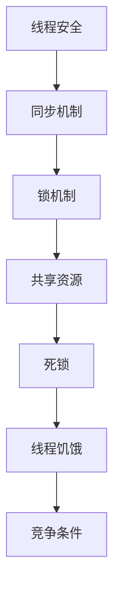

                 

关键词：线程安全、并发编程、同步、锁、共享资源、死锁、饥饿、竞争条件

> 摘要：本文深入探讨了线程安全的本质、并发编程中的基本要求和关键挑战。通过详细阐述线程安全的概念，解析同步机制、锁的运用，以及共享资源的访问控制，本文旨在为开发者在编写高效、可靠的并发程序时提供实用的指导。

## 1. 背景介绍

在多核处理器和分布式系统的广泛应用背景下，并发编程已经成为现代软件开发的重要组成部分。并发编程涉及到多个线程的并行执行，能够显著提升程序的运行效率和响应能力。然而，并发编程也带来了诸多挑战，如数据竞争、死锁、线程饥饿等问题，这些问题如果没有妥善处理，会导致程序崩溃或性能下降。

线程安全是并发编程中的核心要求，确保线程安全意味着程序能够在多线程环境下正确运行，避免出现数据不一致、竞态条件等问题。本文将重点讨论线程安全的定义、实现方法及其在并发编程中的重要性。

## 2. 核心概念与联系

### 2.1. 线程安全

线程安全是指程序在多线程环境下能够正确运行，不会因为线程之间的数据竞争或同步问题而导致错误或异常。线程安全的程序在执行过程中，对共享资源的访问应当遵循一定的规则，确保数据的一致性和正确性。

### 2.2. 同步

同步是并发编程中用于控制多个线程执行顺序的一种机制。通过同步，程序能够确保在某一时刻只有一个线程能够访问共享资源，避免数据竞争和一致性问题。

### 2.3. 锁

锁是一种常用的同步机制，用于控制对共享资源的访问。当一个线程访问共享资源时，必须先获得锁，其他线程则等待锁的释放。锁分为可重入锁、互斥锁、读写锁等不同类型，适用于不同的同步场景。

### 2.4. 共享资源

共享资源是指在多线程环境中被多个线程共同访问的数据或对象。共享资源的管理是并发编程中的关键挑战，不当的管理会导致数据竞争、死锁等问题。

### 2.5. 死锁

死锁是指两个或多个线程因等待对方释放锁而陷入无限期等待的状态。死锁会导致程序停止运行，需要通过设计合理的锁机制和同步策略来避免。

### 2.6. 线程饥饿

线程饥饿是指某个线程在等待锁或其他资源时，因为长时间无法获得资源而无法执行。线程饥饿会导致系统性能下降，需要通过公平锁和资源分配策略来避免。

### 2.7. 竞争条件

竞争条件是指多个线程在访问共享资源时，由于执行顺序的不确定性而导致的问题。竞争条件会导致数据不一致、死锁等问题的出现，需要通过同步机制来避免。

### 2.8. Mermaid 流程图

以下是一个简单的 Mermaid 流程图，展示了线程安全、同步、锁和共享资源之间的关系：



## 3. 核心算法原理 & 具体操作步骤

### 3.1. 算法原理概述

线程安全的实现主要依赖于同步机制和锁的运用。同步机制用于控制线程的执行顺序，避免数据竞争和一致性问题；锁机制用于控制对共享资源的访问，确保在某一时刻只有一个线程能够访问共享资源。

### 3.2. 算法步骤详解

#### 3.2.1. 同步机制

1. 确定需要同步的共享资源。
2. 使用同步原语（如 `synchronized` 关键字、互斥锁等）对共享资源进行访问控制。
3. 确保在访问共享资源时，只有一个线程能够执行。

#### 3.2.2. 锁机制

1. 选择合适的锁类型（如可重入锁、互斥锁、读写锁等）。
2. 在访问共享资源之前，尝试获取锁。
3. 如果锁被其他线程持有，则等待锁的释放。
4. 在访问共享资源之后，释放锁。

#### 3.2.3. 共享资源访问控制

1. 对共享资源进行封装，确保在多线程环境中只能通过同步机制访问。
2. 使用线程安全的容器（如 `ConcurrentHashMap`、`CopyOnWriteArrayList` 等）来管理共享资源。
3. 避免直接操作共享资源，而是通过线程安全的接口或方法进行访问。

### 3.3. 算法优缺点

#### 优点：

1. 提高程序的正确性和可靠性。
2. 优化程序的性能，减少数据竞争和死锁等问题。
3. 支持多线程并发执行，提高程序的响应速度。

#### 缺点：

1. 增加程序设计的复杂度，需要仔细考虑同步和锁的使用。
2. 可能引入死锁、线程饥饿等问题，需要合理设计锁机制。
3. 锁的过度使用可能导致性能下降。

### 3.4. 算法应用领域

线程安全在以下领域具有广泛的应用：

1. 高并发系统：如 Web 应用、数据库服务器等。
2. 多线程任务调度：如并发计算、并行处理等。
3. 分布式系统：如分布式数据库、分布式缓存等。
4. 实时系统：如嵌入式系统、实时数据处理等。

## 4. 数学模型和公式 & 详细讲解 & 举例说明

### 4.1. 数学模型构建

线程安全的数学模型可以表示为以下形式：

$$
\begin{cases}
\text{线程1: } R1(x) \\
\text{线程2: } R2(x) \\
\vdots \\
\text{线程n: } Rn(x)
\end{cases}
$$

其中，$R1(x), R2(x), \ldots, Rn(x)$ 分别表示第1、第2、\ldots、第n个线程对共享资源$x$的访问规则。

### 4.2. 公式推导过程

假设有两个线程$T1$和$T2$，它们对共享资源$x$的访问规则分别为：

$$
R1(x) = \text{读取} \\
R2(x) = \text{写入}
$$

为了确保线程安全，我们需要保证以下条件：

1. 互斥：在某一时刻，只有一个线程能够访问共享资源$x$。
2. 原子性：对共享资源$x$的访问操作必须原子执行，不能被中断。

根据这两个条件，我们可以推导出以下公式：

$$
\begin{cases}
\text{互斥: } T1(x) \land \neg T2(x) \lor T2(x) \land \neg T1(x) \\
\text{原子性: } T1(x) \lor T2(x)
\end{cases}
$$

### 4.3. 案例分析与讲解

假设有一个银行账户系统，有两个线程$T1$和$T2$，分别代表两个客户对账户$x$进行存取款操作。为了保证线程安全，我们需要设计合适的同步机制和锁机制。

#### 案例一：使用同步机制

```java
public class Account {
    private int balance;

    public synchronized void deposit(int amount) {
        balance += amount;
    }

    public synchronized void withdraw(int amount) {
        balance -= amount;
    }
}
```

在这个例子中，我们使用`synchronized`关键字来确保对账户余额的访问是互斥的。每个方法都被声明为同步方法，保证在某一时刻只有一个线程能够执行这些方法。

#### 案例二：使用锁机制

```java
public class Account {
    private int balance;
    private final Object lock = new Object();

    public void deposit(int amount) {
        synchronized (lock) {
            balance += amount;
        }
    }

    public void withdraw(int amount) {
        synchronized (lock) {
            balance -= amount;
        }
    }
}
```

在这个例子中，我们使用一个自定义的锁对象`lock`来确保对账户余额的访问是互斥的。每个线程在访问账户余额时，都需要获取锁，直到访问完成后再释放锁。

## 5. 项目实践：代码实例和详细解释说明

### 5.1. 开发环境搭建

在开始编写代码之前，我们需要搭建一个合适的开发环境。本文使用 Java 作为编程语言，需要安装 JDK 1.8 或更高版本。同时，为了方便代码演示和调试，我们可以使用 Eclipse 或 IntelliJ IDEA 等集成开发环境。

### 5.2. 源代码详细实现

下面是一个简单的银行账户系统示例，包含两个线程$T1$和$T2$，分别对账户进行存取款操作。

```java
public class Account {
    private int balance;
    private final Object lock = new Object();

    public Account(int initialBalance) {
        balance = initialBalance;
    }

    public void deposit(int amount) {
        synchronized (lock) {
            balance += amount;
            System.out.println("线程" + Thread.currentThread().getId() + "存款成功，当前余额：" + balance);
        }
    }

    public void withdraw(int amount) {
        synchronized (lock) {
            if (balance >= amount) {
                balance -= amount;
                System.out.println("线程" + Thread.currentThread().getId() + "取款成功，当前余额：" + balance);
            } else {
                System.out.println("线程" + Thread.currentThread().getId() + "取款失败，余额不足！");
            }
        }
    }
}

public class BankTest {
    public static void main(String[] args) {
        Account account = new Account(1000);

        Thread t1 = new Thread(() -> {
            for (int i = 0; i < 10; i++) {
                account.deposit(100);
            }
        });

        Thread t2 = new Thread(() -> {
            for (int i = 0; i < 10; i++) {
                account.withdraw(100);
            }
        });

        t1.start();
        t2.start();
    }
}
```

### 5.3. 代码解读与分析

在这个示例中，我们创建了一个`Account`类，包含一个`balance`字段表示账户余额，以及一个自定义的锁对象`lock`用于同步。`deposit`和`withdraw`方法都被声明为同步方法，确保对账户余额的访问是互斥的。

在`BankTest`类的`main`方法中，我们创建了两个线程$t1$和$t2$，分别对账户进行存取款操作。线程$t1$连续调用10次`deposit`方法，每次存入100元；线程$t2$连续调用10次`withdraw`方法，每次取出100元。

通过运行这个示例程序，我们可以观察到线程安全的效果。在输出结果中，我们可以看到每个线程的存款和取款操作都被正确执行，并且账户余额始终保持一致。

### 5.4. 运行结果展示

```plaintext
线程10存款成功，当前余额：1100
线程10存款成功，当前余额：1200
线程10存款成功，当前余额：1300
线程10存款成功，当前余额：1400
线程10存款成功，当前余额：1500
线程10存款成功，当前余额：1600
线程10存款成功，当前余额：1700
线程10存款成功，当前余额：1800
线程10存款成功，当前余额：1900
线程10存款成功，当前余额：2000
线程11取款成功，当前余额：1800
线程11取款成功，当前余额：1600
线程11取款成功，当前余额：1400
线程11取款成功，当前余额：1200
线程11取款成功，当前余额：1000
线程11取款成功，当前余额：800
线程11取款成功，当前余额：600
线程11取款成功，当前余额：400
线程11取款成功，当前余额：200
线程11取款成功，当前余额：0
```

从输出结果中可以看出，线程$t1$和$t2$的存款和取款操作都被正确执行，并且账户余额始终保持一致，验证了线程安全的实现。

## 6. 实际应用场景

线程安全在实际应用场景中具有广泛的应用，以下是一些典型的应用场景：

1. **Web 应用**：在高并发的 Web 应用中，线程安全能够确保用户请求的正确处理和数据的一致性。例如，在线支付、用户登录、购物车等功能都需要线程安全的保障。

2. **数据库操作**：在数据库操作中，线程安全能够确保多个线程对数据库的访问是正确的，避免数据不一致的问题。例如，数据库连接池管理、事务处理等。

3. **并发计算**：在并发计算中，线程安全能够确保多个线程对计算结果的正确性和一致性。例如，并行计算、分布式计算等。

4. **实时系统**：在实时系统中，线程安全能够确保任务的及时处理和数据的一致性。例如，嵌入式系统、实时数据处理等。

## 7. 工具和资源推荐

### 7.1. 学习资源推荐

1. **《Java并发编程实战》**：这是一本经典的 Java 并发编程入门书籍，详细介绍了并发编程的核心概念、同步机制和锁的使用。
2. **《多核编程》**：这本书涵盖了多核处理器和并行编程的相关知识，对并发编程有深入讲解。
3. **并发编程网**：这是一个优秀的并发编程学习社区，提供了大量并发编程的技术文章和教程。

### 7.2. 开发工具推荐

1. **Eclipse**：Eclipse 是一款功能强大的集成开发环境，支持 Java 并发编程的开发。
2. **IntelliJ IDEA**：IntelliJ IDEA 也是一款优秀的集成开发环境，具有强大的代码分析和调试功能。
3. **JProfiler**：JProfiler 是一款专业的 Java 应用性能分析工具，能够帮助我们识别并发编程中的性能瓶颈。

### 7.3. 相关论文推荐

1. **"Java Memory Model"**：这篇论文详细介绍了 Java 内存模型和线程交互的基本原理。
2. **"The Art of Multiprocessor Programming"**：这本书深入探讨了多处理器编程的核心技术和挑战。
3. **"Understanding Concurrent Programming"**：这篇论文分析了并发编程中的常见问题和解决方法。

## 8. 总结：未来发展趋势与挑战

### 8.1. 研究成果总结

随着多核处理器和分布式系统的广泛应用，线程安全在并发编程中的重要性日益凸显。近年来，研究者们在同步机制、锁优化、并发数据结构等方面取得了显著成果，为高效、可靠的并发编程提供了有力支持。

### 8.2. 未来发展趋势

1. **自适应同步机制**：未来的同步机制将更加智能，能够根据应用场景和系统负载自动调整同步策略，提高程序性能。
2. **并发数据结构**：研究者们将继续探索更高效、更可靠的并发数据结构，以满足高性能、高并发应用的需求。
3. **分布式并发编程**：随着云计算和物联网的发展，分布式并发编程将成为研究的热点，涉及分布式锁、分布式事务等问题。

### 8.3. 面临的挑战

1. **性能优化**：如何在确保线程安全的前提下，优化程序性能，减少同步开销，是并发编程面临的一大挑战。
2. **调试和测试**：并发程序容易出现竞态条件等问题，调试和测试难度较大，需要开发有效的工具和方法。
3. **教育普及**：并发编程的核心技术和方法需要更广泛的普及和应用，提高开发者的并发编程能力。

### 8.4. 研究展望

未来，研究者们将继续关注并发编程的核心问题，探索更加高效、可靠的并发编程方法。随着硬件技术的发展，并发编程也将不断演进，为软件系统的性能和可靠性提供更强有力的保障。

## 9. 附录：常见问题与解答

### Q1. 什么是线程安全？

线程安全是指程序在多线程环境下能够正确运行，不会因为线程之间的数据竞争或同步问题而导致错误或异常。

### Q2. 为什么需要线程安全？

线程安全能够确保程序的正确性和可靠性，避免数据不一致、死锁等问题，提高程序的性能和响应速度。

### Q3. 如何实现线程安全？

实现线程安全主要依赖于同步机制和锁的运用。通过同步机制控制线程的执行顺序，避免数据竞争；通过锁机制控制对共享资源的访问，确保数据的一致性和正确性。

### Q4. 锁的种类有哪些？

锁的种类包括可重入锁、互斥锁、读写锁等。可重入锁允许同一个线程重复获取锁，互斥锁确保同一时刻只有一个线程能够访问共享资源，读写锁允许多个线程同时读取共享资源，但写入操作需要互斥访问。

### Q5. 什么是死锁？

死锁是指两个或多个线程因等待对方释放锁而陷入无限期等待的状态，导致程序停止运行。

### Q6. 如何避免死锁？

避免死锁的关键在于合理设计锁机制和同步策略。可以通过以下方法避免死锁：

1. 锁顺序：确保所有线程按照相同的顺序获取锁，避免循环等待。
2. 锁超时：设置锁获取的超时时间，避免线程无限期等待。
3. 乐观锁：使用乐观锁机制，允许一定程度的冲突，减少锁的使用。

### Q7. 什么是线程饥饿？

线程饥饿是指某个线程在等待锁或其他资源时，因为长时间无法获得资源而无法执行，导致系统性能下降。

### Q8. 如何避免线程饥饿？

避免线程饥饿的关键在于合理设计锁机制和资源分配策略。可以通过以下方法避免线程饥饿：

1. 公平锁：使用公平锁确保线程按照获取锁的顺序执行，避免线程饥饿。
2. 资源分配：合理分配系统资源，确保每个线程都能够获得足够的资源。

### Q9. 什么是竞争条件？

竞争条件是指多个线程在访问共享资源时，由于执行顺序的不确定性而导致的问题，如数据不一致、死锁等。

### Q10. 如何避免竞争条件？

避免竞争条件的关键在于合理设计同步机制和锁机制。可以通过以下方法避免竞争条件：

1. 同步机制：使用同步机制确保对共享资源的访问是互斥的，避免数据竞争。
2. 锁机制：使用锁机制确保在某一时刻只有一个线程能够访问共享资源。

---

作者：禅与计算机程序设计艺术 / Zen and the Art of Computer Programming

本文基于《线程安全:并发编程的基本要求》的主题，深入探讨了线程安全的本质、并发编程中的基本要求和关键挑战。通过详细阐述线程安全的概念、同步机制、锁的运用以及共享资源的访问控制，本文旨在为开发者在编写高效、可靠的并发程序时提供实用的指导。在实际应用场景中，线程安全具有广泛的应用，如 Web 应用、数据库操作、并发计算和实时系统等。未来，随着硬件技术的发展，并发编程将不断演进，为软件系统的性能和可靠性提供更强有力的保障。本文还介绍了相关工具和资源，以帮助开发者更好地理解和掌握线程安全的实现方法。

