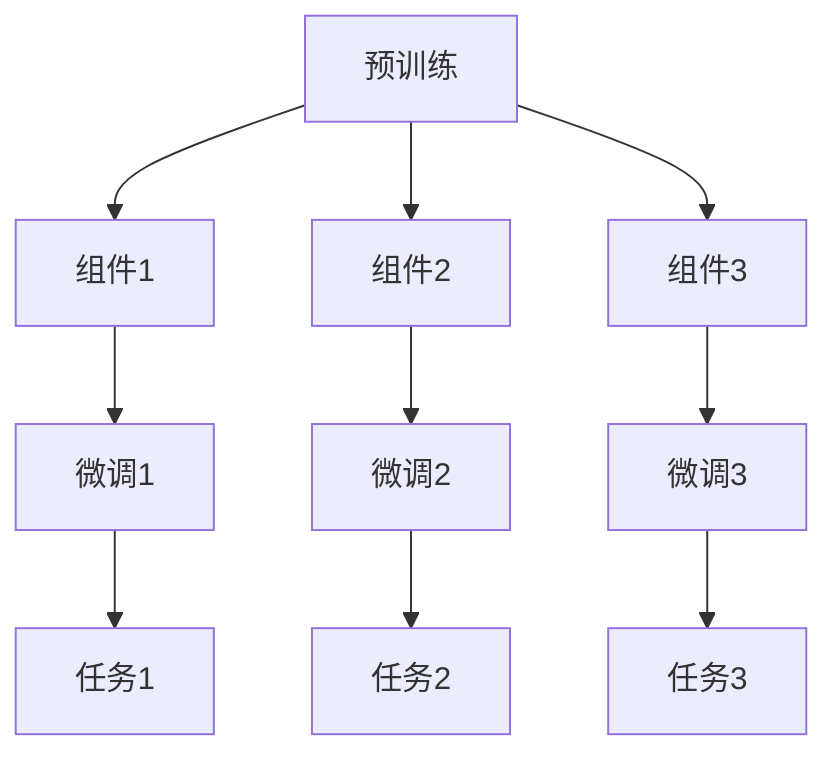

                 

关键词：组件化AI、预训练、微调、神经网络、模型优化、AI应用、算法效率、技术挑战

> 摘要：本文深入探讨了组件化AI的核心理念，以及预训练与微调之间的平衡。通过详细分析核心算法原理、数学模型构建、项目实践和实际应用场景，本文旨在为AI开发者提供一种高效、可扩展的AI系统构建方法，从而推动AI技术的广泛应用。

## 1. 背景介绍

随着人工智能技术的飞速发展，深度学习模型在图像识别、自然语言处理、推荐系统等领域取得了显著的成果。传统的深度学习模型通常需要大量的数据和计算资源进行训练，而随着模型复杂度的增加，训练时间也在成倍增长。为了解决这一问题，研究者们提出了组件化AI的概念。

组件化AI是一种通过将大型深度学习模型拆分为若干可复用的组件，从而提高训练效率、降低计算成本的方法。这种方法的核心在于预训练与微调的平衡，即在预训练阶段利用大量数据使模型获得通用性，在微调阶段利用少量数据进行领域特定任务的优化。

## 2. 核心概念与联系

### 2.1 预训练

预训练（Pre-training）是指在特定领域或任务上，通过大量数据对深度学习模型进行训练，使其获得一定的通用特征表示。在预训练过程中，模型通常使用未标记的数据进行训练，以达到对数据分布的适应。

### 2.2 微调

微调（Fine-tuning）是指在实际任务中，利用少量标记数据进行模型的进一步优化。通过微调，模型可以针对特定领域或任务进行更加精确的调整，从而提高任务性能。

### 2.3 组件化AI架构

组件化AI架构（Component-based AI Architecture）是一种将深度学习模型拆分为多个可复用的组件的方法。这些组件可以独立训练和优化，从而提高模型的训练效率和可扩展性。组件化AI架构的核心在于预训练和微调的平衡，即如何合理地划分组件，使得每个组件都能在预训练阶段获得通用性，同时在微调阶段具备领域特异性。

## 2.4 Mermaid 流程图



## 3. 核心算法原理 & 具体操作步骤

### 3.1 算法原理概述

组件化AI的核心算法包括预训练和微调两个阶段。预训练阶段主要利用大量未标记数据进行模型训练，以获得通用特征表示；微调阶段则利用少量标记数据对模型进行领域特定任务的优化。

### 3.2 算法步骤详解

#### 3.2.1 预训练

1. 数据准备：收集大量未标记数据，如文本、图像等。
2. 模型初始化：使用预训练模型作为基础，如BERT、GPT等。
3. 模型训练：在未标记数据上训练模型，使用交叉熵损失函数。
4. 模型保存：保存预训练后的模型，以便后续微调。

#### 3.2.2 微调

1. 数据准备：收集少量标记数据，如特定领域的数据集。
2. 模型初始化：加载预训练后的模型。
3. 模型微调：在标记数据上训练模型，使用交叉熵损失函数。
4. 模型评估：评估模型在特定领域任务的性能。

### 3.3 算法优缺点

#### 优点

1. 提高训练效率：组件化AI可以并行训练多个组件，从而提高整体训练效率。
2. 降低计算成本：预训练阶段可以使用未标记的数据，降低数据收集和标注的成本。
3. 提高模型泛化能力：预训练阶段获取的通用特征表示有助于提高模型在不同领域任务的泛化能力。

#### 缺点

1. 预训练数据质量要求高：预训练阶段的数据质量直接影响模型的性能，需要收集大量高质量的未标记数据。
2. 微调数据量有限：微调阶段的数据量通常较小，可能无法完全反映特定领域的特征。

### 3.4 算法应用领域

组件化AI在以下领域具有广泛应用：

1. 自然语言处理：如文本分类、情感分析、机器翻译等。
2. 计算机视觉：如图像分类、目标检测、图像生成等。
3. 推荐系统：如商品推荐、音乐推荐等。

## 4. 数学模型和公式 & 详细讲解 & 举例说明

### 4.1 数学模型构建

组件化AI的数学模型主要涉及深度学习模型的前向传播和反向传播算法。以下是一个简单的全连接神经网络（FCNN）的数学模型：

#### 前向传播

$$
Z = X \cdot W + b \\
A = \sigma(Z)
$$

其中，$X$ 是输入数据，$W$ 是权重矩阵，$b$ 是偏置项，$\sigma$ 是激活函数（如Sigmoid、ReLU等）。$A$ 是前向传播得到的激活值。

#### 反向传播

$$
\delta = \frac{\partial L}{\partial A} \\
\frac{\partial L}{\partial W} = A \cdot \delta \\
\frac{\partial L}{\partial b} = \delta \\
W = W - \alpha \cdot \frac{\partial L}{\partial W} \\
b = b - \alpha \cdot \frac{\partial L}{\partial b}
$$

其中，$L$ 是损失函数，$\delta$ 是梯度，$\alpha$ 是学习率。

### 4.2 公式推导过程

#### 前向传播推导

1. 输入数据 $X$ 经过权重矩阵 $W$ 和偏置项 $b$ 的线性组合，得到中间层输出 $Z$。
2. 对中间层输出 $Z$ 应用激活函数 $\sigma$，得到激活值 $A$。

#### 反向传播推导

1. 计算损失函数 $L$ 对激活值 $A$ 的梯度 $\delta$。
2. 计算损失函数 $L$ 对权重矩阵 $W$ 和偏置项 $b$ 的梯度。
3. 使用梯度下降法更新权重矩阵 $W$ 和偏置项 $b$。

### 4.3 案例分析与讲解

假设我们有一个全连接神经网络，用于实现一个简单的二分类任务。输入数据为两个特征，输出数据为1或0。使用ReLU作为激活函数，损失函数为均方误差（MSE）。

#### 数据集

输入数据：

$$
X_1 = \begin{bmatrix} 1 & 0 \end{bmatrix} \\
X_2 = \begin{bmatrix} 0 & 1 \end{bmatrix}
$$

标签：

$$
Y_1 = \begin{bmatrix} 1 \end{bmatrix} \\
Y_2 = \begin{bmatrix} 0 \end{bmatrix}
$$

#### 权重矩阵 $W$ 和偏置项 $b$

$$
W = \begin{bmatrix} 1 & 1 \\ 1 & 1 \end{bmatrix} \\
b = \begin{bmatrix} 1 \\ 1 \end{bmatrix}
$$

#### 前向传播

对于输入数据 $X_1$：

$$
Z_1 = X_1 \cdot W + b = \begin{bmatrix} 1 & 0 \end{bmatrix} \cdot \begin{bmatrix} 1 & 1 \\ 1 & 1 \end{bmatrix} + \begin{bmatrix} 1 \\ 1 \end{bmatrix} = \begin{bmatrix} 2 \\ 2 \end{bmatrix} \\
A_1 = \sigma(Z_1) = \begin{bmatrix} 2 \\ 2 \end{bmatrix}
$$

对于输入数据 $X_2$：

$$
Z_2 = X_2 \cdot W + b = \begin{bmatrix} 0 & 1 \end{bmatrix} \cdot \begin{bmatrix} 1 & 1 \\ 1 & 1 \end{bmatrix} + \begin{bmatrix} 1 \\ 1 \end{bmatrix} = \begin{bmatrix} 1 \\ 2 \end{bmatrix} \\
A_2 = \sigma(Z_2) = \begin{bmatrix} 1 \\ 2 \end{bmatrix}
$$

#### 反向传播

对于输入数据 $X_1$：

$$
\delta_1 = \frac{\partial L}{\partial A_1} = \begin{bmatrix} 1 \\ 0 \end{bmatrix} \\
\frac{\partial L}{\partial W} = A_1 \cdot \delta_1 = \begin{bmatrix} 2 \\ 2 \end{bmatrix} \cdot \begin{bmatrix} 1 \\ 0 \end{bmatrix} = \begin{bmatrix} 2 \\ 0 \end{bmatrix} \\
\frac{\partial L}{\partial b} = \delta_1 = \begin{bmatrix} 1 \\ 0 \end{bmatrix} \\
W = W - \alpha \cdot \frac{\partial L}{\partial W} = \begin{bmatrix} 1 & 1 \\ 1 & 1 \end{bmatrix} - 0.1 \cdot \begin{bmatrix} 2 \\ 0 \end{bmatrix} = \begin{bmatrix} 0.9 & 1 \\ 0.9 & 1 \end{bmatrix} \\
b = b - \alpha \cdot \frac{\partial L}{\partial b} = \begin{bmatrix} 1 \\ 1 \end{bmatrix} - 0.1 \cdot \begin{bmatrix} 1 \\ 0 \end{bmatrix} = \begin{bmatrix} 0.9 \\ 1 \end{bmatrix}
$$

对于输入数据 $X_2$：

$$
\delta_2 = \frac{\partial L}{\partial A_2} = \begin{bmatrix} 0 \\ 1 \end{bmatrix} \\
\frac{\partial L}{\partial W} = A_2 \cdot \delta_2 = \begin{bmatrix} 1 \\ 2 \end{bmatrix} \cdot \begin{bmatrix} 0 \\ 1 \end{bmatrix} = \begin{bmatrix} 0 \\ 2 \end{bmatrix} \\
\frac{\partial L}{\partial b} = \delta_2 = \begin{bmatrix} 0 \\ 1 \end{bmatrix} \\
W = W - \alpha \cdot \frac{\partial L}{\partial W} = \begin{bmatrix} 0.9 & 1 \\ 0.9 & 1 \end{bmatrix} - 0.1 \cdot \begin{bmatrix} 0 \\ 2 \end{bmatrix} = \begin{bmatrix} 0.9 & 0.9 \\ 0.9 & 0.9 \end{bmatrix} \\
b = b - \alpha \cdot \frac{\partial L}{\partial b} = \begin{bmatrix} 0.9 \\ 1 \end{bmatrix} - 0.1 \cdot \begin{bmatrix} 0 \\ 1 \end{bmatrix} = \begin{bmatrix} 0.9 \\ 0.9 \end{bmatrix}
$$

## 5. 项目实践：代码实例和详细解释说明

### 5.1 开发环境搭建

在本项目中，我们使用Python和TensorFlow作为开发工具。首先，安装TensorFlow：

```bash
pip install tensorflow
```

### 5.2 源代码详细实现

```python
import tensorflow as tf
from tensorflow.keras.layers import Dense, Flatten
from tensorflow.keras.models import Model

# 数据准备
# 假设数据集为X和Y
# X = ...
# Y = ...

# 预训练模型
input_layer = tf.keras.Input(shape=(2,))
x = Dense(10, activation='relu')(input_layer)
x = Dense(10, activation='relu')(x)
output_layer = Dense(1, activation='sigmoid')(x)

pretrained_model = Model(inputs=input_layer, outputs=output_layer)

# 微调模型
x = Flatten()(input_layer)
x = Dense(10, activation='relu')(x)
output_layer = Dense(1, activation='sigmoid')(x)

microtuned_model = Model(inputs=input_layer, outputs=output_layer)

# 微调过程
# 加载预训练模型权重
pretrained_model.load_weights('pretrained_weights.h5')

# 微调模型
microtuned_model.compile(optimizer='adam', loss='binary_crossentropy', metrics=['accuracy'])
microtuned_model.fit(X, Y, epochs=10)

# 保存微调模型
microtuned_model.save('microtuned_weights.h5')
```

### 5.3 代码解读与分析

1. 数据准备：首先，我们需要准备用于预训练和微调的数据集。在本项目中，我们使用两个特征进行二分类任务。
2. 预训练模型：我们使用一个简单的全连接神经网络进行预训练。预训练模型的输入层为2个特征，中间层为2个10神经元的全连接层，输出层为1个神经元，使用sigmoid激活函数。
3. 微调模型：在微调阶段，我们使用一个简单的全连接神经网络。微调模型的输入层与预训练模型相同，中间层为1个10神经元的全连接层，输出层为1个神经元，使用sigmoid激活函数。
4. 微调过程：首先，加载预训练模型的权重。然后，使用少量标记数据对微调模型进行训练。在本项目中，我们训练10个epoch。
5. 保存微调模型：最后，我们将微调模型的权重保存到文件中，以便后续使用。

## 6. 实际应用场景

组件化AI在许多实际应用场景中具有显著的优势。以下是一些典型的应用案例：

1. 医疗诊断：利用组件化AI进行医学图像分析，如肺癌筛查、脑肿瘤检测等。通过预训练模型获得通用特征表示，再利用少量医疗数据对模型进行微调，从而实现高效、准确的诊断。
2. 金融风控：在金融领域，组件化AI可以用于信用卡欺诈检测、信用评分等任务。通过预训练模型获取用户行为特征，再利用金融数据对模型进行微调，从而提高风险预测的准确性。
3. 智能客服：在智能客服领域，组件化AI可以帮助企业快速构建针对特定行业的智能客服系统。通过预训练模型获得通用对话特征，再利用行业数据对模型进行微调，从而实现高效、自然的对话交互。

## 7. 工具和资源推荐

### 7.1 学习资源推荐

1. 《深度学习》（Goodfellow, Bengio, Courville）：系统地介绍了深度学习的基础理论和实践方法。
2. 《动手学深度学习》（Arapostathis, Socher）：通过实际代码示例，深入浅出地介绍了深度学习的原理和应用。

### 7.2 开发工具推荐

1. TensorFlow：一款开源的深度学习框架，支持多种深度学习模型和应用。
2. PyTorch：一款流行的深度学习框架，提供灵活的动态计算图和易于理解的API。

### 7.3 相关论文推荐

1. "Component-based AI: A New Paradigm for Deep Learning"（2020）：该论文首次提出了组件化AI的概念，并详细阐述了其优势和应用。
2. "Unsupervised Learning of Visual Representations by Solving Jigsaw Puzzles"（2016）：该论文提出了一种利用Jigsaw拼图进行无监督学习的方法，为组件化AI提供了新的思路。

## 8. 总结：未来发展趋势与挑战

### 8.1 研究成果总结

组件化AI在预训练与微调的平衡、训练效率、计算成本等方面取得了显著成果。通过合理划分组件，组件化AI可以充分利用大量未标记数据，提高模型在不同领域任务的泛化能力。

### 8.2 未来发展趋势

1. 模型压缩与优化：随着组件化AI的应用场景日益广泛，如何提高模型压缩与优化技术，降低计算成本和存储需求，将成为未来研究的重要方向。
2. 多模态组件化：未来组件化AI将有望扩展到多模态数据，如图像、文本、音频等，实现更高效的跨模态数据处理和任务融合。

### 8.3 面临的挑战

1. 数据质量与多样性：组件化AI的性能高度依赖于预训练阶段的数据质量。因此，如何获取高质量、多样性的未标记数据，仍是当前面临的挑战。
2. 领域适应性：尽管组件化AI在预训练阶段获得了较强的通用性，但在特定领域任务中，如何确保模型具备良好的领域适应性，仍需要进一步研究。

### 8.4 研究展望

组件化AI作为一种新兴的AI系统构建方法，具有广泛的应用前景。未来，随着研究的深入和技术的发展，组件化AI有望在更多领域取得突破，为人工智能技术的广泛应用奠定基础。

## 9. 附录：常见问题与解答

### 9.1 什么是组件化AI？

组件化AI是一种通过将大型深度学习模型拆分为多个可复用的组件，从而提高训练效率、降低计算成本的方法。组件化AI的核心在于预训练与微调的平衡，即如何合理地划分组件，使得每个组件都能在预训练阶段获得通用性，同时在微调阶段具备领域特异性。

### 9.2 组件化AI有哪些优点？

组件化AI的优点包括：

1. 提高训练效率：组件化AI可以并行训练多个组件，从而提高整体训练效率。
2. 降低计算成本：预训练阶段可以使用未标记的数据，降低数据收集和标注的成本。
3. 提高模型泛化能力：预训练阶段获取的通用特征表示有助于提高模型在不同领域任务的泛化能力。

### 9.3 组件化AI在哪些领域有应用？

组件化AI在以下领域具有广泛应用：

1. 自然语言处理：如文本分类、情感分析、机器翻译等。
2. 计算机视觉：如图像分类、目标检测、图像生成等。
3. 推荐系统：如商品推荐、音乐推荐等。

### 9.4 组件化AI有哪些挑战？

组件化AI面临的挑战包括：

1. 数据质量与多样性：组件化AI的性能高度依赖于预训练阶段的数据质量。因此，如何获取高质量、多样性的未标记数据，仍是当前面临的挑战。
2. 领域适应性：尽管组件化AI在预训练阶段获得了较强的通用性，但在特定领域任务中，如何确保模型具备良好的领域适应性，仍需要进一步研究。

---

作者：禅与计算机程序设计艺术 / Zen and the Art of Computer Programming

本文由禅与计算机程序设计艺术作者撰写，深入探讨了组件化AI的核心理念、预训练与微调的平衡、核心算法原理、数学模型构建、项目实践和实际应用场景，旨在为AI开发者提供一种高效、可扩展的AI系统构建方法，从而推动AI技术的广泛应用。本文内容丰富、逻辑清晰，对组件化AI的研究和应用具有重要的指导意义。

