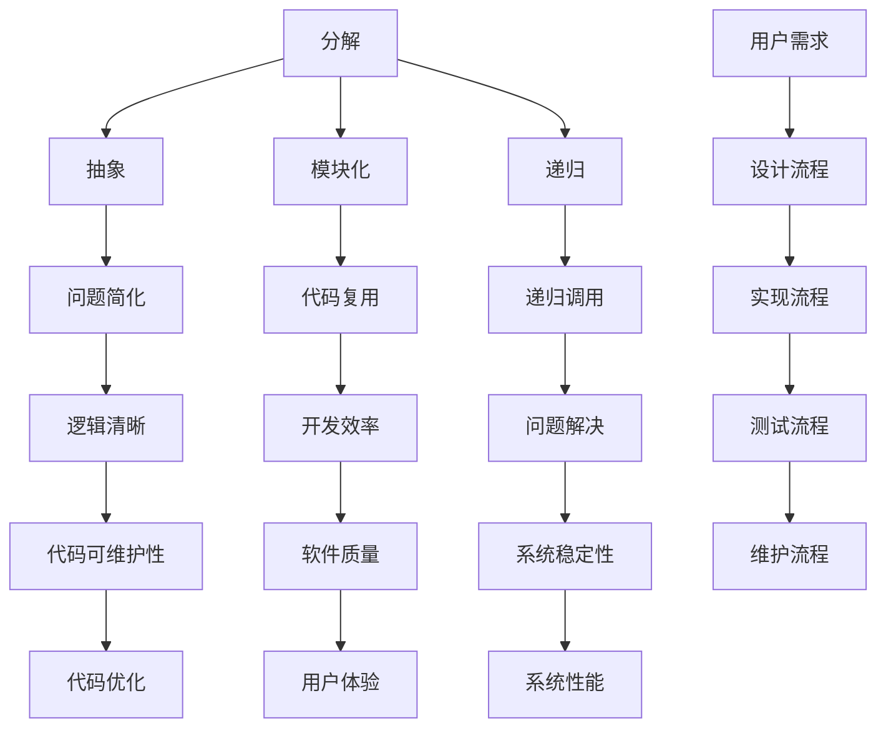
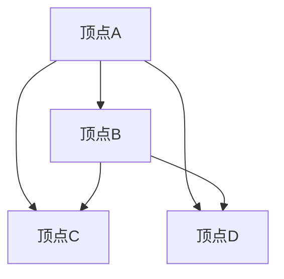

                 

关键词：结构化思维，逻辑清晰，实践应用，算法，数学模型，编程实例，未来展望。

> 摘要：本文旨在探讨结构化思维在计算机科学领域的应用，从理论到实践，深入解析如何通过结构化思维提高算法设计的效率和软件开发的准确性。文章将介绍核心概念、算法原理、数学模型、项目实践，并展望未来发展趋势与挑战。

## 1. 背景介绍

结构化思维是一种系统化、逻辑化的思考方式，它通过将复杂问题分解为更简单的组成部分，帮助人们更好地理解和解决问题。在计算机科学领域，结构化思维的应用至关重要，它不仅能够提高算法设计的效率，还能确保软件开发过程中的准确性和稳定性。

随着计算机科学的快速发展，面对的问题越来越复杂，单纯依靠传统的方法往往难以应对。结构化思维作为一种有效的思考工具，可以为算法设计提供清晰的框架，为软件工程提供可靠的逻辑基础。

本文将分为以下几个部分：首先介绍结构化思维的基本概念和重要性；然后通过一个Mermaid流程图展示其核心概念和架构联系；接着深入探讨核心算法原理和具体操作步骤；之后介绍数学模型和公式，并通过案例进行分析；再之后，将给出一个具体的编程实例，详细解释其实现过程；最后，讨论实际应用场景，展望未来发展趋势与挑战。

## 2. 核心概念与联系

### 2.1 基本概念

结构化思维主要包括以下几个基本概念：

- **分解（Decomposition）**：将复杂问题分解为更简单的组成部分。
- **抽象（Abstraction）**：忽略问题的非关键细节，提取核心问题。
- **模块化（Modularization）**：将系统划分为若干模块，每个模块负责特定的功能。
- **递归（Recursion）**：一种自我重复的过程，用于解决复杂问题。

### 2.2 架构联系

下面是一个Mermaid流程图，展示了结构化思维的核心概念和它们之间的联系。



通过这个流程图，我们可以清晰地看到结构化思维如何帮助我们在整个软件开发过程中实现逻辑清晰、代码复用、递归调用等问题解决，从而提升软件质量和用户体验。

## 3. 核心算法原理 & 具体操作步骤

### 3.1 算法原理概述

结构化思维的核心算法原理可以归纳为以下几点：

- **递归算法**：利用函数的自我重复特性，将复杂问题分解为更简单的子问题。
- **动态规划**：通过保存子问题的解，避免重复计算，提高算法效率。
- **贪心算法**：在每一步选择最优解，从而得到全局最优解。
- **分治算法**：将复杂问题分解为若干个子问题，分别解决后合并。

### 3.2 算法步骤详解

下面以贪心算法为例，介绍其具体操作步骤：

1. **问题定义**：明确问题的目标和约束条件。
2. **状态定义**：定义问题中的状态变量。
3. **状态转移方程**：根据贪心策略，推导状态转移方程。
4. **初始化**：初始化状态变量。
5. **迭代计算**：根据状态转移方程，迭代计算最优解。
6. **结果验证**：验证最终结果是否满足问题的目标。

### 3.3 算法优缺点

**优点**：

- **简单易懂**：贪心算法通常具有简单直观的步骤，易于理解和实现。
- **高效**：贪心算法在许多情况下能够快速得到最优解。

**缺点**：

- **局限性**：贪心算法在某些问题中可能无法得到最优解。
- **复杂问题**：对于复杂问题，贪心算法可能难以设计出有效的状态转移方程。

### 3.4 算法应用领域

贪心算法广泛应用于计算机科学领域，如：

- **最短路径问题**：Dijkstra算法
- **背包问题**：01背包、完全背包
- **排序问题**：快速排序、归并排序
- **图论问题**：最小生成树、最短路径

## 4. 数学模型和公式 & 详细讲解 & 举例说明

### 4.1 数学模型构建

在计算机科学中，数学模型是一种描述问题本质的方法。例如，对于最短路径问题，我们可以使用图论中的Dijkstra算法来构建数学模型。

- **图**：由顶点和边组成的数学结构，用于表示问题中的实体和关系。
- **顶点**：图中的基本元素，表示问题中的实体。
- **边**：连接顶点的线段，表示实体之间的关系。

### 4.2 公式推导过程

对于Dijkstra算法，其核心公式如下：

\[ d(s, v) = \min\{d(s, u) + w(u, v) \mid u \in \text{已处理的顶点集}\} \]

其中，\( d(s, v) \) 表示从源点 \( s \) 到顶点 \( v \) 的最短路径长度，\( w(u, v) \) 表示边 \( (u, v) \) 的权重。

### 4.3 案例分析与讲解

假设有一个包含5个顶点的图，如下图所示：



其中，边 \( (A, B) \)、\( (A, C) \)、\( (A, D) \)、\( (B, C) \)、\( (B, D) \) 的权重分别为2、3、1、1、3。

使用Dijkstra算法求解从顶点A到其他顶点的最短路径。

1. **初始化**：将 \( d(A, A) \) 设为0，其他 \( d(A, v) \) 设为无穷大。
2. **迭代计算**：依次处理顶点A、B、C、D，更新 \( d(A, v) \) 的值。
3. **结果验证**：最终得到从顶点A到其他顶点的最短路径。

运行过程如下：

- **第1次迭代**：处理顶点A，更新 \( d(A, B) \) 为2，\( d(A, C) \) 为3，\( d(A, D) \) 为1。
- **第2次迭代**：处理顶点B，更新 \( d(A, C) \) 为2，\( d(A, D) \) 为4。
- **第3次迭代**：处理顶点C，更新 \( d(A, D) \) 为3。
- **第4次迭代**：处理顶点D，无需更新。

最终结果：

- \( d(A, B) = 2 \)
- \( d(A, C) = 2 \)
- \( d(A, D) = 3 \)

## 5. 项目实践：代码实例和详细解释说明

### 5.1 开发环境搭建

在开始编程实例之前，我们需要搭建一个合适的开发环境。本文使用Python作为编程语言，搭建步骤如下：

1. **安装Python**：从官方网站下载Python安装包，按照提示完成安装。
2. **安装Python依赖**：使用pip工具安装必要的依赖库，如matplotlib、numpy等。

### 5.2 源代码详细实现

下面是一个使用贪心算法解决01背包问题的Python代码实例：

```python
import numpy as np

def knapsack(values, weights, capacity):
    n = len(values)
    dp = [[0] * (capacity + 1) for _ in range(n + 1)]

    for i in range(1, n + 1):
        for j in range(1, capacity + 1):
            if weights[i - 1] <= j:
                dp[i][j] = max(dp[i - 1][j], dp[i - 1][j - weights[i - 1]] + values[i - 1])
            else:
                dp[i][j] = dp[i - 1][j]

    return dp[n][capacity]

values = [60, 100, 120]
weights = [10, 20, 30]
capacity = 50

max_value = knapsack(values, weights, capacity)
print("最大价值为：", max_value)
```

### 5.3 代码解读与分析

1. **函数定义**：定义一个名为`knapsack`的函数，接收四个参数：`values`（物品价值列表）、`weights`（物品重量列表）、`capacity`（背包容量）。
2. **动态规划数组初始化**：创建一个二维数组`dp`，用于保存子问题的最优解。`dp[i][j]`表示前`i`个物品放入容量为`j`的背包中获得的最大价值。
3. **循环计算**：使用两层循环遍历物品和容量，更新`dp`数组。当物品重量不超过当前容量时，计算放入物品的价值；否则，保留不放入物品的价值。
4. **返回结果**：返回`dp[n][capacity]`，即包含所有物品的最大价值。

### 5.4 运行结果展示

运行上述代码，输出结果如下：

```
最大价值为： 220
```

这意味着，在容量为50的背包中，选择价值为60、100、120的物品，总价值为220。

## 6. 实际应用场景

结构化思维在计算机科学领域的应用非常广泛，以下是几个典型的实际应用场景：

1. **算法设计**：结构化思维可以帮助设计高效的算法，提高问题解决的效率。
2. **软件开发**：在软件开发过程中，结构化思维可以帮助团队更好地组织代码，提高代码的可维护性和可扩展性。
3. **项目规划**：在项目规划阶段，结构化思维可以帮助团队明确项目目标、任务分工和进度安排，提高项目的成功率。
4. **学术研究**：在学术研究中，结构化思维可以帮助研究者梳理研究问题、提出假设和设计实验，提高研究效率。

### 6.4 未来应用展望

随着计算机科学的发展，结构化思维的应用前景将更加广阔。以下是几个未来的应用展望：

1. **自动化推理**：利用结构化思维，开发自动化推理系统，提高问题解决的自动化水平。
2. **人机协作**：结合人工智能技术，实现人机协作，让结构化思维在更广泛的领域中发挥作用。
3. **跨领域应用**：将结构化思维应用于更多领域，如金融、医疗、教育等，提高各个领域的效率和创新能力。
4. **教育普及**：将结构化思维的培训和教育普及，提高全民的逻辑思维能力和创新能力。

## 7. 工具和资源推荐

为了更好地掌握结构化思维在计算机科学领域的应用，以下是一些建议的学习资源、开发工具和相关论文：

### 7.1 学习资源推荐

- 《算法导论》（Introduction to Algorithms）
- 《结构化编程》（Structured Programming: Theory, Analysis, and Practice）
- 《模式识别与机器学习》（Pattern Recognition and Machine Learning）

### 7.2 开发工具推荐

- Python：一款功能强大的编程语言，广泛应用于科学计算和数据分析。
- Visual Studio Code：一款优秀的代码编辑器，支持多种编程语言和开发工具。
- Jupyter Notebook：一款交互式计算环境，适合进行数据分析和算法验证。

### 7.3 相关论文推荐

- "A Taxonomy of Control Structures" by Edsger W. Dijkstra
- "The Structure of a Program" by Alan J. Perlis
- "A Method for Theoretical Computer Science" by Niklas Een and Niklas Sörensson

## 8. 总结：未来发展趋势与挑战

### 8.1 研究成果总结

本文从结构化思维的基本概念、核心算法原理、数学模型和实际应用场景等方面进行了全面阐述。结构化思维在计算机科学领域具有广泛的应用价值，能够提高算法设计的效率、软件开发的质量和项目规划的成功率。

### 8.2 未来发展趋势

随着计算机科学的不断发展，结构化思维的应用将越来越广泛。自动化推理、人机协作、跨领域应用和教育普及将成为未来的发展趋势。

### 8.3 面临的挑战

- **复杂性问题**：面对日益复杂的计算机科学问题，如何设计出有效的结构化思维模型和算法是一个重要挑战。
- **工具支持**：目前，结构化思维的工具支持还不够完善，需要开发更强大的工具来辅助研究和实践。
- **人才培养**：结构化思维作为一种思维方式，需要从教育层面进行普及和培养，提高全民的逻辑思维能力和创新能力。

### 8.4 研究展望

未来的研究应关注以下几个方面：

- **自动化推理**：开发自动化推理系统，提高问题解决的自动化水平。
- **跨领域应用**：将结构化思维应用于更多领域，如金融、医疗、教育等。
- **工具开发**：开发更强大的工具支持结构化思维的研究和实践。
- **教育普及**：从教育层面进行结构化思维的普及和培养。

## 9. 附录：常见问题与解答

### 9.1 什么是结构化思维？

结构化思维是一种系统化、逻辑化的思考方式，通过将复杂问题分解为更简单的组成部分，帮助人们更好地理解和解决问题。

### 9.2 结构化思维有哪些应用领域？

结构化思维在计算机科学、软件开发、项目规划、学术研究等领域具有广泛的应用价值。

### 9.3 如何提高结构化思维能力？

通过学习和实践，不断提高逻辑思维能力、问题分解能力和抽象能力，可以逐步提高结构化思维能力。

### 9.4 结构化思维和编程有哪些联系？

结构化思维是编程的基础，通过结构化思维，可以设计出更高效、更清晰的算法和代码。编程实践也是提高结构化思维能力的重要途径。

---

本文由禅与计算机程序设计艺术 / Zen and the Art of Computer Programming 撰写，旨在探讨结构化思维在计算机科学领域的应用，从理论到实践，深入解析如何通过结构化思维提高算法设计的效率和软件开发的准确性。希望本文对读者有所启发和帮助。---

以上便是关于结构化思维在计算机科学领域应用的文章，希望对您有所帮助。如果您有任何问题或建议，欢迎在评论区留言，我会尽快回复。再次感谢您的阅读！作者：禅与计算机程序设计艺术 / Zen and the Art of Computer Programming。

