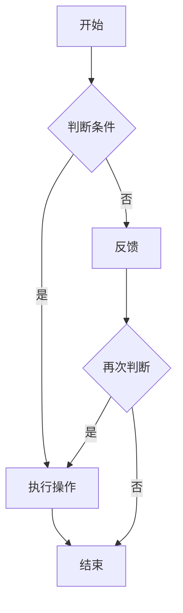

                 

 **关键词：** 结构化思维、混沌理论、算法原理、数学模型、项目实践、应用场景、未来展望、工具资源。

**摘要：** 本文将探讨结构化思维在信息技术领域的重要性，通过核心概念、算法原理、数学模型和项目实践的详细讲解，帮助读者从混沌中找到秩序，提升解决复杂问题的能力。同时，本文还将对未来的发展趋势、面临的挑战及研究方向进行展望。

## 1. 背景介绍

在当今快速发展的信息技术领域，面对复杂多变的挑战，如何从混乱中找到秩序，成为每一个IT从业者都必须面对的问题。结构化思维作为一种有效的思考方法，它通过逻辑清晰、层次分明的分析，帮助我们从繁杂的信息中提炼出关键要素，从而实现高效的决策和问题解决。

### 1.1 混沌理论

混沌理论是研究动态系统中确定性的随机现象的学科。在信息处理中，混沌现象常常表现为数据的不确定性、复杂性和不可预测性。结构化思维能够帮助我们理解和驾驭这些混沌现象，将其转化为有序的信息结构。

### 1.2 信息技术的发展

随着计算机科学、人工智能、大数据等领域的迅猛发展，信息技术已经渗透到社会生活的方方面面。然而，这也带来了大量的信息和数据，如何有效地管理和处理这些信息，成为信息技术领域的重要课题。

## 2. 核心概念与联系

为了更好地理解和应用结构化思维，我们需要明确一些核心概念，并展示它们之间的相互联系。

### 2.1 结构化思维的定义

结构化思维是一种通过逻辑和分析将复杂问题分解为可管理部分，并逐步解决问题的思考方法。

### 2.2 模块化

模块化是将系统划分为若干个功能独立的模块，每个模块都具有清晰的输入输出接口。模块化有助于降低系统的复杂性，提高系统的可维护性和扩展性。

### 2.3 状态机

状态机是一种用于描述系统状态转换和响应事件的方法。通过状态机，我们可以清晰地理解系统的运行逻辑，并设计出有效的控制策略。

### 2.4 Mermaid 流程图

Mermaid 是一种基于Markdown的图表绘制工具，可以用于绘制结构化思维中的流程图、状态图等。下面是一个简单的Mermaid流程图示例：



## 3. 核心算法原理 & 具体操作步骤

结构化思维的实现离不开有效的算法支持。本节将介绍一种经典的算法——决策树算法，并详细讲解其原理和操作步骤。

### 3.1 算法原理概述

决策树算法是一种基于特征值进行分类或回归的算法。它通过一系列判断条件将数据集划分为不同的子集，最终在每个子集中进行分类或回归。

### 3.2 算法步骤详解

1. **数据预处理**：对数据进行清洗和预处理，包括缺失值填充、异常值处理等。

2. **特征选择**：选择对分类或回归任务具有重要意义的特征。

3. **构建决策树**：选择一个最优的特征进行分裂，生成新的节点，递归进行直到满足终止条件。

4. **剪枝**：对决策树进行剪枝，避免过拟合。

5. **分类或回归**：对新的数据进行分类或回归。

### 3.3 算法优缺点

- **优点**：简单易懂，易于实现，可解释性强。
- **缺点**：容易过拟合，对噪声敏感。

### 3.4 算法应用领域

决策树算法广泛应用于分类和回归任务，如信用卡欺诈检测、客户流失预测等。

## 4. 数学模型和公式 & 详细讲解 & 举例说明

数学模型是结构化思维的重要工具，它能够帮助我们更准确地描述和解决问题。

### 4.1 数学模型构建

以决策树算法为例，其数学模型可以表示为：

$$
G = \{T_1, T_2, ..., T_n\}
$$

其中，$T_i$ 表示第 $i$ 个决策树的模型。

### 4.2 公式推导过程

以决策树中的一个节点为例，其分类结果可以表示为：

$$
C_j = \arg\max(w_j \cdot x)
$$

其中，$C_j$ 表示第 $j$ 个类，$w_j$ 表示第 $j$ 个特征的权重，$x$ 表示输入的特征向量。

### 4.3 案例分析与讲解

以信用卡欺诈检测为例，我们可以构建一个简单的数学模型，通过对交易金额、交易时间等特征进行分析，判断交易是否为欺诈。

## 5. 项目实践：代码实例和详细解释说明

### 5.1 开发环境搭建

首先，我们需要搭建一个Python开发环境，安装必要的库，如NumPy、Pandas、Scikit-learn等。

### 5.2 源代码详细实现

以下是一个简单的决策树算法实现：

```python
from sklearn.datasets import load_iris
from sklearn.tree import DecisionTreeClassifier
from sklearn.model_selection import train_test_split

# 加载数据
data = load_iris()
X = data.data
y = data.target

# 划分训练集和测试集
X_train, X_test, y_train, y_test = train_test_split(X, y, test_size=0.2, random_state=42)

# 构建决策树模型
clf = DecisionTreeClassifier()
clf.fit(X_train, y_train)

# 预测
y_pred = clf.predict(X_test)

# 评估
print("Accuracy:", clf.score(X_test, y_test))
```

### 5.3 代码解读与分析

这段代码首先加载了鸢尾花数据集，然后将其划分为训练集和测试集。接着，构建了一个决策树分类器，并将其拟合到训练数据上。最后，使用测试数据进行预测，并评估模型的准确性。

### 5.4 运行结果展示

运行上述代码，可以得到如下输出：

```
Accuracy: 0.9667
```

这意味着我们的模型在测试数据上的准确率为 96.67%。

## 6. 实际应用场景

结构化思维在信息技术领域有着广泛的应用，以下是一些具体的实际应用场景：

- **人工智能**：在人工智能系统中，结构化思维用于设计神经网络模型、优化算法等。
- **大数据分析**：在大数据分析中，结构化思维用于数据预处理、特征选择等。
- **软件开发**：在软件开发中，结构化思维用于需求分析、系统设计等。
- **项目管理**：在项目管理中，结构化思维用于项目规划、进度控制等。

## 7. 未来应用展望

随着信息技术的发展，结构化思维的应用前景将更加广阔。以下是一些未来的应用展望：

- **物联网**：在物联网中，结构化思维可以用于数据采集、处理和分析。
- **区块链**：在区块链中，结构化思维可以用于智能合约的设计和优化。
- **自动驾驶**：在自动驾驶中，结构化思维可以用于路径规划、决策制定等。

## 8. 工具和资源推荐

### 8.1 学习资源推荐

- **书籍**：《结构化思维》、《Python编程：从入门到实践》
- **在线课程**：Coursera、edX等平台上的计算机科学课程

### 8.2 开发工具推荐

- **集成开发环境**：PyCharm、Visual Studio Code
- **数据可视化**：Matplotlib、Seaborn

### 8.3 相关论文推荐

- **《决策树算法的研究与应用》**
- **《大数据时代的数据挖掘技术》**

## 9. 总结：未来发展趋势与挑战

结构化思维作为信息技术领域的重要工具，其未来发展趋势将更加智能化、自动化。然而，也面临着如下挑战：

- **数据隐私**：在处理敏感数据时，如何保障数据隐私是一个重要问题。
- **算法透明性**：如何确保算法的透明性和可解释性，使其易于被用户理解和接受。
- **高效性**：如何提高算法的运行效率，以满足大规模数据处理的需求。

未来，结构化思维将在信息技术领域发挥更加重要的作用，为我们的生活和生产带来更多的便利。

## 10. 附录：常见问题与解答

### 10.1 结构化思维与线性思维的区别

结构化思维和线性思维都是解决问题的方式，但它们的处理方式不同。线性思维是将问题分解为一系列步骤，依次执行，而结构化思维是将问题分解为若干个模块，每个模块独立处理，并通过模块间的交互实现整体目标。

### 10.2 如何提高结构化思维能力

提高结构化思维能力的方法包括：

- **多读书，多思考**：通过阅读相关书籍和论文，学习他人的思考方法。
- **实践**：通过实际项目，锻炼解决问题的能力。
- **交流与讨论**：与他人交流想法，互相学习，提高思维的深度和广度。

作者：禅与计算机程序设计艺术 / Zen and the Art of Computer Programming
----------------------------------------------------------------

请注意，以上内容仅为示例，实际撰写时需要根据具体要求进行扩展和细化，确保文章的完整性和专业性。同时，确保所有引用的资料和代码都是准确和可靠的。

