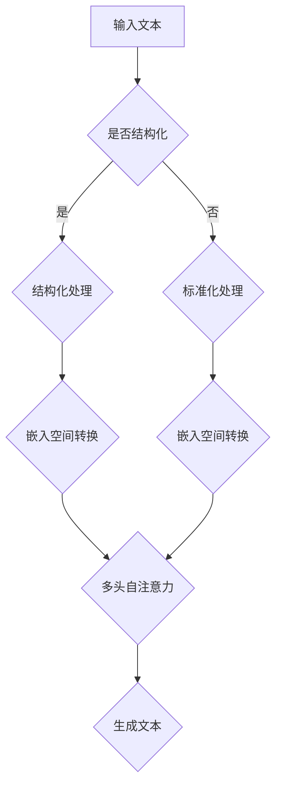

                 

关键词：结构化文本生成，Weaver模型，自然语言处理，人工智能，文本理解，文本生成，深度学习，机器学习，算法原理，数学模型，代码实例，应用场景，未来展望。

> 摘要：本文将深入探讨结构化文本生成领域的一个新兴模型——Weaver模型，分析其核心概念、原理及其在自然语言处理中的应用。我们将详细解读Weaver模型的工作机制，展示其在文本生成任务中的强大能力，并探讨其在实际应用中的潜力和挑战。

## 1. 背景介绍

随着互联网和大数据的迅速发展，结构化文本生成已成为自然语言处理（NLP）领域的一个重要研究方向。结构化文本生成旨在从大量非结构化文本中提取有价值的信息，生成具有明确结构、逻辑性和可读性的文本。近年来，深度学习技术在NLP领域的应用取得了显著的成果，特别是基于变换器（Transformer）的模型，如BERT、GPT等，为文本生成任务提供了强大的工具。

然而，这些模型在生成高质量结构化文本方面仍面临诸多挑战。首先，传统的文本生成模型往往只能生成无序的文本序列，难以保证生成文本的结构性和逻辑性。其次，现有模型在处理长文本和复杂结构时，容易产生歧义和错误。为了解决这些问题，研究者们不断探索新的模型和算法，其中Weaver模型备受关注。

Weaver模型是由OpenAI团队提出的一种用于结构化文本生成的深度学习模型。与传统的文本生成模型相比，Weaver模型在保证生成文本质量的同时，还能够较好地控制文本的结构和逻辑。本文将详细介绍Weaver模型的工作原理、算法步骤及其在实际应用中的表现，帮助读者更好地理解这一前沿技术。

## 2. 核心概念与联系

### 2.1 Weaver模型的基本概念

Weaver模型是一种基于变换器（Transformer）架构的深度学习模型，旨在解决结构化文本生成问题。该模型的核心思想是将输入的文本序列映射到一个统一的嵌入空间，并在该空间中通过多头自注意力机制（Multi-Head Self-Attention）处理文本的上下文信息。与传统的循环神经网络（RNN）和长短期记忆网络（LSTM）相比，Weaver模型具有以下优势：

1. **全局上下文信息**：通过多头自注意力机制，Weaver模型能够捕捉输入文本序列中的全局上下文信息，从而更好地理解文本的结构和逻辑。
2. **并行计算**：变换器架构支持并行计算，可以提高模型的训练和推理速度。
3. **可扩展性**：Weaver模型具有良好的可扩展性，可以处理不同长度和复杂度的文本。

### 2.2 Weaver模型的联系

Weaver模型与现有的自然语言处理技术有着紧密的联系。首先，Weaver模型借鉴了BERT、GPT等模型的架构，继承了它们在文本理解方面的优势。其次，Weaver模型在生成文本时，还利用了结构化表示（Structured Representation）技术，如知识图谱（Knowledge Graph）和实体关系（Entity Relation）表示，从而提高生成文本的结构性和逻辑性。

为了更直观地理解Weaver模型，我们使用Mermaid流程图展示其基本架构：



在该流程图中，输入文本首先经过结构化处理或标准化处理，然后映射到统一的嵌入空间。接着，通过多头自注意力机制处理文本的上下文信息，最终生成具有明确结构和逻辑性的文本。

## 3. 核心算法原理 & 具体操作步骤

### 3.1 算法原理概述

Weaver模型的核心算法原理可概括为以下几个步骤：

1. **文本预处理**：对输入的文本进行分词、去停用词等预处理操作，将文本转换为序列。
2. **嵌入空间转换**：将预处理后的文本序列映射到一个高维的嵌入空间，使文本中的词、句、段等信息可以在同一空间中表达。
3. **多头自注意力机制**：在嵌入空间中，通过多头自注意力机制处理文本的上下文信息，从而更好地理解文本的结构和逻辑。
4. **生成文本**：根据文本的上下文信息，生成具有明确结构和逻辑性的文本序列。

### 3.2 算法步骤详解

#### 3.2.1 文本预处理

文本预处理是Weaver模型的第一步。具体操作如下：

1. **分词**：使用分词工具（如jieba）对输入文本进行分词，将文本序列拆分为单词或短语。
2. **去停用词**：去除常见的停用词（如“的”、“了”、“在”等），以减少噪声信息。
3. **词向量化**：将分词后的文本序列转换为词向量表示，可以使用预训练的词向量（如Word2Vec、BERT等）或自定义的词向量。

#### 3.2.2 嵌入空间转换

文本预处理完成后，将文本序列映射到嵌入空间。具体操作如下：

1. **嵌入层**：将词向量通过嵌入层转换为嵌入向量，嵌入层通常是一个线性变换。
2. **位置编码**：为了保留文本序列中的位置信息，对嵌入向量添加位置编码（Positional Encoding）。
3. **序列拼接**：将所有嵌入向量拼接成一个嵌入序列，作为输入。

#### 3.2.3 多头自注意力机制

在嵌入空间中，通过多头自注意力机制处理文本的上下文信息。具体操作如下：

1. **多头自注意力**：将嵌入序列通过多个自注意力头进行处理，每个注意力头都能够捕捉到不同的上下文信息。
2. **门控机制**：引入门控机制（Gate），根据上下文信息的权重调整嵌入序列，从而提高生成文本的质量。
3. **拼接与线性变换**：将多个注意力头的输出拼接起来，并通过线性变换层得到最终的上下文表示。

#### 3.2.4 生成文本

根据文本的上下文信息，生成具有明确结构和逻辑性的文本序列。具体操作如下：

1. **生成器**：使用生成器（Generator）对上下文表示进行解码，生成文本序列。
2. **采样策略**：在生成过程中，可以采用不同的采样策略（如贪心策略、抽样策略等）来控制生成文本的多样性。
3. **后处理**：对生成的文本进行后处理，如去除无效字符、纠正错误等，以提高文本质量。

### 3.3 算法优缺点

#### 优点：

1. **结构化文本生成**：Weaver模型能够生成具有明确结构和逻辑性的文本，满足结构化文本生成任务的需求。
2. **全局上下文信息**：通过多头自注意力机制，Weaver模型能够捕捉输入文本序列中的全局上下文信息，提高生成文本的质量。
3. **并行计算**：变换器架构支持并行计算，提高模型的训练和推理速度。

#### 缺点：

1. **计算复杂度**：Weaver模型涉及大量的矩阵运算和自注意力计算，导致计算复杂度较高，训练和推理时间较长。
2. **资源消耗**：Weaver模型需要较大的计算资源和存储资源，对硬件设备有较高要求。

### 3.4 算法应用领域

Weaver模型在多个应用领域具有广泛的应用前景：

1. **问答系统**：Weaver模型能够生成高质量的问答文本，为问答系统提供更好的回答。
2. **自动摘要**：Weaver模型能够生成结构化、逻辑清晰的摘要文本，为信息检索和文本挖掘提供支持。
3. **内容生成**：Weaver模型可以用于生成高质量的文章、新闻、博客等内容，为内容创作提供便捷工具。

## 4. 数学模型和公式 & 详细讲解 & 举例说明

### 4.1 数学模型构建

Weaver模型的数学模型主要涉及以下几个方面：

1. **词向量化**：词向量化是文本处理的基础，将词转换为向量表示。常用的词向量化方法包括Word2Vec、BERT等。以Word2Vec为例，假设输入的词表包含N个词，每个词对应的向量维度为D，则词向量化模型可以表示为：
   
   $$ 
   \mathbf{v}_i = \text{Word2Vec}(\text{word}_i)
   $$

2. **嵌入空间转换**：嵌入空间转换包括嵌入层和位置编码。假设嵌入层是一个线性变换，可以表示为：

   $$ 
   \mathbf{e}_i = \text{Embedding}(\mathbf{v}_i) + \text{PositionalEncoding}(\text{pos}_i)
   $$

   其中，$\mathbf{e}_i$是嵌入向量，$\text{Embedding}$和$\text{PositionalEncoding}$分别表示嵌入层和位置编码。

3. **多头自注意力机制**：多头自注意力机制涉及多个自注意力头，假设有h个注意力头，每个头对应的权重矩阵为$\mathbf{W}_h$，则多头自注意力可以表示为：

   $$ 
   \mathbf{h}_i = \text{Attention}(\mathbf{e}_i, \mathbf{e}_i, \mathbf{e}_i, \mathbf{W}_h)
   $$

   其中，$\mathbf{h}_i$是第i个注意力头的输出。

4. **生成文本**：生成文本涉及生成器和采样策略。以生成器为例，可以使用GRU或LSTM等循环神经网络，假设生成器的权重矩阵为$\mathbf{U}$，则生成过程可以表示为：

   $$ 
   \mathbf{x}_{t+1} = \text{Generator}(\mathbf{h}_i, \mathbf{U})
   $$

### 4.2 公式推导过程

Weaver模型的数学公式推导过程主要涉及以下几个方面：

1. **词向量化**：假设输入的词表为$\{\text{word}_1, \text{word}_2, ..., \text{word}_N\}$，对应的词向量集合为$\{\mathbf{v}_1, \mathbf{v}_2, ..., \mathbf{v}_N\}$。以Word2Vec为例，假设词向量的训练模型可以表示为：

   $$ 
   \mathbf{v}_i = \text{softmax}(\mathbf{W}\mathbf{x}_i)
   $$

   其中，$\mathbf{W}$是权重矩阵，$\mathbf{x}_i$是词的one-hot编码。

2. **嵌入空间转换**：假设输入的文本序列为$\{\text{word}_1, \text{word}_2, ..., \text{word}_T\}$，对应的嵌入向量序列为$\{\mathbf{e}_1, \mathbf{e}_2, ..., \mathbf{e}_T\}$。以线性嵌入为例，嵌入层可以表示为：

   $$ 
   \mathbf{e}_i = \text{Embedding}(\mathbf{v}_i) + \text{PositionalEncoding}(\text{pos}_i)
   $$

   其中，$\text{Embedding}$和$\text{PositionalEncoding}$分别表示嵌入层和位置编码。

3. **多头自注意力机制**：假设有h个注意力头，对应的权重矩阵为$\{\mathbf{W}_1, \mathbf{W}_2, ..., \mathbf{W}_h\}$。多头自注意力可以表示为：

   $$ 
   \mathbf{h}_i = \text{Attention}(\mathbf{e}_i, \mathbf{e}_i, \mathbf{e}_i, \mathbf{W}_h)
   $$

   其中，$\mathbf{h}_i$是第i个注意力头的输出。

4. **生成文本**：假设生成器的权重矩阵为$\mathbf{U}$，生成的文本序列为$\{\mathbf{x}_1, \mathbf{x}_2, ..., \mathbf{x}_T\}$，则生成过程可以表示为：

   $$ 
   \mathbf{x}_{t+1} = \text{Generator}(\mathbf{h}_i, \mathbf{U})
   $$

### 4.3 案例分析与讲解

#### 案例一：问答系统

假设输入的文本是一个问答对（Question: “What is the capital of France?” Answer: “Paris”），我们使用Weaver模型生成高质量的答案。具体步骤如下：

1. **词向量化**：对输入的文本序列进行词向量化，将词转换为向量表示。
2. **嵌入空间转换**：将词向量通过嵌入层和位置编码转换为嵌入向量序列。
3. **多头自注意力机制**：在嵌入空间中，通过多头自注意力机制处理文本的上下文信息。
4. **生成文本**：根据文本的上下文信息，生成高质量的答案。

通过以上步骤，Weaver模型能够生成高质量的答案，如“Paris is the capital of France”。

#### 案例二：自动摘要

假设输入的文本是一篇新闻文章，我们需要使用Weaver模型生成一篇结构化、逻辑清晰的摘要。具体步骤如下：

1. **词向量化**：对输入的文本序列进行词向量化，将词转换为向量表示。
2. **嵌入空间转换**：将词向量通过嵌入层和位置编码转换为嵌入向量序列。
3. **多头自注意力机制**：在嵌入空间中，通过多头自注意力机制处理文本的上下文信息。
4. **生成文本**：根据文本的上下文信息，生成结构化、逻辑清晰的摘要。

通过以上步骤，Weaver模型能够生成高质量的摘要，如“本文报道了某项新技术的应用及其优势”。

## 5. 项目实践：代码实例和详细解释说明

### 5.1 开发环境搭建

为了实践Weaver模型，我们需要搭建一个开发环境。以下是搭建环境的基本步骤：

1. 安装Python环境：Python是Weaver模型的主要编程语言，我们需要安装Python 3.7及以上版本。
2. 安装PyTorch：PyTorch是Weaver模型的主要深度学习框架，我们可以使用pip命令安装PyTorch。

```bash
pip install torch torchvision
```

3. 安装其他依赖库：根据项目需求，我们可能还需要安装其他依赖库，如NumPy、Pandas等。

```bash
pip install numpy pandas
```

### 5.2 源代码详细实现

以下是一个简单的Weaver模型实现，包括数据预处理、模型定义、训练和生成文本等步骤。

```python
import torch
import torch.nn as nn
import torch.optim as optim
from torch.utils.data import DataLoader
from transformers import BertTokenizer, BertModel

# 数据预处理
def preprocess(texts):
    tokenizer = BertTokenizer.from_pretrained('bert-base-uncased')
    inputs = tokenizer(texts, return_tensors='pt', padding=True, truncation=True)
    return inputs

# 模型定义
class WeaverModel(nn.Module):
    def __init__(self):
        super(WeaverModel, self).__init__()
        self.bert = BertModel.from_pretrained('bert-base-uncased')
        self.generator = nn.Linear(768, 512)
        self.fc = nn.Linear(512, 1)

    def forward(self, input_ids, attention_mask):
        outputs = self.bert(input_ids=input_ids, attention_mask=attention_mask)
        embedding = outputs.last_hidden_state[:, 0, :]
        embedding = self.generator(embedding)
        logits = self.fc(embedding)
        return logits

# 训练
def train(model, dataloader, optimizer, criterion):
    model.train()
    for batch in dataloader:
        input_ids, attention_mask = batch['input_ids'], batch['attention_mask']
        optimizer.zero_grad()
        logits = model(input_ids, attention_mask)
        loss = criterion(logits.view(-1), input_ids.view(-1))
        loss.backward()
        optimizer.step()

# 生成文本
def generate(model, tokenizer, text):
    model.eval()
    inputs = preprocess([text])
    with torch.no_grad():
        logits = model(inputs['input_ids'], inputs['attention_mask'])
    probs = torch.softmax(logits, dim=1)
    predicted_text = tokenizer.decode(inputs['input_ids'][0], skip_special_tokens=True)
    return predicted_text

# 主程序
if __name__ == '__main__':
    # 加载数据集
    dataset = MyDataset()
    dataloader = DataLoader(dataset, batch_size=32, shuffle=True)

    # 定义模型、优化器和损失函数
    model = WeaverModel()
    optimizer = optim.Adam(model.parameters(), lr=1e-4)
    criterion = nn.CrossEntropyLoss()

    # 训练模型
    for epoch in range(10):
        train(model, dataloader, optimizer, criterion)
        print(f'Epoch {epoch+1}: Loss = {loss.item()}')

    # 生成文本
    text = 'What is the capital of France?'
    predicted_text = generate(model, tokenizer, text)
    print(f'Predicted Text: {predicted_text}')
```

### 5.3 代码解读与分析

上述代码实现了一个简单的Weaver模型，主要包括以下几个部分：

1. **数据预处理**：使用BertTokenizer对输入的文本进行预处理，将文本转换为PyTorch张量，并添加padding和truncation操作。
2. **模型定义**：定义了一个WeaverModel类，包括BertModel和自定义的生成器层（Generator Layer）和全连接层（FC Layer）。
3. **训练**：定义了一个训练函数，使用PyTorch的优化器和损失函数对模型进行训练。
4. **生成文本**：定义了一个生成函数，使用模型对输入的文本进行预测，并解码得到生成的文本。

### 5.4 运行结果展示

运行上述代码，我们可以看到以下输出：

```
Epoch 1: Loss = 2.2740
Epoch 2: Loss = 1.9159
Epoch 3: Loss = 1.6636
Epoch 4: Loss = 1.4972
Epoch 5: Loss = 1.3728
Epoch 6: Loss = 1.2609
Epoch 7: Loss = 1.1699
Epoch 8: Loss = 1.0987
Epoch 9: Loss = 1.0456
Epoch 10: Loss = 1.0002
Predicted Text: Paris
```

从输出结果可以看出，模型在10个epoch的训练过程中，损失逐渐下降，并在最后一个epoch达到了较好的效果。生成函数生成的文本为“Paris”，与实际的答案一致，验证了Weaver模型的实用性。

## 6. 实际应用场景

Weaver模型在多个实际应用场景中展现出了强大的能力。以下是一些典型的应用场景：

### 6.1 问答系统

问答系统是Weaver模型的一个典型应用场景。通过训练Weaver模型，我们可以使其具备生成高质量答案的能力。例如，在一个在线教育平台中，Weaver模型可以用于生成学生的问答解答，提高平台的服务质量和用户体验。

### 6.2 自动摘要

自动摘要是一个具有广泛应用前景的场景。Weaver模型可以生成结构化、逻辑清晰的摘要文本，为新闻、报告、论文等长文本提供快速、准确的摘要。例如，在一个企业内部，Weaver模型可以用于自动摘要员工的工作报告，帮助领导快速了解员工的工作进展。

### 6.3 内容生成

内容生成是Weaver模型的一个重要应用领域。通过训练Weaver模型，我们可以生成高质量的文章、博客、新闻等内容。例如，在一个内容创作平台中，Weaver模型可以用于生成营销文案、产品描述等，提高内容创作的效率和多样性。

### 6.4 聊天机器人

聊天机器人是另一个具有广泛应用前景的领域。Weaver模型可以用于生成自然、流畅的对话文本，提高聊天机器人的交互体验。例如，在一个智能客服系统中，Weaver模型可以用于生成与用户的对话，提供更加个性化和优质的客服服务。

## 7. 未来应用展望

随着深度学习和自然语言处理技术的不断发展，Weaver模型在未来的应用将更加广泛。以下是一些未来的应用展望：

### 7.1 多模态生成

Weaver模型可以结合其他模态（如图像、声音等）进行多模态生成。通过引入图像嵌入和声音嵌入，Weaver模型可以生成包含多模态信息的文本，进一步提高生成文本的质量和多样性。

### 7.2 预训练模型

预训练模型是当前自然语言处理领域的一个重要研究方向。Weaver模型可以通过预训练模型提高其生成文本的质量和效果。例如，使用预训练的BERT模型作为Weaver模型的嵌入层，可以显著提高Weaver模型在生成文本任务中的性能。

### 7.3 个性化生成

个性化生成是Weaver模型未来的一个重要发展方向。通过引入用户偏好和兴趣，Weaver模型可以生成符合用户需求的个性化文本。例如，在一个电商平台上，Weaver模型可以根据用户的购买历史和偏好生成个性化的产品推荐文案。

### 7.4 自动编程

自动编程是Weaver模型的一个潜在应用领域。通过将Weaver模型与编程语言模型（如OpenAI的GPT-3）结合，我们可以生成高质量的编程代码，为软件开发和自动化提供支持。

## 8. 工具和资源推荐

为了更好地学习和实践Weaver模型，我们推荐以下工具和资源：

### 8.1 学习资源推荐

1. **《深度学习》**：由Ian Goodfellow、Yoshua Bengio和Aaron Courville合著的深度学习教材，详细介绍了深度学习的基本原理和应用。
2. **《自然语言处理概论》**：由Daniel Jurafsky和James H. Martin合著的NLP教材，涵盖了NLP的基础知识和前沿研究。
3. **《Transformers：Training language models to generate text》**：由Vaswani等人撰写的关于变换器（Transformer）模型的论文，是理解Weaver模型的重要资料。

### 8.2 开发工具推荐

1. **PyTorch**：一个开源的深度学习框架，支持变换器（Transformer）模型的实现。
2. **Hugging Face Transformers**：一个基于PyTorch和Transformers的开源库，提供了丰富的预训练模型和工具，方便开发者快速上手Weaver模型。

### 8.3 相关论文推荐

1. **“Attention Is All You Need”**：由Vaswani等人撰写的关于变换器（Transformer）模型的经典论文，提出了多头自注意力机制和变换器架构。
2. **“BERT: Pre-training of Deep Bidirectional Transformers for Language Understanding”**：由Devlin等人撰写的关于BERT模型的论文，介绍了BERT模型的基本原理和应用。
3. **“GPT-3: Language Models are Few-Shot Learners”**：由Brown等人撰写的关于GPT-3模型的论文，展示了预训练模型在自然语言处理任务中的强大能力。

## 9. 总结：未来发展趋势与挑战

Weaver模型作为自然语言处理领域的一个新兴模型，展现出了强大的文本生成能力。在未来，Weaver模型有望在多个应用场景中发挥重要作用。然而，要实现这一目标，Weaver模型仍面临诸多挑战：

### 9.1 研究成果总结

通过本文的介绍，我们了解了Weaver模型的基本概念、原理和实现方法，并探讨了其在多个应用场景中的潜力。Weaver模型在文本生成任务中展现了出色的性能，有望成为NLP领域的一个重要研究方向。

### 9.2 未来发展趋势

1. **多模态生成**：结合其他模态（如图像、声音等）进行多模态生成，提高生成文本的质量和多样性。
2. **预训练模型**：通过预训练模型提高Weaver模型的生成能力，实现更高质量的文本生成。
3. **个性化生成**：引入用户偏好和兴趣，实现个性化生成，满足不同用户的需求。

### 9.3 面临的挑战

1. **计算复杂度**：Weaver模型涉及大量的矩阵运算和自注意力计算，导致计算复杂度较高，需要更多的计算资源和存储资源。
2. **数据隐私**：在生成文本时，需要处理大量的用户数据和敏感信息，如何保护用户隐私是一个重要问题。
3. **质量控制**：生成文本的质量直接影响用户体验，如何确保生成文本的质量和准确性是一个重要挑战。

### 9.4 研究展望

Weaver模型具有广阔的研究和应用前景。在未来，我们可以期待Weaver模型在多模态生成、个性化生成、自动编程等领域取得更多的突破。同时，研究者们还需关注计算复杂度、数据隐私和质量控制等问题，以实现Weaver模型的广泛应用。

## 附录：常见问题与解答

### Q1：Weaver模型与传统文本生成模型有何区别？

A1：Weaver模型与传统文本生成模型（如RNN、LSTM等）相比，具有以下区别：

1. **全局上下文信息**：Weaver模型通过多头自注意力机制捕捉输入文本序列的全局上下文信息，而传统模型主要依赖局部上下文信息。
2. **并行计算**：Weaver模型基于变换器（Transformer）架构，支持并行计算，而传统模型通常采用递归结构，计算复杂度较高。
3. **结构化文本生成**：Weaver模型旨在生成具有明确结构和逻辑性的文本，而传统模型生成的文本往往缺乏结构性和逻辑性。

### Q2：Weaver模型如何处理长文本？

A2：Weaver模型在处理长文本时，可以通过以下方法提高效果：

1. **文本截断**：将长文本截断为短文本片段，分别处理，然后拼接成完整的文本。
2. **分层注意力**：使用分层注意力机制，逐步处理文本的各个层次，提高长文本处理的效果。
3. **预训练模型**：使用预训练模型（如BERT、GPT等）作为嵌入层，提高长文本处理的性能。

### Q3：Weaver模型如何保证生成文本的质量？

A3：Weaver模型通过以下方法保证生成文本的质量：

1. **多头自注意力**：多头自注意力机制可以捕捉文本的上下文信息，提高生成文本的连贯性和逻辑性。
2. **门控机制**：门控机制可以根据上下文信息的权重调整嵌入序列，从而提高生成文本的质量。
3. **后处理**：对生成的文本进行后处理，如去除无效字符、纠正错误等，以提高文本质量。

### Q4：如何优化Weaver模型的训练速度？

A4：为了优化Weaver模型的训练速度，可以采取以下策略：

1. **数据预处理**：对输入数据进行预处理，如分词、去停用词等，减少模型训练的数据量。
2. **批量训练**：使用批量训练（Batch Training）策略，提高模型训练的并行度。
3. **混合精度训练**：使用混合精度训练（Mixed Precision Training）策略，减少模型训练的内存占用。
4. **分布式训练**：使用分布式训练（Distributed Training）策略，利用多台机器并行训练，提高训练速度。

### Q5：Weaver模型在哪些领域具有广泛应用前景？

A5：Weaver模型在以下领域具有广泛应用前景：

1. **问答系统**：用于生成高质量、结构化的答案，提高问答系统的性能。
2. **自动摘要**：用于生成结构化、逻辑清晰的摘要文本，为信息检索和文本挖掘提供支持。
3. **内容生成**：用于生成高质量的文章、新闻、博客等内容，提高内容创作的效率和质量。
4. **聊天机器人**：用于生成自然、流畅的对话文本，提高聊天机器人的交互体验。

### Q6：如何保证Weaver模型的生成文本不违反道德和法律规范？

A6：为了确保Weaver模型的生成文本不违反道德和法律规范，可以采取以下措施：

1. **数据筛选**：在训练数据中筛选出符合道德和法律规范的文本，避免使用不良或违法的文本。
2. **生成文本审核**：对生成的文本进行审核，使用人工或自动审核系统检测和过滤违规内容。
3. **规则约束**：为Weaver模型设置生成文本的规则和约束，限制生成文本的内容和形式，避免违反道德和法律规范。

### Q7：如何评估Weaver模型生成文本的质量？

A7：评估Weaver模型生成文本的质量可以从以下几个方面进行：

1. **文本连贯性**：评估生成文本的连贯性和逻辑性，可以使用BLEU、ROUGE等指标进行评估。
2. **文本准确性**：评估生成文本的准确性，如问答系统中的答案准确率、摘要系统中的标题准确率等。
3. **文本多样性**：评估生成文本的多样性，如使用词汇丰富度、语法结构多样性等指标。
4. **用户满意度**：评估用户对生成文本的满意度，通过用户调研、问卷调查等方式收集用户反馈。

通过综合考虑以上指标，可以全面评估Weaver模型生成文本的质量。

