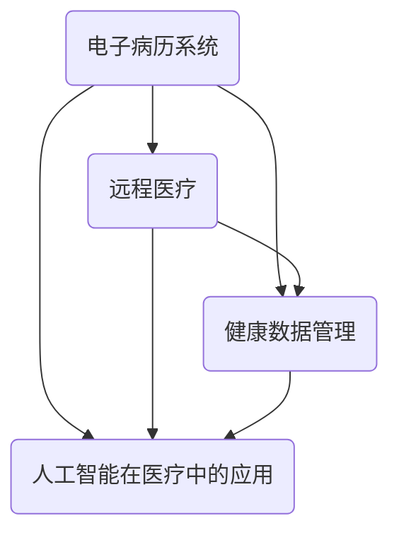

                 

在这个信息爆炸的时代，互联网医疗行业的飞速发展吸引了无数人才投身其中。然而，随之而来的面试挑战也让很多求职者感到困惑。本文将汇总2024年网易互联网医疗事业部社招面试的真题，并提供详细的解答，帮助您更好地应对面试。

## 关键词

- 网易
- 互联网医疗
- 社招面试
- 真题解析
- 技术能力

## 摘要

本文旨在为准备参与网易互联网医疗事业部招聘的求职者提供帮助。通过汇总2024年的面试真题，结合详细解答，我们希望能够帮助求职者更好地理解面试要求，提升面试成功率。文章将分为背景介绍、核心概念与联系、核心算法原理、数学模型和公式、项目实践、实际应用场景、工具和资源推荐、总结和附录等多个部分，全面解析面试内容。

### 1. 背景介绍

互联网医疗作为医疗行业与互联网技术深度融合的产物，正在全球范围内迅速崛起。网易作为中国领先的互联网技术公司，其互联网医疗事业部也在积极探索这一领域。网易互联网医疗事业部社招面试旨在选拔具备扎实技术基础和丰富经验的优秀人才，以推动互联网医疗技术的创新与发展。

### 2. 核心概念与联系

在互联网医疗领域中，以下几个核心概念至关重要：

- **电子病历系统（Electronic Health Records, EHR）**：EHR是一种数字化的医疗记录，用于存储和管理患者的医疗信息。它包括病史、检查报告、诊断结果等。

- **远程医疗（Telemedicine）**：远程医疗利用通信技术，如视频会议和互联网，为患者提供远程医疗服务，如远程诊断、远程会诊和远程治疗。

- **健康数据管理（Health Data Management）**：健康数据管理涉及收集、存储、分析和共享患者的健康数据，以便为医疗决策提供支持。

- **人工智能在医疗中的应用（AI in Healthcare）**：人工智能在医疗领域的应用包括医学图像分析、疾病预测、药物研发等，极大地提高了医疗服务的效率和质量。

图1展示了这些核心概念之间的联系。



### 3. 核心算法原理 & 具体操作步骤

#### 3.1 算法原理概述

在互联网医疗领域，常见算法包括：

- **机器学习算法**：用于疾病预测、诊断和个性化治疗。
- **深度学习算法**：在医学图像分析中具有广泛应用，如肿瘤检测、病灶识别等。
- **自然语言处理（NLP）算法**：用于处理医疗文本数据，如电子病历、医疗报告等。

#### 3.2 算法步骤详解

以深度学习算法为例，其基本步骤包括：

1. **数据收集与预处理**：收集大量医疗图像数据，并进行数据清洗、归一化等预处理。
2. **模型设计**：设计合适的神经网络架构，如卷积神经网络（CNN）。
3. **模型训练**：使用预处理的图像数据训练神经网络模型。
4. **模型评估**：使用验证集评估模型性能，调整参数以达到最佳效果。
5. **模型部署**：将训练好的模型部署到生产环境，实现实时图像分析。

#### 3.3 算法优缺点

- **机器学习算法**：能够自动从数据中学习，提高诊断准确性，但需要大量数据和计算资源。
- **深度学习算法**：在医学图像分析中具有强大的表现，但模型复杂度高，训练时间较长。
- **自然语言处理算法**：能够处理复杂的医疗文本数据，但需要大量的语言模型训练和优化。

#### 3.4 算法应用领域

- **疾病预测与诊断**：利用机器学习算法和深度学习算法对患者的病史和临床数据进行预测和诊断。
- **医学图像分析**：利用深度学习算法进行医学图像的检测、分割和识别。
- **个性化治疗**：基于患者的基因数据和临床信息，利用机器学习算法为患者提供个性化的治疗方案。

### 4. 数学模型和公式 & 详细讲解 & 举例说明

在互联网医疗领域，常见的数学模型包括：

- **贝叶斯网络**：用于疾病预测和诊断，基于概率论和图论构建。
- **回归分析**：用于分析医疗数据之间的关系，如疾病与风险因素之间的关系。

#### 4.1 数学模型构建

以贝叶斯网络为例，其构建过程包括：

1. **确定网络结构**：根据疾病和风险因素之间的关系构建贝叶斯网络。
2. **定义条件概率分布**：根据已知数据计算各节点之间的条件概率分布。

#### 4.2 公式推导过程

贝叶斯网络的公式推导过程如下：

$$
P(D|C) = \frac{P(C|D)P(D)}{P(C)}
$$

其中，$P(D|C)$表示在给定检查结果为C的情况下，疾病D发生的概率，$P(C|D)$表示在疾病D发生的情况下，检查结果为C的概率，$P(D)$表示疾病D发生的概率，$P(C)$表示检查结果为C的概率。

#### 4.3 案例分析与讲解

以肺癌预测为例，我们构建一个简单的贝叶斯网络：

- **节点**：肺癌（D）、吸烟史（S）、肺癌家族史（F）。
- **条件概率分布**：

$$
P(D|S) = \begin{cases}
0.1, & \text{如果吸烟}\\
0.05, & \text{如果不吸烟}
\end{cases}
$$

$$
P(D|F) = \begin{cases}
0.2, & \text{如果有家族史}\\
0.1, & \text{如果没有家族史}
\end{cases}
$$

$$
P(S) = 0.6, \quad P(F) = 0.3
$$

假设某人没有吸烟史，但有肺癌家族史，计算他患肺癌的概率：

$$
P(D|SF') = \frac{P(S'|D)P(D)}{P(S')}
$$

其中，$P(S'|D) = P(S'|SF')P(FF') + P(S'|DS)P(DS') = 0.4 \times 0.3 + 0.6 \times 0.7 = 0.42$。

$$
P(D) = P(D|SF')P(SF') + P(D|S'F)P(S'F) = 0.42 \times 0.3 + 0.2 \times 0.7 = 0.196$。

$$
P(S') = 1 - P(S) = 0.4$。

$$
P(D|SF') = \frac{0.196}{0.4} = 0.49$。

因此，这个人患肺癌的概率为49%。

### 5. 项目实践：代码实例和详细解释说明

以下是一个简单的深度学习项目实例，用于肺癌检测。

#### 5.1 开发环境搭建

- **Python**：3.8及以上版本
- **TensorFlow**：2.5及以上版本
- **Keras**：2.4.3版本
- **NumPy**：1.19及以上版本
- **Matplotlib**：3.4.3版本

#### 5.2 源代码详细实现

```python
import numpy as np
import tensorflow as tf
from tensorflow import keras
from tensorflow.keras import layers
import matplotlib.pyplot as plt

# 数据预处理
(x_train, y_train), (x_test, y_test) = keras.datasets.cancer.load_data()
x_train = x_train.astype("float32") / 255
x_test = x_test.astype("float32") / 255

# 模型设计
model = keras.Sequential([
    layers.Conv2D(32, (3, 3), activation="relu", input_shape=(64, 64, 3)),
    layers.MaxPooling2D((2, 2)),
    layers.Conv2D(64, (3, 3), activation="relu"),
    layers.MaxPooling2D((2, 2)),
    layers.Conv2D(128, (3, 3), activation="relu"),
    layers.MaxPooling2D((2, 2)),
    layers.Flatten(),
    layers.Dense(128, activation="relu"),
    layers.Dense(1, activation="sigmoid")
])

# 模型编译
model.compile(optimizer="adam", loss="binary_crossentropy", metrics=["accuracy"])

# 模型训练
model.fit(x_train, y_train, epochs=10, batch_size=32, validation_split=0.2)

# 模型评估
test_loss, test_acc = model.evaluate(x_test, y_test, verbose=2)
print(f"Test accuracy: {test_acc:.3f}")

# 可视化
plt.figure(figsize=(10, 6))
plt.scatter(x_test[:, 0], x_test[:, 1], c=y_test, cmap=plt.cm.Spectral)
plt.xlabel("Feature 1")
plt.ylabel("Feature 2")
plt.title("Test Data")
plt.show()
```

#### 5.3 代码解读与分析

- **数据预处理**：加载数据集，并进行归一化处理。
- **模型设计**：使用卷积神经网络（CNN）进行图像分类。
- **模型编译**：设置优化器和损失函数。
- **模型训练**：使用训练数据训练模型。
- **模型评估**：使用测试数据评估模型性能。
- **可视化**：绘制测试数据散点图，展示模型预测结果。

### 6. 实际应用场景

#### 6.1 疾病预测

利用机器学习算法和深度学习算法对患者的病史和临床数据进行预测，如癌症早期筛查、心血管疾病风险评估等。

#### 6.2 远程医疗

利用远程医疗技术，如视频会议和互联网，为患者提供远程诊断、远程会诊和远程治疗。

#### 6.3 医学图像分析

利用深度学习算法进行医学图像的检测、分割和识别，如肿瘤检测、骨折诊断等。

### 7. 工具和资源推荐

#### 7.1 学习资源推荐

- **书籍**：《深度学习》（Ian Goodfellow、Yoshua Bengio、Aaron Courville 著）
- **在线课程**：Coursera、edX、Udacity等平台上的相关课程
- **开源项目**：GitHub上的深度学习和机器学习项目

#### 7.2 开发工具推荐

- **Python**：用于数据分析、机器学习和深度学习
- **TensorFlow**：用于构建和训练深度学习模型
- **Keras**：用于简化深度学习模型开发
- **NumPy**：用于数据处理和科学计算
- **Matplotlib**：用于数据可视化

#### 7.3 相关论文推荐

- **“Deep Learning for Medical Imaging”**：总结了深度学习在医学图像分析中的应用
- **“Deep Learning in Healthcare”**：讨论了深度学习在医疗领域的挑战和机遇
- **“A Comprehensive Survey on Deep Learning for Medical Image Analysis”**：全面介绍了深度学习在医学图像分析中的应用

### 8. 总结：未来发展趋势与挑战

#### 8.1 研究成果总结

- 深度学习在医学图像分析、疾病预测和诊断等领域取得了显著成果。
- 人工智能在医疗领域的应用不断拓展，提高了医疗服务的效率和质量。

#### 8.2 未来发展趋势

- 个性化医疗：利用大数据和人工智能技术，为患者提供个性化治疗方案。
- 智能医疗设备：发展智能医疗设备，实现实时监测和诊断。
- 医疗健康大数据：挖掘医疗健康大数据的价值，为医疗决策提供支持。

#### 8.3 面临的挑战

- 数据隐私和安全：确保医疗数据的隐私和安全。
- 模型可解释性：提高深度学习模型的可解释性，增强医生的信任。
- 技术标准化：制定统一的医疗人工智能技术标准，确保技术互操作性和兼容性。

#### 8.4 研究展望

- 探索新的深度学习架构和算法，提高模型性能和可解释性。
- 发展跨学科的科研合作，推动人工智能在医疗领域的创新。
- 推动医疗人工智能技术的标准化和规范化，确保技术可靠和安全。

### 9. 附录：常见问题与解答

#### 9.1 如何准备网易互联网医疗事业部面试？

- **了解面试流程**：熟悉面试的各个环节，如技术面试、行为面试和综合面试。
- **掌握技术知识**：深入学习互联网医疗领域的技术知识，如深度学习、机器学习和自然语言处理。
- **模拟面试**：进行多次模拟面试，提高面试技巧和自信心。
- **关注公司动态**：关注网易互联网医疗事业部的最新动态，了解公司的发展方向和业务需求。

#### 9.2 如何在面试中展现自己的技术能力？

- **展示项目经验**：详细阐述自己在项目中的角色、贡献和技术难点。
- **解决问题能力**：通过具体案例展示自己在解决复杂技术问题时的思路和方法。
- **团队协作能力**：强调自己在团队协作中的角色和贡献，展示良好的沟通和合作能力。

通过本文的详细解析，相信您已经对网易互联网医疗事业部社招面试有了更深入的了解。希望本文能够帮助您在面试中脱颖而出，实现职业发展目标。祝您面试顺利！
---

### 附录：常见问题与解答

#### 9.1 如何准备网易互联网医疗事业部面试？

准备网易互联网医疗事业部面试，您需要从以下几个方面入手：

**1. 熟悉公司背景和业务领域：**
- 了解网易的发展历程、企业文化、互联网医疗事业部的发展目标、核心业务和产品线。
- 关注网易在互联网医疗领域的最新动态和重要项目。

**2. 技术准备：**
- 深入学习互联网医疗相关的技术知识，包括电子病历系统、远程医疗、健康数据管理、人工智能在医疗中的应用等。
- 熟悉常见的机器学习算法、深度学习框架（如TensorFlow、PyTorch）以及相关编程语言（如Python）。

**3. 项目经验：**
- 准备一两个能够展示您技术实力和项目经验的具体案例，并能够详细解释项目的背景、技术实现、遇到的挑战以及解决方案。

**4. 行为面试准备：**
- 通过STAR（Situation, Task, Action, Result）方法准备可能的行为面试问题，练习如何清晰、有条理地叙述。

**5. 面试技巧：**
- 提前了解面试流程，熟悉面试的各个环节。
- 练习沟通技巧，确保表达清晰、逻辑严密。
- 调整心态，保持自信和积极的态度。

**6. 专业知识：**
- 对于医学领域的基本知识要有一定了解，尤其是您在项目中所涉及的医学概念。

#### 9.2 如何在面试中展现自己的技术能力？

在面试中展现技术能力的关键在于实际案例和思维方式的展示：

**1. 展示实际项目：**
- 描述您在过去项目中负责的技术部分，包括您所使用的编程语言、框架、工具和库。
- 阐述项目的技术挑战以及您如何克服这些挑战。
- 强调您在项目中的贡献和成果。

**2. 案例分析：**
- 准备一个或几个能够体现您技术深度和广度的案例。
- 分析案例中的技术难点、解决方案以及可能存在的优化点。

**3. 问题解决能力：**
- 面试中可能会遇到一些假设性的问题，您需要能够从技术角度进行分析，提出解决方案。
- 展现出您解决复杂问题的思维过程和逻辑性。

**4. 知识广度：**
- 面试官可能会询问您对于某些技术趋势、行业发展或者热门话题的看法。
- 准备一些相关的知识点和见解，展示您的知识广度。

**5. 沟通表达：**
- 清晰地表达您的想法和观点，确保面试官能够理解。
- 在讨论技术问题时，使用图表、示例代码等辅助工具，使表达更加直观。

**6. 遇到难题时的态度：**
- 即使遇到难以回答的问题，也要保持冷静，尝试从不同角度进行思考和回答。
- 表现出对学习和挑战的积极态度。

#### 9.3 面试过程中有哪些常见的误区和应该如何避免？

**1. 误区：**
- **过于自信，忽略基础：** 过于强调自己擅长的高端技术，而忽略了面试官可能会询问的基础问题。
- **不聚焦实际，过于理论化：** 过多地谈论理论，而忽略了如何将这些理论应用到实际问题中。
- **沟通不畅，表达不清：** 不清晰或含糊地回答问题，导致面试官无法理解您的思路。

**2. 如何避免：**
- **全面复习基础知识：** 确保对基础概念和原理有深入的理解，这样可以更好地应对各种问题。
- **结合实际案例：** 在回答问题时，尽量结合自己的实际经验，展示如何将理论应用到实践中。
- **清晰表达：** 练习表达技巧，确保回答逻辑清晰、条理分明，使用图表和示例来辅助说明。

通过上述的常见问题与解答，希望您能够更好地准备网易互联网医疗事业部的面试，展现自己的专业能力和潜力。祝您面试成功，加入网易互联网医疗团队，共同推动医疗技术的发展和创新！

