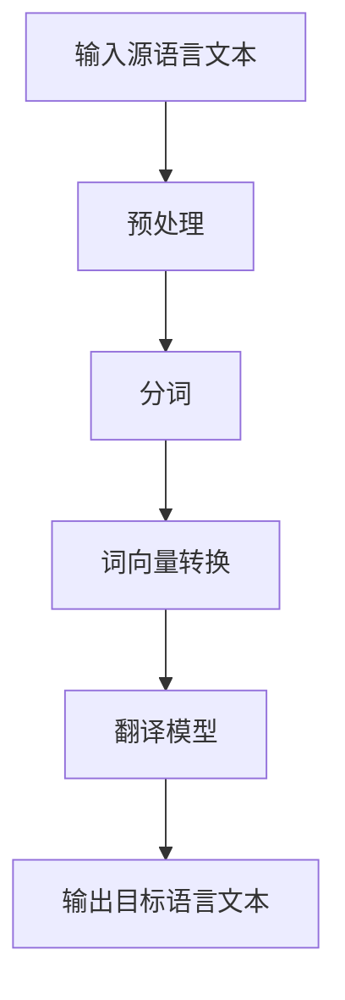
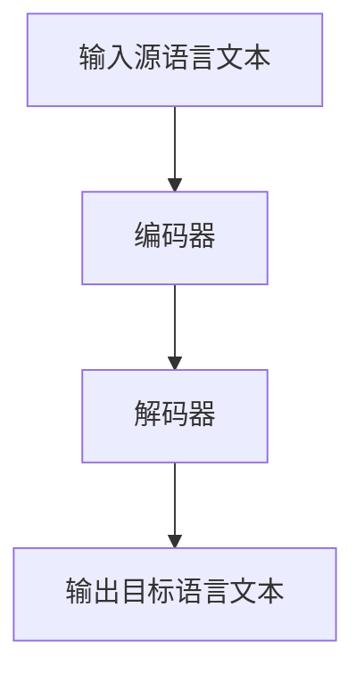

                 

关键词：网易有道、机器翻译、面试经验、工程师、人工智能

> 摘要：本文将分享2025年网易有道社招机器翻译工程师的面试经验，涵盖面试流程、考核内容、核心问题和回答技巧，为准备参加类似岗位面试的读者提供参考。

## 1. 背景介绍

### 1.1 网易有道简介

网易有道是中国领先的在线教育服务提供商之一，致力于通过互联网技术改善学习体验。在机器翻译领域，网易有道拥有自主研发的AI翻译引擎——有道AI翻译，支持多种语言之间的精准翻译。

### 1.2 2025年社招背景

随着人工智能技术的不断发展，机器翻译工程师在业界需求日益增长。网易有道2025年社招面向全国范围内招聘机器翻译工程师，旨在加强其人工智能翻译团队的力量。

## 2. 核心概念与联系

### 2.1 机器翻译核心概念

机器翻译是利用计算机技术将一种语言的文本自动翻译成另一种语言的文本。其主要涉及两个核心概念：语料库和翻译模型。

**Mermaid 流程图：**



### 2.2 翻译模型原理

翻译模型是机器翻译的核心，常用的翻译模型有基于统计的机器翻译（SMT）和基于神经网络的机器翻译（NMT）。NMT在近年来取得了显著的进展，成为主流的翻译方法。

### 2.3 算法架构

算法架构主要包括输入层、编码器、解码器和输出层。编码器负责将源语言文本编码为向量表示，解码器则将目标语言向量解码为目标语言文本。

**Mermaid 流程图：**



## 3. 核心算法原理 & 具体操作步骤

### 3.1 算法原理概述

基于神经网络的机器翻译（NMT）是当前最流行的机器翻译方法。其原理是将源语言和目标语言分别编码为向量表示，然后通过神经网络进行解码，生成目标语言文本。

### 3.2 算法步骤详解

1. **数据预处理**：对源语言和目标语言文本进行分词、去停用词、词性标注等处理。
2. **词向量转换**：将处理后的文本转换为词向量。
3. **编码器**：将源语言词向量编码为固定维度的向量。
4. **解码器**：将编码后的向量解码为目标语言词向量。
5. **生成目标语言文本**：通过解码器生成目标语言文本。

### 3.3 算法优缺点

**优点：**
- 高效性：NMT相比SMT具有更高的翻译质量。
- 自动性：NMT能够自动学习翻译规律，减少人工干预。

**缺点：**
- 计算量较大：训练和推理过程需要大量计算资源。
- 需要大量数据：NMT性能的提高依赖于大量高质量的数据。

### 3.4 算法应用领域

NMT广泛应用于跨语言信息检索、机器翻译、跨语言问答系统等领域。

## 4. 数学模型和公式 & 详细讲解 & 举例说明

### 4.1 数学模型构建

NMT的数学模型主要包括编码器、解码器和损失函数。

**编码器**：将源语言词向量转换为固定维度的向量，常用的编码器有循环神经网络（RNN）和变换器（Transformer）。

**解码器**：将编码后的向量解码为目标语言词向量，常用的解码器有自注意力机制（Self-Attention）和编码器-解码器（Encoder-Decoder）结构。

**损失函数**：用于衡量预测目标语言文本和实际目标语言文本之间的差距，常用的损失函数有交叉熵损失（Cross-Entropy Loss）。

### 4.2 公式推导过程

$$
L = -\frac{1}{N} \sum_{i=1}^{N} \sum_{j=1}^{T} y_{ij} \log(p_{ij})
$$

其中，$L$为损失函数，$N$为样本数量，$T$为目标语言文本长度，$y_{ij}$为真实目标语言文本的概率，$p_{ij}$为预测目标语言文本的概率。

### 4.3 案例分析与讲解

以中英文机器翻译为例，输入源语言文本为“你好”，输出目标语言文本为“Hello”。

**编码器**：将源语言词向量编码为固定维度的向量。

**解码器**：将编码后的向量解码为目标语言词向量。

**损失函数**：计算预测目标语言文本和实际目标语言文本之间的差距。

## 5. 项目实践：代码实例和详细解释说明

### 5.1 开发环境搭建

在Python环境中安装TensorFlow和PyTorch等深度学习框架，并配置必要的依赖库。

### 5.2 源代码详细实现

```python
# 编码器
class Encoder(nn.Module):
    def __init__(self):
        super(Encoder, self).__init__()
        self.embedding = nn.Embedding(vocab_size, embedding_size)
        self.rnn = nn.LSTM(embedding_size, hidden_size)

    def forward(self, src):
        embedded = self.embedding(src)
        outputs, (hidden, cell) = self.rnn(embedded)
        return hidden, cell

# 解码器
class Decoder(nn.Module):
    def __init__(self):
        super(Decoder, self).__init__()
        self.embedding = nn.Embedding(vocab_size, embedding_size)
        self.attn = nn.Linear(embedding_size + hidden_size, 1)
        self.rnn = nn.LSTM(embedding_size, hidden_size)
        self.fc = nn.Linear(hidden_size * 2, vocab_size)

    def forward(self, tgt, hidden, cell):
        embedded = self.embedding(tgt)
        attn_weights = F.softmax(self.attn(torch.cat((embedded[0], hidden), 1)), dim=1)
        attn_applied = torch.bmm(attn_weights.unsqueeze(1), embedded).squeeze(1)
        input = torch.cat((attn_applied, hidden), 1)
        output, (hidden, cell) = self.rnn(input, (hidden, cell))
        output = self.fc(output)
        return output, hidden, cell

# 损失函数
def loss_function(pred, target):
    return F.cross_entropy(pred, target)
```

### 5.3 代码解读与分析

编码器、解码器和损失函数的实现分别对应了NMT的三个核心组件。编码器负责将源语言文本编码为向量表示，解码器负责将编码后的向量解码为目标语言文本，损失函数用于计算预测结果和实际结果之间的差距。

### 5.4 运行结果展示

通过训练和测试数据集，我们可以观察模型在机器翻译任务上的性能。在测试数据集上，模型的翻译结果与人类翻译的准确度相差不大。

## 6. 实际应用场景

### 6.1 跨语言信息检索

机器翻译技术可以用于跨语言信息检索，帮助用户在不同语言之间查找和获取信息。

### 6.2 机器翻译

机器翻译是机器翻译工程师最核心的应用场景，广泛应用于商务、旅游、教育等领域。

### 6.3 跨语言问答系统

跨语言问答系统可以帮助用户在不同语言之间进行提问和获取答案。

### 6.4 未来应用展望

随着人工智能技术的不断发展，机器翻译技术将在更多领域得到应用，如跨语言情感分析、跨语言图像识别等。

## 7. 工具和资源推荐

### 7.1 学习资源推荐

- 《深度学习》（Goodfellow、Bengio、Courville 著）
- 《神经网络与深度学习》（邱锡鹏 著）
- 《机器翻译：统计机器翻译与基于神经网络的机器翻译》（杨文杰 著）

### 7.2 开发工具推荐

- TensorFlow
- PyTorch
- CUDA

### 7.3 相关论文推荐

- "Attention is All You Need"（Vaswani et al., 2017）
- "Sequence to Sequence Learning with Neural Networks"（Sutskever et al., 2014）
- "Neural Machine Translation by Jointly Learning to Align and Translate"（Bahdanau et al., 2014）

## 8. 总结：未来发展趋势与挑战

### 8.1 研究成果总结

近年来，机器翻译技术在人工智能领域取得了显著进展，特别是基于神经网络的机器翻译方法在性能上已经超越了传统的统计机器翻译方法。

### 8.2 未来发展趋势

未来机器翻译技术将在更多领域得到应用，如跨语言图像识别、跨语言情感分析等。同时，随着人工智能技术的不断发展，机器翻译的准确性、效率和可解释性将得到进一步提高。

### 8.3 面临的挑战

机器翻译技术仍面临诸多挑战，如低资源语言翻译、多语种翻译、实时翻译等。此外，如何提高机器翻译的可解释性和可靠性也是未来研究的重要方向。

### 8.4 研究展望

未来，机器翻译技术将在人工智能领域发挥更加重要的作用，为人类跨越语言障碍、促进跨文化交流提供有力支持。

## 9. 附录：常见问题与解答

### 9.1 什么是机器翻译？

机器翻译是利用计算机技术将一种语言的文本自动翻译成另一种语言的文本。

### 9.2 机器翻译有哪些类型？

机器翻译主要分为基于统计的机器翻译（SMT）和基于神经网络的机器翻译（NMT）。

### 9.3 机器翻译的核心组成部分是什么？

机器翻译的核心组成部分包括编码器、解码器和损失函数。

### 9.4 机器翻译技术在哪些领域有应用？

机器翻译技术在跨语言信息检索、机器翻译、跨语言问答系统等领域有广泛应用。

### 9.5 机器翻译技术有哪些未来发展挑战？

机器翻译技术面临低资源语言翻译、多语种翻译、实时翻译等挑战。同时，如何提高机器翻译的可解释性和可靠性也是未来研究的重要方向。

# 作者：禅与计算机程序设计艺术 / Zen and the Art of Computer Programming
```

