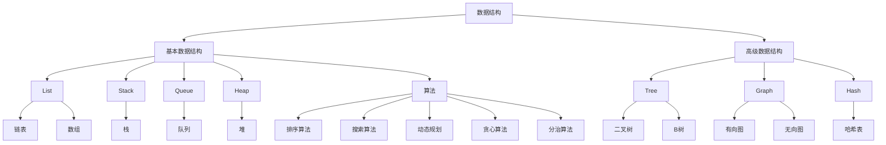

                 

关键词：网易校招、面试题、算法编程、深入探讨、技术博客、计算机科学

摘要：本文旨在深入探讨2025年网易校招面试中可能涉及的一系列面试题，包括算法编程题和核心技术问题。通过对这些问题的详细解析，帮助读者了解面试备考的策略，掌握核心算法原理，提升编程能力。文章将涵盖从基础概念到实际应用，从数学模型到代码实现，旨在为即将参加校招的同学提供全方位的指导和启示。

## 1. 背景介绍

随着科技的发展，互联网企业的校招已成为许多毕业生进入职场的重要途径。网易作为国内领先的互联网技术公司，其校招面试题目历来备受关注。2025年的网易校招面试题不仅考查了学生的基本编程能力，更深入考察了他们在数据结构和算法、系统设计等方面的综合素养。本文将结合这些特点，对校招面试中可能出现的关键题型进行详细解析。

### 1.1 校招面试的重要性

校招面试不仅是企业选拔人才的重要环节，也是毕业生展示自己能力、获得心仪岗位的机会。一个优秀的面试表现，不仅能赢得面试官的青睐，还能为毕业生带来职业发展的良好起点。

### 1.2 网易校招面试的特点

- **难度适中**：网易校招面试题目难度适中，旨在考查学生的基本功和思维能力。
- **多样性**：涵盖算法、数据结构、系统设计、软件开发等多个领域，要求考生具备较全面的技术能力。
- **实用性强**：题目注重考查考生在实际工程项目中的解决问题能力，而非仅仅停留在理论层面。

## 2. 核心概念与联系

为了更好地理解面试题，我们需要掌握一些核心概念，并了解它们之间的联系。以下是一个用Mermaid绘制的流程图，展示了数据结构、算法和系统设计等核心概念及其关系。



### 2.1 数据结构

数据结构是计算机存储、组织数据的方式。常见的有基本数据结构和高级数据结构。基本数据结构包括数组、链表、栈、队列、堆等，而高级数据结构如树、图、哈希表则更为复杂。

### 2.2 算法

算法是解决问题的方法。根据应用场景的不同，算法可以分为排序算法、搜索算法、动态规划、贪心算法、分治算法等。算法的设计与优化在计算机科学中至关重要。

### 2.3 系统设计

系统设计是软件工程中的重要环节，它涉及如何高效地组织和管理系统中的数据、功能、接口等。一个好的系统设计不仅能提升系统的性能，还能增强其可维护性和可扩展性。

## 3. 核心算法原理 & 具体操作步骤

### 3.1 算法原理概述

在2025年网易校招中，常见的算法题目包括但不限于：

- **排序算法**：冒泡排序、选择排序、插入排序、快速排序等。
- **搜索算法**：二分查找、深度优先搜索、广度优先搜索等。
- **动态规划**：斐波那契数列、最长公共子序列、最短路径问题等。
- **贪心算法**：活动选择问题、背包问题等。

### 3.2 算法步骤详解

#### 3.2.1 排序算法

以快速排序为例，其基本思想是通过一趟排序将待排序的记录分割成独立的两部分，其中一部分记录的关键字均比另一部分的关键字小，然后再按此方法对这两部分记录继续进行排序，以达到整个序列有序。

快速排序的步骤如下：

1. 选择基准元素。
2. 将数组分为两部分，一部分比基准小，另一部分比基准大。
3. 对两部分递归进行快速排序。

#### 3.2.2 搜索算法

以二分查找为例，其基本思想是在有序数组中查找一个特定元素的算法。每次比较查找中间元素，如果中间元素等于要查找的元素，则查找成功；如果中间元素大于要查找的元素，则在左侧子数组继续查找；如果中间元素小于要查找的元素，则在右侧子数组继续查找。

二分查找的步骤如下：

1. 初始化两个指针，一个指向数组的第一个元素，一个指向数组的最后一个元素。
2. 比较中间元素和要查找的元素。
3. 如果中间元素等于要查找的元素，返回中间元素的位置。
4. 如果中间元素大于要查找的元素，则在左侧子数组继续查找。
5. 如果中间元素小于要查找的元素，则在右侧子数组继续查找。
6. 重复步骤2-5，直到找到元素或指针重叠。

#### 3.2.3 动态规划

以斐波那契数列为例，其递归实现的代码如下：

```python
def fibonacci(n):
    if n <= 1:
        return n
    else:
        return fibonacci(n-1) + fibonacci(n-2)
```

动态规划的基本思想是通过将子问题的解存储起来，避免重复计算，从而提高算法的效率。斐波那契数列的动态规划实现如下：

```python
def fibonacci(n):
    if n <= 1:
        return n
    fib = [0] * (n + 1)
    fib[1] = 1
    for i in range(2, n + 1):
        fib[i] = fib[i - 1] + fib[i - 2]
    return fib[n]
```

#### 3.2.4 贪心算法

以活动选择问题为例，其基本思想是在每一时刻选择当前最优解，从而得到全局最优解。活动选择问题的代码如下：

```python
def activity_selection(s, f):
    n = len(s)
    max_activities = 0
    last_end_time = -1
    for i in range(n):
        if s[i] > last_end_time:
            max_activities += 1
            last_end_time = f[i]
    return max_activities
```

### 3.3 算法优缺点

#### 3.3.1 排序算法

- **冒泡排序**：简单易懂，但效率较低，适用于小规模数据。
- **选择排序**：简单易懂，但效率较低，适用于小规模数据。
- **插入排序**：简单易懂，但效率较低，适用于小规模数据。
- **快速排序**：平均时间复杂度为O(nlogn)，最坏情况为O(n^2)，适用于大规模数据。

#### 3.3.2 搜索算法

- **二分查找**：时间复杂度为O(logn)，适用于有序数组。
- **深度优先搜索**：适用于树形结构，但可能陷入死循环。
- **广度优先搜索**：适用于图结构，但时间复杂度较高。

#### 3.3.3 动态规划

- **优点**：避免重复计算，提高算法效率。
- **缺点**：可能产生大量的重复子问题，需要额外的存储空间。

#### 3.3.4 贪心算法

- **优点**：简单高效，易于实现。
- **缺点**：可能无法得到全局最优解。

### 3.4 算法应用领域

算法在计算机科学和工程领域有广泛的应用，包括但不限于：

- **数据科学**：排序、搜索、分类、聚类等。
- **人工智能**：神经网络、深度学习、强化学习等。
- **软件工程**：算法优化、性能分析、软件设计等。
- **网络工程**：路由算法、流量控制、负载均衡等。

## 4. 数学模型和公式 & 详细讲解 & 举例说明

### 4.1 数学模型构建

在计算机科学中，数学模型是一种抽象的数学工具，用于描述现实世界的现象。构建数学模型通常包括以下几个步骤：

1. **确定研究对象**：明确要解决的问题或现象。
2. **建立假设**：对研究对象进行简化和抽象，以便用数学方法描述。
3. **定义变量和参数**：根据研究对象和假设，定义相关的变量和参数。
4. **构建方程**：根据变量和参数之间的关系，建立数学方程。
5. **求解和验证**：求解方程，并对结果进行验证和优化。

### 4.2 公式推导过程

以下是一个简单的例子：求解一元二次方程\(ax^2 + bx + c = 0\)。

#### 步骤1：确定公式

根据一元二次方程的定义，我们有：

\[x = \frac{-b \pm \sqrt{b^2 - 4ac}}{2a}\]

#### 步骤2：推导过程

首先，将方程两边同时除以\(a\)，得到：

\[x^2 + \frac{b}{a}x + \frac{c}{a} = 0\]

然后，为了将方程转化为完全平方形式，我们需要在等式两边同时加上\(\left(\frac{b}{2a}\right)^2\)，即：

\[x^2 + \frac{b}{a}x + \left(\frac{b}{2a}\right)^2 = \left(\frac{b}{2a}\right)^2 - \frac{c}{a}\]

接下来，我们可以将左边的式子写成一个完全平方：

\[\left(x + \frac{b}{2a}\right)^2 = \left(\frac{b}{2a}\right)^2 - \frac{c}{a}\]

最后，将等式两边开平方，得到：

\[x + \frac{b}{2a} = \pm \sqrt{\left(\frac{b}{2a}\right)^2 - \frac{c}{a}}\]

进而解出\(x\)：

\[x = \frac{-b \pm \sqrt{b^2 - 4ac}}{2a}\]

### 4.3 案例分析与讲解

以下是一个具体的案例：求解方程\(x^2 - 5x + 6 = 0\)。

#### 步骤1：确定公式

根据一元二次方程的公式，我们有：

\[x = \frac{-(-5) \pm \sqrt{(-5)^2 - 4 \cdot 1 \cdot 6}}{2 \cdot 1}\]

#### 步骤2：代入参数

将参数代入公式，得到：

\[x = \frac{5 \pm \sqrt{25 - 24}}{2}\]

\[x = \frac{5 \pm \sqrt{1}}{2}\]

\[x = \frac{5 \pm 1}{2}\]

#### 步骤3：求解

根据公式，我们得到两个解：

\[x_1 = \frac{5 + 1}{2} = 3\]

\[x_2 = \frac{5 - 1}{2} = 2\]

因此，方程\(x^2 - 5x + 6 = 0\)的解为\(x = 2\)或\(x = 3\)。

## 5. 项目实践：代码实例和详细解释说明

### 5.1 开发环境搭建

在进行代码实践之前，我们需要搭建一个适合编程的开发环境。以下是搭建Python开发环境的基本步骤：

1. **安装Python**：从官方网站（https://www.python.org/）下载并安装Python。
2. **配置环境变量**：在系统设置中配置Python环境变量，确保在任何目录下都可以通过命令行运行Python。
3. **安装PyCharm**：下载并安装PyCharm，这是一个功能强大的Python集成开发环境（IDE）。
4. **安装相关库**：在PyCharm中创建一个新的项目，并通过命令行或PyCharm内置的库管理工具安装所需的库，如`numpy`、`pandas`等。

### 5.2 源代码详细实现

以下是一个简单的Python代码实例，用于实现二分查找算法：

```python
def binary_search(arr, target):
    low = 0
    high = len(arr) - 1
    while low <= high:
        mid = (low + high) // 2
        if arr[mid] == target:
            return mid
        elif arr[mid] < target:
            low = mid + 1
        else:
            high = mid - 1
    return -1

# 测试
arr = [2, 4, 6, 8, 10, 12, 14, 16, 18, 20]
target = 10
result = binary_search(arr, target)
if result != -1:
    print("元素在索引{}处".format(result))
else:
    print("元素不在数组中")
```

### 5.3 代码解读与分析

1. **函数定义**：`binary_search`函数接收一个有序数组`arr`和一个目标值`target`。
2. **初始化**：定义两个指针`low`和`high`，分别指向数组的第一个元素和最后一个元素。
3. **循环**：使用`while`循环，当`low`小于等于`high`时，继续查找。
4. **计算中间值**：每次循环计算中间值`mid`。
5. **比较与调整**：根据中间值与目标值的比较结果，调整`low`和`high`的值。
6. **返回结果**：如果找到目标值，返回其索引；否则，返回-1。

### 5.4 运行结果展示

当输入数组`arr = [2, 4, 6, 8, 10, 12, 14, 16, 18, 20]`和目标值`target = 10`时，代码输出“元素在索引4处”，说明目标值在数组中的索引为4。

## 6. 实际应用场景

算法在实际应用中扮演着至关重要的角色。以下是一些常见的实际应用场景：

### 6.1 数据处理

- **搜索引擎**：搜索引擎如百度、谷歌使用高效的排序和搜索算法来快速检索信息。
- **数据分析**：大数据处理平台如Hadoop和Spark使用分布式算法来处理海量数据。
- **推荐系统**：推荐系统如淘宝、京东使用协同过滤算法来推荐商品。

### 6.2 人工智能

- **机器学习**：机器学习算法如K-Means、决策树、神经网络等用于图像识别、语音识别、自然语言处理等任务。
- **深度学习**：深度学习算法如卷积神经网络（CNN）、循环神经网络（RNN）、生成对抗网络（GAN）等在计算机视觉、语音识别、自动驾驶等领域有广泛应用。

### 6.3 网络通信

- **路由算法**：网络通信中使用的路由算法如Dijkstra算法、A*算法等用于优化数据传输路径。
- **负载均衡**：负载均衡算法如轮询算法、最小连接数算法等用于优化服务器资源分配。

### 6.4 金融领域

- **高频交易**：高频交易算法如闪电交易算法、预测算法等用于金融市场的交易和风险管理。
- **量化投资**：量化投资算法如支持向量机（SVM）、神经网络等用于分析市场趋势和预测股票价格。

## 7. 工具和资源推荐

为了更好地学习和实践算法，以下是一些建议的工具和资源：

### 7.1 学习资源推荐

- **书籍**：《算法导论》、《编程之美》、《算法竞赛入门经典》等。
- **在线课程**：Coursera、edX、Udacity等平台上的算法和数据结构课程。
- **博客和论坛**：CSDN、GitHub、Stack Overflow等。

### 7.2 开发工具推荐

- **集成开发环境**：PyCharm、Visual Studio Code、Eclipse等。
- **算法可视化工具**：Kattis、LeetCode、牛客网等在线平台。
- **Python库**：NumPy、Pandas、Matplotlib等。

### 7.3 相关论文推荐

- **数据结构**：《数据结构与算法分析：C语言描述》、《Introduction to Algorithms》等。
- **算法**：《算法导论》、《算法竞赛入门经典》等。
- **系统设计**：《大型分布式系统设计》、《分布式系统原理与范型》等。

## 8. 总结：未来发展趋势与挑战

### 8.1 研究成果总结

近年来，算法研究在数据科学、人工智能、网络通信等领域取得了显著的成果。深度学习、分布式算法、量子算法等前沿技术正在不断突破，为计算机科学的发展注入新的动力。

### 8.2 未来发展趋势

- **算法效率的提升**：通过并行计算、分布式计算、量子计算等手段，提高算法的执行效率。
- **算法应用的拓展**：将算法应用于更多领域，如生物信息学、金融工程、医疗诊断等。
- **算法伦理和安全性**：关注算法的公平性、透明性、安全性等问题，推动算法伦理和法律法规的完善。

### 8.3 面临的挑战

- **数据质量和隐私**：数据质量和隐私问题仍然是算法应用中的重要挑战。
- **算法可解释性**：如何提高算法的可解释性，使其更易于理解和应用。
- **算法歧视**：避免算法在应用过程中产生歧视，保障社会公平。

### 8.4 研究展望

随着科技的不断进步，算法研究将继续深入，未来有望在以下几个方面取得突破：

- **跨领域算法**：探索不同领域算法之间的交叉融合，提高算法的通用性。
- **人机协同**：研究人机协同算法，提高算法在复杂环境下的自主决策能力。
- **可解释性和可靠性**：提高算法的可解释性和可靠性，使其更适用于实际应用场景。

## 9. 附录：常见问题与解答

### 9.1 常见面试问题

1. **什么是算法？**
   算法是一种解决问题的方法，通常是一系列明确的规则或步骤，用于处理输入并生成输出。

2. **什么是时间复杂度和空间复杂度？**
   时间复杂度描述算法执行时间随输入规模的增长趋势，空间复杂度描述算法执行过程中所需的额外存储空间。

3. **什么是动态规划？**
   动态规划是一种解决最优化问题的算法思想，通过将复杂问题分解为子问题，并保存子问题的解，避免重复计算，提高算法效率。

4. **什么是贪心算法？**
   贪心算法是一种简化的最优化算法，其基本思想是在每一步选择当前最优解，从而得到全局最优解。

5. **什么是排序算法？**
   排序算法是一种将一组数据按照某种规则排序的算法，常见的排序算法有冒泡排序、选择排序、插入排序、快速排序等。

### 9.2 常见问题解答

1. **为什么快速排序的平均时间复杂度为O(nlogn)？**
   快速排序通过一趟排序将待排序的记录分割成独立的两部分，其中一部分记录的关键字均比另一部分的关键字小。这个过程称为“分区”。在平均情况下，每次分区可以将待排序记录划分为几乎相等的两部分，因此，快速排序的递归树的高度为O(logn)。每次递归处理一个分区，处理时间复杂度为O(n)，因此，总的时间复杂度为O(nlogn)。

2. **什么是动态规划中的“子问题”和“重叠子问题”？**
   子问题是指将原问题分解成的更小的问题，重叠子问题是指在不同子问题的求解过程中，可能会出现重复计算的情况。动态规划通过保存子问题的解，避免重复计算，提高算法效率。

3. **什么是贪心算法中的“局部最优”和“全局最优”？**
   贪心算法在每一步选择当前最优解，称为“局部最优”。通过一系列局部最优解，最终得到全局最优解。贪心算法的核心思想是每一步都做出当前看起来最好的选择，从而期望得到全局最优解。

### 9.3 面试备考建议

1. **如何准备校招面试？**
   - **系统学习**：掌握算法和数据结构的基本原理，系统学习相关知识点。
   - **刷题实战**：通过在线平台或书籍，大量刷题，提高实战能力。
   - **模拟面试**：请同学或导师进行模拟面试，熟悉面试流程和常见问题。
   - **持续学习**：关注科技动态，了解前沿技术，拓宽知识面。

2. **如何提高编程能力？**
   - **编写代码**：多编写代码，实践是提高编程能力的最佳方式。
   - **代码审查**：参与代码审查，学习他人的编程思想和技巧。
   - **项目实践**：参与实际项目，了解项目开发的流程和规范。
   - **技术交流**：加入技术社区，与他人交流学习，共同进步。

---

在准备2025年网易校招面试的过程中，我们需要系统学习算法和数据结构的基本原理，通过大量实战练习提高解题能力，同时关注科技前沿，拓宽知识面。希望本文能为大家的面试备考提供有益的指导和启示。祝大家面试顺利，收获理想的offer！
----------------------------------------------------------------

**作者：禅与计算机程序设计艺术 / Zen and the Art of Computer Programming**

