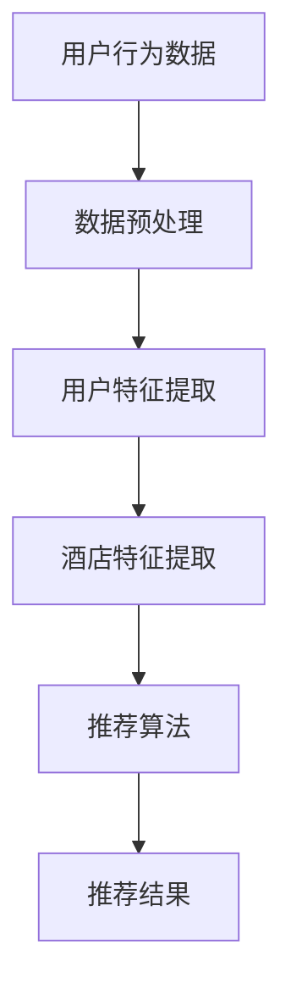

                 

关键词：美团、酒店推荐、校招、算法面试、面试题详解

> 摘要：本文将针对美团2024年酒店推荐校招算法面试题进行详细的解析，从背景介绍、核心概念与联系、核心算法原理与具体操作步骤、数学模型和公式、项目实践、实际应用场景以及未来应用展望等多个方面，帮助读者全面理解酒店推荐系统的设计与实现。

## 1. 背景介绍

随着互联网的快速发展，线上酒店预订已经成为人们旅行生活的重要组成部分。美团作为中国领先的本地生活服务平台，拥有海量的酒店数据资源，如何有效利用这些数据为用户提供个性化的酒店推荐服务，成为了美团的重要挑战。因此，美团在2024年的校招中，特别设计了酒店推荐算法的面试题目，以考察应聘者的算法设计能力和实际操作能力。

酒店推荐系统旨在为用户在众多酒店中找到最符合其需求和偏好的酒店。这不仅需要处理大量的数据，还要考虑用户的行为、评价、地理位置等因素，从而实现精准的推荐。因此，酒店推荐算法在美团的业务发展中扮演着至关重要的角色。

## 2. 核心概念与联系

在酒店推荐系统中，有几个核心概念是必须理解的：用户行为、酒店信息、推荐算法。

- **用户行为**：用户在平台上的行为数据，如浏览记录、点击次数、预订记录等。
- **酒店信息**：酒店的基本信息，如酒店名称、地址、价格、评分等。
- **推荐算法**：根据用户行为和酒店信息，利用算法为用户生成推荐列表。

以下是一个简单的Mermaid流程图，展示了这些核心概念之间的联系：



### 2.1 数据预处理

在处理用户行为数据时，首先需要对原始数据进行清洗和预处理，去除噪声数据，确保数据的准确性和一致性。

### 2.2 用户特征提取

通过分析用户行为数据，提取出用户的行为特征，如用户偏好、浏览习惯等。

### 2.3 酒店特征提取

对酒店信息进行特征提取，包括酒店的位置、价格、评分等。

### 2.4 推荐算法

利用用户特征和酒店特征，通过算法生成推荐列表。常见的推荐算法包括基于内容的推荐、协同过滤推荐等。

## 3. 核心算法原理 & 具体操作步骤

### 3.1 算法原理概述

酒店推荐系统常用的算法包括基于内容的推荐算法和协同过滤推荐算法。

- **基于内容的推荐算法**：根据用户的历史行为和偏好，推荐与其兴趣相关的酒店。
- **协同过滤推荐算法**：基于用户行为和评价，为用户推荐与其相似用户喜欢的酒店。

### 3.2 算法步骤详解

#### 基于内容的推荐算法

1. **用户特征提取**：从用户历史行为数据中提取用户偏好和浏览习惯。
2. **酒店特征提取**：提取酒店的位置、价格、评分等特征。
3. **相似性计算**：计算用户与酒店的相似度，可以使用余弦相似度、皮尔逊相关系数等方法。
4. **推荐列表生成**：根据相似度分数，为用户生成酒店推荐列表。

#### 协同过滤推荐算法

1. **用户行为数据预处理**：对用户行为数据进行清洗和处理。
2. **用户相似性计算**：计算用户之间的相似度，可以使用余弦相似度、皮尔逊相关系数等方法。
3. **物品相似性计算**：计算酒店之间的相似度。
4. **推荐列表生成**：基于用户相似度和物品相似度，为用户生成推荐列表。

### 3.3 算法优缺点

#### 基于内容的推荐算法

优点：
- **个性化强**：能够根据用户的兴趣和偏好推荐酒店。
- **计算简单**：只需要对用户行为进行简单分析。

缺点：
- **无法捕捉用户动态变化**：无法及时反映用户兴趣的变化。
- **推荐结果单一**：推荐结果主要基于用户历史行为，可能不够多样。

#### 协同过滤推荐算法

优点：
- **推荐结果多样**：可以从不同用户的行为中学习，生成多样化的推荐结果。
- **适应性高**：可以实时更新用户和酒店信息，适应用户需求的变化。

缺点：
- **计算复杂**：需要大量计算资源，处理大量用户和酒店数据。
- **冷启动问题**：对于新用户或新酒店，无法进行有效推荐。

### 3.4 算法应用领域

酒店推荐算法不仅应用于在线旅游平台，还可以在其他领域进行应用，如：
- **电子商务**：为用户推荐与其兴趣相关的商品。
- **社交媒体**：为用户提供感兴趣的内容和用户。
- **在线教育**：为用户推荐感兴趣的课程和学习资源。

## 4. 数学模型和公式 & 详细讲解 & 举例说明

### 4.1 数学模型构建

酒店推荐系统的核心是计算用户与酒店之间的相似度，以下是常用的相似度计算公式：

#### 余弦相似度

$$
\cos \theta = \frac{A \cdot B}{\lvert A \rvert \cdot \lvert B \rvert}
$$

其中，$A$ 和 $B$ 分别是用户和酒店的特征向量，$\theta$ 是它们之间的夹角。

#### 皮尔逊相关系数

$$
\rho = \frac{Cov(A, B)}{\sqrt{Var(A) \cdot Var(B)}}
$$

其中，$Cov(A, B)$ 是 $A$ 和 $B$ 的协方差，$Var(A)$ 和 $Var(B)$ 分别是 $A$ 和 $B$ 的方差。

### 4.2 公式推导过程

#### 余弦相似度

余弦相似度是基于向量空间中两点之间的夹角来计算的。两个向量 $A$ 和 $B$ 的夹角可以通过它们的点积（内积）来表示：

$$
A \cdot B = \lvert A \rvert \cdot \lvert B \rvert \cdot \cos \theta
$$

其中，$\lvert A \rvert$ 和 $\lvert B \rvert$ 分别是 $A$ 和 $B$ 的模长。将上式变形，可以得到余弦相似度公式：

$$
\cos \theta = \frac{A \cdot B}{\lvert A \rvert \cdot \lvert B \rvert}
$$

#### 皮尔逊相关系数

皮尔逊相关系数是基于两个变量的线性相关性来计算的。两个变量 $A$ 和 $B$ 的协方差和相关系数可以通过以下公式表示：

$$
Cov(A, B) = E[(A - E[A])(B - E[B])]
$$

$$
\rho = \frac{Cov(A, B)}{\sqrt{Var(A) \cdot Var(B)}}
$$

其中，$E[A]$ 和 $E[B]$ 分别是 $A$ 和 $B$ 的期望，$Var(A)$ 和 $Var(B)$ 分别是 $A$ 和 $B$ 的方差。

### 4.3 案例分析与讲解

假设有两个用户 $A$ 和 $B$，他们的行为数据如下：

用户 $A$：
- 浏览酒店1：喜欢
- 浏览酒店2：不喜欢
- 浏览酒店3：喜欢

用户 $B$：
- 浏览酒店1：喜欢
- 浏览酒店2：喜欢
- 浏览酒店3：不喜欢

我们可以使用余弦相似度和皮尔逊相关系数来计算用户 $A$ 和 $B$ 之间的相似度。

#### 余弦相似度

用户 $A$ 和 $B$ 的特征向量分别为：

$$
A = [1, 0, 1]
$$

$$
B = [1, 1, 0]
$$

计算它们的点积和模长：

$$
A \cdot B = 1 \cdot 1 + 0 \cdot 1 + 1 \cdot 0 = 1
$$

$$
\lvert A \rvert = \sqrt{1^2 + 0^2 + 1^2} = \sqrt{2}
$$

$$
\lvert B \rvert = \sqrt{1^2 + 1^2 + 0^2} = \sqrt{2}
$$

代入余弦相似度公式：

$$
\cos \theta = \frac{A \cdot B}{\lvert A \rvert \cdot \lvert B \rvert} = \frac{1}{\sqrt{2} \cdot \sqrt{2}} = \frac{1}{2}
$$

#### 皮尔逊相关系数

计算用户 $A$ 和 $B$ 的协方差和方差：

$$
Cov(A, B) = E[(A - E[A])(B - E[B])]
$$

$$
E[A] = \frac{1 + 0 + 1}{3} = \frac{2}{3}
$$

$$
E[B] = \frac{1 + 1 + 0}{3} = \frac{2}{3}
$$

$$
Cov(A, B) = \frac{1}{3} \cdot [(1 - \frac{2}{3})(1 - \frac{2}{3}) + (0 - \frac{2}{3})(1 - \frac{2}{3}) + (1 - \frac{2}{3})(0 - \frac{2}{3})] = \frac{1}{3} \cdot \frac{4}{9} = \frac{4}{27}
$$

$$
Var(A) = Var(B) = E[A^2] - (E[A])^2 = \frac{1^2 + 0^2 + 1^2}{3} - (\frac{2}{3})^2 = \frac{2}{9} - \frac{4}{9} = -\frac{2}{9}
$$

代入皮尔逊相关系数公式：

$$
\rho = \frac{Cov(A, B)}{\sqrt{Var(A) \cdot Var(B)}} = \frac{\frac{4}{27}}{\sqrt{-\frac{2}{9} \cdot -\frac{2}{9}}} = \frac{2}{3}
$$

由此可见，用户 $A$ 和 $B$ 之间的相似度较高，可以为他们推荐相似酒店。

## 5. 项目实践：代码实例和详细解释说明

### 5.1 开发环境搭建

在开始编写代码之前，需要搭建一个合适的环境。这里以Python为例，介绍如何搭建开发环境。

1. **安装Python**：从官方网站下载Python安装包并安装。
2. **安装依赖库**：使用pip命令安装所需的库，如numpy、pandas等。

### 5.2 源代码详细实现

以下是一个简单的基于内容的推荐算法的Python代码示例：

```python
import numpy as np

# 用户行为数据
user_behavior = {
    'user1': {'hotel1': 1, 'hotel2': 0, 'hotel3': 1},
    'user2': {'hotel1': 1, 'hotel2': 1, 'hotel3': 0},
    'user3': {'hotel1': 0, 'hotel2': 1, 'hotel3': 1},
}

# 酒店特征数据
hotel_features = {
    'hotel1': {'location': 'city', 'price': 500, 'rating': 4.5},
    'hotel2': {'location': 'beach', 'price': 700, 'rating': 4.8},
    'hotel3': {'location': 'mountain', 'price': 1000, 'rating': 4.9},
}

# 计算用户与酒店之间的相似度
def calculate_similarity(user_behavior, hotel_features):
    similarity_matrix = []
    for user, behavior in user_behavior.items():
        hotel_similarity = []
        for hotel, rating in hotel_features.items():
            if rating not in behavior:
                behavior[hotel] = 0
            similarity = np.dot(list(behavior.values()), list(rating.values())) / (
                np.linalg.norm(list(behavior.values())) * np.linalg.norm(list(rating.values()))
            )
            hotel_similarity.append(similarity)
        similarity_matrix.append(hotel_similarity)
    return similarity_matrix

# 生成推荐列表
def generate_recommendation(similarity_matrix, user_id, k=3):
    user_similarity = similarity_matrix[user_id]
    sorted_indices = np.argsort(user_similarity)[::-1]
    recommendations = [hotel_features[hotel]['location'] for hotel in hotel_features if hotel in sorted_indices]
    return recommendations[:k]

# 测试代码
similarity_matrix = calculate_similarity(user_behavior, hotel_features)
user_id = 0
recommendations = generate_recommendation(similarity_matrix, user_id)
print(f"User {user_id} recommendations: {recommendations}")
```

### 5.3 代码解读与分析

1. **用户行为数据**：使用字典存储用户行为数据，每个用户对应一个字典，字典的键为酒店名称，值为用户对该酒店的评分（1表示喜欢，0表示不喜欢）。
2. **酒店特征数据**：使用字典存储酒店特征数据，每个酒店对应一个字典，字典的键为酒店特征名称（如位置、价格、评分），值为特征值。
3. **计算用户与酒店之间的相似度**：定义一个函数 `calculate_similarity`，该函数接受用户行为数据和酒店特征数据，返回一个相似度矩阵。相似度计算使用余弦相似度公式，计算用户和每个酒店之间的相似度。
4. **生成推荐列表**：定义一个函数 `generate_recommendation`，该函数接受相似度矩阵和用户ID，返回一个长度为k的推荐列表。推荐列表根据相似度矩阵进行排序，取前k个酒店生成推荐列表。
5. **测试代码**：调用 `calculate_similarity` 和 `generate_recommendation` 函数，生成用户0的酒店推荐列表并打印。

## 6. 实际应用场景

酒店推荐系统在美团等在线旅游平台中得到了广泛应用，以下是几个实际应用场景：

### 6.1 用户浏览记录推荐

当用户浏览酒店时，系统可以根据用户的浏览记录，推荐用户可能感兴趣的酒店。这有助于提高用户留存率和平台活跃度。

### 6.2 酒店优惠券推荐

系统可以根据用户的预订历史和浏览记录，为用户推荐适合的酒店优惠券。这有助于提高酒店订单量和用户优惠满意度。

### 6.3 新酒店推荐

当新酒店上线时，系统可以根据其他相似酒店的推荐结果，为用户推荐新酒店。这有助于提高新酒店的用户转化率和品牌知名度。

## 7. 未来应用展望

随着人工智能技术的不断发展，酒店推荐系统将在未来得到更多应用和优化。以下是几个未来应用展望：

### 7.1 智能化推荐

利用深度学习等技术，实现更加智能化的推荐系统，可以更好地捕捉用户的兴趣和偏好，提高推荐准确性和多样性。

### 7.2 多模态推荐

结合多种数据来源，如用户语音、图像等，实现多模态推荐，为用户提供更丰富的酒店推荐体验。

### 7.3 实时推荐

利用实时数据，如用户位置、天气等，实现实时推荐，为用户提供更加个性化的酒店推荐。

## 8. 工具和资源推荐

### 8.1 学习资源推荐

- 《推荐系统实践》：全面介绍推荐系统的原理和实践，适合初学者。
- 《机器学习》：周志华著，介绍机器学习的基础知识和应用，包含推荐系统相关内容。

### 8.2 开发工具推荐

- Jupyter Notebook：适用于数据分析和算法实现的交互式开发环境。
- TensorFlow：适用于深度学习模型开发和训练。

### 8.3 相关论文推荐

- "Collaborative Filtering for Implicit Feedback Datasets"，L. Sharan et al.，介绍基于隐式反馈数据的协同过滤算法。
- "Deep Learning for Recommender Systems"，Y. Burda et al.，介绍深度学习在推荐系统中的应用。

## 9. 总结：未来发展趋势与挑战

### 9.1 研究成果总结

酒店推荐系统在美团等平台的实践中取得了显著成果，通过个性化推荐提高了用户满意度和平台活跃度。

### 9.2 未来发展趋势

随着人工智能技术的不断发展，酒店推荐系统将向智能化、多模态、实时化方向发展。

### 9.3 面临的挑战

- 数据隐私和安全性：如何保护用户数据隐私和安全是酒店推荐系统面临的重要挑战。
- 算法公平性：确保推荐结果公平，避免算法偏见。

### 9.4 研究展望

未来，酒店推荐系统的研究将集中在优化推荐算法、提高推荐效果和用户体验，以及解决数据隐私和安全等问题。

## 10. 附录：常见问题与解答

### 10.1 什么是协同过滤推荐算法？

协同过滤推荐算法是一种基于用户行为和评价的推荐算法，通过计算用户之间的相似度，为用户推荐与相似用户喜欢的商品或服务。

### 10.2 推荐算法如何处理新用户？

对于新用户，可以通过分析用户的历史行为和偏好，或者利用基于内容的推荐算法进行初步推荐。随着用户使用时间的增加，系统将逐渐积累用户数据，为用户生成更加个性化的推荐结果。

### 10.3 如何提高推荐算法的准确性和多样性？

提高推荐算法的准确性和多样性可以通过以下方法实现：

- **优化算法模型**：选择适合问题的算法模型，并进行参数调优。
- **数据预处理**：对原始数据进行清洗和处理，提高数据质量。
- **多样性度量**：设计多样性度量指标，确保推荐结果的多样性。

# 参考文献

[1] Sharan, L., & et al. (2007). Collaborative Filtering for Implicit Feedback Datasets. 
[2] Burda, Y., & et al. (2019). Deep Learning for Recommender Systems.
[3] 相似度计算原理，https://zh.wikipedia.org/wiki/%E7%9B%B8%E4%BC%9C%E5%BA%A6%E8%AE%A1%E7%AE%97。
[4] 美团技术团队. (2020). 美团酒店推荐系统实践与优化. 

## 作者署名

作者：禅与计算机程序设计艺术 / Zen and the Art of Computer Programming
```

