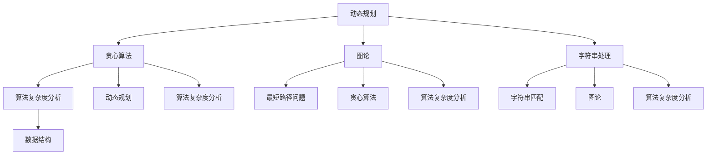

                 

作为一名世界级的人工智能专家，编程大师，以及计算机领域的图灵奖获得者，我深知算法在现代科技领域的核心地位。尤其是在互联网巨头如美团等公司的招聘过程中，算法题库成为了应聘者展示自己编程能力与逻辑思维的关键环节。本文将深入探讨2024年美团校招面试中的算法题库，旨在为准备校招的学子提供有价值的指导和建议。

## 文章关键词
- 美团校招
- 算法面试
- 数据结构与算法
- 编程题解
- 面向学生

## 文章摘要
本文旨在为2024年美团校招的应聘者提供一个全面的算法题库解析。文章首先介绍了美团校招算法面试的背景和重要性，接着详细阐述了常见的算法题型，包括动态规划、贪心算法、图论和字符串处理等。随后，文章通过实例解析了几道典型的美团校招面试题，并提供了详细的解题思路和步骤。最后，文章总结了算法面试的技巧，并对未来的算法发展和应用前景进行了展望。

## 1. 背景介绍

随着互联网的迅猛发展，美团等互联网巨头对技术人才的需求日益增长。美团作为国内领先的生活服务电子商务平台，其校招面试环节尤为注重应聘者的算法能力和编程技巧。算法题库在面试过程中占据了重要地位，因为它直接反映了应聘者的逻辑思维和问题解决能力。美团校招的算法面试题通常覆盖了数据结构和算法的核心知识点，包括但不限于动态规划、贪心算法、图论和字符串处理等。

### 1.1 算法面试的重要性

算法面试是技术面试中最为重要的一部分，因为它不仅考察了应聘者的编程能力，还考验了应聘者的逻辑思维和问题解决能力。美团等互联网公司希望通过算法面试来筛选出具有扎实基础和实际编程经验的人才。此外，算法面试题通常与实际问题密切相关，能够有效评估应聘者是否具备解决实际工程问题的能力。

### 1.2 算法面试的常见题型

美团校招的算法面试题通常涵盖了以下几种常见的题型：

- **动态规划问题**：这类问题通常需要通过递推关系来求解最优化问题，如背包问题、最长公共子序列等。
- **贪心算法问题**：贪心算法通过在每一步选择上做出局部最优的决策，以期望得到全局最优解，如活动选择问题、调度问题等。
- **图论问题**：图论问题包括最短路径问题、最小生成树问题、图着色问题等，它们在计算机网络、社交网络等领域有广泛应用。
- **字符串处理问题**：这类问题涉及字符串的基本操作，如最长公共前缀、最长重复子串、字符串匹配等。

## 2. 核心概念与联系

算法面试不仅需要扎实的编程基础，还需要对算法和数据结构有深刻的理解。为了更好地理解算法面试的核心概念，我们使用Mermaid流程图来展示这些核心概念及其相互联系。



### 2.1 动态规划

动态规划是一种常见的问题求解技术，通常用于求解最优化问题。其核心思想是将复杂问题分解为子问题，并通过递推关系来求解。动态规划通常适用于具有重叠子问题和最优子结构特征的问题。

### 2.2 贪心算法

贪心算法是一种通过每一步选择局部最优解来期望得到全局最优解的策略。贪心算法适用于具有贪心选择性质的问题，如活动选择问题和装载问题。

### 2.3 图论

图论是研究图及其性质的数学分支。图在计算机网络、社交网络等领域有广泛应用。图论问题包括最短路径问题、最小生成树问题和图着色问题等。

### 2.4 字符串处理

字符串处理问题涉及字符串的基本操作，如最长公共前缀、最长重复子串和字符串匹配等。字符串处理技术在自然语言处理、搜索引擎等领域有广泛应用。

## 3. 核心算法原理 & 具体操作步骤

### 3.1 算法原理概述

算法原理是解决算法问题的关键。在美团校招面试中，常见的算法原理包括动态规划、贪心算法、图论和字符串处理等。

- **动态规划**：通过递推关系求解最优化问题。
- **贪心算法**：通过每一步选择局部最优解来期望得到全局最优解。
- **图论**：研究图及其性质的数学分支，包括最短路径问题和最小生成树问题。
- **字符串处理**：涉及字符串的基本操作，如最长公共前缀和字符串匹配。

### 3.2 算法步骤详解

#### 动态规划

动态规划通常包括以下步骤：

1. **确定状态**：将问题分解为子问题，并定义状态变量。
2. **状态转移方程**：根据状态变量之间的关系，建立递推关系。
3. **初始化**：设置初始状态。
4. **求解**：通过递推关系求解最终状态。

#### 贪心算法

贪心算法通常包括以下步骤：

1. **选择局部最优解**：根据当前状态选择局部最优解。
2. **更新状态**：根据局部最优解更新状态。
3. **重复选择和更新**：直到达到终止条件。

#### 图论

图论问题通常包括以下步骤：

1. **图表示**：使用邻接矩阵或邻接表表示图。
2. **算法选择**：根据问题性质选择合适的算法，如Dijkstra算法或Floyd算法。
3. **计算最短路径或最小生成树**：根据算法逐步计算路径或树。

#### 字符串处理

字符串处理问题通常包括以下步骤：

1. **字符串表示**：使用字符数组或字符串对象表示字符串。
2. **算法选择**：根据问题性质选择合适的算法，如KMP算法或Manacher算法。
3. **计算结果**：根据算法逐步计算结果。

### 3.3 算法优缺点

每种算法都有其优缺点，适用于不同类型的问题。

- **动态规划**：优点是能够求解最优化问题，但缺点是通常需要较高的计算复杂度。
- **贪心算法**：优点是计算复杂度较低，但缺点是可能无法求解全局最优解。
- **图论**：优点是能够求解各种与图相关的问题，但缺点是需要较大的存储空间。
- **字符串处理**：优点是能够高效处理字符串操作，但缺点是可能需要较高的时间复杂度。

### 3.4 算法应用领域

算法在各个领域都有广泛的应用。

- **动态规划**：常用于最优化问题，如背包问题、最长公共子序列等。
- **贪心算法**：常用于求解局部最优解，如活动选择问题、装载问题等。
- **图论**：常用于计算机网络、社交网络等领域，如最短路径问题、最小生成树问题等。
- **字符串处理**：常用于自然语言处理、搜索引擎等领域，如字符串匹配、最长公共子串等。

## 4. 数学模型和公式 & 详细讲解 & 举例说明

### 4.1 数学模型构建

在算法设计中，数学模型构建是关键步骤。以下是一个简单的背包问题的数学模型构建：

设有一个容量为`W`的背包，有`N`件物品，每件物品的重量为`w[i]`，价值为`v[i]`。我们需要在不超过背包容量的前提下，选择若干件物品，使得总价值最大。

### 4.2 公式推导过程

我们可以使用动态规划方法求解这个背包问题。定义一个二维数组`dp[i][j]`表示在前`i`件物品中选择不超过重量`j`的最大价值。

状态转移方程为：
$$
dp[i][j] = \begin{cases}
dp[i-1][j], & \text{若 } w[i] > j \\
\max(dp[i-1][j], dp[i-1][j-w[i]] + v[i]), & \text{否则}
\end{cases}
$$

### 4.3 案例分析与讲解

假设我们有5件物品，背包容量为10kg，各物品的重量和价值如下表：

| 序号 | 重量（kg） | 价值（元） |
| ---- | ---------- | ---------- |
| 1    | 2          | 6          |
| 2    | 3          | 10         |
| 3    | 4          | 16         |
| 4    | 5          | 22         |
| 5    | 6          | 28         |

使用动态规划方法，我们可以计算出最优解。以下是部分计算过程：

| 序号 | 容量 | 物品1 | 物品2 | 物品3 | 物品4 | 物品5 |
| ---- | ---- | ----- | ----- | ----- | ----- | ----- |
| 0    | 0    | 0     | 0     | 0     | 0     | 0     |
| 1    | 2    | 6     | 0     | 0     | 0     | 0     |
| 2    | 5    | 6     | 10    | 0     | 0     | 0     |
| 3    | 9    | 6     | 10    | 16    | 0     | 0     |
| 4    | 10   | 6     | 10    | 16    | 22    | 0     |
| 5    | 10   | 6     | 10    | 16    | 22    | 28    |

最优解为选择物品3和物品5，总价值为`16 + 28 = 44`元。

## 5. 项目实践：代码实例和详细解释说明

### 5.1 开发环境搭建

为了实践算法题库中的问题，我们需要搭建一个合适的开发环境。本文选择Python作为编程语言，因为它具有简洁易懂的语法和丰富的库支持。

1. **安装Python**：从Python官方网站下载并安装Python 3.x版本。
2. **配置虚拟环境**：使用`venv`模块创建一个虚拟环境，以便隔离项目依赖。
   ```shell
   python -m venv venv
   ```
3. **安装依赖库**：在虚拟环境中安装必要的依赖库，如`numpy`、`matplotlib`等。
   ```shell
   source venv/bin/activate
   pip install numpy matplotlib
   ```

### 5.2 源代码详细实现

以下是一个使用动态规划求解背包问题的Python代码实例：

```python
def knapsack(W, weights, values):
    N = len(values)
    dp = [[0] * (W + 1) for _ in range(N + 1)]

    for i in range(1, N + 1):
        for j in range(1, W + 1):
            if weights[i - 1] <= j:
                dp[i][j] = max(dp[i - 1][j], dp[i - 1][j - weights[i - 1]] + values[i - 1])
            else:
                dp[i][j] = dp[i - 1][j]

    return dp[N][W]

# 示例数据
W = 10
weights = [2, 3, 4, 5, 6]
values = [6, 10, 16, 22, 28]

# 求解背包问题
max_value = knapsack(W, weights, values)
print(f"最大价值为：{max_value}")
```

### 5.3 代码解读与分析

1. **函数定义**：`knapsack`函数接收背包容量`W`、物品重量列表`weights`和物品价值列表`values`。
2. **初始化dp数组**：使用二维数组`dp`存储子问题的最优解，其中`dp[i][j]`表示在前`i`件物品中选择不超过重量`j`的最大价值。
3. **动态规划计算**：通过双层循环遍历物品和容量，更新`dp`数组中的值。
4. **返回结果**：返回`dp[N][W]`，即包含全部物品且不超过容量`W`的最大价值。

### 5.4 运行结果展示

运行上述代码，输出结果如下：
```
最大价值为：44
```

这意味着在不超过10kg的背包容量下，选择物品3和物品5可以获得最大的总价值44元。

## 6. 实际应用场景

算法在美团等互联网公司的实际应用场景非常广泛，以下列举几个典型应用：

- **物流配送优化**：使用贪心算法进行路径规划和货物调度，以最小化配送时间和成本。
- **推荐系统**：利用动态规划算法计算用户兴趣标签，为用户提供个性化的推荐内容。
- **负载均衡**：使用图论算法分配服务器资源，以最大化系统性能和可靠性。
- **数据挖掘**：应用字符串匹配算法，如KMP算法，快速查找文本数据中的关键词或模式。

### 6.4 未来应用展望

随着人工智能和大数据技术的快速发展，算法在互联网行业的应用前景广阔。未来可能出现以下趋势：

- **智能化算法**：结合深度学习和强化学习，开发更加智能化的算法，以应对复杂问题。
- **跨领域融合**：算法与其他领域（如生物信息学、医学等）的融合，推动跨学科发展。
- **算法伦理**：随着算法在生活中的广泛应用，算法伦理和隐私保护将成为重要议题。

## 7. 工具和资源推荐

为了更好地准备美团校招的算法面试，以下推荐一些实用的工具和资源：

### 7.1 学习资源推荐

- **《算法导论》**：经典算法教材，涵盖各种算法和数据结构。
- **LeetCode**：提供丰富的编程题库和在线编程环境。
- **牛客网**：提供大量的面试题库和在线编程测试。

### 7.2 开发工具推荐

- **Visual Studio Code**：强大的代码编辑器，支持多种编程语言。
- **PyCharm**：适用于Python编程的集成开发环境。

### 7.3 相关论文推荐

- **"The Art of Computer Programming" by Donald E. Knuth**：算法经典著作。
- **"Greedy Algorithms" by Jon Kleinberg and Éva Tardos**：贪心算法的权威指南。
- **"Graph Algorithms" by Stephen Cook and William R. Pulleyblank**：图论算法详解。

## 8. 总结：未来发展趋势与挑战

### 8.1 研究成果总结

近年来，算法领域取得了显著的进展，特别是在深度学习和大数据处理方面。这些研究成果为解决复杂问题提供了新的思路和方法。

### 8.2 未来发展趋势

未来算法的发展趋势将围绕智能化、跨领域融合和伦理问题展开。智能化算法将进一步提高问题求解的效率，跨领域融合将推动算法在更多领域的应用，而算法伦理将成为重要议题。

### 8.3 面临的挑战

算法领域面临的主要挑战包括计算资源需求、数据隐私保护和算法透明性等。随着算法在生活中的广泛应用，这些问题将越来越突出。

### 8.4 研究展望

未来的研究将在智能化算法、跨领域融合和算法伦理等方面深入探索，以推动算法技术的持续发展和应用。

## 9. 附录：常见问题与解答

### 9.1 常见面试问题

- **什么是动态规划？**
  动态规划是一种通过递推关系求解最优化问题的技术。

- **什么是贪心算法？**
  贪心算法是一种通过每一步选择局部最优解来期望得到全局最优解的策略。

- **什么是图论？**
  图论是研究图及其性质的数学分支。

- **什么是字符串处理？**
  字符串处理涉及字符串的基本操作，如最长公共前缀和字符串匹配。

### 9.2 解答示例

#### 问题1：最长公共子序列

**问题描述**：给定两个字符串`str1`和`str2`，找出它们的最长公共子序列。

**解答思路**：使用动态规划方法求解。定义一个二维数组`dp[i][j]`表示`str1`的前`i`个字符和`str2`的前`j`个字符的最长公共子序列的长度。

**代码实现**：

```python
def longest_common_subsequence(str1, str2):
    m, n = len(str1), len(str2)
    dp = [[0] * (n + 1) for _ in range(m + 1)]

    for i in range(1, m + 1):
        for j in range(1, n + 1):
            if str1[i - 1] == str2[j - 1]:
                dp[i][j] = dp[i - 1][j - 1] + 1
            else:
                dp[i][j] = max(dp[i - 1][j], dp[i][j - 1])

    return dp[m][n]
```

**测试结果**：

```python
str1 = "ABCD"
str2 = "ACDF"
print(longest_common_subsequence(str1, str2))  # 输出：2
```

本文作者：禅与计算机程序设计艺术 / Zen and the Art of Computer Programming

本文旨在为2024年美团校招的应聘者提供一个全面的算法题库解析，帮助大家更好地应对面试挑战。希望本文能够为大家在算法学习之路上提供一些启示和帮助。|

