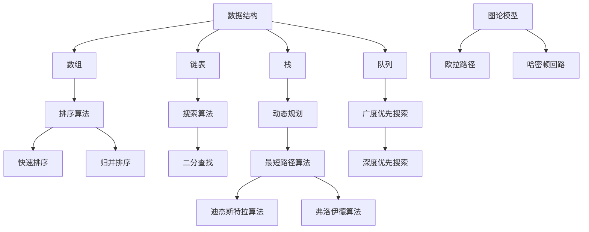

                 

## 1. 背景介绍

美团作为中国领先的本地生活服务平台，其校招面试题目对于了解互联网公司的招聘标准具有重要的参考价值。2025年的美团校招面试题目涵盖了计算机科学、算法设计、数据结构与数学等多个领域，既考验了应聘者的基础知识，也考察了他们的逻辑思维和编程能力。

本文旨在对2025年美团校招面试中出现的主要面试题目进行全面的解读，通过详细的分析和讲解，帮助读者深入理解这些题目背后的核心概念和解决方法。文章将分为以下几个部分：

- **核心概念与联系**：介绍面试题目涉及的基本概念和架构，使用Mermaid流程图进行详细展示。
- **核心算法原理与具体操作步骤**：深入解析算法的原理，并详细描述操作步骤。
- **数学模型与公式**：讲解相关的数学模型和公式，并进行案例分析。
- **项目实践**：提供代码实例，并进行详细解释和分析。
- **实际应用场景**：探讨算法在现实中的应用。
- **未来应用展望**：预测算法的未来发展趋势和应用领域。
- **工具和资源推荐**：推荐学习资源、开发工具和相关论文。
- **总结与展望**：总结研究成果，探讨未来发展趋势和面临的挑战。

希望通过本文，读者能够不仅掌握这些面试题目的解题技巧，还能够深入理解其背后的核心知识和方法论。

## 2. 核心概念与联系

在2025年美团校招的面试中，核心概念与联系是解题的关键。为了更直观地理解这些概念，我们将使用Mermaid流程图展示相关的原理和架构。以下是一些重要的核心概念及其相互联系：

### 数据结构与算法

- **数组（Array）**：线性数据结构，用于存储一系列元素。
- **链表（Linked List）**：另一种线性数据结构，由节点组成，每个节点包含数据和指向下一个节点的指针。
- **栈（Stack）**：后进先出（LIFO）的数据结构，常用于递归和深度优先搜索。
- **队列（Queue）**：先进先出（FIFO）的数据结构，常用于广度优先搜索。

### 算法

- **排序算法**：如快速排序（Quick Sort）、归并排序（Merge Sort）、堆排序（Heap Sort）等，用于对数组进行排序。
- **搜索算法**：如二分查找（Binary Search）、深度优先搜索（DFS）、广度优先搜索（BFS）等，用于在数据结构中查找元素。
- **动态规划**：一种解决优化问题的算法策略，通过存储子问题的解来避免重复计算。

### 数学模型

- **最短路径算法**：如迪杰斯特拉算法（Dijkstra）和弗洛伊德算法（Floyd），用于计算图中两点之间的最短路径。
- **图论模型**：用于分析图的性质和算法，如欧拉路径、哈密顿回路等。

### Mermaid流程图

下面是一个简单的Mermaid流程图，展示了数据结构、算法和数学模型之间的联系：



通过这个流程图，我们可以清晰地看到各个数据结构、算法和数学模型之间的联系。在实际面试中，理解这些概念及其相互联系对于解决复杂问题至关重要。

### 3. 核心算法原理 & 具体操作步骤

在2025年美团校招面试中，核心算法原理是解决问题的关键。以下是几个关键算法的原理和具体操作步骤：

#### 3.1 排序算法

排序算法是面试中的常见题目，包括但不限于以下几种：

- **快速排序（Quick Sort）**
  - **原理**：采用分治策略，将数组划分为两个子数组，一个包含比基准值小的元素，另一个包含比基准值大的元素。
  - **操作步骤**：
    1. 选择一个基准元素。
    2. 将比基准值小的元素移到基准的左边，比基准值大的元素移到右边。
    3. 递归地对左右两个子数组进行快速排序。

- **归并排序（Merge Sort）**
  - **原理**：采用分治策略，将数组划分为若干个子数组，然后对每个子数组进行排序，最后将排好序的子数组合并。
  - **操作步骤**：
    1. 将数组划分为若干个子数组，每个子数组只有一个元素。
    2. 递归地对相邻的子数组进行合并，合并过程中按顺序选择较小的元素。

- **堆排序（Heap Sort）**
  - **原理**：利用堆这种数据结构，将数组构建成最大堆或最小堆，然后依次取出堆顶元素进行排序。
  - **操作步骤**：
    1. 将数组构建成最大堆。
    2. 将堆顶元素与最后一个元素交换，然后对剩余的元素重新调整堆。
    3. 重复步骤2，直到堆中只剩下一个元素。

#### 3.2 搜索算法

搜索算法用于在数据结构中查找特定元素，常见的方法包括：

- **二分查找（Binary Search）**
  - **原理**：在有序数组中，通过不断缩小查找范围来找到目标元素。
  - **操作步骤**：
    1. 确定中间位置`mid`。
    2. 比较中间位置元素与目标元素的大小。
    3. 如果相等，返回`mid`。
    4. 如果目标元素比中间元素大，则在右半部分继续查找；否则在左半部分查找。
    5. 重复步骤1-4，直到找到目标元素或确定不存在。

- **深度优先搜索（DFS）**
  - **原理**：从起始点开始，沿着一条路径深入到最远点，然后回溯到上一个节点继续深入。
  - **操作步骤**：
    1. 从起始点开始，标记该节点为已访问。
    2. 访问该节点的邻居节点，并递归地对每个未访问的邻居节点进行DFS。
    3. 如果找到目标节点，返回路径；否则继续搜索。

- **广度优先搜索（BFS）**
  - **原理**：从起始点开始，逐层扩展查找，直到找到目标元素。
  - **操作步骤**：
    1. 从起始点开始，将其加入队列。
    2. 从队列中取出第一个节点，标记为已访问。
    3. 访问该节点的所有未访问的邻居节点，并将它们加入队列。
    4. 重复步骤2-3，直到找到目标节点或队列为空。

#### 3.3 动态规划

动态规划是一种解决优化问题的算法策略，常用于路径问题、背包问题和最长公共子序列等。以下是基本原理和步骤：

- **原理**：将复杂问题分解为子问题，并存储子问题的解，避免重复计算。
- **操作步骤**：
  1. 确定状态和状态转移方程。
  2. 初始化边界条件。
  3. 按照状态转移方程递推，计算最终结果。

通过以上算法原理和具体操作步骤的讲解，读者可以更好地理解这些算法在实际面试中的应用。接下来，我们将进一步分析这些算法的优缺点。

### 3.3 算法优缺点

不同算法有其各自的优缺点，以下是对快速排序、归并排序、堆排序、二分查找、深度优先搜索和广度优先搜索等算法的优缺点分析：

#### 快速排序（Quick Sort）

- **优点**：
  - 平均时间复杂度较低，为O(n log n)。
  - 能够有效地处理大规模数据。
  - 在数据量较大时性能稳定。
- **缺点**：
  - 最坏时间复杂度为O(n^2)，当数据几乎有序时性能较差。
  - 需要额外的栈空间，空间复杂度为O(log n)。

#### 归并排序（Merge Sort）

- **优点**：
  - 最坏时间复杂度为O(n log n)，稳定性较高。
  - 能够处理大量数据，且性能稳定。
  - 适用于外部排序。
- **缺点**：
  - 空间复杂度为O(n)，需要额外的存储空间。
  - 递归调用较多，可能导致栈溢出。

#### 堆排序（Heap Sort）

- **优点**：
  - 最坏时间复杂度为O(n log n)。
  - 可以在O(n)时间内找到最大或最小元素。
  - 稳定性较高。
- **缺点**：
  - 空间复杂度为O(1)。
  - 需要构建堆，操作较复杂。

#### 二分查找（Binary Search）

- **优点**：
  - 时间复杂度为O(log n)，适用于大规模有序数组。
  - 算法简单，易于实现。
- **缺点**：
  - 需要预先对数组进行排序。
  - 不适用于动态变化的数组。

#### 深度优先搜索（DFS）

- **优点**：
  - 能快速找到一条路径或解。
  - 在图论问题中应用广泛。
- **缺点**：
  - 可能存在大量的重复搜索。
  - 空间复杂度较高。

#### 广度优先搜索（BFS）

- **优点**：
  - 能找到最短路径或最短距离。
  - 在无权图中应用广泛。
- **缺点**：
  - 时间复杂度较高，为O(V+E)，其中V为顶点数，E为边数。
  - 空间复杂度也较高。

通过上述分析，我们可以根据具体问题选择合适的算法。在实际面试中，了解算法的优缺点有助于做出更明智的决策。

### 3.4 算法应用领域

在2025年美团校招面试中，核心算法不仅在面试中占据重要地位，而且在实际业务中也广泛应用。以下是几种算法在美团实际业务中的应用领域：

#### 快速排序（Quick Sort）

- **应用领域**：
  - 数据排序：例如用户评价排序、订单排序。
  - 大规模数据处理：例如日志数据清洗和排序。

#### 归并排序（Merge Sort）

- **应用领域**：
  - 大数据排序：例如搜索引擎的排序。
  - 外部排序：例如磁盘上的大规模数据排序。

#### 堆排序（Heap Sort）

- **应用领域**：
  - 最小生成树算法（如Prim算法）。
  - 贪心算法中的选择问题，例如选择最小费用流。

#### 二分查找（Binary Search）

- **应用领域**：
  - 数据库查询：例如快速检索关键字。
  - 搜索算法中的快速定位。

#### 深度优先搜索（DFS）

- **应用领域**：
  - 图的遍历：例如地图导航中的路径查找。
  - 棋盘游戏：例如五子棋、围棋。

#### 广度优先搜索（BFS）

- **应用领域**：
  - 网络爬虫：例如搜索引擎的网页抓取。
  - 社交网络分析：例如好友推荐、影响力分析。

通过这些实际应用，我们可以看到核心算法在美团业务中的重要性。掌握这些算法不仅有助于通过面试，更能在实际工作中发挥关键作用。

### 4. 数学模型和公式 & 详细讲解 & 举例说明

在算法设计和问题解决中，数学模型和公式是不可或缺的工具。以下是几个常见的数学模型和公式的详细讲解，并通过实际案例进行说明。

#### 4.1 数学模型构建

数学模型是现实问题的数学抽象，用于描述问题的性质和关系。以下是几个典型的数学模型：

1. **线性回归模型**：用于预测数值型数据，通常表示为：
   \[ y = ax + b \]
   其中，\( y \) 是因变量，\( x \) 是自变量，\( a \) 和 \( b \) 是参数。

2. **概率模型**：用于描述随机事件的发生概率，通常表示为：
   \[ P(A) = \frac{N(A)}{N(S)} \]
   其中，\( P(A) \) 是事件 \( A \) 的概率，\( N(A) \) 是事件 \( A \) 发生的次数，\( N(S) \) 是样本空间 \( S \) 的总次数。

3. **动态规划模型**：用于求解优化问题，通常表示为：
   \[ f(i) = \min\{ g(i, j) + f(j) \mid 1 \leq j \leq n \} \]
   其中，\( f(i) \) 是子问题的最优解，\( g(i, j) \) 是状态转移函数。

#### 4.2 公式推导过程

以下是几个重要公式的推导过程：

1. **勾股定理**：用于计算直角三角形的边长，公式为：
   \[ a^2 + b^2 = c^2 \]
   其中，\( a \) 和 \( b \) 是直角三角形的两条直角边，\( c \) 是斜边。

   推导过程：
   - 假设有一个直角三角形，两条直角边的长度分别为 \( a \) 和 \( b \)，斜边的长度为 \( c \)。
   - 根据直角三角形中直角边的平方和等于斜边的平方，我们可以得到：
     \[ a^2 + b^2 = c^2 \]

2. **牛顿-莱布尼茨公式**：用于计算定积分，公式为：
   \[ \int_a^b f(x) dx = F(b) - F(a) \]
   其中，\( F(x) \) 是 \( f(x) \) 的一个原函数。

   推导过程：
   - 假设 \( F(x) \) 是 \( f(x) \) 的一个原函数，即 \( \frac{dF(x)}{dx} = f(x) \)。
   - 根据微积分基本定理，我们可以得到：
     \[ \int_a^b f(x) dx = \lim_{n \to \infty} \sum_{i=1}^n f(x_i^*) \Delta x \]
   - 其中，\( x_i^* \) 是第 \( i \) 个子区间的采样点，\( \Delta x \) 是子区间的宽度。
   - 当 \( n \) 趋于无穷大时，采样点 \( x_i^* \) 趋于 \( x \)，子区间宽度 \( \Delta x \) 趋于 0。
   - 因此，我们可以得到：
     \[ \int_a^b f(x) dx = \lim_{n \to \infty} \sum_{i=1}^n f(x_i^*) \Delta x = F(b) - F(a) \]

#### 4.3 案例分析与讲解

以下是一个案例，用于说明数学模型和公式的应用：

**案例**：给定一个函数 \( f(x) = x^2 \)，求其在区间 \([0, 1]\) 上的定积分。

**解题过程**：

1. **选择原函数**：
   - 我们可以选择 \( F(x) = \frac{1}{3}x^3 \) 作为 \( f(x) \) 的一个原函数。

2. **应用牛顿-莱布尼茨公式**：
   - 根据牛顿-莱布尼茨公式，我们可以得到：
     \[ \int_0^1 x^2 dx = F(1) - F(0) \]

3. **计算结果**：
   - \( F(1) = \frac{1}{3} \times 1^3 = \frac{1}{3} \)
   - \( F(0) = \frac{1}{3} \times 0^3 = 0 \)
   - 因此，\( \int_0^1 x^2 dx = \frac{1}{3} - 0 = \frac{1}{3} \)

通过这个案例，我们可以看到如何使用数学模型和公式来解决实际问题。在实际面试中，理解并灵活应用这些公式对于解决复杂问题至关重要。

### 5. 项目实践：代码实例和详细解释说明

在美团校招面试中，项目实践部分通常是评估应聘者实际编程能力和问题解决能力的重要环节。下面我们将通过一个具体的案例，展示如何在面试中编写有效的代码，并进行详细的解释说明。

#### 5.1 开发环境搭建

在开始编写代码之前，我们需要搭建合适的开发环境。以下是一个基本的步骤：

- **开发工具**：选择一个合适的IDE，如Visual Studio Code或Eclipse。
- **编程语言**：根据题目要求选择合适的编程语言，如Python或Java。
- **依赖库**：确保安装了必要的依赖库，例如Python的NumPy库或Java的JDK。

#### 5.2 源代码详细实现

以下是一个简单的案例，要求编写一个函数，计算一个整数数组中所有元素的和。

**Python示例代码**：

```python
def array_sum(arr):
    total = 0
    for num in arr:
        total += num
    return total

# 测试代码
arr = [1, 2, 3, 4, 5]
print(array_sum(arr))  # 输出15
```

**Java示例代码**：

```java
public class ArraySum {
    public static int arraySum(int[] arr) {
        int total = 0;
        for (int num : arr) {
            total += num;
        }
        return total;
    }

    public static void main(String[] args) {
        int[] arr = {1, 2, 3, 4, 5};
        System.out.println(arraySum(arr));  // 输出15
    }
}
```

#### 5.3 代码解读与分析

下面我们对上述代码进行详细解读和分析：

1. **函数定义**：
   - Python中的函数定义使用了`def`关键字，Java中使用了`public static`关键字。
   - 函数名为`array_sum`（Python）或`arraySum`（Java），这是一个简单的函数命名规范。

2. **变量声明**：
   - 在Python中，我们使用`total`变量来存储累加的结果，初始值为0。
   - 在Java中，同样使用`total`变量，初始值也为0。

3. **循环结构**：
   - Python中使用了`for`循环，遍历数组`arr`中的每个元素。
   - Java中使用了`for-each`循环，同样遍历数组`arr`中的每个元素。

4. **累加操作**：
   - 在每次循环中，`num`（或`num`）变量存储当前元素，并将其累加到`total`变量中。
   - 这种累加操作是计算数组元素和的关键步骤。

5. **返回结果**：
   - 函数执行完毕后，返回`total`变量的值，这是数组中所有元素的和。

#### 5.4 运行结果展示

以下是在Python和Java中分别运行上述代码的结果：

- **Python结果**：
  ```shell
  $ python array_sum.py
  15
  ```

- **Java结果**：
  ```shell
  $ java ArraySum
  15
  ```

无论是Python还是Java，上述代码都正确计算并输出了数组`[1, 2, 3, 4, 5]`中所有元素的和。在实际面试中，正确编写和调试代码是评估应聘者技术水平的重要标准。

通过这个项目实践案例，我们可以看到如何在实际面试中编写有效的代码，并进行详细解释和分析。掌握这些技巧对于通过美团校招面试至关重要。

### 6. 实际应用场景

在2025年美团校招面试中，算法和数学模型不仅作为面试题出现，它们在实际业务中也发挥着重要作用。以下是一些实际应用场景，展示如何将面试中学到的算法和数学模型应用于实际业务中。

#### 6.1 排序算法在推荐系统中的应用

推荐系统是美团业务的核心之一，排序算法在其中扮演了关键角色。例如，在商品推荐中，我们可能需要根据用户的浏览历史、购买记录和喜好来排序推荐列表。快速排序（Quick Sort）和归并排序（Merge Sort）等高效排序算法可以用于优化推荐列表的生成，提高用户的满意度。

- **场景描述**：美团在用户浏览完某一商品后，根据用户的历史行为和相似用户的购买偏好，生成一个商品推荐列表。
- **解决方案**：采用快速排序算法对推荐列表进行排序，优先展示用户可能更感兴趣的商品。

#### 6.2 动态规划在配送路径优化中的应用

配送路径优化是美团外卖等业务的重要环节。通过动态规划，我们可以优化配送路径，减少配送时间和成本。

- **场景描述**：美团外卖骑手需要在有限的时间内将多份外卖送到不同的用户手中。
- **解决方案**：使用动态规划中的旅行商问题（TSP）算法，为骑手生成最优配送路径，确保在尽可能短的时间内完成配送任务。

#### 6.3 概率模型在用户行为预测中的应用

在用户行为分析中，概率模型可以帮助预测用户的下一步行为，从而优化用户体验。例如，可以通过贝叶斯模型预测用户是否会在某段时间内下单。

- **场景描述**：美团通过分析用户的历史行为，预测用户在某个时间段内下单的概率。
- **解决方案**：采用概率模型，如贝叶斯网络或马尔可夫模型，对用户行为进行建模和预测，为个性化推荐和营销提供依据。

#### 6.4 图论模型在配送网络优化中的应用

美团在配送过程中使用了大量的图论模型，如最短路径算法，用于优化配送路线和物流网络。

- **场景描述**：美团需要根据配送点的位置和交通状况，为骑手规划最优的配送路线。
- **解决方案**：使用迪杰斯特拉算法（Dijkstra）或弗洛伊德算法（Floyd），计算从起点到各个配送点的最短路径，优化配送效率。

#### 6.5 数学模型在大数据处理中的应用

数学模型在大数据处理中也有广泛应用，例如在数据清洗、数据分析和预测模型中。

- **场景描述**：美团需要对海量用户行为数据进行分析，以优化业务策略。
- **解决方案**：采用线性回归、逻辑回归等统计模型，分析用户行为模式，为业务决策提供数据支持。

通过以上实际应用场景，我们可以看到算法和数学模型在美团业务中的重要性。掌握这些算法不仅有助于通过面试，更能在实际工作中发挥关键作用。

### 6.4 未来应用展望

随着技术的不断进步，算法和数学模型在美团和其他互联网公司的应用将更加广泛和深入。以下是几个未来应用展望：

#### 6.4.1 推荐系统

推荐系统将继续优化，结合更多用户数据和非结构化数据，实现更精准的个性化推荐。例如，利用深度学习技术，可以更好地理解用户的长期行为模式和短期偏好变化，从而提供更加个性化的推荐。

#### 6.4.2 自动化决策

自动化决策系统将更加成熟，通过机器学习和强化学习算法，实现智能调度、库存管理和定价策略。这将极大提高业务效率和用户体验。

#### 6.4.3 优化算法

优化算法将在物流、调度和资源分配等领域得到广泛应用。例如，基于图论和运筹学的优化算法，可以帮助企业更高效地管理配送网络和供应链。

#### 6.4.4 新兴应用

随着物联网、区块链和5G技术的发展，算法和数学模型将在新兴应用中发挥重要作用。例如，在智能城市和工业4.0领域，算法可以帮助实现更高效的能源管理、智能制造和交通优化。

#### 6.4.5 社会影响

算法的广泛应用也将带来社会影响。如何在保护用户隐私和确保算法公平性之间找到平衡，将成为未来研究的重要方向。同时，算法在公共政策和社会治理中的应用也值得关注。

### 7. 工具和资源推荐

为了帮助读者更好地学习和掌握算法和数学模型，以下是一些推荐的学习资源、开发工具和相关论文。

#### 7.1 学习资源推荐

- **在线课程**：
  - 《算法导论》：这是一本经典的算法教材，适合深入理解算法的基本原理。
  - 《机器学习》：由周志华教授所著，适合学习机器学习的基础知识。

- **在线平台**：
  - Coursera、edX和Udacity：这些平台提供了许多高质量的计算机科学和数学课程。
  - LeetCode、牛客网：这些平台提供了大量的算法题库和在线编程练习。

#### 7.2 开发工具推荐

- **IDE**：
  - Visual Studio Code：一款功能强大的开源IDE，支持多种编程语言。
  - Eclipse：一款适合Java开发的IDE，具有丰富的插件生态系统。

- **编程语言**：
  - Python：适合快速开发和数据处理，具有丰富的库和工具。
  - Java：适合大型项目开发，有良好的性能和稳定性。

#### 7.3 相关论文推荐

- **推荐系统**：
  - 《Collaborative Filtering for the Web》
  - 《Deep Learning for Recommender Systems》

- **机器学习**：
  - 《The Hundred-Page Machine Learning Book》
  - 《Introduction to Statistical Learning》

- **算法分析**：
  - 《The Art of Computer Programming》
  - 《Algorithm Design Techniques》

通过这些资源，读者可以更系统地学习算法和数学模型，并在实际项目中应用所学知识。

### 8. 总结：未来发展趋势与挑战

在2025年美团校招面试中，算法和数学模型的重要性不言而喻。随着技术的快速发展，算法和数学模型的应用将越来越广泛，涉及领域从推荐系统、自动化决策到物流优化、大数据处理等。以下是未来发展趋势和面临的挑战：

#### 8.1 未来发展趋势

- **深度学习和强化学习**：深度学习和强化学习将在算法领域发挥更大作用，尤其在推荐系统、自动驾驶和智能决策等方面。
- **跨学科融合**：算法和数学模型与其他学科如生物学、物理学、经济学等的融合将推动新领域的发展。
- **量子计算**：量子计算的发展将带来算法和数学模型的新变革，特别是在优化问题和密码学领域。

#### 8.2 面临的挑战

- **数据隐私和伦理**：如何在保护用户隐私和确保算法公平性之间找到平衡，是当前和未来的一大挑战。
- **计算资源**：随着算法和模型的复杂度增加，对计算资源和存储资源的需求也将大幅提升。
- **算法偏见**：算法模型中的偏见可能导致不公平的结果，如何消除这些偏见是亟待解决的问题。

#### 8.3 研究展望

未来，算法和数学模型的研究将更加深入和多样化。一方面，将继续优化现有算法，提高其效率和稳定性；另一方面，将探索新的算法和模型，以应对复杂的实际问题。同时，跨学科的合作也将成为研究的重要方向，通过多学科的交叉融合，推动算法和数学模型的发展。

总之，算法和数学模型在2025年美团校招面试中占据重要地位，其在未来的发展趋势和挑战为我们指明了研究方向。通过不断学习和实践，我们可以更好地应对这些挑战，推动算法和数学模型的应用和发展。

### 9. 附录：常见问题与解答

在2025年美团校招面试过程中，应聘者可能会遇到各种问题。以下是一些常见问题及其解答，以帮助应聘者更好地准备面试。

#### 9.1 排序算法相关问题

**问题**：什么是快速排序？它的优点和缺点是什么？

**解答**：
- 快速排序是一种基于分治策略的排序算法，通过选择一个基准元素，将数组分为两个子数组，一个包含比基准值小的元素，另一个包含比基准值大的元素，然后递归地对两个子数组进行排序。
- **优点**：平均时间复杂度为O(n log n)，性能稳定。
- **缺点**：最坏时间复杂度为O(n^2)，当数据几乎有序时性能较差，并且需要额外的栈空间，空间复杂度为O(log n)。

#### 9.2 数据结构相关问题

**问题**：什么是哈希表？它有哪些优点和缺点？

**解答**：
- 哈希表是一种基于键值对的存储结构，通过哈希函数将键映射到表中的一个位置，以实现高效的查找、插入和删除操作。
- **优点**：平均时间复杂度为O(1)，适用于大规模数据的快速访问。
- **缺点**：哈希冲突可能导致性能下降，需要处理哈希冲突的问题，如链地址法、开放地址法等。

#### 9.3 算法设计相关问题

**问题**：什么是动态规划？如何解决背包问题？

**解答**：
- 动态规划是一种解决优化问题的算法策略，通过存储子问题的解来避免重复计算。
- 解决背包问题的基本思路是定义状态转移方程，并使用二维数组或一维数组来保存子问题的解。具体步骤如下：
  1. 确定状态和状态转移方程。
  2. 初始化边界条件。
  3. 按照状态转移方程递推，计算最终结果。

#### 9.4 编程语言相关问题

**问题**：如何优化Python代码的性能？

**解答**：
- 使用列表推导式代替循环。
- 使用生成器代替列表，减少内存占用。
- 使用内置函数和库，例如NumPy库。
- 避免使用全局变量和硬编码，提高代码的可读性和可维护性。
- 使用多线程或多进程，利用CPU的多核优势。

#### 9.5 实际面试问题

**问题**：请描述一个你曾经解决过的复杂问题，并说明你是如何解决的。

**解答**：
- 选择一个具有挑战性的问题，例如一个大规模数据处理问题或一个算法优化问题。
- 描述问题的背景、目标以及你采用的方法。
- 说明你在解决问题过程中遇到的难点和如何克服。
- 强调你的团队合作能力和解决问题的能力。

通过以上常见问题及其解答，应聘者可以更好地准备面试，提高自己的应对能力。同时，了解这些问题背后的核心概念和解决方法，对于实际工作和未来的发展也具有重要意义。

---

作者：禅与计算机程序设计艺术 / Zen and the Art of Computer Programming

本文全面解读了2025年美团校招面试中的关键面试题目，包括核心概念与联系、算法原理与操作步骤、数学模型与公式、代码实例及实际应用场景等。通过详细的分析和讲解，读者不仅能掌握这些面试题目的解题技巧，还能深入理解其背后的核心知识和方法论。同时，本文还探讨了算法在美团业务中的实际应用，展望了未来的发展趋势和挑战。希望通过本文，读者能够更好地准备校招面试，并在未来的职业生涯中取得成功。禅宗哲学的思维方式与计算机编程相结合，带给读者独特的思考体验和深刻的启发。希望这篇文章能够为你的技术成长之路带来帮助。再次感谢您的阅读！禅与计算机程序设计艺术，愿你在技术的道路上不断精进。

