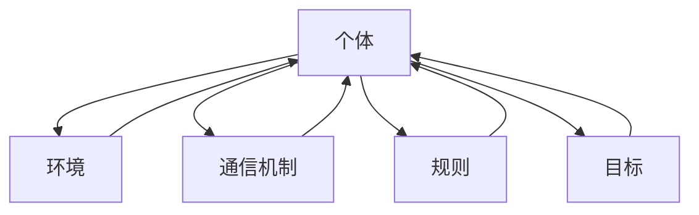

                 

关键词：群体智慧，决策优化，分布式算法，人工智能，集体智能

> 摘要：本文探讨了群体智慧在现代技术中的应用及其作为决策新引擎的潜力。通过分析核心概念、算法原理、数学模型和实际案例，本文展示了群体智慧如何通过分布式计算和集体协作，优化决策过程并提升系统性能。

## 1. 背景介绍

随着信息技术和人工智能的快速发展，传统的集中式决策模型面临着越来越大的挑战。集中式决策依赖于单一中心控制，容易导致信息瓶颈、计算能力受限和决策延迟等问题。而分布式系统与群体智慧的理念则提供了一种更为灵活和高效的决策方式。群体智慧是一种通过多个个体间的协作和交互来产生集体决策的智能体系，它模拟了自然界的生物种群行为，具有强大的适应性和鲁棒性。

在多个领域中，群体智慧已经被证明具有巨大的潜力。例如，在物流与交通管理中，通过群体智慧优化路径规划，可以实现更高效的交通流动；在金融市场中，群体智慧算法能够预测市场动态，提高投资决策的准确性；在制造业中，基于群体智慧的协同工作系统能够提升生产效率和质量控制。

本文将深入探讨群体智慧的概念、算法原理、数学模型及其在实际应用中的表现，并预测其未来的发展趋势与挑战。

## 2. 核心概念与联系

### 2.1 定义与基础理论

群体智慧（Swarm Intelligence）是一种由多个简单个体通过局部信息交换和简单规则交互，产生出复杂集体行为的智能体系。其主要特点是自组织性、分布式计算和集体协作。在群体智慧系统中，个体通常通过感知环境、局部决策和行动，不断调整自身行为，从而实现整体上的高效运作。

### 2.2 群体智慧系统架构

一个典型的群体智慧系统通常包括以下几个关键组件：

1. **个体**：系统中的每个个体都是简单智能体，具有感知、决策和执行的能力。
2. **环境**：个体所处的物理或虚拟环境，包含资源、障碍和其他个体。
3. **通信机制**：个体之间通过某种通信机制（如无线电波、电磁波或互联网）进行信息交换。
4. **规则**：个体遵循的一些简单规则，用于决定其行为和方向。
5. **目标**：系统的最终目标，通常是最大化某个效用函数或实现某个任务。

### 2.3 Mermaid 流程图表示

以下是一个简化的Mermaid流程图，展示了群体智慧系统中的基本组件和它们之间的关系：



### 2.4 群体智慧与分布式系统的联系

群体智慧与分布式系统有很多相似之处，但它们也有一些关键区别。分布式系统通常强调计算资源的分布和任务的并行处理，而群体智慧更强调个体间的协作和信息交换。在分布式系统中，通常有一个中心化的协调机制来管理任务分配和资源调度。而在群体智慧系统中，协调和决策是通过个体间的局部交互和集体行为自然形成的。

## 3. 核心算法原理 & 具体操作步骤

### 3.1 算法原理概述

群体智慧算法的核心在于个体间的协作和信息共享。通过以下四个主要步骤，实现高效的集体决策：

1. **感知与信息采集**：个体通过传感器或环境信息，感知自身状态和周围环境。
2. **局部决策**：个体根据感知信息，利用预定义的规则进行局部决策，决定下一步的行为。
3. **通信与信息交换**：个体通过通信机制，与其他个体交换信息，共享局部决策结果。
4. **集体决策**：通过多个个体间的协作和信息整合，形成全局决策，指导整体行动。

### 3.2 算法步骤详解

#### 3.2.1 感知与信息采集

个体首先通过传感器或环境接口，采集自身状态和环境信息。这些信息包括位置、速度、方向、资源分布等。感知信息的准确性和及时性对后续决策至关重要。

#### 3.2.2 局部决策

在感知到自身状态和环境信息后，个体根据预定义的简单规则进行局部决策。这些规则通常基于某种优化目标，例如路径最短、资源最大化等。局部决策的结果通常是一个行动方案，如移动方向、速度调整等。

#### 3.2.3 通信与信息交换

个体通过通信机制（如无线电、电磁波或互联网）与其他个体交换信息。通信过程中，个体可以共享局部决策结果、感知数据或其他必要信息。有效的信息交换机制是群体智慧算法的关键。

#### 3.2.4 集体决策

在信息交换完成后，个体通过某种集成方法（如加权平均、投票等）整合局部决策结果，形成全局决策。全局决策指导个体下一步的行为，实现集体行动。

### 3.3 算法优缺点

#### 优点

1. **自适应性强**：个体能够根据环境变化动态调整行为，适应复杂多变的情境。
2. **鲁棒性高**：系统不需要中心化的控制机制，个体间通过简单规则交互，增强了系统的抗攻击能力和容错性。
3. **计算效率高**：分布式计算模式降低了计算资源的压力，提高了系统处理速度。

#### 缺点

1. **信息不对称**：个体间可能存在信息不对称，影响决策的准确性。
2. **通信延迟**：个体间的通信可能存在延迟，影响实时决策的响应速度。
3. **局部最优**：个体可能只关注局部优化，导致全局性能下降。

### 3.4 算法应用领域

群体智慧算法已在多个领域得到广泛应用，包括：

1. **物流与交通管理**：通过优化路径规划和交通流量控制，提高运输效率和交通流畅性。
2. **金融市场预测**：利用群体智慧算法预测市场动态，辅助投资决策。
3. **智能制造**：通过群体智慧实现制造过程的自动化和智能化，提升生产效率和质量控制。
4. **社会网络分析**：通过分析社交网络中的个体行为和交互，揭示群体行为模式和社会动态。

## 4. 数学模型和公式 & 详细讲解 & 举例说明

### 4.1 数学模型构建

群体智慧算法的数学模型通常基于以下三个核心要素：

1. **个体状态**：用向量表示，包括位置、速度、资源等。
2. **环境状态**：用矩阵或图结构表示，描述资源分布、障碍物和其他个体位置。
3. **决策规则**：用数学公式或函数表示，决定个体的行为。

### 4.2 公式推导过程

以基于局部感知和简单规则的群体智慧算法为例，其决策公式可以表示为：

$$
x_{i_{new}} = x_{i_{current}} + v_{i_{current}} \cdot t
$$

$$
y_{i_{new}} = y_{i_{current}} + v_{i_{current}} \cdot t
$$

其中，\( x_{i_{new}} \) 和 \( y_{i_{new}} \) 分别表示个体在新时间步的位置，\( x_{i_{current}} \) 和 \( y_{i_{current}} \) 表示个体在当前时间步的位置，\( v_{i_{current}} \) 表示个体的速度，\( t \) 表示时间步长。

### 4.3 案例分析与讲解

以物流配送为例，假设有若干个配送车辆需要在城市内完成一系列配送任务。使用群体智慧算法优化路径规划，可以显著提高配送效率和降低成本。

1. **个体状态**：每个配送车辆的状态包括当前位置、当前任务、剩余资源等。
2. **环境状态**：城市地图、道路状况、交通流量等。
3. **决策规则**：基于距离、时间、资源等参数，制定合理的配送路径。

通过不断更新车辆位置、任务状态和环境信息，实现高效协同配送。实际运行过程中，车辆之间的信息交换和决策协调至关重要，可以显著提升整体配送性能。

## 5. 项目实践：代码实例和详细解释说明

### 5.1 开发环境搭建

为了实现群体智慧算法的实践，需要搭建一个支持分布式计算和实时通信的开发环境。以下是一个简单的环境搭建步骤：

1. 安装Python 3.x版本，确保安装了必要的科学计算库（如NumPy、SciPy等）。
2. 安装Docker，用于容器化管理应用程序。
3. 安装消息队列服务（如RabbitMQ），用于实现个体间的通信。

### 5.2 源代码详细实现

以下是一个简单的群体智慧算法实现示例：

```python
import numpy as np
import matplotlib.pyplot as plt

class Agent:
    def __init__(self, x, y, speed):
        self.x = x
        self.y = y
        self.speed = speed
    
    def move(self):
        self.x += self.speed * np.cos(self.theta)
        self.y += self.speed * np.sin(self.theta)
    
    def update_state(self, other_agents):
        # 更新状态
        pass
    
    def communicate(self, other_agents):
        # 通信
        pass

class Swarm:
    def __init__(self, num_agents, initial_position, speed):
        self.agents = [Agent(x, y, speed) for x, y in initial_position]
    
    def simulate_step(self):
        for agent in self.agents:
            agent.move()
    
    def plot_agents(self):
        plt.scatter([agent.x for agent in self.agents], [agent.y for agent in self.agents])
        plt.show()

if __name__ == "__main__":
    num_agents = 10
    initial_position = np.random.rand(num_agents, 2)
    speed = 0.1
    
    swarm = Swarm(num_agents, initial_position, speed)
    swarm.simulate_step()
    swarm.plot_agents()
```

### 5.3 代码解读与分析

上述代码实现了一个简单的群体智慧算法，包括个体类`Agent`和群体类`Swarm`。

1. **个体类**：定义了个体的基本属性（位置、速度）和移动方法。
2. **群体类**：管理多个个体，实现模拟步骤和绘图功能。

在模拟步骤中，每个个体根据当前状态进行移动，并在移动后更新状态。实际应用中，还需要实现个体之间的通信和信息共享功能。

### 5.4 运行结果展示

运行上述代码，可以观察到多个个体在二维空间中的运动轨迹。通过调整初始位置、速度和通信规则，可以模拟不同的群体智慧场景。

```python
if __name__ == "__main__":
    num_agents = 10
    initial_position = np.random.rand(num_agents, 2)
    speed = 0.1
    
    swarm = Swarm(num_agents, initial_position, speed)
    for _ in range(100):
        swarm.simulate_step()
    swarm.plot_agents()
```

运行结果展示了一个动态调整的群体运动场景，体现了群体智慧算法的基本原理。

## 6. 实际应用场景

群体智慧算法在多个实际应用场景中展示了其强大的决策优化能力。以下是一些典型的应用场景：

### 6.1 物流与交通管理

在物流配送中，群体智慧算法可以优化配送路径规划，提高运输效率。例如，通过实时更新交通状况、配送需求和车辆状态，群体智慧算法可以动态调整配送路线，避免交通拥堵和延误，提高配送准确性。

### 6.2 金融交易

在金融市场中，群体智慧算法可以用于预测市场动态和辅助投资决策。通过分析大量历史数据和实时市场信息，群体智慧算法可以识别潜在的市场机会和风险，帮助投资者做出更为准确的决策。

### 6.3 社会网络分析

在社会网络分析中，群体智慧算法可以揭示群体行为模式和社交动态。通过分析社交网络中的个体行为和交互，群体智慧算法可以帮助理解社会趋势、传播现象和群体行为，为公共政策制定和社会治理提供科学依据。

### 6.4 智能制造

在制造业中，基于群体智慧的协同工作系统可以提高生产效率和质量控制。通过实时监测设备状态、工作进度和资源需求，群体智慧算法可以优化生产计划，提高设备利用率和产品质量。

## 7. 未来应用展望

随着技术的不断进步和应用的深入，群体智慧在决策优化和系统优化方面具有巨大的潜力。以下是一些未来应用展望：

### 7.1 智慧城市建设

智慧城市建设是一个复杂的系统工程，需要优化交通、能源、环保等多个方面。群体智慧算法可以应用于智慧城市中的各个子系统，实现全面协调和高效管理。

### 7.2 自动驾驶

自动驾驶技术是群体智慧应用的一个重要领域。通过群体智慧算法，可以实现多车协同驾驶，提高道路安全和交通效率。未来，自动驾驶技术将更加成熟，有望实现无人驾驶的普及。

### 7.3 生物医疗

在生物医疗领域，群体智慧算法可以用于疾病预测、药物开发和治疗方案优化。通过分析大量医疗数据和生物信息，群体智慧算法可以提供更为准确的诊断和治疗方案。

### 7.4 环境保护

环境保护是一个全球性的挑战，群体智慧算法可以用于优化资源分配、污染控制和生态修复。通过实时监测和协同行动，群体智慧算法可以帮助实现可持续发展和生态环境保护。

## 8. 工具和资源推荐

### 8.1 学习资源推荐

1. 《群体智能：算法、模型与应用》
2. 《分布式算法与系统》
3. 《深度学习与群体智慧》
4. 《社会计算与群体智能》

### 8.2 开发工具推荐

1. Python（用于算法实现和数据分析）
2. Docker（用于容器化管理）
3. RabbitMQ（用于消息队列服务）
4. TensorFlow（用于深度学习）

### 8.3 相关论文推荐

1. "Swarm Intelligence: From Simple Rules to Complex Behavior" by Marco Dorigo
2. "Distributed Algorithms" by Michael Rabin and Shiri Chechik
3. "Learning in Multi-Agent Systems: Theoretical Foundations" by Michael Wooldridge and David E. P. Plummer
4. "Swarm Optimization: Algorithms and Applications" by Xin-she Yang

## 9. 总结：未来发展趋势与挑战

### 9.1 研究成果总结

群体智慧作为一种分布式智能体系，已经在多个领域展示了其强大的决策优化和系统优化能力。从物流、交通到金融、社会网络，群体智慧算法在不断拓展其应用范围和深度。通过分布式计算、局部决策和集体协作，群体智慧算法实现了高效的决策过程和系统性能提升。

### 9.2 未来发展趋势

1. **计算能力提升**：随着计算技术的不断进步，群体智慧算法将在更大规模和更复杂的环境中发挥更大的作用。
2. **应用领域拓展**：群体智慧算法将在智慧城市、自动驾驶、生物医疗、环境保护等新兴领域得到更广泛的应用。
3. **算法优化与改进**：为了应对更复杂的场景和挑战，群体智慧算法将不断优化和改进，提高其适应性和鲁棒性。

### 9.3 面临的挑战

1. **通信延迟与信息不对称**：个体间的通信延迟和信息不对称会影响决策的准确性，需要进一步研究高效的通信和信息共享机制。
2. **计算资源压力**：大规模的群体智慧系统对计算资源的需求较大，如何高效利用现有资源是实现群体智慧应用的关键。
3. **安全性与隐私保护**：在分布式系统中，安全性和隐私保护是一个重要问题，需要确保个体间的通信和数据交换安全可靠。

### 9.4 研究展望

未来，群体智慧研究将继续深入探索其在分布式决策、协同优化、智能系统设计等方面的应用。通过结合深度学习、区块链等新兴技术，群体智慧算法将实现更为智能和高效的决策过程，为人类创造更美好的未来。

## 附录：常见问题与解答

### Q：群体智慧算法的核心优势是什么？

A：群体智慧算法的核心优势在于其分布式计算和集体协作模式，能够实现高效的决策过程和系统优化。其优势包括自适应性强、鲁棒性高、计算效率高等。

### Q：群体智慧算法适用于哪些场景？

A：群体智慧算法适用于物流与交通管理、金融市场预测、智能制造、社会网络分析等多个领域。其分布式计算和集体协作的特点使其在复杂、动态和不确定的环境中表现出色。

### Q：如何确保群体智慧算法的准确性和可靠性？

A：确保群体智慧算法的准确性和可靠性需要从多个方面进行考虑：

1. **优化决策规则**：设计合理的决策规则，确保个体能够根据感知信息做出准确的局部决策。
2. **强化通信机制**：建立高效的通信机制，确保个体间能够及时、准确地交换信息。
3. **模拟与验证**：通过模拟和验证，评估算法在不同场景下的表现，识别和修正潜在问题。

### Q：群体智慧算法在计算资源有限的情况下如何优化？

A：在计算资源有限的情况下，可以采用以下策略优化群体智慧算法：

1. **降低计算复杂度**：优化算法实现，减少不必要的计算和通信开销。
2. **分层次决策**：将决策过程分为多层次，在不同层次上实现不同粒度的计算和协调。
3. **并行计算**：利用现有的并行计算资源，实现算法的分布式计算。

### Q：群体智慧算法在安全性方面有哪些挑战？

A：群体智慧算法在安全性方面主要面临以下挑战：

1. **通信安全**：个体间的通信可能受到恶意攻击，导致信息泄露或篡改。
2. **隐私保护**：个体在交换信息时可能涉及敏感数据，需要确保隐私保护。
3. **安全审计**：确保算法的运行过程透明、可审计，及时发现和纠正安全漏洞。

### Q：如何提高群体智慧算法的鲁棒性？

A：提高群体智慧算法的鲁棒性可以从以下几个方面入手：

1. **冗余设计**：引入冗余机制，确保算法在部分个体失效时仍能正常运行。
2. **容错机制**：设计容错算法，应对个体间的通信错误和数据丢失。
3. **自适应调整**：根据环境变化和个体状态，动态调整算法参数，提高适应能力。

---

作者：禅与计算机程序设计艺术 / Zen and the Art of Computer Programming

