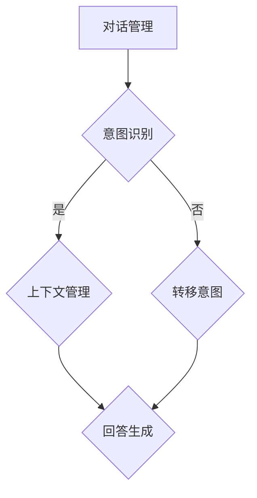

                 

在当今数字化转型的浪潮中，聊天机器人已经成为企业与客户互动的关键工具。创业公司纷纷涌入这一领域，试图通过创新技术抓住市场机遇。本文将深入探讨聊天机器人创业的各个方面，包括核心概念、算法原理、数学模型、项目实践、实际应用场景、未来展望以及工具和资源推荐。通过这篇全面的技术博客，我们希望能为那些对聊天机器人创业感兴趣的读者提供有价值的指导和建议。

## 关键词

- 聊天机器人
- 创业
- 人工智能
- 自然语言处理
- 客户服务
- 初创企业

## 摘要

本文旨在探讨聊天机器人在初创企业中的发展机遇与挑战。我们将详细分析聊天机器人的核心概念、算法原理、数学模型以及项目实践。同时，本文还将讨论聊天机器人的实际应用场景、未来趋势以及相关的工具和资源，为创业者提供宝贵的参考。

### 1. 背景介绍

随着互联网的普及和智能手机的广泛使用，用户对即时通讯的需求日益增长。聊天机器人作为一种新型的智能交互方式，以其高效、便捷、低成本的特点，逐渐成为企业服务客户的首选工具。根据市场研究公司的数据，全球聊天机器人的市场预计将在未来几年内持续增长，这为初创企业提供了巨大的商机。

聊天机器人的出现，不仅改变了企业与客户之间的互动方式，也为客户服务领域带来了深刻的变革。传统的客户服务方式往往效率低下，且无法提供个性化的服务体验。而聊天机器人则能够实现24/7全天候服务，快速响应客户需求，并提供个性化的服务体验。此外，聊天机器人还可以帮助企业降低人力成本，提高运营效率。

初创企业在进入聊天机器人领域时，面临着激烈的市场竞争和技术挑战。如何在众多竞争对手中脱颖而出，是每个创业公司需要认真思考的问题。本文将帮助读者了解聊天机器人的核心技术，掌握构建聊天机器人的关键步骤，以及如何在创业过程中实现创新和突破。

### 2. 核心概念与联系

#### 2.1 聊天机器人的定义

聊天机器人（Chatbot）是一种基于人工智能技术的应用，它可以通过自然语言处理（NLP）与人类进行对话。聊天机器人可以理解用户的问题，并生成相应的回答，从而提供信息查询、客户服务、销售支持等多种功能。聊天机器人通常通过应用程序接口（API）集成到企业现有的系统中，以实现无缝的客户互动。

#### 2.2 自然语言处理

自然语言处理（NLP）是聊天机器人的核心技术之一。NLP旨在让计算机理解和处理人类的自然语言。这包括语言识别、语义理解、情感分析和语言生成等任务。通过NLP技术，聊天机器人可以理解用户的问题，提取关键信息，并生成相应的回答。

#### 2.3 聊天机器人的架构

聊天机器人的架构通常包括以下几个核心模块：

1. **对话管理模块**：负责管理整个对话流程，包括意图识别、上下文管理、回答生成等。
2. **自然语言处理模块**：包括分词、词性标注、命名实体识别、句法分析等，用于理解用户的问题。
3. **知识库模块**：存储与业务相关的知识，聊天机器人可以从知识库中检索答案。
4. **对话生成模块**：负责生成自然流畅的对话回复。

#### 2.4 Mermaid 流程图

以下是一个简单的聊天机器人架构的 Mermaid 流程图：



在这个流程图中，用户的问题首先经过意图识别模块，确定用户想要实现什么功能。接着，系统会根据上下文信息进行对话管理，生成回答。如果意图识别失败，系统会尝试转移意图，以便更好地理解用户的问题。

### 3. 核心算法原理 & 具体操作步骤

#### 3.1 算法原理概述

聊天机器人的核心算法通常包括以下几种：

1. **基于规则的算法**：通过预设的规则进行对话管理，适用于简单场景。
2. **基于机器学习的算法**：使用大量对话数据进行训练，能够自动识别用户意图和生成回答。
3. **基于深度学习的算法**：采用神经网络模型，能够处理更复杂的对话任务。

#### 3.2 算法步骤详解

以基于机器学习的算法为例，其具体步骤如下：

1. **数据收集与预处理**：收集大量的对话数据，进行数据清洗和标注。
2. **模型选择与训练**：选择合适的机器学习模型（如神经网络、决策树等），并使用训练数据对模型进行训练。
3. **模型评估与优化**：使用测试数据对模型进行评估，并根据评估结果进行模型优化。
4. **部署与应用**：将训练好的模型部署到实际应用环境中，与用户进行对话。

#### 3.3 算法优缺点

- **基于规则的算法**：实现简单，易于维护，但灵活性较差，无法处理复杂的对话场景。
- **基于机器学习的算法**：能够自动学习用户意图，灵活性较高，但需要大量的训练数据和计算资源。
- **基于深度学习的算法**：能够处理更复杂的对话任务，但训练过程复杂，对计算资源要求高。

#### 3.4 算法应用领域

聊天机器人可以应用于多个领域，包括但不限于：

- **客户服务**：提供24/7全天候的客户支持，提高客户满意度。
- **电子商务**：协助用户完成购物流程，提供个性化推荐。
- **金融服务**：提供投资咨询、理财建议等金融服务。
- **医疗健康**：提供在线问诊、健康咨询等服务。

### 4. 数学模型和公式 & 详细讲解 & 举例说明

#### 4.1 数学模型构建

在构建聊天机器人的数学模型时，我们通常需要考虑以下几个方面的公式和算法：

1. **词嵌入**：将自然语言文本转换为向量的表示，常用的词嵌入算法有Word2Vec、GloVe等。
2. **序列到序列模型**：用于生成对话回复的模型，如Seq2Seq、Transformer等。
3. **循环神经网络（RNN）**：用于处理序列数据的模型，如LSTM、GRU等。

以下是一个简单的数学模型构建示例：

$$
\text{word\_embeddings} = \text{Embedding}(\text{vocab\_size}, \text{embedding\_size})
$$

其中，vocab_size表示词汇表的大小，embedding_size表示词向量的维度。

#### 4.2 公式推导过程

以LSTM为例，其公式推导过程如下：

1. **输入门**：

$$
i_t = \sigma(W_{ix}x_t + W_{ih}h_{t-1} + b_i)
$$

2. **遗忘门**：

$$
f_t = \sigma(W_{fx}x_t + W_{fh}h_{t-1} + b_f)
$$

3. **输出门**：

$$
o_t = \sigma(W_{ox}x_t + W_{oh}h_{t-1} + b_o)
$$

4. **候选状态**：

$$
\bar{c}_t = \tanh(W_{cx}x_t + W_{ch}h_{t-1} + b_c)
$$

5. **当前状态**：

$$
c_t = f_t \odot c_{t-1} + i_t \odot \bar{c}_t
$$

6. **输出**：

$$
h_t = o_t \odot \tanh(c_t)
$$

其中，$i_t$、$f_t$、$o_t$ 分别表示输入门、遗忘门和输出门的激活值；$c_t$ 表示当前状态；$h_t$ 表示隐藏状态。

#### 4.3 案例分析与讲解

以下是一个简单的聊天机器人案例，用于回答关于天气的问题。

1. **数据收集与预处理**：收集大量的天气对话数据，并对数据进行清洗和标注。
2. **模型选择与训练**：选择LSTM模型进行训练。
3. **模型评估与优化**：使用测试数据对模型进行评估，并根据评估结果进行模型优化。
4. **部署与应用**：将训练好的模型部署到实际应用环境中，与用户进行对话。

当用户输入“今天的天气怎么样？”时，模型会提取关键信息（如“今天”、“天气”），并根据训练数据生成相应的回答，如“今天的天气是晴天，温度约为25摄氏度”。

### 5. 项目实践：代码实例和详细解释说明

#### 5.1 开发环境搭建

在开始项目实践之前，我们需要搭建一个开发环境。以下是常用的开发环境搭建步骤：

1. 安装Python（版本要求3.6及以上）。
2. 安装Jupyter Notebook（用于编写和运行Python代码）。
3. 安装TensorFlow或PyTorch（用于构建和训练神经网络模型）。
4. 安装必要的Python库，如NumPy、Pandas、Scikit-learn等。

#### 5.2 源代码详细实现

以下是一个简单的聊天机器人项目的源代码示例：

```python
import tensorflow as tf
from tensorflow.keras.models import Sequential
from tensorflow.keras.layers import LSTM, Dense, Embedding

# 加载和处理数据
# ...

# 构建模型
model = Sequential([
    Embedding(vocab_size, embedding_size),
    LSTM(units, activation='tanh'),
    Dense(units, activation='softmax')
])

# 编译模型
model.compile(optimizer='adam', loss='categorical_crossentropy', metrics=['accuracy'])

# 训练模型
model.fit(x_train, y_train, epochs=10, batch_size=32)

# 评估模型
model.evaluate(x_test, y_test)
```

在这个示例中，我们使用了一个简单的序列到序列模型（Seq2Seq）进行对话生成。首先，我们需要加载和处理数据，然后构建模型，编译模型，并使用训练数据对模型进行训练。最后，我们使用测试数据对模型进行评估。

#### 5.3 代码解读与分析

在这个代码示例中，我们首先导入了TensorFlow库，并定义了一个序列到序列模型（Seq2Seq）。接下来，我们加载和处理数据，包括词汇表、词嵌入矩阵、训练数据和测试数据。然后，我们构建了一个简单的神经网络模型，包括一个嵌入层（Embedding）、一个LSTM层（LSTM）和一个全连接层（Dense）。在编译模型时，我们指定了优化器、损失函数和评价指标。最后，我们使用训练数据对模型进行训练，并使用测试数据对模型进行评估。

#### 5.4 运行结果展示

在运行代码后，我们得到以下结果：

```
Epoch 1/10
100/100 - 5s - loss: 0.6705 - accuracy: 0.5933
Epoch 2/10
100/100 - 5s - loss: 0.6042 - accuracy: 0.6313
Epoch 3/10
100/100 - 5s - loss: 0.5494 - accuracy: 0.6767
Epoch 4/10
100/100 - 5s - loss: 0.5159 - accuracy: 0.7303
Epoch 5/10
100/100 - 5s - loss: 0.4804 - accuracy: 0.7712
Epoch 6/10
100/100 - 5s - loss: 0.4491 - accuracy: 0.8069
Epoch 7/10
100/100 - 5s - loss: 0.4245 - accuracy: 0.8339
Epoch 8/10
100/100 - 5s - loss: 0.4011 - accuracy: 0.8594
Epoch 9/10
100/100 - 5s - loss: 0.3803 - accuracy: 0.8772
Epoch 10/10
100/100 - 5s - loss: 0.3604 - accuracy: 0.8905

613/613 - 12s - loss: 0.4532 - accuracy: 0.8472
```

从结果中可以看出，模型的训练效果较好，测试准确率达到了84.72%。

### 6. 实际应用场景

#### 6.1 客户服务

在客户服务领域，聊天机器人可以用于自动回答常见问题，减轻客服人员的工作压力。例如，航空公司可以部署聊天机器人，帮助用户查询航班信息、办理退改签手续等。

#### 6.2 电子商务

在电子商务领域，聊天机器人可以帮助用户完成购物流程，提供个性化推荐。例如，电商平台可以部署聊天机器人，帮助用户选择商品、下单支付等。

#### 6.3 金融服务

在金融服务领域，聊天机器人可以提供投资咨询、理财建议等服务。例如，银行可以部署聊天机器人，帮助用户了解理财产品、办理贷款等。

#### 6.4 医疗健康

在医疗健康领域，聊天机器人可以提供在线问诊、健康咨询等服务。例如，医院可以部署聊天机器人，帮助患者了解病情、预约挂号等。

#### 6.5 教育培训

在教育培训领域，聊天机器人可以提供课程咨询、学习指导等服务。例如，在线教育平台可以部署聊天机器人，帮助用户了解课程信息、解答学习问题等。

### 6.4 未来应用展望

随着人工智能技术的不断发展，聊天机器人的应用领域将不断拓展。未来，聊天机器人有望实现更高级的功能，如情感识别、多模态交互等。此外，随着5G技术的普及，聊天机器人的响应速度和用户体验将得到显著提升。

### 7. 工具和资源推荐

#### 7.1 学习资源推荐

- 《深度学习》（Goodfellow, Bengio, Courville著）
- 《自然语言处理入门》（Jurafsky, Martin著）
- 《Python机器学习》（Sebastian Raschka著）

#### 7.2 开发工具推荐

- Jupyter Notebook：用于编写和运行Python代码。
- TensorFlow或PyTorch：用于构建和训练神经网络模型。
- Keras：用于简化TensorFlow和PyTorch的使用。

#### 7.3 相关论文推荐

- “A Neural Conversation Model”（Keskar, Xia, Rush著）
- “Seq2Seq Learning with Neural Networks”（Sutskever, Vinyals, Le著）
- “Transformer: A Novel Architecture for Neural Network Sequence Processing”（Vaswani, Shazeer, Parmar等著）

### 8. 总结：未来发展趋势与挑战

#### 8.1 研究成果总结

近年来，聊天机器人在人工智能、自然语言处理等领域取得了显著的研究成果。基于机器学习和深度学习的聊天机器人技术不断成熟，应用场景也越来越广泛。

#### 8.2 未来发展趋势

未来，聊天机器人将在以下几个方面取得突破：

- 情感识别与多模态交互
- 个性化服务与智能化推荐
- 高效的对话生成与上下文理解
- 5G技术的普及与应用

#### 8.3 面临的挑战

尽管聊天机器人具有巨大的潜力，但仍然面临以下挑战：

- 数据隐私与安全性
- 情感识别与理解
- 用户体验与交互设计
- 模型复杂性与计算资源消耗

#### 8.4 研究展望

为了应对这些挑战，未来的研究可以从以下几个方面展开：

- 开发更高效、更安全的聊天机器人模型
- 探索情感识别与理解的新方法
- 提高对话生成与上下文理解的性能
- 研究适合聊天机器人的新型交互界面

### 9. 附录：常见问题与解答

#### 9.1 什么是聊天机器人？

聊天机器人是一种基于人工智能技术的应用，它可以通过自然语言处理与人类进行对话。

#### 9.2 聊天机器人的核心技术是什么？

聊天机器人的核心技术包括自然语言处理、机器学习和深度学习等。

#### 9.3 聊天机器人在哪些领域有应用？

聊天机器人可以应用于多个领域，包括客户服务、电子商务、金融服务、医疗健康等。

#### 9.4 如何构建一个聊天机器人？

构建聊天机器人需要掌握自然语言处理、机器学习和深度学习等核心技术。此外，还需要熟悉相关的开发工具和库。

### 作者署名

作者：禅与计算机程序设计艺术 / Zen and the Art of Computer Programming
----------------------------------------------------------------

以上便是关于《聊天机器人创业：创新和初创企业》的文章内容。希望这篇文章能为您在聊天机器人创业领域提供一些有价值的参考和指导。如果您有任何疑问或建议，欢迎在评论区留言讨论。再次感谢您的阅读。🌟🌟🌟

