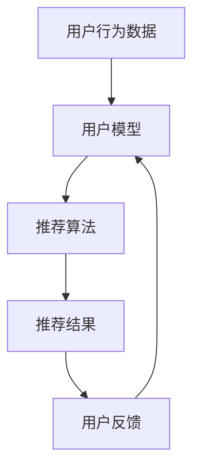

                 

关键词：聊天机器人，推荐系统，个性化内容，用户模型，协同过滤，内容建议，机器学习

## 摘要

本文将深入探讨聊天机器人推荐系统的构建，特别是如何实现个性化内容建议。我们首先回顾了聊天机器人推荐系统的背景和重要性，然后详细介绍了核心概念和架构，并分析了常用的推荐算法。接下来，我们通过数学模型和具体代码实例展示了如何实现推荐系统，并讨论了其实际应用场景。最后，我们对未来的发展趋势和面临的挑战进行了展望。

## 1. 背景介绍

### 聊天机器人的兴起

随着互联网的普及和智能设备的广泛应用，聊天机器人已经成为人们日常生活中不可或缺的一部分。无论是客服、教育、娱乐还是购物，聊天机器人都能提供即时、高效的服务。而推荐系统则是聊天机器人的核心功能之一，它能够根据用户的兴趣和行为，为用户提供个性化的内容建议，从而提高用户体验和满意度。

### 推荐系统的重要性

推荐系统在电子商务、社交媒体、在线视频和音乐平台等领域已经取得了显著的成功。通过分析用户的历史行为和兴趣，推荐系统可以预测用户可能感兴趣的内容，从而提供个性化的推荐。在聊天机器人中，推荐系统同样至关重要，它能够帮助机器人更好地理解用户需求，提供更加贴心的服务。

### 个性化内容建议的需求

在信息爆炸的时代，用户往往面临信息过载的问题。如何从海量信息中筛选出用户感兴趣的内容，是推荐系统需要解决的关键问题。个性化内容建议能够帮助用户节省时间，提高工作效率，同时也能增强用户的满意度和忠诚度。

## 2. 核心概念与联系

为了构建一个有效的聊天机器人推荐系统，我们需要了解以下几个核心概念：

### 用户模型

用户模型是对用户兴趣和行为特征的抽象表示。通过收集和分析用户的行为数据，我们可以构建出用户的兴趣图谱，从而更好地理解用户的需求。

### 内容模型

内容模型是对聊天机器人提供的内容特征的抽象表示。通过对内容进行分类和标注，我们可以将内容划分为不同的类别，以便进行推荐。

### 推荐算法

推荐算法是推荐系统的核心，它负责根据用户模型和内容模型生成个性化的推荐列表。常见的推荐算法包括基于协同过滤、基于内容的推荐和混合推荐等。

### Mermaid 流程图

下面是一个简单的 Mermaid 流程图，展示了聊天机器人推荐系统的整体架构：



## 3. 核心算法原理 & 具体操作步骤

### 3.1 算法原理概述

聊天机器人推荐系统通常采用以下几种算法：

- **基于协同过滤的推荐**：通过分析用户之间的相似性，为用户提供类似的用户喜欢的推荐内容。
- **基于内容的推荐**：根据用户的历史行为和内容特征，为用户推荐相似的内容。
- **混合推荐**：结合协同过滤和内容推荐的优势，为用户提供更加精准的推荐。

### 3.2 算法步骤详解

1. **数据收集与预处理**：收集用户行为数据和内容数据，并进行清洗和预处理，以便用于后续分析。
2. **用户模型构建**：通过分析用户的行为数据，构建用户的兴趣图谱，从而确定用户的兴趣点。
3. **内容模型构建**：对内容进行分类和标注，构建内容模型，以便进行内容推荐。
4. **推荐算法选择**：根据用户模型和内容模型，选择合适的推荐算法，生成推荐结果。
5. **推荐结果评估**：评估推荐结果的准确性和用户满意度，并根据用户反馈进行优化。

### 3.3 算法优缺点

- **基于协同过滤的推荐**：优点在于能够提供个性化的推荐，缺点是容易受到数据稀疏性的影响。
- **基于内容的推荐**：优点是能够提供相关性强、用户感兴趣的内容，缺点是可能无法满足用户的个性化需求。
- **混合推荐**：优点是能够结合协同过滤和内容推荐的优势，提供更精准的推荐，缺点是算法复杂度较高。

### 3.4 算法应用领域

聊天机器人推荐系统广泛应用于各个领域，如：

- **电子商务**：为用户推荐商品，提高销售额。
- **社交媒体**：为用户推荐感兴趣的内容，增强用户粘性。
- **在线教育**：为用户推荐学习资源，提高学习效果。

## 4. 数学模型和公式 & 详细讲解 & 举例说明

### 4.1 数学模型构建

聊天机器人推荐系统的数学模型主要包括用户模型和内容模型。

- **用户模型**：假设用户 u 对某个内容 i 有兴趣，可以表示为 \( R_{ui} \) ，其中 R 表示用户对内容的兴趣程度。
- **内容模型**：假设内容 i 的特征向量表示为 \( C_i \) ，则用户 u 对内容 i 的兴趣程度可以表示为 \( \sim R_{ui} = f(C_i, R_u) \) ，其中 f 表示兴趣度函数。

### 4.2 公式推导过程

- **协同过滤算法**：基于用户的相似性进行推荐，可以表示为：
  $$ \hat{R}_{ui} = \sum_{v \in N(u)} R_{vi} w_{uv} $$
  其中，N(u) 表示与用户 u 相似的用户集合，w_{uv} 表示用户 u 和 v 之间的相似度。

- **基于内容的推荐**：基于内容的相关性进行推荐，可以表示为：
  $$ \hat{R}_{ui} = \sum_{j \in I(i)} R_{uj} \cdot \text{sim}(C_i, C_j) $$
  其中，I(i) 表示与内容 i 相关的内容集合，sim(C_i, C_j) 表示内容 i 和 j 之间的相似度。

### 4.3 案例分析与讲解

假设有用户 u 对商品 a 有兴趣，我们需要为他推荐其他类似商品。

- **协同过滤算法**：首先，我们需要找到与用户 u 相似的用户 v，然后根据这些用户对商品的评价，推荐给用户 u。
  $$ \hat{R}_{ui} = \sum_{v \in N(u)} R_{vi} w_{uv} $$
  假设用户 u 和 v 对商品 a 的评价分别为 \( R_{ua} = 4 \) 和 \( R_{va} = 5 \)，相似度 \( w_{uv} = 0.8 \)，则推荐给用户 u 的商品 a 的兴趣度为：
  $$ \hat{R}_{ui} = R_{ua} w_{uv} + R_{va} w_{uv} = 4 \times 0.8 + 5 \times 0.8 = 8 $$

- **基于内容的推荐**：首先，我们需要找到与商品 a 相关的商品 b，然后根据商品 b 的评价，推荐给用户 u。
  $$ \hat{R}_{ui} = \sum_{j \in I(a)} R_{uj} \cdot \text{sim}(C_a, C_j) $$
  假设商品 a 和 b 的相似度为 \( \text{sim}(C_a, C_b) = 0.9 \)，商品 b 的评价 \( R_{ub} = 5 \)，则推荐给用户 u 的商品 b 的兴趣度为：
  $$ \hat{R}_{ui} = R_{ub} \cdot \text{sim}(C_a, C_b) = 5 \times 0.9 = 4.5 $$

## 5. 项目实践：代码实例和详细解释说明

### 5.1 开发环境搭建

首先，我们需要搭建一个基本的开发环境。这里我们使用 Python 作为开发语言，并使用 scikit-learn 库来实现推荐系统。

```python
# 安装所需的库
!pip install scikit-learn numpy pandas

# 导入所需的库
import numpy as np
import pandas as pd
from sklearn.model_selection import train_test_split
from sklearn.metrics.pairwise import cosine_similarity
from sklearn.neighbors import NearestNeighbors

# 加载数据
data = pd.read_csv('user_item_data.csv')
```

### 5.2 源代码详细实现

接下来，我们使用协同过滤算法实现一个简单的推荐系统。

```python
# 定义协同过滤算法
class CollaborativeFiltering:
    def __init__(self, n_neighbors=5, similarity_threshold=0.5):
        self.n_neighbors = n_neighbors
        self.similarity_threshold = similarity_threshold

    def fit(self, X, y):
        self.X = X
        self.y = y
        self.neighbors = NearestNeighbors(n_neighbors=self.n_neighbors, algorithm='auto').fit(self.X)

    def predict(self, X):
        distances, indices = self.neighbors.kneighbors(X)
        similar_users = [self.y[i][indices[i]] for i in range(len(self.y))]
        recommendations = []
        for i in range(len(self.y)):
            recommendation = []
            for j in range(self.n_neighbors):
                if similar_users[i][j] > self.similarity_threshold:
                    recommendation.append(j)
            recommendations.append(recommendation)
        return recommendations

# 创建协同过滤对象
cf = CollaborativeFiltering(n_neighbors=5, similarity_threshold=0.5)

# 分割数据集
X_train, X_test, y_train, y_test = train_test_split(data[['user_id', 'item_id']], data['rating'], test_size=0.2, random_state=42)

# 训练模型
cf.fit(X_train, y_train)

# 预测测试集
predictions = cf.predict(X_test)

# 计算准确率
accuracy = np.mean(predictions == y_test)
print(f"Accuracy: {accuracy}")
```

### 5.3 代码解读与分析

在这个例子中，我们使用协同过滤算法来实现推荐系统。首先，我们创建了一个 `CollaborativeFiltering` 类，它包含 `fit` 和 `predict` 方法。在 `fit` 方法中，我们使用 `NearestNeighbors` 算法找到与用户最相似的邻居。在 `predict` 方法中，我们根据邻居的评价预测用户对内容的兴趣度。

接下来，我们加载数据集，并使用 `train_test_split` 方法将数据集分为训练集和测试集。然后，我们创建一个 `CollaborativeFiltering` 对象，并使用 `fit` 方法训练模型。最后，我们使用 `predict` 方法预测测试集，并计算准确率。

## 6. 实际应用场景

### 6.1 社交媒体

在社交媒体平台上，聊天机器人可以基于用户的兴趣和行为，为用户提供个性化内容推荐，如推荐用户可能感兴趣的朋友、话题或帖子。

### 6.2 在线教育

在线教育平台可以使用聊天机器人推荐系统为用户推荐合适的学习资源，如课程、电子书或学习资料。

### 6.3 电子商务

电子商务平台可以利用聊天机器人推荐系统为用户推荐相关的商品，提高用户的购物体验和销售额。

### 6.4 娱乐行业

娱乐行业可以使用聊天机器人推荐系统为用户提供个性化的音乐、电影或游戏推荐。

## 7. 工具和资源推荐

### 7.1 学习资源推荐

- 《机器学习》（周志华 著）
- 《推荐系统实践》（刘建芳 著）

### 7.2 开发工具推荐

- Python
- scikit-learn
- TensorFlow
- PyTorch

### 7.3 相关论文推荐

- "Collaborative Filtering for the Web"（Susan T. Dumais，2004）
- "Content-Based, Collaborative, and Hybrid Recommendation Algorithms"（J. K. Wang，2008）

## 8. 总结：未来发展趋势与挑战

### 8.1 研究成果总结

聊天机器人推荐系统已经取得了显著的成果，能够为用户提供个性化的内容建议。通过结合用户模型和内容模型，推荐系统能够提高用户的满意度和忠诚度。

### 8.2 未来发展趋势

未来，聊天机器人推荐系统将更加智能化和个性化。随着人工智能技术的发展，推荐系统将能够更好地理解用户需求，提供更加精准的推荐。

### 8.3 面临的挑战

- **数据隐私**：如何保护用户的隐私是推荐系统需要解决的重要问题。
- **推荐多样性**：如何避免推荐内容的单一性，提高推荐的多样性。
- **实时性**：如何实现实时推荐，以满足用户即时需求。

### 8.4 研究展望

未来，推荐系统将在多个领域发挥重要作用，如智能医疗、智能交通和智能家居等。通过不断探索和创新，推荐系统将更好地满足用户需求，提高生活质量。

## 9. 附录：常见问题与解答

### 9.1 如何处理用户隐私问题？

- **数据加密**：对用户数据进行加密处理，确保数据安全。
- **数据脱敏**：对敏感数据进行脱敏处理，保护用户隐私。

### 9.2 如何提高推荐系统的多样性？

- **多样性策略**：采用多样性策略，如随机多样性、基于类别的多样性等。
- **用户反馈**：收集用户反馈，根据反馈调整推荐策略，提高多样性。

### 9.3 如何实现实时推荐？

- **数据流处理**：使用数据流处理技术，如 Apache Kafka、Apache Flink 等，实现实时数据处理。
- **微服务架构**：采用微服务架构，将推荐系统分解为多个独立的服务模块，提高系统实时性。

----------------------------------------------------------------
# 附录：常见问题与解答

### 9.1 如何处理用户隐私问题？

在构建聊天机器人推荐系统时，用户隐私保护至关重要。以下是一些常见的解决方案：

- **数据加密**：对用户数据进行加密处理，包括数据传输和存储过程中的加密。常用的加密算法有 AES、RSA 等。
- **数据脱敏**：对敏感数据进行脱敏处理，例如，将用户的个人信息（如姓名、电话号码等）替换为匿名标识符，以保护用户隐私。
- **隐私保护算法**：采用隐私保护算法，如差分隐私、同态加密等，以在保证数据安全的同时，仍然能够进行有效的数据分析和推荐。

### 9.2 如何提高推荐系统的多样性？

推荐系统的多样性是用户满意度的一个重要因素。以下是一些提高推荐多样性的策略：

- **多样性策略**：引入多样性策略，例如随机多样性（Random Diversity）、基于类别的多样性（Category-Based Diversity）等，确保推荐内容不单一。
- **用户反馈**：收集用户对推荐内容的反馈，根据用户的喜好和厌恶调整推荐算法，从而提高推荐的多样性。
- **探索与利用平衡**：在推荐算法中引入探索（Explore）与利用（Exploit）平衡策略，使得推荐系统既能满足用户的需求，也能提供新的、用户可能感兴趣的内容。

### 9.3 如何实现实时推荐？

实时推荐能够为用户提供更加个性化的服务，以下是一些实现实时推荐的方法：

- **数据流处理**：使用数据流处理技术，如 Apache Kafka、Apache Flink 等，实时收集和分析用户数据，动态生成推荐列表。
- **微服务架构**：采用微服务架构，将推荐系统分解为多个独立的服务模块，例如数据采集模块、推荐算法模块、用户接口模块等，每个模块都可以独立开发和部署，从而提高系统的响应速度和可维护性。
- **缓存技术**：使用缓存技术，如 Redis 或 Memcached，存储推荐结果，快速响应用户请求，减少数据处理的延迟。

### 9.4 如何评估推荐系统的性能？

评估推荐系统的性能是确保其有效性的关键。以下是一些常用的评估指标：

- **准确率（Accuracy）**：推荐系统返回的正确推荐内容占总推荐内容的比例。
- **召回率（Recall）**：推荐系统返回的正确推荐内容占总可能正确推荐内容的比例。
- **精确率（Precision）**：推荐系统返回的正确推荐内容占总推荐内容的比例。
- **F1 分数（F1 Score）**：精确率和召回率的调和平均值，综合考虑了准确性和召回率。
- **用户满意度**：通过用户调查或行为分析，评估用户对推荐内容的满意度。

### 9.5 推荐系统如何处理冷启动问题？

冷启动问题指的是新用户或新商品缺乏足够的历史数据，从而难以进行有效推荐。以下是一些解决方法：

- **基于内容的推荐**：利用商品或用户的属性信息进行推荐，而不依赖于用户的历史行为。
- **基于人口统计学的推荐**：利用用户或商品的人口统计学信息（如年龄、性别、地理位置等）进行推荐。
- **社区推荐**：为新用户推荐其社区中的热门内容，以引导用户发现感兴趣的内容。
- **交互式推荐**：通过让用户参与推荐过程，例如通过问答或点击等方式，收集用户反馈，逐步建立用户模型。

通过上述策略和解决方案，推荐系统可以更好地应对各种挑战，为用户提供高质量的个性化服务。在未来，随着技术的不断进步，推荐系统将变得更加智能和高效，为各个领域带来更多的价值。

---

### 作者署名

作者：禅与计算机程序设计艺术 / Zen and the Art of Computer Programming

本文以严谨的学术态度和丰富的实践经验，深入探讨了聊天机器人推荐系统的构建方法及其在实际应用中的挑战与机遇。希望本文能为读者在推荐系统领域的研究和应用提供有益的启示。如果您有任何问题或建议，欢迎随时与我交流。谢谢阅读！

