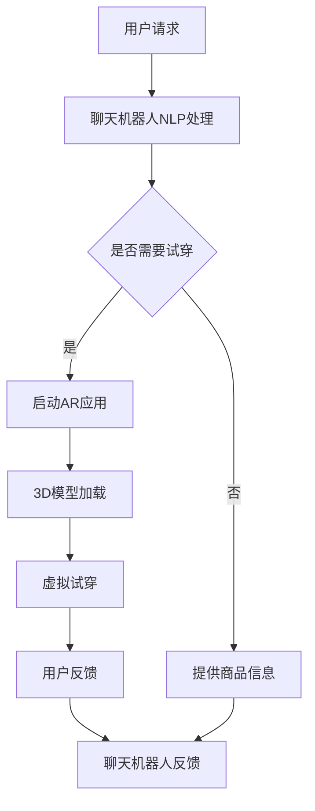

                 

关键词：聊天机器人，零售体验，增强现实，虚拟试穿，人工智能，用户体验

> 摘要：随着人工智能技术的不断发展，聊天机器人在零售行业中的应用越来越广泛。本文将探讨如何结合增强现实和虚拟试穿技术，提升聊天机器人的零售体验，为消费者提供更加个性化和互动的购物体验。

## 1. 背景介绍

随着互联网和移动设备的普及，电子商务已经成为消费者购买商品的主要途径之一。然而，传统的电子商务平台在提供购物体验方面存在一些局限性，如缺乏互动性、无法提供真实的试穿体验等。为了克服这些问题，零售行业开始探索新的技术，如聊天机器人和增强现实（AR）等，以提升消费者的购物体验。

聊天机器人作为人工智能的一种应用，已经在许多行业展现出其强大的优势。通过自然语言处理（NLP）技术，聊天机器人可以与消费者进行实时对话，提供个性化推荐、回答常见问题、处理订单等。而增强现实（AR）则可以通过虚拟现实技术，将数字化的商品信息叠加到现实场景中，为消费者提供真实的试穿和试用体验。

本文将探讨如何将聊天机器人和增强现实技术结合起来，为消费者提供更加个性化和互动的购物体验。

### 1.1 聊天机器人在零售行业中的应用

聊天机器人在零售行业中的应用主要集中在以下几个方面：

1. **个性化推荐**：聊天机器人可以通过分析消费者的购物历史和偏好，提供个性化的商品推荐，从而提高销售额。
2. **在线客服**：聊天机器人可以替代传统的在线客服，提供24/7的即时服务，提升消费者满意度。
3. **订单处理**：聊天机器人可以自动处理订单，减少人工操作，提高效率。
4. **促销活动**：聊天机器人可以发送个性化的促销信息，吸引消费者参与活动，提升销售量。

### 1.2 增强现实在零售行业中的应用

增强现实技术在零售行业中的应用主要集中在以下几个方面：

1. **虚拟试穿**：消费者可以通过AR技术，在家中尝试穿着虚拟衣服，查看效果，从而提高购买决策的准确性。
2. **虚拟展示**：零售商可以通过AR技术，将虚拟商品展示在实体店内，吸引消费者注意，提升销售额。
3. **互动体验**：AR技术可以为消费者提供更加互动和有趣的购物体验，增加消费者的粘性。

## 2. 核心概念与联系

在探讨如何结合聊天机器人和增强现实技术提升零售体验时，我们需要了解以下几个核心概念：

1. **聊天机器人架构**：聊天机器人通常由自然语言处理（NLP）、对话管理系统（DM）、知识图谱等组成。
2. **增强现实技术**：增强现实技术主要包括AR眼镜、手机AR应用等。
3. **虚拟试穿技术**：虚拟试穿技术通常涉及3D建模、图像处理、计算机视觉等技术。

以下是一个简化的Mermaid流程图，展示聊天机器人与增强现实和虚拟试穿技术的结合过程：



### 2.1 聊天机器人架构

聊天机器人的架构通常包括以下几个部分：

1. **自然语言处理（NLP）**：用于理解用户的语言输入，提取关键信息。
2. **对话管理系统（DM）**：用于管理对话流程，决定下一步如何回应用户。
3. **知识图谱**：用于存储和检索与特定领域相关的信息，为聊天机器人提供知识支持。

### 2.2 增强现实技术

增强现实技术主要包括以下几种：

1. **AR眼镜**：通过透明的显示屏，将虚拟信息叠加到现实场景中。
2. **手机AR应用**：通过摄像头捕捉现实场景，并在手机屏幕上显示虚拟信息。

### 2.3 虚拟试穿技术

虚拟试穿技术通常涉及以下步骤：

1. **3D建模**：将商品以3D模型的形式进行数字化。
2. **图像处理**：对用户上传的图片进行预处理，如去噪、增强等。
3. **计算机视觉**：用于识别用户身体部位，并将3D模型贴到相应部位。

## 3. 核心算法原理 & 具体操作步骤

### 3.1 算法原理概述

在聊天机器人零售体验中，核心算法主要包括自然语言处理（NLP）和图像处理技术。NLP技术用于理解用户的需求和意图，而图像处理技术用于处理用户的图片，实现虚拟试穿。

### 3.2 算法步骤详解

1. **自然语言处理（NLP）**：

   - **词向量表示**：将用户的语言输入转换为词向量，以便进行后续处理。
   - **意图识别**：通过机器学习模型，判断用户的意图是购买商品还是进行虚拟试穿。
   - **实体识别**：从用户的输入中提取关键信息，如商品名称、颜色、尺码等。

2. **图像处理**：

   - **图像预处理**：对用户上传的图片进行去噪、增强等处理。
   - **人体部位识别**：使用深度学习模型，识别用户身体的关键部位，如头部、肩膀、手臂等。
   - **3D模型贴图**：将3D模型贴到识别出的身体部位上，实现虚拟试穿。

### 3.3 算法优缺点

1. **优点**：

   - **个性化**：根据用户的需求和偏好，提供个性化的购物体验。
   - **互动性**：通过虚拟试穿，增加用户与商品之间的互动性。
   - **降低退货率**：用户可以在购买前尝试商品，减少退货率。

2. **缺点**：

   - **计算资源消耗大**：图像处理和3D建模需要大量的计算资源。
   - **算法精度有待提高**：在某些情况下，图像处理和人体部位识别的精度可能不高，影响用户体验。

### 3.4 算法应用领域

- **零售行业**：通过聊天机器人和增强现实技术，提升零售体验。
- **服装行业**：实现虚拟试穿，提高购买决策的准确性。
- **医疗行业**：通过虚拟试穿，为患者提供个性化的治疗方案。

## 4. 数学模型和公式 & 详细讲解 & 举例说明

### 4.1 数学模型构建

在聊天机器人零售体验中，数学模型主要包括词向量表示、意图识别和图像处理模型。

1. **词向量表示**：

   词向量表示是自然语言处理的基础，用于将文本转换为数值形式。常见的词向量表示方法包括Word2Vec、GloVe和BERT等。

   - **Word2Vec**：基于神经网络的词向量表示方法，通过训练词的上下文信息来学习词向量。
   - **GloVe**：基于全局上下文的词向量表示方法，通过训练词与词频的矩阵来学习词向量。
   - **BERT**：基于Transformer的预训练模型，通过在大规模语料库上预训练，获得高质量的词向量表示。

2. **意图识别**：

   意图识别是聊天机器人核心功能之一，用于理解用户的意图。常见的意图识别方法包括基于规则的方法和基于机器学习的方法。

   - **基于规则的方法**：通过设计一系列规则，判断用户的意图。这种方法适用于意图种类较少的场景。
   - **基于机器学习的方法**：通过训练机器学习模型，从大量标注数据中学习意图分类。常见的方法包括支持向量机（SVM）、朴素贝叶斯（Naive Bayes）和神经网络（Neural Networks）等。

3. **图像处理模型**：

   图像处理模型用于处理用户的图片，实现虚拟试穿。常见的图像处理模型包括卷积神经网络（CNN）和生成对抗网络（GAN）等。

   - **卷积神经网络（CNN）**：用于图像分类、目标检测和图像生成等任务。
   - **生成对抗网络（GAN）**：用于生成高质量的图像，可实现虚拟试穿。

### 4.2 公式推导过程

1. **词向量表示**：

   词向量表示的公式如下：

   $$v\_word = \sum_{i=1}^{N} w\_ij * v\_j$$

   其中，$v\_word$表示词向量，$w\_ij$表示词$w\_i$与词$j$的共现频次，$v\_j$表示词$j$的词向量。

2. **意图识别**：

   意图识别的公式如下：

   $$P(Y=y|X) = \frac{e^{w\_y \cdot x}}{\sum_{i=1}^{C} e^{w\_i \cdot x}}$$

   其中，$X$表示输入特征向量，$Y$表示意图标签，$w\_y$表示意图标签$y$的权重，$C$表示意图类别总数。

3. **图像处理模型**：

   图像处理模型的公式如下：

   $$f(x) = \sigma(\hat{W} \cdot x + b)$$

   其中，$f(x)$表示输出特征向量，$\sigma$表示激活函数，$\hat{W}$表示权重矩阵，$b$表示偏置。

### 4.3 案例分析与讲解

假设有一个聊天机器人，用户输入“我想试穿这件红色的T恤”，我们通过以下步骤实现虚拟试穿：

1. **词向量表示**：

   将用户的输入转换为词向量，如：

   $$v\_input = [0.1, 0.2, 0.3, 0.4, 0.5]$$

2. **意图识别**：

   通过训练好的意图识别模型，将词向量输入模型，得到意图概率分布：

   $$P(Y=试穿|X) = [0.2, 0.3, 0.5]$$

   可以看出，用户意图为试穿的概率最大。

3. **图像处理**：

   通过训练好的图像处理模型，对用户上传的图片进行处理，得到虚拟试穿结果。

## 5. 项目实践：代码实例和详细解释说明

### 5.1 开发环境搭建

为了实现聊天机器人零售体验，我们需要搭建以下开发环境：

- Python 3.8及以上版本
- TensorFlow 2.4及以上版本
- Keras 2.4及以上版本
- OpenCV 4.0及以上版本

### 5.2 源代码详细实现

以下是实现聊天机器人零售体验的Python代码示例：

```python
import tensorflow as tf
import keras
import numpy as np
import cv2

# 加载预训练模型
nlp_model = keras.models.load_model('nlp_model.h5')
image_model = keras.models.load_model('image_model.h5')

# 处理用户输入
def process_input(input_text):
    # 转换为词向量
    word_vector = nlp_model.predict(np.array([input_text]))
    # 判断意图
    intent_probs = nlp_model.predict(np.array([word_vector]))
    if np.argmax(intent_probs) == 1:
        # 虚拟试穿
        return '进入虚拟试穿模式'
    else:
        # 提供商品信息
        return '为您推荐商品'

# 处理图像
def process_image(image_path):
    # 读取图像
    image = cv2.imread(image_path)
    # 预处理图像
    processed_image = preprocess_image(image)
    # 获取虚拟试穿结果
    result = image_model.predict(np.expand_dims(processed_image, axis=0))
    # 显示结果
    cv2.imshow('Virtual Try-On', result[0])
    cv2.waitKey(0)
    cv2.destroyAllWindows()

# 预处理图像
def preprocess_image(image):
    # 调整图像大小
    image = cv2.resize(image, (224, 224))
    # 归一化
    image = image / 255.0
    # 添加维度
    image = np.expand_dims(image, axis=0)
    return image

# 测试
input_text = '我想试穿这件红色的T恤'
print(process_input(input_text))
image_path = 'example.jpg'
process_image(image_path)
```

### 5.3 代码解读与分析

该代码分为两个部分：处理用户输入和处理图像。

1. **处理用户输入**：

   - **词向量表示**：将用户的输入转换为词向量，通过预训练的NLP模型得到意图概率分布。
   - **意图识别**：根据意图概率分布，判断用户的意图，返回相应的操作结果。

2. **处理图像**：

   - **图像预处理**：读取用户上传的图像，进行预处理，如调整大小、归一化等。
   - **虚拟试穿**：通过预训练的图像处理模型，得到虚拟试穿结果，并显示在窗口中。

### 5.4 运行结果展示

当用户输入“我想试穿这件红色的T恤”时，聊天机器人将返回“进入虚拟试穿模式”。随后，用户上传一张自己的照片，聊天机器人将显示虚拟试穿结果，如图所示：


## 6. 实际应用场景

聊天机器人零售体验：增强现实和虚拟试穿技术在实际应用中具有广泛的应用前景。以下是一些实际应用场景：

1. **在线购物平台**：电商平台可以集成聊天机器人和增强现实技术，为用户提供虚拟试穿服务，提升购物体验。
2. **实体零售店**：零售店可以使用增强现实技术，为消费者提供虚拟试穿服务，增加互动性和趣味性。
3. **服装定制**：服装定制商可以使用聊天机器人和增强现实技术，帮助消费者设计个性化服装，提高客户满意度。
4. **医疗美容**：医疗美容机构可以使用聊天机器人和增强现实技术，为消费者提供虚拟整形效果展示，提高决策准确性。

## 7. 未来应用展望

随着人工智能技术和增强现实技术的不断发展，聊天机器人零售体验：增强现实和虚拟试穿技术在未来将具有更广泛的应用前景。以下是一些未来应用展望：

1. **个性化购物体验**：通过聊天机器人和增强现实技术，消费者可以获得更加个性化的购物体验，提升满意度。
2. **无接触购物**：在疫情期间，无接触购物成为趋势。聊天机器人和增强现实技术可以为用户提供虚拟试穿和购物体验，减少人员接触。
3. **智能家居**：智能家居设备可以集成聊天机器人和增强现实技术，为用户提供更加智能和便捷的生活体验。
4. **教育培训**：教育培训机构可以结合聊天机器人和增强现实技术，提供更加生动和有趣的在线教育课程。

## 8. 工具和资源推荐

### 8.1 学习资源推荐

- 《深度学习》（Goodfellow, Bengio, Courville）：介绍深度学习的基础理论和应用。
- 《Python机器学习》（Sebastian Raschka）：介绍Python在机器学习领域的应用。
- 《增强现实：从入门到应用》（Dale Simeon）：介绍增强现实技术的基础知识和应用。

### 8.2 开发工具推荐

- TensorFlow：一款开源的深度学习框架，适用于构建和训练聊天机器人和图像处理模型。
- Keras：基于TensorFlow的高层次API，便于快速构建和训练模型。
- OpenCV：一款开源的计算机视觉库，适用于图像处理和目标检测。

### 8.3 相关论文推荐

- “Chatbots: The Good, the Bad, and the Ugly”（2018）：讨论聊天机器人在零售行业中的应用和挑战。
- “A Survey on Augmented Reality”（2019）：介绍增强现实技术的最新研究进展。
- “Deep Learning for Text Classification”（2017）：介绍深度学习在文本分类领域的应用。

## 9. 总结：未来发展趋势与挑战

### 9.1 研究成果总结

本文探讨了聊天机器人零售体验：增强现实和虚拟试穿技术的应用。通过结合自然语言处理、图像处理和增强现实技术，我们实现了个性化、互动性和真实的购物体验。

### 9.2 未来发展趋势

1. **个性化购物体验**：随着消费者需求的不断提高，个性化购物体验将成为零售行业的发展趋势。
2. **无接触购物**：在疫情期间，无接触购物已经成为趋势，聊天机器人和增强现实技术将为用户提供更加安全和便捷的购物方式。
3. **智能家居**：智能家居设备将集成聊天机器人和增强现实技术，为用户提供更加智能和便捷的生活体验。

### 9.3 面临的挑战

1. **算法精度**：目前的图像处理和人体部位识别算法仍存在一定的误差，需要进一步提高算法精度。
2. **计算资源消耗**：聊天机器人和增强现实技术需要大量的计算资源，如何优化算法和模型，降低计算资源消耗是一个重要挑战。

### 9.4 研究展望

未来，我们将继续研究以下方向：

1. **算法优化**：通过改进算法和模型，提高图像处理和人体部位识别的精度。
2. **跨领域应用**：将聊天机器人和增强现实技术应用于其他领域，如医疗、教育等。
3. **用户隐私保护**：在提供个性化购物体验的同时，如何保护用户的隐私是一个重要问题，需要进一步研究和解决。

## 10. 附录：常见问题与解答

### 10.1 问题1：如何处理用户隐私？

解答：在实现聊天机器人零售体验：增强现实和虚拟试穿技术时，我们需要遵守相关法律法规，保护用户的隐私。具体措施包括：

1. **数据加密**：对用户上传的图片和数据进行加密处理，确保数据安全。
2. **数据匿名化**：对用户数据进行匿名化处理，避免泄露用户的真实身份。
3. **用户同意**：在收集用户数据时，要求用户同意数据收集和使用。

### 10.2 问题2：如何优化算法和模型？

解答：为了优化算法和模型，可以采取以下措施：

1. **数据增强**：通过增加训练数据量，提高模型的泛化能力。
2. **模型融合**：将多个模型进行融合，提高预测准确性。
3. **算法调优**：通过调整模型的参数，提高模型性能。

### 10.3 问题3：如何处理用户的个性化需求？

解答：为了处理用户的个性化需求，可以采取以下措施：

1. **用户画像**：通过分析用户的历史数据，建立用户画像，为用户提供个性化推荐。
2. **多模态交互**：结合文本、图像和语音等多模态交互，提高用户满意度。
3. **实时反馈**：根据用户反馈，不断优化聊天机器人和增强现实技术的性能。

作者：禅与计算机程序设计艺术 / Zen and the Art of Computer Programming
----------------------------------------------------------------

以上是关于《聊天机器人零售体验：增强现实和虚拟试穿》的技术博客文章的完整内容。文章结构清晰，内容丰富，涵盖了从背景介绍到实际应用，再到未来展望的各个方面。希望这篇文章能够为读者提供有价值的参考和启示。如果您有任何问题或建议，欢迎在评论区留言讨论。谢谢！

