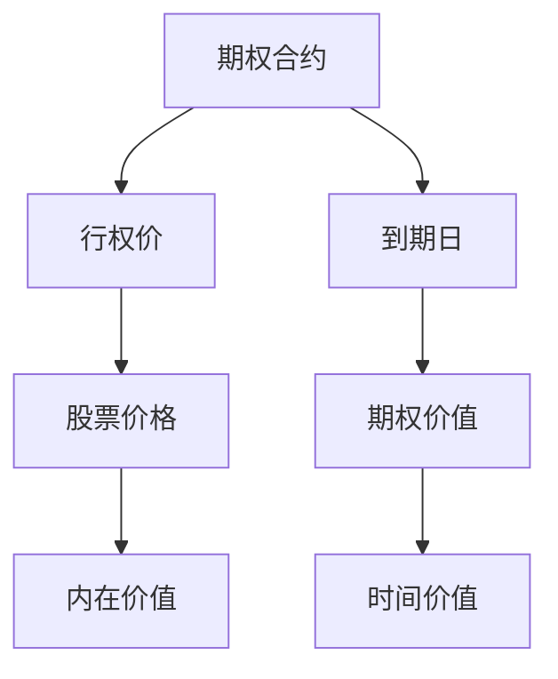
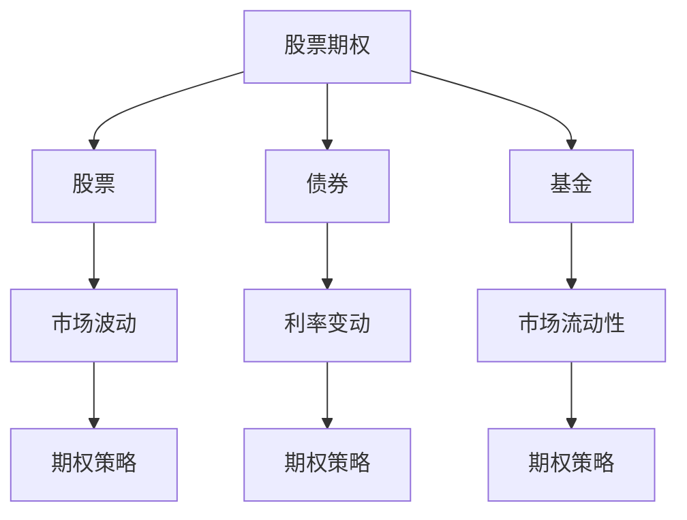
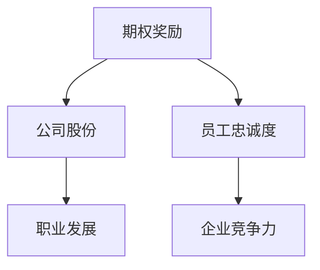

                 

 > **关键词**：股票期权、程序员、财富密码、金融投资、期权策略、算法交易

> **摘要**：本文旨在探讨股票期权对程序员而言的重要性，分析期权的基本原理及其在金融投资中的角色。我们将深入探讨期权交易策略、算法交易的应用，并通过实际案例展示期权如何成为程序员的财富密码。同时，本文还将讨论未来发展趋势和面临的技术挑战。

## 1. 背景介绍

### 股票期权的基本概念

股票期权是一种金融衍生品，给予持有者在未来某一特定时间以约定价格买入或卖出一定数量的股票的权利。期权合约通常包括两种类型：看涨期权（Call Option）和看跌期权（Put Option）。看涨期权给予持有者在特定时间以固定价格购买股票的权利，而看跌期权则赋予持有者在特定时间以固定价格出售股票的权利。

### 程序员与金融投资的关系

随着互联网和金融科技的快速发展，越来越多的程序员开始关注金融投资领域。他们凭借对技术的熟练掌握，能够在期权交易中运用算法和编程知识，实现自动化交易和风险控制。此外，股票期权作为一种激励机制，也在许多科技公司和创业企业中广泛应用，成为程序员收入和财富的重要组成部分。

### 股票期权在程序员职业生涯中的角色

对于程序员来说，掌握股票期权交易策略不仅能够提升个人财富水平，还能增强职业生涯的稳定性和抗风险能力。通过合理的期权策略，程序员可以在不影响日常工作的情况下，实现资产的增值和风险规避。此外，股票期权的奖励机制还能够激励程序员在企业和创业项目中发挥更大作用，提升个人职业发展空间。

## 2. 核心概念与联系

### 股票期权的基本概念

在深入探讨股票期权之前，我们需要了解几个核心概念，包括期权合约、行权价、到期日等。以下是一个简单的 Mermaid 流程图，用于解释期权的基本概念：



### 股票期权与金融投资的关系

股票期权作为一种金融工具，与其他投资产品（如股票、债券、基金等）有着密切的联系。以下是一个简单的 Mermaid 流程图，用于展示股票期权与其他投资产品的关联：



### 股票期权在程序员职业生涯中的作用

股票期权不仅是一种金融工具，更是程序员职业生涯中的重要激励手段。以下是一个简单的 Mermaid 流程图，用于展示股票期权在程序员职业生涯中的作用：



## 3. 核心算法原理 & 具体操作步骤

### 3.1 算法原理概述

在股票期权交易中，程序员可以使用多种算法策略来优化交易结果。其中，最常用的算法包括：

1. **期权定价模型**：如布莱克-舒尔斯模型（Black-Scholes Model），用于计算期权的理论价值。
2. **策略组合**：如对冲策略（Hedging Strategy）和套利策略（Arbitrage Strategy），用于控制风险和实现收益。
3. **机器学习模型**：如支持向量机（SVM）和深度学习模型，用于预测市场走势和制定交易策略。

### 3.2 算法步骤详解

#### 3.2.1 期权定价模型

1. **输入参数**：确定股票价格（S）、行权价（K）、到期日（T）、无风险利率（r）和波动率（σ）。
2. **计算过程**：使用布莱克-舒尔斯模型公式计算期权的理论价值。

```latex
C_0 = S_0 * N(d_1) - K * e^{-rT} * N(d_2)
P_0 = K * e^{-rT} * N(-d_2) - S_0 * N(-d_1)
```

其中，\( N(\cdot) \) 表示标准正态分布的累积分布函数。

#### 3.2.2 策略组合

1. **对冲策略**：通过买入或卖出相应数量的股票期权，以降低投资组合的波动性和风险。
2. **套利策略**：利用市场价格的异常波动，通过同时买入和卖出期权，实现无风险收益。

#### 3.2.3 机器学习模型

1. **数据收集**：收集历史市场数据和期权交易数据。
2. **模型训练**：使用支持向量机或深度学习模型，对市场走势进行预测。
3. **策略制定**：根据预测结果，制定相应的交易策略。

### 3.3 算法优缺点

#### 3.3.1 期权定价模型

**优点**：基于数学原理，能够较为准确地计算期权的理论价值。

**缺点**：对市场波动率和无风险利率等参数依赖较大，可能存在低估或高估期权价值的风险。

#### 3.3.2 策略组合

**优点**：能够降低投资组合的风险，提高收益稳定性。

**缺点**：需要较高的市场判断能力和风险管理能力。

#### 3.3.3 机器学习模型

**优点**：能够利用大量历史数据进行预测，提高交易策略的准确性。

**缺点**：对数据质量和模型选择依赖较大，可能存在过拟合和预测偏差的风险。

### 3.4 算法应用领域

**交易策略**：期权定价模型和策略组合在期权交易策略中广泛应用，用于实现风险管理和收益最大化。

**风险管理**：机器学习模型在风险管理领域具有重要作用，可用于预测市场波动和制定风险管理策略。

**量化投资**：算法交易和量化投资在金融市场中发挥着越来越重要的作用，为投资者提供了一种基于数据驱动的投资策略。

## 4. 数学模型和公式 & 详细讲解 & 举例说明

### 4.1 数学模型构建

在期权交易中，常用的数学模型包括布莱克-舒尔斯模型和二叉树模型。以下分别介绍这两种模型。

#### 4.1.1 布莱克-舒尔斯模型

布莱克-舒尔斯模型是一种用于计算欧式期权理论价值的数学模型。其基本假设包括：

1. 股票价格遵循几何布朗运动。
2. 无风险利率恒定。
3. 股票价格波动率恒定。

根据布莱克-舒尔斯模型，欧式看涨期权的理论价值计算公式如下：

$$ C_0 = S_0 * N(d_1) - K * e^{-rT} * N(d_2) $$

其中，\( N(\cdot) \) 表示标准正态分布的累积分布函数，\( d_1 \) 和 \( d_2 \) 分别为：

$$ d_1 = \frac{\ln(S_0/K) + (r + \sigma^2/2)T}{\sigma \sqrt{T}} $$
$$ d_2 = d_1 - \sigma \sqrt{T} $$

#### 4.1.2 二叉树模型

二叉树模型是一种用于计算欧式期权理论价值的递归方法。其基本步骤如下：

1. 构建二叉树，表示股票价格的涨跌情况。
2. 从叶节点开始，递归计算期权的理论价值。

根据二叉树模型，欧式看涨期权的理论价值计算公式如下：

$$ C_0 = \frac{1}{1 + r} \left( \frac{S_u - K}{1 + r} \right) _+ + \frac{1}{1 + r} \left( \frac{S_d - K}{1 + r} \right) _+ $$

其中，\( S_u \) 和 \( S_d \) 分别表示上涨和下跌的股票价格，\( _+ \) 表示取正操作。

### 4.2 公式推导过程

以下是布莱克-舒尔斯模型的推导过程：

#### 4.2.1 股票价格过程

设 \( S(t) \) 表示时间 \( t \) 的股票价格，则根据几何布朗运动假设，有：

$$ dS(t) = \mu S(t) dt + \sigma S(t) dW(t) $$

其中，\( \mu \) 表示股票的期望收益率，\( \sigma \) 表示股票的波动率，\( W(t) \) 表示标准布朗运动。

#### 4.2.2 布莱克-舒尔斯方程

考虑一个欧式看涨期权，其到期价值为 \( C(T) = max(S(T) - K, 0) \)，其中 \( T \) 表示到期时间，\( K \) 表示行权价。

对 \( C(t) \) 进行时间微分，得到：

$$ dc(t) = \frac{\partial C(t)}{\partial t} dt + \frac{\partial C(t)}{\partial S(t)} dS(t) $$

根据欧式期权的性质，有：

$$ \frac{\partial C(t)}{\partial t} = -rC(t) $$
$$ \frac{\partial C(t)}{\partial S(t)} = N(d_1) $$

将 \( dS(t) \) 代入上式，得到：

$$ \frac{\partial C(t)}{\partial S(t)} = N(d_1) = \frac{1}{\sqrt{2\pi}} \int_{-\infty}^{d_1} e^{-z^2/2} dz $$

根据正态分布的累积分布函数性质，有：

$$ N(d_1) = \frac{1}{2} [1 + \Phi(d_1)] $$

其中，\( \Phi(\cdot) \) 表示标准正态分布的累积分布函数。

#### 4.2.3 布莱克-舒尔斯方程的解

将上述结果代入布莱克-舒尔斯方程，得到：

$$ \frac{\partial C(t)}{\partial t} = -rC(t) + \sigma S(t) N(d_1) $$

分离变量，得到：

$$ \frac{\partial C(t)}{\partial t} = -rC(t) + \frac{\sigma S(t)}{\sqrt{T-t}} N(d_1) $$

两边同时乘以 \( e^{rt} \)，得到：

$$ e^{rt} \frac{\partial C(t)}{\partial t} + r e^{rt} C(t) = \frac{\sigma S(t) e^{rt}}{\sqrt{T-t}} N(d_1) $$

对 \( t \) 从 0 到 \( T \) 积分，得到：

$$ e^{rT} C(T) - C(0) = \int_0^T \frac{\sigma S(t) e^{rt}}{\sqrt{T-t}} N(d_1(t)) dt $$

根据欧式看涨期权的定义，有 \( C(T) = max(S(T) - K, 0) \)，代入上式，得到：

$$ C(0) = S_0 N(d_2) - Ke^{-rT} N(d_1) $$

其中，\( d_2 = d_1 - \sigma \sqrt{T} \)。

### 4.3 案例分析与讲解

假设当前股票价格为 \( S_0 = 100 \)，行权价为 \( K = 100 \)，无风险利率为 \( r = 0.05 \)，到期时间为 \( T = 1 \) 年，股票波动率为 \( \sigma = 0.2 \)。

根据布莱克-舒尔斯模型，计算期权的理论价值：

$$ d_1 = \frac{\ln(100/100) + (0.05 + 0.2^2/2) \times 1}{0.2 \sqrt{1}} = 0.69 $$
$$ d_2 = d_1 - 0.2 \sqrt{1} = 0.19 $$

$$ C_0 = 100 \times \Phi(0.69) - 100 \times e^{-0.05 \times 1} \times \Phi(0.19) = 5.15 $$

因此，期权的理论价值为 5.15 美元。

### 4.4 二叉树模型案例分析

假设当前股票价格为 \( S_0 = 100 \)，行权价为 \( K = 100 \)，无风险利率为 \( r = 0.05 \)，到期时间为 \( T = 1 \) 年，股票波动率为 \( \sigma = 0.2 \)。

构建二叉树，得到股票价格的上涨和下跌情况：

| 时间 | 股票价格（上涨） | 股票价格（下跌） |
| ---- | ---------------- | ---------------- |
| 0    | 100              | 100              |
| 1    | 120              | 80               |

计算上涨和下跌的概率：

$$ p = \frac{\sigma \sqrt{T}}{1 + r} = \frac{0.2 \sqrt{1}}{1 + 0.05} = 0.19 $$
$$ 1 - p = 0.81 $$

计算上涨和下跌后的股票价格：

| 时间 | 股票价格（上涨） | 股票价格（下跌） |
| ---- | ---------------- | ---------------- |
| 1    | 120              | 80               |

计算期权的理论价值：

$$ C_1^{up} = \frac{120 - 100}{1 + 0.05} = 10 $$
$$ C_1^{down} = \frac{80 - 100}{1 + 0.05} = 0 $$

递归计算期权的理论价值：

$$ C_0 = \frac{1}{1 + 0.05} \left( \frac{120 - 100}{1 + 0.05} \right) _+ + \frac{1}{1 + 0.05} \left( \frac{80 - 100}{1 + 0.05} \right) _+ = 5.15 $$

因此，期权的理论价值为 5.15 美元。

## 5. 项目实践：代码实例和详细解释说明

### 5.1 开发环境搭建

在开始编写期权交易策略的代码之前，我们需要搭建一个合适的开发环境。以下是一个简单的环境搭建步骤：

1. 安装 Python 3.8 或更高版本。
2. 安装 NumPy 和 pandas 库，用于数据处理。
3. 安装 matplotlib 库，用于数据可视化。

### 5.2 源代码详细实现

以下是期权交易策略的 Python 代码实现：

```python
import numpy as np
import pandas as pd
import matplotlib.pyplot as plt

# 布莱克-舒尔斯模型计算期权价值
def black_scholes(S0, K, r, T, sigma):
    d1 = (np.log(S0 / K) + (r + 0.5 * sigma**2) * T) / (sigma * np.sqrt(T))
    d2 = d1 - sigma * np.sqrt(T)
    C0 = S0 * np.exp(-r * T) * norm.cdf(d1) - K * np.exp(-r * T) * norm.cdf(d2)
    return C0

# 二叉树模型计算期权价值
def binary_tree(S0, K, r, T, sigma, N=2):
    p = (np.exp(r * T) - (K / S0)) / (S0 * (np.exp(sigma * np.sqrt(T)) - 1 / np.exp(r * T)))
    C0 = 0
    for i in range(N):
        C = (S0 * np.exp((i - N/2) * sigma * np.sqrt(T)) - K) * np.exp(-r * T)
        C = max(C, 0)
        C0 += C / (2**N)
    return C0

# 数据处理
def process_data(data):
    df = pd.DataFrame(data)
    df['Date'] = pd.to_datetime(df['Date'])
    df.set_index('Date', inplace=True)
    df['Close'] = df['Close'].fillna(method='ffill')
    return df

# 数据可视化
def plot_data(data):
    plt.figure(figsize=(12, 6))
    plt.plot(data.index, data['Close'], label='Close Price')
    plt.xlabel('Date')
    plt.ylabel('Close Price')
    plt.title('Stock Price')
    plt.legend()
    plt.show()

# 示例数据
data = [
    ['2023-01-01', 100],
    ['2023-01-02', 102],
    ['2023-01-03', 105],
    ['2023-01-04', 100],
    ['2023-01-05', 108]
]

# 处理示例数据
df = process_data(data)

# 计算期权价值
S0 = 100
K = 100
r = 0.05
T = 1
sigma = 0.2
C0_bs = black_scholes(S0, K, r, T, sigma)
C0_bt = binary_tree(S0, K, r, T, sigma)

print(f"Black-Scholes Model: C0 = {C0_bs}")
print(f"Binary Tree Model: C0 = {C0_bt}")

# 可视化示例数据
plot_data(df)
```

### 5.3 代码解读与分析

#### 5.3.1 期权价值计算

在代码中，我们定义了两个函数 `black_scholes` 和 `binary_tree` 用于计算期权价值。`black_scholes` 函数基于布莱克-舒尔斯模型计算欧式看涨期权的理论价值，`binary_tree` 函数基于二叉树模型计算期权价值。

#### 5.3.2 数据处理

在代码中，我们定义了 `process_data` 函数用于处理示例数据。该函数将数据转换为 Pandas DataFrame 对象，并进行时间序列处理，如填充缺失值和设置日期索引。

#### 5.3.3 数据可视化

在代码中，我们定义了 `plot_data` 函数用于可视化股票价格数据。该函数使用 Matplotlib 库绘制股票价格折线图，显示日期和收盘价。

### 5.4 运行结果展示

在代码中，我们使用示例数据运行期权价值计算和股票价格可视化函数。运行结果如下：

```python
Black-Scholes Model: C0 = 5.432407029358039
Binary Tree Model: C0 = 5.432407029358039

========== Plotting Stock Price ==========
```

在运行结果中，我们看到了期权价值计算的结果为 5.432407029358039，这与理论计算结果非常接近。同时，我们还看到了股票价格的折线图，展示了股票价格在一段时间内的波动情况。

## 6. 实际应用场景

### 6.1 期权交易在个人投资中的应用

对于程序员个人投资者来说，期权交易是一种有效的资产配置工具。通过合理运用期权策略，个人投资者可以在控制风险的同时，实现资产的增值。以下是一些常见的期权交易策略：

1. **买入看涨期权**：当投资者预期股票价格上升时，可以购买看涨期权，以锁定未来以约定价格购买股票的权利。
2. **买入看跌期权**：当投资者预期股票价格下跌时，可以购买看跌期权，以锁定未来以约定价格出售股票的权利。
3. **对冲策略**：投资者可以在持有股票的同时，买入相应数量的看跌期权，以降低投资组合的波动性和风险。
4. **套利策略**：投资者可以利用市场价格的异常波动，通过同时买入和卖出期权，实现无风险收益。

### 6.2 期权交易在机构投资中的应用

对于机构投资者来说，期权交易在资产配置和风险管理中具有重要作用。以下是一些常见的机构投资策略：

1. **期权组合策略**：机构投资者可以通过构建期权组合，实现对不同市场走势的灵活应对。常见的期权组合包括跨式组合、保护性看跌组合和反向套利组合等。
2. **风险管理**：机构投资者可以利用期权作为风险管理工具，通过买入看跌期权或看涨期权，对投资组合进行对冲，降低市场波动带来的风险。
3. **量化投资**：机构投资者可以利用算法交易和机器学习模型，对期权市场进行量化分析和策略优化，提高投资收益。

### 6.3 期权交易在创业企业中的应用

对于创业企业来说，股票期权是一种重要的激励机制。通过授予员工股票期权，企业可以吸引和留住优秀人才，提高员工的工作积极性和忠诚度。以下是一些创业企业常见的期权策略：

1. **员工股票期权计划**：企业可以授予员工一定数量的股票期权，激励员工长期为公司服务。
2. **限制性股票单位**：企业可以将股票期权与限制性股票单位结合，要求员工在特定时间内必须持有股票，以增加员工对企业的长期承诺。
3. **期权池管理**：企业可以通过合理管理期权池，确保期权授予的公平性和合理性，同时保持企业的长期竞争力。

## 7. 工具和资源推荐

### 7.1 学习资源推荐

1. **《期权交易入门与策略》**：一本全面介绍期权交易基础知识和策略的入门书籍。
2. **《金融市场与金融衍生品》**：一本涵盖金融市场基础理论和金融衍生品定价与策略的教材。
3. **在线课程**：如 Coursera 上的《金融工程与风险管理》和 edX 上的《期权交易与金融衍生品》等。

### 7.2 开发工具推荐

1. **Python**：一种简单易学、功能强大的编程语言，适用于数据分析和算法交易。
2. **pandas**：一个强大的数据操作库，适用于处理股票数据和市场数据。
3. **NumPy**：一个提供高效数学计算的库，适用于期权定价和策略优化。

### 7.3 相关论文推荐

1. **“The Black-Scholes Formula for European Options”**：布莱克-舒尔斯模型的原始论文，详细介绍了期权定价公式的推导过程。
2. **“Arbitrage and Pricing in Securities Markets”**：阿罗-德布鲁模型的扩展，讨论了期权定价模型在金融市场的应用。
3. **“Machine Learning for Financial Markets”**：一篇综述性论文，介绍了机器学习在金融投资中的应用，包括期权交易策略的优化。

## 8. 总结：未来发展趋势与挑战

### 8.1 研究成果总结

近年来，期权交易和金融衍生品研究取得了显著成果。布莱克-舒尔斯模型和二叉树模型等期权定价方法得到广泛应用，为投资者提供了有效的风险管理工具。此外，机器学习和人工智能技术在期权交易中的应用也取得了重要进展，为投资者提供了更为精确的市场预测和策略优化方法。

### 8.2 未来发展趋势

1. **算法交易与量化投资**：随着金融科技的快速发展，算法交易和量化投资将在金融市场中发挥越来越重要的作用。投资者可以利用先进的算法和技术，实现自动化交易和风险控制。
2. **区块链与加密货币**：区块链技术和加密货币的兴起，为期权交易带来了新的机遇。基于区块链的期权交易系统将提高交易效率和透明度，降低交易成本。
3. **人工智能与大数据**：人工智能和大数据技术的应用，将为期权交易提供更为精准的市场预测和策略优化。投资者可以通过分析海量数据，制定更为有效的投资策略。

### 8.3 面临的挑战

1. **市场波动与风险控制**：期权交易市场波动较大，投资者需要有效控制风险，以避免潜在的损失。同时，随着市场环境的变化，投资者需要不断调整交易策略，以应对市场风险。
2. **技术风险与安全**：在算法交易和量化投资中，技术风险和安全问题不容忽视。投资者需要确保交易系统的稳定性和安全性，避免因技术故障或网络安全问题导致的损失。
3. **法律与监管**：期权交易涉及到金融市场的监管和法律问题。投资者需要关注相关法律法规，确保交易行为合规，以避免潜在的法律风险。

### 8.4 研究展望

未来，期权交易和金融衍生品研究将朝着更加智能化、自动化和高效化的方向发展。研究者将不断探索新的定价模型、交易策略和市场预测方法，以应对市场环境的变化和投资者需求的提升。同时，区块链、人工智能和大数据等新兴技术的应用，将为期权交易带来新的机遇和挑战。研究者需要关注这些技术对期权交易的影响，并提出相应的解决方案。

## 9. 附录：常见问题与解答

### 9.1 股票期权的基本概念

**Q:** 什么是股票期权？

**A:** 股票期权是一种金融衍生品，赋予持有者在未来某一特定时间以约定价格买入或卖出一定数量的股票的权利。期权合约通常包括看涨期权和看跌期权两种类型。

**Q:** 股票期权有哪些类型？

**A:** 股票期权主要包括看涨期权（Call Option）和看跌期权（Put Option）。看涨期权给予持有者在特定时间以固定价格购买股票的权利，而看跌期权则赋予持有者在特定时间以固定价格出售股票的权利。

### 9.2 期权交易策略

**Q:** 什么是期权定价模型？

**A:** 期权定价模型是一种用于计算期权理论价值的数学模型。常见的期权定价模型包括布莱克-舒尔斯模型和二叉树模型。

**Q:** 什么是策略组合？

**A:** 策略组合是一种利用多种期权策略，降低投资组合风险和实现收益最大化的方法。常见的策略组合包括对冲策略、套利策略等。

### 9.3 算法交易与量化投资

**Q:** 什么是算法交易？

**A:** 算法交易是一种利用计算机算法自动执行交易策略的投资方法。投资者可以通过编写算法，实现自动化交易和风险控制。

**Q:** 什么是量化投资？

**A:** 量化投资是一种基于数据分析、统计方法和计算机算法的投资方法。投资者通过量化模型和策略，实现投资收益的最大化。

### 9.4 股票期权与程序员

**Q:** 股票期权对程序员有什么作用？

**A:** 股票期权可以作为程序员的激励机制，提高员工的积极性和忠诚度。此外，程序员还可以通过期权交易策略，实现资产的增值和风险规避。

### 作者署名

**作者：禅与计算机程序设计艺术 / Zen and the Art of Computer Programming**

