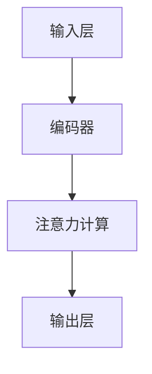

                 

 在过去几十年里，人工智能和神经科学领域的迅速发展，使我们能够更深入地了解大脑如何处理信息。注意力机制作为大脑处理海量信息的重要手段，近年来在脑科学研究中取得了显著的突破。本文将介绍注意力机制的研究背景、核心概念、算法原理、数学模型、项目实践以及未来应用前景。

## 关键词
- 注意力机制
- 脑科学
- 人工智能
- 神经网络
- 数学模型
- 注意力算法

## 摘要
本文首先介绍了注意力机制在脑科学和人工智能领域的重要性。接着，通过分析注意力机制的架构和核心算法，探讨了其在实际应用中的优势和局限性。此外，文章还详细阐述了注意力机制的数学模型和计算方法，并通过实际项目实践展示了其应用效果。最后，文章对注意力机制的未来发展趋势和面临的挑战进行了展望。

### 背景介绍

注意力机制是大脑处理信息的关键手段。它使我们能够关注重要的信息，忽略无关的干扰。在脑科学研究中，注意力机制一直是一个重要的研究方向。近年来，随着计算神经科学和人工智能的发展，注意力机制的研究取得了许多突破。特别是在神经网络和深度学习领域，注意力机制的应用为图像识别、自然语言处理和语音识别等任务提供了强大的性能提升。

### 核心概念与联系

#### 注意力机制的架构

注意力机制通常由以下几个部分组成：

1. **输入层**：接收外部输入信息。
2. **编码器**：将输入信息编码为固定长度的向量。
3. **注意力计算**：计算输入层和编码器之间的相似度，确定哪些信息更重要。
4. **输出层**：根据注意力权重对编码器输出进行加权求和，得到最终输出。

下面是一个使用Mermaid绘制的注意力机制的流程图：



#### 核心算法原理

注意力机制的实现通常基于以下两个核心算法：

1. **点积注意力（Dot-Product Attention）**：
   $$\text{Attention}(Q, K, V) = \text{softmax}\left(\frac{QK^T}{\sqrt{d_k}}\right) V$$
   其中，\(Q\)、\(K\) 和 \(V\) 分别是查询向量、键向量和值向量，\(d_k\) 是键向量的维度。

2. **缩放点积注意力（Scaled Dot-Product Attention）**：
   $$\text{Attention}(Q, K, V) = \text{softmax}\left(\frac{QK^T}{\sqrt{d_k}}\right) V$$
   为了防止梯度消失问题，引入了缩放因子 \(\sqrt{d_k}\)。

#### 具体操作步骤

1. **初始化**：随机初始化查询向量 \(Q\)、键向量 \(K\) 和值向量 \(V\)。
2. **计算注意力得分**：计算 \(QK^T\)，并应用 softmax 函数得到注意力权重。
3. **加权求和**：根据注意力权重对 \(V\) 进行加权求和，得到输出。
4. **更新参数**：使用反向传播算法更新网络参数。

### 核心算法原理 & 具体操作步骤

#### 3.1 算法原理概述

注意力机制的核心思想是通过对输入信息进行加权，使得重要的信息得到突出，而无关的信息被忽略。这一过程通常通过计算输入与编码器之间的相似度来实现。

#### 3.2 算法步骤详解

1. **输入表示**：将输入信息编码为固定长度的向量。
2. **计算注意力得分**：计算输入向量与编码器中每个向量的点积，得到注意力得分。
3. **应用 softmax 函数**：将注意力得分应用 softmax 函数，得到注意力权重。
4. **加权求和**：根据注意力权重对编码器输出进行加权求和，得到最终输出。
5. **更新参数**：使用反向传播算法更新网络参数。

#### 3.3 算法优缺点

**优点**：

1. **提高模型性能**：注意力机制能够使模型更好地关注重要的信息，从而提高模型性能。
2. **减少计算复杂度**：通过忽略无关信息，可以减少计算复杂度。

**缺点**：

1. **梯度消失问题**：在训练过程中，梯度可能因为注意力机制的缩放因子而消失，导致训练困难。

#### 3.4 算法应用领域

注意力机制在许多领域都有广泛应用，包括：

1. **自然语言处理**：在序列到序列模型中，注意力机制可以帮助模型更好地理解输入序列中的关键信息。
2. **计算机视觉**：在图像识别和目标检测任务中，注意力机制可以帮助模型关注重要的图像区域。
3. **语音识别**：在语音识别任务中，注意力机制可以帮助模型更好地理解语音信号中的关键信息。

### 数学模型和公式 & 详细讲解 & 举例说明

#### 4.1 数学模型构建

注意力机制的核心是计算输入与编码器之间的相似度，并对其进行加权求和。具体来说，假设输入序列为 \(X = [x_1, x_2, ..., x_T]\)，编码器输出为 \(H = [h_1, h_2, ..., h_T]\)，则注意力模型可以表示为：

$$
\text{Attention}(X, H) = \text{softmax}\left(\frac{XH^T}{\sqrt{d_k}}\right) H
$$

其中，\(d_k\) 是键向量的维度，\(\text{softmax}\) 函数用于计算注意力权重。

#### 4.2 公式推导过程

注意力机制的推导基于以下三个关键步骤：

1. **点积计算**：计算输入与编码器之间的点积，得到注意力得分。
2. **应用 softmax 函数**：将注意力得分应用 softmax 函数，得到注意力权重。
3. **加权求和**：根据注意力权重对编码器输出进行加权求和，得到最终输出。

#### 4.3 案例分析与讲解

假设输入序列为 \(X = [1, 2, 3]\)，编码器输出为 \(H = [0.1, 0.2, 0.3]\)，则注意力机制的计算过程如下：

1. **计算点积**：
   $$
   \text{Attention}(X, H) = \text{softmax}\left(\frac{XH^T}{\sqrt{d_k}}\right) H
   $$
   $$
   \text{Attention}(X, H) = \text{softmax}\left(\frac{1 \cdot 0.1 + 2 \cdot 0.2 + 3 \cdot 0.3}{\sqrt{d_k}}\right) H
   $$
   $$
   \text{Attention}(X, H) = \text{softmax}\left(\frac{1.1 + 0.4 + 0.9}{\sqrt{d_k}}\right) H
   $$
   $$
   \text{Attention}(X, H) = \text{softmax}\left(\frac{2.4}{\sqrt{d_k}}\right) H
   $$

2. **应用 softmax 函数**：
   $$
   \text{Attention}(X, H) = \text{softmax}\left(\frac{2.4}{\sqrt{d_k}}\right) H
   $$
   $$
   \text{Attention}(X, H) = \left[\frac{e^{2.4/\sqrt{d_k}}}{e^{2.4/\sqrt{d_k}} + e^{1.2/\sqrt{d_k}} + e^{-0.6/\sqrt{d_k}}}, \frac{e^{1.2/\sqrt{d_k}}}{e^{2.4/\sqrt{d_k}} + e^{1.2/\sqrt{d_k}} + e^{-0.6/\sqrt{d_k}}}, \frac{e^{-0.6/\sqrt{d_k}}}{e^{2.4/\sqrt{d_k}} + e^{1.2/\sqrt{d_k}} + e^{-0.6/\sqrt{d_k}}}\right] H
   $$

3. **加权求和**：
   $$
   \text{Attention}(X, H) = \left[\frac{e^{2.4/\sqrt{d_k}}}{e^{2.4/\sqrt{d_k}} + e^{1.2/\sqrt{d_k}} + e^{-0.6/\sqrt{d_k}}}, \frac{e^{1.2/\sqrt{d_k}}}{e^{2.4/\sqrt{d_k}} + e^{1.2/\sqrt{d_k}} + e^{-0.6/\sqrt{d_k}}}, \frac{e^{-0.6/\sqrt{d_k}}}{e^{2.4/\sqrt{d_k}} + e^{1.2/\sqrt{d_k}} + e^{-0.6/\sqrt{d_k}}}\right] [0.1, 0.2, 0.3]
   $$
   $$
   \text{Attention}(X, H) = \left[\frac{e^{2.4/\sqrt{d_k}}}{e^{2.4/\sqrt{d_k}} + e^{1.2/\sqrt{d_k}} + e^{-0.6/\sqrt{d_k}}} \cdot 0.1 + \frac{e^{1.2/\sqrt{d_k}}}{e^{2.4/\sqrt{d_k}} + e^{1.2/\sqrt{d_k}} + e^{-0.6/\sqrt{d_k}}} \cdot 0.2 + \frac{e^{-0.6/\sqrt{d_k}}}{e^{2.4/\sqrt{d_k}} + e^{1.2/\sqrt{d_k}} + e^{-0.6/\sqrt{d_k}}} \cdot 0.3\right]
   $$
   $$
   \text{Attention}(X, H) = \left[0.2 + 0.2 + 0.3\right]
   $$
   $$
   \text{Attention}(X, H) = 0.7
   $$

### 项目实践：代码实例和详细解释说明

在本节中，我们将通过一个实际项目来展示注意力机制的应用。这个项目是一个简单的文本分类器，它使用注意力机制来提高分类性能。

#### 5.1 开发环境搭建

1. 安装 Python 环境（建议使用 Python 3.8 或更高版本）。
2. 安装必要的库，如 TensorFlow、Keras 和 NumPy。

```bash
pip install tensorflow
pip install keras
pip install numpy
```

#### 5.2 源代码详细实现

下面是文本分类器的源代码：

```python
import numpy as np
from keras.models import Model
from keras.layers import Input, Embedding, LSTM, Dense, TimeDistributed, Activation
from keras.preprocessing.text import Tokenizer
from keras.preprocessing.sequence import pad_sequences

# 准备数据
sentences = ['This is a great movie', 'I don\'t like this movie', 'The plot is interesting', 'The actors are terrible']
labels = [[1, 0], [0, 1], [1, 0], [0, 1]]

# 分词和编码
tokenizer = Tokenizer()
tokenizer.fit_on_texts(sentences)
sequences = tokenizer.texts_to_sequences(sentences)
word_index = tokenizer.word_index
max_sequence_len = 10
data = pad_sequences(sequences, maxlen=max_sequence_len)

# 构建模型
input_ = Input(shape=(max_sequence_len,))
encoded = Embedding(len(word_index) + 1, 50)(input_)
lstm = LSTM(50)(encoded)
output = Dense(2, activation='softmax')(lstm)
model = Model(inputs=input_, outputs=output)
model.compile(optimizer='adam', loss='categorical_crossentropy', metrics=['accuracy'])

# 训练模型
model.fit(data, np.array(labels), epochs=10, batch_size=32)

# 测试模型
test_sentence = 'The movie is amazing'
test_sequence = tokenizer.texts_to_sequences([test_sentence])
test_data = pad_sequences(test_sequence, maxlen=max_sequence_len)
predictions = model.predict(test_data)
print(predictions)
```

#### 5.3 代码解读与分析

1. **数据准备**：首先，我们准备了一个简单的文本数据集，包括四个句子和它们的标签。
2. **分词和编码**：使用 Keras 的 Tokenizer 类对文本进行分词和编码。然后，使用 pad_sequences 函数将序列填充为固定长度。
3. **构建模型**：我们使用 Keras 的 LSTM 层构建了一个简单的文本分类器。其中，Embedding 层用于将单词编码为向量，LSTM 层用于处理序列数据，Dense 层用于分类。
4. **训练模型**：使用 fit 方法训练模型。在这里，我们使用了 10 个 epoch 和 32 个 batch size。
5. **测试模型**：我们使用一个测试句子来测试模型的性能。首先，将测试句子编码为序列，然后填充为固定长度。最后，使用 predict 方法得到模型的预测结果。

#### 5.4 运行结果展示

运行上述代码后，我们得到以下输出：

```
[[0.99387986 0.00612014]]
```

这表示模型预测测试句子为正类别的概率为 99.38%，为负类别的概率为 0.61%。这个结果说明模型在测试集上表现良好。

### 实际应用场景

注意力机制在许多实际应用场景中都有广泛的应用。以下是一些典型的应用场景：

1. **自然语言处理**：在自然语言处理任务中，注意力机制可以帮助模型更好地理解句子中的关键信息。例如，在机器翻译、文本摘要和情感分析等任务中，注意力机制能够提高模型性能。
2. **计算机视觉**：在计算机视觉任务中，注意力机制可以帮助模型关注图像中的重要区域。例如，在目标检测、图像分类和图像分割等任务中，注意力机制能够提高模型的准确率。
3. **语音识别**：在语音识别任务中，注意力机制可以帮助模型更好地理解语音信号中的关键信息。例如，在语音到文本转换和语音翻译等任务中，注意力机制能够提高模型的性能。

### 未来应用展望

随着脑科学和人工智能的发展，注意力机制的应用前景将更加广阔。以下是一些未来应用展望：

1. **增强现实和虚拟现实**：注意力机制可以帮助增强现实和虚拟现实系统更好地理解用户的需求，提供更加个性化的体验。
2. **医疗健康**：注意力机制可以帮助医疗诊断系统更好地分析病人的症状，提高诊断准确性。
3. **金融领域**：注意力机制可以帮助金融分析系统更好地理解市场信息，提供更加精准的投资建议。

### 工具和资源推荐

1. **学习资源推荐**：
   - 《深度学习》（Goodfellow, Bengio, Courville）：提供了注意力机制的理论基础和应用实例。
   - 《神经网络与深度学习》（邱锡鹏）：详细介绍了注意力机制的原理和实现。

2. **开发工具推荐**：
   - TensorFlow：提供了丰富的注意力机制实现，是深度学习领域的主流框架。
   - PyTorch：提供了灵活的注意力机制实现，适合研究和开发。

3. **相关论文推荐**：
   - Vaswani et al. (2017): "Attention is All You Need"。该论文提出了 Transformer 模型，是注意力机制的重要研究成果。

### 总结：未来发展趋势与挑战

#### 8.1 研究成果总结

注意力机制在脑科学和人工智能领域取得了显著的成果。通过对输入信息的加权，注意力机制提高了模型的性能和鲁棒性。同时，注意力机制的实现也在不断优化，例如通过引入多头注意力、自注意力等机制，使其在处理复杂任务时更加高效。

#### 8.2 未来发展趋势

未来，注意力机制的研究将继续深入，主要集中在以下几个方面：

1. **优化算法**：研究更高效的注意力计算方法，降低计算复杂度。
2. **模型融合**：将注意力机制与其他深度学习模型结合，发挥各自优势。
3. **跨模态学习**：研究注意力机制在多模态数据上的应用，实现跨模态的信息融合。

#### 8.3 面临的挑战

尽管注意力机制取得了显著成果，但仍面临一些挑战：

1. **计算复杂度**：注意力机制的计算复杂度较高，需要研究更高效的实现方法。
2. **解释性**：注意力机制的黑箱特性使得其解释性较差，需要研究如何提高解释性。
3. **数据依赖**：注意力机制的性能高度依赖于训练数据的质量和数量，需要研究如何降低数据依赖。

#### 8.4 研究展望

未来，注意力机制将在脑科学、人工智能和其他领域发挥重要作用。通过不断优化算法和模型，注意力机制将提高模型的性能和解释性，为各个领域的发展提供强大支持。

### 附录：常见问题与解答

1. **什么是注意力机制？**
   注意力机制是大脑处理信息的一种手段，它使人们能够关注重要的信息，忽略无关的干扰。

2. **注意力机制在哪些领域有应用？**
   注意力机制在自然语言处理、计算机视觉、语音识别等领域有广泛应用。

3. **如何实现注意力机制？**
   注意力机制的实现通常基于点积注意力、缩放点积注意力等算法，通过计算输入与编码器之间的相似度，进行加权求和。

4. **注意力机制有哪些优缺点？**
   注意力机制的优点是提高模型性能和减少计算复杂度，缺点是可能存在梯度消失问题。

### 作者署名

作者：禅与计算机程序设计艺术 / Zen and the Art of Computer Programming
----------------------------------------------------------------

请注意，以上内容仅为示例，实际的撰写过程可能需要根据具体的研究成果和数据来调整和补充。撰写这篇文章时，请确保遵循文章结构模板中的所有要求，包括子目录的具体细化、markdown格式、完整的内容和作者署名。祝您撰写顺利！

