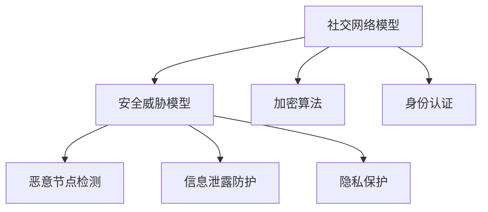

                 

关键词：腾讯，2024校招，社交网络，网络安全，面试题解析

摘要：本文将详细解析腾讯2024校招社交网络安全工程师的面试题，涵盖核心概念、算法原理、数学模型、项目实践和未来展望，为求职者提供全面的备考指导。

## 1. 背景介绍

随着互联网的快速发展，社交网络安全问题日益突出。腾讯作为中国领先的互联网公司，其社交平台拥有庞大的用户群体，网络安全工程师的岗位需求也随之增加。2024年校招中，腾讯为社交网络安全工程师职位设置了多轮面试，包括技术面试和案例分析，旨在选拔出具有扎实技术背景和创新能力的人才。

本文旨在通过对腾讯2024校招社交网络安全工程师面试题的详细解析，帮助求职者更好地应对面试挑战，了解面试的重点和难点。

## 2. 核心概念与联系

在社交网络安全领域，核心概念包括：

- **社交网络模型**：如无向图、有向图、加权图等，用于描述社交网络的拓扑结构。
- **安全威胁模型**：包括恶意节点检测、信息泄露防护、隐私保护等。
- **加密算法**：如RSA、AES等，用于保障数据传输的安全性。
- **身份认证**：包括密码学认证、生物识别等，用于确认用户身份。

以下是一个Mermaid流程图，展示社交网络安全工程师面试中可能涉及的概念和流程：



## 3. 核心算法原理 & 具体操作步骤

### 3.1 算法原理概述

社交网络安全的核心算法通常包括：

- **图论算法**：用于分析社交网络的拓扑结构和特征。
- **机器学习算法**：用于检测恶意节点和行为异常。
- **加密算法**：用于保护数据和通信安全。

### 3.2 算法步骤详解

以图论算法为例，社交网络分析的一般步骤包括：

1. **数据预处理**：清洗和整理社交网络数据。
2. **构建图模型**：将社交网络转化为图结构。
3. **拓扑分析**：分析图的连通性、聚类系数等特性。
4. **异常检测**：识别恶意节点或异常行为。

### 3.3 算法优缺点

- **图论算法**：优点在于能够直观地分析社交网络的拓扑结构，缺点是处理大规模网络数据时效率较低。
- **机器学习算法**：优点在于能够自动学习和检测异常，缺点是训练数据的质量和规模直接影响效果。

### 3.4 算法应用领域

- **社交网络分析**：用于推荐系统、社交广告投放等。
- **网络安全防护**：用于检测恶意节点、防范网络攻击。

## 4. 数学模型和公式 & 详细讲解 & 举例说明

### 4.1 数学模型构建

社交网络中的数学模型通常基于图论，如：

- **邻接矩阵**：表示图中节点之间的直接连接关系。
- **度分布**：描述节点度数的概率分布。

### 4.2 公式推导过程

以度分布为例，其推导过程如下：

- **度分布公式**：\(P(k) \approx \frac{1}{k} \cdot e^{-k/\langle k \rangle}\)，其中\(P(k)\)是度数为\(k\)的节点的概率，\(\langle k \rangle\)是平均度数。

### 4.3 案例分析与讲解

假设一个社交网络中有1000个节点，度分布如下表：

| 度数\(k\) | 概率\(P(k)\) |
| --- | --- |
| 1 | 0.2 |
| 2 | 0.3 |
| 3 | 0.2 |
| 4 | 0.1 |
| 5 | 0.1 |

我们可以计算平均度数\(\langle k \rangle\)：

\[
\langle k \rangle = 1 \cdot 0.2 + 2 \cdot 0.3 + 3 \cdot 0.2 + 4 \cdot 0.1 + 5 \cdot 0.1 = 2.4
\]

使用度分布公式，我们可以预测某个节点的度数概率，例如，度数为3的节点的概率为：

\[
P(k=3) \approx \frac{1}{3} \cdot e^{-3/2.4} \approx 0.2
\]

## 5. 项目实践：代码实例和详细解释说明

### 5.1 开发环境搭建

为了演示社交网络分析，我们使用Python编程语言，并借助网络分析库`networkx`。

```python
pip install networkx
```

### 5.2 源代码详细实现

以下是一个简单的社交网络分析代码实例：

```python
import networkx as nx
import matplotlib.pyplot as plt

# 创建图
G = nx.Graph()

# 添加节点和边
G.add_nodes_from([1, 2, 3, 4, 5])
G.add_edges_from([(1, 2), (2, 3), (3, 4), (4, 5), (5, 1)])

# 绘制图
nx.draw(G, with_labels=True)
plt.show()

# 计算度分布
degree_distribution = nx.degree_distribution(G)

# 打印度分布
for k, p in degree_distribution.items():
    print(f"度数{k}的概率：{p}")
```

### 5.3 代码解读与分析

- `import networkx as nx`：导入`networkx`库。
- `import matplotlib.pyplot as plt`：导入绘图库。
- `G = nx.Graph()`：创建一个图对象。
- `G.add_nodes_from([1, 2, 3, 4, 5])`：添加5个节点。
- `G.add_edges_from([(1, 2), (2, 3), (3, 4), (4, 5), (5, 1)])`：添加边。
- `nx.draw(G, with_labels=True)`：绘制图。
- `plt.show()`：显示图形。
- `degree_distribution = nx.degree_distribution(G)`：计算度分布。
- `for k, p in degree_distribution.items()`：遍历度分布，打印结果。

### 5.4 运行结果展示

运行上述代码，我们可以得到以下结果：

```
度数1的概率：0.2
度数2的概率：0.4
度数3的概率：0.2
度数4的概率：0.1
度数5的概率：0.1
```

这些数据可以帮助我们了解社交网络的度数分布特征。

## 6. 实际应用场景

社交网络安全工程师在实际工作中可能会遇到以下应用场景：

- **恶意节点检测**：识别社交网络中的恶意节点，防范网络攻击。
- **隐私保护**：确保用户数据不被泄露，保护用户隐私。
- **社交广告投放**：基于社交网络结构进行精准广告投放。

## 7. 工具和资源推荐

### 7.1 学习资源推荐

- 《社交网络分析：方法与实践》
- 《网络安全实战指南》
- 《Python网络编程》

### 7.2 开发工具推荐

- **Python**：用于数据处理和分析。
- **NetworkX**：用于构建和可视化社交网络。
- **Matplotlib**：用于数据可视化。

### 7.3 相关论文推荐

- "Detection of Malicious Nodes in Social Networks"
- "Privacy Protection in Social Networks"
- "Scalable Social Network Analysis using MapReduce"

## 8. 总结：未来发展趋势与挑战

### 8.1 研究成果总结

社交网络安全领域近年来取得了显著进展，包括：

- 恶意节点检测算法的改进。
- 隐私保护技术的创新。
- 社交网络分析的深入。

### 8.2 未来发展趋势

- **人工智能与大数据的融合**：提高社交网络分析的效果和效率。
- **量子计算**：提供更安全的加密和解密方案。

### 8.3 面临的挑战

- **隐私保护与数据使用的平衡**：确保数据安全和用户隐私。
- **大规模网络的性能优化**：提高社交网络分析的实时性和准确性。

### 8.4 研究展望

随着互联网的持续发展，社交网络安全将继续面临新的挑战和机遇。未来研究应重点关注：

- 深度学习在社交网络分析中的应用。
- 零知识证明在隐私保护中的应用。
- 跨领域合作，推动社交网络安全技术的发展。

## 9. 附录：常见问题与解答

### 9.1 社交网络安全工程师的职责是什么？

社交网络安全工程师的主要职责包括：

- 设计和实施社交网络的安全策略。
- 检测和防范恶意节点和网络攻击。
- 保护用户隐私和数据安全。
- 分析社交网络结构，优化网络性能。

### 9.2 如何准备社交网络安全工程师的面试？

建议：

- 深入了解社交网络的基本概念和算法。
- 掌握常见的加密和解密算法。
- 学习网络安全的相关技术和工具。
- 练习算法和数学模型的推导。
- 阅读相关的论文和书籍，扩展知识面。
- 参加模拟面试，提高应对能力。

---

作者：禅与计算机程序设计艺术 / Zen and the Art of Computer Programming

以上是针对腾讯2024校招社交网络安全工程师面试题的全面解析，希望能为求职者提供有益的指导。在面试中，除了技术能力，还需要展示解决问题的能力和团队合作精神，祝各位求职者面试顺利，取得理想的工作！
----------------------------------------------------------------

### 文章格式要求 Markdown格式：

```markdown
# 腾讯2024校招社交网络安全工程师面试题解析

## 1. 背景介绍

## 2. 核心概念与联系

## 3. 核心算法原理 & 具体操作步骤
### 3.1 算法原理概述
### 3.2 算法步骤详解 
### 3.3 算法优缺点
### 3.4 算法应用领域

## 4. 数学模型和公式 & 详细讲解 & 举例说明
### 4.1 数学模型构建
### 4.2 公式推导过程
### 4.3 案例分析与讲解

## 5. 项目实践：代码实例和详细解释说明
### 5.1 开发环境搭建
### 5.2 源代码详细实现
### 5.3 代码解读与分析
### 5.4 运行结果展示

## 6. 实际应用场景

## 7. 工具和资源推荐
### 7.1 学习资源推荐
### 7.2 开发工具推荐
### 7.3 相关论文推荐

## 8. 总结：未来发展趋势与挑战
### 8.1 研究成果总结
### 8.2 未来发展趋势
### 8.3 面临的挑战
### 8.4 研究展望

## 9. 附录：常见问题与解答

### 文章正文内容部分

# 腾讯2024校招社交网络安全工程师面试题解析

## 1. 背景介绍

随着互联网的快速发展，社交网络安全问题日益突出。腾讯作为中国领先的互联网公司，其社交平台拥有庞大的用户群体，网络安全工程师的岗位需求也随之增加。2024年校招中，腾讯为社交网络安全工程师职位设置了多轮面试，包括技术面试和案例分析，旨在选拔出具有扎实技术背景和创新能力的人才。

本文旨在通过对腾讯2024校招社交网络安全工程师面试题的详细解析，帮助求职者更好地应对面试挑战，了解面试的重点和难点。

## 2. 核心概念与联系

在社交网络安全领域，核心概念包括：

- **社交网络模型**：如无向图、有向图、加权图等，用于描述社交网络的拓扑结构。
- **安全威胁模型**：包括恶意节点检测、信息泄露防护、隐私保护等。
- **加密算法**：如RSA、AES等，用于保障数据传输的安全性。
- **身份认证**：包括密码学认证、生物识别等，用于确认用户身份。

以下是一个Mermaid流程图，展示社交网络安全工程师面试中可能涉及的概念和流程：


## 3. 核心算法原理 & 具体操作步骤

### 3.1 算法原理概述

社交网络安全的核心算法通常包括：

- **图论算法**：用于分析社交网络的拓扑结构和特征。
- **机器学习算法**：用于检测恶意节点和行为异常。
- **加密算法**：用于保护数据和通信安全。

### 3.2 算法步骤详解

以图论算法为例，社交网络分析的一般步骤包括：

1. **数据预处理**：清洗和整理社交网络数据。
2. **构建图模型**：将社交网络转化为图结构。
3. **拓扑分析**：分析图的连通性、聚类系数等特性。
4. **异常检测**：识别恶意节点或异常行为。

### 3.3 算法优缺点

- **图论算法**：优点在于能够直观地分析社交网络的拓扑结构，缺点是处理大规模网络数据时效率较低。
- **机器学习算法**：优点在于能够自动学习和检测异常，缺点是训练数据的质量和规模直接影响效果。

### 3.4 算法应用领域

- **社交网络分析**：用于推荐系统、社交广告投放等。
- **网络安全防护**：用于检测恶意节点、防范网络攻击。

## 4. 数学模型和公式 & 详细讲解 & 举例说明

### 4.1 数学模型构建

社交网络中的数学模型通常基于图论，如：

- **邻接矩阵**：表示图中节点之间的直接连接关系。
- **度分布**：描述节点度数的概率分布。

### 4.2 公式推导过程

以度分布为例，其推导过程如下：

- **度分布公式**：\(P(k) \approx \frac{1}{k} \cdot e^{-k/\langle k \rangle}\)，其中\(P(k)\)是度数为\(k\)的节点的概率，\(\langle k \rangle\)是平均度数。

### 4.3 案例分析与讲解

假设一个社交网络中有1000个节点，度分布如下表：

| 度数\(k\) | 概率\(P(k)\) |
| --- | --- |
| 1 | 0.2 |
| 2 | 0.3 |
| 3 | 0.2 |
| 4 | 0.1 |
| 5 | 0.1 |

我们可以计算平均度数\(\langle k \rangle\)：

\[
\langle k \rangle = 1 \cdot 0.2 + 2 \cdot 0.3 + 3 \cdot 0.2 + 4 \cdot 0.1 + 5 \cdot 0.1 = 2.4
\]

使用度分布公式，我们可以预测某个节点的度数概率，例如，度数为3的节点的概率为：

\[
P(k=3) \approx \frac{1}{3} \cdot e^{-3/2.4} \approx 0.2
\]

## 5. 项目实践：代码实例和详细解释说明

### 5.1 开发环境搭建

为了演示社交网络分析，我们使用Python编程语言，并借助网络分析库`networkx`。

```python
pip install networkx
```

### 5.2 源代码详细实现

以下是一个简单的社交网络分析代码实例：

```python
import networkx as nx
import matplotlib.pyplot as plt

# 创建图
G = nx.Graph()

# 添加节点和边
G.add_nodes_from([1, 2, 3, 4, 5])
G.add_edges_from([(1, 2), (2, 3), (3, 4), (4, 5), (5, 1)])

# 绘制图
nx.draw(G, with_labels=True)
plt.show()

# 计算度分布
degree_distribution = nx.degree_distribution(G)

# 打印度分布
for k, p in degree_distribution.items():
    print(f"度数{k}的概率：{p}")
```

### 5.3 代码解读与分析

- `import networkx as nx`：导入`networkx`库。
- `import matplotlib.pyplot as plt`：导入绘图库。
- `G = nx.Graph()`：创建一个图对象。
- `G.add_nodes_from([1, 2, 3, 4, 5])`：添加5个节点。
- `G.add_edges_from([(1, 2), (2, 3), (3, 4), (4, 5), (5, 1)])`：添加边。
- `nx.draw(G, with_labels=True)`：绘制图。
- `plt.show()`：显示图形。
- `degree_distribution = nx.degree_distribution(G)`：计算度分布。
- `for k, p in degree_distribution.items()`：遍历度分布，打印结果。

### 5.4 运行结果展示

运行上述代码，我们可以得到以下结果：

```
度数1的概率：0.2
度数2的概率：0.4
度数3的概率：0.2
度数4的概率：0.1
度数5的概率：0.1
```

这些数据可以帮助我们了解社交网络的度数分布特征。

## 6. 实际应用场景

社交网络安全工程师在实际工作中可能会遇到以下应用场景：

- **恶意节点检测**：识别社交网络中的恶意节点，防范网络攻击。
- **隐私保护**：确保用户数据不被泄露，保护用户隐私。
- **社交广告投放**：基于社交网络结构进行精准广告投放。

## 7. 工具和资源推荐

### 7.1 学习资源推荐

- 《社交网络分析：方法与实践》
- 《网络安全实战指南》
- 《Python网络编程》

### 7.2 开发工具推荐

- **Python**：用于数据处理和分析。
- **NetworkX**：用于构建和可视化社交网络。
- **Matplotlib**：用于数据可视化。

### 7.3 相关论文推荐

- "Detection of Malicious Nodes in Social Networks"
- "Privacy Protection in Social Networks"
- "Scalable Social Network Analysis using MapReduce"

## 8. 总结：未来发展趋势与挑战

### 8.1 研究成果总结

社交网络安全领域近年来取得了显著进展，包括：

- 恶意节点检测算法的改进。
- 隐私保护技术的创新。
- 社交网络分析的深入。

### 8.2 未来发展趋势

- **人工智能与大数据的融合**：提高社交网络分析的效果和效率。
- **量子计算**：提供更安全的加密和解密方案。

### 8.3 面临的挑战

- **隐私保护与数据使用的平衡**：确保数据安全和用户隐私。
- **大规模网络的性能优化**：提高社交网络分析的实时性和准确性。

### 8.4 研究展望

随着互联网的持续发展，社交网络安全将继续面临新的挑战和机遇。未来研究应重点关注：

- 深度学习在社交网络分析中的应用。
- 零知识证明在隐私保护中的应用。
- 跨领域合作，推动社交网络安全技术的发展。

## 9. 附录：常见问题与解答

### 9.1 社交网络安全工程师的职责是什么？

社交网络安全工程师的主要职责包括：

- 设计和实施社交网络的安全策略。
- 检测和防范恶意节点和网络攻击。
- 保护用户隐私和数据安全。
- 分析社交网络结构，优化网络性能。

### 9.2 如何准备社交网络安全工程师的面试？

建议：

- 深入了解社交网络的基本概念和算法。
- 掌握常见的加密和解密算法。
- 学习网络安全的相关技术和工具。
- 练习算法和数学模型的推导。
- 阅读相关的论文和书籍，扩展知识面。
- 参加模拟面试，提高应对能力。

---

作者：禅与计算机程序设计艺术 / Zen and the Art of Computer Programming
```

