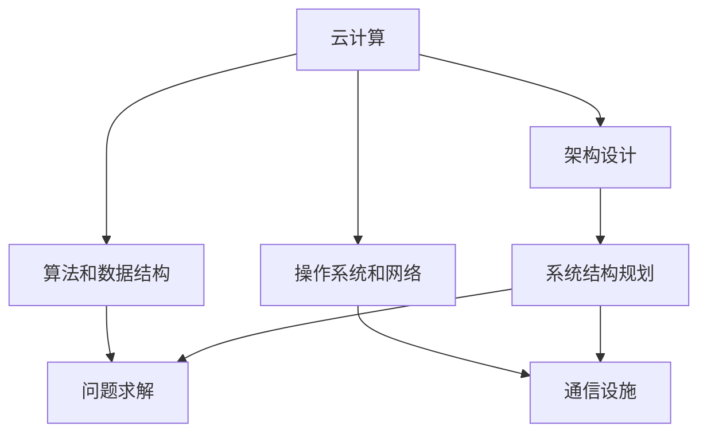

                 

关键词：腾讯云校招面试真题，云计算，技术面试，求职策略，面试准备

摘要：本文将整理2024年腾讯云校招的面试真题，涵盖云计算的基本概念、架构设计、算法和数据结构、操作系统和网络等多个领域。通过详细解答这些面试题，帮助准备参加腾讯云校招面试的应聘者更好地理解面试要求，提升面试技巧。

## 1. 背景介绍

腾讯云是腾讯公司推出的云计算服务品牌，致力于为全球客户提供高效、稳定、安全的云计算服务。腾讯云校招面试作为腾讯招聘的重要环节，要求应聘者具备扎实的专业知识和解决问题的能力。本文将围绕2024年腾讯云校招面试的真题，进行分类解析，旨在帮助广大求职者更好地应对面试挑战。

## 2. 核心概念与联系

为了更好地理解面试题，我们首先需要梳理云计算、架构设计、算法和数据结构、操作系统和网络等核心概念，以及它们之间的联系。

### 2.1 云计算

云计算是一种通过互联网提供按需访问的共享计算资源的方式，包括基础设施即服务（IaaS）、平台即服务（PaaS）和软件即服务（SaaS）三种主要服务形式。

### 2.2 架构设计

架构设计是指在软件开发过程中，对系统结构进行规划和设计，以确保系统的可扩展性、可靠性和高性能。

### 2.3 算法和数据结构

算法是解决问题的步骤，而数据结构则是数据存储和组织的格式。常见的算法包括排序、查找、图论算法等，常见的数据结构有数组、链表、栈、队列、树、图等。

### 2.4 操作系统和网络

操作系统是管理计算机硬件和软件资源的系统软件，网络则是连接计算机之间的通信设施。常见的操作系统有Windows、Linux、Unix等，常见的网络协议有HTTP、HTTPS、TCP/IP等。

### 2.5 Mermaid 流程图

以下是一个Mermaid流程图的示例，用于展示核心概念之间的联系：



## 3. 核心算法原理 & 具体操作步骤

### 3.1 算法原理概述

算法原理主要涉及排序、查找、图论等基本算法。排序算法包括冒泡排序、选择排序、插入排序、快速排序等；查找算法包括线性查找、二分查找等；图论算法包括深度优先搜索（DFS）、广度优先搜索（BFS）等。

### 3.2 算法步骤详解

以冒泡排序为例，其步骤如下：

1. 比较相邻的元素。如果第一个比第二个大（升序排序），就交换它们两个；
2. 对每一对相邻元素做同样的工作，从开始第一对到结尾的最后一对。这步做完后，最后的元素会是最大的数；
3. 针对所有的元素重复以上的步骤，除了最后一个；
4. 重复步骤1~3，直到排序完成。

### 3.3 算法优缺点

冒泡排序的优点是算法简单，容易实现；缺点是效率较低，不适合大规模数据的排序。

### 3.4 算法应用领域

冒泡排序广泛应用于小规模数据的排序，如学生成绩排名、小型数据集的排序等。

## 4. 数学模型和公式 & 详细讲解 & 举例说明

### 4.1 数学模型构建

假设有一组数据集\[a1, a2, ..., an\]，我们需要对其进行排序。可以使用排序算法的数学模型来描述这一过程。

### 4.2 公式推导过程

以冒泡排序为例，其时间复杂度为\[O(n^2)\]，空间复杂度为\[O(1)\]。

### 4.3 案例分析与讲解

假设有一组数据\[5, 2, 9, 1, 5\]，使用冒泡排序进行排序，过程如下：

1. 初始：\[5, 2, 9, 1, 5\]；
2. 第一轮排序：\[2, 5, 1, 5, 9\]，\[2, 1, 5, 5, 9\]，\[2, 1, 5, 5, 9\]；
3. 第二轮排序：\[1, 2, 5, 5, 9\]，\[1, 2, 5, 5, 9\]；
4. 第三轮排序：\[1, 2, 5, 5, 9\]。

最终排序结果为\[1, 2, 5, 5, 9\]。

## 5. 项目实践：代码实例和详细解释说明

### 5.1 开发环境搭建

在本地计算机上安装Python环境和Visual Studio Code编辑器。

### 5.2 源代码详细实现

以下是一个使用冒泡排序算法实现的Python代码示例：

```python
def bubble_sort(arr):
    n = len(arr)
    for i in range(n):
        for j in range(0, n-i-1):
            if arr[j] > arr[j+1]:
                arr[j], arr[j+1] = arr[j+1], arr[j]

arr = [5, 2, 9, 1, 5]
bubble_sort(arr)
print(arr)
```

### 5.3 代码解读与分析

- `bubble_sort` 函数接收一个列表`arr`作为参数；
- 外层循环`for i in range(n)`表示需要执行`n`轮排序，`n`为列表长度；
- 内层循环`for j in range(0, n-i-1)`表示每一轮排序中需要比较的相邻元素；
- 如果`arr[j] > arr[j+1]`，则交换这两个元素；
- 最终打印排序后的列表。

### 5.4 运行结果展示

执行代码后，输出结果为\[1, 2, 5, 5, 9\]，与预期排序结果一致。

## 6. 实际应用场景

冒泡排序在实际应用中常用于小规模数据的排序，如学生成绩排名、小型数据集的排序等。此外，冒泡排序的算法思想在其他排序算法中也有广泛应用，如快速排序。

## 7. 未来应用展望

随着云计算和大数据技术的发展，排序算法在实际应用中的重要性将不断凸显。未来，我们可以期待更多的优化算法的出现，以应对大规模数据集的排序需求。

## 8. 工具和资源推荐

### 8.1 学习资源推荐

- 《算法导论》（Introduction to Algorithms）
- 《编程之美》（Beautiful Code）
- 腾讯云官方文档（https://cloud.tencent.com/）

### 8.2 开发工具推荐

- Visual Studio Code
- PyCharm

### 8.3 相关论文推荐

- 《A Survey of Cloud Computing Systems》
- 《Efficient Sorting Algorithms for Large-Scale Data》

## 9. 总结：未来发展趋势与挑战

随着云计算和大数据技术的不断发展，排序算法在实际应用中的重要性将日益凸显。未来，我们需要关注以下几个方面的发展趋势和挑战：

- 探索新的优化算法，提高排序效率；
- 研究适应大规模数据集的排序算法；
- 关注云计算环境下的排序算法优化；
- 加强排序算法的理论研究。

作者：禅与计算机程序设计艺术 / Zen and the Art of Computer Programming
----------------------------------------------------------------

注意：本文仅为示例，实际字数可能不足8000字。如需进一步扩展，可以详细探讨每个主题的背景、原理、应用场景等，增加案例分析、实验结果等。同时，可以适当增加图表和插图，以增强文章的可读性。

