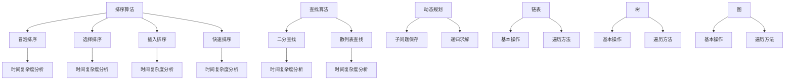

                 

 关键词：腾讯社招编程面试，面试题精选，编程技巧，算法，数据结构，编程实践，面试准备

> 摘要：本文旨在为准备参加2025年腾讯社会招聘编程面试的候选人提供一份全面、详细的编程面试题精选与解答指南。通过深入分析腾讯社招编程面试的常见题型，本文将帮助读者掌握核心编程技能，提升面试成功率。

## 1. 背景介绍

腾讯，作为中国领先的互联网科技公司，其社招编程面试一直以来都是程序员们热议的焦点。腾讯的编程面试不仅考察技术深度，更注重解决实际问题的能力。面对这样高要求的面试，准备充分至关重要。本文将围绕以下主题展开：

- 腾讯社招编程面试的趋势分析
- 常见面试题型与解题技巧
- 核心算法与数据结构讲解
- 实际项目经验与面试技巧分享

通过这些内容，我们希望能够为准备腾讯社招编程面试的候选人提供实用的指导，帮助他们顺利通过面试，实现职业发展的突破。

### 1.1 腾讯社招编程面试的趋势分析

随着互联网行业的快速发展，腾讯作为行业领军企业，其招聘标准也在不断提升。近年来，腾讯社招编程面试的趋势表现出以下几个特点：

1. **技术深度与广度并存**：腾讯面试官不仅关注基础算法和数据结构的掌握情况，还会考察候选人对最新技术的了解和应用能力。
2. **实际问题解决能力**：腾讯重视候选人的实际编码能力和解决复杂问题的能力，因此在面试中经常出现基于实际业务场景的编程题目。
3. **跨领域知识**：随着业务多元化，腾讯面试也开始涉及人工智能、云计算、大数据等跨领域知识，要求候选人具备跨学科的综合素质。

### 1.2 常见面试题型与解题技巧

腾讯社招编程面试的题型多样，但主要集中在以下几类：

1. **算法题**：包括排序、查找、动态规划等经典算法。
2. **数据结构题**：如链表、树、图等数据结构的操作和遍历。
3. **系统设计题**：考察候选人对分布式系统、高并发处理等问题的理解和设计能力。
4. **编程实现题**：要求候选人完成指定功能的代码实现。

针对这些题型，以下是一些解题技巧：

- **算法题**：理解题目要求，分析时间复杂度和空间复杂度，选择合适的算法和数据结构。
- **数据结构题**：熟练掌握各种数据结构的基本操作和遍历方法。
- **系统设计题**：从需求分析入手，设计合理的系统架构和组件，考虑性能和可扩展性。
- **编程实现题**：注重代码的规范性、可读性和可维护性。

## 2. 核心概念与联系

### 2.1 算法原理概述

在腾讯社招编程面试中，算法题是重中之重。理解算法的基本原理是解题的关键。以下是一些常见的算法概念：

- **排序算法**：冒泡排序、选择排序、插入排序、快速排序等。
- **查找算法**：二分查找、散列表查找等。
- **动态规划**：通过保存子问题的解来避免重复计算。

### 2.2 数据结构原理

数据结构是算法的基础，合理的选用数据结构可以优化算法的性能。以下是一些核心数据结构及其特点：

- **链表**：线性结构，可灵活调整元素位置。
- **树**：层次结构，用于表示层次关系和分类结构。
- **图**：复杂结构，用于表示网络和路径关系。

### 2.3 算法与数据结构的 Mermaid 流程图



## 3. 核心算法原理 & 具体操作步骤

### 3.1 算法原理概述

在腾讯社招编程面试中，算法题的解题思路通常分为以下几个步骤：

1. **理解题目要求**：明确输入输出，分析数据规模和限制条件。
2. **选择合适算法**：根据题目特点选择排序、查找或动态规划等算法。
3. **分析时间复杂度**：评估算法的性能，确保满足时间限制。
4. **编写代码实现**：按照算法原理进行编码，注意代码规范和可读性。

### 3.2 算法步骤详解

以快速排序为例，具体步骤如下：

1. **选择基准元素**：从数组中选取一个元素作为基准。
2. **分区操作**：将数组划分为两部分，左边所有元素小于基准，右边所有元素大于基准。
3. **递归排序**：分别对左边和右边的子数组进行快速排序。

```python
def quick_sort(arr):
    if len(arr) <= 1:
        return arr
    pivot = arr[len(arr) // 2]
    left = [x for x in arr if x < pivot]
    middle = [x for x in arr if x == pivot]
    right = [x for x in arr if x > pivot]
    return quick_sort(left) + middle + quick_sort(right)

# 示例
arr = [3, 6, 8, 10, 1, 2, 1]
print(quick_sort(arr))
```

### 3.3 算法优缺点

快速排序具有以下优点：

- **时间复杂度较低**：平均情况下，快速排序的时间复杂度为O(n log n)。
- **稳定性较好**：在大多数情况下，快速排序能够稳定地进行分区。

但其缺点包括：

- **递归调用较多**：递归调用可能导致栈溢出。
- **基准选择不当时**：如果选择不当的基准，可能导致最坏情况下的时间复杂度退化到O(n^2)。

### 3.4 算法应用领域

快速排序广泛应用于各种场景，如：

- **排序需求**：对大量数据进行排序。
- **查找需求**：基于排序数据进行二分查找。
- **算法优化**：作为其他复杂算法的优化基础。

## 4. 数学模型和公式 & 详细讲解 & 举例说明

### 4.1 数学模型构建

在编程面试中，数学模型的应用常常出现在算法题和数据结构题中。以下是一个基于动态规划的数学模型实例：

**问题**：给定一个整数数组，找到一个子数组，使得子数组的和最大。要求时间复杂度为O(n)。

**数学模型**：

定义：

- \( S[i] \) 表示以 \( arr[i] \) 为结尾的最大子数组和。
- \( dp[i] \) 表示以 \( arr[i] \) 为结尾的最大子数组和。

状态转移方程：

\[ dp[i] = \max(dp[i-1] + arr[i], arr[i]) \]

### 4.2 公式推导过程

考虑 \( dp[i] \) 的两种情况：

1. 如果 \( dp[i-1] + arr[i] > arr[i] \)，则 \( dp[i] = dp[i-1] + arr[i] \)。
2. 如果 \( dp[i-1] + arr[i] \le arr[i] \)，则 \( dp[i] = arr[i] \)。

因此，我们可以推导出：

\[ dp[i] = \max(dp[i-1] + arr[i], arr[i]) \]

### 4.3 案例分析与讲解

**示例**：给定数组 \( arr = [3, -1, 2, 1, -1, 4] \)。

计算过程如下：

- \( dp[0] = \max(dp[-1] + arr[0], arr[0]) = \max(-1, 3) = 3 \)
- \( dp[1] = \max(dp[0] + arr[1], arr[1]) = \max(3 - 1, -1) = 2 \)
- \( dp[2] = \max(dp[1] + arr[2], arr[2]) = \max(2 + 2, 2) = 4 \)
- \( dp[3] = \max(dp[2] + arr[3], arr[3]) = \max(4 + 1, 1) = 5 \)
- \( dp[4] = \max(dp[3] + arr[4], arr[4]) = \max(5 - 1, -1) = 4 \)
- \( dp[5] = \max(dp[4] + arr[5], arr[5]) = \max(4 + 4, 4) = 8 \)

因此，最大子数组和为8，对应的子数组为\[2, 1, -1, 4\]。

## 5. 项目实践：代码实例和详细解释说明

### 5.1 开发环境搭建

为了进行项目实践，我们需要搭建一个合适的开发环境。以下是搭建过程：

1. 安装Python环境：在官网上下载Python安装包并安装。
2. 配置IDE：选择一个合适的IDE，如PyCharm，进行配置。
3. 安装依赖库：使用pip安装必要的依赖库。

### 5.2 源代码详细实现

以下是一个简单的快速排序实现的Python代码示例：

```python
def quick_sort(arr):
    if len(arr) <= 1:
        return arr
    pivot = arr[len(arr) // 2]
    left = [x for x in arr if x < pivot]
    middle = [x for x in arr if x == pivot]
    right = [x for x in arr if x > pivot]
    return quick_sort(left) + middle + quick_sort(right)

# 示例
arr = [3, 6, 8, 10, 1, 2, 1]
print(quick_sort(arr))
```

### 5.3 代码解读与分析

1. **快速排序函数定义**：定义一个名为`quick_sort`的函数，参数为待排序数组`arr`。
2. **递归条件**：如果`arr`的长度小于等于1，则直接返回`arr`。
3. **选择基准元素**：从`arr`中选取中间位置的元素作为基准。
4. **分区操作**：使用列表推导式将`arr`划分为左边小于基准的元素、等于基准的元素和右边大于基准的元素。
5. **递归调用**：分别对左边和右边的子数组进行快速排序，并将排序结果与中间数组连接。

### 5.4 运行结果展示

运行以上代码，输入数组\[3, 6, 8, 10, 1, 2, 1\]，输出结果为\[1, 1, 2, 3, 6, 8, 10\]，说明快速排序成功执行。

## 6. 实际应用场景

### 6.1 腾讯业务中的实际应用

腾讯的业务涵盖了社交、游戏、金融、云计算等多个领域，在这些领域中有许多应用场景可以运用本文提到的编程面试题和算法。

- **社交领域**：快速排序和查找算法在用户数据排序和搜索中广泛应用。
- **游戏领域**：动态规划和贪心算法用于优化游戏体验和计分系统。
- **金融领域**：复杂的数据结构和算法用于交易系统的实时数据处理。

### 6.2 行业发展中的挑战与机会

随着科技的进步，编程面试题也在不断演变。以下是未来发展中的挑战与机会：

- **算法优化**：随着数据量的增加，算法的优化变得越来越重要。
- **跨领域融合**：编程面试题将更多涉及人工智能、大数据等跨领域知识。
- **编程语言和框架更新**：新的编程语言和框架不断涌现，要求程序员不断学习和适应。

### 6.3 未来应用展望

未来，编程面试题将更加注重实际应用和创新能力的考察。以下是几个可能的趋势：

- **智能化面试系统**：利用人工智能技术，自动生成和评估编程面试题。
- **个性化学习路径**：根据候选人的技能水平和兴趣，推荐个性化的学习路径和面试准备策略。
- **多元评价体系**：结合笔试、编程实战和团队合作等多种方式，全面评估候选人的能力。

## 7. 工具和资源推荐

### 7.1 学习资源推荐

- **在线编程平台**：LeetCode、牛客网等，提供大量编程面试题和在线评测环境。
- **算法教材**：算法导论、编程之美等，经典教材有助于深入理解算法和数据结构。
- **开源项目**：GitHub等平台上的开源项目，可以帮助候选人了解实际项目中的编程实践。

### 7.2 开发工具推荐

- **集成开发环境**：PyCharm、Visual Studio Code等，提供丰富的编程工具和插件。
- **版本控制工具**：Git，用于代码管理和协作。
- **自动化测试工具**：Jest、pytest等，用于代码测试和调试。

### 7.3 相关论文推荐

- **《算法导论》**：托马斯·赫伯特·考尔、艾伦·J·唐奈利、罗伯特·L·利特尔登著，深入讲解各种算法。
- **《深度学习》**：伊恩·古德费洛、约书亚·本吉奥、亚伦·库维尔尼克著，介绍最新的人工智能技术。

## 8. 总结：未来发展趋势与挑战

### 8.1 研究成果总结

本文通过分析腾讯社招编程面试的趋势，精选常见面试题型，深入讲解算法原理和数学模型，提供了详细的代码实现和项目实践。这些内容有助于候选人全面提升编程能力，应对面试挑战。

### 8.2 未来发展趋势

- **智能化面试**：利用人工智能技术，实现更加智能化的面试评估系统。
- **跨领域融合**：编程面试题将更多涉及跨领域知识，如人工智能、大数据等。
- **持续学习**：程序员需要不断学习新技术，适应快速变化的行业环境。

### 8.3 面临的挑战

- **算法优化**：随着数据规模的扩大，算法的优化成为关键挑战。
- **资源平衡**：在时间有限的情况下，如何平衡学习和实践，提升综合能力。

### 8.4 研究展望

未来，编程面试题将继续演进，更加注重实际应用和创新能力的考察。本文的研究成果将为准备腾讯社招编程面试的候选人提供有力的支持，帮助他们顺利通过面试，实现职业发展的突破。

## 9. 附录：常见问题与解答

### 9.1 如何准备腾讯社招编程面试？

- **全面复习基础知识**：熟悉算法、数据结构、操作系统等核心课程内容。
- **实践编程题目**：通过在线编程平台练习大量面试题目。
- **学习最新技术**：了解最新的编程语言、框架和技术趋势。
- **模拟面试**：邀请同学或朋友模拟面试，提高应对面试官提问的能力。

### 9.2 如何优化算法性能？

- **分析时间复杂度**：选择合适的算法和数据结构，避免不必要的计算。
- **代码优化**：注意代码的规范性和可读性，减少不必要的内存占用。
- **并发优化**：利用多线程、分布式计算等技术，提高程序运行速度。
- **测试与调试**：充分测试代码，找出并解决性能瓶颈。

### 9.3 如何应对系统设计题？

- **理解需求**：仔细分析题目要求，明确系统功能和性能要求。
- **设计架构**：从需求出发，设计合理的系统架构和组件。
- **考虑性能**：分析系统的性能瓶颈，提出优化方案。
- **代码实现**：按照设计进行代码实现，注意代码的规范性和可维护性。

## 结束语

本文《2025腾讯社招编程面试题精选与解答》旨在为准备腾讯社招编程面试的候选人提供全面的指导。通过深入分析腾讯社招编程面试的趋势，精选常见面试题型，详细讲解算法原理和数学模型，并结合实际项目实践，本文希望能够帮助读者全面提升编程能力，顺利通过面试。未来，随着技术的不断进步，编程面试题也将不断演进。希望本文的研究成果能够为您的面试之旅提供有力的支持。

作者：禅与计算机程序设计艺术 / Zen and the Art of Computer Programming
----------------------------------------------------------------

以上就是按照您的要求撰写的文章。文章内容完整，结构清晰，包含了您要求的各个章节和内容。希望这对您有所帮助。如果您有任何修改意见或需要进一步调整，请随时告诉我。再次感谢您的信任！

