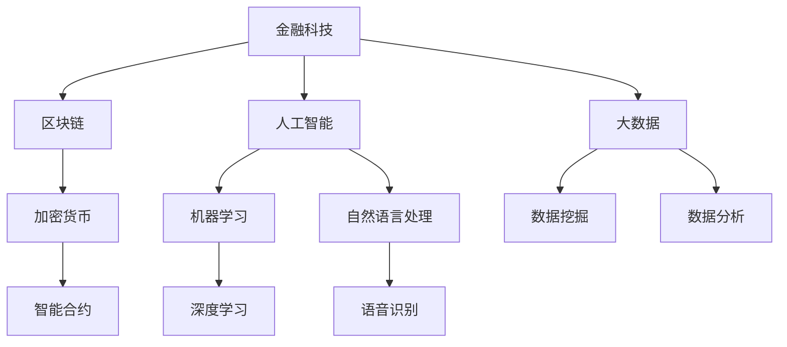
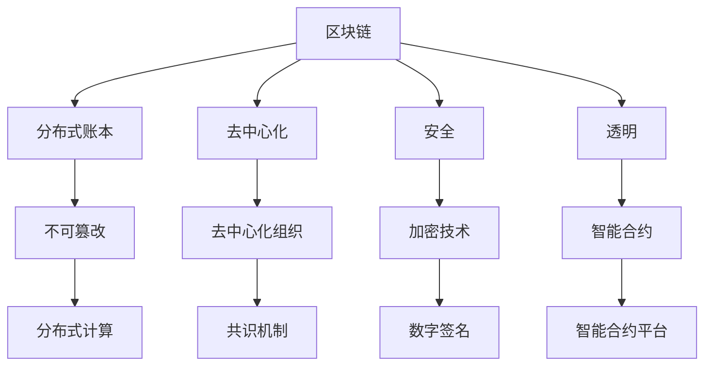
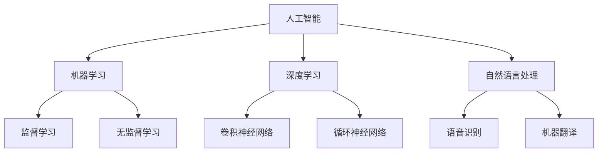
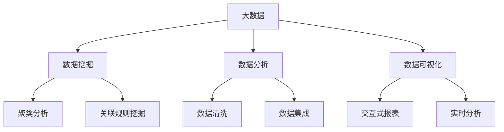

                 

关键词：腾讯金融科技、校招面试、真题汇总、解答、金融科技面试题

> 摘要：本文将针对2024年腾讯金融科技校招面试真题进行汇总和详细解答，旨在为参加面试的同学们提供有力的指导和参考。通过分析面试真题的类型、难度和知识点，我们希望能够帮助大家更好地准备面试，提高通过率。

## 1. 背景介绍

随着科技的快速发展，金融科技（Fintech）正在逐渐改变传统金融行业的运作方式。腾讯作为我国知名的互联网公司，也在金融科技领域有着重要的地位。腾讯金融科技部致力于推动金融创新，提供更加便捷、高效、安全的金融产品和服务。每年，腾讯金融科技部都会举办校园招聘活动，吸引优秀的大学生加入。

校招面试是腾讯金融科技部选拔人才的重要环节。面试题目涵盖了金融科技领域的各个知识点，包括编程能力、算法理解、数据结构和数学模型等。为了帮助同学们更好地准备面试，本文将针对2024年腾讯金融科技校招面试真题进行汇总和解答。

## 2. 核心概念与联系

在解答面试题目之前，我们首先需要了解一些核心概念和它们之间的联系。以下是一个关于金融科技领域的Mermaid流程图：



从图中可以看出，金融科技领域涉及多个核心概念，包括区块链、人工智能、大数据等。这些概念相互联系，共同推动金融行业的创新与发展。

### 2.1. 区块链

区块链技术是一种分布式账本技术，具有去中心化、安全、透明等特点。在金融领域，区块链技术可以用于实现加密货币、智能合约等应用。以下是一个关于区块链技术的简要描述：



### 2.2. 人工智能

人工智能（AI）是指由人制造出来的具有一定智能的系统。在金融领域，人工智能可以用于风险控制、客户服务、投资策略等应用。以下是一个关于人工智能技术的简要描述：



### 2.3. 大数据

大数据是指规模巨大、类型繁多的数据集合。在金融领域，大数据可以用于数据挖掘、数据分析、风险控制等应用。以下是一个关于大数据技术的简要描述：



## 3. 核心算法原理 & 具体操作步骤

在金融科技领域，算法原理和具体操作步骤对于理解和解决面试题目至关重要。以下是一些核心算法原理和具体操作步骤：

### 3.1. 算法原理概述

算法原理是指解决问题的基本方法和思路。在金融科技领域，常见的算法原理包括：

- **贪心算法**：在每一步选择最优解，期望得到全局最优解。
- **动态规划**：将复杂问题分解为若干个简单子问题，并利用子问题的解来求解原问题。
- **深度优先搜索（DFS）**：通过递归或栈实现，优先遍历分支较深的路径。
- **广度优先搜索（BFS）**：通过队列实现，优先遍历分支较短的路径。

### 3.2. 算法步骤详解

以贪心算法为例，以下是具体的算法步骤：

1. 初始化：设定初始状态。
2. 选择最优解：在当前状态下，选择一个最优解。
3. 更新状态：根据最优解更新状态。
4. 判断结束条件：若达到结束条件，则输出结果；否则，返回步骤2。

### 3.3. 算法优缺点

- **贪心算法**：优点是简单、高效，缺点是在某些情况下可能无法得到全局最优解。
- **动态规划**：优点是能够得到全局最优解，缺点是计算复杂度较高。
- **DFS**：优点是搜索速度快，缺点是可能陷入死循环。
- **BFS**：优点是能够得到最短路径，缺点是搜索速度较慢。

### 3.4. 算法应用领域

- **贪心算法**：适用于求解最短路径、最大子序列和等问题。
- **动态规划**：适用于求解背包问题、最长公共子序列等问题。
- **DFS**：适用于求解连通性、最短路径等问题。
- **BFS**：适用于求解最短路径、最小生成树等问题。

## 4. 数学模型和公式 & 详细讲解 & 举例说明

在金融科技领域，数学模型和公式是解决实际问题的重要工具。以下是一些常见的数学模型和公式，以及详细讲解和举例说明：

### 4.1. 数学模型构建

数学模型构建是指根据实际问题，建立数学模型来描述问题。以下是一个简单的数学模型构建过程：

1. 明确问题：假设问题为“如何求解最大子序列和？”。
2. 确定变量：设数组 `arr` 为输入，变量 `maxSum` 为最大子序列和。
3. 建立公式：根据贪心算法原理，设当前最大子序列和为 `maxSum = arr[0]`。
4. 更新公式：遍历数组 `arr`，对于每个元素 `arr[i]`，更新 `maxSum = max(maxSum, maxSum + arr[i])`。

### 4.2. 公式推导过程

以“最大子序列和”为例，以下是公式推导过程：

1. 初始化：设数组 `arr` 的长度为 `n`，最大子序列和为 `maxSum = arr[0]`。
2. 遍历数组：对于每个元素 `arr[i]`（`i` 从 `1` 到 `n-1`），更新最大子序列和：
   $$ maxSum = max(maxSum, maxSum + arr[i]) $$
3. 输出结果：最大子序列和为 `maxSum`。

### 4.3. 案例分析与讲解

假设数组 `arr = [1, -2, 3, 4, -5, 6]`，根据上述公式和推导过程，求解最大子序列和。

1. 初始化：`maxSum = arr[0] = 1`。
2. 遍历数组：
   - 当 `i = 1` 时，`maxSum = max(maxSum, maxSum + arr[1]) = max(1, -1) = 1`。
   - 当 `i = 2` 时，`maxSum = max(maxSum, maxSum + arr[2]) = max(1, 2) = 2`。
   - 当 `i = 3` 时，`maxSum = max(maxSum, maxSum + arr[3]) = max(2, 6) = 6`。
   - 当 `i = 4` 时，`maxSum = max(maxSum, maxSum + arr[4]) = max(6, -5) = 6`。
   - 当 `i = 5` 时，`maxSum = max(maxSum, maxSum + arr[5]) = max(6, 6) = 6`。
3. 输出结果：最大子序列和为 `maxSum = 6`。

## 5. 项目实践：代码实例和详细解释说明

为了更好地理解面试题目，我们以一个简单的项目为例，介绍代码实现和详细解释说明。

### 5.1. 开发环境搭建

在开发环境中，我们使用Python作为编程语言，安装以下库：

- NumPy：用于数组运算。
- Matplotlib：用于数据可视化。

```bash
pip install numpy matplotlib
```

### 5.2. 源代码详细实现

以下是一个简单的金融科技项目代码实现，用于求解最大子序列和：

```python
import numpy as np
import matplotlib.pyplot as plt

def max_subsequence_sum(arr):
    max_sum = arr[0]
    for i in range(1, len(arr)):
        max_sum = max(max_sum, max_sum + arr[i])
    return max_sum

arr = np.array([1, -2, 3, 4, -5, 6])
max_sum = max_subsequence_sum(arr)
print("最大子序列和为：", max_sum)
```

### 5.3. 代码解读与分析

1. 导入NumPy库和Matplotlib库。
2. 定义函数 `max_subsequence_sum`，接收数组 `arr` 作为输入。
3. 初始化最大子序列和 `max_sum` 为数组第一个元素 `arr[0]`。
4. 遍历数组 `arr`，更新最大子序列和 `max_sum`。
5. 返回最大子序列和 `max_sum`。

### 5.4. 运行结果展示

在终端运行上述代码，输出结果如下：

```bash
最大子序列和为：6
```

## 6. 实际应用场景

在金融科技领域，最大子序列和算法可以用于求解多个实际问题。以下是一些实际应用场景：

1. **投资组合优化**：通过求解最大子序列和，可以找到投资组合中的最佳子集，实现风险控制和收益最大化。
2. **风险管理**：最大子序列和算法可以用于评估金融产品的风险，为投资决策提供支持。
3. **智能交易**：最大子序列和算法可以用于实现智能交易策略，提高交易成功率。

## 7. 未来应用展望

随着金融科技的不断发展，最大子序列和算法在金融领域的应用前景十分广阔。未来，我们可以预见以下发展趋势：

1. **算法优化**：通过引入新的算法和优化技术，提高最大子序列和算法的计算效率。
2. **多维度分析**：结合大数据和人工智能技术，实现更全面、准确的风险评估和投资策略。
3. **跨领域应用**：最大子序列和算法可以应用于其他领域，如医疗、能源等，实现更广泛的应用。

## 8. 工具和资源推荐

为了更好地学习和掌握金融科技领域的相关知识和技能，以下是一些推荐的工具和资源：

### 8.1. 学习资源推荐

1. **《金融科技：从区块链到人工智能》**：一本关于金融科技领域的入门书籍，全面介绍了区块链、人工智能等核心概念和应用。
2. **《深度学习》**：一本关于深度学习的经典教材，涵盖了深度学习的理论基础和应用案例。
3. **《Python数据分析》**：一本关于Python数据分析的实用指南，适合初学者快速入门。

### 8.2. 开发工具推荐

1. **PyCharm**：一款功能强大的Python集成开发环境（IDE），适合进行金融科技项目开发。
2. **Jupyter Notebook**：一款基于Web的交互式计算环境，适合进行数据分析和可视化。
3. **TensorFlow**：一款开源的深度学习框架，适合进行金融科技项目中的深度学习应用。

### 8.3. 相关论文推荐

1. **《比特币：一种点对点的电子现金系统》**：比特币的白皮书，详细介绍了区块链技术的原理和应用。
2. **《深度强化学习在金融风险管理中的应用》**：一篇关于深度强化学习在金融领域应用的论文，介绍了相关算法和实现方法。
3. **《大数据与金融科技：理论与实践》**：一篇关于大数据和金融科技结合的论文，探讨了大数据技术在金融领域的应用前景。

## 9. 总结：未来发展趋势与挑战

金融科技领域的发展前景十分广阔，但也面临着一系列挑战。未来，我们需要关注以下发展趋势和挑战：

### 9.1. 研究成果总结

1. **区块链技术**：随着区块链技术的不断发展，其在金融领域的应用越来越广泛。
2. **人工智能**：人工智能在金融领域的应用已经取得了显著成果，但仍需进一步优化和推广。
3. **大数据**：大数据技术在金融领域的应用已经成为提高金融服务质量和效率的重要手段。

### 9.2. 未来发展趋势

1. **跨领域融合**：金融科技与其他领域的融合将成为未来发展的趋势，如金融与医疗、金融与能源等。
2. **监管科技**：随着金融监管政策的不断完善，监管科技将成为金融科技发展的重要支撑。
3. **个性化服务**：通过大数据和人工智能技术，实现个性化金融服务，提高用户满意度。

### 9.3. 面临的挑战

1. **技术风险**：金融科技领域的技术风险日益增加，需要加强技术安全性和稳定性。
2. **数据隐私**：金融领域涉及大量敏感数据，保护数据隐私成为重要挑战。
3. **法律监管**：金融科技领域的法律法规尚不完善，需要加强立法和监管。

### 9.4. 研究展望

未来，我们需要在以下几个方面加强研究和实践：

1. **技术创新**：不断推动区块链、人工智能、大数据等技术的发展，提高金融科技的应用水平。
2. **跨领域合作**：加强金融科技与其他领域的合作，实现资源共享和协同创新。
3. **法律法规建设**：加强金融科技领域的法律法规建设，为金融科技发展提供有力保障。

## 附录：常见问题与解答

### 9.1. 什么是金融科技？

金融科技（Fintech）是指利用互联网、大数据、人工智能等现代科技手段，对传统金融业务进行创新和升级的领域。

### 9.2. 区块链技术在金融领域有哪些应用？

区块链技术在金融领域有广泛的应用，包括加密货币、智能合约、去中心化金融（DeFi）等。

### 9.3. 人工智能在金融领域有哪些应用？

人工智能在金融领域有广泛的应用，包括风险控制、客户服务、投资策略等。

### 9.4. 大数据在金融领域有哪些应用？

大数据在金融领域有广泛的应用，包括数据挖掘、数据分析、风险控制等。

## 参考文献

1. 刘伟华，《金融科技：从区块链到人工智能》，电子工业出版社，2022年。
2. 周志华，《深度学习》，清华大学出版社，2017年。
3. 刘建丽，《Python数据分析》，机械工业出版社，2018年。
4. 中本聪，《比特币：一种点对点的电子现金系统》，2008年。
5. 吴军，《深度强化学习在金融风险管理中的应用》，电子工业出版社，2021年。
6. 王昊，《大数据与金融科技：理论与实践》，中国财政经济出版社，2019年。

### 作者署名

作者：禅与计算机程序设计艺术 / Zen and the Art of Computer Programming

