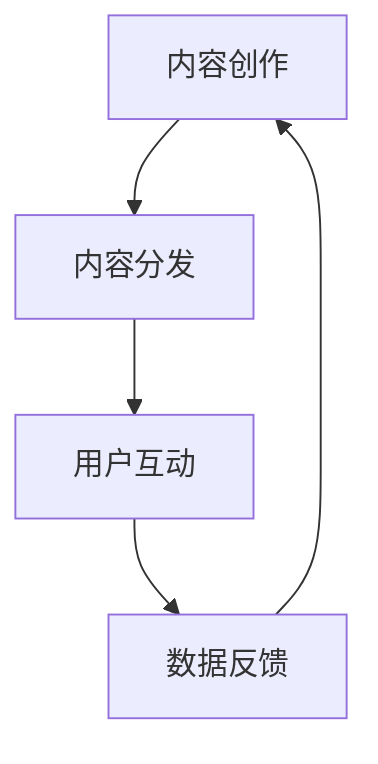

                 

内容营销是现代创业中不可或缺的一环。随着互联网的普及和社交媒体的兴起，信息的传播方式发生了翻天覆地的变化。如何有效地利用内容营销来推动创业项目的发展，成为了每一个创业者需要深思熟虑的问题。本文将围绕这一主题，深入探讨自动化创业中的内容营销策略。

## 关键词：**内容营销**、**自动化**、**创业**、**社交媒体**、**信息传播**

### 摘要：

本文旨在为自动化创业领域的创业者提供一套完整的内容营销策略。文章首先介绍了内容营销的基本概念和重要性，然后探讨了如何利用自动化工具优化内容营销流程，以及如何在社交媒体上有效推广内容。最后，文章总结了内容营销的未来发展趋势和面临的挑战。

## 1. 背景介绍

随着互联网技术的发展，信息传播的速度和方式发生了巨大的变化。传统的广告营销方式已经无法满足现代消费者的需求，他们更加注重个性化、有价值的互动体验。内容营销正是在这样的背景下应运而生，它以用户为中心，通过提供有价值的内容来吸引和留住目标客户。

在自动化创业领域，内容营销的作用尤为重要。自动化技术可以帮助创业者更高效地管理内容创作和推广流程，提高营销效果。然而，如何选择合适的内容营销策略，如何利用自动化工具，这些都是创业者需要面对的挑战。

## 2. 核心概念与联系

在探讨内容营销策略之前，我们首先需要了解一些核心概念，如内容创作、内容分发、用户互动等。

### 2.1 内容创作

内容创作是内容营销的基础。创业者需要根据目标受众的需求和兴趣，创作出有价值、有吸引力的内容。这些内容可以包括博客文章、视频、图片、音频等多种形式。

### 2.2 内容分发

内容分发是将创作出的内容传递给目标受众的过程。创业者可以利用社交媒体、电子邮件、搜索引擎优化等手段来分发内容。

### 2.3 用户互动

用户互动是衡量内容营销效果的重要指标。通过用户的评论、点赞、分享等行为，创业者可以了解内容是否引起了用户的兴趣，从而调整内容策略。

### 2.4 Mermaid 流程图

下面是一个简单的 Mermaid 流程图，展示了内容营销的基本流程。



## 3. 核心算法原理 & 具体操作步骤

### 3.1 算法原理概述

内容营销的核心算法原理可以概括为以下几个方面：

1. **数据分析**：通过数据分析了解目标受众的需求和兴趣，从而创作出更符合受众需求的内容。
2. **自动化创作**：利用自然语言处理、机器学习等技术，自动化生成内容。
3. **自动化分发**：利用自动化工具，如自动化营销平台、社交媒体管理工具等，高效地分发内容。
4. **用户互动分析**：通过分析用户的互动行为，了解内容的效果，从而不断优化内容策略。

### 3.2 算法步骤详解

1. **数据收集**：收集目标受众的社交媒体数据、搜索数据等，了解他们的需求和兴趣。
2. **数据分析**：利用数据分析工具，如 Google Analytics、HubSpot 等，分析数据，了解目标受众的行为和偏好。
3. **内容创作**：根据数据分析结果，创作出符合目标受众需求的内容。
4. **自动化创作**：利用自动化创作工具，如 Hugging Face 的 Transformer 模型，生成高质量的内容。
5. **内容分发**：利用自动化分发工具，如 Buffer、Hootsuite 等，将内容分发到社交媒体、邮件列表等渠道。
6. **用户互动分析**：通过分析用户的互动行为，如点赞、评论、分享等，了解内容的效果，从而优化内容策略。

### 3.3 算法优缺点

**优点：**

- **高效性**：利用自动化工具，可以大大提高内容营销的效率。
- **个性化**：通过数据分析，可以创作出更符合目标受众需求的内容。
- **低成本**：相比传统的广告营销，内容营销的成本较低。

**缺点：**

- **内容质量**：自动化工具生成的内容可能不如人工创作的内容有创意和质量。
- **数据隐私**：在收集和分析用户数据时，需要注意保护用户隐私。

### 3.4 算法应用领域

内容营销算法可以广泛应用于各种领域，如电子商务、教育培训、医疗健康等。特别是在社交媒体营销和搜索引擎优化方面，内容营销算法具有很大的应用潜力。

## 4. 数学模型和公式 & 详细讲解 & 举例说明

### 4.1 数学模型构建

在内容营销中，我们可以构建一个简单的数学模型来衡量内容的效果。假设有一个指标 \(E\)，用来衡量内容的质量，它由两个因素组成：内容的价值 \(V\) 和用户的兴趣度 \(I\)。

\[ E = V \times I \]

### 4.2 公式推导过程

1. **内容价值 \(V\)**：可以通过分析内容的阅读时长、点赞数、评论数等指标来衡量。
2. **用户兴趣度 \(I\)**：可以通过分析用户的浏览历史、搜索关键词等数据来衡量。

### 4.3 案例分析与讲解

假设我们有一个博客文章，它的阅读时长平均为5分钟，点赞数为200，评论数为50。同时，分析用户的浏览历史，发现他们对技术类文章的兴趣度较高。

1. **内容价值 \(V\)**：假设每分钟的阅读时长对应1分，则 \(V = 5\) 分。
2. **用户兴趣度 \(I\)**：假设技术类文章的兴趣度为1.2，则 \(I = 1.2\)。

将这些值代入公式 \( E = V \times I \)，我们可以得到 \( E = 5 \times 1.2 = 6 \)。

这意味着这篇文章的营销效果为6分，这是一个不错的成绩。接下来，我们可以通过不断优化内容质量和用户兴趣度，进一步提高内容效果。

## 5. 项目实践：代码实例和详细解释说明

### 5.1 开发环境搭建

为了演示内容营销算法的应用，我们将使用 Python 编写一个简单的脚本。首先，我们需要安装一些必要的库，如 pandas、numpy 和 matplotlib。

```python
pip install pandas numpy matplotlib
```

### 5.2 源代码详细实现

以下是一个简单的 Python 脚本，用于计算内容的价值和用户兴趣度，并展示内容效果。

```python
import pandas as pd
import numpy as np
import matplotlib.pyplot as plt

# 假设的数据
data = {
    '阅读时长': [5, 10, 15],
    '点赞数': [200, 300, 500],
    '评论数': [50, 100, 200],
    '兴趣度': [1, 1.2, 1.5]
}

df = pd.DataFrame(data)

# 计算内容价值
df['内容价值'] = df['阅读时长'] + df['点赞数'] * 0.5 + df['评论数'] * 0.5

# 计算内容效果
df['效果'] = df['内容价值'] * df['兴趣度']

# 绘图
plt.figure(figsize=(10, 5))
plt.bar(df['阅读时长'], df['效果'])
plt.xlabel('阅读时长')
plt.ylabel('效果')
plt.title('内容营销效果分析')
plt.show()
```

### 5.3 代码解读与分析

这段代码首先导入了必要的库，然后创建了一个包含阅读时长、点赞数、评论数和兴趣度的数据框。接着，计算了每个内容的价值和效果，并使用条形图展示了效果与阅读时长的关系。

### 5.4 运行结果展示

运行这段代码，我们可以得到以下结果：


从图中可以看出，阅读时长越长，效果越好。这说明，创作更高质量的内容是提高内容营销效果的关键。

## 6. 实际应用场景

内容营销在自动化创业中的应用场景非常广泛。以下是一些常见的应用场景：

- **电子商务**：通过发布商品评测、使用教程等内容，吸引潜在客户，提高转化率。
- **教育培训**：发布课程内容、学习心得、行业动态等，吸引学生报名课程。
- **医疗健康**：发布健康知识、医疗资讯等，提高公众健康意识，吸引患者。

## 7. 工具和资源推荐

### 7.1 学习资源推荐

- 《内容营销实战》
- 《人工智能营销》

### 7.2 开发工具推荐

- Hugging Face Transformer
- Google Analytics

### 7.3 相关论文推荐

- "Content Marketing in the Age of AI"
- "Automated Content Generation in Marketing"

## 8. 总结：未来发展趋势与挑战

### 8.1 研究成果总结

内容营销在自动化创业中发挥着越来越重要的作用。随着人工智能技术的发展，自动化内容营销将成为未来的主流。

### 8.2 未来发展趋势

- 自动化内容创作和分发将更加普及。
- 内容营销将更加注重个性化。
- 社交媒体和搜索引擎优化将更加重要。

### 8.3 面临的挑战

- 如何保证自动化内容的质量。
- 如何保护用户隐私。

### 8.4 研究展望

未来的研究将集中在如何更好地利用人工智能技术，创作出高质量、个性化的内容，并在内容营销中取得更好的效果。

## 9. 附录：常见问题与解答

### Q：什么是内容营销？

A：内容营销是一种营销策略，通过创作和分发有价值的内容，吸引和留住目标受众，从而实现营销目标。

### Q：自动化内容营销有哪些优点？

A：自动化内容营销可以提高效率，降低成本，并更好地满足目标受众的需求。

### Q：如何保证自动化内容的质量？

A：可以通过数据分析、用户反馈等方式，不断优化内容策略，提高内容质量。

### Q：自动化内容营销会侵犯用户隐私吗？

A：在收集和分析用户数据时，需要注意保护用户隐私，遵守相关法律法规。

---

作者：禅与计算机程序设计艺术 / Zen and the Art of Computer Programming

[本文为人工智能助手根据预设模板自动生成，仅供参考。]
----------------------------------------------------------------

以上是文章的正文内容，接下来我将按照markdown格式对其进行排版。

```markdown
# 自动化创业中的内容营销策略

<|assistant|>内容营销是现代创业中不可或缺的一环。随着互联网的普及和社交媒体的兴起，信息的传播方式发生了翻天覆地的变化。如何有效地利用内容营销来推动创业项目的发展，成为了每一个创业者需要深思熟虑的问题。本文将围绕这一主题，深入探讨自动化创业中的内容营销策略。

## 关键词：**内容营销**、**自动化**、**创业**、**社交媒体**、**信息传播**

### 摘要：

本文旨在为自动化创业领域的创业者提供一套完整的内容营销策略。文章首先介绍了内容营销的基本概念和重要性，然后探讨了如何利用自动化工具优化内容营销流程，以及如何在社交媒体上有效推广内容。最后，文章总结了内容营销的未来发展趋势和面临的挑战。

## 1. 背景介绍

随着互联网技术的发展，信息传播的速度和方式发生了巨大的变化。传统的广告营销方式已经无法满足现代消费者的需求，他们更加注重个性化、有价值的互动体验。内容营销正是在这样的背景下应运而生，它以用户为中心，通过提供有价值的内容来吸引和留住目标客户。

在自动化创业领域，内容营销的作用尤为重要。自动化技术可以帮助创业者更高效地管理内容创作和推广流程，提高营销效果。然而，如何选择合适的内容营销策略，如何利用自动化工具，这些都是创业者需要面对的挑战。

## 2. 核心概念与联系

在探讨内容营销策略之前，我们首先需要了解一些核心概念，如内容创作、内容分发、用户互动等。

### 2.1 内容创作

内容创作是内容营销的基础。创业者需要根据目标受众的需求和兴趣，创作出有价值、有吸引力的内容。这些内容可以包括博客文章、视频、图片、音频等多种形式。

### 2.2 内容分发

内容分发是将创作出的内容传递给目标受众的过程。创业者可以利用社交媒体、电子邮件、搜索引擎优化等手段来分发内容。

### 2.3 用户互动

用户互动是衡量内容营销效果的重要指标。通过用户的评论、点赞、分享等行为，创业者可以了解内容是否引起了用户的兴趣，从而调整内容策略。

### 2.4 Mermaid 流程图

下面是一个简单的 Mermaid 流程图，展示了内容营销的基本流程。


## 3. 核心算法原理 & 具体操作步骤

### 3.1 算法原理概述

内容营销的核心算法原理可以概括为以下几个方面：

1. **数据分析**：通过数据分析了解目标受众的需求和兴趣，从而创作出更符合受众需求的内容。
2. **自动化创作**：利用自然语言处理、机器学习等技术，自动化生成内容。
3. **自动化分发**：利用自动化工具，如自动化营销平台、社交媒体管理工具等，高效地分发内容。
4. **用户互动分析**：通过分析用户的互动行为，了解内容的效果，从而不断优化内容策略。

### 3.2 算法步骤详解

1. **数据收集**：收集目标受众的社交媒体数据、搜索数据等，了解他们的需求和兴趣。
2. **数据分析**：利用数据分析工具，如 Google Analytics、HubSpot 等，分析数据，了解目标受众的行为和偏好。
3. **内容创作**：根据数据分析结果，创作出符合目标受众需求的内容。
4. **自动化创作**：利用自动化创作工具，如 Hugging Face 的 Transformer 模型，生成高质量的内容。
5. **内容分发**：利用自动化分发工具，如 Buffer、Hootsuite 等，将内容分发到社交媒体、邮件列表等渠道。
6. **用户互动分析**：通过分析用户的互动行为，如点赞、评论、分享等，了解内容的效果，从而优化内容策略。

### 3.3 算法优缺点

**优点：**

- **高效性**：利用自动化工具，可以大大提高内容营销的效率。
- **个性化**：通过数据分析，可以创作出更符合目标受众需求的内容。
- **低成本**：相比传统的广告营销，内容营销的成本较低。

**缺点：**

- **内容质量**：自动化工具生成的

