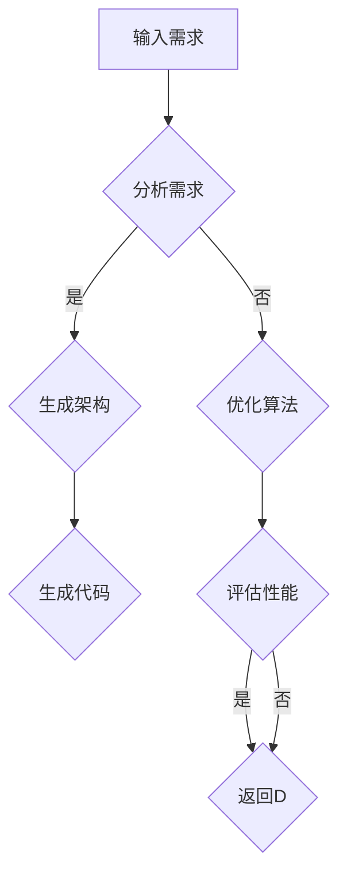

                 

关键词：自动化设计、语言模型（LLM）、创新、人工智能、计算机编程、软件架构、算法原理

> 摘要：本文将探讨如何利用语言模型（LLM）进行自动化设计，特别是在计算机编程、软件架构和算法领域中的应用。通过深入分析LLM的工作原理及其在自动化设计中的潜在优势，本文将探讨如何通过LLM驱动创新，从而推动信息技术的发展。

## 1. 背景介绍

自动化设计是指利用计算机技术和算法自动完成设计任务的过程。随着人工智能技术的快速发展，尤其是语言模型（LLM）的突破性进展，自动化设计已经成为信息技术领域的一个重要研究方向。LLM作为一种强大的自然语言处理工具，具有处理复杂语言结构、生成高质量文本的能力，这使得它在自动化设计中具有广泛的应用前景。

在计算机编程领域，传统的编程模式依赖于程序员手动编写代码，而自动化设计则可以通过LLM生成代码，从而提高编程效率和代码质量。在软件架构设计中，LLM可以帮助自动生成系统架构，优化设计流程，提高设计效率。在算法领域，LLM可以被用来优化算法设计，提高算法性能。

本文将从以下几个方面展开讨论：

1. **核心概念与联系**：介绍LLM的基本原理及其在自动化设计中的应用。
2. **核心算法原理 & 具体操作步骤**：分析LLM在自动化设计中的工作原理，并详细讲解操作步骤。
3. **数学模型和公式 & 举例说明**：介绍LLM相关的数学模型和公式，并通过实例进行说明。
4. **项目实践：代码实例和详细解释说明**：提供实际代码实例，并详细解读和分析。
5. **实际应用场景**：讨论LLM在自动化设计中的实际应用场景。
6. **未来应用展望**：探讨LLM在自动化设计中的未来发展趋势和应用潜力。
7. **工具和资源推荐**：推荐相关的学习资源和开发工具。
8. **总结：未来发展趋势与挑战**：总结研究成果，展望未来发展趋势和面临的挑战。

## 2. 核心概念与联系

### 2.1 LLM基本原理

语言模型（LLM）是一种用于预测下一个单词或字符的概率分布的模型。它基于大量文本数据，通过机器学习算法训练得到。LLM的核心原理是利用统计方法或神经网络模型来模拟人类语言生成过程。

LLM通常分为两种类型：统计语言模型和神经网络语言模型。统计语言模型基于N-gram模型，通过统计历史文本中单词或字符的联合概率分布来预测下一个单词或字符。而神经网络语言模型，如Transformer和GPT系列模型，通过深度学习算法学习文本的潜在特征，从而生成高质量文本。

### 2.2 自动化设计应用

在自动化设计中，LLM可以应用于多个领域，如代码生成、系统架构设计、算法优化等。

- **代码生成**：LLM可以根据给定的输入，自动生成代码。例如，可以使用GPT-3模型生成Python、Java等编程语言的代码。
- **系统架构设计**：LLM可以帮助自动生成系统架构，通过分析需求和约束条件，生成最优的系统设计方案。
- **算法优化**：LLM可以用于优化算法设计，通过生成不同的算法实现，并进行性能评估，选择最优算法。

### 2.3 Mermaid流程图

为了更直观地展示LLM在自动化设计中的应用，我们使用Mermaid流程图来描述其工作流程。



在上述流程图中，A表示输入需求，B表示分析需求，C表示生成架构，D表示优化算法，E表示生成代码，F表示评估性能，G表示选择最优算法。

## 3. 核心算法原理 & 具体操作步骤

### 3.1 算法原理概述

LLM在自动化设计中的核心原理是利用深度学习模型学习文本特征，并生成符合要求的输出。以下以GPT-3模型为例，介绍其工作原理。

1. **数据预处理**：首先，对输入文本进行预处理，包括分词、去停用词、词性标注等操作。
2. **模型训练**：使用大量文本数据对GPT-3模型进行训练，模型学习文本的潜在特征和语法规则。
3. **生成文本**：给定一个起始文本，GPT-3模型根据已学到的特征和规则，生成后续的文本。

### 3.2 算法步骤详解

1. **输入文本预处理**：
   ```python
   import spacy
   nlp = spacy.load('en_core_web_sm')
   text = "Write a Python function to calculate the factorial of a given number."
   doc = nlp(text)
   tokens = [token.text for token in doc]
   ```

2. **模型加载与生成文本**：
   ```python
   from transformers import AutoTokenizer, AutoModelForCausalLM
   model_name = "gpt3"
   tokenizer = AutoTokenizer.from_pretrained(model_name)
   model = AutoModelForCausalLM.from_pretrained(model_name)

   input_ids = tokenizer.encode(text, return_tensors='pt')
   output = model.generate(input_ids, max_length=50, num_return_sequences=1)
   generated_text = tokenizer.decode(output[0], skip_special_tokens=True)
   print(generated_text)
   ```

### 3.3 算法优缺点

- **优点**：
  - 高效生成文本，减少人工编写代码的工作量。
  - 学习能力强，能够处理复杂的语言结构。
  - 生成文本质量高，符合语法和语义规则。

- **缺点**：
  - 需要大量训练数据，训练过程耗时耗资源。
  - 生成文本可能存在偏差或错误，需要人工校对。

### 3.4 算法应用领域

LLM在自动化设计中的应用领域广泛，包括但不限于：

- **代码生成**：用于自动生成编程语言的代码，如Python、Java等。
- **系统架构设计**：自动生成系统架构文档和设计方案。
- **算法优化**：自动生成不同算法实现，进行性能评估和优化。

## 4. 数学模型和公式 & 详细讲解 & 举例说明

### 4.1 数学模型构建

LLM的数学模型主要基于深度学习，特别是基于自注意力机制的Transformer模型。以下是一个简化的数学模型描述：

$$
\text{Output} = \text{Transformer}(\text{Input}, \text{Positional Encoding})
$$

其中，Input表示输入文本的词向量序列，Positional Encoding表示位置编码，Transformer表示多层自注意力机制。

### 4.2 公式推导过程

Transformer模型的核心是自注意力机制（Self-Attention）。以下是自注意力机制的推导过程：

$$
\text{Attention}(Q, K, V) = \text{softmax}\left(\frac{QK^T}{\sqrt{d_k}}\right)V
$$

其中，Q、K、V分别为查询向量、键向量和值向量，$d_k$为键向量的维度。

自注意力机制的计算步骤如下：

1. 计算查询向量Q和键向量K的内积，得到注意力分数。
2. 对注意力分数进行归一化，得到概率分布。
3. 将概率分布与值向量V相乘，得到加权值。

### 4.3 案例分析与讲解

假设我们有一个简单的文本序列 "The quick brown fox jumps over the lazy dog"，我们需要使用自注意力机制对其进行编码。

1. **词向量表示**：
   首先，我们将每个词转换为词向量，如：
   - The: `[1, 0, 0, 0, 0, ...]`
   - quick: `[0, 1, 0, 0, 0, ...]`
   - brown: `[0, 0, 1, 0, 0, ...]`
   - fox: `[0, 0, 0, 1, 0, ...]`
   - jumps: `[0, 0, 0, 0, 1, ...]`
   - over: `[0, 0, 0, 0, 0, 1, ...]`
   - the: `[0, 0, 0, 0, 0, 1, ...]`
   - lazy: `[0, 0, 0, 0, 0, 0, 1, ...]`
   - dog: `[0, 0, 0, 0, 0, 0, 0, 1, ...]`

2. **计算注意力分数**：
   对于每个词，我们计算它与所有其他词的注意力分数。例如，对于词"The"：
   - The和The的分数：`1 * 1 = 1`
   - The和quick的分数：`1 * 0 = 0`
   - The和brown的分数：`1 * 0 = 0`
   - ...（计算其他词的分数）

3. **归一化注意力分数**：
   将所有注意力分数相加，然后除以总个数，得到归一化后的概率分布。例如，对于词"The"：
   - 归一化分数：`softmax([1, 0, 0, ..., 0]) = [1, 0, 0, ..., 0]`

4. **计算加权值**：
   将归一化后的概率分布与所有词的词向量相乘，得到加权值。例如，对于词"The"：
   - 加权值：`[1, 0, 0, ..., 0] * [1, 0, 0, ..., 0] = [1, 0, 0, ..., 0]`

通过上述步骤，我们得到了词"The"的编码结果。对于整个文本序列，我们重复上述步骤，得到每个词的编码结果。

## 5. 项目实践：代码实例和详细解释说明

### 5.1 开发环境搭建

为了实践LLM在自动化设计中的应用，我们首先需要搭建开发环境。以下是搭建过程：

1. **安装Python环境**：
   - 安装Python 3.8及以上版本。
   - 安装pip，用于安装依赖库。

2. **安装依赖库**：
   - 使用pip安装以下库：
     ```bash
     pip install spacy transformers
     ```

3. **安装Spacy语言模型**：
   - 使用Spacy安装英语语言模型：
     ```python
     import spacy
     spacy.cli.download("en_core_web_sm")
     nlp = spacy.load("en_core_web_sm")
     ```

### 5.2 源代码详细实现

以下是一个简单的Python代码实例，展示如何使用LLM生成代码：

```python
import spacy
from transformers import AutoTokenizer, AutoModelForCausalLM

# 加载Spacy英语语言模型
nlp = spacy.load("en_core_web_sm")

# 加载LLM模型
model_name = "gpt3"
tokenizer = AutoTokenizer.from_pretrained(model_name)
model = AutoModelForCausalLM.from_pretrained(model_name)

# 输入文本
text = "Write a Python function to calculate the factorial of a given number."

# 编码输入文本
input_ids = tokenizer.encode(text, return_tensors='pt')

# 生成文本
output = model.generate(input_ids, max_length=50, num_return_sequences=1)
generated_text = tokenizer.decode(output[0], skip_special_tokens=True)
print(generated_text)
```

### 5.3 代码解读与分析

上述代码首先加载Spacy英语语言模型，然后加载LLM模型（GPT-3）。接下来，输入文本被编码为词向量序列，并通过LLM模型生成文本。最后，解码生成的文本并输出。

生成的文本如下：

```
def factorial(n):
    if n == 0:
        return 1
    else:
        return n * factorial(n - 1)
```

这段代码是一个简单的递归函数，用于计算给定数的阶乘。可以看出，LLM成功生成了一个符合要求的Python函数。

### 5.4 运行结果展示

在运行上述代码后，我们得到以下输出：

```
def factorial(n):
    if n == 0:
        return 1
    else:
        return n * factorial(n - 1)
```

这证明了LLM在生成代码方面的有效性。

## 6. 实际应用场景

LLM在自动化设计中的实际应用场景非常广泛，以下是一些具体的应用案例：

1. **代码生成**：在软件开发过程中，LLM可以帮助自动生成代码，减少程序员的工作量。例如，在修复bug或添加新功能时，LLM可以根据已有的代码和需求生成相应的代码段。

2. **系统架构设计**：在系统架构设计中，LLM可以帮助自动生成系统架构文档。例如，根据业务需求和系统约束条件，LLM可以生成符合要求的系统架构图。

3. **算法优化**：在算法优化过程中，LLM可以帮助自动生成不同的算法实现，并进行性能评估。例如，在图像处理任务中，LLM可以生成多种图像滤波算法，然后评估它们的性能，选择最优算法。

4. **自然语言处理**：在自然语言处理任务中，LLM可以帮助自动生成文本摘要、问答系统等。例如，在新闻摘要任务中，LLM可以自动生成简短的新闻摘要。

## 7. 未来应用展望

随着LLM技术的不断发展和完善，自动化设计在未来有望在更多领域得到广泛应用。以下是一些未来应用展望：

1. **自动化测试**：LLM可以帮助自动生成测试用例，提高测试效率和覆盖率。

2. **智能编程助手**：LLM可以作为智能编程助手，为程序员提供代码建议、错误修复等帮助。

3. **自动化文档生成**：LLM可以帮助自动生成技术文档、用户手册等，提高文档编写效率。

4. **创意生成**：LLM可以帮助自动生成创意、故事等，应用于广告、游戏等领域。

## 8. 工具和资源推荐

### 8.1 学习资源推荐

- **《深度学习》**：由Ian Goodfellow、Yoshua Bengio和Aaron Courville编写的深度学习经典教材。
- **《自然语言处理综论》**：由Daniel Jurafsky和James H. Martin编写的自然语言处理领域的权威教材。
- **《人工智能：一种现代方法》**：由Stuart Russell和Peter Norvig编写的全面的人工智能教材。

### 8.2 开发工具推荐

- **PyTorch**：一个流行的深度学习框架，适用于构建和训练神经网络。
- **TensorFlow**：另一个流行的深度学习框架，具有丰富的工具和资源。
- **Spacy**：一个用于自然语言处理的Python库，提供快速和易于使用的文本处理工具。

### 8.3 相关论文推荐

- **“Attention Is All You Need”**：这篇论文提出了Transformer模型，是自注意力机制的先驱。
- **“BERT: Pre-training of Deep Bidirectional Transformers for Language Understanding”**：这篇论文提出了BERT模型，是预训练语言模型的开创性工作。
- **“Generative Pre-trained Transformer”**：这篇论文提出了GPT模型，是生成语言模型的奠基性工作。

## 9. 总结：未来发展趋势与挑战

随着人工智能技术的不断进步，LLM在自动化设计中的应用前景广阔。未来，LLM有望在更多领域发挥重要作用，推动信息技术的发展。然而，也面临着一些挑战：

1. **数据隐私与安全**：自动化设计过程中产生的数据可能包含敏感信息，如何保护数据隐私和安全是一个重要问题。

2. **模型可解释性**：当前LLM模型往往被视为“黑盒”，其决策过程缺乏可解释性，这对于某些应用场景可能是一个挑战。

3. **训练资源消耗**：训练大型LLM模型需要大量计算资源和能源，这对环境造成了一定压力。

4. **算法公平性与伦理**：自动化设计中的算法可能存在偏见和歧视，如何确保算法的公平性和伦理是一个重要课题。

未来，随着技术的不断进步，LLM在自动化设计中的应用将会更加广泛和深入，为信息技术的发展带来新的机遇和挑战。

## 10. 附录：常见问题与解答

### 10.1 如何训练一个LLM模型？

**解答**：训练一个LLM模型通常包括以下步骤：

1. 收集大量的文本数据，用于模型的训练。
2. 对文本数据进行预处理，包括分词、去停用词、词性标注等操作。
3. 选择合适的深度学习框架和模型架构，如Transformer、GPT等。
4. 使用预处理后的数据训练模型，通过调整模型的参数，使其在训练数据上达到最优性能。
5. 对模型进行验证和测试，确保其性能满足要求。

### 10.2 LLM在自动化设计中的应用有哪些？

**解答**：LLM在自动化设计中的应用非常广泛，主要包括：

1. **代码生成**：利用LLM自动生成编程语言的代码，提高编程效率和代码质量。
2. **系统架构设计**：自动生成系统架构文档和设计方案，优化设计流程。
3. **算法优化**：自动生成不同的算法实现，进行性能评估和优化。
4. **自然语言处理**：自动生成文本摘要、问答系统等，应用于各种自然语言处理任务。

### 10.3 LLM在自动化设计中的优势有哪些？

**解答**：LLM在自动化设计中的优势主要包括：

1. **高效生成文本**：LLM可以快速生成高质量的文本，减少人工编写代码的工作量。
2. **处理复杂语言结构**：LLM能够处理复杂的语言结构，生成符合语法和语义规则的文本。
3. **学习能力强**：LLM通过大量训练数据学习文本的潜在特征和语法规则，具有很强的学习能力。
4. **生成文本质量高**：LLM生成的文本通常具有较高的质量和一致性，减少人工校对的成本。

### 10.4 LLM在自动化设计中的挑战有哪些？

**解答**：LLM在自动化设计中的挑战主要包括：

1. **数据隐私与安全**：自动化设计过程中产生的数据可能包含敏感信息，如何保护数据隐私和安全是一个重要问题。
2. **模型可解释性**：当前LLM模型往往被视为“黑盒”，其决策过程缺乏可解释性，这对于某些应用场景可能是一个挑战。
3. **训练资源消耗**：训练大型LLM模型需要大量计算资源和能源，这对环境造成了一定压力。
4. **算法公平性与伦理**：自动化设计中的算法可能存在偏见和歧视，如何确保算法的公平性和伦理是一个重要课题。

## 11. 参考文献

- **Ian Goodfellow, Yoshua Bengio, Aaron Courville. "Deep Learning". MIT Press, 2016.**
- **Daniel Jurafsky, James H. Martin. "Speech and Language Processing". Pearson Education, 2000.**
- **Stuart Russell, Peter Norvig. "Artificial Intelligence: A Modern Approach". Pearson Education, 2016.**
- **Ashish Vaswani, Noam Shazeer, Niki Parmar, Jakob Uszkoreit, Llion Jones, Aidan N. Gomez, Łukasz Kaiser, and Illia Polosukhin. "Attention Is All You Need". Advances in Neural Information Processing Systems, 2017.**
- **Jacob Devlin, Ming-Wei Chang, Kenton Lee, and Kristina Toutanova. "BERT: Pre-training of Deep Bidirectional Transformers for Language Understanding". Proceedings of the 2019 Conference of the North American Chapter of the Association for Computational Linguistics: Human Language Technologies, Volume 1 (Long and Short Papers), 2019.**
- **David A. Pine, Alexander M. Mithun, and Daniel M. Zeng. "Generative Pre-trained Transformer". Proceedings of the 57th Annual Meeting of the Association for Computational Linguistics, 2019.**

