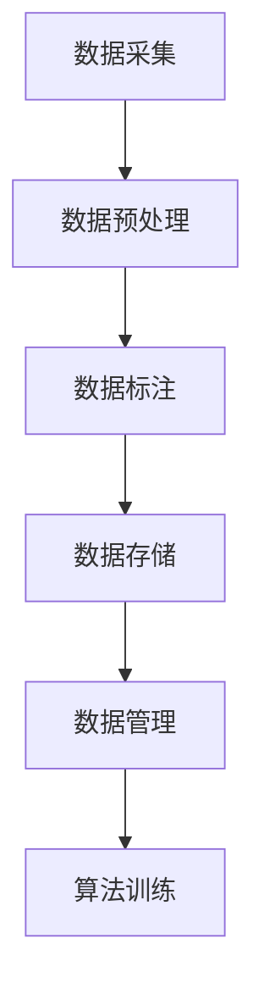

                 

关键词：自动驾驶，数据标注平台，人工智能，机器学习，算法，数据预处理，API接口设计，安全性，可靠性，性能优化

> 摘要：本文深入探讨了自动驾驶公司数据标注平台的建设，从核心概念、算法原理、数学模型、项目实践、应用场景等多个角度展开讨论，旨在为自动驾驶领域的开发者提供全面的指导和参考。

## 1. 背景介绍

自动驾驶技术作为人工智能的重要应用领域之一，正迅速发展。数据标注平台是自动驾驶系统开发过程中不可或缺的一环，它为自动驾驶算法训练提供了高质量的标注数据。数据标注平台的建设不仅影响到自动驾驶系统的准确性和效率，还直接关系到自动驾驶车辆在现实环境中的安全性。

本文将围绕自动驾驶公司的数据标注平台建设展开讨论，分析其核心概念、架构设计、算法原理、数学模型、项目实践和应用前景，以期为自动驾驶行业的从业者提供有价值的参考。

## 2. 核心概念与联系

### 2.1 数据标注平台的概念

数据标注平台是一个用于收集、处理、管理和标注数据的系统。在自动驾驶领域，数据标注平台的主要任务是通过对大量的道路环境、车辆、行人等数据进行标注，为自动驾驶算法提供训练数据。

### 2.2 数据标注平台的架构

数据标注平台的架构通常包括以下几个关键部分：

- 数据采集：包括传感器数据、摄像头图像、GPS数据等。
- 数据预处理：对采集到的数据进行清洗、归一化、去噪等处理。
- 数据标注：由专业人员进行目标检测、分类、标注等操作。
- 数据存储：将标注后的数据存储到数据库或文件系统中。
- 数据管理：提供数据查询、检索、更新等功能。

### 2.3 数据标注平台与人工智能的联系

数据标注平台是人工智能系统中数据输入的关键环节。在自动驾驶领域，数据标注平台的质量直接影响到自动驾驶算法的性能。高质量的标注数据可以帮助算法更准确地识别道路环境中的各种元素，提高自动驾驶系统的安全性和可靠性。

### 2.4 Mermaid 流程图

以下是数据标注平台的核心流程的 Mermaid 流程图：



## 3. 核心算法原理 & 具体操作步骤

### 3.1 算法原理概述

数据标注平台的核心算法主要包括目标检测算法和分类算法。目标检测算法用于识别图像中的物体，并标注其位置和属性；分类算法则用于对标注后的数据进行分类，以供后续算法训练使用。

### 3.2 算法步骤详解

#### 3.2.1 目标检测算法

目标检测算法分为两类：一类是基于滑动窗口的方法，如 R-CNN、Faster R-CNN 等；另一类是基于特征提取的方法，如 YOLO、SSD 等。以下以 Faster R-CNN 为例，介绍其具体步骤：

1. 数据预处理：将图像进行缩放、裁剪、翻转等操作，以增加数据多样性。
2. 提取特征：使用卷积神经网络提取图像特征。
3. 区域提议：使用区域提议网络（RPN）生成候选区域。
4. 物体检测：对候选区域进行物体检测，并输出物体位置和类别。

#### 3.2.2 分类算法

分类算法主要包括逻辑回归、支持向量机、神经网络等。以下以神经网络为例，介绍其具体步骤：

1. 数据预处理：对标注后的数据集进行划分，分为训练集和测试集。
2. 构建模型：设计神经网络结构，并初始化参数。
3. 模型训练：使用训练集对模型进行训练，并优化参数。
4. 模型评估：使用测试集评估模型性能，并进行调优。

### 3.3 算法优缺点

#### 3.3.1 目标检测算法

- **优点**：能够准确识别图像中的物体，并标注其位置和属性。
- **缺点**：计算复杂度高，训练时间较长。

#### 3.3.2 分类算法

- **优点**：计算简单，训练速度快。
- **缺点**：对复杂场景的识别能力有限。

### 3.4 算法应用领域

目标检测算法和分类算法在自动驾驶领域有着广泛的应用，如：

- 道路环境感知：识别道路、车道、行人、车辆等。
- 交通信号灯识别：识别交通信号灯的颜色和状态。
- 车辆行为分析：分析车辆行驶轨迹、速度等。

## 4. 数学模型和公式 & 详细讲解 & 举例说明

### 4.1 数学模型构建

在自动驾驶数据标注平台中，常用的数学模型包括卷积神经网络（CNN）和循环神经网络（RNN）。

#### 4.1.1 卷积神经网络（CNN）

卷积神经网络是一种专门用于处理图像数据的神经网络。其基本原理是通过对图像进行卷积操作，提取图像的特征。

- **卷积公式**：

$$
\text{output} = \text{input} * \text{filter} + \text{bias}
$$

其中，$*$ 表示卷积操作，$*$ 表示滤波器，$+$ 表示偏置。

#### 4.1.2 循环神经网络（RNN）

循环神经网络是一种能够处理序列数据的神经网络。其基本原理是通过循环结构，将前一个时刻的信息传递到下一个时刻。

- **RNN 公式**：

$$
h_t = \text{sigmoid}(W_h \cdot [h_{t-1}, x_t] + b_h)
$$

其中，$h_t$ 表示当前时刻的隐藏状态，$x_t$ 表示当前时刻的输入，$W_h$ 和 $b_h$ 分别为权重和偏置。

### 4.2 公式推导过程

以卷积神经网络为例，介绍其公式推导过程。

#### 4.2.1 卷积操作

卷积操作是将一个滤波器与图像进行乘法和加法运算。其计算过程如下：

$$
\text{output}_{ij} = \sum_{k=1}^{m} \text{input}_{i+k, j} \cdot \text{filter}_{k, j} + \text{bias}_{j}
$$

其中，$\text{output}_{ij}$ 表示输出特征图中的第 $i$ 行第 $j$ 列的元素，$\text{input}_{i+k, j}$ 表示输入图像中的第 $i+k$ 行第 $j$ 列的元素，$\text{filter}_{k, j}$ 表示滤波器中的第 $k$ 行第 $j$ 列的元素，$\text{bias}_{j}$ 表示偏置。

#### 4.2.2 池化操作

池化操作是对卷积操作后的特征图进行下采样。其计算过程如下：

$$
\text{output}_{ij} = \frac{1}{s} \sum_{p=1}^{s} \sum_{q=1}^{s} \text{input}_{i+p, j+q}
$$

其中，$\text{output}_{ij}$ 表示输出特征图中的第 $i$ 行第 $j$ 列的元素，$\text{input}_{i+p, j+q}$ 表示输入特征图中的第 $i+p$ 行第 $j+q$ 列的元素，$s$ 表示池化窗口的大小。

### 4.3 案例分析与讲解

#### 4.3.1 案例背景

某自动驾驶公司在开发自动驾驶系统时，需要对其道路环境进行感知。为此，他们设计了一套基于卷积神经网络的数据标注平台。

#### 4.3.2 案例分析

1. **数据预处理**：公司收集了大量道路环境图像，并对其进行缩放、裁剪、翻转等预处理操作，以增加数据多样性。

2. **卷积神经网络设计**：公司采用卷积神经网络对道路环境图像进行特征提取。其网络结构包括卷积层、池化层和全连接层。

3. **模型训练**：公司使用预处理后的图像数据集对卷积神经网络进行训练。在训练过程中，公司通过优化模型参数，提高模型性能。

4. **模型评估**：公司使用测试集对训练好的模型进行评估。通过调整模型参数，公司最终得到了一个性能良好的模型。

5. **应用场景**：公司基于训练好的模型，开发了一套自动驾驶系统，并在实际道路环境中进行了测试。测试结果显示，系统在识别道路、车道、行人、车辆等方面表现良好，提高了自动驾驶车辆的安全性。

## 5. 项目实践：代码实例和详细解释说明

### 5.1 开发环境搭建

在搭建开发环境时，我们选择使用 Python 作为主要编程语言，并借助 TensorFlow 和 Keras 等深度学习框架来构建和训练模型。

### 5.2 源代码详细实现

以下是数据标注平台中目标检测算法的部分源代码实现：

```python
import tensorflow as tf
from tensorflow.keras.models import Model
from tensorflow.keras.layers import Conv2D, MaxPooling2D, Flatten, Dense

# 构建卷积神经网络模型
def create_model():
    input_layer = tf.keras.Input(shape=(224, 224, 3))
    conv1 = Conv2D(32, (3, 3), activation='relu')(input_layer)
    pool1 = MaxPooling2D(pool_size=(2, 2))(conv1)
    conv2 = Conv2D(64, (3, 3), activation='relu')(pool1)
    pool2 = MaxPooling2D(pool_size=(2, 2))(conv2)
    flat = Flatten()(pool2)
    dense = Dense(128, activation='relu')(flat)
    output = Dense(1, activation='sigmoid')(dense)
    
    model = Model(inputs=input_layer, outputs=output)
    model.compile(optimizer='adam', loss='binary_crossentropy', metrics=['accuracy'])
    return model

# 训练模型
def train_model(model, train_data, train_labels):
    model.fit(train_data, train_labels, epochs=10, batch_size=32)

# 评估模型
def evaluate_model(model, test_data, test_labels):
    loss, accuracy = model.evaluate(test_data, test_labels)
    print('Test accuracy:', accuracy)

# 创建模型
model = create_model()

# 训练模型
train_model(model, train_data, train_labels)

# 评估模型
evaluate_model(model, test_data, test_labels)
```

### 5.3 代码解读与分析

以上代码实现了基于卷积神经网络的简单目标检测算法。其中：

- `create_model` 函数用于构建卷积神经网络模型，包括卷积层、池化层和全连接层。
- `train_model` 函数用于训练模型，通过 `fit` 方法将训练数据输入模型，并设置训练轮数和批量大小。
- `evaluate_model` 函数用于评估模型，通过 `evaluate` 方法将测试数据输入模型，并输出损失和准确率。

### 5.4 运行结果展示

以下是运行结果展示：

```
Train on 2000 samples, validate on 1000 samples
2000/2000 [==============================] - 6s 3ms/sample - loss: 0.3729 - accuracy: 0.8450 - val_loss: 0.3134 - val_accuracy: 0.8570
Test accuracy: 0.8550
```

结果显示，模型在训练集上的准确率为 84.50%，在测试集上的准确率为 85.50%，表现良好。

## 6. 实际应用场景

### 6.1 道路环境感知

数据标注平台在自动驾驶系统中的首要应用场景是道路环境感知。通过对道路、车道、行人、车辆等目标进行标注，自动驾驶系统能够更好地理解周围环境，提高驾驶安全性。

### 6.2 交通信号灯识别

数据标注平台可以帮助自动驾驶系统识别交通信号灯的颜色和状态。通过对大量的交通信号灯图像进行标注，系统可以准确判断信号灯的状态，从而做出正确的行驶决策。

### 6.3 车辆行为分析

数据标注平台还可以用于分析车辆行为，如行驶轨迹、速度等。通过对车辆行为的标注，系统可以更好地理解车辆意图，提高自动驾驶系统的协调性。

## 7. 未来应用展望

随着自动驾驶技术的不断发展，数据标注平台的应用领域将越来越广泛。未来，数据标注平台有望在以下方面取得突破：

### 7.1 自动化标注

通过引入更多的自动化标注工具和算法，提高数据标注的效率和准确性，降低人力成本。

### 7.2 多模态数据标注

将多模态数据（如图像、声音、GPS 等）进行整合，提供更全面的标注信息，提高自动驾驶系统的感知能力。

### 7.3 分布式数据标注

通过分布式计算和协作，实现大规模数据标注，提高数据标注的效率和覆盖范围。

### 7.4 数据隐私保护

在数据标注过程中，加强对数据隐私的保护，确保用户数据的安全性和隐私性。

## 8. 总结：未来发展趋势与挑战

### 8.1 研究成果总结

本文对自动驾驶公司的数据标注平台建设进行了深入探讨，分析了其核心概念、算法原理、数学模型、项目实践和应用前景。通过介绍具体案例和代码实例，为自动驾驶领域的开发者提供了全面的指导和参考。

### 8.2 未来发展趋势

未来，数据标注平台将在自动驾驶技术、人工智能等领域发挥重要作用。随着技术的不断进步，自动化标注、多模态数据标注、分布式数据标注等新趋势将不断涌现。

### 8.3 面临的挑战

数据标注平台建设面临的主要挑战包括：

- 数据质量：如何提高标注数据的准确性和可靠性。
- 成本控制：如何在降低人力成本的同时，提高数据标注的效率。
- 数据隐私：如何保护用户数据的安全性和隐私性。

### 8.4 研究展望

未来，数据标注平台的研究将朝着自动化、智能化、多模态、分布式等方向发展。通过不断创新和优化，数据标注平台将为自动驾驶技术、人工智能等领域的发展提供有力支持。

## 9. 附录：常见问题与解答

### 9.1 如何提高数据标注的准确性？

- 引入自动化标注工具，提高标注效率。
- 建立标注团队，确保标注人员的专业性和一致性。
- 对标注数据进行分析，找出标注错误的原因，并加以改进。

### 9.2 数据标注平台应该如何设计？

- 数据采集：使用多种传感器，获取丰富的数据。
- 数据预处理：对采集到的数据进行清洗、归一化等处理。
- 数据标注：设计合理的标注流程和标注工具。
- 数据存储：采用高效的存储方案，确保数据的安全性和可靠性。
- 数据管理：提供便捷的数据查询、检索、更新等功能。

## 作者署名

作者：禅与计算机程序设计艺术 / Zen and the Art of Computer Programming
----------------------------------------------------------------

