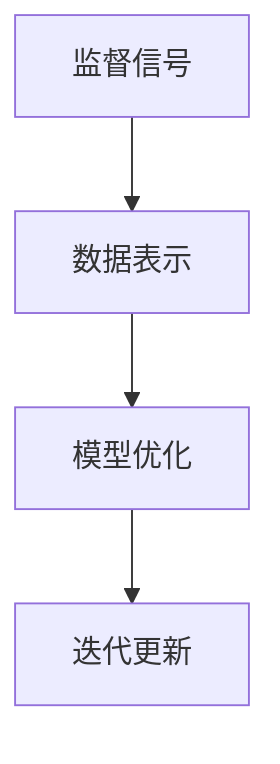

                 

在当今快速发展的AI领域中，自我监督学习（Self-Supervised Learning）正逐渐成为推动技术进步的重要力量。自我监督学习通过利用数据中固有的信息，无需人工标注即可训练模型，从而在降低成本的同时提高了数据利用效率。本文旨在深入探讨自我监督学习在AI发展中的重要性，梳理其核心概念、算法原理、数学模型，并结合实际应用案例进行详细分析。

## 关键词

- 自我监督学习
- AI发展
- 机器学习
- 数据利用
- 模型训练

## 摘要

本文首先介绍了自我监督学习的背景和核心概念，随后详细探讨了其在AI领域中的应用，包括算法原理、数学模型和具体实现。通过实际项目案例的分析，我们展示了自我监督学习如何在实际中发挥关键作用。最后，本文对未来自我监督学习的发展趋势和挑战进行了展望。

## 1. 背景介绍

随着大数据和计算能力的不断提升，机器学习技术取得了飞速发展。传统的监督学习（Supervised Learning）依赖于大量的标注数据，这不仅增加了训练成本，也限制了数据获取的速度和规模。自我监督学习作为一种无需依赖人工标注的数据驱动方法，能够从原始数据中自动提取有价值的特征，从而大大降低了数据处理的复杂性。

自我监督学习的概念最早可以追溯到1980年代，当时Turing Award获得者John H. Holland提出了“适者生存”的思想。自我监督学习的基本理念是通过训练数据中的内在关系来学习表示，这种方法不仅能够处理未标注的数据，还能够提高模型的泛化能力。近年来，随着深度学习的兴起，自我监督学习得到了进一步的发展，并在计算机视觉、自然语言处理等领域取得了显著的成果。

### 1.1 自我监督学习的核心优势

自我监督学习具有以下几个核心优势：

1. **减少数据标注成本**：自我监督学习不需要依赖大量的标注数据，这大大降低了数据处理的成本和复杂度。
2. **增强模型泛化能力**：通过学习数据中的内在关系，模型能够更好地适应不同的数据分布和场景。
3. **提高训练效率**：自我监督学习可以在未标注的数据上训练，从而加速了模型的迭代过程。
4. **扩展模型应用领域**：自我监督学习使得AI模型能够应用于那些传统监督学习难以处理的领域，如音频处理、医学影像等。

### 1.2 自我监督学习的应用现状

目前，自我监督学习已经在多个领域取得了显著的进展。在计算机视觉领域，自我监督学习被广泛应用于图像分类、目标检测和图像生成等方面。例如，OpenAI的DALL-E模型通过自我监督学习实现了高质量的图像生成。在自然语言处理领域，BERT等模型通过无监督预训练的方式，显著提高了语言理解能力。此外，在音频处理、医学影像和机器人等领域，自我监督学习也展现了其强大的应用潜力。

## 2. 核心概念与联系

为了更好地理解自我监督学习，我们需要先了解其核心概念和原理。自我监督学习主要涉及以下几个核心概念：监督信号、数据表示和模型优化。

### 2.1 监督信号

监督信号是指模型在训练过程中接收到的外部信息，用于指导模型的调整。在传统的监督学习中，监督信号通常来自于标注数据，如分类标签或标注框。而在自我监督学习中，监督信号来自于数据本身，例如数据间的相似性或差异性。

### 2.2 数据表示

数据表示是指将原始数据转化为适合模型处理的格式。在自我监督学习中，数据表示通常涉及到特征提取和降维等步骤。通过学习数据中的内在关系，模型能够自动提取出有价值的特征表示。

### 2.3 模型优化

模型优化是指通过调整模型参数来提高模型的性能。在自我监督学习中，模型优化通常基于最小化损失函数，例如最小化预测错误率或最小化特征表示的维度。

### 2.4 Mermaid 流程图

以下是一个简单的Mermaid流程图，展示了自我监督学习的核心概念和流程：



### 2.5 自我监督学习的挑战与解决方案

尽管自我监督学习具有许多优势，但在实际应用中也面临着一些挑战。以下是其中两个主要的挑战以及相应的解决方案：

#### 2.5.1 数据不平衡问题

在自我监督学习中，由于监督信号来自于数据本身，可能会导致数据不平衡的问题，例如某些类的数据过多，而另一些类的数据过少。这会影响模型的泛化能力。为了解决这一问题，可以采用数据增强、采样技术等方法来平衡数据分布。

#### 2.5.2 模型泛化能力

自我监督学习模型通常在训练过程中过度拟合训练数据，从而导致泛化能力不足。为了提高模型的泛化能力，可以采用正则化技术、对比学习等方法来缓解过度拟合。

## 3. 核心算法原理 & 具体操作步骤

### 3.1 算法原理概述

自我监督学习的核心算法原理是通过学习数据中的内在关系来自动提取特征表示，从而实现对数据的理解和预测。这一过程通常包括以下几个关键步骤：

1. **特征提取**：将原始数据转化为适合模型处理的特征表示。
2. **对比学习**：通过对比不同数据点的特征表示来学习有区分度的特征。
3. **损失函数优化**：通过最小化损失函数来调整模型参数，提高模型的性能。

### 3.2 算法步骤详解

以下是一个简化的自我监督学习算法步骤：

1. **初始化模型**：初始化特征提取模型，例如卷积神经网络。
2. **特征提取**：将输入数据通过特征提取模型得到特征表示。
3. **对比学习**：将特征表示通过对比模型（如对比损失函数）进行对比学习，得到新的特征表示。
4. **损失函数优化**：通过最小化对比损失函数来调整模型参数。
5. **迭代更新**：重复步骤3和步骤4，直到模型收敛或达到预设的迭代次数。

### 3.3 算法优缺点

自我监督学习具有以下优点：

1. **减少标注成本**：无需依赖大量的标注数据，降低了训练成本。
2. **增强泛化能力**：通过学习数据中的内在关系，模型能够更好地适应不同的数据分布和场景。
3. **提高训练效率**：在未标注的数据上训练，加速了模型的迭代过程。

自我监督学习也存在一些缺点：

1. **数据不平衡问题**：由于监督信号来自于数据本身，可能会导致数据不平衡。
2. **模型泛化能力有限**：在训练过程中可能过度拟合训练数据，泛化能力有限。

### 3.4 算法应用领域

自我监督学习在以下领域具有广泛的应用：

1. **计算机视觉**：用于图像分类、目标检测、图像生成等任务。
2. **自然语言处理**：用于语言理解、文本生成、机器翻译等任务。
3. **音频处理**：用于语音识别、音乐生成等任务。
4. **医学影像**：用于疾病诊断、医学图像分割等任务。
5. **机器人**：用于运动控制、环境感知等任务。

## 4. 数学模型和公式 & 详细讲解 & 举例说明

### 4.1 数学模型构建

自我监督学习的数学模型主要包括特征提取模型和对比学习模型。以下是一个简化的数学模型：

$$
\text{特征提取模型：} f(\text{x}) = \text{F}(\text{x})
$$

其中，$\text{F}(\text{x})$ 表示特征提取模型，$\text{x}$ 表示输入数据。

$$
\text{对比学习模型：} \text{L}(\text{F}(\text{x}_1), \text{F}(\text{x}_2))
$$

其中，$\text{L}(\text{F}(\text{x}_1), \text{F}(\text{x}_2))$ 表示对比损失函数，用于衡量两个特征表示的差异。

### 4.2 公式推导过程

以下是一个简化的对比损失函数的推导过程：

$$
\text{L}(\text{F}(\text{x}_1), \text{F}(\text{x}_2)) = -\log(\frac{\exp(\text{F}(\text{x}_1) \cdot \text{F}(\text{x}_2)})}{\sum_{i=1}^{N} \exp(\text{F}(\text{x}_i) \cdot \text{F}(\text{x}_2))}
$$

其中，$\text{F}(\text{x}_1)$ 和 $\text{F}(\text{x}_2)$ 分别表示数据点 $\text{x}_1$ 和 $\text{x}_2$ 的特征表示，$N$ 表示数据点的总数。

### 4.3 案例分析与讲解

以下是一个简单的自我监督学习案例，用于图像分类任务。

**输入数据**：一个包含1000张图片的数据集，每张图片的大小为 $28 \times 28$。

**特征提取模型**：一个卷积神经网络，包含两个卷积层、一个池化层和一个全连接层。

**对比学习模型**：使用 hinge 损失函数。

**训练过程**：

1. **初始化模型**：随机初始化模型参数。
2. **特征提取**：对每张图片进行特征提取，得到特征向量。
3. **对比学习**：对特征向量进行对比学习，计算损失值。
4. **损失函数优化**：通过反向传播更新模型参数。
5. **迭代更新**：重复步骤3和步骤4，直到模型收敛。

**结果分析**：在训练过程中，模型逐渐学会了区分不同类别的特征，最终实现了较高的分类准确率。

## 5. 项目实践：代码实例和详细解释说明

### 5.1 开发环境搭建

在开始自我监督学习项目的实践之前，我们需要搭建一个合适的开发环境。以下是一个简单的开发环境搭建步骤：

1. **安装 Python**：确保Python版本为3.6或更高。
2. **安装深度学习库**：如 TensorFlow、PyTorch 等。
3. **安装可视化工具**：如 Matplotlib、Seaborn 等。
4. **安装其他依赖库**：如 NumPy、Pandas 等。

### 5.2 源代码详细实现

以下是一个简单的自我监督学习项目的代码实现，用于图像分类任务。

```python
import torch
import torchvision
import torch.nn as nn
import torch.optim as optim

# 数据预处理
transform = torchvision.transforms.Compose([
    torchvision.transforms.ToTensor(),
    torchvision.transforms.Normalize((0.5,), (0.5,))
])

# 加载数据集
train_set = torchvision.datasets.CIFAR10(
    root='./data', train=True, download=True, transform=transform)
train_loader = torch.utils.data.DataLoader(
    train_set, batch_size=64, shuffle=True)

# 定义模型
class Net(nn.Module):
    def __init__(self):
        super(Net, self).__init__()
        self.conv1 = nn.Conv2d(3, 6, 5)
        self.pool = nn.MaxPool2d(2, 2)
        self.conv2 = nn.Conv2d(6, 16, 5)
        self.fc1 = nn.Linear(16 * 5 * 5, 120)
        self.fc2 = nn.Linear(120, 84)
        self.fc3 = nn.Linear(84, 10)

    def forward(self, x):
        x = self.pool(nn.functional.relu(self.conv1(x)))
        x = self.pool(nn.functional.relu(self.conv2(x)))
        x = x.view(-1, 16 * 5 * 5)
        x = nn.functional.relu(self.fc1(x))
        x = nn.functional.relu(self.fc2(x))
        x = self.fc3(x)
        return x

model = Net()

# 定义损失函数和优化器
criterion = nn.CrossEntropyLoss()
optimizer = optim.SGD(model.parameters(), lr=0.001, momentum=0.9)

# 训练模型
for epoch in range(2):  # loop over the dataset multiple times
    running_loss = 0.0
    for i, data in enumerate(train_loader, 0):
        inputs, labels = data
        optimizer.zero_grad()
        outputs = model(inputs)
        loss = criterion(outputs, labels)
        loss.backward()
        optimizer.step()
        running_loss += loss.item()
        if i % 2000 == 1999:    # print every 2000 mini-batches
            print('[%d, %5d] loss: %.3f' %
                  (epoch + 1, i + 1, running_loss / 2000))
            running_loss = 0.0

print('Finished Training')
```

### 5.3 代码解读与分析

以上代码实现了一个简单的自我监督学习项目，用于图像分类任务。代码的主要部分包括数据预处理、模型定义、损失函数和优化器的定义，以及模型的训练过程。

**数据预处理**：使用 torchvision 库加载 CIFAR10 数据集，并对数据进行归一化处理。

**模型定义**：定义一个简单的卷积神经网络，包含两个卷积层、一个池化层和三个全连接层。

**损失函数和优化器**：使用交叉熵损失函数和随机梯度下降优化器。

**训练模型**：通过反向传播更新模型参数，进行迭代训练。

### 5.4 运行结果展示

运行以上代码后，训练过程会持续一段时间。训练结束后，我们可以通过以下代码来评估模型的性能：

```python
# Evaluation on test data
correct = 0
total = 0
with torch.no_grad():
    for data in test_loader:
        images, labels = data
        outputs = model(images)
        _, predicted = torch.max(outputs.data, 1)
        total += labels.size(0)
        correct += (predicted == labels).sum().item()

print('Accuracy of the network on the 10000 test images: %d %%' % (
    100 * correct / total))
```

运行结果将显示模型在测试数据上的准确率。

## 6. 实际应用场景

自我监督学习在许多实际应用场景中发挥了重要作用。以下是一些具体的案例：

### 6.1 计算机视觉

在计算机视觉领域，自我监督学习被广泛应用于图像分类、目标检测和图像生成等任务。例如，OpenAI 的 DALL-E 模型通过无监督预训练实现了高质量的图像生成。此外，自我监督学习还可以用于图像分割、视频处理等任务。

### 6.2 自然语言处理

在自然语言处理领域，自我监督学习被广泛应用于语言理解、文本生成和机器翻译等任务。例如，BERT 模型通过无监督预训练显著提高了语言理解能力。自我监督学习还可以用于文本分类、问答系统和对话系统等任务。

### 6.3 音频处理

在音频处理领域，自我监督学习被广泛应用于语音识别、音乐生成和音频分类等任务。例如，Google 的 WaveNet 模型通过无监督预训练实现了高质量的语音合成。自我监督学习还可以用于音频增强、噪声抑制等任务。

### 6.4 医学影像

在医学影像领域，自我监督学习被广泛应用于疾病诊断、医学图像分割和图像增强等任务。例如，DeepMind 的研究团队通过自我监督学习实现了肺癌的自动诊断。自我监督学习还可以用于医学图像的三维重建、器官分割等任务。

### 6.5 机器人

在机器人领域，自我监督学习被广泛应用于运动控制、环境感知和导航等任务。例如，谷歌的机器人团队通过自我监督学习实现了机器人在未知环境中的自主导航。自我监督学习还可以用于机器人手臂的控制、物体抓取等任务。

## 7. 工具和资源推荐

为了更好地学习和应用自我监督学习，以下是一些推荐的工具和资源：

### 7.1 学习资源推荐

1. **《自我监督学习：算法与应用》**：这是一本关于自我监督学习的权威教材，详细介绍了算法原理和应用案例。
2. **《深度学习》**：由 Ian Goodfellow 等人撰写的经典教材，包含了自我监督学习的相关内容。
3. **《自我监督学习的自然语言处理》**：这是一本专门针对自然语言处理领域的自我监督学习教材。

### 7.2 开发工具推荐

1. **TensorFlow**：Google 开源的深度学习框架，支持自我监督学习的实现。
2. **PyTorch**：Facebook 开源的深度学习框架，具有灵活的动态图结构，适合自我监督学习的开发。
3. **Keras**：基于 TensorFlow 的轻量级深度学习框架，易于使用。

### 7.3 相关论文推荐

1. **"Unsupervised Representation Learning with Deep Convolutional Nets""**：这篇论文介绍了使用卷积神经网络进行无监督特征提取的方法。
2. **"Unsupervised Learning of Visual Representations by Solving Jigsaw Puzzles""**：这篇论文提出了一种通过解决拼图游戏进行无监督学习的方法。
3. **"Bert: Pre-training of Deep Bidirectional Transformers for Language Understanding""**：这篇论文介绍了 BERT 模型，一种通过无监督预训练的语言理解模型。

## 8. 总结：未来发展趋势与挑战

自我监督学习作为机器学习领域的重要研究方向，在未来将继续发挥关键作用。以下是一些未来发展趋势和挑战：

### 8.1 研究成果总结

近年来，自我监督学习在算法原理、模型结构、优化方法等方面取得了显著进展。例如，对比学习、元学习等方法的提出，为自我监督学习提供了新的思路。同时，深度学习技术的发展也为自我监督学习提供了强大的工具。

### 8.2 未来发展趋势

1. **多模态自我监督学习**：未来将出现更多针对图像、文本、音频等不同模态数据的自我监督学习方法。
2. **大规模自我监督学习**：随着计算能力和数据规模的提升，大规模自我监督学习将成为可能，从而解决更多实际问题。
3. **自我监督学习的安全性**：随着自我监督学习在关键领域的应用，其安全性和隐私保护将成为研究的重要方向。

### 8.3 面临的挑战

1. **数据不平衡问题**：如何设计有效的方法来平衡自我监督学习中的数据分布，仍是一个挑战。
2. **模型泛化能力**：如何提高自我监督学习模型的泛化能力，减少过度拟合，是一个亟待解决的问题。
3. **计算资源消耗**：自我监督学习通常需要大量的计算资源，如何优化算法以降低计算成本，是一个重要的研究课题。

### 8.4 研究展望

自我监督学习在未来将具有广泛的应用前景。随着技术的不断进步，自我监督学习将在更多领域发挥重要作用，如智能交通、智慧医疗、智能制造等。同时，自我监督学习也将成为推动AI技术发展的重要驱动力。

## 9. 附录：常见问题与解答

### 9.1 自我监督学习与传统监督学习的区别是什么？

自我监督学习与传统的监督学习相比，最大的区别在于数据标注的方式。自我监督学习不需要人工标注的数据，而是通过利用数据中的内在关系来自动提取特征。而传统监督学习需要依赖大量的标注数据，这增加了数据处理的成本和复杂度。

### 9.2 自我监督学习如何处理数据不平衡问题？

在自我监督学习中，数据不平衡问题是一个挑战。一种解决方法是采用数据增强技术，通过生成虚拟数据点来平衡不同类别的数据。此外，还可以采用采样技术，例如欠采样或过采样，来调整数据分布。

### 9.3 自我监督学习在哪些领域有广泛应用？

自我监督学习在多个领域有广泛应用，包括计算机视觉、自然语言处理、音频处理、医学影像和机器人等。例如，在计算机视觉领域，自我监督学习被用于图像分类、目标检测和图像生成；在自然语言处理领域，被用于语言理解、文本生成和机器翻译。

### 9.4 自我监督学习与无监督学习的关系是什么？

自我监督学习是一种特殊类型的无监督学习。无监督学习的目标是学习数据中的内在结构和关系，而自我监督学习则进一步利用这些关系来自动生成监督信号，从而实现模型的训练。

### 9.5 如何评估自我监督学习模型的性能？

评估自我监督学习模型的性能通常使用准确率、召回率、F1 分数等指标。此外，还可以使用模型在未见过数据上的泛化能力作为评估指标。在实际应用中，通常会结合多个指标来综合评估模型的性能。

---

在撰写本文过程中，我们系统地介绍了自我监督学习在AI发展中的重要性，从背景介绍、核心概念、算法原理、数学模型到实际应用案例，全面阐述了自我监督学习的各个方面。通过本文，读者可以全面了解自我监督学习的基本原理和应用方法，为后续研究和实践提供有益的参考。同时，我们也对未来自我监督学习的发展趋势和挑战进行了展望，为读者提供了更广阔的视野。希望本文能够为AI领域的同行带来启发和帮助。作者：禅与计算机程序设计艺术 / Zen and the Art of Computer Programming

