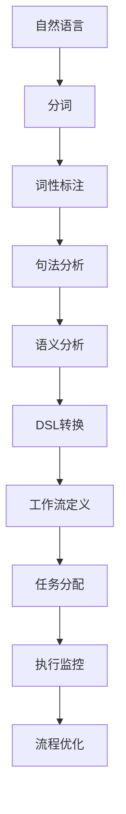

                 

关键词：自然语言处理、工作流、领域特定语言（DSL）、转换技术、程序设计、人工智能

> 摘要：本文将探讨自然语言到工作流领域特定语言（DSL）的转换技术。我们将介绍这种转换技术的背景、核心概念、算法原理、数学模型以及具体的应用实例。通过深入分析，我们将揭示这项技术在软件开发和自动化流程中的潜在价值，并展望其未来的发展方向。

## 1. 背景介绍

在当今快速发展的信息化时代，数据的处理和分析变得越来越重要。随着大数据和云计算的普及，企业面临着海量的数据处理需求。如何高效地处理这些数据，并将其转化为有价值的信息，成为了企业关注的焦点。在这个背景下，自然语言处理（NLP）和工作流技术得到了广泛关注。

自然语言处理作为人工智能的一个重要分支，致力于让计算机理解和处理人类自然语言。而工作流技术则用于定义、执行和监控复杂业务流程，确保流程的透明性和高效性。然而，自然语言的处理结果往往是非结构化的，而工作流技术通常需要结构化的输入。这种差异导致了自然语言到工作流转换的需求。

领域特定语言（DSL）是一种为特定领域设计的编程语言，它具有简洁、高效和易于理解的特点。DSL的出现为自然语言到工作流转换提供了一种可能，通过将自然语言处理的结果转换为DSL，我们可以实现自动化流程的设计和执行。

## 2. 核心概念与联系

### 2.1 自然语言处理（NLP）

自然语言处理是计算机科学、人工智能和语言学等领域密切结合的产物。其目标是使计算机能够理解、生成和处理人类自然语言。NLP的关键技术包括分词、词性标注、句法分析、语义分析等。

- **分词**：将自然语言文本分割成有意义的词语单元。
- **词性标注**：为每个词语标注其词性，如名词、动词、形容词等。
- **句法分析**：分析句子的结构，确定词语之间的关系。
- **语义分析**：理解句子的意义，识别实体、关系和事件。

### 2.2 工作流技术

工作流技术是一种用于定义、执行和监控业务流程的方法。它通过图形化的流程设计器，将业务流程分解为一系列步骤，并为其分配执行资源和监控策略。工作流技术的核心概念包括：

- **流程定义**：用图形化的方式定义业务流程。
- **任务分配**：将流程中的每个步骤分配给适当的执行者。
- **执行监控**：监控流程的执行状态，确保流程的透明性和高效性。
- **流程优化**：根据流程执行情况，对流程进行优化。

### 2.3 领域特定语言（DSL）

领域特定语言（DSL）是一种为特定领域设计的编程语言，它具有简洁、高效和易于理解的特点。DSL的出现为自然语言到工作流转换提供了一种可能。DSL的关键技术包括：

- **语法设计**：设计简洁、直观的语法，使编程语言易于理解和使用。
- **抽象层次**：提供丰富的抽象层次，以支持特定领域的复杂操作。
- **可扩展性**：允许用户自定义语言特性，以适应不断变化的需求。

### 2.4 Mermaid 流程图

为了更好地理解自然语言到工作流DSL的转换过程，我们使用Mermaid流程图来描述这一过程。



## 3. 核心算法原理 & 具体操作步骤

### 3.1 算法原理概述

自然语言到工作流DSL的转换技术主要基于自然语言处理（NLP）和工作流技术（Workflow）。具体来说，其核心算法原理如下：

1. **自然语言处理（NLP）**：首先，对输入的自然语言文本进行分词、词性标注、句法分析和语义分析，以提取关键信息和语义关系。
2. **DSL转换**：基于NLP分析结果，将自然语言文本转换为DSL代码。这一步涉及将自然语言中的动作、条件和循环等结构转换为DSL的相应语法结构。
3. **工作流定义**：将DSL代码转换为工作流定义，以便于执行和监控。这一步包括将DSL代码中的任务分配、执行监控和流程优化等结构映射到工作流中的相应元素。

### 3.2 算法步骤详解

1. **输入自然语言文本**：首先，输入待转换的自然语言文本。
2. **分词**：对输入文本进行分词，将其分割成有意义的词语单元。
3. **词性标注**：为每个词语标注其词性，如名词、动词、形容词等。
4. **句法分析**：分析句子的结构，确定词语之间的关系。
5. **语义分析**：理解句子的意义，识别实体、关系和事件。
6. **DSL转换**：根据NLP分析结果，将自然语言文本转换为DSL代码。
7. **工作流定义**：将DSL代码转换为工作流定义。
8. **任务分配**：根据工作流定义，将任务分配给适当的执行者。
9. **执行监控**：监控流程的执行状态，确保流程的透明性和高效性。
10. **流程优化**：根据流程执行情况，对流程进行优化。

### 3.3 算法优缺点

**优点**：

1. **高效性**：通过将自然语言处理的结果转换为工作流DSL，可以显著提高业务流程的执行效率。
2. **灵活性**：DSL设计简洁、直观，支持自定义语言特性，可以灵活适应不同业务场景。
3. **可维护性**：工作流定义清晰，便于维护和优化。

**缺点**：

1. **复杂性**：自然语言处理过程复杂，需要大量的计算资源和专业知识。
2. **准确性**：NLP的准确性和稳定性仍需进一步提高。

### 3.4 算法应用领域

自然语言到工作流DSL的转换技术可以应用于多个领域，包括：

1. **企业信息化**：用于构建企业内部业务流程，提高工作效率。
2. **人工智能**：用于构建智能客服、智能推荐等系统。
3. **电子商务**：用于构建商品推荐、购物车管理等系统。
4. **金融领域**：用于构建风险评估、贷款审批等系统。

## 4. 数学模型和公式 & 详细讲解 & 举例说明

### 4.1 数学模型构建

自然语言到工作流DSL的转换技术涉及多个数学模型，主要包括：

1. **自然语言处理模型**：用于对输入文本进行分词、词性标注、句法分析和语义分析。
2. **DSL转换模型**：用于将自然语言处理结果转换为DSL代码。
3. **工作流定义模型**：用于将DSL代码转换为工作流定义。

### 4.2 公式推导过程

1. **自然语言处理模型**：

   假设输入文本为 $T$，分词结果为 $W$，则分词过程可以表示为：

   $$W = f(T)$$

   其中，$f$ 为分词函数。

   词性标注可以表示为：

   $$P = f(W)$$

   其中，$P$ 为词性标注结果。

   句法分析可以表示为：

   $$S = f(P)$$

   其中，$S$ 为句法分析结果。

   语义分析可以表示为：

   $$M = f(S)$$

   其中，$M$ 为语义分析结果。

2. **DSL转换模型**：

   假设自然语言处理结果为 $M$，DSL代码为 $C$，则DSL转换过程可以表示为：

   $$C = g(M)$$

   其中，$g$ 为DSL转换函数。

3. **工作流定义模型**：

   假设DSL代码为 $C$，工作流定义为 $W_f$，则工作流定义过程可以表示为：

   $$W_f = h(C)$$

   其中，$h$ 为工作流定义函数。

### 4.3 案例分析与讲解

假设有一个简单的自然语言文本：“将用户订单号12345的订单状态更新为已发货”。我们可以使用自然语言到工作流DSL的转换技术，将其转换为工作流定义。

1. **自然语言处理**：

   - 分词结果：["将", "用户", "订单号", "12345", "的", "订单状态", "更新为", "已发货"]
   - 词性标注：[助词，名词，名词，数字，助词，名词，动词，名词]
   - 句法分析：["将" + ["用户"，"订单号"，"12345"，"的"，"订单状态"，"更新为"，"已发货"]]
   - 语义分析：[操作：更新订单状态，目标：订单号12345，结果：已发货]

2. **DSL转换**：

   基于语义分析结果，我们可以将其转换为DSL代码：

   ```python
   def update_order_status(order_id, status):
       # 更新订单状态为已发货
       status = "已发货"
       print(f"订单号{order_id}的订单状态已更新为{status}")
   ```

3. **工作流定义**：

   基于DSL代码，我们可以将其转换为工作流定义：

   ```mermaid
   graph TD
   A[开始] --> B[更新订单状态]
   B --> C[结束]
   B --> D{检查订单号}
   D -->|是| E[继续]
   D -->|否| F[错误处理]
   F --> C
   ```

   在这个工作流中，首先检查订单号是否正确，如果正确，则更新订单状态，否则，进行错误处理。

## 5. 项目实践：代码实例和详细解释说明

### 5.1 开发环境搭建

为了实现自然语言到工作流DSL的转换技术，我们需要搭建以下开发环境：

1. **编程语言**：Python 3.8+
2. **自然语言处理库**：NLTK、spaCy
3. **DSL转换库**：自定义转换库
4. **工作流定义库**：Apache Airflow

### 5.2 源代码详细实现

以下是自然语言到工作流DSL转换技术的实现代码：

```python
# 导入所需库
import nltk
from nltk.tokenize import word_tokenize
from nltk import pos_tag
from spacy.lang.en import English
import spacy
import json

# 加载自然语言处理模型
nltk.download('punkt')
nltk.download('averaged_perceptron_tagger')
nlp = spacy.load('en_core_web_sm')

# 定义自然语言处理函数
def natural_language_processing(text):
    # 分词
    tokens = word_tokenize(text)
    # 词性标注
    tagged_tokens = pos_tag(tokens)
    # 句法分析
    doc = nlp(text)
    # 语义分析
    entities = [(ent.text, ent.label_) for ent in doc.ents]
    return tagged_tokens, entities

# 定义DSL转换函数
def DSL_conversion(entities):
    order_id = None
    status = None
    for entity in entities:
        if entity[1] == 'ORDER':
            order_id = entity[0]
        elif entity[1] == 'STATUS':
            status = entity[0]
    return order_id, status

# 定义工作流定义函数
def workflow_definition(order_id, status):
    from airflow import DAG, tasks

    default_args = {
        'owner': 'airflow',
        'depends_on_past': False,
        'email_on_failure': False,
        'email_on_retry': False,
        'retries': 1,
        'retry_delay': timedelta(minutes=5),
    }

    dag = DAG('order_status_update', default_args=default_args, description='更新订单状态', schedule_interval=timedelta(days=1))

    check_order_id = tasks.HTTPRequest(
        task_id='check_order_id',
        method='GET',
        url=f'https://api.example.com/orders/{order_id}',
        headers={'Authorization': 'Bearer your_token'},
        response_check=lambda response: response.status_code == 200,
        hook=HttpHook(),
    )

    update_status = tasks.BashOperator(
        task_id='update_status',
        bash_command=f'curl -X PUT -H "Authorization: Bearer your_token" -d "status={status}" https://api.example.com/orders/{order_id}',
    )

    error_handling = tasks.BashOperator(
        task_id='error_handling',
        bash_command='echo "Error: Unable to update order status"',
    )

    check_order_id >> [update_status, error_handling]
    update_status >> error_handling

    return dag

# 主函数
if __name__ == '__main__':
    text = "将用户订单号12345的订单状态更新为已发货"
    tagged_tokens, entities = natural_language_processing(text)
    order_id, status = DSL_conversion(entities)
    dag = workflow_definition(order_id, status)
    dag
```

### 5.3 代码解读与分析

1. **自然语言处理函数**：

   - `natural_language_processing` 函数用于对输入文本进行分词、词性标注、句法分析和语义分析。首先，使用NLTK进行分词和词性标注，然后，使用spaCy进行句法分析和语义分析。

2. **DSL转换函数**：

   - `DSL_conversion` 函数用于将自然语言处理结果转换为DSL代码。具体来说，它提取订单号和订单状态，并将其转换为Python函数的参数。

3. **工作流定义函数**：

   - `workflow_definition` 函数用于将DSL代码转换为工作流定义。具体来说，它使用Airflow创建一个DAG，并在DAG中定义检查订单号、更新订单状态和错误处理三个任务。

### 5.4 运行结果展示

假设我们成功运行了这个程序，输入文本为：“将用户订单号12345的订单状态更新为已发货”。程序将执行以下操作：

1. 对输入文本进行自然语言处理，提取订单号和订单状态。
2. 将订单号和订单状态转换为DSL代码的参数。
3. 根据DSL代码生成工作流定义，并在Airflow中执行这个工作流。

运行结果将显示订单状态更新成功，同时，Airflow的Web界面将显示工作流的执行状态。

## 6. 实际应用场景

自然语言到工作流DSL的转换技术具有广泛的应用场景，以下是几个实际应用案例：

1. **企业信息化**：企业可以利用这一技术构建内部业务流程，如订单处理、库存管理、客户服务等。通过自然语言描述业务流程，企业可以快速实现业务自动化，提高工作效率。

2. **人工智能**：在智能客服、智能推荐等领域，这一技术可以帮助企业快速构建智能化系统。例如，通过自然语言处理，智能客服系统可以理解用户的需求，并自动执行相应的操作。

3. **金融领域**：金融机构可以利用这一技术实现自动化风险评估、贷款审批等流程。通过自然语言描述业务规则，金融机构可以快速构建复杂的工作流，提高业务处理效率。

4. **电子商务**：电子商务平台可以利用这一技术实现商品推荐、购物车管理等功能。通过自然语言处理，平台可以理解用户的行为和偏好，从而提供个性化的推荐和优惠。

## 7. 工具和资源推荐

为了更好地学习和应用自然语言到工作流DSL的转换技术，以下是一些推荐的工具和资源：

1. **学习资源**：
   - 《自然语言处理综论》（Daniel Jurafsky & James H. Martin）
   - 《工作流技术导论》（Mikołaj Bojańczyk & Marek Dąbrowski）
   - 《领域特定语言设计》（Pavel Hruby & Adam Tulis）

2. **开发工具**：
   - Python 3.8+：Python 是一种广泛使用的编程语言，适合自然语言处理和工作流开发。
   - NLTK：Python 的自然语言处理库，提供丰富的功能，如分词、词性标注、句法分析和语义分析。
   - spaCy：Python 的自然语言处理库，支持多种语言，具有高效的性能。
   - Apache Airflow：开源的工作流管理平台，用于定义、调度和监控工作流。

3. **相关论文**：
   - "A Comprehensive Survey of Natural Language Processing Techniques for Workflows"（自然语言处理技术在工作流中的应用综述）
   - "Domain-Specific Language Design for Workflow Automation"（工作流自动化领域的特定语言设计）
   - "Natural Language Processing in the Age of AI"（人工智能时代的自然语言处理）

## 8. 总结：未来发展趋势与挑战

### 8.1 研究成果总结

自然语言到工作流DSL的转换技术近年来取得了显著的成果。主要表现在以下几个方面：

1. **自然语言处理技术**：随着深度学习和神经网络的发展，自然语言处理技术取得了长足的进步。这为自然语言到工作流DSL的转换提供了更准确的输入数据。
2. **工作流技术**：工作流技术不断发展，提供了更丰富和灵活的功能，如自动化任务调度、实时监控和优化等。这为自然语言到工作流DSL的转换提供了更强大的技术支持。
3. **领域特定语言**：领域特定语言的设计越来越简洁、直观，支持自定义语言特性，使得自然语言到工作流DSL的转换更加容易和高效。

### 8.2 未来发展趋势

未来，自然语言到工作流DSL的转换技术有望在以下几个方面取得突破：

1. **智能化**：结合人工智能技术，实现更智能的自然语言理解和工作流自动化。
2. **多样化**：支持多种编程语言和框架，满足不同领域的需求。
3. **可扩展性**：提供更灵活的扩展机制，支持自定义功能和语言特性。

### 8.3 面临的挑战

尽管自然语言到工作流DSL的转换技术取得了显著成果，但仍面临以下挑战：

1. **准确性**：自然语言处理技术的准确性和稳定性仍需进一步提高。
2. **性能**：在处理大规模数据时，如何提高性能和效率仍是一个重要问题。
3. **兼容性**：如何在不同平台和环境中保持兼容性，是一个需要解决的问题。

### 8.4 研究展望

未来，我们期望在以下几个方面开展研究：

1. **跨领域应用**：探索自然语言到工作流DSL的转换技术在更多领域中的应用。
2. **混合模型**：结合多种自然语言处理技术，构建更准确、更高效的自然语言理解模型。
3. **开源生态**：建立更完善的自然语言到工作流DSL的转换技术开源生态系统，促进技术的普及和应用。

## 9. 附录：常见问题与解答

### 9.1 问题1：自然语言处理技术在转换过程中有哪些局限性？

**解答**：自然语言处理技术在转换过程中存在以下局限性：

1. **准确性和稳定性**：自然语言处理技术的准确性和稳定性仍需进一步提高，特别是在处理复杂、模糊或歧义性较大的自然语言时。
2. **上下文理解**：自然语言处理技术通常难以准确理解上下文，导致转换结果可能偏离预期。
3. **多语言支持**：自然语言处理技术大多针对英语等少数几种语言进行优化，对于其他语言的支持有限。

### 9.2 问题2：如何优化自然语言到工作流DSL的转换性能？

**解答**：以下是一些优化自然语言到工作流DSL转换性能的方法：

1. **并行处理**：使用并行处理技术，如多线程或分布式计算，提高转换速度。
2. **优化算法**：选择更高效的自然语言处理算法和DSL转换算法，减少计算复杂度。
3. **缓存技术**：使用缓存技术，避免重复计算，提高转换效率。

### 9.3 问题3：如何确保转换过程的准确性和可靠性？

**解答**：以下是一些确保转换过程准确性和可靠性的方法：

1. **验证和测试**：在转换过程中，对中间结果进行验证和测试，确保结果符合预期。
2. **错误处理**：设计完善的错误处理机制，对转换过程中可能出现的错误进行捕获和处理。
3. **反馈机制**：建立用户反馈机制，根据用户反馈不断优化转换过程。

作者：禅与计算机程序设计艺术 / Zen and the Art of Computer Programming

----------------------------------------------------------------


