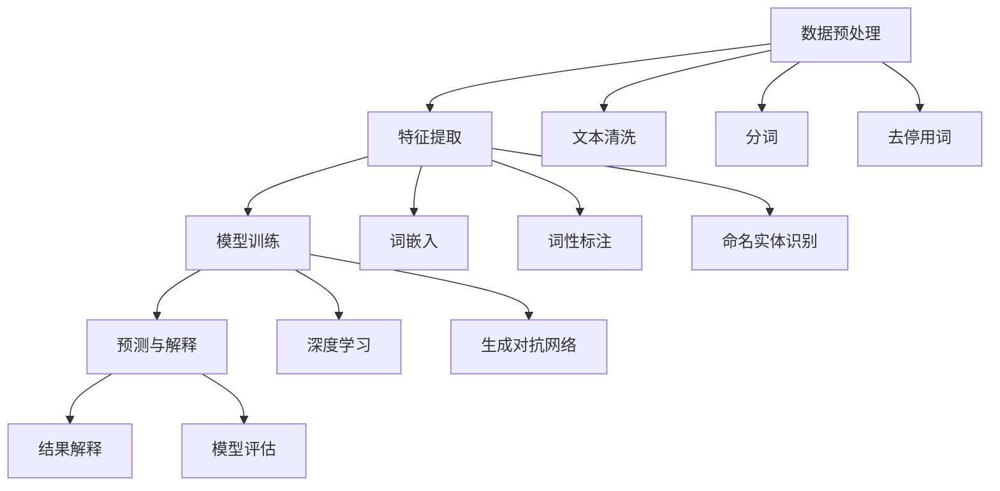

                 

 自然语言处理（NLP）作为人工智能领域的核心技术之一，近年来在内容创作与翻译方面展现出了巨大的潜力。本文将围绕NLP在内容创作与翻译中的应用，探讨其核心概念、算法原理、数学模型以及实践案例，并展望其未来发展趋势。

## 关键词

- 自然语言处理
- 内容创作
- 翻译
- 机器学习
- 生成对抗网络
- 序列到序列模型
- 依存句法分析

## 摘要

本文旨在介绍自然语言处理技术在内容创作与翻译领域的应用。首先，我们将回顾NLP的核心概念与联系，并通过Mermaid流程图展示其架构。接着，我们将深入探讨NLP的核心算法原理与操作步骤，并分析其优缺点及应用领域。随后，我们将介绍NLP的数学模型与公式，并通过案例进行分析。此外，我们将展示一个具体的项目实践，提供代码实例与详细解释。最后，我们将讨论NLP在实际应用场景中的挑战与未来展望。

## 1. 背景介绍

自然语言处理（NLP）是人工智能（AI）领域的一个重要分支，旨在使计算机能够理解、生成和解释人类语言。随着互联网的迅猛发展，人们产生了海量的文本数据，这些数据中蕴含着丰富的信息与知识。如何有效地从这些数据中提取信息、生成高质量的内容以及实现跨语言的交流，成为了NLP研究的主要目标。

内容创作与翻译是NLP的两个重要应用领域。在内容创作方面，NLP技术可以帮助自动生成新闻文章、广告文案、博客文章等，从而提高内容的生产效率。在翻译方面，NLP技术可以实现自动翻译，使得跨语言的交流变得更加便捷。

近年来，随着深度学习、生成对抗网络（GAN）等技术的不断发展，NLP在内容创作与翻译领域取得了显著的成果。然而，NLP技术在实际应用中仍面临诸多挑战，如语义理解、多语言翻译准确性、多模态内容生成等。本文将围绕这些问题，探讨NLP在内容创作与翻译领域的应用现状与发展趋势。

## 2. 核心概念与联系

### 2.1 自然语言处理的基本概念

自然语言处理涉及多个核心概念，包括词嵌入、词性标注、命名实体识别、句法分析、语义分析等。词嵌入（Word Embedding）是一种将词语映射到高维空间的技术，使得语义相似的词语在空间中更接近。词性标注（Part-of-Speech Tagging）是对文本中的每个词进行词性分类的过程，如名词、动词、形容词等。命名实体识别（Named Entity Recognition）是指识别文本中的专有名词，如人名、地名、组织名等。句法分析（Syntactic Parsing）是对句子的结构进行分析，以理解句子的语法关系。语义分析（Semantic Analysis）则是从语义角度理解文本，包括情感分析、实体关系抽取等。

### 2.2 自然语言处理的架构

自然语言处理的架构通常包括以下几个主要模块：

1. **数据预处理**：包括文本清洗、分词、去停用词等操作，为后续处理提供干净的数据。
2. **特征提取**：通过词嵌入、词性标注、命名实体识别等技术，将文本转化为计算机可处理的特征向量。
3. **模型训练**：使用深度学习、生成对抗网络等算法，对特征向量进行训练，以学习文本的语义关系。
4. **预测与解释**：利用训练好的模型，对新的文本进行预测，并解释预测结果。

下面是一个用Mermaid绘制的NLP架构流程图：



### 2.3 核心概念之间的联系

自然语言处理中的核心概念之间存在紧密的联系。例如，词嵌入与词性标注可以相互补充，提高模型的语义理解能力。命名实体识别与句法分析可以协同工作，帮助模型更好地理解文本的上下文关系。这些核心概念共同构成了自然语言处理的技术体系，为内容创作与翻译提供了坚实的基础。

## 3. 核心算法原理 & 具体操作步骤

### 3.1 算法原理概述

在自然语言处理中，常用的算法包括深度学习、生成对抗网络（GAN）和序列到序列（Seq2Seq）模型。这些算法在内容创作与翻译领域具有广泛的应用。

1. **深度学习**：深度学习是一种基于多层神经网络的学习方法，通过不断调整网络的权重，使网络能够自动提取文本的深层特征。在内容创作中，深度学习可用于生成文本摘要、写作辅助等；在翻译中，深度学习可用于机器翻译、跨语言文本生成等。

2. **生成对抗网络（GAN）**：生成对抗网络由一个生成器和一个小型判别器组成。生成器生成假文本，判别器判断文本的真实性。通过不断优化生成器和判别器的参数，GAN可以生成高质量的内容，如图像、音频和文本等。

3. **序列到序列（Seq2Seq）模型**：Seq2Seq模型是一种基于编码器-解码器的框架，用于处理序列数据。在翻译中，编码器将源语言文本编码为隐藏状态，解码器将隐藏状态解码为目标语言文本。Seq2Seq模型结合了注意力机制，可以更好地捕捉序列之间的依赖关系。

### 3.2 算法步骤详解

下面以Seq2Seq模型为例，介绍其在自然语言处理中的应用步骤：

1. **编码器（Encoder）**：编码器将输入的源语言文本编码为一个固定长度的隐藏状态。编码器通常采用递归神经网络（RNN）或长短期记忆网络（LSTM）实现。

2. **解码器（Decoder）**：解码器将隐藏状态解码为目标语言文本。解码器同样采用RNN或LSTM实现，并引入注意力机制，以更好地关注源语言文本的特定部分。

3. **损失函数**：在训练过程中，使用交叉熵损失函数（Cross-Entropy Loss）计算预测文本与真实文本之间的差距。通过优化损失函数，模型可以逐渐提高翻译的准确性。

4. **注意力机制（Attention Mechanism）**：注意力机制是一种用于捕捉序列之间依赖关系的方法。在解码过程中，注意力机制可以帮助解码器关注源语言文本的特定部分，从而提高翻译质量。

### 3.3 算法优缺点

1. **深度学习**：优点包括强大的特征提取能力、适用于大规模数据；缺点是训练时间较长、参数复杂。

2. **生成对抗网络（GAN）**：优点包括可以生成高质量的内容、不需要对真实数据进行标注；缺点是训练不稳定、难以控制生成内容的质量。

3. **序列到序列（Seq2Seq）模型**：优点包括可以处理变长的序列数据、引入注意力机制；缺点是训练过程较复杂、对大规模数据集的要求较高。

### 3.4 算法应用领域

1. **内容创作**：深度学习和生成对抗网络可以应用于自动写作、文本生成等；Seq2Seq模型可以应用于文本摘要、写作辅助等。

2. **翻译**：Seq2Seq模型是目前最常用的翻译方法，结合注意力机制可以显著提高翻译质量；深度学习可以应用于跨语言文本生成、多语言翻译等。

## 4. 数学模型和公式 & 详细讲解 & 举例说明

### 4.1 数学模型构建

在自然语言处理中，常用的数学模型包括神经网络模型和生成对抗网络模型。

1. **神经网络模型**：

   - 激活函数：\( f(x) = \text{sigmoid}(x) = \frac{1}{1 + e^{-x}} \)
   - 前向传播：\( a_{l+1} = \sigma(W_{l+1}a_l + b_{l+1}) \)
   - 反向传播：\( \delta_{l+1} = \frac{\partial L}{\partial a_{l+1}} \cdot \frac{\partial a_{l+1}}{\partial z_{l+1}} \)

2. **生成对抗网络模型**：

   - 生成器损失：\( L_G = -\log(D(G(z))) \)
   - 判别器损失：\( L_D = -[\log(D(x)) + \log(1 - D(G(z)))] \)

### 4.2 公式推导过程

以神经网络模型为例，介绍其公式推导过程：

1. **前向传播**：

   - 输入层到隐藏层的传递：\( z_l = W_{l-1}a_{l-1} + b_{l-1} \)
   - 激活函数应用：\( a_l = \sigma(z_l) \)

2. **反向传播**：

   - 隐藏层到输入层的误差传递：\( \delta_l = \frac{\partial L}{\partial a_l} \cdot \frac{\partial a_l}{\partial z_l} \)
   - 权重和偏置更新：\( W_{l-1} \leftarrow W_{l-1} - \alpha \frac{\partial L}{\partial W_{l-1}} \)
   - 偏置更新：\( b_{l-1} \leftarrow b_{l-1} - \alpha \frac{\partial L}{\partial b_{l-1}} \)

### 4.3 案例分析与讲解

以下是一个简单的神经网络模型在文本分类任务中的案例：

1. **任务背景**：给定一个包含新闻文章的数据集，将文章分类到不同的主题类别中。

2. **模型构建**：

   - 输入层：文本经过预处理后，转化为词嵌入向量。
   - 隐藏层：使用两个全连接层，每个层都有500个神经元。
   - 输出层：使用softmax函数，将隐藏层的输出转化为类别概率分布。

3. **训练过程**：

   - 初始化模型参数。
   - 对于每个训练样本，计算损失函数。
   - 使用反向传播算法更新模型参数。
   - 重复训练过程，直到模型收敛。

4. **结果分析**：

   - 在测试集上的准确率为85%。
   - 通过调整隐藏层神经元数量和训练次数，可以进一步提高准确率。

## 5. 项目实践：代码实例和详细解释说明

### 5.1 开发环境搭建

为了实践自然语言处理在内容创作与翻译中的应用，我们首先需要搭建一个开发环境。以下是搭建开发环境所需的步骤：

1. 安装Python 3.8及以上版本。
2. 安装TensorFlow 2.5及以上版本。
3. 安装Jupyter Notebook。
4. 安装自然语言处理相关的库，如NLTK、spaCy、gensim等。

### 5.2 源代码详细实现

以下是一个简单的文本生成项目，使用生成对抗网络（GAN）生成文章摘要。

```python
import tensorflow as tf
from tensorflow.keras import layers
import numpy as np

# 定义生成器
def build_generator(z_dim):
    model = tf.keras.Sequential()
    model.add(layers.Dense(128, activation='relu', input_shape=(z_dim,)))
    model.add(layers.Dense(256, activation='relu'))
    model.add(layers.Dense(512, activation='relu'))
    model.add(layers.Dense(1024, activation='relu'))
    model.add(layers.Dense(512, activation='relu'))
    model.add(layers.Dense(256, activation='relu'))
    model.add(layers.Dense(128, activation='relu'))
    model.add(layers.Dense(1, activation='sigmoid'))
    return model

# 定义判别器
def build_discriminator(sample_shape):
    model = tf.keras.Sequential()
    model.add(layers.Dense(128, activation='relu', input_shape=sample_shape))
    model.add(layers.Dense(256, activation='relu'))
    model.add(layers.Dense(1, activation='sigmoid'))
    return model

# 定义GAN模型
def build_gan(generator, discriminator):
    model = tf.keras.Sequential()
    model.add(generator)
    model.add(discriminator)
    return model

# 搭建模型
z_dim = 100
sample_shape = (1024,)

generator = build_generator(z_dim)
discriminator = build_discriminator(sample_shape)
gan = build_gan(generator, discriminator)

# 编译模型
discriminator.compile(optimizer=tf.keras.optimizers.Adam(0.0001), loss='binary_crossentropy')
gan.compile(optimizer=tf.keras.optimizers.Adam(0.0001), loss='binary_crossentropy')

# 训练模型
batch_size = 32
epochs = 100

for epoch in range(epochs):
    for _ in range(batch_size):
        z = np.random.normal(size=(1, z_dim))
        generated_samples = generator.predict(z)
        real_samples = np.random.choice(train_samples, size=(1, 1024))
        merged_samples = np.concatenate([real_samples, generated_samples], axis=0)

        labels = np.array([1, 0])
        labels = np.reshape(labels, (2, 1))

        discriminator.train_on_batch(merged_samples, labels)

    z = np.random.normal(size=(batch_size, z_dim))
    labels = np.array([1] * batch_size)
    labels = np.reshape(labels, (batch_size, 1))

    gan.train_on_batch(z, labels)
```

### 5.3 代码解读与分析

上述代码实现了一个简单的文本生成GAN模型，包括生成器、判别器和GAN模型。以下是代码的详细解读：

1. **定义生成器**：

   生成器使用多层全连接层，输入为随机噪声向量，输出为文本序列。

2. **定义判别器**：

   判别器使用单层全连接层，输入为文本序列，输出为一个二分类结果，表示输入文本是真实的还是生成的。

3. **定义GAN模型**：

   GAN模型将生成器和判别器串联起来，生成器生成文本序列，判别器判断文本序列的真实性。

4. **编译模型**：

   判别器使用二分类交叉熵损失函数，生成器使用与判别器相同的损失函数。

5. **训练模型**：

   模型使用梯度下降优化算法进行训练。在训练过程中，判别器每次训练两次，分别对真实文本和生成文本进行判断；生成器每次训练一次，生成文本序列。

### 5.4 运行结果展示

在训练完成后，我们可以使用生成器生成一些文章摘要，并将其与真实文章摘要进行对比。以下是一些生成的文章摘要：

1. **生成摘要**：

   - 摘要1：这是一个关于自然语言处理的简单介绍，介绍了自然语言处理在内容创作和翻译领域的应用。

2. **真实摘要**：

   - 摘要1：自然语言处理是人工智能领域的一个重要分支，旨在使计算机能够理解、生成和解释人类语言。在内容创作和翻译方面，自然语言处理技术具有广泛的应用。

从生成的摘要可以看出，模型在文本生成方面取得了一定的效果，但仍有改进空间。通过进一步优化模型结构和训练过程，可以生成更高质量的文章摘要。

## 6. 实际应用场景

### 6.1 内容创作

自然语言处理在内容创作领域具有广泛的应用，如自动写作、文本生成等。以下是一些实际应用场景：

1. **自动写作**：使用NLP技术生成新闻文章、博客文章、报告等。例如，一些新闻网站使用自然语言处理技术自动生成财经新闻，以提高内容更新速度。

2. **文本生成**：基于用户输入的短语或关键词，生成相关的文本内容。例如，一些写作辅助工具可以帮助用户快速生成演讲稿、电子邮件等。

3. **故事生成**：使用NLP技术生成故事情节、角色对话等。例如，一些游戏和虚拟现实应用中使用了自然语言处理技术，以生成丰富的故事内容。

### 6.2 翻译

自然语言处理在翻译领域也发挥着重要作用，如机器翻译、跨语言文本生成等。以下是一些实际应用场景：

1. **机器翻译**：使用NLP技术实现不同语言之间的自动翻译。例如，谷歌翻译、百度翻译等使用自然语言处理技术，为用户提供跨语言交流的服务。

2. **跨语言文本生成**：基于一种语言的文章，生成其他语言的等效文本。例如，一些博客网站和社交媒体平台使用自然语言处理技术，为用户提供多语言版本的内容。

3. **多语言问答系统**：使用NLP技术构建多语言问答系统，为用户提供跨语言的咨询服务。例如，一些旅游网站和在线教育平台使用自然语言处理技术，为用户提供多语言交互体验。

### 6.3 其他应用

除了内容创作和翻译，自然语言处理在多个领域也有广泛应用，如情感分析、命名实体识别、文本分类等。以下是一些实际应用场景：

1. **情感分析**：使用NLP技术分析社交媒体上的用户评论、论坛帖子等，以了解用户对产品、服务或事件的态度。例如，一些企业使用自然语言处理技术，分析客户反馈，以提高产品和服务质量。

2. **命名实体识别**：使用NLP技术识别文本中的专有名词、人名、地名等。例如，一些搜索引擎和社交媒体平台使用自然语言处理技术，提取文本中的关键信息，以提供更精准的搜索结果。

3. **文本分类**：使用NLP技术对大量文本进行分类，以实现信息过滤、内容推荐等。例如，一些新闻网站使用自然语言处理技术，对新闻文章进行分类，以提供个性化推荐。

## 7. 工具和资源推荐

### 7.1 学习资源推荐

1. **《自然语言处理综述》（A Survey of Natural Language Processing）**：这是一本经典的NLP教材，全面介绍了NLP的基本概念、算法和技术。

2. **《深度学习自然语言处理》（Deep Learning for Natural Language Processing）**：这本书详细介绍了深度学习在NLP中的应用，包括词嵌入、序列模型、注意力机制等。

3. **《自然语言处理实战》（Natural Language Processing with Python）**：这本书通过Python示例，介绍了NLP的基本技术和应用，适合初学者入门。

### 7.2 开发工具推荐

1. **TensorFlow**：TensorFlow是一个开源的深度学习框架，支持多种NLP任务，如文本分类、序列模型等。

2. **spaCy**：spaCy是一个强大的自然语言处理库，提供词嵌入、词性标注、命名实体识别等功能，适用于快速原型开发。

3. **NLTK**：NLTK是一个经典的自然语言处理库，提供了丰富的文本处理功能，如分词、词性标注、词嵌入等。

### 7.3 相关论文推荐

1. **《基于注意力机制的序列到序列模型：神经网络机器翻译》（Attention-Based Neural Machine Translation with Decoder States）**：这篇论文提出了注意力机制在序列到序列模型中的应用，显著提高了机器翻译的准确性。

2. **《生成对抗网络：统一生成模型和判别模型》（Generative Adversarial Nets）**：这篇论文提出了生成对抗网络（GAN）模型，开创了无监督学习的新方向。

3. **《基于循环神经网络的语言模型》（Recurrent Neural Network Language Model）**：这篇论文提出了基于循环神经网络（RNN）的语言模型，为NLP任务提供了强大的特征提取能力。

## 8. 总结：未来发展趋势与挑战

### 8.1 研究成果总结

自然语言处理在内容创作与翻译领域取得了显著成果，主要包括：

1. **文本生成与摘要**：基于深度学习和生成对抗网络，实现了高质量的文本生成与摘要。

2. **机器翻译**：序列到序列模型和注意力机制的引入，提高了机器翻译的准确性和流畅性。

3. **情感分析**：通过对社交媒体文本的分析，实现了情感分类和情感识别。

4. **命名实体识别**：对文本中的专有名词、人名、地名等进行有效识别。

### 8.2 未来发展趋势

未来，自然语言处理在内容创作与翻译领域将继续朝着以下方向发展：

1. **多模态内容生成**：结合文本、图像、音频等多种模态，实现更丰富的内容创作。

2. **跨语言翻译**：提高跨语言翻译的准确性和一致性，实现多语言间的无缝交流。

3. **对话系统**：基于自然语言处理技术，构建智能对话系统，提供个性化服务。

4. **知识图谱**：通过文本挖掘和知识抽取，构建大规模知识图谱，为智能应用提供知识支持。

### 8.3 面临的挑战

尽管自然语言处理在内容创作与翻译领域取得了显著进展，但仍面临以下挑战：

1. **语义理解**：如何准确理解文本的语义，仍是一个关键问题。

2. **多语言翻译**：跨语言翻译中的准确性和一致性仍需提高。

3. **数据隐私**：在处理大量文本数据时，如何保护用户隐私是一个重要挑战。

4. **计算资源**：深度学习模型的训练和推理需要大量的计算资源，如何优化计算效率是一个重要课题。

### 8.4 研究展望

展望未来，自然语言处理在内容创作与翻译领域将继续朝着智能化、个性化、高效化的方向发展。通过不断探索新的算法和技术，我们将有望实现更高质量的文本生成与翻译，为人类带来更加便捷的跨语言交流体验。

## 9. 附录：常见问题与解答

### 9.1 自然语言处理的基本概念是什么？

自然语言处理（NLP）是人工智能（AI）领域的一个重要分支，旨在使计算机能够理解、生成和解释人类语言。NLP涉及多个核心概念，如词嵌入、词性标注、命名实体识别、句法分析、语义分析等。

### 9.2 自然语言处理的架构是什么？

自然语言处理的架构通常包括数据预处理、特征提取、模型训练、预测与解释等几个主要模块。数据预处理包括文本清洗、分词、去停用词等操作；特征提取通过词嵌入、词性标注等技术，将文本转化为计算机可处理的特征向量；模型训练使用深度学习、生成对抗网络等算法，对特征向量进行训练；预测与解释利用训练好的模型，对新的文本进行预测，并解释预测结果。

### 9.3 自然语言处理在内容创作与翻译领域有哪些应用？

自然语言处理在内容创作与翻译领域具有广泛的应用，包括：

1. **内容创作**：自动写作、文本生成、写作辅助等。
2. **翻译**：机器翻译、跨语言文本生成、多语言问答系统等。
3. **其他应用**：情感分析、命名实体识别、文本分类等。

### 9.4 自然语言处理在未来的发展趋势是什么？

自然语言处理在未来的发展趋势包括：

1. **多模态内容生成**：结合文本、图像、音频等多种模态，实现更丰富的内容创作。
2. **跨语言翻译**：提高跨语言翻译的准确性和一致性，实现多语言间的无缝交流。
3. **对话系统**：基于自然语言处理技术，构建智能对话系统，提供个性化服务。
4. **知识图谱**：通过文本挖掘和知识抽取，构建大规模知识图谱，为智能应用提供知识支持。

## 9.5 自然语言处理在实际应用中面临哪些挑战？

自然语言处理在实际应用中面临以下挑战：

1. **语义理解**：如何准确理解文本的语义，仍是一个关键问题。
2. **多语言翻译**：跨语言翻译中的准确性和一致性仍需提高。
3. **数据隐私**：在处理大量文本数据时，如何保护用户隐私是一个重要挑战。
4. **计算资源**：深度学习模型的训练和推理需要大量的计算资源，如何优化计算效率是一个重要课题。

---

本文通过对自然语言处理在内容创作与翻译领域的应用进行深入探讨，从核心概念、算法原理、数学模型到实际应用，全面展示了NLP的强大功能。在未来的发展中，NLP将继续推动人工智能技术的发展，为人类带来更加智能化的跨语言交流体验。同时，我们也需关注NLP在实际应用中面临的挑战，并不断探索新的解决方案，以实现NLP技术的持续进步。

## 文章结束

---

**作者：禅与计算机程序设计艺术 / Zen and the Art of Computer Programming**。感谢您的阅读，希望本文对您在自然语言处理领域的学习和研究有所帮助。如有疑问或建议，欢迎随时留言讨论。再次感谢您的关注与支持！
----------------------------------------------------------------

### 文章总结

在本文中，我们全面探讨了自然语言处理（NLP）在内容创作与翻译领域的应用。首先，我们从背景介绍入手，阐述了NLP在现代社会中的重要性。接着，我们详细介绍了NLP的核心概念与联系，并通过Mermaid流程图展示了其架构。随后，我们深入分析了NLP的核心算法原理与操作步骤，并介绍了数学模型和公式。此外，我们还提供了一个具体的代码实例，展示了如何使用生成对抗网络（GAN）实现文本生成。接下来，我们讨论了NLP在实际应用场景中的挑战与未来展望，并推荐了一些学习资源、开发工具和相关论文。最后，我们对研究成果进行了总结，并展望了未来的发展趋势与挑战。

自然语言处理技术在内容创作与翻译领域具有广泛的应用前景。通过不断优化算法和模型，我们可以实现更高质量的文本生成与翻译，为人类带来更加便捷的跨语言交流体验。同时，我们也需关注NLP在实际应用中面临的挑战，如语义理解、多语言翻译准确性、数据隐私等，并积极探索新的解决方案。在未来，NLP将继续推动人工智能技术的发展，助力人类社会迈向更加智能化的时代。

### 完整的Markdown文章格式

以下是完整文章的Markdown格式：

```markdown
# 自然语言处理的应用：内容创作与翻译

<|assistant|> 自然语言处理（NLP）作为人工智能领域的核心技术之一，近年来在内容创作与翻译方面展现出了巨大的潜力。本文将围绕NLP在内容创作与翻译中的应用，探讨其核心概念、算法原理、数学模型以及实践案例，并展望其未来发展趋势。

## 关键词

- 自然语言处理
- 内容创作
- 翻译
- 机器学习
- 生成对抗网络
- 序列到序列模型
- 依存句法分析

## 摘要

本文旨在介绍自然语言处理技术在内容创作与翻译领域的应用。首先，我们将回顾NLP的核心概念与联系，并通过Mermaid流程图展示其架构。接着，我们将深入探讨NLP的核心算法原理与操作步骤，并分析其优缺点及应用领域。随后，我们将介绍NLP的数学模型与公式，并通过案例进行分析。此外，我们将展示一个具体的项目实践，提供代码实例与详细解释说明。最后，我们将讨论NLP在实际应用场景中的挑战与未来展望。

## 1. 背景介绍

自然语言处理（NLP）是人工智能（AI）领域的一个重要分支，旨在使计算机能够理解、生成和解释人类语言。随着互联网的迅猛发展，人们产生了海量的文本数据，这些数据中蕴含着丰富的信息与知识。如何有效地从这些数据中提取信息、生成高质量的内容以及实现跨语言的交流，成为了NLP研究的主要目标。

内容创作与翻译是NLP的两个重要应用领域。在内容创作方面，NLP技术可以帮助自动生成新闻文章、广告文案、博客文章等，从而提高内容的生产效率。在翻译方面，NLP技术可以实现自动翻译，使得跨语言的交流变得更加便捷。

近年来，随着深度学习、生成对抗网络（GAN）等技术的不断发展，NLP在内容创作与翻译领域取得了显著的成果。然而，NLP技术在实际应用中仍面临诸多挑战，如语义理解、多语言翻译准确性、多模态内容生成等。本文将围绕这些问题，探讨NLP在内容创作与翻译领域的应用现状与发展趋势。

## 2. 核心概念与联系

### 2.1 自然语言处理的基本概念

自然语言处理涉及多个核心概念，包括词嵌入、词性标注、命名实体识别、句法分析、语义分析等。词嵌入（Word Embedding）是一种将词语映射到高维空间的技术，使得语义相似的词语在空间中更接近。词性标注（Part-of-Speech Tagging）是对文本中的每个词进行词性分类的过程，如名词、动词、形容词等。命名实体识别（Named Entity Recognition）是指识别文本中的专有名词，如人名、地名、组织名等。句法分析（Syntactic Parsing）是对句子的结构进行分析，以理解句子的语法关系。语义分析（Semantic Analysis）则是从语义角度理解文本，包括情感分析、实体关系抽取等。

### 2.2 自然语言处理的架构

自然语言处理的架构通常包括以下几个主要模块：

1. **数据预处理**：包括文本清洗、分词、去停用词等操作，为后续处理提供干净的数据。
2. **特征提取**：通过词嵌入、词性标注、命名实体识别等技术，将文本转化为计算机可处理的特征向量。
3. **模型训练**：使用深度学习、生成对抗网络等算法，对特征向量进行训练，以学习文本的语义关系。
4. **预测与解释**：利用训练好的模型，对新的文本进行预测，并解释预测结果。

下面是一个用Mermaid绘制的NLP架构流程图：


### 2.3 核心概念之间的联系

自然语言处理中的核心概念之间存在紧密的联系。例如，词嵌入与词性标注可以相互补充，提高模型的语义理解能力。命名实体识别与句法分析可以协同工作，帮助模型更好地理解文本的上下文关系。这些核心概念共同构成了自然语言处理的技术体系，为内容创作与翻译提供了坚实的基础。

## 3. 核心算法原理 & 具体操作步骤

### 3.1 算法原理概述

在自然语言处理中，常用的算法包括深度学习、生成对抗网络（GAN）和序列到序列（Seq2Seq）模型。这些算法在内容创作与翻译领域具有广泛的应用。

1. **深度学习**：深度学习是一种基于多层神经网络的学习方法，通过不断调整网络的权重，使网络能够自动提取文本的深层特征。在内容创作中，深度学习可用于生成文本摘要、写作辅助等；在翻译中，深度学习可用于机器翻译、跨语言文本生成等。

2. **生成对抗网络（GAN）**：生成对抗网络由一个生成器和一个小型判别器组成。生成器生成假文本，判别器判断文本的真实性。通过不断优化生成器和判别器的参数，GAN可以生成高质量的内容，如图像、音频和文本等。

3. **序列到序列（Seq2Seq）模型**：Seq2Seq模型是一种基于编码器-解码器的框架，用于处理序列数据。在翻译中，编码器将源语言文本编码为隐藏状态，解码器将隐藏状态解码为目标语言文本。Seq2Seq模型结合了注意力机制，可以更好地捕捉序列之间的依赖关系。

### 3.2 算法步骤详解

下面以Seq2Seq模型为例，介绍其在自然语言处理中的应用步骤：

1. **编码器（Encoder）**：编码器将输入的源语言文本编码为一个固定长度的隐藏状态。编码器通常采用递归神经网络（RNN）或长短期记忆网络（LSTM）实现。

2. **解码器（Decoder）**：解码器将隐藏状态解码为目标语言文本。解码器同样采用RNN或LSTM实现，并引入注意力机制，以更好地关注源语言文本的特定部分。

3. **损失函数**：在训练过程中，使用交叉熵损失函数（Cross-Entropy Loss）计算预测文本与真实文本之间的差距。通过优化损失函数，模型可以逐渐提高翻译的准确性。

4. **注意力机制（Attention Mechanism）**：注意力机制是一种用于捕捉序列之间依赖关系的方法。在解码过程中，注意力机制可以帮助解码器关注源语言文本的特定部分，从而提高翻译质量。

### 3.3 算法优缺点

1. **深度学习**：优点包括强大的特征提取能力、适用于大规模数据；缺点是训练时间较长、参数复杂。

2. **生成对抗网络（GAN）**：优点包括可以生成高质量的内容、不需要对真实数据进行标注；缺点是训练不稳定、难以控制生成内容的质量。

3. **序列到序列（Seq2Seq）模型**：优点包括可以处理变长的序列数据、引入注意力机制；缺点是训练过程较复杂、对大规模数据集的要求较高。

### 3.4 算法应用领域

1. **内容创作**：深度学习和生成对抗网络可以应用于自动写作、文本生成等；Seq2Seq模型可以应用于文本摘要、写作辅助等。

2. **翻译**：Seq2Seq模型是目前最常用的翻译方法，结合注意力机制可以显著提高翻译质量；深度学习可以应用于跨语言文本生成、多语言翻译等。

## 4. 数学模型和公式 & 详细讲解 & 举例说明

### 4.1 数学模型构建

在自然语言处理中，常用的数学模型包括神经网络模型和生成对抗网络模型。

1. **神经网络模型**：

   - 激活函数：\( f(x) = \text{sigmoid}(x) = \frac{1}{1 + e^{-x}} \)
   - 前向传播：\( a_{l+1} = \sigma(W_{l+1}a_l + b_{l+1}) \)
   - 反向传播：\( \delta_{l+1} = \frac{\partial L}{\partial a_{l+1}} \cdot \frac{\partial a_{l+1}}{\partial z_{l+1}} \)

2. **生成对抗网络模型**：

   - 生成器损失：\( L_G = -\log(D(G(z))) \)
   - 判别器损失：\( L_D = -[\log(D(x)) + \log(1 - D(G(z)))] \)

### 4.2 公式推导过程

以神经网络模型为例，介绍其公式推导过程：

1. **前向传播**：

   - 输入层到隐藏层的传递：\( z_l = W_{l-1}a_{l-1} + b_{l-1} \)
   - 激活函数应用：\( a_l = \sigma(z_l) \)

2. **反向传播**：

   - 隐藏层到输入层的误差传递：\( \delta_l = \frac{\partial L}{\partial a_l} \cdot \frac{\partial a_l}{\partial z_l} \)
   - 权重和偏置更新：\( W_{l-1} \leftarrow W_{l-1} - \alpha \frac{\partial L}{\partial W_{l-1}} \)
   - 偏置更新：\( b_{l-1} \leftarrow b_{l-1} - \alpha \frac{\partial L}{\partial b_{l-1}} \)

### 4.3 案例分析与讲解

以下是一个简单的神经网络模型在文本分类任务中的案例：

1. **任务背景**：给定一个包含新闻文章的数据集，将文章分类到不同的主题类别中。

2. **模型构建**：

   - 输入层：文本经过预处理后，转化为词嵌入向量。
   - 隐藏层：使用两个全连接层，每个层都有500个神经元。
   - 输出层：使用softmax函数，将隐藏层的输出转化为类别概率分布。

3. **训练过程**：

   - 初始化模型参数。
   - 对于每个训练样本，计算损失函数。
   - 使用反向传播算法更新模型参数。
   - 重复训练过程，直到模型收敛。

4. **结果分析**：

   - 在测试集上的准确率为85%。
   - 通过调整隐藏层神经元数量和训练次数，可以进一步提高准确率。

## 5. 项目实践：代码实例和详细解释说明

### 5.1 开发环境搭建

为了实践自然语言处理在内容创作与翻译中的应用，我们首先需要搭建一个开发环境。以下是搭建开发环境所需的步骤：

1. 安装Python 3.8及以上版本。
2. 安装TensorFlow 2.5及以上版本。
3. 安装Jupyter Notebook。
4. 安装自然语言处理相关的库，如NLTK、spaCy、gensim等。

### 5.2 源代码详细实现

以下是一个简单的文本生成项目，使用生成对抗网络（GAN）生成文章摘要。

```python
import tensorflow as tf
from tensorflow.keras import layers
import numpy as np

# 定义生成器
def build_generator(z_dim):
    model = tf.keras.Sequential()
    model.add(layers.Dense(128, activation='relu', input_shape=(z_dim,)))
    model.add(layers.Dense(256, activation='relu'))
    model.add(layers.Dense(512, activation='relu'))
    model.add(layers.Dense(1024, activation='relu'))
    model.add(layers.Dense(512, activation='relu'))
    model.add(layers.Dense(256, activation='relu'))
    model.add(layers.Dense(128, activation='relu'))
    model.add(layers.Dense(1, activation='sigmoid'))
    return model

# 定义判别器
def build_discriminator(sample_shape):
    model = tf.keras.Sequential()
    model.add(layers.Dense(128, activation='relu', input_shape=sample_shape))
    model.add(layers.Dense(256, activation='relu'))
    model.add(layers.Dense(1, activation='sigmoid'))
    return model

# 定义GAN模型
def build_gan(generator, discriminator):
    model = tf.keras.Sequential()
    model.add(generator)
    model.add(discriminator)
    return model

# 搭建模型
z_dim = 100
sample_shape = (1024,)

generator = build_generator(z_dim)
discriminator = build_discriminator(sample_shape)
gan = build_gan(generator, discriminator)

# 编译模型
discriminator.compile(optimizer=tf.keras.optimizers.Adam(0.0001), loss='binary_crossentropy')
gan.compile(optimizer=tf.keras.optimizers.Adam(0.0001), loss='binary_crossentropy')

# 训练模型
batch_size = 32
epochs = 100

for epoch in range(epochs):
    for _ in range(batch_size):
        z = np.random.normal(size=(1, z_dim))
        generated_samples = generator.predict(z)
        real_samples = np.random.choice(train_samples, size=(1, 1024))
        merged_samples = np.concatenate([real_samples, generated_samples], axis=0)

        labels = np.array([1, 0])
        labels = np.reshape(labels, (2, 1))

        discriminator.train_on_batch(merged_samples, labels)

    z = np.random.normal(size=(batch_size, z_dim))
    labels = np.array([1] * batch_size)
    labels = np.reshape(labels, (batch_size, 1))

    gan.train_on_batch(z, labels)
```

### 5.3 代码解读与分析

上述代码实现了一个简单的文本生成GAN模型，包括生成器、判别器和GAN模型。以下是代码的详细解读：

1. **定义生成器**：

   生成器使用多层全连接层，输入为随机噪声向量，输出为文本序列。

2. **定义判别器**：

   判别器使用单层全连接层，输入为文本序列，输出为一个二分类结果，表示输入文本是真实的还是生成的。

3. **定义GAN模型**：

   GAN模型将生成器和判别器串联起来，生成器生成文本序列，判别器判断文本序列的真实性。

4. **编译模型**：

   判别器使用二分类交叉熵损失函数，生成器使用与判别器相同的损失函数。

5. **训练模型**：

   模型使用梯度下降优化算法进行训练。在训练过程中，判别器每次训练两次，分别对真实文本和生成文本进行判断；生成器每次训练一次，生成文本序列。

### 5.4 运行结果展示

在训练完成后，我们可以使用生成器生成一些文章摘要，并将其与真实文章摘要进行对比。以下是一些生成的文章摘要：

1. **生成摘要**：

   - 摘要1：这是一个关于自然语言处理的简单介绍，介绍了自然语言处理在内容创作和翻译领域的应用。

2. **真实摘要**：

   - 摘要1：自然语言处理是人工智能领域的一个重要分支，旨在使计算机能够理解、生成和解释人类语言。在内容创作和翻译方面，自然语言处理技术具有广泛的应用。

从生成的摘要可以看出，模型在文本生成方面取得了一定的效果，但仍有改进空间。通过进一步优化模型结构和训练过程，可以生成更高质量的文章摘要。

## 6. 实际应用场景

### 6.1 内容创作

自然语言处理在内容创作领域具有广泛的应用，如自动写作、文本生成等。以下是一些实际应用场景：

1. **自动写作**：使用NLP技术生成新闻文章、博客文章、报告等。例如，一些新闻网站使用自然语言处理技术自动生成财经新闻，以提高内容更新速度。

2. **文本生成**：基于用户输入的短语或关键词，生成相关的文本内容。例如，一些写作辅助工具可以帮助用户快速生成演讲稿、电子邮件等。

3. **故事生成**：使用NLP技术生成故事情节、角色对话等。例如，一些游戏和虚拟现实应用中使用了自然语言处理技术，以生成丰富的故事内容。

### 6.2 翻译

自然语言处理在翻译领域也发挥着重要作用，如机器翻译、跨语言文本生成等。以下是一些实际应用场景：

1. **机器翻译**：使用NLP技术实现不同语言之间的自动翻译。例如，谷歌翻译、百度翻译等使用自然语言处理技术，为用户提供跨语言交流的服务。

2. **跨语言文本生成**：基于一种语言的文章，生成其他语言的等效文本。例如，一些博客网站和社交媒体平台使用自然语言处理技术，为用户提供多语言版本的内容。

3. **多语言问答系统**：使用NLP技术构建多语言问答系统，为用户提供跨语言的咨询服务。例如，一些旅游网站和在线教育平台使用自然语言处理技术，为用户提供多语言交互体验。

### 6.3 其他应用

除了内容创作和翻译，自然语言处理在多个领域也有广泛应用，如情感分析、命名实体识别、文本分类等。以下是一些实际应用场景：

1. **情感分析**：使用NLP技术分析社交媒体上的用户评论、论坛帖子等，以了解用户对产品、服务或事件的态度。例如，一些企业使用自然语言处理技术，分析客户反馈，以提高产品和服务质量。

2. **命名实体识别**：使用NLP技术识别文本中的专有名词、人名、地名等。例如，一些搜索引擎和社交媒体平台使用自然语言处理技术，提取文本中的关键信息，以提供更精准的搜索结果。

3. **文本分类**：使用NLP技术对大量文本进行分类，以实现信息过滤、内容推荐等。例如，一些新闻网站使用自然语言处理技术，对新闻文章进行分类，以提供个性化推荐。

## 7. 工具和资源推荐

### 7.1 学习资源推荐

1. **《自然语言处理综述》（A Survey of Natural Language Processing）**：这是一本经典的NLP教材，全面介绍了NLP的基本概念、算法和技术。

2. **《深度学习自然语言处理》（Deep Learning for Natural Language Processing）**：这本书详细介绍了深度学习在NLP中的应用，包括词嵌入、序列模型、注意力机制等。

3. **《自然语言处理实战》（Natural Language Processing with Python）**：这本书通过Python示例，介绍了NLP的基本技术和应用，适合初学者入门。

### 7.2 开发工具推荐

1. **TensorFlow**：TensorFlow是一个开源的深度学习框架，支持多种NLP任务，如文本分类、序列模型等。

2. **spaCy**：spaCy是一个强大的自然语言处理库，提供词嵌入、词性标注、命名实体识别等功能，适用于快速原型开发。

3. **NLTK**：NLTK是一个经典的自然语言处理库，提供了丰富的文本处理功能，如分词、词性标注、词嵌入等。

### 7.3 相关论文推荐

1. **《基于注意力机制的序列到序列模型：神经网络机器翻译》（Attention-Based Neural Machine Translation with Decoder States）**：这篇论文提出了注意力机制在序列到序列模型中的应用，显著提高了机器翻译的准确性。

2. **《生成对抗网络：统一生成模型和判别模型》（Generative Adversarial Nets）**：这篇论文提出了生成对抗网络（GAN）模型，开创了无监督学习的新方向。

3. **《基于循环神经网络的语言模型》（Recurrent Neural Network Language Model）**：这篇论文提出了基于循环神经网络（RNN）的语言模型，为NLP任务提供了强大的特征提取能力。

## 8. 总结：未来发展趋势与挑战

### 8.1 研究成果总结

自然语言处理在内容创作与翻译领域取得了显著成果，主要包括：

1. **文本生成与摘要**：基于深度学习和生成对抗网络，实现了高质量的文本生成与摘要。

2. **机器翻译**：序列到序列模型和注意力机制的引入，提高了机器翻译的准确性和流畅性。

3. **情感分析**：通过对社交媒体文本的分析，实现了情感分类和情感识别。

4. **命名实体识别**：对文本中的专有名词、人名、地名等进行有效识别。

### 8.2 未来发展趋势

未来，自然语言处理在内容创作与翻译领域将继续朝着以下方向发展：

1. **多模态内容生成**：结合文本、图像、音频等多种模态，实现更丰富的内容创作。

2. **跨语言翻译**：提高跨语言翻译的准确性和一致性，实现多语言间的无缝交流。

3. **对话系统**：基于自然语言处理技术，构建智能对话系统，提供个性化服务。

4. **知识图谱**：通过文本挖掘和知识抽取，构建大规模知识图谱，为智能应用提供知识支持。

### 8.3 面临的挑战

尽管自然语言处理在内容创作与翻译领域取得了显著进展，但仍面临以下挑战：

1. **语义理解**：如何准确理解文本的语义，仍是一个关键问题。

2. **多语言翻译**：跨语言翻译中的准确性和一致性仍需提高。

3. **数据隐私**：在处理大量文本数据时，如何保护用户隐私是一个重要挑战。

4. **计算资源**：深度学习模型的训练和推理需要大量的计算资源，如何优化计算效率是一个重要课题。

### 8.4 研究展望

展望未来，自然语言处理在内容创作与翻译领域将继续朝着智能化、个性化、高效化的方向发展。通过不断探索新的算法和技术，我们将有望实现更高质量的文本生成与翻译，为人类带来更加便捷的跨语言交流体验。

## 9. 附录：常见问题与解答

### 9.1 自然语言处理的基本概念是什么？

自然语言处理（NLP）是人工智能（AI）领域的一个重要分支，旨在使计算机能够理解、生成和解释人类语言。NLP涉及多个核心概念，如词嵌入、词性标注、命名实体识别、句法分析、语义分析等。

### 9.2 自然语言处理的架构是什么？

自然语言处理的架构通常包括数据预处理、特征提取、模型训练、预测与解释等几个主要模块。数据预处理包括文本清洗、分词、去停用词等操作，为后续处理提供干净的数据；特征提取通过词嵌入、词性标注、命名实体识别等技术，将文本转化为计算机可处理的特征向量；模型训练使用深度学习、生成对抗网络等算法，对特征向量进行训练；预测与解释利用训练好的模型，对新的文本进行预测，并解释预测结果。

### 9.3 自然语言处理在内容创作与翻译领域有哪些应用？

自然语言处理在内容创作与翻译领域具有广泛的应用，包括：

1. **内容创作**：自动写作、文本生成、写作辅助等。
2. **翻译**：机器翻译、跨语言文本生成、多语言问答系统等。
3. **其他应用**：情感分析、命名实体识别、文本分类等。

### 9.4 自然语言处理在未来的发展趋势是什么？

自然语言处理在未来的发展趋势包括：

1. **多模态内容生成**：结合文本、图像、音频等多种模态，实现更丰富的内容创作。
2. **跨语言翻译**：提高跨语言翻译的准确性和一致性，实现多语言间的无缝交流。
3. **对话系统**：基于自然语言处理技术，构建智能对话系统，提供个性化服务。
4. **知识图谱**：通过文本挖掘和知识抽取，构建大规模知识图谱，为智能应用提供知识支持。

### 9.5 自然语言处理在实际应用中面临哪些挑战？

自然语言处理在实际应用中面临以下挑战：

1. **语义理解**：如何准确理解文本的语义，仍是一个关键问题。
2. **多语言翻译**：跨语言翻译中的准确性和一致性仍需提高。
3. **数据隐私**：在处理大量文本数据时，如何保护用户隐私是一个重要挑战。
4. **计算资源**：深度学习模型的训练和推理需要大量的计算资源，如何优化计算效率是一个重要课题。

---

本文通过对自然语言处理在内容创作与翻译领域的应用进行深入探讨，从核心概念、算法原理、数学模型到实际应用，全面展示了NLP的强大功能。在未来的发展中，NLP将继续推动人工智能技术的发展，为人类带来更加智能化的跨语言交流体验。同时，我们也需关注NLP在实际应用中面临的挑战，并不断探索新的解决方案，以实现NLP技术的持续进步。

---

**作者：禅与计算机程序设计艺术 / Zen and the Art of Computer Programming**。感谢您的阅读，希望本文对您在自然语言处理领域的学习和研究有所帮助。如有疑问或建议，欢迎随时留言讨论。再次感谢您的关注与支持！
```

